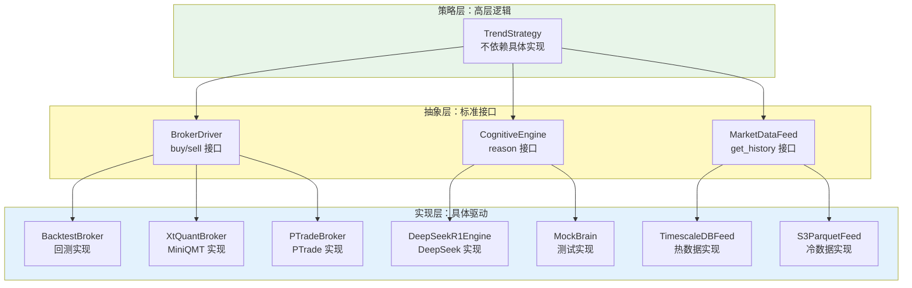

# L3 · 接口抽象层规约

> [!NOTE] **[TRACEBACK] 原子规约锚点**
> - **顶层概念**: [一句话定义与核心价值](../../01_顶层概念/01_一句话定义与核心价值.md)
> - **战略维度**: [经纪商解耦与冗余维度](../../02_战略维度/产品设计/08_经纪商解耦与冗余维度.md)
> - **战略维度**: [研产同构维度](../../02_战略维度/产品设计/06_研产同构维度.md)
> - **原子规约**: [三位一体仓库规约](./02_三位一体仓库规约.md)
> - **对应 DNA**: `_System_DNA/dna_05_interface_abstraction.yaml`；数据分层与热数据存储见 `global_const.data_architecture`
> - **本文档**: L3 层级，定义接口抽象层规约

## 原则：Dependency Inversion（依赖倒置）

**位置**：`diting-core/diting/abstraction/`

**规则**：高层策略不应依赖底层细节，两者都应依赖抽象接口。

**好处**：
- **模拟/实盘同构**：让策略在回测 (BacktestBroker) 和实盘 (XtQuantBroker) 跑完全相同的代码
- **供应商解耦**：未来如果切换到 PTrade 或其他券商，无需修改策略逻辑

---

## A. 交易执行抽象 (The Broker Interface)

### 文件位置

`diting-core/diting/abstraction/broker.py`

### 战略目的

1. **模拟/实盘同构**：让策略在回测 (BacktestBroker) 和实盘 (XtQuantBroker) 跑完全相同的代码
2. **供应商解耦**：未来如果切换到 PTrade 或其他券商，无需修改策略逻辑

### 接口定义

```python
from abc import ABC, abstractmethod
from typing import Dict, List
from diting.protocols.execution_pb2 import TradeOrder, OrderStatus

class BrokerDriver(ABC):
    """
    交易网关的标准接口。
    无论是 MiniQMT, PTrade 还是 回测引擎，都必须实现这个类。
    """
    
    @abstractmethod
    def get_cash_balance(self) -> float:
        """获取当前可用资金"""
        pass
    
    @abstractmethod
    def get_positions(self) -> Dict[str, int]:
        """
        获取当前持仓
        :return: {symbol: quantity}
        """
        pass
    
    @abstractmethod
    def place_order(self, order: TradeOrder) -> str:
        """
        下单接口
        :param order: 基于 Protobuf 定义的标准订单对象
        :return: order_id (系统内部ID)
        """
        pass
    
    @abstractmethod
    def cancel_order(self, order_id: str) -> bool:
        """撤单接口"""
        pass
    
    @abstractmethod
    def get_order_status(self, order_id: str) -> OrderStatus:
        """查询订单状态 (用于异步轮询)"""
        pass
```

### 实现示例

#### 回测 Broker（BacktestBroker）

```python
from diting.abstraction.broker import BrokerDriver
from diting.protocols.execution_pb2 import TradeOrder

class BacktestBroker(BrokerDriver):
    """回测引擎的 Broker 实现"""
    
    def __init__(self, initial_cash: float):
        self.cash = initial_cash
        self.positions = {}
        self.orders = {}
    
    def place_order(self, order: TradeOrder) -> str:
        # 回测逻辑：直接成交，不涉及真实券商
        order_id = f"backtest_{order.order_id}"
        self.orders[order_id] = order
        # ... 模拟成交逻辑
        return order_id
```

#### 实盘 Broker（XtQuantBroker）

```python
from diting.abstraction.broker import BrokerDriver
from diting.drivers.xtquant_driver import XtQuantClient

class XtQuantBroker(BrokerDriver):
    """MiniQMT 的 Broker 实现"""
    
    def __init__(self, account_id: str):
        self.client = XtQuantClient(account_id)
    
    def place_order(self, order: TradeOrder) -> str:
        # 封装 MiniQMT 原生接口
        return self.client.order_stock(
            symbol=order.symbol,
            quantity=order.quantity,
            price=order.price
        )
```

### 使用示例

```python
# 策略代码（不关心具体 Broker 实现）
from diting.abstraction.broker import BrokerDriver
from diting.protocols.execution_pb2 import TradeOrder

class TrendStrategy:
    def __init__(self, broker: BrokerDriver):  # 依赖抽象，不依赖具体实现
        self.broker = broker
    
    def execute_signal(self, signal):
        order = TradeOrder(
            symbol=signal.symbol,
            quantity=100,
            price=signal.price
        )
        order_id = self.broker.place_order(order)  # 调用抽象接口
        return order_id

# 回测时
strategy = TrendStrategy(BacktestBroker(initial_cash=1000000))

# 实盘时
strategy = TrendStrategy(XtQuantBroker(account_id="123456"))
```

---

## B. 大脑认知抽象 (The Brain Interface)

### 文件位置

`diting-core/diting/abstraction/brain.py`

### 战略目的

1. **模型迭代**：能够在 DeepSeek-R1 (推理强)、GPT-4o (指令强) 或 本地 Llama 3 (隐私强) 之间无缝切换
2. **Mock 测试**：在单元测试中，使用 MockBrain 返回固定结果，无需消耗 Token 且速度极快

### 接口定义

```python
from abc import ABC, abstractmethod
from typing import List, Dict, Any
from diting.protocols.brain_pb2 import ExpertOpinion

class CognitiveEngine(ABC):
    """
    认知引擎的标准接口。
    MoE 的 Router 和 Sub-Agents 依赖此接口，而不是具体的 HTTP Client。
    """
    
    @abstractmethod
    def reason(
        self, 
        context_text: str, 
        schema: dict
    ) -> dict:
        """
        通用推理接口
        :param context_text: 新闻/公告/行情摘要
        :param schema: 期望输出的 JSON Schema (Pydantic)
        :return: 符合 Schema 的结构化数据
        """
        pass
    
    @abstractmethod
    def audit_thought_process(self, session_id: str) -> str:
        """
        获取思维链 (CoT) 日志
        用于 LangFuse 审计
        :param session_id: 推理会话 ID
        :return: CoT 日志文本
        """
        pass
```

### 实现示例

#### DeepSeek-R1 实现

```python
from diting.abstraction.brain import CognitiveEngine
from diting.drivers.deepseek_driver import DeepSeekClient

class DeepSeekR1Engine(CognitiveEngine):
    """DeepSeek-R1 的实现"""
    
    def __init__(self, api_key: str):
        self.client = DeepSeekClient(api_key)
    
    def reason(self, context_text: str, schema: dict) -> dict:
        # 调用 DeepSeek-R1 API，返回符合 Schema 的数据
        response = self.client.chat_completion(
            messages=[{"role": "user", "content": context_text}],
            response_format={"type": "json_schema", "schema": schema}
        )
        return response.choices[0].message.content
```

#### Mock 实现（用于测试）

```python
from diting.abstraction.brain import CognitiveEngine

class MockBrain(CognitiveEngine):
    """Mock 实现，用于单元测试"""
    
    def reason(self, context_text: str, schema: dict) -> dict:
        # 返回固定结果，不消耗 Token
        return {
            "is_supported": True,
            "confidence": 0.8,
            "reasoning_summary": "Mock reasoning"
        }
```

---

## C. 数据源抽象 (The Data Feed Interface)

### 文件位置

`diting-core/diting/abstraction/feed.py`

### 战略目的

1. **数据清洗防火墙**：在这里统一植入 Great Expectations 校验
2. **冷热分离**：对上层透明地从 Redis (热) 或 S3 Parquet (冷) 获取数据

### 接口定义

```python
from abc import ABC, abstractmethod
from typing import List
import pandas as pd

class MarketDataFeed(ABC):
    """
    行情数据源标准接口。
    屏蔽了底层的 SQL, CSV, API 差异。
    """
    
    @abstractmethod
    def get_history(
        self, 
        symbol: str, 
        period: str, 
        limit: int
    ) -> pd.DataFrame:
        """
        获取历史 K 线
        :param symbol: 标的代码
        :param period: 周期 (1d, 1h, 1m)
        :param limit: 条数限制
        :return: DataFrame [datetime, open, high, low, close, volume]
                 (必须强制类型检查，防止 string 混入 float)
        """
        pass
    
    @abstractmethod
    def get_snapshot(self, symbols: List[str]) -> pd.DataFrame:
        """
        获取最新一笔 Tick 快照 (用于实时监控)
        :param symbols: 标的代码列表
        :return: DataFrame [symbol, price, volume, timestamp]
        """
        pass
```

### 实现示例

#### TimescaleDB 实现（热数据）

```python
from diting.abstraction.feed import MarketDataFeed
import pandas as pd
from diting.drivers.timescaledb_driver import TimescaleDBClient
import great_expectations as ge

class TimescaleDBFeed(MarketDataFeed):
    """TimescaleDB 热数据实现"""
    
    def __init__(self, db_client: TimescaleDBClient):
        self.client = db_client
        self.ge_validator = ge.validator  # Great Expectations 校验器
    
    def get_history(self, symbol: str, period: str, limit: int) -> pd.DataFrame:
        # 从 TimescaleDB 查询
        df = self.client.query(f"""
            SELECT datetime, open, high, low, close, volume
            FROM ohlcv
            WHERE symbol = '{symbol}' AND period = '{period}'
            ORDER BY datetime DESC
            LIMIT {limit}
        """)
        
        # Great Expectations 校验
        self.ge_validator.expect_column_values_to_be_between(
            "close", min_value=0, max_value=1000000
        )
        self.ge_validator.expect_column_values_to_not_be_null("close")
        
        return df
```

#### S3 Parquet 实现（冷数据）

```python
from diting.abstraction.feed import MarketDataFeed
import pandas as pd
from diting.drivers.s3_driver import S3Client

class S3ParquetFeed(MarketDataFeed):
    """S3 Parquet 冷数据实现"""
    
    def __init__(self, s3_client: S3Client, bucket: str):
        self.client = s3_client
        self.bucket = bucket
    
    def get_history(self, symbol: str, period: str, limit: int) -> pd.DataFrame:
        # 从 S3 读取 Parquet 文件
        key = f"ohlcv/{symbol}/{period}.parquet"
        df = pd.read_parquet(
            self.client.get_object(Bucket=self.bucket, Key=key)
        )
        return df.tail(limit)
```

---

## 抽象层架构图



---

## 接口抽象层的价值

### 1. 研产同构

**问题**：回测用 Backtrader，实盘用 MiniQMT，两套代码逻辑不一致。

**解决**：策略代码只依赖 `BrokerDriver` 抽象接口，回测和实盘都实现同一个接口。

### 2. 供应商解耦

**问题**：代码深度绑定 MiniQMT，换券商需要重写所有策略代码。

**解决**：策略代码只依赖 `BrokerDriver`，换券商只需新写一个 Driver 实现。

### 3. 测试友好

**问题**：单元测试需要真实 API，消耗 Token 和成本。

**解决**：使用 `MockBrain`、`MockBroker` 等 Mock 实现，测试快速且免费。

---

## 约束条件

1. **严禁直接依赖**：`diting/moe/`、`diting/strategy/` 下的代码严禁直接 `import xtquant` 或 `import deepseek`
2. **必须通过抽象层**：所有外部依赖必须通过 `abstraction/` 下的接口
3. **接口优先**：新增功能时，先定义抽象接口，再实现具体驱动

---

## 与战略维度的映射

| 战略维度 | 对应抽象接口 | 说明 |
|---------|------------|------|
| **研产同构** | `BrokerDriver` | 回测与实盘用同一套代码 |
| **经纪商解耦** | `BrokerDriver` | 支持多券商切换 |
| **成本治理** | `CognitiveEngine` | Mock 实现降低测试成本 |
| **数据架构** | `MarketDataFeed` | 冷热数据透明切换 |

---

## 下一步

→ 参见：
- [04_阶段规划与实践/](../04_阶段规划与实践/) 目录下的阶段实践文档
