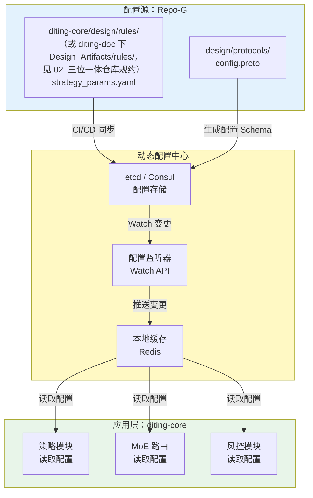
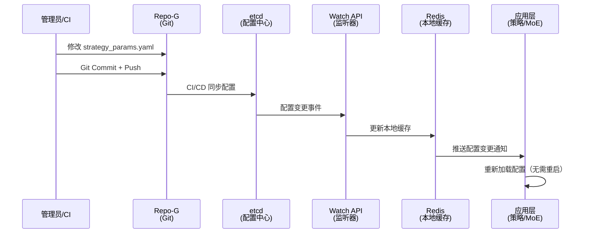
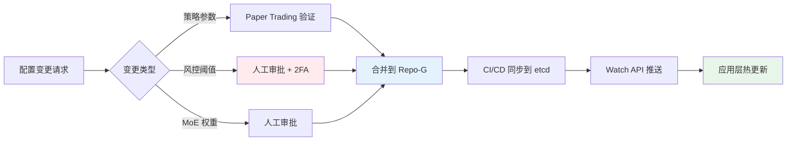

# L3 · 动态配置中心规约

> [!NOTE] **[TRACEBACK] 原子规约锚点**
> - **顶层概念**: [一句话定义与核心价值](../../01_顶层概念/01_一句话定义与核心价值.md)
> - **战略维度**: [技术栈与架构维度](../../02_战略维度/产品设计/02_技术栈与架构维度.md)
> - **原子规约**: [三位一体仓库规约](./02_三位一体仓库规约.md)
> - **对应 DNA**: `global_const.yaml#dynamic_config`
> - **本文档**: L3 层级，定义动态配置中心规约，解决"配置僵化"问题

## 问题：配置的僵化 (Config Rigidity)

### 痛点

**之前的方案**：策略参数（如 MA20 还是 MA30）隐含在代码里。如果市场风格切换，需要改代码 → 重新部署。这太慢了。

**生产级需求**：市场风格切换时，需要**秒级响应**，而不是分钟级的代码部署。

### 解决方案：动态配置中心

**核心原则**：**配置与代码分离**，配置变更无需重启服务。

---

## 架构设计

### 配置中心架构图



---

## A. 配置分层与存储

### 配置分层

| 层级 | 配置类型 | 存储位置 | 变更频率 | 生效方式 |
|------|---------|---------|---------|---------|
| **L1: 静态配置** | 数据库连接、API 密钥 | `diting-infra/secrets/` | 极低 | 重启生效 |
| **L2: 业务规则** | 策略参数（MA周期、止损比例） | `diting-core/design/rules/（或 diting-doc 下 _Design_Artifacts/rules/，见 02_三位一体仓库规约）` | 中频 | **热更新** |
| **L3: 运行时配置** | 当前市场状态、专家权重 | `etcd/` | 高频 | **秒级生效** |

### 存储位置

#### Repo-G: 配置定义（单一真相源）

```
diting-core/design/rules/（或 diting-doc 下 _Design_Artifacts/rules/，见 02_三位一体仓库规约）
├── strategy_params.yaml          # 策略参数定义
├── moe_weights.yaml               # MoE 专家权重
├── risk_thresholds.yaml           # 风控阈值
└── market_regime.yaml             # 市场状态配置
```

#### 配置中心: 运行时存储

- **etcd**（推荐）：K8s 原生，支持 Watch API
- **Consul**（备选）：服务发现 + 配置中心
- **Redis**（缓存层）：本地缓存，降低 etcd 压力

---

## B. 配置 Schema 定义

### Protocol Buffers Schema

```protobuf
syntax = "proto3";

package diting.config;

// 策略参数配置
message StrategyConfig {
  string strategy_name = 1;        // e.g., "Trend_MA"
  
  // 技术指标参数
  int32 ma_period_short = 2;      // MA20 → MA30（动态调整）
  int32 ma_period_long = 3;       // MA60 → MA120
  double stop_loss_ratio = 4;     // 止损比例（2% → 1.5%）
  
  // 市场状态适配
  enum MarketRegime {
    REGIME_TREND = 0;              // 趋势市场
    REGIME_RANGE = 1;              // 震荡市场
    REGIME_VOLATILE = 2;           // 高波动市场
  }
  MarketRegime current_regime = 5;
  
  // 生效时间戳（用于版本控制）
  int64 effective_at = 6;
}

// MoE 专家权重配置
message MoEWeightsConfig {
  map<string, double> expert_weights = 1;  // {"agri_agent": 0.4, "tech_agent": 0.6}
  double router_threshold = 2;            // 路由阈值
  int64 effective_at = 3;
}

// 风控阈值配置
message RiskThresholdsConfig {
  double max_single_trade_risk = 1;       // 单笔风险上限（2% → 1.5%）
  double max_drawdown_limit = 2;          // 最大回撤限制（12% → 10%）
  double min_payoff_ratio = 3;            // 最小盈亏比（1.5 → 2.0）
  int64 effective_at = 4;
}
```

### YAML 配置示例

```yaml
# diting-core/design/rules/strategy_params.yaml（或 _Design_Artifacts/rules/，见 02_三位一体仓库规约）
strategies:
  Trend_MA:
    ma_period_short: 20        # 可动态调整为 30
    ma_period_long: 60         # 可动态调整为 120
    stop_loss_ratio: 0.02      # 可动态调整为 0.015
    current_regime: REGIME_TREND
  
  Reversion_RSI:
    rsi_period: 14
    oversold_threshold: 30
    overbought_threshold: 70
    current_regime: REGIME_RANGE

# 市场状态切换规则
market_regime_rules:
  trend_detection:
    ma_cross_threshold: 0.05   # MA 交叉幅度阈值
  volatility_threshold:
    atr_ratio: 0.03            # ATR 比率阈值
```

---

## C. 配置热更新机制

### 配置变更流程



### 配置监听器实现

```python
# diting-core/diting/config/watcher.py
from typing import Callable
import etcd3
import json

class ConfigWatcher:
    """配置监听器：监听 etcd 配置变更"""
    
    def __init__(self, etcd_client: etcd3.Client):
        self.client = etcd_client
        self.callbacks: dict[str, Callable] = {}
    
    def watch_config(self, key: str, callback: Callable):
        """监听配置变更"""
        self.callbacks[key] = callback
        
        # Watch etcd key
        for event in self.client.watch(key):
            if event:
                new_config = json.loads(event.value)
                callback(new_config)  # 触发回调，应用层重新加载配置
    
    def get_config(self, key: str) -> dict:
        """获取当前配置（带本地缓存）"""
        # 先从 Redis 缓存读取
        cached = redis_client.get(f"config:{key}")
        if cached:
            return json.loads(cached)
        
        # 缓存未命中，从 etcd 读取
        value, _ = self.client.get(key)
        config = json.loads(value)
        
        # 写入缓存
        redis_client.setex(f"config:{key}", 300, value)  # 5分钟过期
        return config
```

### 应用层配置读取

```python
# diting-core/diting/strategy/trend_ma.py
from diting.config.watcher import ConfigWatcher

class TrendMAStrategy:
    def __init__(self, config_watcher: ConfigWatcher):
        self.watcher = config_watcher
        self.config = self.watcher.get_config("strategy/Trend_MA")
        
        # 注册配置变更回调
        self.watcher.watch_config("strategy/Trend_MA", self._on_config_change)
    
    def _on_config_change(self, new_config: dict):
        """配置变更回调：热更新，无需重启"""
        self.config = new_config
        logger.info(f"配置已更新: MA周期={new_config['ma_period_short']}")
    
    def calculate_signal(self, data: pd.DataFrame):
        """使用动态配置计算信号"""
        ma_short = data['close'].rolling(self.config['ma_period_short']).mean()
        ma_long = data['close'].rolling(self.config['ma_period_long']).mean()
        # ... 信号计算逻辑
```

---

## D. 配置版本控制与回滚

### 配置版本管理

**原则**：所有配置变更必须记录版本号，支持一键回滚。

```yaml
# etcd 存储结构
/config/strategy/Trend_MA/
  ├── current -> v3              # 当前版本（符号链接）
  ├── v1: {ma_period_short: 20, ...}
  ├── v2: {ma_period_short: 25, ...}
  └── v3: {ma_period_short: 30, ...}
```

### 回滚机制

```python
# diting-core/diting/config/manager.py
class ConfigManager:
    def rollback_config(self, key: str, version: str):
        """回滚到指定版本"""
        # 从 etcd 读取历史版本
        old_config = self.client.get(f"{key}/{version}")
        
        # 更新当前版本
        self.client.put(f"{key}/current", old_config)
        
        # 触发 Watch 事件，应用层自动重新加载
        logger.info(f"配置已回滚到版本 {version}")
```

---

## E. 配置变更审批流程

### 变更审批矩阵

| 配置类型 | 变更影响 | 审批要求 | 生效方式 |
|---------|---------|---------|---------|
| **策略参数** | 影响交易信号 | 人工审批 + Paper Trading 验证 | 热更新 |
| **风控阈值** | 影响风险控制 | **必须人工审批** + 2FA | 热更新 |
| **MoE 权重** | 影响专家路由 | 人工审批 | 热更新 |
| **市场状态** | 影响策略选择 | 自动检测 + 人工确认 | 热更新 |

### 变更流程



---

## F. 配置校验与防御

### Schema 校验

**原则**：配置变更必须通过 Schema 校验，防止错误配置导致系统故障。

```python
# diting-core/diting/config/validator.py
from pydantic import BaseModel, validator

class StrategyConfigSchema(BaseModel):
    ma_period_short: int
    ma_period_long: int
    stop_loss_ratio: float
    
    @validator('ma_period_short')
    def validate_ma_short(cls, v):
        if not (5 <= v <= 50):
            raise ValueError("MA短期周期必须在 5-50 之间")
        return v
    
    @validator('stop_loss_ratio')
    def validate_stop_loss(cls, v):
        if not (0.01 <= v <= 0.05):
            raise ValueError("止损比例必须在 1%-5% 之间")
        return v
```

### 配置变更防御

1. **范围检查**：配置值必须在合理范围内（如 MA周期 5-50，止损比例 1%-5%）
2. **依赖检查**：配置变更必须满足依赖关系（如 MA短期 < MA长期）
3. **影响评估**：配置变更前，自动评估对现有持仓的影响

---

## 与战略维度的映射

| 战略维度 | 对应配置 | 说明 |
|---------|---------|------|
| **技术栈与架构** | 数据库连接、API 端点 | L1 静态配置 |
| **数据架构** | 数据源配置 | L1 静态配置 |
| **研产同构** | 回测/实盘参数 | L2 业务规则 |
| **成本治理** | 资源配额配置 | L2 业务规则；成本相关阈值与策略见 `global_const.cost_governance` |

---

## 下一步

→ 参见：
- [07_数据版本控制规约.md](./07_数据版本控制规约.md)
- [08_心跳协议与健康检查规约.md](./08_心跳协议与健康检查规约.md)
