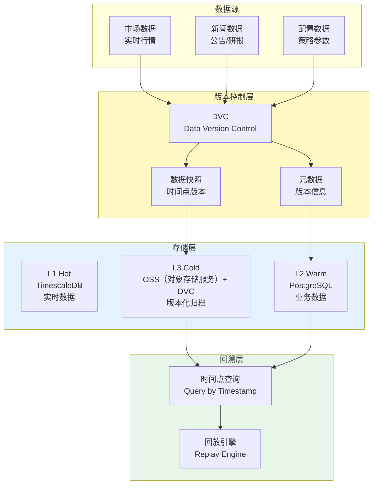
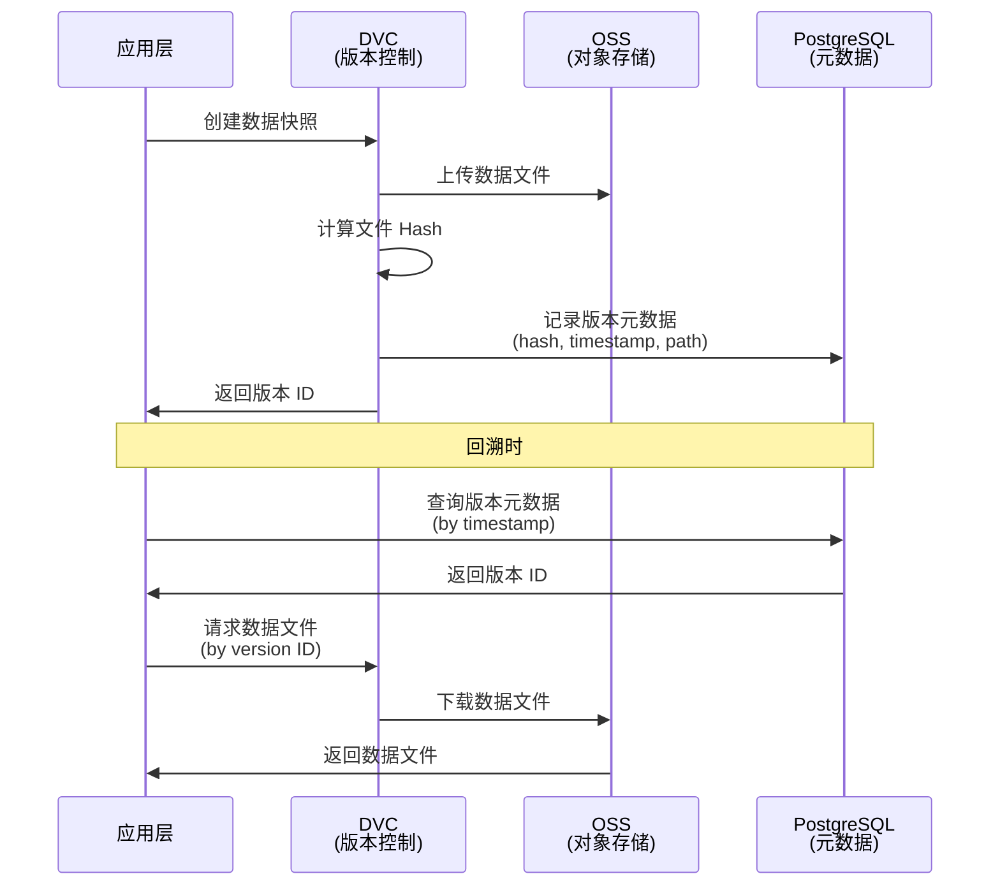

# L3 · 数据版本控制规约

> [!NOTE] **[TRACEBACK] 原子规约锚点**
> - **顶层概念**: [一句话定义与核心价值](../../01_顶层概念/01_一句话定义与核心价值.md)
> - **战略维度**: [数据架构与分层存储维度](../../02_战略维度/产品设计/03_数据架构与分层存储维度.md)
> - **原子规约**: [三位一体仓库规约](./02_三位一体仓库规约.md)
> - **对应 DNA**: `global_const.yaml#data_version_control`；L1/L2/L3 存储选型与 RPO 见 `global_const.data_architecture`
> - **本文档**: L3 层级，定义数据版本控制规约，解决"数据不可回溯"问题

## 问题：数据的不可回溯 (Data Amnesia)

### 痛点

**之前的方案**：我们谈了存数据，但没谈数据版本控制 (DVC)。如果 3 个月后您想复现今天的某个决策，发现数据文件已经被覆盖了，复利就成了玄学。

**生产级需求**：**所有决策必须可回溯**，包括：
- 决策时使用的数据快照
- 决策时的配置版本
- 决策时的市场状态

### 解决方案：数据版本控制 (DVC)

**核心原则**：**数据即资产，版本即时间线**。所有数据变更必须记录版本，支持时间点回溯。

---

## 架构设计

### 数据版本控制架构图



---

## A. 数据版本化策略

### 版本化粒度

| 数据类型 | 版本化粒度 | 存储位置 | 保留期限 |
|---------|-----------|---------|---------|
| **市场数据（OHLCV）** | 按交易日版本化 | L3 Cold (OSS + DVC) | 永久保留 |
| **新闻/公告数据** | 按小时版本化 | L3 Cold (OSS + DVC) | 1年 |
| **配置快照** | 按变更版本化 | L2 Warm (PostgreSQL) | 永久保留 |
| **决策快照** | 按决策时间点版本化 | L3 Cold (OSS + DVC) | 永久保留 |

### 版本标识规则

**格式**：`{data_type}_{timestamp}_{hash}`

**示例**：
- `ohlcv_20260211_143000_abc123.parquet`（2026-02-11 14:30:00 的市场数据快照）
- `news_20260211_120000_def456.parquet`（2026-02-11 12:00:00 的新闻数据快照）
- `decision_20260211_143500_ghi789.json`（2026-02-11 14:35:00 的决策快照）

---

## B. 决策快照规约

### 决策快照 Schema

```protobuf
syntax = "proto3";

package diting.snapshot;

// 决策快照（用于回溯）
message DecisionSnapshot {
  string decision_id = 1;              // 决策 ID（UUID）
  int64 timestamp = 2;                 // 决策时间戳（Unix 时间）
  
  // 数据版本引用
  DataVersions data_versions = 3;
  
  // 配置版本引用
  ConfigVersions config_versions = 4;
  
  // 决策输入
  DecisionInput input = 5;
  
  // 决策输出
  DecisionOutput output = 6;
  
  // 市场状态
  MarketState market_state = 7;
}

// 数据版本引用
message DataVersions {
  string ohlcv_version = 1;            // OHLCV 数据版本（DVC hash）
  string news_version = 2;             // 新闻数据版本（DVC hash）
  string knowledge_graph_version = 3;  // 知识图谱版本（DVC hash）
}

// 配置版本引用
message ConfigVersions {
  string strategy_config_version = 1;  // 策略配置版本（Git commit hash）
  string moe_weights_version = 2;     // MoE 权重版本（Git commit hash）
  string risk_thresholds_version = 3;  // 风控阈值版本（Git commit hash）
}

// 决策输入
message DecisionInput {
  string symbol = 1;
  repeated ExpertOpinion expert_opinions = 2;  // 专家意见
  QuantSignal quant_signal = 3;                // 量化信号
}

// 决策输出
message DecisionOutput {
  Verdict verdict = 1;                 // 判官裁决
  TradeOrder order = 2;                // 交易指令（如果有）
}

// 市场状态
message MarketState {
  double vix = 1;                      // 波动率指数
  string market_regime = 2;             // 市场状态（Trend/Range/Volatile）
  repeated string major_events = 3;      // 重大事件列表
}
```

### 决策快照存储

**存储位置**：`L3 Cold (OSS) + DVC`

**目录结构**：
```
oss://diting-snapshots/
├── decisions/
│   ├── 2026/
│   │   ├── 02/
│   │   │   ├── 11/
│   │   │   │   ├── decision_20260211_143500_ghi789.json
│   │   │   │   └── decision_20260211_150000_jkl012.json
│   │   │   └── ...
│   │   └── ...
│   └── ...
├── data/
│   ├── ohlcv/
│   │   ├── 2026/
│   │   │   ├── 02/
│   │   │   │   ├── 11/
│   │   │   │   │   ├── ohlcv_20260211_143000_abc123.parquet
│   │   │   │   │   └── ...
│   │   │   │   └── ...
│   │   │   └── ...
│   │   └── ...
│   └── news/
│       └── ...
└── .dvc/                              # DVC 元数据
    ├── cache/
    └── config
```

---

## C. DVC (Data Version Control) 集成

### DVC 工作流



### DVC 配置示例

```yaml
# .dvc/config
remote:
  oss:
    url: oss://diting-snapshots/data/
    endpointurl: https://oss-cn-hangzhou.aliyuncs.com
    access_key_id: ${ALIYUN_ACCESS_KEY_ID}
    secret_access_key: ${ALIYUN_SECRET_ACCESS_KEY}

cache:
  dir: .dvc/cache
  type: hardlink,symlink,reflink,copy
```

### DVC 操作命令

```bash
# 添加数据文件到版本控制
dvc add data/ohlcv_20260211_143000.parquet

# 提交版本
dvc commit -m "Snapshot: OHLCV data at 2026-02-11 14:30:00"

# 推送到远程存储
dvc push

# 回溯到指定版本
dvc checkout data/ohlcv_20260211_143000.parquet.dvc
```

---

## D. 时间点查询接口

### 查询接口定义

```python
# diting-core/diting/data/versioned_query.py
from typing import Optional
from datetime import datetime
import pandas as pd

class VersionedDataQuery:
    """时间点查询接口：根据时间戳回溯数据"""
    
    def get_ohlcv_at(
        self, 
        symbol: str, 
        timestamp: datetime,
        lookback_days: int = 30
    ) -> pd.DataFrame:
        """
        获取指定时间点的 OHLCV 数据快照
        :param symbol: 标的代码
        :param timestamp: 时间点（精确到秒）
        :param lookback_days: 回溯天数（默认30天）
        :return: DataFrame [datetime, open, high, low, close, volume]
        """
        # 1. 查询时间点对应的数据版本
        version_id = self._get_version_id("ohlcv", timestamp)
        
        # 2. 从 DVC 拉取数据文件
        data_file = self._dvc_checkout(version_id)
        
        # 3. 读取并过滤数据
        df = pd.read_parquet(data_file)
        df = df[
            (df['symbol'] == symbol) & 
            (df['datetime'] >= timestamp - pd.Timedelta(days=lookback_days)) &
            (df['datetime'] <= timestamp)
        ]
        return df
    
    def get_decision_snapshot(
        self, 
        decision_id: str
    ) -> DecisionSnapshot:
        """
        获取决策快照（包含所有数据版本引用）
        """
        # 从 OSS 读取决策快照 JSON
        snapshot_json = self._oss_get(f"decisions/{decision_id}.json")
        return DecisionSnapshot.from_json(snapshot_json)
    
    def replay_decision(
        self, 
        decision_id: str
    ) -> dict:
        """
        回放决策：使用原始数据和配置重新计算决策
        """
        # 1. 获取决策快照
        snapshot = self.get_decision_snapshot(decision_id)
        
        # 2. 回溯数据版本
        ohlcv_data = self.get_ohlcv_at(
            snapshot.input.symbol,
            datetime.fromtimestamp(snapshot.timestamp)
        )
        
        # 3. 回溯配置版本
        config = self._get_config_version(snapshot.config_versions.strategy_config_version)
        
        # 4. 重新计算决策
        result = self._recompute_decision(ohlcv_data, config, snapshot.input)
        return result
```

---

## E. 数据版本元数据管理

### 元数据 Schema

```sql
-- PostgreSQL 表：数据版本元数据
CREATE TABLE data_versions (
    id SERIAL PRIMARY KEY,
    data_type VARCHAR(50) NOT NULL,        -- 'ohlcv', 'news', 'config'
    version_id VARCHAR(100) NOT NULL,      -- DVC hash 或 Git commit hash
    timestamp TIMESTAMP NOT NULL,           -- 数据时间戳
    file_path VARCHAR(500) NOT NULL,       -- OSS 路径
    file_size BIGINT,                       -- 文件大小（字节）
    checksum VARCHAR(64),                  -- SHA256 校验和
    created_at TIMESTAMP DEFAULT NOW(),
    UNIQUE(data_type, version_id)
);

CREATE INDEX idx_data_versions_timestamp ON data_versions(timestamp);
CREATE INDEX idx_data_versions_type ON data_versions(data_type);
```

### 元数据查询接口

```python
# diting-core/diting/data/metadata.py
class DataVersionMetadata:
    """数据版本元数据管理"""
    
    def record_version(
        self,
        data_type: str,
        version_id: str,
        timestamp: datetime,
        file_path: str,
        file_size: int,
        checksum: str
    ):
        """记录数据版本元数据"""
        # 插入到 PostgreSQL
        self.db.execute("""
            INSERT INTO data_versions 
            (data_type, version_id, timestamp, file_path, file_size, checksum)
            VALUES (%s, %s, %s, %s, %s, %s)
        """, (data_type, version_id, timestamp, file_path, file_size, checksum))
    
    def get_version_by_timestamp(
        self,
        data_type: str,
        timestamp: datetime
    ) -> Optional[dict]:
        """根据时间戳查询数据版本"""
        # 查询最接近时间戳的版本
        result = self.db.execute("""
            SELECT * FROM data_versions
            WHERE data_type = %s
            AND timestamp <= %s
            ORDER BY timestamp DESC
            LIMIT 1
        """, (data_type, timestamp))
        return result.fetchone()
```

---

## F. 数据版本化最佳实践

### 1. 自动版本化

**原则**：所有数据写入时自动创建版本快照。

```python
# diting-core/diting/data/versioned_writer.py
class VersionedDataWriter:
    """自动版本化的数据写入器"""
    
    def write_ohlcv(self, data: pd.DataFrame, timestamp: datetime):
        """写入 OHLCV 数据并自动创建版本"""
        # 1. 写入 L1 Hot (TimescaleDB)
        self.timescaledb.insert(data)
        
        # 2. 创建版本快照（每小时一次）
        if self._should_create_snapshot(timestamp):
            snapshot_file = f"data/ohlcv/ohlcv_{timestamp.strftime('%Y%m%d_%H%M%S')}.parquet"
            data.to_parquet(snapshot_file)
            
            # 3. 添加到 DVC
            dvc.add(snapshot_file)
            version_id = dvc.commit(f"Snapshot: OHLCV at {timestamp}")
            
            # 4. 记录元数据
            self.metadata.record_version(
                data_type="ohlcv",
                version_id=version_id,
                timestamp=timestamp,
                file_path=snapshot_file,
                file_size=os.path.getsize(snapshot_file),
                checksum=self._calculate_checksum(snapshot_file)
            )
```

### 2. 版本清理策略

**原则**：保留所有决策相关的数据版本，定期清理冗余版本。

| 数据类型 | 保留策略 | 清理规则 |
|---------|---------|---------|
| **决策快照** | 永久保留 | 不清理 |
| **OHLCV 数据** | 保留最近1年每日版本，1年以上保留月度版本 | 自动清理 |
| **新闻数据** | 保留最近1年 | 1年后自动清理 |
| **配置快照** | 永久保留 | 不清理 |

### 3. 版本完整性校验

**原则**：定期校验数据版本的完整性，防止数据损坏。

```python
# diting-core/diting/data/integrity_checker.py
class DataIntegrityChecker:
    """数据版本完整性校验器"""
    
    def verify_version(self, version_id: str) -> bool:
        """校验数据版本完整性"""
        # 1. 从元数据获取文件路径和校验和
        metadata = self.metadata.get_version_by_id(version_id)
        
        # 2. 从 OSS 下载文件
        file_content = self.oss.get(metadata['file_path'])
        
        # 3. 计算校验和
        calculated_checksum = hashlib.sha256(file_content).hexdigest()
        
        # 4. 对比校验和
        return calculated_checksum == metadata['checksum']
```

---

## 与战略维度的映射

| 战略维度 | 对应数据版本化 | 说明 |
|---------|-------------|------|
| **数据架构** | OHLCV 数据版本化 | L1 Hot → L3 Cold 版本化归档 |
| **研产同构** | 回测数据版本化 | 回测结果可回溯 |
| **生产保障** | 决策快照版本化 | 决策可追溯、可审计 |

---

## 下一步

→ 参见：
- [08_心跳协议与健康检查规约.md](./08_心跳协议与健康检查规约.md)
