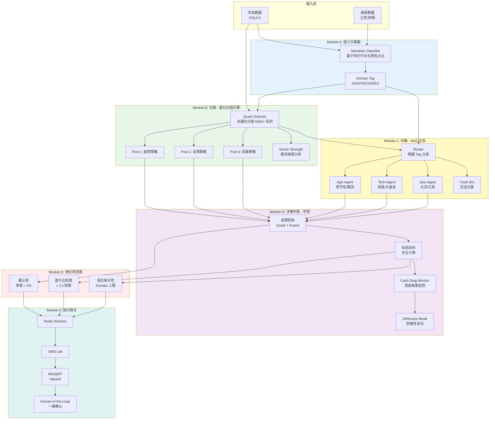
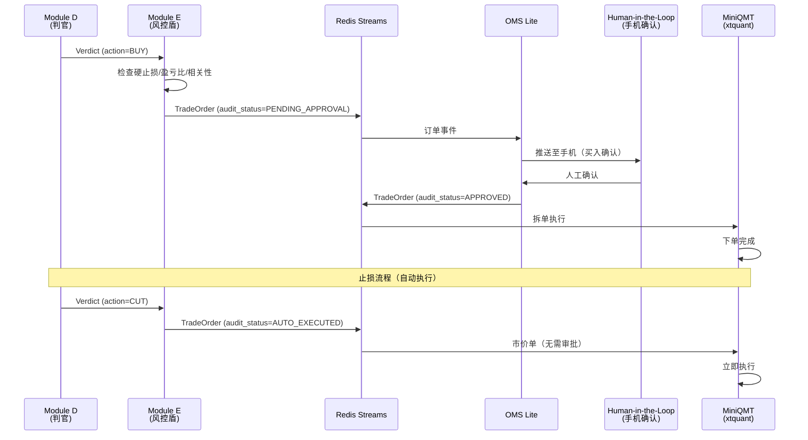
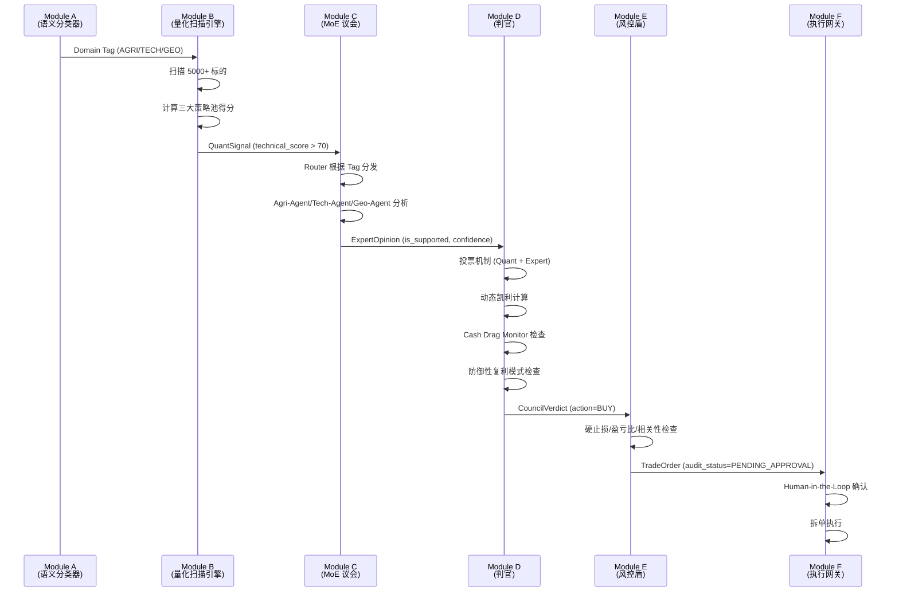

# L3 · 核心模块架构规约

> [!NOTE] **[TRACEBACK] 原子规约锚点**
> - **顶层概念**: [一句话定义与核心价值](../../01_顶层概念/01_一句话定义与核心价值.md)
> - **战略维度**: [技术栈与架构维度](../../02_战略维度/产品设计/02_技术栈与架构维度.md)
> - **原子规约**: [核心公式与MoE架构规约](./01_核心公式与MoE架构规约.md)
> - **原子规约**: [全链路通信协议矩阵](./04_全链路通信协议矩阵.md)
> - **对应 DNA**: `_System_DNA/core_modules/dna_module_*.yaml`（每模块独立）、`dna_09_core_modules_and_prod_req.yaml`（索引）；成本治理（Token 预算、熔断）见 `global_const.cost_governance`
> - **输入层数据来源**: [11_数据采集与输入层规约](./11_数据采集与输入层规约.md)；L4 实践见 Stage2_数据采集与存储
> - **本文档**: L3 层级，定义核心模块架构规约（Module A-F）

## 核心模块架构总览

**输入层说明**：图中「市场数据 OHLCV」「新闻数据 公告/研报」及 Module A 所需的申万行业、营收占比，其采集、写入与消费契约由 [11_数据采集与输入层规约](./11_数据采集与输入层规约.md) 定义；实现与验证见 [Stage2_数据采集与存储](../../04_阶段规划与实践/Stage2_数据采集与存储/README.md)。



**深度学习（Module B + 专家内推理）、专家路由（Module C）、约束封控（专家内一票否决 + Module E）** 的协作顺序与依赖关系见 [01_核心公式与MoE架构规约 · 深度学习、专家路由与约束封控的协作链路](./01_核心公式与MoE架构规约.md#深度学习专家路由与约束封控的协作链路)。

---

## 可部署单元与热路径

实盘采用**多服务**部署（方案 B）。以下**可部署单元**与 L4 阶段、DNA、部署一一对应；每个单元具备独立镜像、独立部署定义及本地/连调/线上测试链。

### 可部署单元清单

| 可部署单元 | 包含逻辑模块 | 部署形态 | 说明 |
|------------|--------------|----------|------|
| **数据采集与存储** | 采集与写入 L1/L2/L3 | 独立服务/Job | 见 [11_数据采集与输入层规约](./11_数据采集与输入层规约.md)；消费方为 Module A/B/C（通过 MarketDataFeed 等） |
| **Module A** | 语义分类器 | 独立服务 | 镜像、部署、验证链独立 |
| **Module B** | 量化扫描引擎 | 独立服务 | 同上 |
| **Module C** | MoE 议会 | 独立服务 | 同上 |
| **热路径 D+E+F** | Module D 判官 + Module E 风控盾 + Module F 执行网关 | **同一进程、同一镜像** | 见下「热路径同进程」 |

各单元镜像名、dockerfile_path、chart_path、scale_to_zero 见 `_System_DNA/global_const.yaml` 之 `deployable_units`。

### 热路径同进程（D+E+F）

**规定**：Module D、E、F 作为**一个可部署单元**部署，运行于**同一进程、同一镜像**。

**理由**：
- **延迟**：Kelly 计算与仓位决策要求延迟 < 100ms（见 [01_核心公式与MoE架构规约](./01_核心公式与MoE架构规约.md)）；D→E→F 为顺序、同步处理，同进程避免跨网络抖动。
- **顺序与一致性**：单信号一次（D 同步、E 同步低延迟）；同进程保证顺序执行与状态一致。
- **边界**：热路径与上游（Module C）通过进程内或约定协议通信；与执行层边界保持 [04_全链路通信协议矩阵](./04_全链路通信协议矩阵.md) 与 Redis Streams（E→F 写入订单流）不变。

**约束**：
- 热路径服务**常驻**（不 Scale-to-Zero），可弹性伸缩；见成本治理与部署规约。
- 接口与 09_ 各 Module D/E/F 小节一致；实现上 D、E、F 为同一进程内三个组件。

### 跨服务故障隔离（多服务部署）

多服务部署时，服务间调用或依赖须约定熔断与降级，避免级联故障。

| 维度 | 约定 |
|------|------|
| **依赖方向** | 数据采集与存储 → 无下游服务依赖；Module A → B/C 可异步/队列；B/C → 热路径（D+E+F）；热路径仅依赖 Redis/券商。上游不可用时下游可读缓存或拒绝本请求，不无限重试。 |
| **熔断** | 调用外部服务（如 LLM、行情 API）须熔断器：连续失败 N 次后熔断，T 秒后半开重试；见各 Module 错误处理表。 |
| **降级** | Module A 数据源不可用 → 用缓存；Module C LLM 不可用 → 规则引擎降级；Module E 异常 → Fail-Safe 拒绝所有交易。 |
| **恢复顺序** | 建议先恢复基础组件（DB、Redis），再恢复采集，再恢复 A/B/C，最后热路径；或按 K3s 依赖顺序由 deploy 控制。 |

详见本规约「错误处理与死信队列」及 [10_ 运营治理与灾备规约](./10_运营治理与灾备规约.md)。

---

## Module A: 语义分类器 (Semantic Classifier)

**可部署单元**：独立服务；镜像名、Chart、scale_to_zero 见 `global_const.deployable_units.module_a`。

### 功能定位

**核心原则**：**不做预测，只做分类**。基于申万行业分类与营收占比，给标的打上 Domain Tag。

### 输入/输出

| 输入 | 输出 |
|------|------|
| 标的代码（如 "000998.SZ"） | Domain Tag 列表（如 `[AGRI]`） |
| 申万行业分类 | 置信度分数（0.0-1.0） |
| 营收占比数据 | |

**Proto**：输出对应 [ClassifierOutput](_Design_Artifacts/protocols/classifier/classifier_output.proto)。

### 分类规则

```python
# diting-core/diting/classifier/semantic.py
from enum import Enum
from typing import List, Tuple

class DomainTag(Enum):
    AGRI = "AGRI"      # 农业（猪周期、气候）
    TECH = "TECH"      # 硬科技（半导体、AI）
    GEO = "GEO"        # 宏观（大宗商品、汇率）
    UNKNOWN = "UNKNOWN"  # 无法归类

class SemanticClassifier:
    """语义分类器：基于申万行业与营收占比分类"""
    
    def classify(self, symbol: str) -> List[Tuple[DomainTag, float]]:
        """
        分类标的
        :param symbol: 标的代码
        :return: [(DomainTag, confidence), ...] 按置信度降序排列
        """
        # 1. 获取申万行业分类
        industry = self._get_shenwan_industry(symbol)
        
        # 2. 获取营收占比数据
        revenue_breakdown = self._get_revenue_breakdown(symbol)
        
        # 3. 匹配 Domain Tag
        tags = []
        
        # 农业类：申万一级行业 = "农林牧渔" 或 营收占比 > 50%
        if industry == "农林牧渔" or revenue_breakdown.get("农业", 0) > 0.5:
            tags.append((DomainTag.AGRI, 0.9))
        
        # 科技类：申万一级行业 = "电子/计算机/通信" 或 研发投入占比 > 10%
        tech_industries = ["电子", "计算机", "通信", "传媒"]
        if industry in tech_industries or revenue_breakdown.get("科技", 0) > 0.5:
            tags.append((DomainTag.TECH, 0.85))
        
        # 宏观类：申万一级行业 = "有色金属/石油石化" 或 大宗商品营收占比 > 50%
        macro_industries = ["有色金属", "石油石化", "煤炭"]
        if industry in macro_industries or revenue_breakdown.get("大宗商品", 0) > 0.5:
            tags.append((DomainTag.GEO, 0.8))
        
        # 如果无法归类，返回 UNKNOWN
        if not tags:
            tags.append((DomainTag.UNKNOWN, 0.5))
        
        return sorted(tags, key=lambda x: x[1], reverse=True)
```

### 分类示例

| 标的 | 申万行业 | 营收占比 | Domain Tag |
|------|---------|---------|-----------|
| 隆平高科 | 农林牧渔 | 农业 85% | `[AGRI]` |
| 中芯国际 | 电子 | 半导体 90% | `[TECH]` |
| 紫金矿业 | 有色金属 | 黄金 60% | `[GEO]` |
| 无法归类标的 | - | - | `[UNKNOWN]` → Trash Bin |

---

## Module B: 左脑 - 量化扫描引擎 (Quant Engine)

**可部署单元**：独立服务；镜像名、Chart、scale_to_zero 见 `global_const.deployable_units.module_b`。

### 功能定位

**目标**：**机会丰度 (Opportunity Abundance)**。每日对 5000+ 标的进行向量化扫描，输出技术面得分 > 70 的候选池。

### Strategy Pools（多策略池）

#### Pool 1: 趋势策略 (Trend)

**信号条件**：
- 均线多头排列：MA5 > MA10 > MA20 > MA60
- MACD 水上金叉：MACD > 0 且 DIF > DEA（金叉）

**技术实现**：
```python
# diting-core/diting/strategy/trend.py
def trend_signal(data: pd.DataFrame) -> float:
    """趋势策略信号得分（0-100）"""
    # 均线多头排列得分（0-50）
    ma_score = 0
    if data['close'].rolling(5).mean() > data['close'].rolling(10).mean():
        ma_score += 10
    if data['close'].rolling(10).mean() > data['close'].rolling(20).mean():
        ma_score += 10
    if data['close'].rolling(20).mean() > data['close'].rolling(60).mean():
        ma_score += 10
    if all([...]):  # 完整多头排列
        ma_score += 20
    
    # MACD 水上金叉得分（0-50）
    macd_score = 0
    if macd > 0 and dif > dea:
        macd_score = 50
    
    return ma_score + macd_score
```

#### Pool 2: 反转策略 (Reversion)

**信号条件**：
- RSI < 20（超卖）
- 价格触及 Bollinger 下轨支撑

**技术实现**：
```python
# diting-core/diting/strategy/reversion.py
def reversion_signal(data: pd.DataFrame) -> float:
    """反转策略信号得分（0-100）"""
    # RSI 超卖得分（0-50）
    rsi = talib.RSI(data['close'], timeperiod=14)
    rsi_score = max(0, 50 - (rsi - 20) * 2) if rsi < 20 else 0
    
    # Bollinger 下轨支撑得分（0-50）
    upper, middle, lower = talib.BBANDS(data['close'])
    bb_score = 0
    if data['close'].iloc[-1] <= lower.iloc[-1] * 1.02:  # 触及下轨
        bb_score = 50
    
    return rsi_score + bb_score
```

#### Pool 3: 突破策略 (Breakout)

**信号条件**：
- 价格突破 20 日高点
- 成交量 > 2x 均量

**技术实现**：
```python
# diting-core/diting/strategy/breakout.py
def breakout_signal(data: pd.DataFrame) -> float:
    """突破策略信号得分（0-100）"""
    # 价格突破得分（0-50）
    high_20 = data['high'].rolling(20).max()
    breakout_score = 50 if data['close'].iloc[-1] > high_20.iloc[-1] else 0
    
    # 成交量放大得分（0-50）
    volume_ma = data['volume'].rolling(20).mean()
    volume_score = min(50, (data['volume'].iloc[-1] / volume_ma.iloc[-1] - 1) * 25)
    
    return breakout_score + volume_score
```

### Sector Strength（板块强弱分析）

**功能**：计算个股相对板块的强弱，剔除跟风杂毛。

```python
# diting-core/diting/strategy/sector_strength.py
def calculate_sector_strength(symbol: str, sector_symbols: List[str]) -> float:
    """
    计算个股相对板块强弱
    :param symbol: 标的代码
    :param sector_symbols: 板块内其他标的代码列表
    :return: 强弱得分（> 1.0 表示强于板块，< 1.0 表示弱于板块）
    """
    # 1. 计算标的收益率（最近20日）
    symbol_return = calculate_return(symbol, days=20)
    
    # 2. 计算板块平均收益率
    sector_returns = [calculate_return(s, days=20) for s in sector_symbols]
    sector_avg_return = np.mean(sector_returns)
    
    # 3. 计算相对强弱
    strength_ratio = symbol_return / sector_avg_return if sector_avg_return > 0 else 0
    
    return strength_ratio

# 过滤规则：只保留 strength_ratio > 1.1 的标的（强于板块 10% 以上）
```

### Scanner 实现

```python
# diting-core/diting/scanner/quant_scanner.py
class QuantScanner:
    """量化扫描引擎：向量化扫描全市场"""
    
    def scan_market(self, universe: List[str]) -> List[QuantSignal]:
        """
        扫描全市场
        :param universe: 标的池（5000+ 标的）
        :return: 技术面得分 > 70 的候选池
        """
        # 1. 批量获取市场数据（向量化）
        data = self._batch_fetch_ohlcv(universe)
        
        # 2. 并行计算三大策略池得分
        trend_scores = self._vectorized_trend(data)
        reversion_scores = self._vectorized_reversion(data)
        breakout_scores = self._vectorized_breakout(data)
        
        # 3. 计算 Sector Strength
        sector_strength = self._calculate_sector_strength(data)
        
        # 4. 过滤：技术面得分 > 70 且 Sector Strength > 1.1
        candidates = []
        for symbol in universe:
            max_score = max(
                trend_scores[symbol],
                reversion_scores[symbol],
                breakout_scores[symbol]
            )
            
            if max_score > 70 and sector_strength[symbol] > 1.1:
                candidates.append(QuantSignal(
                    symbol=symbol,
                    technical_score=max_score,
                    strategy_source=self._get_strategy_source(max_score, ...),
                    sector_strength=sector_strength[symbol]
                ))
        
        return candidates
```

**Proto**：输出对应 [QuantSignal](_Design_Artifacts/protocols/quant/quant_signal.proto)。

---

## Module C: 右脑 - 混合专家议会 (The MoE Council)

**可部署单元**：独立服务；镜像名、Chart、scale_to_zero 见 `global_const.deployable_units.module_c`。

### 功能定位

**核心原则**：**Router 根据 Tag 将候选标的分发给对应专家**，专家给出领域逻辑判断。

### Router 实现

```python
# diting-core/diting/moe/router.py
class MoERouter:
    """MoE 路由器：根据 Domain Tag 分发到对应专家"""
    
    def route(self, symbol: str, domain_tags: List[DomainTag], quant_signal: QuantSignal) -> List[ExpertOpinion]:
        """
        路由到对应专家
        :param symbol: 标的代码
        :param domain_tags: Domain Tag 列表（来自 Module A）
        :param quant_signal: 量化信号（来自 Module B）
        :return: 专家意见列表
        """
        opinions = []
        
        for tag in domain_tags:
            if tag == DomainTag.AGRI:
                opinion = self.agri_agent.analyze(symbol, quant_signal)
            elif tag == DomainTag.TECH:
                opinion = self.tech_agent.analyze(symbol, quant_signal)
            elif tag == DomainTag.GEO:
                opinion = self.geo_agent.analyze(symbol, quant_signal)
            else:
                # UNKNOWN -> Trash Bin
                opinion = ExpertOpinion(
                    symbol=symbol,
                    is_supported=False,
                    reasoning_summary="无法归类，逻辑不清"
                )
            
            opinions.append(opinion)
        
        return opinions
```

### Sub-Agents（垂类专家）

#### Agri-Agent（农业专家）

**关注点**：
- 季节性因素（如：猪周期、种植季节）
- 期货升贴水（如：大豆期货升水 → 利好农业股）

```python
# diting-core/diting/moe/specialists/agri_agent.py
class AgriAgent:
    """农业专家：关注季节性、期货升贴水"""
    
    def analyze(self, symbol: str, quant_signal: QuantSignal) -> ExpertOpinion:
        """分析农业标的"""
        # 1. 获取期货数据（如：大豆期货）
        futures_data = self._get_futures_data("大豆")
        
        # 2. 检查期货升贴水
        basis = futures_data['spot_price'] - futures_data['futures_price']
        is_contango = basis > 0  # 升水
        
        # 3. 检查季节性（如：拉尼娜现象）
        seasonal_factor = self._check_seasonal_factor()
        
        # 4. 生成专家意见
        if is_contango and seasonal_factor == "positive":
            return ExpertOpinion(
                symbol=symbol,
                is_supported=True,
                direction=SignalType.SIGNAL_BULLISH,
                confidence=0.8,
                reasoning_summary="拉尼娜现象导致大豆减产预期强烈，且期货升水"
            )
        else:
            return ExpertOpinion(
                symbol=symbol,
                is_supported=False,
                reasoning_summary="期货贴水或季节性因素不利"
            )
```

#### Tech-Agent（科技专家）

**关注点**：
- 研发投入占比（> 10% 为优）
- 大基金动向（如：国家大基金二期投资）

```python
# diting-core/diting/moe/specialists/tech_agent.py
class TechAgent:
    """科技专家：关注研发投入、大基金动向"""
    
    def analyze(self, symbol: str, quant_signal: QuantSignal) -> ExpertOpinion:
        """分析科技标的"""
        # 1. 获取研发投入占比
        r_d_ratio = self._get_r_d_ratio(symbol)
        
        # 2. 检查大基金动向
        big_fund_investment = self._check_big_fund_investment(symbol)
        
        # 3. 生成专家意见
        if r_d_ratio > 0.1 and big_fund_investment:
            return ExpertOpinion(
                symbol=symbol,
                is_supported=True,
                direction=SignalType.SIGNAL_BULLISH,
                confidence=0.85,
                reasoning_summary="研发投入占比高（{:.1%}），且大基金二期已投资".format(r_d_ratio)
            )
        else:
            return ExpertOpinion(
                symbol=symbol,
                is_supported=False,
                reasoning_summary="研发投入不足或大基金未投资"
            )
```

#### Geo-Agent（宏观专家）

**关注点**：
- 大宗商品价格（如：铜价、油价）
- 汇率变动（如：人民币汇率）

```python
# diting-core/diting/moe/specialists/geo_agent.py
class GeoAgent:
    """宏观专家：关注大宗商品、汇率"""
    
    def analyze(self, symbol: str, quant_signal: QuantSignal) -> ExpertOpinion:
        """分析宏观标的"""
        # 1. 获取大宗商品价格（如：铜价）
        copper_price = self._get_commodity_price("铜")
        copper_trend = self._calculate_trend(copper_price)
        
        # 2. 获取汇率数据
        usd_cny_rate = self._get_exchange_rate("USD/CNY")
        rate_trend = self._calculate_trend(usd_cny_rate)
        
        # 3. 生成专家意见
        if copper_trend == "upward" and rate_trend == "stable":
            return ExpertOpinion(
                symbol=symbol,
                is_supported=True,
                direction=SignalType.SIGNAL_BULLISH,
                confidence=0.75,
                reasoning_summary="铜价上涨且汇率稳定，利好有色金属板块"
            )
        else:
            return ExpertOpinion(
                symbol=symbol,
                is_supported=False,
                reasoning_summary="大宗商品价格或汇率不利"
            )
```

#### The Trash Bin（垃圾桶）

**功能**：无法归类或逻辑不清的标的，直接丢弃。

```python
# diting-core/diting/moe/trash_bin.py
class TrashBin:
    """垃圾桶：丢弃无法归类的标的"""
    
    def discard(self, symbol: str, reason: str):
        """丢弃标的"""
        logger.warning(f"标的 {symbol} 已丢弃，原因: {reason}")
        # 记录到审计日志
        self._log_to_audit(symbol, reason)
```

---

## Module D: 决策中枢 - 判官 (The Gavel)

### 功能定位

**核心原则**：**投票机制 + 动态凯利 + Cash Drag Monitor + 防御性复利模式**。

### 投票机制

**规则**：`Quant (Pass) + Expert (Strong Buy) = 有效信号`

```python
# diting-core/diting/gavel/voting.py
class VotingMechanism:
    """投票机制：Quant + Expert"""
    
    def vote(self, quant_signal: QuantSignal, expert_opinions: List[ExpertOpinion]) -> Verdict:
        """
        投票决策
        :param quant_signal: 量化信号（来自 Module B）
        :param expert_opinions: 专家意见列表（来自 Module C）
        :return: 判官裁决
        """
        # 1. Quant 投票：技术面得分 > 70 为 Pass
        quant_vote = quant_signal.technical_score > 70
        
        # 2. Expert 投票：至少一个专家 is_supported=True 且 direction=BULLISH
        expert_votes = [
            op for op in expert_opinions
            if op.is_supported and op.direction == SignalType.SIGNAL_BULLISH
        ]
        expert_vote = len(expert_votes) > 0
        
        # 3. 综合投票：Quant Pass + Expert Strong Buy = 有效信号
        if quant_vote and expert_vote:
            # 计算综合胜率（加权平均）
            win_rate = self._calculate_win_rate(quant_signal, expert_votes)
            
            return Verdict(
                action=Action.ACTION_BUY,
                win_rate_prediction=win_rate,
                primary_reasoning=expert_votes[0].reasoning_summary
            )
        else:
            return Verdict(
                action=Action.ACTION_PASS,
                win_rate_prediction=0.0,
                primary_reasoning="Quant 或 Expert 未通过"
            )
```

### 动态凯利

**规则**：根据 Expert 确信度调整仓位。

```python
# diting-core/diting/gavel/kelly.py
class DynamicKelly:
    """动态凯利：根据 Expert 确信度调整仓位"""
    
    def calculate_position(self, win_rate: float, payoff_ratio: float, expert_confidence: float) -> float:
        """
        计算建议仓位
        :param win_rate: 预测胜率（来自投票机制）
        :param payoff_ratio: 盈亏比（平均盈利 / 平均亏损）
        :param expert_confidence: Expert 确信度（0.0-1.0）
        :return: 建议仓位比例（0.0-1.0）
        """
        # 基础凯利公式
        base_kelly = (win_rate * payoff_ratio - (1 - win_rate)) / payoff_ratio
        
        # 根据 Expert 确信度调整
        adjusted_kelly = base_kelly * expert_confidence
        
        # 限制范围：0.0 - 1.0
        return max(0.0, min(1.0, adjusted_kelly))
```

### Cash Drag Monitor（现金拖累监控）

**关键保留项**：若空仓时间 > 5 天，自动降低 Module B 的筛选阈值。

```python
# diting-core/diting/gavel/cash_drag.py
class CashDragMonitor:
    """现金拖累监控：空仓时间过长时放宽筛选阈值"""
    
    def __init__(self):
        self.threshold_days = 5
        self.last_position_date = None
    
    def check_cash_drag(self) -> dict:
        """
        检查现金拖累
        :return: 调整后的筛选阈值
        """
        if self.last_position_date is None:
            return self._get_default_thresholds()
        
        days_empty = (datetime.now() - self.last_position_date).days
        
        if days_empty > self.threshold_days:
            # 放宽筛选阈值
            return {
                "rsi_threshold": 25,  # 从 20 放宽到 25
                "technical_score_threshold": 65,  # 从 70 降低到 65
                "sector_strength_threshold": 1.05  # 从 1.1 降低到 1.05
            }
        else:
            return self._get_default_thresholds()
    
    def _get_default_thresholds(self) -> dict:
        """默认阈值"""
        return {
            "rsi_threshold": 20,
            "technical_score_threshold": 70,
            "sector_strength_threshold": 1.1
        }
```

### 防御性复利模式 (Defensive Mode)

**关键保留项**：当年化收益达到 30%，触发防御性复利模式。

```python
# diting-core/diting/gavel/defensive_mode.py
class DefensiveMode:
    """防御性复利模式：锁定利润垫"""
    
    def __init__(self):
        self.target_annual_return = 0.30  # 30% 年化收益
        self.profit_lock_ratio = 0.25     # 锁定 25% 利润垫
    
    def check_defensive_mode(self, current_annual_return: float) -> bool:
        """
        检查是否触发防御性复利模式
        :param current_annual_return: 当前年化收益率
        :return: 是否触发防御模式
        """
        return current_annual_return >= self.target_annual_return
    
    def apply_defensive_rules(self, verdict: Verdict) -> Verdict:
        """
        应用防御性规则
        :param verdict: 原始裁决
        :return: 调整后的裁决
        """
        # 1. 胜率阈值从 80% 提至 90%
        if verdict.win_rate_prediction < 0.9:
            verdict.action = Action.ACTION_PASS
            verdict.primary_reasoning = "防御模式：胜率阈值已提至 90%"
        
        # 2. 仓位减半
        verdict.suggested_position_ratio *= 0.5
        
        # 3. 标记防御模式
        verdict.is_defensive_mode = True
        
        return verdict
```

---

## Module E: 绝对风控盾 (Risk Shield)

### 功能定位

**核心原则**：**纯 Python 硬编码规则（无 AI 参与）**，确保风控逻辑的确定性和可追溯性。

### 风控规则

#### 1. 硬止损

**规则**：单笔亏损 > 2% (或 ATR 下轨) -> 市价斩仓

```python
# diting-core/diting/risk/hard_stop.py
class HardStopLoss:
    """硬止损：单笔亏损 > 2% 或 ATR 下轨"""
    
    def check_stop_loss(self, position: Position, current_price: float) -> bool:
        """
        检查是否触发止损
        :param position: 持仓信息
        :param current_price: 当前价格
        :return: 是否触发止损
        """
        # 1. 固定止损：单笔亏损 > 2%
        loss_ratio = (position.entry_price - current_price) / position.entry_price
        if loss_ratio > 0.02:
            return True
        
        # 2. ATR 动态止损：价格跌破 ATR 下轨
        atr = self._calculate_atr(position.symbol, period=14)
        atr_lower = position.entry_price - 2.5 * atr
        if current_price < atr_lower:
            return True
        
        return False
    
    def execute_stop_loss(self, position: Position):
        """执行止损：市价斩仓"""
        logger.critical(f"触发硬止损：{position.symbol}，亏损比例: {loss_ratio:.2%}")
        # 市价单卖出
        order = TradeOrder(
            symbol=position.symbol,
            type=OrderType.MARKET,
            quantity=position.quantity,
            audit_status=AuditStatus.AUTO_EXECUTED  # 止损自动执行
        )
        broker.place_order(order)
```

#### 2. 盈亏比检查

**规则**：预期收益/风险 < 1.5 -> 拒绝开仓

```python
# diting-core/diting/risk/payoff_ratio.py
class PayoffRatioCheck:
    """盈亏比检查：预期收益/风险 < 1.5 拒绝开仓"""
    
    def check_payoff_ratio(self, expected_profit: float, expected_loss: float) -> bool:
        """
        检查盈亏比
        :param expected_profit: 预期收益
        :param expected_loss: 预期风险
        :return: 是否通过检查
        """
        if expected_loss == 0:
            return False
        
        payoff_ratio = expected_profit / expected_loss
        return payoff_ratio >= 1.5
```

#### 3. 组合相关性

**规则**：限制同一 Domain 的持仓总上限

```python
# diting-core/diting/risk/correlation.py
class CorrelationLimit:
    """组合相关性：限制同一 Domain 的持仓总上限"""
    
    def __init__(self):
        self.max_domain_exposure = 0.4  # 同一 Domain 最大暴露度 40%
    
    def check_domain_limit(self, new_position: Position, existing_positions: List[Position]) -> bool:
        """
        检查 Domain 持仓上限
        :param new_position: 新持仓
        :param existing_positions: 现有持仓列表
        :return: 是否超过上限
        """
        # 1. 获取新持仓的 Domain Tag
        domain_tag = classifier.classify(new_position.symbol)[0][0]
        
        # 2. 计算同一 Domain 的总暴露度
        domain_exposure = sum(
            p.market_value for p in existing_positions
            if classifier.classify(p.symbol)[0][0] == domain_tag
        ) / total_portfolio_value
        
        # 3. 加上新持仓后的暴露度
        new_exposure = domain_exposure + new_position.market_value / total_portfolio_value
        
        return new_exposure <= self.max_domain_exposure
```

---

## Module F: 执行网关 (Execution Gateway)

### 功能定位

**架构**：`Redis Streams -> OMS Lite -> MiniQMT (xtquant)`

### Human-in-the-Loop（一键确认制）

**关键合规项**：

| 操作类型 | 审批要求 | 执行方式 |
|---------|---------|---------|
| **买入** | 推送至手机 -> 人工确认 | 机器拆单执行 |
| **止盈** | 推送至手机 -> 人工确认 | 机器执行 |
| **止损** | **机器自动执行**（最高权限，无需审批） | 市价单 |

### 执行流程



### 实现示例

```python
# diting-core/diting/execution/gateway.py
class ExecutionGateway:
    """执行网关：Redis Streams -> OMS Lite -> MiniQMT"""
    
    def __init__(self):
        self.redis_stream = RedisStream("execution_orders")
        self.oms = OMSLite()
        self.broker = XtQuantBroker()
    
    async def execute_order(self, order: TradeOrder):
        """执行订单"""
        # 1. 写入 Redis Streams
        await self.redis_stream.add(order)
        
        # 2. 根据审批状态处理
        if order.audit_status == AuditStatus.AUTO_EXECUTED:
            # 止损：自动执行
            await self._auto_execute(order)
        elif order.audit_status == AuditStatus.PENDING_APPROVAL:
            # 买入/止盈：等待人工确认
            await self._wait_for_approval(order)
        elif order.audit_status == AuditStatus.APPROVED:
            # 已确认：执行订单
            await self._execute_approved_order(order)
    
    async def _wait_for_approval(self, order: TradeOrder):
        """等待人工确认"""
        # 推送至手机
        await self.oms.push_notification(
            title="交易确认",
            message=f"{order.symbol} {order.type} {order.quantity}股",
            order_id=order.order_id
        )
        
        # 等待确认（超时 5 分钟）
        approved = await self.oms.wait_for_approval(order.order_id, timeout=300)
        if approved:
            order.audit_status = AuditStatus.APPROVED
            await self._execute_approved_order(order)
        else:
            order.audit_status = AuditStatus.REJECTED
            logger.info(f"订单 {order.order_id} 已被用户拒绝")
    
    async def _execute_approved_order(self, order: TradeOrder):
        """执行已确认订单"""
        # 拆单执行（大单拆分）
        if order.quantity > 10000:
            chunks = self._split_order(order, chunk_size=10000)
            for chunk in chunks:
                await self.broker.place_order(chunk)
        else:
            await self.broker.place_order(order)
```

---

## 模块间交互流程



---

## 与核心公式的对应

| 模块 | 对应公式组件 | 说明 |
|------|------------|------|
| **Module B** | Quant_{Signal} | 量化扫描引擎生成量化信号 |
| **Module C** | Router(Experts) | MoE 路由器分发到垂类专家 |
| **Module D** | Kelly_{Position} | 动态凯利计算仓位 |
| **Module D** | Alpha | 最终 Alpha 信号 = (Quant ∩ Expert) × Kelly |

---

## 与战略维度的映射

| 战略维度 | 对应模块 | 说明 |
|---------|---------|------|
| **技术栈与架构** | Module C (MoE) | Neuro-Symbolic MoE 架构 |
| **研产同构** | Module B (Quant) | 回测与实盘使用相同策略池 |
| **安全治理** | Module E (Risk) | 硬编码风控规则 |
| **生产保障** | Module F (Execution) | Human-in-the-Loop 合规 |

---

---

## 生产工业级要求

### A. 容错与恢复机制

#### 1. 模块级容错策略

| 模块 | 故障场景 | 降级策略 | 恢复机制 |
|------|---------|---------|---------|
| **Module A** | 数据源不可用（申万行业/营收占比） | 使用缓存数据（TTL=24h） | 自动重试（指数退避，最多3次） |
| **Module B** | 扫描超时（>30分钟） | 分批扫描，优先处理高流动性标的 | 记录失败标的，后台补扫 |
| **Module C** | LLM API 超时/限流 | 降级到规则引擎（基于关键词匹配） | 熔断器（30秒后尝试恢复） |
| **Module D** | 投票机制异常 | 降级到单一信号源（优先 Quant） | 记录异常，人工介入 |
| **Module E** | 风控规则计算异常 | **拒绝所有交易**（Fail-Safe） | 修复后手动解除 |
| **Module F** | 券商 API 不可用 | 订单进入死信队列，延迟重试 | 监控恢复后自动重试 |

#### 2. 重试机制

```python
# diting-core/diting/utils/retry.py
from tenacity import retry, stop_after_attempt, wait_exponential, retry_if_exception_type

class RetryConfig:
    """重试配置"""
    MAX_ATTEMPTS = 3
    INITIAL_WAIT = 1  # 秒
    MAX_WAIT = 10    # 秒
    EXPONENTIAL_BASE = 2

@retry(
    stop=stop_after_attempt(RetryConfig.MAX_ATTEMPTS),
    wait=wait_exponential(
        multiplier=RetryConfig.INITIAL_WAIT,
        max=RetryConfig.MAX_WAIT,
        exp_base=RetryConfig.EXPONENTIAL_BASE
    ),
    retry=retry_if_exception_type((ConnectionError, TimeoutError))
)
def call_external_api(api_func, *args, **kwargs):
    """带重试的外部 API 调用"""
    return api_func(*args, **kwargs)
```

#### 3. 熔断器集成

```python
# diting-core/diting/utils/circuit_breaker.py
from diting.heartbeat.circuit_breaker import CircuitBreaker

# Module C: LLM API 熔断器
llm_circuit_breaker = CircuitBreaker(
    component_name="Cognitive Engine",
    failure_threshold=5,  # 连续5次失败触发熔断
    recovery_timeout=60   # 60秒后尝试恢复
)

# Module F: 券商 API 熔断器
broker_circuit_breaker = CircuitBreaker(
    component_name="Broker API",
    failure_threshold=3,
    recovery_timeout=30
)
```

---

### B. 性能优化与扩展性

#### 1. 并发处理策略

| 模块 | 并发模型 | 并发度 | 批量大小 |
|------|---------|--------|---------|
| **Module A** | 异步批处理 | 100 并发 | 1000 标的/批 |
| **Module B** | 向量化计算 + 多进程 | CPU 核心数 | 全量扫描 |
| **Module C** | 异步并发（asyncio） | 10 并发/专家 | 单标的一次 |
| **Module D** | 同步处理（顺序执行） | 1 | 单信号一次 |
| **Module E** | 同步处理（低延迟） | 1 | 单信号一次 |
| **Module F** | 异步队列处理 | 5 并发 | 单订单一次 |

#### 2. 缓存策略

```python
# diting-core/diting/cache/strategy.py
from functools import lru_cache
import redis

class CacheStrategy:
    """缓存策略"""
    
    # Module A: 分类结果缓存（24小时）
    @lru_cache(maxsize=10000)
    def get_classification(self, symbol: str) -> List[DomainTag]:
        """分类结果缓存（内存）"""
        pass
    
    # Module B: 技术指标缓存（5分钟）
    redis_cache = redis.Redis(ttl=300)  # Redis 缓存
    
    # Module C: LLM 推理结果缓存（1小时）
    llm_cache = redis.Redis(ttl=3600, key_prefix="llm:")
```

#### 3. 资源限制

```python
# diting-core/diting/resource/limits.py
class ResourceLimits:
    """资源限制配置"""
    
    # Module B: 扫描引擎资源限制
    SCANNER_MAX_MEMORY = "8GB"
    SCANNER_MAX_CPU = "4 cores"
    SCANNER_TIMEOUT = 1800  # 30分钟超时
    
    # Module C: LLM API 资源限制
    LLM_MAX_CONCURRENT = 10
    LLM_RATE_LIMIT = 100  # 每分钟100次请求
    LLM_TIMEOUT = 30  # 30秒超时
    
    # Module F: 执行网关资源限制
    EXECUTION_MAX_PENDING = 100  # 最大待处理订单数
    EXECUTION_RATE_LIMIT = 10    # 每秒10笔订单
```

---

### C. 监控与可观测性

#### 1. 关键指标（Prometheus）

| 模块 | 指标名称 | 类型 | 告警阈值 |
|------|---------|------|---------|
| **Module A** | `diting_classifier_latency_seconds` | Histogram | P99 > 1s |
| **Module A** | `diting_classifier_cache_hit_ratio` | Gauge | < 0.8 |
| **Module B** | `diting_scanner_duration_seconds` | Histogram | > 1800s |
| **Module B** | `diting_scanner_candidates_total` | Counter | - |
| **Module C** | `diting_llm_api_latency_seconds` | Histogram | P99 > 30s |
| **Module C** | `diting_llm_api_error_rate` | Gauge | > 0.05 |
| **Module D** | `diting_verdict_win_rate` | Gauge | < 0.75 |
| **Module E** | `diting_risk_rejections_total` | Counter | - |
| **Module F** | `diting_execution_success_rate` | Gauge | < 0.95 |
| **Module F** | `diting_execution_pending_orders` | Gauge | > 50 |

#### 2. 日志规范

```python
# diting-core/diting/logging/structured.py
import structlog

logger = structlog.get_logger()

# Module A: 分类日志
logger.info(
    "classification_completed",
    symbol="000998.SZ",
    domain_tags=["AGRI"],
    confidence=0.9,
    latency_ms=150
)

# Module B: 扫描日志
logger.info(
    "scan_completed",
    universe_size=5000,
    candidates_count=150,
    duration_seconds=1200,
    strategy_breakdown={"trend": 50, "reversion": 60, "breakout": 40}
)

# Module C: LLM 调用日志
logger.info(
    "llm_inference_completed",
    symbol="000998.SZ",
    expert="agri_agent",
    tokens_used=500,
    latency_ms=2500,
    cost_usd=0.01
)

# Module E: 风控拦截日志
logger.warning(
    "risk_rejected",
    symbol="000998.SZ",
    reason="payoff_ratio_too_low",
    expected_profit=0.01,
    expected_loss=0.02,
    payoff_ratio=0.5
)

# Module F: 订单执行日志
logger.info(
    "order_executed",
    order_id="order_123",
    symbol="000998.SZ",
    quantity=1000,
    price=10.5,
    execution_time_ms=500
)
```

#### 3. 分布式追踪（OpenTelemetry）

```python
# diting-core/diting/tracing/opentelemetry.py
from opentelemetry import trace

tracer = trace.get_tracer(__name__)

def process_signal(symbol: str):
    """处理信号（带追踪）"""
    with tracer.start_as_current_span("process_signal") as span:
        span.set_attribute("symbol", symbol)
        
        # Module A
        with tracer.start_as_current_span("classify") as span_a:
            tags = classifier.classify(symbol)
            span_a.set_attribute("tags", str(tags))
        
        # Module B
        with tracer.start_as_current_span("scan") as span_b:
            signal = scanner.scan(symbol)
            span_b.set_attribute("technical_score", signal.technical_score)
        
        # Module C
        with tracer.start_as_current_span("moe_analysis") as span_c:
            opinions = moe_router.route(symbol, tags, signal)
            span_c.set_attribute("expert_count", len(opinions))
```

---

### D. 数据一致性与幂等性

#### 1. 幂等性保证

```python
# diting-core/diting/idempotency/idempotent.py
import hashlib
import redis

class IdempotencyManager:
    """幂等性管理器"""
    
    def __init__(self):
        self.redis = redis.Redis()
    
    def generate_idempotency_key(self, operation: str, params: dict) -> str:
        """生成幂等性键"""
        key_str = f"{operation}:{json.dumps(params, sort_keys=True)}"
        return hashlib.sha256(key_str.encode()).hexdigest()
    
    def check_and_set(self, key: str, ttl: int = 3600) -> bool:
        """检查并设置幂等性键（返回 True 表示首次执行）"""
        return self.redis.set(key, "1", nx=True, ex=ttl)

# Module F: 订单执行幂等性
def execute_order(order: TradeOrder):
    """执行订单（幂等）"""
    idempotency_key = idempotency_manager.generate_idempotency_key(
        "execute_order",
        {"order_id": order.order_id}
    )
    
    if not idempotency_manager.check_and_set(idempotency_key):
        logger.warning(f"订单 {order.order_id} 已执行，跳过")
        return
    
    # 执行订单逻辑
    broker.place_order(order)
```

#### 2. 最终一致性

```python
# diting-core/diting/consistency/eventual.py
class EventualConsistency:
    """最终一致性保证"""
    
    def update_classification(self, symbol: str, tags: List[DomainTag]):
        """更新分类（最终一致）"""
        # 1. 写入主库（PostgreSQL）
        db.execute("UPDATE classifications SET tags = %s WHERE symbol = %s", tags, symbol)
        
        # 2. 发布事件（Redis Pub/Sub）
        redis_client.publish("classification_updated", json.dumps({
            "symbol": symbol,
            "tags": tags
        }))
        
        # 3. 异步更新缓存（最终一致）
        asyncio.create_task(self._update_cache(symbol, tags))
```

---

### E. 安全与合规

#### 1. 数据加密

```python
# diting-core/diting/security/encryption.py
from cryptography.fernet import Fernet

class DataEncryption:
    """数据加密"""
    
    def __init__(self):
        self.cipher = Fernet(os.getenv("ENCRYPTION_KEY"))
    
    def encrypt_sensitive_data(self, data: str) -> str:
        """加密敏感数据（如：订单信息）"""
        return self.cipher.encrypt(data.encode()).decode()
    
    def decrypt_sensitive_data(self, encrypted_data: str) -> str:
        """解密敏感数据"""
        return self.cipher.decrypt(encrypted_data.encode()).decode()

# Module F: 订单信息加密存储
def store_order(order: TradeOrder):
    """存储订单（加密）"""
    encrypted_order = encryption.encrypt_sensitive_data(order.SerializeToString())
    db.execute("INSERT INTO orders (id, encrypted_data) VALUES (%s, %s)", 
               order.order_id, encrypted_order)
```

#### 2. 访问控制

```python
# diting-core/diting/security/access_control.py
from functools import wraps

def require_permission(permission: str):
    """权限装饰器"""
    def decorator(func):
        @wraps(func)
        def wrapper(*args, **kwargs):
            # 检查权限
            if not check_permission(permission):
                raise PermissionDeniedError(f"缺少权限: {permission}")
            return func(*args, **kwargs)
        return wrapper
    return decorator

# Module F: 执行网关权限控制
@require_permission("execute_order")
def execute_order(order: TradeOrder):
    """执行订单（需要权限）"""
    pass
```

#### 3. 审计日志

```python
# diting-core/diting/audit/audit_log.py
class AuditLogger:
    """审计日志"""
    
    def log_decision(self, decision: Verdict, user_id: str = None):
        """记录决策审计日志"""
        audit_log = {
            "timestamp": datetime.now().isoformat(),
            "decision_id": decision.decision_id,
            "symbol": decision.symbol,
            "action": decision.action.name,
            "win_rate": decision.win_rate_prediction,
            "position_ratio": decision.suggested_position_ratio,
            "user_id": user_id,
            "ip_address": get_client_ip()
        }
        
        # 写入审计日志表（不可修改）
        db.execute("""
            INSERT INTO audit_logs (log_data)
            VALUES (%s)
        """, json.dumps(audit_log))
```

---

### F. 测试策略

#### 1. 单元测试覆盖率要求

| 模块 | 覆盖率要求 | 关键路径覆盖率 |
|------|-----------|--------------|
| **Module A** | ≥ 90% | 100% |
| **Module B** | ≥ 85% | 100% |
| **Module C** | ≥ 80% | 100% |
| **Module D** | ≥ 95% | 100% |
| **Module E** | **100%** | 100% |
| **Module F** | ≥ 90% | 100% |

#### 2. 集成测试

```python
# diting-core/tests/integration/test_pipeline.py
class TestPipelineIntegration:
    """管道集成测试"""
    
    def test_end_to_end_flow(self):
        """端到端流程测试"""
        # 1. Module A: 分类
        tags = classifier.classify("000998.SZ")
        assert DomainTag.AGRI in tags
        
        # 2. Module B: 扫描
        signal = scanner.scan("000998.SZ")
        assert signal.technical_score > 70
        
        # 3. Module C: MoE 分析
        opinions = moe_router.route("000998.SZ", tags, signal)
        assert len(opinions) > 0
        
        # 4. Module D: 投票决策
        verdict = gavel.vote(signal, opinions)
        assert verdict.action in [Action.ACTION_BUY, Action.ACTION_PASS]
        
        # 5. Module E: 风控检查
        if verdict.action == Action.ACTION_BUY:
            risk_check = risk_shield.check(verdict)
            assert risk_check.passed
        
        # 6. Module F: 执行（Mock）
        if risk_check.passed:
            order = execution_gateway.create_order(verdict)
            assert order.audit_status == AuditStatus.PENDING_APPROVAL
```

#### 3. 压力测试

```python
# diting-core/tests/performance/test_load.py
class TestLoadPerformance:
    """压力测试"""
    
    def test_scanner_load(self):
        """扫描引擎压力测试"""
        # 5000 标的扫描，要求 < 30 分钟
        start_time = time.time()
        results = scanner.scan_market(universe_5000)
        duration = time.time() - start_time
        
        assert duration < 1800  # 30分钟
        assert len(results) > 0
    
    def test_llm_concurrent_load(self):
        """LLM 并发压力测试"""
        # 100 并发请求，要求成功率 > 95%
        results = asyncio.run(self._concurrent_llm_requests(100))
        success_rate = sum(1 for r in results if r.success) / len(results)
        
        assert success_rate > 0.95
```

---

### G. 部署与运维

#### 1. 滚动更新策略

```yaml
# diting-infra/k8s/deployments/module-b-scanner.yaml
apiVersion: apps/v1
kind: Deployment
metadata:
  name: module-b-scanner
spec:
  replicas: 3
  strategy:
    type: RollingUpdate
    rollingUpdate:
      maxSurge: 1        # 最多新增1个Pod
      maxUnavailable: 0  # 不允许不可用
  template:
    spec:
      containers:
      - name: scanner
        image: diting/scanner:v1.2.0
        resources:
          limits:
            memory: "8Gi"
            cpu: "4"
          requests:
            memory: "4Gi"
            cpu: "2"
        livenessProbe:
          httpGet:
            path: /health
            port: 8080
          initialDelaySeconds: 30
          periodSeconds: 10
        readinessProbe:
          httpGet:
            path: /ready
            port: 8080
          initialDelaySeconds: 10
          periodSeconds: 5
```

#### 2. 灰度发布

```python
# diting-core/diting/deployment/feature_flags.py
class FeatureFlags:
    """功能开关"""
    
    def __init__(self):
        self.flags = {
            "new_scanner_algorithm": {
                "enabled": True,
                "rollout_percentage": 10  # 10% 流量
            },
            "new_moe_router": {
                "enabled": False,
                "rollout_percentage": 0
            }
        }
    
    def is_enabled(self, flag_name: str, user_id: str = None) -> bool:
        """检查功能开关"""
        flag = self.flags.get(flag_name)
        if not flag or not flag["enabled"]:
            return False
        
        # 灰度发布：根据 user_id 哈希决定
        if user_id:
            hash_value = hash(user_id) % 100
            return hash_value < flag["rollout_percentage"]
        
        return False
```

#### 3. 回滚机制

```bash
# diting-infra/ci_cd/scripts/rollback.sh
#!/bin/bash
# 回滚脚本

VERSION=$1  # 目标版本

# 1. 停止新版本 Pod
kubectl scale deployment module-b-scanner --replicas=0

# 2. 回滚到指定版本
kubectl set image deployment/module-b-scanner scanner=diting/scanner:$VERSION

# 3. 恢复 Pod
kubectl scale deployment module-b-scanner --replicas=3

# 4. 验证健康状态
kubectl rollout status deployment/module-b-scanner
```

---

### H. 错误处理与死信队列

#### 1. 错误分类

```python
# diting-core/diting/errors/error_types.py
class ErrorTypes:
    """错误类型分类"""
    
    # 可重试错误
    RETRYABLE = [
        ConnectionError,
        TimeoutError,
        RateLimitError
    ]
    
    # 不可重试错误
    NON_RETRYABLE = [
        ValueError,
        PermissionDeniedError,
        InvalidInputError
    ]
    
    # 致命错误（需要人工介入）
    FATAL = [
        DatabaseCorruptionError,
        ConfigurationError
    ]

# Module F: 订单执行错误处理
def execute_order_with_retry(order: TradeOrder):
    """执行订单（带重试和死信队列）"""
    try:
        broker.place_order(order)
    except ErrorTypes.RETRYABLE as e:
        # 可重试：加入重试队列
        retry_queue.enqueue(order, max_retries=3)
    except ErrorTypes.NON_RETRYABLE as e:
        # 不可重试：记录日志
        logger.error(f"订单执行失败（不可重试）: {e}")
    except ErrorTypes.FATAL as e:
        # 致命错误：加入死信队列，通知人工
        dead_letter_queue.enqueue(order, reason=str(e))
        alert_system.send_critical(f"订单执行致命错误: {e}")
```

#### 2. 死信队列

```python
# diting-core/diting/queue/dead_letter.py
class DeadLetterQueue:
    """死信队列"""
    
    def enqueue(self, order: TradeOrder, reason: str):
        """加入死信队列"""
        dead_letter = {
            "order": order.SerializeToString(),
            "reason": reason,
            "timestamp": datetime.now().isoformat(),
            "retry_count": order.retry_count
        }
        
        # 写入死信队列（Redis）
        redis_client.lpush("dead_letter_queue", json.dumps(dead_letter))
        
        # 发送告警
        alert_system.send_warning(
            title="订单进入死信队列",
            message=f"订单 {order.order_id}: {reason}"
        )
```

---

## 下一步

→ 参见：
- [04_阶段规划与实践/](../04_阶段规划与实践/) 目录下的阶段实践文档
