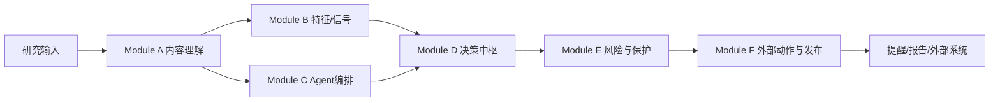

# L3 · 核心模块架构规约

> [!NOTE] **[TRACEBACK] 原子规约锚点**
> - **顶层概念**: [项目定义与核心价值](../../01_顶层概念/01_项目定义与核心价值.md)
> - **战略维度**: [平台技术栈与系统架构](../../02_战略维度/平台与产品/02_平台技术栈与系统架构.md)
> - **原子规约**: [接口抽象层规约](./05_接口抽象层规约.md)
> - **对应 DNA**: `_System_DNA/core_modules/dna_module_*.yaml` 与 `global_const.production_requirements`
> - **本文档**: L3 层级，定义双目标系统的核心模块、跨模块能力与生产约束

## 一、总览

L3 仍保留 `Module A-F` 这一机器语义，以兼容 DNA 与后续实现，但其含义已经从旧交易链路重构为新的双目标执行链：

| 模块 | 新主责 | 对产品的价值 | 对成长的价值 |
|------|--------|--------------|--------------|
| **Module A** | 内容理解与标的画像 | 把公告、新闻、行业、主营构成转成结构化研究输入 | 训练数据建模、抽取、标签与质量控制 |
| **Module B** | 特征、信号与候选引擎 | 生成研究候选、规则特征、排序或筛选结果 | 训练数据计算、特征工程、批处理与性能治理 |
| **Module C** | 研究议会与 Agent 编排 | 组织检索、总结、工具调用、多代理协作 | 训练 Agent workflow、tool calling、session 编排 |
| **Module D** | 决策中枢 | 把多路证据汇总成可解释结论、优先级与门禁建议 | 训练决策逻辑、指标门禁、负责人视角 |
| **Module E** | 风险与保护层 | 拦截不可靠输出，管理权限、阈值、回滚与失败保护 | 训练 guardrail、隔离、恢复与安全设计 |
| **Module F** | 外部动作与发布边界 | 向通知、工单、执行、外部 API、服务发布等边界输出动作 | 训练外部系统抽象、发布闭环、集成治理 |

## 二、跨模块基础能力

以下能力不是单独属于某一个模块，而是必须贯穿模块边界：

### 1. 推理与资源治理

- 自托管推理、`vLLM`、`Triton`、`TGI`、批处理、缓存、并发控制。
- GPU 配额、调度、利用率治理、性能压测与成本分析。
- 分布式训练、checkpoint、模型/数据版本衔接。

### 2. Agent runtime 与长连接

- WebSocket/SSE、session recovery、任务状态同步、resume token。
- browser/computer-use runtime、多任务并发、资源限制。
- seccomp / nsjail / eBPF 等安全策略预留与逐步接入。

### 3. MLOps 与发布闭环

- `MLflow`、`Kubeflow/Airflow`、`KServe/BentoML`、feature store、drift detection。
- 评测集、实验记录、模型注册、灰度、回滚、上线门禁。

### 4. 产品治理

- 指标体系、需求优先级、上线决策、跨团队协作、商业化判断。
- 这些能力虽然常由岗位 2 主责，但必须落在 D/E/F 的执行链里，而不是停留在口头层面。

## 三、模块关系

```mermaid
flowchart LR
  Input[研究输入] --> A[Module A 内容理解]
  A --> B[Module B 特征/信号]
  A --> C[Module C Agent编排]
  B --> D[Module D 决策中枢]
  C --> D
  D --> E[Module E 风险与保护]
  E --> F[Module F 外部动作与发布]
  F --> Output[提醒/报告/外部系统]
```

约束如下：

- `A/B/C` 负责“形成证据”，不直接越过 `D/E` 向外部系统发动作。
- `D` 负责做决策与门禁整合，不直接承担外部系统耦合。
- `E` 负责风险、阈值、权限、失败保护与回滚判定。
- `F` 负责把批准后的动作发往外部边界，并保留可追溯证据。

## 四、模块最小要求

### Module A

- 输入必须可追溯到原始数据或文档片段。
- 输出必须结构化，允许后续检索、聚合、评测。
- 要有错误兜底和质量标注，不能把低质量抽取直接伪装成高置信结果。

### Module B

- 必须支持批处理、可重复运行、可解释的打分或筛选结果。
- 特征、规则、阈值应可配置，可被评测和回放。
- 性能和吞吐是岗位 1 的重要训练位，不允许只做单条样例流程。

### Module C

- 必须支持工具调用、上下文管理、会话状态与失败恢复。
- 必须区分同步任务、异步任务、长连接任务。
- browser/computer-use runtime 必须走隔离执行路径。

### Module D

- 必须把多路证据转成可解释决策，不允许只有黑盒结论。
- 必须显式接住岗位 2 的指标、优先级、上线门禁要求。
- 对关键动作要输出“为什么允许/为什么拒绝”的依据。

### Module E

- 必须提供阈值、权限、风控、回退、熔断和异常隔离能力。
- 对高风险操作默认拒绝或降级，而不是默认放行。
- 与 runtime 安全和系统恢复策略强绑定。

### Module F

- 必须对接通知、工单、外部 API、服务发布或执行适配层。
- 不允许直接暴露上游内部对象；所有输出都必须经过统一协议或适配层。
- 若接入执行类系统，也只能作为“外部动作边界”的一种实现，不再作为项目总叙事中心。

## 五、生产级要求

所有模块都必须考虑以下生产约束：

- 可观测：日志、指标、追踪、错误分类、关键路径耗时。
- 可恢复：失败重试、幂等、会话恢复、checkpoint、回滚。
- 可治理：配置、版本、评测、灰度、权限、审计。
- 可扩展：资源治理、成本分析、容量规划、模块替换。

## 六、与岗位能力的绑定

| 岗位 | 重点模块 / 能力 |
|------|------------------|
| **岗位 1** | B/C/F 的推理接入与资源治理，跨模块的 GPU/性能/训练治理 |
| **岗位 2** | D/E/F 的指标、优先级、门禁、商业化与复盘 |
| **岗位 3** | C/F 与跨模块的评测、注册、发布、漂移治理 |
| **岗位 4** | C/E 的长连接、会话恢复、runtime 与安全边界 |

## 七、落地约束

- 每个模块都必须有 DNA、L4 实践文档和 L5 验收锚点。
- 任何模块重命名或职责大改，必须同步更新 DNA 与追溯表。
- 历史 `A轨/B轨/C轨`、`判官`、`券商中心` 等说法不再作为模块设计中心；若保留，只能作为兼容名或旧文件名过渡使用。

## 下一步

→ 继续收敛到各 Stage 设计文档与 `_System_DNA/core_modules/` 的模块语义文件。
