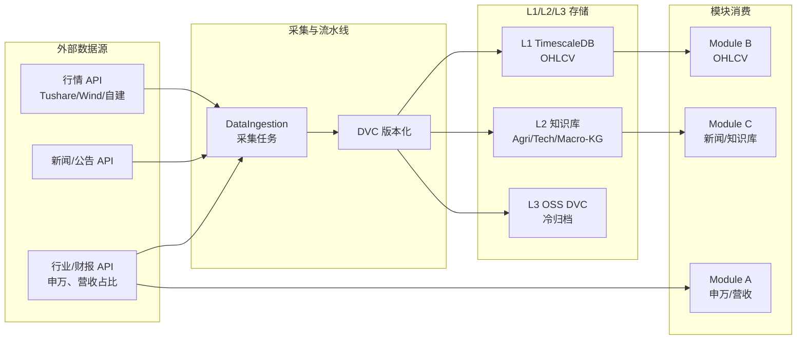

# L3 · 数据采集与输入层规约

> [!NOTE] **[TRACEBACK] 原子规约锚点**
> - **顶层概念**: [一句话定义与核心价值](../../01_顶层概念/01_一句话定义与核心价值.md)
> - **战略维度**: [数据架构与分层存储维度](../../02_战略维度/产品设计/03_数据架构与分层存储维度.md)
> - **原子规约**: [07_数据版本控制规约](./07_数据版本控制规约.md)、[09_核心模块架构规约](./09_核心模块架构规约.md)
> - **对应 DNA**: `_System_DNA/dna_11_data_ingestion.yaml`；与 `global_const.data_ingestion`、`data_architecture` 对齐
> - **本文档**: L3 层级，定义数据采集与输入层规约，解决「无数据源则无法验证」问题

## 问题：数据源缺失

**现状**：09_ 核心模块架构将市场数据、新闻数据作为输入层，但未定义**如何采集、写入、供 Module A/B/C 消费**。Module A-F 验证依赖 Mock，无法用真实市场数据验证系统。

**目标**：将数据采集与输入层作为**第一优先**，在 Module A-F 实现之前落地，为全链路真实数据验证提供前提。

---

## 架构设计

### 数据采集与写入路径

### 与 07_、09_ 的衔接

- **07_ 数据版本控制**：采集写入时遵循 DVC 版本化策略；版本标识规则见 07_。
- **09_ 输入层**：本规约定义的采集输出，对应 09_ 架构图中「市场数据 OHLCV」「新闻数据 公告/研报」及 Module A 所需的申万行业、营收占比。
- **05_ MarketDataFeed**：消费层通过 MarketDataFeed 从 L1 读取 OHLCV；采集层负责**写入** L1。

### 数据采集与存储可部署单元（模块级边界）

本规约对应的**可部署单元**为「数据采集与存储」，与 [09_ 可部署单元清单](./09_核心模块架构规约.md#可部署单元清单) 一致。

| 维度 | 约定 |
|------|------|
| **边界** | 本单元**仅负责**：从外部数据源采集、DVC 版本化、写入 L1/L2/L3；不包含消费逻辑。 |
| **消费方与契约** | **Module A**：通过约定表或 Redis 缓存读取申万行业、营收占比；**Module B**：通过 MarketDataFeed 从 L1 读取 OHLCV；**Module C**：从 L2 知识库与 L3 冷归档读取新闻/研报。消费方不部署在本单元内。 |
| **镜像与部署** | 独立 Dockerfile、独立镜像（如 `diting-ingestion`）；部署为 K3s Job/CronJob 或常驻 Worker，由 DNA 与 [02_基础设施与部署规约](../开发与交付/02_基础设施与部署规约.md) 约定。 |
| **依赖** | 依赖 TimescaleDB、Redis、L2 知识库、OSS（L3）；不依赖 Module A/B/C 进程。 |
| **Scale-to-Zero** | 本单元可 Scale-to-Zero（任务结束后缩容）；见成本治理与 DNA。 |

L4 实践与 1:1:1 设计-DNA-步骤见 [03_/Stage2_数据采集与存储](../Stage2_数据采集与存储/)、[04_/Stage2_数据采集与存储](../../04_阶段规划与实践/Stage2_数据采集与存储/)。

---

## A. 数据源定义

| 数据类型 | 用途 | 目标存储 | 采集方式 | 备注 |
|---------|------|---------|---------|------|
| **市场行情（OHLCV）** | Module B 量化扫描 | L1 TimescaleDB | API 定时拉取（Tushare/Wind/自建） | 见 data_architecture.l1_hot |
| **新闻/公告/研报** | Module C 专家推理、知识库 | L2 知识库、L3 冷归档 | API 或爬虫；写入 Agri-KG/Tech-KG/Macro-KG | 见 data_architecture.l2_knowledge |
| **申万行业、营收占比** | Module A 语义分类 | L1 或 L2；可缓存在 Redis | API（Wind/Tushare 等） | Module A 输入 |
| **配置/策略参数** | 全局 | L2 PostgreSQL | 见 06_ 动态配置 | 非采集主路径 |

### 逻辑填充期数据源选型（国内 / 国际）

逻辑填充期采集层**必须**接入以下开源数据接口，与 [01_顶层概念/05_谛听优先借鉴的十大开源选型](../../01_顶层概念/05_谛听优先借鉴的十大开源选型.md) 一致；具体接口边界、错误与限流、写入契约及验收要点见 [Stage2_数据采集与存储/02_采集逻辑与Dockerfile设计](../Stage2_数据采集与存储/02_采集逻辑与Dockerfile设计.md) 中「逻辑填充期开源接入点」小节。

| 选型 | 用途 | 供给关系 |
|------|------|----------|
| **国内：AkShare** | 国内行情、行业、宏观、公告等数据的**统一 Python 接口** | **Module A**：申万行业、营收占比（约定表或 Redis）；**L2 知识库**：Agri-KG/Tech-KG/Macro-KG 国内侧数据；**Module B**：A 股 OHLCV 写入 L1。无国内数据则 Module A 与全链路真实数据验证无法跑通。 |
| **国际/宏观/基本面：OpenBB** | 宏观、大宗、经济、基本面（财报、营收等）作为 Module A 与 L2 的**国际侧数据源**，与 AkShare 形成国内外互补 | **Module A**、**L2 Macro-KG**、**B 轨基本面**：财报、营收增速、研发占比、大宗、汇率、宏观数据。采集层采用「轻量 Core + Provider 可插拔」设计，与 05_ 选型一致。 |

---

## B. 采集任务与调度

### 任务类型

| 任务 ID | 数据源 | 写入目标 | 调度频率 | 超时 |
|---------|--------|---------|---------|------|
| `ingest_ohlcv` | 行情 API | TimescaleDB | 日级/分钟级（按需求） | 见 DNA |
| `ingest_industry_revenue` | 行业/财报 API | 约定表或 Redis 缓存 | 日级 | 见 DNA |
| `ingest_news` | 新闻 API | 知识库 + L3 冷归档 | 小时级 | 见 DNA |

上述任务中，国内数据（A 股行情、申万行业、营收占比、国内新闻/公告）由 **AkShare** 供给；国际/宏观/基本面数据由 **OpenBB** 供给。实现细节与验收见 [Stage2-02 采集逻辑与Dockerfile设计](../Stage2_数据采集与存储/02_采集逻辑与Dockerfile设计.md#design-stage2-02-exit) 中「逻辑填充期开源接入点：AkShare / OpenBB」小节。

### 调度与执行

- 采集任务由 **cron / Airflow / 自研调度** 触发；具体选型由项目在 DNA 中约定。
- 采集失败时：重试（指数退避）、告警；不阻塞下游模块读取缓存数据（见 09_ fallback_strategies）。

---

## C. 写入契约

### L1 TimescaleDB（OHLCV）

- Schema 由 `diting-core/design/schemas/sql/` 或项目约定路径定义。
- 写入延迟须满足 `data_architecture.l1_hot.timescaledb.write_latency_ms_max`。
- 采集脚本/任务须通过 Great Expectations 或等价校验，再写入。

### L2 知识库（新闻/事件）

- 写入 Agri-KG、Tech-KG、Macro-KG；向量维度与 DeepSeek-R1 嵌入一致。
- 新闻/公告按 07_ 版本化粒度写入 L3。

### 与 MarketDataFeed 的契约

- MarketDataFeed（TimescaleDBFeed 等）**读取** L1；采集层**写入** L1。
- 采集完成并提交 DVC 后，消费层可通过 `get_history`、`get_snapshot` 获取数据。

---

## D. 可执行验证

采集与输入层准出时，须满足：

1. **写入可验证**：至少一种数据源（如 OHLCV）可成功写入 L1，并可通过 MarketDataFeed 读取。
2. **Module A 输入可获取**：申万行业、营收占比可通过约定接口或缓存获取。
3. **可执行命令**：`make ingest-test` 或 DNA 约定的验收命令退出码 0。

---

## 下一步

- 主责 DNA：`_System_DNA/dna_11_data_ingestion.yaml`、`global_const.data_ingestion`
- L4 实践：`04_阶段规划与实践/Stage2_数据采集与存储/`
- 与 07_、09_ 的联动：见 [00_L2_L3_DNA_映射](../06_追溯与审计/00_L2_L3_DNA_映射.md)
