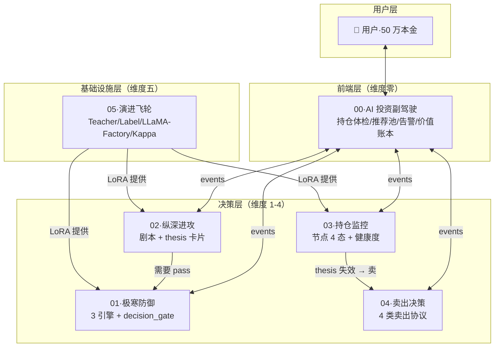
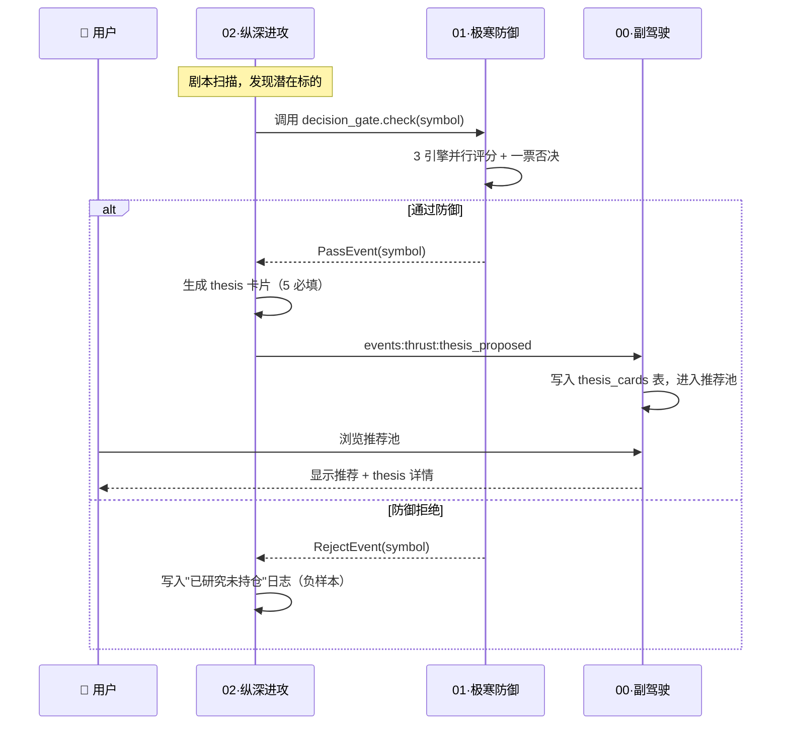
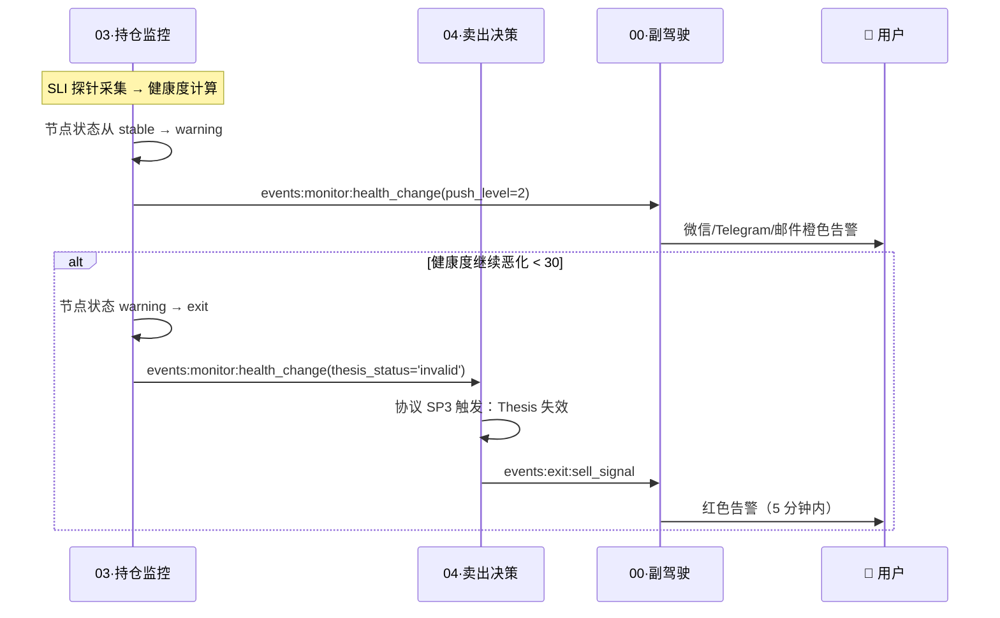
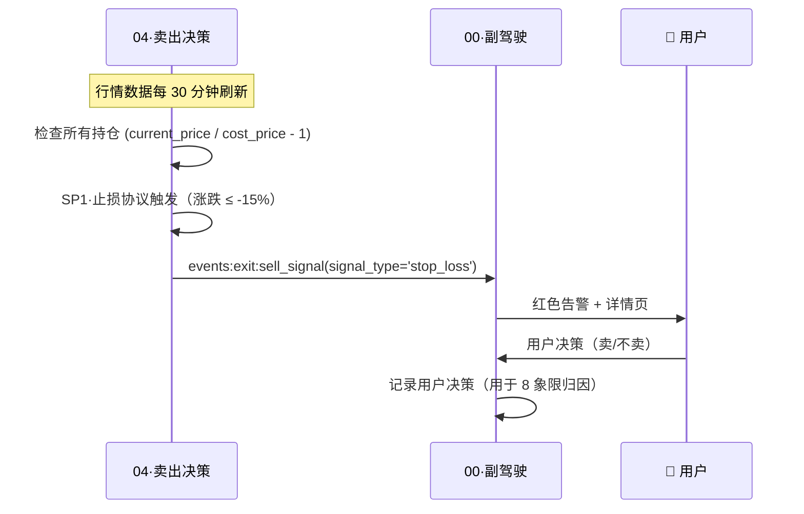
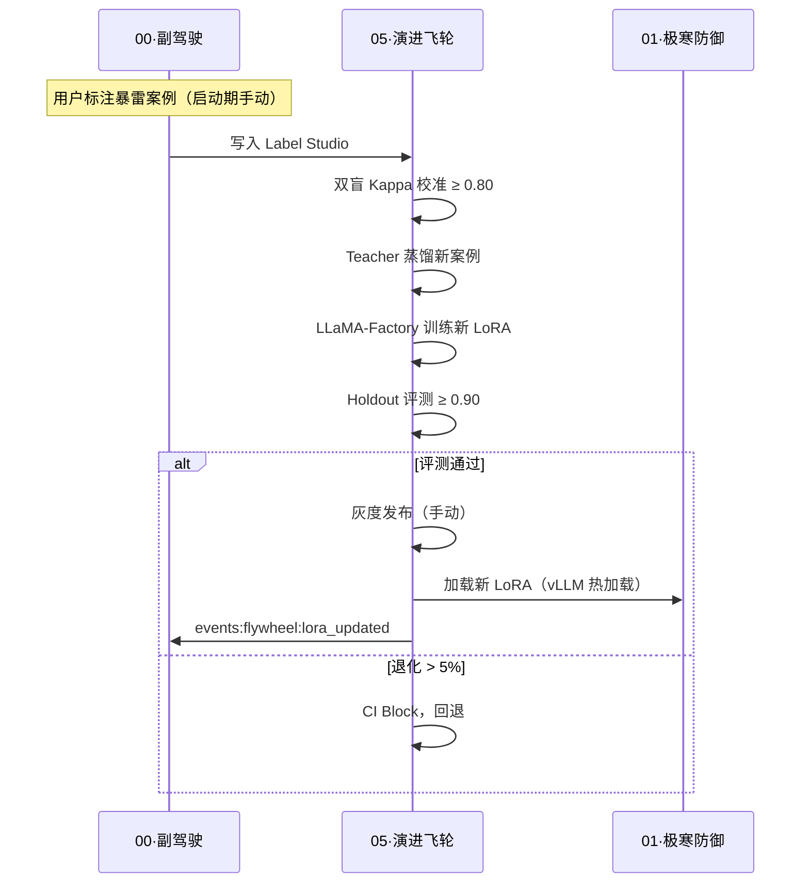
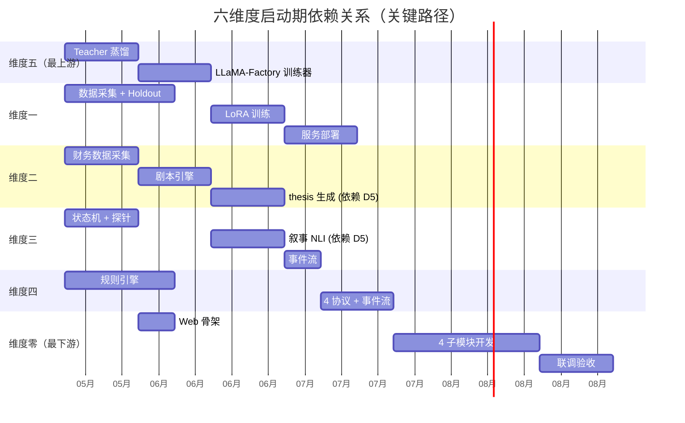

# 六维度·启动期·集成与时序图

> [!NOTE] **[TRACEBACK]**
> - **顶层概念**: [项目定义与核心价值](../../01_顶层概念/01_项目定义与核心价值.md)
> - **L3 设计入口**: [六大模块抽象总纲](../00_六大模块抽象总纲.md)
> - **DNA 真相源**: [_System_DNA/](../_System_DNA/)
> - **相关规约**: [全链路通信协议矩阵](./04_全链路通信协议矩阵.md)

---

## 一、为什么需要本文档

启动期 6 维度并行开发，**单独看每个维度都能跑通，但合起来未必跑得通**。本文档解决：

1. **端到端流程**：用户打开 App 到看到一个推荐，背后 6 维度如何协作？
2. **依赖时序**：哪个维度必须先就绪？哪个可以并行？
3. **事件契约**：6 维度之间通过什么事件流通信？
4. **集成测试边界**：每个维度的输入/输出契约是什么？

---

## 二、6 维度逻辑分层



---

## 三、典型端到端流程（4 个核心场景）

### 场景 A：新机会进入推荐池（用户主动浏览）



**端到端 SLO**：从 D2 剧本命中到 D0 推荐池可见 ≤ 5 分钟（含 D1 检查）

---

### 场景 B：持仓健康度突变（系统主动告警）



**端到端 SLO**：健康度突变到用户收到红色告警 ≤ 5 分钟（5 分钟到达率 ≥ 99.5%）

---

### 场景 C：止损线触发（系统主动告警）



---

### 场景 D：模型自我进化（基础设施支撑）



---

## 四、事件流总表

| Stream Key | 生产者 | 消费者 | 用途 | SLA |
|---|---|---|---|---|
| `events:cryo_guard:reject` | 01 | 00 | 红色告警 | 5 分钟 |
| `events:cryo_guard:degrade` | 01 | 00 | 橙色告警 | 30 分钟 |
| `events:cryo_guard:pass` | 01 | 02 | thesis 关联 | 实时 |
| `events:thrust:thesis_proposed` | 02 | 00 | 推荐池 | 实时 |
| `events:monitor:health_change` | 03 | 00, 04 | 体检 + Thesis 失效触发 | < 30s |
| `events:monitor:rebalance_advice` | 03 | 04 | 再平衡建议（启动期仅记录）| < 30s |
| `events:exit:sell_signal` | 04 | 00 | 卖出告警 | 5 分钟 |
| `events:flywheel:lora_updated` | 05 | 全部 | 模型更新通知 | 实时 |

详见 [04_全链路通信协议矩阵](./04_全链路通信协议矩阵.md)

---

## 五、依赖时序图（关键路径）



### 关键依赖链（自上而下）

```
05·演进飞轮（Teacher + LLaMA-Factory）
  ↓ 提供 LoRA 能力
01·极寒防御（3 引擎需要 LoRA）
02·纵深进攻（thesis LoRA）
03·持仓监控（叙事 NLI LoRA）
  ↓ 提供事件流
04·卖出决策（依赖 D3 的 health_change）
  ↓ 提供事件流
00·AI 投资副驾驶（消费所有事件）
```

**严格依赖**：
- 没有 05 就没有任何 LoRA（卡 D1/D2/D3 训练）
- 没有 D3 的 health_change，D4 的 SP3·Thesis 失效无法触发
- 没有 D1/D2/D3/D4 的事件流，D0 的 4 子模块没东西显示

**并行机会**：
- D5 蒸馏 + D1/D2/D3 数据采集 可以并行
- D4 规则引擎可以先用 mock 数据开发，等 D3 事件流就绪后接入

---

## 六、集成测试边界

每个维度对外暴露的契约（必须稳定）：

### 维度零（消费者）
- **输入**：6 个 Redis Stream
- **输出**：用户界面 + 推送
- **测试边界**：用 mock 事件流驱动 UI 验证

### 维度一
- **输入**：HTTP POST `/api/decision-gate/check {symbol, name, context}`
- **输出**：`{decision, audit_id, engine_results}` + RejectEvent/PassEvent
- **测试边界**：50 案例 Holdout + 100 正常公司白名单

### 维度二
- **输入**：HTTP POST `/api/playbooks/{id}/scan {symbol}` + PassEvent
- **输出**：ThesisProposedEvent
- **测试边界**：5 必填完整性 + 与人工一致率

### 维度三
- **输入**：用户持仓列表 + thesis 卡片
- **输出**：HealthChangeEvent
- **测试边界**：10 持仓模拟测试（含状态切换）

### 维度四
- **输入**：持仓数据 + HealthChangeEvent
- **输出**：SellSignalEvent
- **测试边界**：100 笔历史回测，触发准确率

### 维度五
- **输入**：标注数据 + Holdout 案例
- **输出**：LoRA 权重 + LoraUpdatedEvent
- **测试边界**：双盲 Kappa ≥ 0.80 + Holdout 不退化

---

## 七、首日用户体验场景（产品价值锚定）

为确保启动期"用户第一天打开就有用"，按以下顺序确认：

| 用户场景 | 最小可用版本 | 涉及维度 | 必须就绪日 |
|---|---|---|---|
| **第一眼**：看到持仓状态 | 4 色卡片 + 持仓列表（**允许 Mock 或未接真流**：与 [14§4.3](./14_六维度启动期统一节奏表.md) Mock 一致；**接入 D3 `health_change` 真流的体验以 M3/W7 为准**）| D0 + D3 | **W5 体感完整**；**W4 可为骨架/占位/mock** |
| **第二眼**：看到推荐 | thesis 卡片（即使只有 1 条）| D0 + D2 + D1 | W5 末 |
| **响应突变**：红色告警 | 至少微信通道可达 | D0 + D4 | W6 末 |
| **月底回顾**：月报 | SCS + EV + 月报 PDF | D0 + 全维度 | W10 末 |

> **说明**：本节「首日」强调的是**可被用户解释的页面与数据**，不强制当日已是生产级真流事件；与 [§二 里程碑表](./14_六维度启动期统一节奏表.md) 列「维度零」的周序对齐时——**时间表以 §14 矩阵与本表「必须就绪日」列为准**。上架路径同步见 **§八**。

---

## 八、运行时与上架路径（与部署一致）

- **运行时载体**：阿里云 **ECS + K3s**；Workload 以 **Helm Chart** 管理；镜像 **阿里云 ACR**。
- **上架入口**：在 **diting-infra** 调用 **deploy-engine**（配置文件真相源 + Chart/values）；**不得在业务 Makefile 写死**部署形态细节。
- **详细链路与节奏闸**：[16_阿里云ECS_K3s_ACR_Helm部署与deploy-engine链路](./16_阿里云ECS_K3s_ACR_Helm部署与deploy-engine链路.md)
- **每步可追溯**：各维度 `steps/*.md` §1 须链接 [L3步骤文档_部署价值哲学_必选引用](./L3步骤文档_部署价值哲学_必选引用.md)

---

## 修订记录

| 日期 | 内容 |
|---|---|
| 2026-05-16 | 初版：解决六维度集成、时序、事件契约、用户首日体验 |
| 2026-05-17 | §七 与 §14 周表对齐脚注；新增 §八 部署链路（ECS+K3s+Helm+ACR+diting-infra→deploy-engine）|
