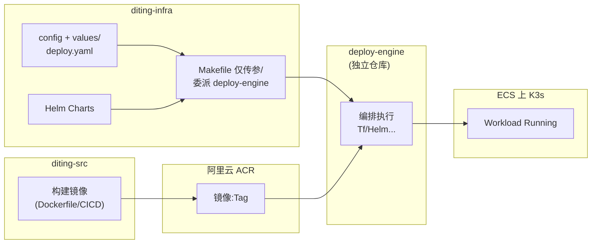

# 阿里云 ECS + K3s + ACR + Helm：部署链路与六维度对齐

> [!NOTE] **[TRACEBACK]**
> - **顶层概念（价值锚点）**：[01_项目定义与核心价值](../../01_顶层概念/01_项目定义与核心价值.md)、[06_投资哲学体系总纲](../../01_顶层概念/06_投资哲学体系总纲.md)（_observer、不擅自代用户决策等非代码表述以 L1 为准）
> - **价值与优先级（用户触达）**：[15_前后端职责与产品价值优先级](./15_前后端职责与产品价值优先级.md)
> - **集成与时序**：[13_六维度启动期集成与时序](./13_六维度启动期集成与时序.md)
> - **统一节奏（含 Mock / 里程碑）**：[14_六维度启动期统一节奏表](./14_六维度启动期统一节奏表.md)
> - **三位一体与 deploy-engine 语义**：[节奏与交付/02_基础设施与部署规约](../节奏与交付/02_基础设施与部署规约.md)、[02_三位一体仓库规约](./02_三位一体仓库规约.md)
> - **配置真相源**：**diting-infra** 仓库内的 `config/`、`charts/` / `helm/`、`values`/覆盖文件（**本文档不写具体键名**，以仓内现状为准）

---

## 一、为什么在 L3 写死这一套

六维度的 Cursor 步骤大量落在 **diting-src**；若省略 **部署与环境**，易出现「开发与训练线很饱满、上线节奏掉队」。本文档约定目标环境：**阿里云 ECS + K3s**，交付形态：**Helm Chart**，镜像仓库：**阿里云 ACR**，编排入口：**在 diting-infra 调用 deploy-engine**。与产品价值对齐方式见 **第四节**；与哲学/边界对齐见 **第五节**。

---

## 二、环境与交付拓扑（规范性描述）

| 层级 | 选择 | 说明 |
|------|------|------|
| **计算** | **阿里云 ECS** | 集群节点/K3s 宿主机所在 VPC 与安全组以 diting-infra 配置为准 |
| **Kubernetes** | **K3s** | 轻量集群；Workload 仍以标准 **Helm Chart** 管理 |
| **镜像仓库** | **阿里云 ACR** | 各类可部署镜像（副驾驶、cryo_guard、deep_strike、state_watch、exit_engine、super_evo 及中间件自定义镜像如需）一律 **ACR 完整域名 + 仓库路径 + Tag** |
| **应用与中间件** | **Helm Chart** | Chart 放置在 **diting-infra**（`charts/` 或 `helm/`）；**不得在业务仓 Makefile 中写死** NodePort/副本/SVC 形态（与全局协议「部署内容由配置与 Chart 控制」一致）|
| **执行入口** | **diting-infra → deploy-engine** | 从 **diting-infra 根目录**执行约定目标（例如 `make update-deploy-engine` 后 `make deploy-dev`，或等价封装）；deploy-engine **消费** CONFIG_ROOT / YAML，完成 Terraform/Helm 等下层动作 |
| **代码真相源（deploy-engine）** | **独立仓库（与 diting-infra 平级）** | 子模块 **`diting-infra/deploy-engine` 只做只读引用**；对该子模块路径**禁止**在本工作区做任何会改变 Git 工作树的操作。**修改须在独立 deploy-engine 仓库完成并推送后**，在 diting-infra 执行 **`make update-deploy-engine`** 更新指针 |

---

## 三、开发与部署的职责切分（和「三位一体」对齐）

| 产物 | 责任仓 | 门禁 |
|------|--------|------|
| 业务镜像 | diting-src + CI（或本地 build） | 推送到 **ACR**，Tag 可追溯（SHA 或 SemVer）|
| Chart、values、`deploy.yaml` | diting-infra | **`image.repository`/`image.tag` 自 config 注入**，禁止写死在 Makefile |
| 执行 Up/Down/升级 | **diting-infra 调用 deploy-engine** | 执行前 **`make update-deploy-engine`**（子模块远端已含所需变更）|
| 端到端可用的集群 | ECS + K3s | **`kubectl`/Helm 验证**在各维度阶段验收脚本或 L4 **部署小节**记录 |

---

## 四、与「用户价值」和「开发进度」双轨对齐

1. **用户价值只从维度零显性化**（见 [15](./15_前后端职责与产品价值优先级.md)）：D1～D5 的上线是否成功，必须通过 **K3s 上事件/健康检查/端到端链路**在用户侧有可验证路径（例如推荐给副驾驶、告警触达）。
2. **release_bundle**：一次发布建议使用 **同一套镜像 Tag**（或同一构建 ID）拉起多服务，避免 drift；与 [02_基础设施与部署规约](../节奏与交付/02_基础设施与部署规约.md) §镜像标签策略、`release_bundle` 一致。
3. **Mock → 真流**：W1～W4 可用 Mock 并行开发（见 [14 §4.3](./14_六维度启动期统一节奏表.md)）；**部署到 K3s 的「staging」阈值**由各维度 `step_*_阶段验收.md` + 本文档 §六 周节奏共同约束。
4. **L4 回写必填（建议字段）**：每次合并可部署镜像或升级 Chart，在对应维度的 **[实践记录](../../../04_阶段规划与实践/)** 增加 **「部署」**子节：`ACR 镜像 tag`、`helm release`、`namespace`、`验证命令摘要`（不要求贴密钥）。

---

## 五、与「产品哲学 / L1」的落地对齐（不写重复哲学正文）

以下内容**不是**把 L1 哲学再抄写一遍；仅规定 **在执行与部署两层如何「挂钩」**，避免跑偏：

| 钩子 | 落点 |
|------|------|
| **_observer / 不擅自代下单** | 维度二门禁、维度零交互仅「建议」，**不得在 Chart/启动参数**或「默认值」层面打开「静默自动交易」之类开关 unless ADR |
| **防御优先（先排雷再进攻）** | 部署顺序：**shared 依赖（Redis/等）→ D5 训练链路可选组件 → D1 gates → D2 推送** 的拓扑在集成测试中与 [13](./13_六维度启动期集成与时序.md) 场景表一致 |
| **可追溯 / 归因** | 审计类数据（cryo、sell_signal、告警）PVC/备份策略在 **infra 配置**中显式启用；不得在步骤里用「口头已备份」代替可验证条目 |
| **L1 原文** | 执行层如有冲突，回到 [06_投资哲学体系总纲](../../01_顶层概念/06_投资哲学体系总纲.md) 与对应 L2 实践规划裁决 |

---

## 六、启动期部署节奏门禁（与各维度 step 收口一致）

以下为 **规范性里程碑**（若与 [14](./14_六维度启动期统一节奏表.md) 周表冲突，以 **先在 L4 ADR / 会议纪要**对齐后再改数值为准）。

| 周段 | 部署门禁（最低） |
|------|------------------|
| **W2 末** | dev K3s 上 Redis / 运行时依赖可由 Chart 拉起；或与 [14§4.3](./14_六维度启动期统一节奏表.md) Mock **二选一写明**「本迭代未上台仅本地」|
| **W5 末** | 至少 **1 条**核心业务镜像（由各维度主导服务决定）在 **ACR 有 Tag** 并成功拉起到 **任一 namespace** Run（非 latest 漂移时需 values 写明）|
| **W8 末** | 与 **events** 链路相关的 workloads，在 K3s 上可通过 **就绪探针 + 人造事件 smoke** |
| **W10～W12** | 逼近 `M7`/全链路时：**release_bundle 一致 + diting-infra 一次 upgrade 可追溯** |

---

## 七、与各维度 L3 · `steps/` 的配合方式

不要求把相同段落复制进 **56** 份 step；改为 **强制引用**：

- **[L3步骤文档_部署价值哲学_必选引用](./L3步骤文档_部署价值哲学_必选引用.md)** — 每张 step、「§1 上下文」中 **必须出现可点击链接**，且勾选其中检查表相关项；
- **本文档** — 任一涉及 **「上集群 / 镜像 / Helm」**的 step（通常含 **部署 / 验收 / e2e**），在上下文表中增加一行链到本节 **§二～§三**。

---

## 八、修订记录

| 日期 | 内容 |
|------|------|
| 2026-05-17 | 初版：ECS+K3s+ACR+Helm+diting-infra→deploy-engine，与价值/哲学/L4/L3 steps 对齐 |
