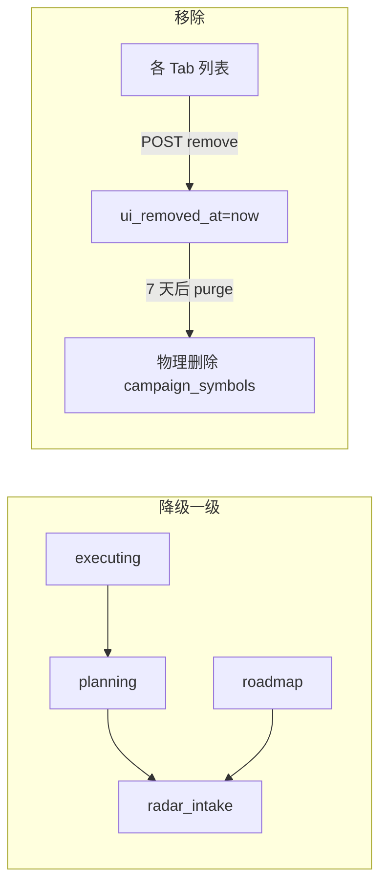

# 行情解析与规划工作台 · 要做什么

> **一句话**：先把前端 **4+1 工作台 UI 骨架**全部立起来（能点开、占位也行），再**直指「📡 行情解析与规划工作台」**，把**我现有持仓的每只标的**做成体系化分析档案——**当前行情 / 所处阶段 / 产业生态位 / 核心壁垒 / 关键风险 + 各维度关键监控数据**，并**把持仓落实到「规划（Campaign）」中**。
> 节拍对齐：[14_表 §12 · D0 波次二](./14_六维度启动期统一节奏表.md)（M5/M6/M7 · step_11/12/13） · 持仓 SoT：`diting-src/data/config/my_holdings.yaml`（缺则回退 example） · 设计依据：[step_12 行情解析与规划工作台](../00_维度零_AI投资副驾驶/stages/stage_1_启动期/steps/step_12_行情解析与规划工作台.md)

> **🆕 波次三（价值实现升级）**：把工作台从「空壳 4 视图」升级为**有方向的四区漏斗**（🔭雷达发现 → 🗓️滚动路线图时间锚定 → 📝规划证伪 → 🚀执行仓位指导），每区内部走 **T0 代码采集 → T1 自训模型压缩 → T2 顶尖模型推理** 三段流水线（全落库可审计），模型档位配置驱动可选。**架构总纲**：[25_四区漏斗_三段流水线_架构脊柱](./25_四区漏斗_三段流水线_架构脊柱_设计.md) · **实现步骤**：step_14~17（见 [§9 波次三](#9-波次三--价值实现升级四区漏斗--三段流水线--模型路由)）。

> **🆕 波次四（持久化 + 漏斗操作 + 采集数据 + 对话模型 · 2026-05-31）**：文件缓存 **24h**、扫描结果 **同步入库**（**30 天**、每标的 **7 版**）、近 **7 日**分析标的进扫描候选、规划/执行/候选 **降级·移除**、分析前 **仅采集 T0** + **采集数据** Tab、Opus 对话 **可选模型 + 每轮费用**。详见 [§10 波次四](#10-波次四--持久化--漏斗降级移除--采集数据--对话模型)。

> **🆕 波次三·战略板块升维（2026-06-10 · 设计稿）**：在 step_15 战术双层锚定之上，[30_战略板块与滚动路线图_前端与数据契约](./30_战略板块与滚动路线图_前端与数据契约.md) 定义 **宏观 5～10 年战略板块/阶段**、晋级 **战略标签**、**JL1/JL2 板块级监控** 与三栏指挥台 UI；落地 step **⑱**（待建）。战术 `campaign_timeline` / `regime_assessments` **不变**。

> **🔧 波次三·联动重构（2026-05-31 · 方案A 标的级漏斗）**：step_14~17 完成后发现四区联动按 Campaign 流转导致「一标的多 Campaign」重复、路线图自咬撞车、四 Tab 沦为脏库过滤。**已重构为标的级漏斗**——一个标的=一条 `CampaignSymbol.funnel_stage` 记录贯穿四区（symbol 全局唯一），晋级=推进同一记录 stage（前向单向·人工确认），四区按 stage 互斥过滤；feasibility 按标的去重消除自咬撞车；生产清空重建保留 holdings_sot。中枢 `modules/planning/funnel.py` + 迁移 `migrate_step18.py`。**本机验收**：`make copilot-funnel-all`（migrate + 8 单测 + 审计）✅、`make copilot-funnel-cleanup` 清空重建 ✅、全套 `tests/copilot` **157 passed**。详见 [实践记录_四区漏斗_标的级重构](../../04_阶段规划与实践/00_维度零_AI投资副驾驶/stage_1_启动期/实践记录_四区漏斗_标的级重构.md) 与 [25_ §1.3](./25_四区漏斗_三段流水线_架构脊柱_设计.md)。

> **波次四生产（2026-06-03）**：`make copilot-wave4-deploy` @ **47.239.223.96:30080** ✅（ACR 镜像 `sha256:a1930e53…` + Helm REV12 + **剥离** `radar-hotfix` ConfigMap 挂载）；`make copilot-wave4-verify` ✅。工作台：http://47.239.223.96:30080/planning?view=radar

---

## 0. 目标与路线（先 UI 骨架 → 再 M6 体系化分析 → 持仓入规划）

| 阶段 | 目标 | 产物 | 是否挡「持仓体系化分析」 |
|:---:|---|---|:---:|
| **A · UI 骨架先行** | 4+1 导航 + 5 个工作台页能点开（M6 外的先占位灰态） | step_11 薄切 | 否（但建议先做，产品感先立住） |
| **B · M6 核心** | Campaign 模型 + **持仓一键落入规划** + 标的「6 维分析档案」骨架 + 三支柱监控订阅 | step_12 P0 | **是 · 主线** |
| **C · 分析数据接入** | 把 6 维分析真实数据接上（阶段/生态位/壁垒/风险 + 关键监控） | step_12 P1 + 上游联调 | **是 · 主线** |
| **D · 图谱（可后置）** | 产业知识图谱 Part A（生态位可视化） | step_13 | 否（生态位文本先够用） |

> **本表主线 = B + C**：让我现在的持仓尽快得到体系化分析并落进规划；A 是先导，D 可后置。

---

## 1. 必做项（功能闭环 · 按 ①→②→③→④ 顺序）

> **① UI 骨架立住 → ② 持仓能落进规划 → ③ 6 维分析接真数据 → ④ 关键监控数据备齐。** 后两步是「体系化分析」的核心。
>
> **状态列说明**：**代码** = `diting-src` 已合并；**本机** = `make copilot-step12-all`；**生产 K3s** = `diting-infra` `make copilot-step12-deploy` + `copilot-step12-tier2-verify`（`8.218.24.12:30080` · 2026-05-29 验收通过）。

| 状态 | 代码 | 本机 | 生产 K3s | 项 | 做什么 | 在哪改 | 怎么验 | Cursor 推荐模型 |
|:---:|:---:|:---:|:---:|---|---|---|---|---|
| ✅ | ✅ | ✅ | ✅ | **必做 ①**（UI 骨架） | 导航 7→**4+1**（`总览/🛡️持仓监管/📡行情解析及规划/🕸️产业图谱/📒价值账本/⚙️系统`）；`持仓管理`→`持仓监管`；`/planning`、`/portfolio-guard`、`/graph` 占位页可点开 | `apps/copilot/templates/base.html` + `routers/planning_routes.py` · `diting-src` | 本机：`curl /` 见 4+1；`curl /planning` 200 · 生产：`curl http://$PUBLIC_IP:30080/planning` | Composer 2.5 Fast |
| ✅ | ✅ | ✅ | ✅ | **必做 ②**（持仓入规划） | 建 6 表；**批量把 SoT `role=portfolio` 导入 `campaign_symbols`**；K8s Pod 启动 `copilot_k8s_bootstrap.py` 同步跑 Campaign 导入 | `modules/planning/service.py` + `db/models.py` + `scripts/copilot_k8s_bootstrap.py` | `make copilot-step12-migrate` + `copilot-step12-campaign` → `/api/campaigns` 见持仓标的 | Sonnet 4.6 |
| ✅ | ✅ | ✅ | ✅ | **必做 ③**（6 维分析档案） | 6 区块：行情/阶段/生态位/壁垒/风险/监控；接真实上游，缺则 `pending`；**Redis 未就绪则阻塞等待**（`redis_wait.py`） | `modules/planning/dossier.py` | `/api/campaigns/{id}/symbols/{sym}` 6 区块齐 | Sonnet 4.6 |
| ✅ | ✅ | ✅ | ✅ | **必做 ④**（三支柱监控备数据） | moat/catalyst/risk 订阅落库 + `refresh_verdicts`；启动/导入前 **wait Redis PONG** | `modules/planning/monitor.py` + `services/redis_wait.py` | `/api/campaigns/{id}/monitors` 三支柱齐 + ≥1 真 verdict（有上游时） | Sonnet 4.6 |
| ✅ | ⏳ | ⏳ | ⏳ | **建议 ⑤**（规划中/执行中） | Campaign 四视图分流 + 滚动时间轴 API | `workbench.html` + `service.py` + `planning_routes.py` | `/planning?view=planning|executing|roadmap` · `/api/timeline` | Composer 2.5 Fast |
| ⏳ | ⚠️ | — | — | **可选 ⑥**（图谱可视化） | step_13 Part A 关系图 | `modules/graph/` | `/graph?center={sym}` 轻量入口 · 关系图待 step_13 | Sonnet 4.6 |

**L3 实践**：[step_11 持仓监管工作台](../00_维度零_AI投资副驾驶/stages/stage_1_启动期/steps/step_11_持仓监管工作台.md)（导航 4+1） · [step_12 行情解析与规划工作台](../00_维度零_AI投资副驾驶/stages/stage_1_启动期/steps/step_12_行情解析与规划工作台.md)（Campaign + 6 维档案 + 三支柱） · [step_13 产业图谱](../00_维度零_AI投资副驾驶/stages/stage_1_启动期/steps/step_13_产业图谱关系链研究.md)

---

## 2. 持仓「6 维分析档案」字段 → 数据源映射（必做 ③ 的落点）

> 这是把「我的持仓体系化分析」拆成可执行的 6 个区块；每块标注**真实数据源**与**当前就绪度**。缺上游 → `pending` 灰态，**禁止伪造**。

| # | 分析维度（你的原话） | 数据来源（已实现/契约） | 就绪度 | 缺失时降级 |
|:---:|---|---|:---:|---|
| ① | **当前行情**（涨跌/量能/资金） | D4 行情 quote + D3 `PhaseSignals`（pct_chg/volume_ratio/news_count） | ✅ 可用 | 行情源限流 → 标 stale |
| ② | **所处阶段** | **D3 `market_phase` 分类器**（concept 概念 / expectation 预期 / realization 兑现 / exhaustion 退潮）+ D2 Timer（潜伏/主升/撤退） | ✅ market_phase 已落地；⚠️ Timer 按标的 | Timer 缺 → 仅显 market_phase；都缺 → pending |
| ③ | **产业生态位** | D2 The Architect `monitor:{symbol}:dict` 产业链 + D1 `related_party_graph`（340 节点 · `training/scripts/build_related_party_graph.py`） | ⚠️ watchlist 已通；持仓按标的 | 缺 → 文本「待生态位分析」+ pending |
| ④ | **核心壁垒（物理逻辑）** | D3 物理量探针 P5 招标 / P6 海关 / P7 产能 + `monitor:dict` | ⚠️ 部分标的已通 | 缺 → moat 支柱 pending |
| ⑤ | **关键风险** | D1 极寒防御 `decision_gate`（reject/degrade/pass）+ D3 `health_change` | ⚠️ D1 三引擎部署后；health 已有 | D1 未就绪 → risk 仅用 health |
| ⑥ | **关键监控数据**（间接必须备好） | 三支柱 `monitor_subscriptions`：moat→P5/P6/P7；catalyst→D2 Sniffer 三源；risk→D1+health | ⚠️ 随上游 | 各条独立 pending |

> **阶段命名说明**：D3 `market_phase` 用「概念/预期/兑现/退潮」四档（[state_watch/market_phase/schemas.py](../../../diting-src/apps/state_watch/market_phase/schemas.py) `MarketPhase`），D2 Timer 用「潜伏/主升/撤退」三段；档案 ② 区块**两者都展示**（market_phase 为主、Timer 为辅），不强行合并。

---

## 3. 进度（tier 分开看，别混）

| tier | 状态 | 本机 | 生产 K3s | 做什么 | 怎么验 |
|:---:|:---:|:---:|:---:|---|---|
| **tier-1 骨架 + 持仓入规划** | ✅ | ✅ | ✅ | 必做 ①②：4+1 导航 + 6 表 + 持仓导入 campaign_symbols | 本机：`make copilot-step12-all` · 生产：`make -C diting-infra copilot-step12-deploy` |
| **tier-2 6 维分析接真数据** | ✅ | ✅ | ✅ | 必做 ③④：market_phase + 生态位 + 壁垒 + 风险 + 三支柱 ≥1 真 verdict | 本机：`copilot-step12-test` + curl 档案 API · 生产：`make copilot-step12-tier2-verify` |
| **tier-3 图谱可视化** | ⏳ | — | — | 可选 ⑥：step_13 Part A | `/graph?center={sym}` |

> **tier-2 准出口径**：6 区块**有真实数据的点亮、缺上游的显式 pending**（位置先备好）；**至少 ②market_phase + ⑥三支柱 moat 1 条**接真实数据，其余可 pending。

---

## 4. 数据链

```
持仓 SoT（role=portfolio）
  → 必做② 导入 campaign_symbols（每只生成分析档案）
  → 必做③ 6 维分析填充：
      ① 当前行情     ← D4 quote / D3 PhaseSignals
      ② 所处阶段     ← D3 market_phase（概念/预期/兑现/退潮）+ D2 Timer
      ③ 产业生态位   ← D2 Architect monitor:dict + D1 related_party_graph
      ④ 核心壁垒     ← D3 P5/P6/P7 物理量探针 + monitor:dict
      ⑤ 关键风险     ← D1 decision_gate + D3 health_change
  → 必做④ 三支柱 monitor_subscriptions（moat/catalyst/risk）周期采集 + verdict
  → 建议⑤ Campaign 规划中/执行中 + 动作链(advisory) + 滚动时间轴
  → 可选⑥ step_13 产业图谱 Part A（生态位可视化 · concept/entity + confirmed/inferred）
```

---

## 5. 就绪检查（开工前一次性确认 · 依赖链验收）

| # | 依赖 | 检查命令 | 期望 |
|:---:|---|---|---|
| 1 | 持仓 SoT 真实持仓 | `cat diting-src/data/config/my_holdings.yaml`（缺则按 example 复制后填真实股数/成本/role） | ≥1 条 `role: portfolio` |
| 2 | copilot 服务可起 | `make copilot-step03-up`（或 uvicorn）→ `curl /health` | `status: ok` |
| 3 | D3 market_phase 可跑 | `make watch-step09-classify-all` | 全 active 分类 + 4 档分布 |
| 4 | Redis 可用 | `make copilot-step12-prep`（**阻塞等待 PONG**，不跳过） | PONG |
| 5 | 生态位/壁垒上游 | `monitor:{symbol}:dict` 是否有键（D2 Architect/D3）；`related_party_graph` 是否可达 | 有则点亮，无则 pending |

> **无证据不断言**：必做 ③④ 中任一维度上游未就绪时，档案显式 `pending` + 在 L4 实践记录标注「⚠️ 启动期可接受降级 · 待 D? step_?」，**禁止**用随机/假数据补齐。

---

## 6. 关键约束（永久红线 · 与协议一致）

| 约束 | 含义 | 检测 |
|---|---|---|
| **no-auto-execute** | 动作链/建议全 `execute_mode=advisory` + `human_confirmation_required`；schema 禁 `buy/qmt/auto_trade/order_id/webhook_target` | `rg -i "buy\|qmt\|auto_trade\|order_id\|webhook_target\|立即\|一键\|下单" apps/copilot/modules/planning/ apps/copilot/templates/planning/` = 0 |
| **no-mock** | 6 维分析缺上游 → pending，不伪造；mock 仅限 `tests/` | 业务路径无 `random`/`fake_` 填充分析值 |
| **数据质量优于数据量** | 6 维按「引擎要的深度」反推字段，不以「有几条」充数 | 见 [14_ §8.1](./14_六维度启动期统一节奏表.md) |

---

## 7. 验证（本机 + 生产 K3s）

### 7.1 本机（tier-1）

```bash
cd diting-src
make copilot-step12-all    # prep 会阻塞等待 Redis PONG
```

### 7.2 生产 ECS + K3s（tier-2 · 全流程）

Copilot 已纳入 `diting-stack`（`platform` 命名空间 · NodePort **30080**）。step12 **须推新镜像并滚动重启**后验收：

```bash
# 1) 构建推送 + rollout + HTTP 验收（在 diting-infra）
export DITING_ACR_PASSWORD='…'   # 或 ACR_PASSWORD
export KUBECONFIG=$HOME/.kube/config-diting-prod
cd diting-infra
make copilot-step12-deploy

# 2) 仅验收（集群已是最新镜像时）
cd diting-src && make copilot-step12-tier2-verify
```

生产 URL（`prod.conn` · 当前 `PUBLIC_IP=47.239.223.96`）：

```bash
curl -s http://47.239.223.96:30080/planning | head -c 200
curl -s http://47.239.223.96:30080/api/campaigns | jq '.[0].symbols'
curl -s http://47.239.223.96:30080/api/campaigns/1/symbols/601138 \
  | jq '{quote,phase,niche,moat,risk,monitors}'
curl -s http://47.239.223.96:30080/api/campaigns/1/monitors \
  | jq 'group_by(.pillar)|map({pillar:.[0].pillar,n:length})'
```

Pod 启动链：`copilot_k8s_entrypoint.sh` → `copilot_k8s_bootstrap.py`（`init_db` + SoT holdings + **等待 Redis** + Campaign 导入）→ uvicorn。

### 7.3 本机 curl 片段

```bash
cd diting-src

# 必做①：4+1 导航
curl -s http://127.0.0.1:8080/ | grep -oE "持仓监管|行情解析及规划|产业图谱"
curl -s http://127.0.0.1:8080/planning | head -c 200

# 必做②：6 表 + 持仓导入
make copilot-step12-migrate
sqlite3 data/copilot.db ".tables" | grep -E "campaigns|campaign_symbols|monitor_subscriptions"
make copilot-step12-campaign
curl -s http://127.0.0.1:8080/api/campaigns | jq '.[0].symbols'

# 必做③：6 维分析档案
curl -s http://127.0.0.1:8080/api/campaigns/1/symbols/601138 \
  | jq '{quote,phase,niche,moat,risk,monitors}'

# 必做④：三支柱
curl -s http://127.0.0.1:8080/api/campaigns/1/monitors \
  | jq 'group_by(.pillar)|map({pillar:.[0].pillar,n:length})'

# 单测
make copilot-step12-test              # ≥ 15 passed
```

---

## 8. 本机跑不通时

```
ModuleNotFoundError: No module named 'sqlalchemy'
```

**意思**：用了系统自带 `python3`，没装项目依赖。

```bash
cd diting-src
make deps
make copilot-step12-all    # 自动用 .venv/bin/python3
```

```
持仓 SoT 未找到
```

**意思**：`MY_HOLDINGS_YAML` 未指向真实持仓。

```bash
cp data/config/my_holdings.example.yaml data/config/my_holdings.yaml
# 编辑填入真实持仓（role: portfolio + quantity + cost_price），再在 .env 写 MY_HOLDINGS_YAML=data/config/my_holdings.yaml
```

---

## 9. 波次三 · 价值实现升级（四区漏斗 + 三段流水线 + 模型路由）

> **目标**：把波次二的「占位 UI + 6 维只读档案」升级为**端到端有方向的工作流**——顶级模型在雷达区做全方位评估，结果逐区下沉（路线图锚定时间 → 规划区证伪监控 → 执行区仓位指导），完成后 long 行情标的回流路线图滚动。**这就是"前端真正实现价值"的落点。** 完整设计见 [25_架构脊柱](./25_四区漏斗_三段流水线_架构脊柱_设计.md)，**我按本表 ⑦~⑩ 顺序开发**。

### 9.1 四区漏斗与三段流水线（横切机制 · 地基）

```
🔭 行情雷达 → 🗓️ 滚动路线图 → 📝 规划中 → 🚀 执行中  ┐
   ↑ 每区流转需人工确认（晋级闸门）                      │
   └────────── long_multiwave 标的本波归档后回流滚动 ←───┘

每区内部:  T0 代码/规则采集（海量原始）
            → T1 自训功能模型压缩（关键数据集 · LoRA/vLLM，缺则规则 fallback）
            → T2 顶尖大模型推理（Opus 只读压缩集，省 token）
每段落库:  stage_artifacts（段级审计）→ workspace_artifacts（区间精简集级联）
模型路由:  model_profile 配置驱动，每区 UI 可选档位（默认/略高级/顶尖/本地自训）
```

### 9.2 实现步骤映射（⑦~⑩ · 按此顺序开发）

| 状态 | 代码 | 本机 | 生产 | 项 | 做什么（价值） | L3 实践步骤 | 怎么验 | 推荐模型 |
|:---:|:---:|:---:|:---:|---|---|---|---|---|
| ✅ | M8 | ✅ | ✅ | **⑦ 雷达 + 三段流水线地基**（M8） | 地基三表（`stage_artifacts`/`workspace_artifacts`/`model_profile`）+ 雷达 3 输入（A 热度/B 概念/**C 标的·先做**）→ 顶级模型全方位评估（生态位/龙头/壁垒/利润/阶段/利好窗/风险）+ 候选一键晋级 | [step_14 行情雷达扫描与三段流水线](../00_维度零_AI投资副驾驶/stages/stage_1_启动期/steps/step_14_行情雷达扫描与三段流水线.md) | `make copilot-step14-all` · 候选 3 段 artifact + 溯源 + promote | Opus（T2 评估）+ Sonnet（工程） |
| ✅ | M9 | ✅ | ✅ | **⑧ 滚动路线图双层锚定**（M9） | 维度一：候选爆发点入时间线编排 + **合理性评估**（建仓窗/窗口冲突/资金撞车/排序）；维度二：**生命周期判定**（单次/短/中/长多波）+ 长周期巡检 + 滚动闭环 | [step_15 滚动路线图双层锚定](../00_维度零_AI投资副驾驶/stages/stage_1_启动期/steps/step_15_滚动路线图双层锚定.md) | `make copilot-step15-all` · flag + regime + 巡检订阅 | Sonnet（纯规则为主） |
| ✅ | M10 | ✅ | ✅ | **⑨ 规划中证伪与持续监控**（M10） | 认知快照 + 4 类可证伪监控任务（🧱物理壁垒/🕸️生态位/📈利好追踪/⚠️风险）+ 证伪 verdict（缺源 pending/被推翻 alert）+ 证据累积 + 晋级就绪度 | [step_16 规划中证伪与持续监控](../00_维度零_AI投资副驾驶/stages/stage_1_启动期/steps/step_16_规划中证伪与持续监控.md) | `make copilot-step16-all` · 4 类 verdict + moat 真 hit + 就绪度 | Sonnet + 本地 LoRA（risk 测谎） |
| ✅ | M11 | ✅ | — | **⑩ 执行中仓位指导**（M11）
| ✅ | ⑪~⑮ | `make copilot-wave4-all` | `make copilot-wave4-deploy` | **⑪~⑮ 波次四** | 24h 文件缓存 + DB 30d/7 版 + 采集数据 Tab + 候选降级移除 + Opus 模型/费用 | `make copilot-wave4-verify` · [§10](#10-波次四--持久化--漏斗降级移除--采集数据--对话模型) | Sonnet + Opus | | 持仓×实时价×仓位 → advisory 操作建议（建仓/加仓/浮盈减仓/浮亏处理/持有/清仓）+ 盘后安全扫描门控（fraud→压制加仓）+ 一波归档回流 | [step_17 执行中仓位指导](../00_维度零_AI投资副驾驶/stages/stage_1_启动期/steps/step_17_执行中仓位指导.md) | `make copilot-step17-all` · advisory + 安全门控 + rg 下单=0 | Sonnet + 本地 LoRA（安全扫描） |
| 📋 | M12 | — | — | **⑱ 战略板块与滚动路线图**（M12） | 宏观战略板块 CRUD + 阶段/猎物池 + 晋级战略标签 + 三栏指挥台 + JL1/JL2 板块监控 + 执行区战略上下文条 | [30_ 前端与数据契约](./30_战略板块与滚动路线图_前端与数据契约.md) · step_18（待建） | `make copilot-step18-all`（待增） | Sonnet（工程）+ Opus（标签建议 P3） |

### 9.3 模型档位与成本（开发前须知）

| 档位 | 用在哪 | 代码仓现状 | 成本 |
|---|---|---|---|
| **T0 功能引擎**（无 LLM） | 行情/浮盈亏/合理性/阶段/探针读取 | ✅ 现成（ProfitCapture/market_phase/P5-P7/MarketQuote） | ¥0 |
| **T1 本地自训**（LoRA·vLLM） | 财务测谎/文本压缩/生命周期初判/巡检 | ⚠️ 仅 `FinancialFraudEngine` 现成；其余待 `super_evo` 蒸馏，先规则占位 | GPU（按需） |
| **T2 顶尖模型**（Opus） | 雷达深度评估/证伪推理/最终决断 | ✅ `AIDispatcher` remote | 按量计费（默认关，主动触发） |

> **`DECISION_PENDING`**：① T2 Opus 高频深度评估月成本可能超 ¥100 → 默认 `RADAR_T2_ENABLED=false`，仅 T0/T1 兜底，用户主动深度评估再开 + 设月预算 + 幂等缓存；② T1 各区专业 LoRA 训练需 GPU → 沿用 P 轨按需 GPU，先规则/通用占位逐个替换。详见 [25_ §6.1](./25_四区漏斗_三段流水线_架构脊柱_设计.md)。

> **模式C 自给式重构（2026-05-31）**：T2 Opus 由"默认关"改为**模式C 必开**（`RADAR_T2_ENABLED=true`）——因模式C 是用户主动深度分析单标的、非高频，单次 Opus≈¥0.5，月成本可控；T0 改 akshare 直采不再依赖上游引擎。每次扫描在研报卡显式显示 `cost_yuan/tokens_in/tokens_out/model`。详见 [step_14 §3.1/§3.5](../00_维度零_AI投资副驾驶/stages/stage_1_启动期/steps/step_14_行情雷达扫描与三段流水线.md) 与 [L4 实践记录](../../04_阶段规划与实践/00_维度零_AI投资副驾驶/stage_1_启动期/实践记录_ModeC深度研报重构.md)。

### 9.4 波次三永久红线

| 红线 | 检测 |
|---|---|
| **no-auto-execute** | `rg -i "buy\|qmt\|auto_trade\|order_id\|webhook_target\|立即\|一键\|下单" apps/copilot/modules/{radar,roadmap,planning,execution}/ apps/copilot/templates/planning/` = 0 |
| **no-mock** | 模式C：akshare 源不可达→`status=error`+detail、Opus 不可达→候选 `t2_status=error`（**绝不伪 pending、不造假**，前端显红色"未就绪"横幅）；T1 未训用 `t1_fallback` 显式标 |
| **晋级人工确认** | 4 区流转 + 仓位建议全 `human_confirmation_required` |
| **审计可查证** | T0/T1/T2 三段全落 `stage_artifacts`，溯源链 `input_refs`/`upstream_refs` 完整 |

---

## 10. 波次四 · 持久化 + 漏斗降级移除 + 采集数据 + 对话模型

> **目标**：雷达分析不再只靠 Pod 内临时文件；**缓存区默认 24h**，**数据库至少 30 天**且每标的保留 **最近 7 个版本**（审计页可切换）；扫描候选区展示 **近 7 日分析过的标的**；四区标的支持 **降级 / 移除**；分析前可 **先采集 T0（自动 T1）** 并在 **采集数据** 页查看；Opus 日常对话支持 **模型档位选择** 与 **每轮费用展示**。  
> **代码**：`diting-src` `modules/radar/persistence.py` · `migrate_step19` · `planning/funnel.py` · `routers/planning_routes.py` · `workbench.html`  
> **生产部署（正式 · 禁止仅热修）**：`diting-infra` **`make copilot-wave4-deploy`**（ACR 镜像 + Helm values + 剥离 `radar-hotfix` ConfigMap 挂载）

### 10.1 双层存储契约

| 层 | 保留策略 | 环境变量（Helm → Pod） | 用途 |
|---|---|---|---|
| **文件缓存** | 默认 **24h**（`versions/` + `{sym}.json`） | `RADAR_FILE_RETENTION_HOURS=24` · `RADAR_T0_CACHE_MAX_AGE_HOURS=24` | 扫描新鲜度、低延迟读 latest |
| **数据库** | **30 天** · 每标的 **≤7 版** `radar_symbol_versions.bundle_json` | `RADAR_DB_RETENTION_DAYS=30` · `RADAR_DB_MAX_VERSIONS=7` | 审计切换、文件过期后仍可查历史 |
| **漏斗 UI 移除** | 前端立即隐藏 · 后端 **7 天** 后物理删 `campaign_symbols` | `ui_removed_at` · `last_analyzed_at`（migrate_step19） | 移除≠删库即时清 |

> **同步时机**：`save_cache(bundle)` 后 **`sync_bundle_to_db`**（扫描 live / 强制刷新 / 仅采集 T0）。审计 API **`list_versions_merged`** = DB 为主 + 24h 内文件补充。

### 10.2 实现步骤映射（⑪~⑮）

| 状态 | 代码 | 本机 | 生产 K3s | 项 | 做什么 | 怎么验 | 推荐模型 |
|:---:|:---:|:---:|:---:|---|---|---|---|
| ✅ | ⑪ | `make copilot-wave4-all` | `make copilot-wave4-deploy` | **⑪ 持久化入库** | 表 `radar_symbol_versions` + `campaign_symbols.ui_removed_at/last_analyzed_at`；24h/30d/7 版修剪 | `copilot-wave4-verify` 查表 + `/api/radar/audit/{sym}/versions` | Sonnet |
| ✅ | ⑫ | 同上 | 同上 | **⑫ 采集数据页** | Tab `radar_data` · API `GET /api/radar/data/{sym}` · `POST .../collect`（T0+T1） | `/planning?view=radar_data&symbol=601138` 列版本 | Composer |
| ✅ | ⑬ | 同上 | 同上 | **⑬ 候选区 7 日 + 降级移除** | `list_recent_candidates` 合并漏斗近 7 日 · `POST /api/funnel/symbols/{sym}/demote|remove` | 候选卡见降级/移除；移除后列表消失 | Composer |
| ✅ | ⑭ | 同上 | 同上 | **⑭ 规划/执行区降级移除** | `planning`/`executing` 标的卡同 API | 两 Tab 卡片按钮可点 | Composer |
| ✅ | ⑮ | 同上 | 同上 | **⑮ Opus 对话** | 模型下拉 Opus 4.5~4.9 · `AIDispatcher.model_override` · 助手气泡下 **¥/tok** | `/planning?view=radar_chat` 选模型发一问见费用 | Opus |

### 10.3 漏斗降级 / 移除语义（与 25_ 标的级漏斗一致）



| 操作 | 前端 | 后端 |
|---|---|---|
| **降级** | 卡片按钮 · HTMX 刷新候选列表 | `funnel_stage` 降一级（最低 `radar_intake`） |
| **移除** | 立即从各 Tab 消失 | 设 `ui_removed_at`；**7 天**后 `purge_expired_ui_removed` 物理删行 |
| **晋级** | 不变 · 人工确认 | `promote_candidate` → `planning` + `touch_last_analyzed` |

### 10.4 生产部署与验收（正式路径）

```bash
# 本机
cd diting-src && make copilot-wave4-all

# 生产（须 DITING_ACR_PASSWORD / KUBECONFIG / diting-src/.env 含 ANTHROPIC_API_KEY）
export KUBECONFIG=$HOME/.kube/config-diting-prod
cd diting-infra
make copilot-wave4-deploy    # 推镜像 + helm + 去热修挂载 + 验收

# 仅复验 HTTP/UI
make copilot-wave4-verify
```

| 检查项 | 命令/期望 |
|---|---|
| 表结构 | Pod 内 `radar_symbol_versions` 存在；`campaign_symbols` 含 `ui_removed_at` |
| 雷达 UI | `/planning?view=radar` 含「仅采集 T0」「查看采集数据」 |
| 采集数据 | `/planning?view=radar_data&symbol=601138` 200 |
| 对话模型 | `/planning?view=radar_chat` 含「模型」下拉 |
| 版本 API | `GET /api/radar/audit/601138/versions` 返回 `version_id` 列表 |

> **禁止**：仅用 `make copilot-radar-audit-hotfix-deploy` 作为波次四终态（已弃用提示）；热修仅作紧急兜底，验收以 **`copilot-wave4-deploy`** 为准。

### 10.5 波次四红线（延续波次三）

| 红线 | 波次四追加检测 |
|---|---|
| **no-mock** | DB 同步失败须显式 error，禁止假版本号 |
| **no-auto-execute** | 降级/移除不改变 advisory 性质 |
| **审计可查证** | 7 版以内 `bundle_json` 可还原 T0/T1/T2 |
| **移除可恢复窗口** | 7 天内仅 UI 隐藏，审计库版本仍可查（除非整行已 purge） |

---

## 修订记录

| 日期 | 变更 |
|---|---|
| 2026-06-10 | **波次三·战略板块升维（设计稿）**：新增 [30_战略板块与滚动路线图_前端与数据契约](./30_战略板块与滚动路线图_前端与数据契约.md)（宏观板块/阶段/标签 · 三栏指挥台 · JL1/JL2 板块监控 · 数据模型与 API 草约 · P0-P4）；§9.2 增 ⑱ M12 行；联动 [25_ §1.2](./25_四区漏斗_三段流水线_架构脊柱_设计.md) · [28_ §1.1](./28_执行中工作区_标的深度监控_T0-T2开发计划.md) |
| 2026-05-31 | **波次四 · 持久化 + 漏斗降级移除 + 采集数据 + 对话模型（§10 · 正式部署 `copilot-wave4-deploy`）**：文件缓存 24h（`RADAR_FILE_RETENTION_HOURS`）+ DB `radar_symbol_versions` 30 天/7 版；`migrate_step19`；候选近 7 日 + demote/remove；`radar_data` 采集页；Opus 对话模型与费用；Helm `diting-prod.yaml` + Chart env；弃用热修为终态。本机 `make copilot-wave4-all` · 生产 `make copilot-wave4-deploy` |
| 2026-05-31 | **模式C 深度研报自给式重构（取消占位符 · 与 `.cursorrules`/`00_系统规则` §4.5 同步）**：根因 = T0 依赖上游 D2/D3 引擎生产全空 + T2 默认关 + pod 未注入 `ANTHROPIC_API_KEY` → 9 维全 pending 空壳。重构：T0 改 akshare 直采(行情/资料/财务/估值)、新增 `schema.py` 冻结 9 维契约；T2 必开 Opus 输出 9 维结构化 JSON（mock 降级→显式 error）+ 真实 token 成本；前端改人类可读 9 维研报卡 + 成本徽章 + 三段溯源；Chart secret 注入 AI env + `copilot-sync-ai-from-src-env.sh` + `make copilot-modec-deploy`；§9.3/§9.4 + 新增模式C 重构说明。test_radar 17 项 + 全套 162 passed。详见 [step_14](../00_维度零_AI投资副驾驶/stages/stage_1_启动期/steps/step_14_行情雷达扫描与三段流水线.md) / [25_ §2.2](./25_四区漏斗_三段流水线_架构脊柱_设计.md) / [L4 实践记录](../../04_阶段规划与实践/00_维度零_AI投资副驾驶/stage_1_启动期/实践记录_ModeC深度研报重构.md) |
| 2026-05-30 | **波次三 · 价值实现升级（关键重构 · 与 `.cursorrules`/`00_系统规则` §4.5 同步）**：新增 [25_四区漏斗_三段流水线_架构脊柱](./25_四区漏斗_三段流水线_架构脊柱_设计.md)（整合四区漏斗 + 统一三段流水线 T0/T1/T2 + StageArtifact/WorkspaceArtifact 两级落库审计 + ModelProfile 配置驱动模型路由 + ContextMatrixBuilder 矩阵压缩 + 安全扫描横切 + 双层滚动路线图）；新增 §9 波次三章节（⑦~⑩ 实现步骤映射 + 模型档位成本 + DECISION_PENDING + 红线）+ 头部波次三入口；落 4 份 L3 step：[step_14 雷达三段流水线](../00_维度零_AI投资副驾驶/stages/stage_1_启动期/steps/step_14_行情雷达扫描与三段流水线.md)（M8）/ [step_15 路线图双层锚定](../00_维度零_AI投资副驾驶/stages/stage_1_启动期/steps/step_15_滚动路线图双层锚定.md)（M9）/ [step_16 规划证伪监控](../00_维度零_AI投资副驾驶/stages/stage_1_启动期/steps/step_16_规划中证伪与持续监控.md)（M10）/ [step_17 执行仓位指导](../00_维度零_AI投资副驾驶/stages/stage_1_启动期/steps/step_17_执行中仓位指导.md)（M11）；同步 steps/README §一-2 + DNA `dna_stage_1_启动期.yaml` v1.2（M8~M11 + funnel_pipeline_v3/stage_artifact/model_profile/roadmap_dual_anchor 架构键） |
| 2026-05-29 | **建议 ⑤ 代码落地**：`/planning` 四视图分流（radar/planning/executing/roadmap）+ `/api/timeline` + `/api/radar/symbols`；⑥ 轻量 `/graph?center=` 入口 |
| 2026-05-29 | **生产 K3s 验收通过**：`make up-stack diting-stack` 起新 ECS `8.218.24.12` → `platform-step03-up` → ACR 推 `diting-copilot:latest` → rollout → `copilot-step12-tier2-verify` ✅；必做 ①~④ 生产列改 ✅ |
| 2026-05-29 | **状态回填**：必做 ①~④ 代码+本机 ✅；生产 K3s 列 ⏳（须 `make copilot-step12-deploy`）；增「代码/本机/生产」三列；Redis 改为 `redis_wait` 阻塞等待；K8s bootstrap 增 Campaign 导入；增 §7.2 生产验收与 `copilot-step12-deploy` |
| 2026-05-29 | 首版：以「先 UI 骨架 → M6 持仓体系化分析 → 落入规划」为主线；必做 ①~④ + 6 维分析字段→数据源映射（行情/阶段/生态位/壁垒/风险/监控）；阶段数据复用 D3 `market_phase`（概念/预期/兑现/退潮）+ D2 Timer；对齐 step_11/12/13 与 14_ §12 D0 波次二；no-auto-execute / no-mock 永久红线 |
