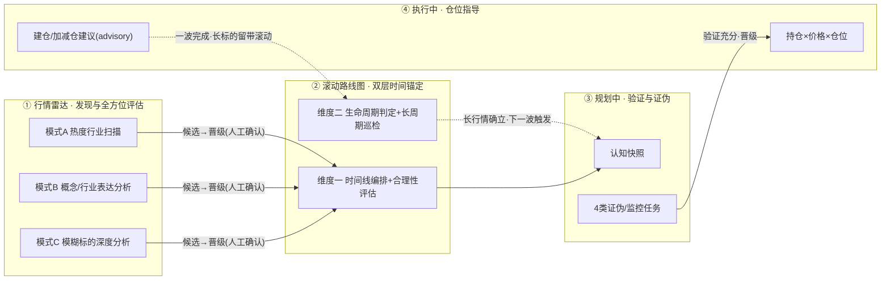
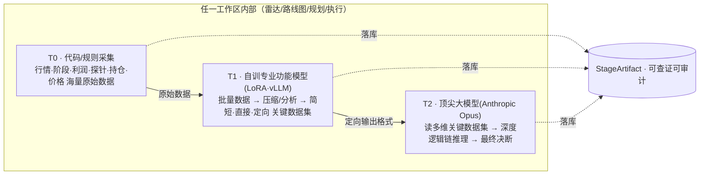

# 25 · 行情解析工作台「四区漏斗 + 三段流水线」架构脊柱（L3 · 波次三）

> **一句话**：把 M6 行情解析与规划工作台从「4 个平行视图」升级为**一条有方向的漏斗流水线**——
> **① 行情雷达（发现/全方位评估）→ ② 滚动路线图（时间锚定）→ ③ 规划中（验证/证伪/监控）→ ④ 执行中（仓位指导）**；
> 每个工作区内部统一走 **T0 代码采集 → T1 本地自训模型压缩 → T2 顶尖模型深度推理** 三段流水线，三段全部落库（`StageArtifact`）可查证可审计；
> 跨工作区以**精简关键数据集（WorkspaceArtifact）逐区累积**，模型档位**配置驱动可覆盖（ModelProfile）**。

> [!NOTE] **[TRACEBACK] 战略追溯锚点**
> - **L1 哲学**：[06_投资哲学体系总纲](../../01_顶层概念/06_投资哲学体系总纲.md)（②纵深进攻·断言级多源验证 / ⑦壁垒 / ⑧归因闭环）
> - **L2 实践规划**：[02_战略维度/06_跨维度协作/06_标的深度分析与阶段判定实践规划](../../02_战略维度/06_跨维度协作/06_标的深度分析与阶段判定实践规划.md)
> - **本维度 L3 总览**：[维度零 stage_1 启动期 steps/README](../00_维度零_AI投资副驾驶/stages/stage_1_启动期/steps/README.md)（§一-2 波次三）
> - **DNA**：[`dna_stage_1_启动期.yaml`](../_System_DNA/00_co_pilot/dna_stage_1_启动期.yaml) `funnel_pipeline_v3 / stage_artifact / model_profile`
> - **上游 step**：← [step_12 行情解析与规划工作台](../00_维度零_AI投资副驾驶/stages/stage_1_启动期/steps/step_12_行情解析与规划工作台.md)（Campaign 6 表 + 6 维档案，已生产 ✅）
> - **下游 step**：→ step_14（雷达+三段流水线地基）/ step_15（滚动路线图双层锚定）/ step_16（规划证伪监控）/ step_17（执行仓位指导）
> - **跨维上游能力**：D2 deep_strike（Lighthouse Sniffer/Critic/Scorer/Architect/Timer · `AIDispatcher`）、D3 state_watch（market_phase · P5/P6/P7 · MonitorDictReader）、D1 cryo_guard（FinancialFraudEngine · decision_gate 占位）、D5 super_evo（T1 蒸馏管线）
> - **需求主表**：[24_行情解析与规划工作台_需求实现表](./24_行情解析与规划工作台_需求实现表.md)
> - **复用矩阵规约**：[20_监控字典规约](./20_监控字典规约.md) · [22_事实交叉验证与防幻觉规约](./22_事实交叉验证与防幻觉规约.md)
> - **战略板块升维（2026-06-10）**：[30_战略板块与滚动路线图_前端与数据契约](./30_战略板块与滚动路线图_前端与数据契约.md)（宏观 5～10 年板块 + 阶段标签 · 不替换 step_15 战术层）

---

## §0 本文档定位（L3 架构脊柱 · 非单 step）

本文是**波次三的架构总纲**，定义 4 个工作区共享的**横切机制**（漏斗流转 / 三段流水线 / Artifact 级联 / 模型路由 / 审计 / 安全扫描）。具体落地拆到 4 个 step：

| step | 工作区 | 职责一句话 |
|---|---|---|
| **step_14** | ① 行情雷达 + 三段流水线地基 | 3 类输入 → 顶级模型全方位评估；落 `StageArtifact`/`WorkspaceArtifact`/`ModelProfile` 地基 |
| **step_15** | ② 滚动路线图 | 双层时间锚定：时间线编排+合理性评估 / 行情生命周期判定+长周期巡检 |
| **step_16** | ③ 规划中 | 认知快照 + 4 类证伪任务（物理壁垒/生态位/利好/风险）持续监控 |
| **step_17** | ④ 执行中 | 持仓×实时价×仓位 → advisory 操作建议 + 安全扫描门控 |

> **L3 责任边界**：本文给**设计规划推演 + 数据模型 + 接口契约 + 就绪度**，不嵌入完整代码；落地由各 step 的 L4 实践记录 / 后续执行模型完成。

---

## §1 四区漏斗模型（信息架构升级）

### §1.1 漏斗总览



### §1.2 四区职责分工（核心）

| 工作区 | 角色定位 | 核心动作 | 永久红线 |
|---|---|---|---|
| **① 行情雷达** | 认知生成（顶级模型深度思考的全方位评估） | 3 类输入 → 生态位/价值链/龙头/壁垒/利润/阶段/利好爆发时间线/风险 结构化评估 | no-mock（缺引擎显式 pending） |
| **② 滚动路线图** | 时间锚定（放在雷达之后） | **战术**：维度一时间线编排+合理性评估；维度二生命周期判定+长周期巡检 · **宏观**（[30_](./30_战略板块与滚动路线图_前端与数据契约.md)）：5～10 年战略板块/阶段 + JL1/JL2 板块监控 + 标的战略标签 | 评估全 advisory |
| **③ 规划中** | 验证证伪（对评估结果验证/补充/持续监控配置） | 4 类证伪任务 + 持续数据采集监控 | no-mock；缺源 pending |
| **④ 执行中** | 持仓指导（验证充分后进入） | 持仓+实时价 → advisory 仓位操作建议 | **no-auto-execute**（禁下单） |

### §1.3 晋级闸门（人工确认流转 · **标的级漏斗** v2）

> [!IMPORTANT] **关键重构（2026-05-31 · 方案A 标的级漏斗）**
> 原设计「流转单元 = Campaign」导致**一标的多 Campaign 重复**（雷达每次 promote 新建 campaign、同标的在多区重复、路线图自咬撞车、四 Tab 沦为脏库 SQL 过滤）。
> 现重构为 **流转单元 = 标的（`CampaignSymbol`）**：**一个标的 = 一条贯穿四区的 funnel 记录**。

- **单一状态机**：`CampaignSymbol.funnel_stage ∈ {radar_intake, roadmap, planning, executing, archived}` 是贯穿四区的**唯一真相**；四区 Tab 按 `funnel_stage` 过滤同一批标的，**标的只出现在其当前所属区**（四区互斥，杜绝重复）。
- **标的全局唯一**：`symbol` 全局唯一（`uq_funnel_symbol` 约束 + 应用层 `upsert_funnel_symbol` find-or-create 双保险）；所有 funnel 标的挂唯一容器 Campaign（`theme=行情解析漏斗`），Campaign 退化为可选作战分组。
- **晋级 = 推进同一条记录的 stage（前向单向）**，**必须人工确认**（守 `no-auto-execute`）：
  - 雷达候选 `promote` → 推进到 `planning`（**不再新建 Campaign**）；
  - 时间线编排 → 纳入 `roadmap`；
  - 规划区证伪充分 → 人工确认 `→ executing`（标的级，按 symbol）；
  - 执行本波完成 → `archived`。
- **滚动复用**：`regime=long_multiwave` 标的归档本波时**回流路线图**（`set_stage(allow_backward) → roadmap`）+ `next_wave_window`，下一波触发再前进，形成闭环。
- **中枢实现**：`apps/copilot/modules/planning/funnel.py`（`upsert_funnel_symbol / set_stage / list_funnel_symbols / VIEW_STAGES`）；迁移 `db/migrate_step18.py`。

---

## §2 统一三段流水线（每工作区内 · T0→T1→T2）

### §2.1 三段模型



### §2.2 三段职责与边界

| 段 | 职责 | 适用任务 | 不该做 |
|---|---|---|---|
| **T0 代码/规则** | 取数、算术、聚合、阈值、区间检测（确定性·免费·可全量） | 行情/量比、浮盈%、建仓窗口冲突、探针 hit 读取 | 不做语义判断 |
| **T1 自训功能模型** | 把繁杂批量数据**压缩为关键数据集**，输出**定向任务指标/定向格式** | 公告堆→关键事件抽取、财务测谎、长短期初判、文本分类 | 不做跨维因果决断 |
| **T2 顶尖大模型** | 跨维度因果、逻辑链、证伪推理、最终决断 | 生态位/龙头/壁垒综判、时间线合理性论证、仓位决断 | **绝不读原始全量，只读 T1 压缩集 + 上游 Artifact** |

> **T0/T1 边界判定**：纯聚合留 T0，需语义判断才上 T1，避免误用模型。
> **代码仓先例**：Lighthouse 流水线本身即「本地 vLLM 预处理（etl/industry）+ 远程 Opus 推理（critic/scorer/architect）」，见 `apps/common/ai_dispatcher.py`。波次三把它**固化成每工作区的标准三段**。
> 
> **Mode C 自给式落地（2026-05-31）**：雷达模式 C（标的深度分析）原依赖上游 D2/D3 引擎，生产全空导致全 pending 空壳。现重构为 **T0 直采 akshare**（行情 K 线 `stock_zh_a_hist`、个股资料 `stock_individual_info_em`、财务摘要 `stock_financial_abstract`、估值分位 `stock_a_indicator_lg`、同业 best-effort）→ **T1 压缩事实矩阵** → **T2 必开 Opus**（`RADAR_T2_ENABLED=true`）输出固定 9 维结构化 JSON（`niche/value_chain/is_leader/moat/profit_quality/market_phase/catalyst_timeline/risk/valuation`，每维含 `verdict+reasoning+evidence[]+confidence`，外加 `overall{conclusion,action_advisory,confidence}`），**成本显示**（`cost_yuan_est/tokens_in/tokens_out/model`）。接口失败返回 `status=error`+detail，**守 no-mock（绝不伪 pending、不造假）**。落库 9 维 verdict 入 `radar_candidates` 列，完整分析存 `raw_json.analysis_snapshot.deep_analysis`，成本入 `scan.summary_json`（无新表）。前端：9 维研报卡（verdict 徽章+推理+证据+置信）+ 成本徽章 + 三段溯源。详见 [step_14 §3.1](../00_维度零_AI投资副驾驶/stages/stage_1_启动期/steps/step_14_行情雷达扫描与三段流水线.md) 与 [L4 实践记录](../../../04_阶段规划与实践/00_维度零_AI投资副驾驶/stage_1_启动期/实践记录_ModeC深度研报重构.md)。

### §2.3 上下文工程层（ContextMatrixBuilder · 喂 T2 前的矩阵压缩）

> 原则：**T2 永远读「矩阵 + 上游 Artifact」，不读原始全量**——既省 token/成本，又强迫系统先想清「什么是关键数据」（对齐"数据质量优于数据量"）。

```
原始数据(财报/公告/同业/时序/探针 · 海量)
  → ContextMatrixBuilder：抽取「异常/拐点/命中/超阈」关键单元
  → 压成紧凑特征矩阵（行=维度, 列=关键指标, 只留 delta/anomaly/hit）
  → 连同上游 WorkspaceArtifact 一起喂 T2
```

| 已有矩阵化先例（generalize 即可） | 文件 |
|---|---|
| 证据链（≥3 条蒸馏） | `apps/deep_strike/engines/evidence_builder.py` |
| Critic 2×2 物理证伪矩阵 | `apps/deep_strike/lighthouse/critic.py` |
| Architect monitor_matrix | `apps/deep_strike/lighthouse/architect.py` |
| 探针命中位 | `apps/state_watch/probes/monitor_dict_reader.py` |

---

## §3 数据级联与审计（StageArtifact + WorkspaceArtifact）

### §3.1 两级产物模型

```
区内三段:  StageArtifact(T0_raw) → StageArtifact(T1_distilled) → StageArtifact(T2_verdict)
区间漏斗:  WorkspaceArtifact(雷达) → WorkspaceArtifact(路线图) → WorkspaceArtifact(规划) → WorkspaceArtifact(执行)
```

- **StageArtifact**：单工作区内**每一段**的产物（细粒度审计单元）。
- **WorkspaceArtifact**：单工作区**对外发布**的精简关键数据集（= 本区 T2_verdict 的对外视图 + key_facts），供下游区消费。

### §3.2 数据模型（新增表 · 在 `apps/copilot/db/models.py`）

| 表 | 关键列 | 用途 |
|---|---|---|
| **`stage_artifacts`** | `id, symbol, time_window_start, time_window_end, workspace, stage(T0_raw/T1_distilled/T2_verdict), model_id, prompt_ver, engine_ver, input_refs(JSON), payload_json, produced_at, latency_ms, token_cost` | 三段全落库 · 审计单元 |
| **`workspace_artifacts`** | `id, campaign_id, symbol, workspace, version, key_facts(JSON), verdict(JSON), confidence, upstream_refs(JSON), t2_artifact_id FK, produced_at` | 区间级联 · 精简对外集 |
| **`radar_scans`** | `id, input_type(hot_industry/concept/symbol), query_text, status(running/done/failed), summary_json, created_at` | 一次雷达扫描会话 |
| **`radar_candidates`** | `id, scan_id FK, symbol, name, concept, industry, niche_text, value_chain_pos, is_leader, leader_confidence, moat_level, profit_quality, market_phase, catalyst_window(date), risk_summary, confidence, evidence_ref, raw_json` | 候选标的全方位评估快照 |
| **`regime_assessments`** | `id, campaign_id, symbol, horizon_class(single/short/mid/long_multiwave), wave_count_est, duration_est, confidence, confirm_state(inferred/confirming/confirmed/falsified), next_wave_window, evidence_ref` | 行情生命周期判定（路线图维度二） |
| **`execution_advices`** | `id, campaign_id, symbol, current_price, cost_price, position_pct, unrealized_pnl_pct, advice_action(advisory), rationale, as_of` | 执行区仓位建议快照 |
| 扩展 `campaign_symbols` | 增 `analysis_snapshot(JSON)`, `promoted_from_candidate_id` | 晋级时带入雷达认知 |
| 扩展 `campaigns` | 增 `stage(radar_intake/roadmap/planning/executing/archived)` | 漏斗当前所在区 |
| 扩展 `campaign_timeline` | 增 `window_start, window_end, build_lead_days, feasibility_flags(JSON), sequence_no` | 路线图维度一时间线编排 |
| 扩展 `monitor_subscriptions` | 增 `falsify_type(moat/niche/catalyst/risk/regime/safety)`, `hypothesis` | 4 类证伪 + 长周期巡检 + 安全扫描 |

### §3.3 溯源链（审计核心）

```
区内:  T0_raw ──input_refs──→ T1_distilled ──input_refs──→ T2_verdict
区间:  雷达WA ──upstream_refs──→ 路线图WA ──→ 规划WA ──→ 执行WA
```

**审计用例**：执行区结论可疑 → 顺 `upstream_refs`/`input_refs` 回溯 → 定位是某区某段（如雷达 T1 压缩错公告）→ 锁定具体 `stage_artifacts` 行（含 `model_id + prompt_ver`）。**每跳有据可查**（对齐 L6 追溯审计 + "无证据不断言"）。

### §3.4 稳定性与成本控制

- **版本钉死**：每次运行记录 `model_id + prompt_ver + engine_ver` → 可复现。
- **幂等缓存**：T2 仅在 `input_refs` 内容 hash 变更时重跑，否则复用上次 `T2_verdict`（控 Opus 频次）。
- **成本（`DECISION_PENDING`）**：T2(Opus) 按量计费，全区调用需设月预算上限；高频深度评估配额需架构师决策（见 §6）。

---

## §4 模型路由（ModelProfile · 配置驱动可覆盖）

### §4.1 三档位（对应代码仓现状）

| 档位 | 是什么 | 代码仓现状 | 适合 |
|---|---|---|---|
| **T0 功能引擎**（无 LLM） | 规则/探针/统计 | `ProfitCapturePlaybook`、market_phase 规则分类器、P5/P6/P7、`EvidenceChainBuilder` 主路径 | 行情/阶段/利润/探针/合理性/浮盈 |
| **T1 本地自训模型**（LoRA·vLLM） | 自训 LoRA 经 vLLM | `FinancialFraudEngine`(N5 vLLM+LoRA)、`super_evo` 蒸馏 student、vLLM `:8091` | 财务测谎/巡检判断/生命周期初判/文本压缩 |
| **T2 顶尖大模型**（远程） | Anthropic Claude Opus | `AIDispatcher` remote 档、Lighthouse 五场景 | 深度综述/证据链证伪/生态位推演/时间线推演/最终决断 |

### §4.2 ModelProfile 配置（升级 AIDispatcher scene 路由）

```yaml
ModelProfile:   # DNA/DB 配置，UI 可临时覆盖
  - { workspace: radar,     task: t1_distill,     tier: T1, model_id: "vllm:distill-or-rule", override_allowed: true }
  - { workspace: radar,     task: t2_assess,      tier: T2, model_id: "anthropic:opus",        override_allowed: true }
  - { workspace: roadmap,   task: feasibility,    tier: T0, model_id: "rule:engine" }
  - { workspace: roadmap,   task: regime_classify,tier: T1, model_id: "vllm:distill-or-rule" }
  - { workspace: planning,  task: falsify,        tier: "T0+T1" }
  - { workspace: planning,  task: t2_argue,       tier: T2, model_id: "anthropic:opus" }
  - { workspace: executing, task: exec_advice,    tier: T0 }
  - { workspace: "*",       task: safety_scan,    tier: T1, model_id: "lora:fraud" }
  - { workspace: patrol,    task: patrol_recheck, tier: T1, pinned: true }   # 巡检钉死模型控成本
```

- 统一经 `AIDispatcher.call(scene, messages)` 调用（业务路径禁直连 SDK · 代码仓现有红线）。
- 每工作区 UI 顶部一个**模型选择器**（默认/略高级/顶尖/本地自训），`override_allowed=true` 时可临时覆盖。
- **降级**：T1 模型未训好时回退到规则抽取或通用本地 vLLM，并在 `StageArtifact.model_id` 显式标 `t1_fallback=rule/generic`（不冒充已训模型 · 守 `no-mock`）。

---

## §5 安全扫描功能模块（极寒防御 · 横切）

| 扫描类型 | 引擎 | 档位 | 现状 |
|---|---|---|---|
| 财务造假/测谎 | `FinancialFraudEngine.analyze(symbol)` | **T1 LoRA** | ✅ 现成（fraud/normal + risk_level + evidence） |
| 基础财务异常（三表勾稽/商誉/质押） | 规则引擎 | T0 | ⏳ 部分可规则化 |
| 风险闸门 reject/degrade/pass | `decision_gate` | T0/T1 | ⏳ gate 本体未实现，先读 `HealthRecord` 代理 |

- 实现为 `monitor_subscriptions.falsify_type='safety'`，定时跑（复用 `ProbeScheduler` 思路）。
- **触发**：规划区 `[点击扫描]` 按需 + `[定时]` 每日/周；执行区 `[定时]` 盘后底层安全扫描。
- **门控**：安全扫描 verdict 流入 risk → 执行区 fraud alert **压制"加仓"建议**（advisory 标红）。
- 全 advisory + 人工确认（`no-auto-execute`）。

---

## §6 就绪度总表 + 决策保留项

| 能力 | 就绪度 | 复用/说明 |
|---|---|---|
| T0 采集引擎 | ✅ | market_quote / probes / playbook / holdings_sot |
| StageArtifact / WorkspaceArtifact 级联 | ⏳ 新表（纯工程） | 有 thesis/dossier 先例 |
| ModelProfile 路由 | ⚠️ | `AIDispatcher` 在，升级为可配置矩阵 + UI 选择器 |
| ContextMatrixBuilder | ⚠️ | 多个矩阵先例，抽象为通用层 |
| T1 自训功能模型 | ⚠️ | 仅 FinancialFraudEngine LoRA 现成；其余 `super_evo` 蒸馏待训，先规则/通用占位 |
| T2 Opus | ✅ | `AIDispatcher` remote；靠 T1 压缩 + 幂等缓存控成本 |
| 雷达模式C（标的深度） | ⚠️ 复用最多·先做 | ProfitCapture + market_phase + MonitorDictReader + 行情 |
| 雷达模式B（概念分析） | ⚠️ | Lighthouse 在，缺「概念→候选标的」映射 |
| 雷达模式A（热度扫描） | ⏳ | 缺 akshare 板块数据源封装 |
| 路线图维度一（编排+合理性） | ⏳ 纯规则·先做 | 交易日历 + 区间重叠检测 |
| 路线图维度二（生命周期分类） | ⚠️/⏳ | thesis 字段代理 + 待建专用引擎；缺则 inferred |
| 长周期巡检 | ✅ 机制现成 | `MonitorSubscription` |
| 安全扫描（财务测谎） | ⚠️ | FinancialFraudEngine 现成；decision_gate ⏳ |
| 龙头/壁垒/估值动态引擎 | ⏳ | 无引擎；代理 + pending（L3 step_11 估值器未入代码） |

### §6.1 用户决策保留清单（`DECISION_PENDING`）

| # | 类型 | 说明 | 建议 |
|---|---|---|---|
| 1 | 成本 · T2 Opus | 全区调用按量计费，高频深度评估可能超 ¥100/期 | 默认 T0+T1 兜底，T2 仅用户主动深度评估触发；设月预算上限 + 幂等缓存 |
| 2 | GPU · T1 训练 | `super_evo` 蒸馏各工作区专业 LoRA 需 GPU | 沿用 P 轨按需 GPU；先规则/通用占位，逐个替换 |

---

## §7 实施落点（建议顺序 · 地基优先）

| 优先级 | 落点 | 对应 step | 理由 |
|---|---|---|---|
| **P0 地基** | `StageArtifact` + `WorkspaceArtifact` + `ModelProfile` 三表 + 溯源 | step_14 §地基 | 整个架构的审计/级联/路由载体，纯工程不依赖缺失引擎 |
| **P0 价值** | 雷达模式C（T0 现成引擎 + T2 读压缩集）+ 晋级流转 | step_14 | 复用最多，最快让前端从空壳变真实分析 |
| **P1** | 滚动路线图维度一（时间线编排+合理性·纯规则） | step_15 | 纯规则，快出价值 |
| **P1** | 规划区 4 类证伪任务（复用 refresh_verdicts + P5/P6/P7） | step_16 | 机制现成 |
| **P1** | 执行区仓位指导 + 安全扫描门控 | step_17 | 复用 MarketQuoteClient + holdings_sot + FinancialFraudEngine |
| **P2** | 路线图维度二生命周期 + 长周期巡检 | step_15 扩展 | thesis 代理 + 待建引擎 |
| **P2** | 雷达模式B（概念）+ ContextMatrixBuilder 抽象 | step_14 扩展 | 补概念映射 |
| **P3** | 雷达模式A（热度扫描）+ T1 蒸馏替换占位 | step_14 扩展 | 补板块数据源 + GPU 训练 |

---

## §8 永久红线（贯穿四区 · 与协议一致）

| 红线 | 含义 | 检测 |
|---|---|---|
| **no-auto-execute** | 执行/动作建议全 `execute_mode=advisory` + `human_confirmation_required`；schema 禁 `buy/qmt/auto_trade/order_id/webhook_target` | `rg -i "buy\|qmt\|auto_trade\|order_id\|webhook_target\|立即\|一键\|下单" apps/copilot/modules/` = 0 |
| **no-mock** | 龙头/壁垒/概念映射/生命周期缺引擎 → 显式 `pending`/`inferred`，禁伪造；`mock` 仅限 `tests/` | 业务路径无 `random`/`fake_` 填分析值；T1 未训用显式 `t1_fallback` 标注 |
| **晋级人工确认** | 工作区流转不自动 | `promote`/`advance` 需 `human_confirmation_required` |
| **审计可查证** | T0/T1/T2 三段全落 `stage_artifacts`，溯源链完整 | 任一结论可回溯到段级 artifact + model_id |

---

## §9 修订记录

| 日期 | 内容 |
|---|---|
| 2026-05-30 | 初版（波次三架构脊柱）：整合四区漏斗（雷达→路线图→规划→执行）+ 统一三段流水线（T0 代码采集/T1 自训模型压缩/T2 顶尖模型推理）+ StageArtifact/WorkspaceArtifact 两级落库审计与溯源 + ModelProfile 配置驱动模型路由（升级 AIDispatcher scene）+ ContextMatrixBuilder 矩阵压缩 + 安全扫描横切模块（FinancialFraudEngine）+ 双层滚动路线图（时间线编排合理性 / 生命周期巡检）；就绪度总表 + DECISION_PENDING（T2 成本/T1 GPU）；拆 step_14~17；no-auto-execute/no-mock/晋级人工确认/审计可查证 四红线 |
| 2026-06-10 | 滚动路线图宏观升维：引用 [30_](./30_战略板块与滚动路线图_前端与数据契约.md) 定义战略板块/阶段/标签横切机制；战术双层锚定（step_15）不变 |
