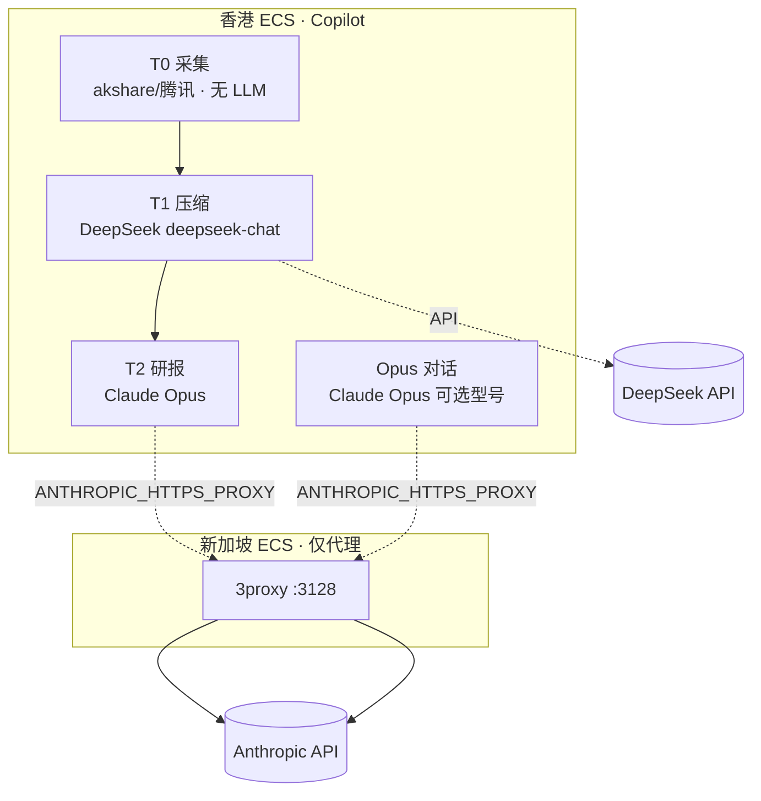

# 26 · 行情雷达与 AI 模型工作流（使用说明）

> **适用**：diting prod · 香港 K3s + 新加坡 Anthropic 出口代理 + DeepSeek T1 + Opus T2  
> **配置真相源**：`diting-src/.env` → `copilot-sync-ai-from-src-env.sh` → Helm Secret `diting-copilot-conn`  
> **代理真相源**：`config/terraform-diting-sg-proxy.tfvars` + `sg-proxy.conn`  
> **架构设计优化（T0 十七项 · T1 四算子 · T2 终局 schema）**：[27_行情雷达全链路架构设计优化](./27_行情雷达全链路架构设计优化.md)

---

## 一、基础设施：新加坡代理 ECS

### 1.1 选型（当前 tfvars）

| 项 | 值 |
|---|---|
| 地域 | **ap-southeast-1（新加坡）** |
| 规格 | **ecs.t6-c1m2.large**（2 vCPU · 2 GiB · 突发性能 t6） |
| 计费 | **Spot 竞价** `SpotAsPriceGo`，出价上限 **0.08 元/小时**（按量竞价，实际成交价≤上限） |
| 系统盘 | 40 GiB ESSD |
| 公网 | **EIP 按量 PayByTraffic**，峰值带宽 **50 Mbps** |
| 软件 | **3proxy** HTTP 代理，端口 **3128**，用户 `ditingproxy`（密码见 `TF_VAR_instance_password` / `ANTHROPIC_PROXY_PASSWORD`） |
| 状态 | 独立 Terraform state：`diting/sg-proxy`（与香港 `diting/prod` 分离） |

### 1.2 成本粗算（仅供预算，以阿里云账单为准）

| 组件 | 粗算（7×24 常开） | 说明 |
|---|---|---|
| 竞价 ECS | **约 ¥15～40/月** | t6 小规格 + 新加坡 Spot；闲时成交价常低于 0.08 元/时 |
| EIP | **约 ¥15～35/月** | 固定带宽费 + 出网流量；代理仅转发 Anthropic API，流量通常 **&lt;10 GB/月** 量级 |
| OSS（sg-proxy 桶） | **&lt;¥5/月** | 仅 deploy-engine 脚本占位，几乎无流量 |
| **合计** | **约 ¥30～80/月** | 显著低于单独买海外 VPS + 固定带宽 |

对比：香港 **base** 生产 ECS（`ecs.u1-c1m4.xlarge` Spot 上限 0.6 元/时）与数据盘另计，**代理栈仅承担出口，不跑 K3s/业务**。

### 1.3 部署与注入命令

```bash
cd diting-infra
# .env: TF_VAR_instance_password=...

make deploy-sg-anthropic-proxy          # 仅新加坡代理
make sync-anthropic-proxy-to-copilot    # HTTPS_PROXY → diting-src/.env → Helm

# 或随 prod 一键（diting-prod.yaml anthropic_proxy.enabled: true）
make deploy diting prod
```

验证：

```bash
kubectl exec -n platform deploy/diting-copilot -- sh -c \
  'test -n "$HTTPS_PROXY" && echo proxy=ok; test -n "$DEEPSEEK_API_KEY" && echo deepseek=ok'
```

---

## 二、模型分工总览（你的产品）



| 层级 | 推荐模型 | 环境变量 | 产品入口 |
|---|---|---|---|
| **T0** | 无（规则+行情源） | — | 行情雷达「启动扫描」/「仅采集 T0」 |
| **T1** | **deepseek-chat**（V3 对话模型，性价比） | `DEEPSEEK_API_KEY`、`DEEPSEEK_MODEL=deepseek-chat`、`RADAR_T1_MODE=auto` | 同上（扫描进度条「T1 DeepSeek…」） |
| **T2** | **claude-opus-4-6**（默认，可改 4.5～4.9） | `ANTHROPIC_API_KEY`、`LIGHTHOUSE_REMOTE_MODEL`、`RADAR_T2_ENABLED=true` | 勾选「深度推理」 |
| **对话** | 用户下拉 Opus 型号，默认 **4.6** | `RADAR_CHAT_DEFAULT_MODEL` | 工作台 Opus 对话 Tab |
| **Lighthouse 等** | Opus（非雷达主路径） | 同 Anthropic | 纵深进攻等模块 |

**不推荐**用 DeepSeek 做 T2 九维研报（未接 JSON 契约与 9 维 schema）；**不推荐** Opus 做 T1（成本高、T0 已结构化）。

---

## 三、行情雷达 · 模式 C 工作流程（你的主场景）

### 3.1 标准路径（生产推荐）

1. **（可选 A 路径）本机预拉**  
   `diting-src`: `make radar-t0-prefetch-with-t2` → `diting-infra`: `make radar-t0-sync`  
   → 生产读 PVC 缓存，**T2 可不调 Opus**（省 API + 绕过 403）。

2. **浏览器「启动扫描」**（标的 6 位代码，如 601138）  
   - **POST** `/api/radar/scans` → 后台任务  
   - **T0**：缓存命中则跳过 live；否则 akshare live  
   - **T1**：`DEEPSEEK_API_KEY` 存在 → **DeepSeek** 压事实矩阵；失败 → **规则**回退  
   - **T2**（勾选深度推理）：经 **ANTHROPIC_HTTPS_PROXY**（仅 Opus 客户端）→ 新加坡 → **Opus** 输出 9 维 JSON  
   - 入库候选池 + `radar_symbol_versions`  
   - 前端 **HTMX 轮询** `GET /api/radar/scans/{id}` 看进度与研报

3. **「仅采集 T0」**  
   T0 live + T1（DeepSeek 或规则），**不跑 T2**。

4. **「强制刷新」**  
   忽略 T0/T2 缓存，**必 live**；需代理可用，否则 T2 `error`。

### 3.2 环境开关规范

| 变量 | 建议值 | 作用 |
|---|---|---|
| `RADAR_T1_MODE` | `auto` | 有 DeepSeek Key 用 LLM T1，否则规则 |
| `RADAR_T2_ENABLED` | `true` | 关闭则仅 T0+T1 |
| `ANTHROPIC_HTTPS_PROXY` | `http://ditingproxy:***@<新加坡IP>:3128` | **仅** AIDispatcher Anthropic 客户端；**禁止** Pod 级 `HTTPS_PROXY`（否则 T0 akshare 403） |
| `HTTPS_PROXY` | — | **勿设**于 Copilot Pod；`make sync-anthropic-proxy` 会迁移为上一行 |

### 3.3 故障与规范（no-mock）

- T2 Opus 失败 → `t2_status=error`，**不伪造** 9 维 pending  
- T1 DeepSeek 失败 → 自动 **规则矩阵**，扫描继续  
- 日预算：`AI_DISPATCHER_BUDGET_YUAN_DAILY`（默认 1000 元软上限）

---

## 四、DeepSeek 在你产品中的具体触点

| 场景 | 是否用 DeepSeek | 调用链 |
|---|---|---|
| 行情雷达扫描 T1 | **是**（默认 auto） | `pipeline` → `build_t1_payload` → `AIDispatcher.call("radar_distill")` |
| 行情雷达 T2 | **否** | `radar_assess` → Anthropic |
| Opus 对话 | **否** | `radar_chat` → Anthropic |
| 本机预拉 `--with-t2` | T1 可用 DeepSeek；T2 仍 Opus（本机直连） | `radar_t0_prefetch.py` |
| Lighthouse / Teacher 等 | **否**（除非另配其他 key） | 其他 Scene |

---

## 五、推荐模型版本（2026-06 生产）

| 用途 | 推荐 | 备选 |
|---|---|---|
| T1 事实压缩 | **deepseek-chat** | `deepseek-reasoner` 更慢更贵，仅当矩阵质量不足时试验 |
| T2 深度研报 | **claude-opus-4-6** | 对话页可试 4.7/4.8；以 `RADAR_CHAT_DEFAULT_MODEL` 为准 |
| 日常对话 | **claude-opus-4-6** | 与 T2 同族，便于成本估算 |

---

## 六、运维检查清单

- [ ] `sg-proxy.conn` 存在且 IP 可达  
- [ ] Copilot pod：`HTTPS_PROXY` 已设置  
- [ ] Copilot pod：`DEEPSEEK_API_KEY`、`RADAR_T1_MODE=auto`  
- [ ] `make copilot-modec-verify` 或浏览器扫 601138 见 9 维 + 成本  
- [ ] 竞价实例被回收后：`make up-proxy diting sg-proxy` 恢复  

---

[Ref: step_14 行情雷达 · 25_四区漏斗 · anthropic-proxy-vps-setup.md · 24_需求实现表 §10]
