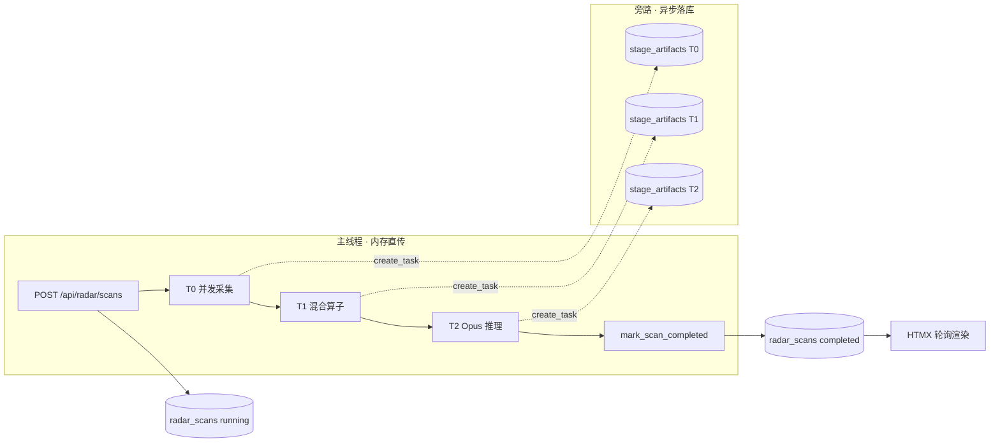
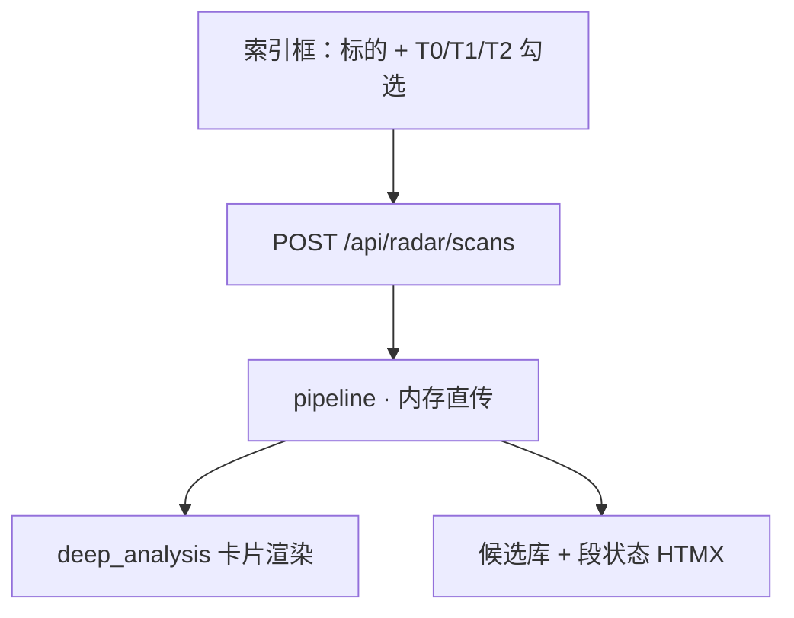

# 27 · 行情雷达 (Radar) 全链路架构设计优化（工程交付版）

> **文档定位**：`diting-src/apps/copilot/modules/radar/` 目录的**最高重构纲领**——买方机构级数据广度 + 实时工作台低延迟 + 旁路可审计 + 混合 T1 算子 + 结构化 T2 终局推演。  
> **替代关系**：取代原「As-Is 现状说明」；当前 **T0 四块 / 整段 T1 distill** 为演示级简化，本稿为采集与算子 To-Be 规约；**前端展示骨架（九维卡片 · `display_layout` · 自定义维 · 拖拽排序）保持不变**，仅优化内容与段状态交互。  
> **研判权重铁律**：产业生态位 **60%** + 博弈时机 **30%** + 财务与排雷 **10%**。  
> **架构脊柱**：`T0（全景并发提取）` → `T1（混合算子特征降维）` → `T2（Opus 终局推演）`；**主线程内存直传，旁路异步落库**。

> [!NOTE] **[TRACEBACK] 战略追溯锚点**
> - **L1 哲学**：[06_投资哲学体系总纲](../../01_顶层概念/06_投资哲学体系总纲.md)（②纵深进攻·多源验证 / ⑦壁垒 / ⑧归因）
> - **L2 实践规划**：[06_标的深度分析与阶段判定实践规划](../../02_战略维度/06_跨维度协作/06_标的深度分析与阶段判定实践规划.md)
> - **架构脊柱**：[25_四区漏斗_三段流水线_架构脊柱_设计](./25_四区漏斗_三段流水线_架构脊柱_设计.md)
> - **L3 step**：[step_14 行情雷达扫描与三段流水线](../00_维度零_AI投资副驾驶/stages/stage_1_启动期/steps/step_14_行情雷达扫描与三段流水线.md)
> - **行情降级**：[21_行情数据源降级与断路器规约](./21_行情数据源降级与断路器规约.md)
> - **事实门控**：[22_事实交叉验证与防幻觉规约](./22_事实交叉验证与防幻觉规约.md)
> - **运维工作流**：[26_行情雷达与 AI 模型工作流](./26_行情雷达与AI模型工作流.md)
> - **代码仓**：`diting-src/apps/copilot/modules/radar/`
> - **DNA**：[`dna_stage_1_启动期.yaml`](../_System_DNA/00_co_pilot/dna_stage_1_启动期.yaml) `funnel_pipeline_v3 / stage_artifact`

---

## §0 重构目标与 As-Is 差距

### §0.1 在四区漏斗中的角色（不变）

| 顺序 | 工作区 | 职责 |
|:---:|---|---|
| **①** | **行情雷达** | **初筛漏斗**：单标的结构化深度评估 → 候选池 → 人工晋级规划区 |
| ② | 滚动路线图 | 时间锚定 |
| ③ | 规划中 | 验证证伪 |
| ④ | 执行中 | 仓位 advisory（禁止自动下单） |

**入口**：`/planning?view=radar`。主路径 **模式 C**：6 位代码或简称 → 全链路扫描 → 候选池。

### §0.2 As-Is → To-Be 关键差距（必须消除的演示简化）

| 维度 | As-Is（当前代码） | To-Be（本稿） |
|---|---|---|
| **流水线形态** | 段间读写 DB / 缓存，近似离线跑批 | **主线程内存直传 + 旁路异步落库**（HTMX 丝滑） |
| **T0 广度** | 4 块：`quote` / `profile` / `financials` / `valuation` | **17 项**跨 5 域（宏观/产业/盘面/预期/排雷） |
| **T0 深度** | 60 日 K 线、单期财报、PE 分位 | 250 日 OHLCV、主营穿透、供应链、龙虎榜、北向/两融、监管公告等 |
| **T0 调度与网络** | Pod 内 akshare 直连；无统一标的清单 | **DB 表 `radar_t0_collect_symbols`（基础数据采集标的列表 · 唯一 SoT）**；前端「采集」默认入表；**全部** T0 一次性/定时/bootstrap **只读此表**；禁止全 A 股/全板块（T0-1 宏观除外） |
| **T1 引擎** | 整段 DeepSeek `radar_distill` 或四分区规则矩阵 | **17 项逐项算子**：15 项 Python + 2 项 DeepSeek（仅非结构化文本） |
| **T1 输出** | 中文四分区 `matrix` | 统一 `feature_node` + 五域嵌套 `fact_matrix` + `unavailable_data` |
| **T2 输出** | 九维 `deep_analysis` + 布局自定义维 | **延续**九维 `deep_analysis` + `display_layout` 自定义维 + 拖拽排序；**优化**卡片证据/文案质量；**新增** T0/T1/T2 **段处理状态**展示；内置维 **label/hint 微调**（去冗余命名）；`overall` 内嵌 **`radar_verdict`**（晋级/候选列，不替代卡片结构） |
| **T2 输入 / 扫描组合** | 三种组合均可选 | **默认** T0+T1+T2；**同等合法**：**仅 T2**、**T0+T2**（跳过 T1，T2 直读 T0 源数据）；勾选规则：须勾选 T2；勾选 T1 必须同时勾选 T0 |

**永久红线**（继承 25_ 架构脊柱）：no-mock · 源失败写 `null`+Warning 不阻断 · 全 advisory · 三段各落 `stage_artifacts`（旁路） · 晋级须人工确认。

### §0.3 架构核心矛盾与解法

| 错误范式（禁止） | 正确范式（本稿） |
|---|---|
| T0 落库 → 唤醒 T1 → T1 读库 → T1 落库 → 唤醒 T2（Celery/Airflow 跑批思维） | T0/T1/T2 **主链路纯内存传递**；`stage_artifacts` **旁路 fire-and-forget** |
| 段间 `await save_artifact()` 阻塞下一段 | `asyncio.create_task(save_artifact(...))` 或 `background_tasks.add_task(...)` **不 await** |
| HTMX 轮询等待 DB 写入完成才进下一段 | 仅 `radar_scans.status` 与最终 verdict **同步写**；artifact 异步补齐 |

**设计原则**：**主干跑得快，旁路记账全** —— 满足金融级审计，同时具备现代 AI 工作台所需的低延迟。

---

## §1 流水线执行架构：内存直传与旁路审计 (The Async Pipeline)

### §1.1 总览



### §1.2 核心执行流（Python 协程视角）

#### ① 触发与主记录创建

| 步骤 | 行为 |
|---|---|
| 用户点击「分析」 | 后端立即在 `radar_scans` 插入 `scan_id`，`status=running` |
| HTTP 响应 | **立即** 200 OK + `scan_id`；前端 HTMX 开始轮询 `GET /api/radar/scans/{id}/progress` |
| 禁止 | 在返回 200 前等待 T0/T1/T2 任何一段完成 |

#### ② T0 阶段（I/O 密集型）

| 路径 | 行为 |
|---|---|
| **主线程** | `asyncio.gather` 并发 17 个采集器 → 拼成 `t0_raw_data`（纯内存 dict） |
| **旁路** | `asyncio.create_task(save_artifact(scan_id, stage='T0', payload=t0_raw_data))` — **不 await** |
| **内存直传** | `t0_raw_data` 直接传入 T1 编排器 |

#### ③ T1 阶段（CPU + 少量 LLM I/O）

| 路径 | 行为 |
|---|---|
| **主线程** | 17 项算子并发/顺序执行（Python 毫秒级；T0-4/T0-17 DeepSeek 仅 2 次 LLM 调用，可并行）→ `fact_matrix` |
| **旁路** | `create_task(save_artifact(scan_id, stage='T1', payload=fact_matrix))` |
| **内存直传** | `fact_matrix` + `unavailable_data` → XML 包装 → T2 Prompt |

#### ④ T2 阶段（大模型推理）

| 路径 | 行为 |
|---|---|
| **主线程** | `await call_opus_t2(fact_matrix)` → `t2_verdict` |
| **旁路** | `create_task(save_artifact(scan_id, stage='T2', payload=t2_verdict))` |
| **闭环** | **同步** `await mark_scan_completed(scan_id, t2_verdict)` + 写 `radar_candidates`；下次 HTMX 轮询拿到 completed |

### §1.3 参考伪代码（`pipeline.py` 目标形态）

```python
async def run_radar_pipeline(scan_id: int, symbol: str, *, bg: BackgroundTaskSink):
    # T0 — I/O 并发
    t0_data = await fetch_t0_all(symbol)          # 17 collectors · gather
    bg.fire(save_artifact, scan_id, "T0", t0_data)  # 旁路，不 await

    # T1 — 内存直传
    t1_payload = await build_fact_matrix(t0_data)   # 17 operators → assembler
    bg.fire(save_artifact, scan_id, "T1", t1_payload)

    # T2 — Opus
    t2_verdict = await call_opus_t2(t1_payload["fact_matrix"], t1_payload["unavailable_data"])
    bg.fire(save_artifact, scan_id, "T2", t2_verdict)

    # 仅终态与候选列同步落库（HTMX 依赖）
    await mark_scan_completed(scan_id, t2_verdict)
    await upsert_radar_candidate(scan_id, t2_verdict)
```

### §1.4 旁路落库工程约束

| 项 | 规约 |
|---|---|
| **失败处理** | 旁路 `save_artifact` 失败 → 日志 + 指标告警；**不**回滚主链路已完成 verdict |
| **重试** | 旁路任务最多 3 次指数退避；仍失败则 `stage_artifacts` 该行 `status=write_failed`，scan 仍 `completed` |
| **审计追溯** | 排障时用 `scan_id` 查 T0/T1/T2 三行 artifact；主链路内存对象与 artifact 应 JSON 等价 |
| **CronJob 批处理** | 仅 **`radar_t0_collect_symbols`** + T0-1 全局；与一次性 Job **同读 `load_t0_collect_symbols()`** |
| **进度回调** | `progress_cb(stage, pct)` 在主线程各段边界触发，供 HTMX 进度条；**不**依赖 artifact 落库完成 |

### §1.5 预期收益

1. **Zero I/O Block**：T0 完成 → T2 开推之间无段间 DB 读写等待；全链路省去 ≥3 次同步落库，响应可提升 **30%+**。
2. **Auditability 不降级**：旁路仍 100% 写入 `stage_artifacts`；T2 出错可反查 T0 脏数据 vs T1 算错。
3. **代码心智**：主链路一条直线 `t0 → t1 → t2 → done`；持久化与业务解耦。

---

## §2 T0 数据湖：底稿级全量采集规范 (Data Ingestion)

### §2.1 工程约束

1. **网络与调度分工**：主节点部署于**香港阿里云 ECS**（`cn-hongkong`）。须同时满足：
   - **基础数据采集标的列表（强制 · 唯一 SoT）**：见 **§2.1.1**。凡 **T0 持久化采集**（一次性 Job、CronJob、bootstrap 补跑、CLI 批量采集）**必须** `SELECT` 此表，**禁止**硬编码 symbol 列表或全市场遍历。
   - **入表入口**：前端搜索标的 → 点击 **「基础数据采集」** → **默认 UPSERT 入表** + 触发该标的首次 T0 采集。
   - **定时同步**：CronJob 按 §2.8 频率，对 **表内 `enabled=true` 标的** + **全局 T0-1** 执行。
   - **盘中高频**：T0-1 → QMT/FRP + `sentiment-intraday`（宏观全局，不逐标的）。
   - 备源降级见 [21_](./21_行情数据源降级与断路器规约.md)；Pod **不设**全局 `HTTPS_PROXY`（Anthropic 见 26_）。
   - **时区**：Cron 表达式 **`Asia/Shanghai`**；Chart 注入 `TZ=Asia/Shanghai`。

#### §2.1.1 基础数据采集标的列表（`radar_t0_collect_symbols` · 唯一 SoT）

> **一句话**：PostgreSQL 维护 **一张表 = T0 采集 universe**；前端「采集」即入表；**不管一次性还是定时，凡 T0 落库同步/检查都只针对表内标的**。

**表结构 `radar_t0_collect_symbols`**

| 字段 | 类型 | 说明 |
|---|---|---|
| `symbol` | `VARCHAR(6)` PK | 6 位代码 |
| `name` | `TEXT` | 简称（搜索/展示） |
| `enabled` | `BOOLEAN` | `true`：参与 **全部** T0 任务；`false`：暂停采集（行保留，可再启用） |
| `enrolled_at` | `TIMESTAMPTZ` | 首次入表（首次点「基础数据采集」） |
| `enrolled_by` | `TEXT` | `workbench` / `cli` / `api` |
| `last_collect_at` | `TIMESTAMPTZ` | 任意 T0 任务上次对该标的采集成功时间 |
| `last_collect_job` | `TEXT` | 上次触发的 job_id（如 `collect-once` / `micro-dragon-daily`） |
| `last_trade_date` | `DATE` | 日频项最后覆盖交易日（可空） |
| `notes` | `TEXT` | 可选备注 |

**统一读取合约（代码唯一入口）**

```python
# apps/copilot/modules/radar/t0/symbol_list.py
async def load_t0_collect_symbols(*, enabled_only: bool = True) -> list[str]:
    """CronJob · bootstrap · 一次性 Job · status 检查 · CLI 批量采集 均调用此函数。"""
```

| 消费者 | 用法 |
|---|---|
| **CronJob**（§2.8.2 per-symbol） | `symbols = load_t0_collect_symbols()` → `for s in symbols: collect(...)` |
| **一次性 Job** `collect-once` | 同上；或 API 指定单 `symbol` 时先 **UPSERT 入表** 再采 |
| **bootstrap-sync** | 对表内每个 symbol 检查 watermark 缺口并补跑 |
| **`radar-pipeline-status`** | 输出表行数 + 每 symbol 的 stale 标记 |
| **Helm init Job** | 建表 + 空表合法（仅 T0-1 全局 Cron 仍运行） |

**前端入表（默认行为）**

| 步骤 | 行为 |
|---|---|
| 1 | 用户搜索并选中标的 |
| 2 | 点击 **「基础数据采集」**（原「仅采集」/`POST /api/radar/collect`） |
| 3 | **事务内** `UPSERT radar_t0_collect_symbols (symbol, name, enabled=true, enrolled_at=now())` |
| 4 | 触发 **一次性 T0 采集**（与 Cron 单标的逻辑相同 collector，写 PG/Parquet） |
| 5 | UI 展示「已纳入基础数据采集列表」 |

**与分析（Scan）的边界**

| 入口 | 是否入表 | T0 数据 |
|---|---|---|
| **基础数据采集** | **是 · 默认** | 持久化 + 纳入后续所有 T0 任务 |
| **分析**（未点采集） | **否** | 仅 session 内存 + 旁路 artifact；**不**写入 collect_symbols |

**硬性规则**

| # | 规则 |
|:---:|---|
| R1 | **禁止** T0 Job/Cron 遍历全 A 股、全板块成分（**T0-1 宏观除外**） |
| R2 | **禁止**从 `my_holdings.yaml` 自动灌表；持仓 SoT 与采集列表 **解耦** |
| R3 | 表内 **无记录** 的标的 → 任何 **持久化** T0 任务 **不得**为其写库 |
| R4 | 一次性与定时 **共用同一 collector**；差异仅在触发器（API vs Cron） |
| R5 | 用户 `enabled=false` → 跳过 Cron/bootstrap；历史数据保留；可再次点采集启用 |
| R6 | T0-2/3 板块项：仅拉 **表内标的所属板块** 去重集合 |

**扩展期**：批量导入须 ADR；`RADAR_T0_IMPORT_SYMBOLS_CSV` 等默认 **关**。

2. **容错机制**：单节点/单源失败 → 该字段 `null` + `Warning` + 记入 `unavailable`；**禁止** `raise Exception` 阻断 Pipeline。子块：`status=ok|partial|error`。

3. **存储分层**：

| 介质 | 适用数据 | TTL / 保留策略 |
|---|---|---|
| **Redis** | 全市场情绪 **热缓存**（T0-1 当前交易日快照） | **事件驱动刷新**，非固定 24h 卡死（见 §2.2.1） |
| **PostgreSQL** | 全市场情绪 **日级历史**、板块、财务、资金、公告 | T0-1 **永久按交易日保留**；其余按域 TTL |
| **Parquet / JSON 列** | 250 日 OHLCV | 永久 |
| **PVC 预拉 bundle** | `scan_origin=internal` | ~24h 可配置 |

4. **CronJob 索引**：完整 Pod 规划、水位表与冷启动补同步见 **§2.8**（取代下方简表）。

---

### §2.2 域 1：宏观与中观上下文 (Global & Meso)

*全局共享，按标的所属板块 join。*

| ID | 数据指标类型 | 核心字段目标 | 最佳获取源 (主/备) | 存储 | 更新频率 |
|:---:|---|---|---|---|---|
| **1** | 全市场情绪量能 | 两市成交额缩放量、涨跌比、连板高度 | 主：QMT 桥接<br>备：akshare | **Redis 热缓存 + PG 日级历史**（§2.2.1） | 盘中高频 / **15:30 定稿** |
| **2** | 板块绝对动能 | 申万/概念板块近 3 日涨跌幅及排名 | 主：akshare<br>备：同花顺 Web | PG · 7d | 每日 16:00 |
| **3** | 板块主力资金 | 板块近 3 日大单净流入 | 主：akshare<br>备：QMT | PG · 7d | 同上 |

**T0 键**：`macro.market_sentiment` · `macro.sector_momentum[{code}]` · `macro.sector_flow[{code}]`

#### §2.2.1 T0-1 全市场情绪量能 · 双写与刷新规约

> **设计动机**：仅 Redis + 固定 24h TTL 会在跨交易日后仍Serving 过期快照，且无法支撑长期情绪复盘。采用 **Redis 热读 + PostgreSQL 冷存 + 事件驱动刷新**。

**存储职责**

| 层 | 键 / 表 | 职责 |
|---|---|---|
| **Redis 热缓存** | `radar:macro:market_sentiment:current` | Scan 主链路 **只读此键**；毫秒级；存**当前交易日**最新快照 |
| **PostgreSQL 日表** | `radar_market_sentiment_daily` | 按 **`trade_date`（交易日，非自然日）** UPSERT；**永久保留**；供复盘、走势、T1 历史对比 |

**`radar_market_sentiment_daily` 核心字段（L3 契约）**

| 字段 | 类型 | 说明 |
|---|---|---|
| `trade_date` | `DATE` PK | A 股交易日 |
| `total_turnover_yi` | `NUMERIC` | 两市成交额（亿） |
| `turnover_vs_prev_pct` | `NUMERIC` | 较上一交易日缩放量 % |
| `advance_ratio` | `NUMERIC` | 上涨家数占比 |
| `limit_up_height` | `INT` | 连板高度 |
| `snapshot_json` | `JSONB` | 完整 T0-1 原始 payload（含 `collected_at`、数据源） |
| `finalized_at` | `TIMESTAMPTZ` | 15:30 定稿写入时间 |
| `source` | `TEXT` | `qmt_bridge` / `akshare` |

**刷新节奏（禁止纯 TTL 过期才更新）**

| 阶段 | 触发 | 动作 |
|---|---|---|
| **盘中** | CronJob `radar-t0-sentiment-intraday`（如每 5～15 分钟，仅交易时段） | QMT/akshare 拉取 → **仅写 Redis** `current`；可设 **短 TTL 兜底**（如 30min）防僵尸键，**不以 24h 作为唯一失效条件** |
| **盘后定稿** | CronJob `radar-t0-sentiment-eod` @ **15:30**（数据源收盘汇总就绪后） | ① 拉取**当日最终**情绪快照<br>② **UPSERT** `radar_market_sentiment_daily`（`trade_date=今日`）<br>③ **`SET` Redis `current` 并 DEL 旧版本逻辑** — **强制覆盖**，无视剩余 TTL<br>④ Redis 附加 `trade_date` / `finalized=true` 元数据，供读侧校验 |
| **非交易时段** | 无盘中 Job | Scan 读 Redis；若 `trade_date` ≠ 最近已收盘交易日 → **降级读 PG 最近一行** 填入 `macro.market_sentiment` |

**Scan 读路径（Workbench T0 并发采集之一）**

```
1. GET Redis radar:macro:market_sentiment:current
2. 若 miss 或 trade_date 过期 → SELECT … FROM radar_market_sentiment_daily ORDER BY trade_date DESC LIMIT 1
3. 仍无 → unavailable += "T0-1:market_sentiment_missing"
```

**复盘 / 长期走势（扩展消费，非 Scan 热路径）**

- API 或报表：`SELECT * FROM radar_market_sentiment_daily WHERE trade_date BETWEEN … ORDER BY trade_date`
- T1 算子 `op_t01_market_temperature` **启动期**仅消费 `current` 快照；**扩展期**可增加「近 N 日成交额序列」读 PG 历史表（写入 §3.2 算子 `context` 扩展句，非 P0 阻塞项）。

**Redis TTL 建议**

| 键 | 建议 TTL | 说明 |
|---|---|---|
| `…:current` | **30min～2h 滑动**（盘中 Job 续期） | 防 Job 停摆；**15:30 eod Job 必须 force SET** |
| 禁止 | 单独依赖 **24h TTL** 作为跨日更新机制 | 跨日后靠 **eod 强制刷新 + trade_date 校验** |

---

### §2.3 域 2：产业生态 (Ecosystem — 60%)

| ID | 数据指标类型 | 核心字段目标 | 最佳获取源 (主/备) | 存储与 TTL | 更新频率 |
|:---:|---|---|---|---|---|
| **4** | 基础档案 | 上市日期、主营简介、核心概念 | akshare | PG · 1y | 首次 / 每月 |
| **5** | 主营结构穿透 | 产品/行业/地区营收利润占比 | Tushare Pro / akshare | PG · 180d | 财报季 |
| **6** | 供应链话语权 | 前五大客户/供应商占比 | akshare 年报 / 巨潮 PDF | PG · 1y | 每年 5 月 |
| **7** | 同业竞品对标 | 同板块市值 Top5 | akshare / QMT | PG · 30d | 每日盘后 |

**T0 键**：`ecosystem.profile` · `ecosystem.segment_breakdown[]` · `ecosystem.supply_chain` · `ecosystem.peer_ranking[]`

---

### §2.4 域 3：盘面微观 (Microstructure — 30%)

| ID | 数据指标类型 | 核心字段目标 | 最佳获取源 (主/备) | 存储与 TTL | 更新频率 |
|:---:|---|---|---|---|---|
| **8** | 全视角量价序列 | 近 250 日 OHLCV 前复权 | QMT / akshare | Parquet · 永久 | 分析时增量 |
| **9** | 聪明资金池 | 陆股通 30 日持股与净买卖 | akshare | PG · 90d | 18:00 |
| **10** | 杠杆动能 | 融资融券 30 日余额变动 | akshare | PG · 90d | 09:00 T-1 |
| **11** | 游资接力留痕 | 近 10 日龙虎榜明细 | akshare / 同花顺 | PG · 30d | 17:30 |

**T0 键**：`micro.bars_250d` · `micro.northbound` · `micro.margin` · `micro.dragon_tiger[]`

---

### §2.5 域 4：预期差 (Consensus)

| ID | 数据指标类型 | 核心字段目标 | 最佳获取源 | 存储与 TTL | 更新频率 |
|:---:|---|---|---|---|---|
| **12** | 机构盈利预测 | 一致预期 EPS、净利两年复合增速 | akshare | PG · 90d | 周末 |
| **13** | 券商评级异动 | 3 个月首次覆盖/上调/下调家数 | akshare | PG · 90d | 周末 |

**T0 键**：`consensus.eps_forecast` · `consensus.rating_changes`

---

### §2.6 域 5：排雷 (Risks — 10%)

| ID | 数据指标类型 | 核心字段目标 | 最佳获取源 | 存储与 TTL | 更新频率 |
|:---:|---|---|---|---|---|
| **14** | 财务排雷切片 | 营收、扣非、经营现金流、商誉 | Tushare / akshare | PG · 180d | 财报季 |
| **15** | 大股东质押 | 实控人及大股东质押比例 | akshare / Tushare | PG · 30d | 周末 |
| **16** | 限售解禁 | 未来 6 月解禁日期及占比 | akshare / Tushare | PG · 180d | 周末 |
| **17** | 监管与处罚 | 问询函、关注函、立案调查 | akshare 巨潮 | PG · 1y | 20:00 |

**T0 键**：`risk.financial_slice` · `risk.pledge` · `risk.unlock_schedule[]` · `risk.regulatory_events[]`

---

### §2.8 T0 CronJob Pod 任务规划与冷启动补同步

> **目标**：定时 + 一次性 + bootstrap **统一**以 **`radar_t0_collect_symbols`** 为标的 universe（+ 全局 T0-1）。

#### §2.8.1 部署形态（云原生 · Chart 内模板）

| 项 | 规约 |
|---|---|
| **Chart 位置** | `diting-infra/charts/diting-stack/templates/radar-t0/`（ConfigMap + CronJob + Job）；**禁止**独立 shell 调 `kubectl create` |
| **Workload** | 每行 §2.8.2 表 → 一个 `CronJob`；共享 `copilot` 镜像，入口 `python -m apps.copilot.jobs.radar_t0.<job_id>` |
| **命名** | `radar-t0-<job_id>` · namespace `platform`（与 diting-copilot 同栈） |
| **并发** | `concurrencyPolicy: Forbid`（同 job 不重叠） |
| **超时** | `activeDeadlineSeconds`：intraday 600 · daily 1800 · weekly 3600 |
| **调度宽限** | `startingDeadlineSeconds: 3600`（1h 内错过仍补跑一次） |
| **资源** | CPU 500m～1 · memory 512Mi～1Gi；**禁止**调度 GPU 节点 |
| **凭证** | 与 copilot 同 Secret（DSN · Tushare · QMT 桥 URL）；ConfigMap `radar-t0-jobs.yaml` 列 cron 与 T0 ID 映射 |
| **Makefile** | `diting-infra`: `make radar-t0-cron-install` = helm upgrade；`make radar-t0-bootstrap-sync` = 手动触发冷启动 Job |

#### §2.8.2 任务注册表（T0 ID ↔ CronJob ↔ 执行内容）

> **标的范围列**：`全局` = 不读 collect 表；`表内标的` = `load_t0_collect_symbols()` → `WHERE enabled=true`。

| job_id | T0 | 标的范围 | Cron（上海） | 执行内容 | 写入目标 |
|---|---|---|---|---|---|
| `sentiment-intraday` | 1 | **全局** | `*/10 9-15 * * 1-5` | 两市成交额/涨跌比/连板 | Redis |
| `sentiment-eod` | 1 | **全局** | `30 15 * * 1-5` | 日定稿 → PG + 强制刷新 Redis | PG + Redis |
| `macro-sector-daily` | 2,3 | **表内标的→板块去重** | `0 16 * * 1-5` | 关联板块 3 日涨跌 + 资金 | PG |
| `ecosystem-peer-daily` | 7 | **表内标的** | `0 17 * * 1-5` | 同业 Top5 市值重排 | PG |
| `micro-margin-daily` | 10 | **表内标的** | `0 9 * * 1-5` | 融资融券 T-1 | PG |
| `micro-dragon-daily` | 11 | **表内标的** | `30 17 * * 1-5` | 龙虎榜近 10 日 | PG |
| `micro-northbound-daily` | 9 | **表内标的** | `0 18 * * 1-5` | 陆股通 30 日 | PG |
| `risk-regulatory-daily` | 17 | **表内标的** | `0 20 * * 1-5` | 监管公告 | PG |
| `consensus-weekly` | 12,13 | **表内标的** | `0 10 * * 6` | 一致预期 + 评级 | PG |
| `risk-pledge-unlock-weekly` | 15,16 | **表内标的** | `0 8 * * 6` | 质押 + 解禁 | PG |
| `ecosystem-profile-monthly` | 4 | **表内标的** | `0 2 1 * *` | 档案/概念 | PG |
| `ecosystem-segments-quarterly` | 5 | **表内标的** | `0 3 1 5,9,11 *` | 主营结构 | PG |
| `ecosystem-supply-chain-annual` | 6 | **表内标的** | `0 4 10 5 *` | 供应链 | PG |
| `risk-financials-quarterly` | 14 | **表内标的** | `0 5 1 5,9,11 *` | 财务排雷 | PG |
| `bars-reconcile-daily` | 8 | **表内标的** | `0 19 * * 1-5` | K 线盘后对账 | Parquet/PG |
| **`collect-once`** | 4～17,8 | **API 指定或表单内标的** | —（一次性 Job） | 前端「基础数据采集」触发；**先 UPSERT 表再采** | PG/Parquet |

**表为空时**：除 **全局** T0-1 外，所有 per-symbol Cron / 一次性批量 **no-op**（`collect_list_empty`），**禁止** fallback 全市场。

**触发源汇总**

| 类型 | 触发 | 标的来源 |
|---|---|---|
| **定时** | CronJob | `load_t0_collect_symbols()` |
| **一次性** | `POST /api/radar/collect` · `make radar-t0-collect` | 指定 symbol **UPSERT 表** + 采集 |
| **补同步** | `bootstrap-sync` · helm Hook | `load_t0_collect_symbols()` + watermark 缺口 |
| **检查** | `radar-pipeline-status` | 同上 + stale 报告 |

#### §2.8.3 水位表与冷启动补同步（Bootstrap）

**表 `radar_t0_sync_watermarks`**（PostgreSQL · Chart init Job 建表）

| 字段 | 说明 |
|---|---|
| `job_id` | PK · 与 §2.8.2 一致 |
| `last_success_at` | 上次成功完成时间（TIMESTAMPTZ） |
| `last_trade_date` | 适用日频 job：最后覆盖的 **A 股交易日** |
| `last_row_count` | 写入行数摘要（可观察） |
| `last_error` | 失败原因；成功时 NULL |
| `catch_up_pending` | bool · bootstrap 标记待补跑 |

**Job `radar-t0-bootstrap-sync`**（一次性 Job · 非 Cron）

| 触发时机 | 动作 |
|---|---|
| **Helm install/upgrade** 后 | `post-upgrade` Hook Job（权重低于 copilot Deployment） |
| **P 轨集群重建** / `make up-stack` 后 | Makefile 显式 `make radar-t0-bootstrap-sync`（与 Hook 二选一执行即可，重复跑须幂等） |
| **人工** | 同上 make target |

**Bootstrap 算法（每个 `job_id`）**

```
1. symbols = load_t0_collect_symbols()
2. IF job 为 per-symbol 且 symbols 为空 → SKIP（T0-1 全局 job 仍执行）
3. READ watermarks[job_id]
4. FOR symbol IN symbols（或板块去重集合）: 检查缺口 → RUN collector
5. UPDATE radar_t0_collect_symbols.last_collect_at / last_collect_job
6. UPSERT watermark；T0-1 全局按 §2.2.1
```

**防止集群关掉忘记同步**

| 机制 | 说明 |
|---|---|
| `startingDeadlineSeconds` | Cron 错过 1h 内仍执行 |
| Bootstrap Hook | **每次** helm upgrade 全量检查缺口 |
| `radar-pipeline-status` | 列出各 job watermark 与「是否 stale」 |
| 告警（扩展期） | watermark 落后 >2 个交易日 → 平台告警；启动期仅日志 |

#### §2.8.4 Scan、前端采集与 T0 任务边界

| 场景 | 行为 |
|---|---|
| 前端「基础数据采集」 | **UPSERT `radar_t0_collect_symbols`** + 一次性 `collect-once` |
| 用户仅「分析」 | session live；**不入表** |
| 表内标的 + Cron/一次性已写 PG | Scan T0 **优先读库** |
| 表外标的 | 持久化 T0 任务 **跳过**；Scan 可 live 补 session |
| 表为空 | 仅 T0-1 全局任务运行 |
| 集群重建 | bootstrap 对 **表内标的** 补缺口 |

---

### §2.7 T0 顶层 JSON 契约

```json
{
  "symbol": "300308",
  "name": "中际旭创",
  "collected_at": "2026-06-04T16:30:00+08:00",
  "source_manifest": { "8": "qmt_bridge", "5": "tushare_pro" },
  "macro": {},
  "ecosystem": {},
  "micro": {},
  "consensus": {},
  "risk": {},
  "unavailable": ["micro.margin:exchange_delay"]
}
```

---

## §3 T1 层：混合算子引擎 (The Transformer)

### §3.1 引擎路由边界

T1 是**混合计算引擎**，任务路由极其明确：

| 数据类型 | 引擎 | 延迟目标 |
|---|---|---|
| **结构化数值 / 时序** | **Python (Pandas/NumPy)** | 毫秒级；数学绝对准确 |
| **非结构化长文本**（T0-4 简介、T0-17 监管公告原文） | **DeepSeek (`deepseek-chat`)** | 降维抽取；禁止编造 |

**统一输出 Schema**（每一项算子必须遵守）：

```json
{
  "value": 0.0,
  "tag": "极简状态标签",
  "context": "完整事实依据"
}
```

- `value`：原始计算值；无法数值化时为 `null`（如纯文本提炼项）。
- `tag`：高危项**必须**含 `🔴` 前缀；T2 识别后一票否决权重上调。
- `context`：可审计的自然语言事实句；**禁止**编造 T0 中不存在的信息。

**删除**：原 `t1_distill.py` 整段 JSON 压缩 Prompt；DeepSeek **仅**允许出现在 `t1/operators/op_t04_profile_llm.py` 与 `op_t17_regulatory_llm.py`。

**输入**：§2 全部 17 项（macro 按板块 join）。  
**输出**：`radar_matrix_assembler.py` 产出的 `fact_matrix` + `unavailable_data`。  
**与 §1 关系**：T1 **只读内存中的 `t0_raw_data`**；不读 DB；算完后内存直传 T2，artifact 旁路写。

---

### §3.2 域 1 · 全局与中观 — 纯 Python

| T0 ID | 算子模块 | 引擎 | 输入 | 处理规则与边界 | 输出示例 |
|:---:|---|---|---|---|---|
| **1** | `op_t01_market_temperature` | Python | 两市总成交额、涨跌家数 | 成交额较昨日缩放量 %；上涨家数占比 | `{"value": -12.5, "tag": "缩量退潮", "context": "两市总成交额较昨日缩量12.5%，上涨家数不足30%"}` |
| **2** | `op_t02_sector_momentum` | Python | 标的所属板块近 3 日涨幅 | 涨幅绝对值 + 申万二级行业百分位排名 | `{"value": 0.05, "tag": "板块领涨", "context": "所属板块近3日涨幅排名前5%，处于风口"}` |
| **3** | `op_t03_sector_flow` | Python | 板块近 3 日大单流入流出 | 累加净额；正负判断 | `{"value": 15.2, "tag": "主力净流入", "context": "所属板块近3日主力资金净流入15.2亿"}` |

---

### §3.3 域 2 · 产业生态 — 混合算子

| T0 ID | 算子模块 | 引擎 | 输入 | 处理规则与边界 | 输出示例 |
|:---:|---|---|---|---|---|
| **4** | `op_t04_profile_llm` | **DeepSeek** | 公司简介、主营业务长文本 | Prompt：≤10 字产业标签 + 一句话概括主营；**仅提炼不推断** | `{"value": null, "tag": "算力液冷设备", "context": "主营业务为数据中心液冷服务器及温控设备研发制造"}` |
| **5** | `op_t05_segment_top3` | Python | 营收构成 JSON 数组 | 按营收占比降序 Top3 拼接；Top1 ≥70% → `tag: 主业高度集中` | `{"value": 78.5, "tag": "主业高度集中", "context": "核心业务A占比78.5%，业务B占比12%"}` |
| **6** | `op_t06_supply_chain` | Python | 前五大客户/供应商占比 | 大客户合计 >50% → `tag: 大客户依赖`；>60% → `tag: 严重依赖单一客户` | `{"value": 65.0, "tag": "大客户依赖", "context": "前五大客户营收占比达65%"}` |
| **7** | `op_t07_peer_rank` | Python | 同板块市值排行、本标的市值 | Index 排名；前二 → `tag: 赛道龙一/龙二`；前 20% → `tag: 赛道头部` | `{"value": 2, "tag": "赛道龙二", "context": "总市值在细分板块内排名第2/45"}` |

---

### §3.4 域 3 · 盘面微观 — 纯 Python (Pandas)

| T0 ID | 算子模块 | 引擎 | 输入 | 处理规则与边界 | 输出示例 |
|:---:|---|---|---|---|---|
| **8** | `op_t08_price_action` | Python | 近 250 日 K 线 | MA20/MA60；收盘 vs 均线 → 左/右侧；近 20 日涨停数 ≥3 → `tag: 右侧极度活跃` | `{"value": 3, "tag": "右侧极度活跃", "context": "收盘站上MA20多头排列，近20日3次涨停"}` |
| **9** | `op_t09_northbound` | Python | 近 30 日北向净买入数组 | 近 5 日净买入之和及趋势 | `{"value": 3.5, "tag": "外资持续加仓", "context": "北向资金近5个交易日累计净买入3.5亿元"}` |
| **10** | `op_t10_margin_roc` | Python | 近 30 日融资余额 | 较 5 日前 ROC；>5% 且北向净流出 → 与 T0-9 组合标签 `内资加杠杆游资博弈` | `{"value": 0.08, "tag": "杠杆做多高涨", "context": "融资余额近一周环比增长8%"}` |
| **11** | `op_t11_dragon_tiger` | Python | 近 10 日龙虎榜 | 上榜次数；机构专用 / 知名游资席位净买入 | `{"value": 2, "tag": "机构游资共振", "context": "近10日上榜2次，机构专用席位大额净买入"}` |

---

### §3.5 域 4 · 预期差 — 纯 Python

| T0 ID | 算子模块 | 引擎 | 输入 | 处理规则与边界 | 输出示例 |
|:---:|---|---|---|---|---|
| **12** | `op_t12_eps_growth` | Python | 一致预期净利数组 | 当前自然年机构一致预期增长率 | `{"value": 45.5, "tag": "高成长预期", "context": "机构一致预期今年净利润同比增长45.5%"}` |
| **13** | `op_t13_rating_surge` | Python | 近 3 月评级历史 | 统计上调 + 首次覆盖；≥3 → `tag: 机构密集翻多` | `{"value": 4, "tag": "机构密集翻多", "context": "近3个月4家券商上调或首次覆盖"}` |

---

### §3.6 域 5 · 极限排雷 — 混合算子

> 触发高危判定时 `tag` **必须**带 `🔴`；T2 须上调 `red_flag_alert.status`。

| T0 ID | 算子模块 | 引擎 | 输入 | 处理规则与边界 | 输出示例 |
|:---:|---|---|---|---|---|
| **14** | `op_t14_financial_red` | Python | 三大表核心数值 | (1) 经营现金流<0 且净利>0；(2) 商誉/净资产>20%；满足其一 → 🔴 | `{"value": 25.4, "tag": "🔴巨额商誉隐患", "context": "商誉占净资产25.4%，经营现金流与利润严重背离"}` |
| **15** | `op_t15_pledge` | Python | 质押比例 | >70% → 🔴极高爆仓；>50% → 警告 | `{"value": 85.0, "tag": "🔴极高爆仓风险", "context": "大股东股权质押率85%"}` |
| **16** | `op_t16_unlock` | Python | 未来 6 月解禁数组 | 最近解禁 <60 天且占比>5% → 🔴 | `{"value": 12.5, "tag": "🔴即期巨额解禁", "context": "30天后解禁占总股本12.5%"}` |
| **17** | `op_t17_regulatory_llm` | **DeepSeek** | 问询函/立案公告原文 | 分级：常规问询 / 严重警告 / 立案调查；后两者 → 🔴 | `{"value": null, "tag": "🔴立案调查退市风险", "context": "上周因涉嫌信披违规被证监会立案调查"}` |

---

### §3.7 T1 最终装配 (`radar_matrix_assembler.py`)

17 项算子完成后，控制流统一汇聚：

1. **剔除与隔离**：T0 缺失或算子返回 `skip` → 该项**不写入** `fact_matrix`，描述推入 `unavailable_data`（如 `"标的非陆股通成分股，缺少 T0-9 聪明资金数据"`）。
2. **五域嵌套组装**：

```json
{
  "fact_matrix": {
    "global_and_meso": {
      "market_temperature": {"value": -12.5, "tag": "缩量退潮", "context": "..."},
      "sector_momentum": {},
      "sector_flow": {}
    },
    "ecosystem": {
      "company_profile": {},
      "business_composition": {},
      "supply_chain_concentration": {},
      "peer_rank": {}
    },
    "microstructure": {
      "price_action": {},
      "northbound_flow": {},
      "margin_leverage": {},
      "dragon_tiger": {}
    },
    "consensus": {
      "eps_growth_forecast": {},
      "rating_momentum": {}
    },
    "risks_red_flags": {
      "financial_quality": {},
      "equity_pledge": {},
      "share_unlock": {},
      "regulatory": {}
    }
  },
  "unavailable_data": [
    "标的非陆股通成分股，缺少 T0-9 聪明资金数据"
  ]
}
```

3. **内存直传 T2**：Assembler 输出整体作为 T2 User 消息体；**不 await** 旁路 T1 artifact。

**DeepSeek T1 参数**：`radar_t1_extract`，`max_tokens=1024`，`temperature=0.1`；解析失败 → 该项进 `unavailable_data`，**不**阻断其它算子。

---

## §4 T2 层：Opus 终局推演引擎 (The Assessor)

### §4.1 工程约束

- 将 T1 `fact_matrix` / `unavailable_data` 包入 XML `<fact_matrix>` / `<unavailable_data>`（全链路模式）；T0+T2 模式包入 `<t0_raw>`；仅 T2 模式仅传标的与布局维度简报。
- System 指令内化 **60-30-10** 权重；**严禁**编造输入中不存在的数据。
- 模型：`claude-opus-4-*`（`radar_assess`）；Anthropic → `ANTHROPIC_HTTPS_PROXY`（26_）。
- 参数：`max_tokens=4096`，`temperature=0.2`。
- 解析：`parse_opus_verdict(text, dim_keys)` → 九维 + `overall` → **同步**写 scan/candidate；artifact **旁路**。

### §4.2 前端展示契约（主题结构 · 不魔改）

> **红线**：不重做 Workbench 信息架构；`display_layout.json`（PVC）、拖拽排序、显隐、自定义维、`HTMX` 卡片渲染 **沿用现设计**。

| 保持不变 | 本轮回仅优化 |
|---|---|
| 九维内置 key（`niche` … `valuation`）与卡片布局 | 各维 **verdict / reasoning / evidence** 质量（对齐 17 项 T0/T1 事实） |
| `custom[]` 自定义维 + `prompt_guide` | 自定义维与内置 key **不重名**；提示词仍走布局简报 |
| `order` / `hidden` / `max_visible` | 内置维 **label / hint 文案**：删除冗余或误导性名称，**不增删维 key** |
| 候选池点标题只读历史 scan | 工具栏 **T0 / T1 / T2 段处理状态**（running / ok / skipped / error）与进度条联动 |
| `show_summary` / 晋级 `analysis_snapshot` | 段状态按钮：**仅展示与重试入口**，不改变三段勾选逻辑 |
| 现有「仅采集」/`POST /api/radar/collect` | **「基础数据采集」**：采集 + **默认 UPSERT `radar_t0_collect_symbols`** |

**「分析」vs「基础数据采集」**：后者 **必须入表**（§2.1.1）；前者不入表。按钮 **分离**。

**API（L3 契约）**

| 方法 | 路径 | 行为 |
|---|---|---|
| `POST` | `/api/radar/collect` | `{symbol,name?}` → **UPSERT collect_symbols** + 一次性 T0 Job |
| `GET` | `/api/radar/collect-symbols` | 返回基础数据采集标的列表 |
| `PATCH` | `/api/radar/collect-symbols/{symbol}` | `{enabled:true\|false}` 暂停/恢复采集 |
| `DELETE` | `/api/radar/collect-symbols/{symbol}` | 软删或 `enabled=false`（保留历史数据） |

**T2 对前端的唯一 JSON 主契约**：`raw_json.deep_analysis`（九维 + 自定义维 + `overall`），与现 `audit_render` / 卡片模板 **字段兼容**。

### §4.3 T2 双轨输出（展示 + 决策）

Opus 单次调用输出 **一个 JSON**，内含两轨（非两套 UI）：

1. **`dimensions`**（前端卡片）：九维 + 布局中启用的 `custom[]`，每维 `verdict / reasoning / evidence[] / confidence`。
2. **`overall`**（摘要 + 决策）：`conclusion` · `confidence` · 内嵌 **`radar_verdict`**（下表），供候选列、晋级与 60-30-10 终局语义。

**`overall.radar_verdict` 子结构**（`radar_verdict_schema.json` · 决策轨，不单独占卡片区）：

```json
{
  "red_flag_alert": {
    "status": "pass | warning | critical",
    "summary": "一句判断"
  },
  "ecosystem_and_leader": {
    "niche_description": "价值链真实地位",
    "is_leader": "yes | no | pending_verification",
    "reasoning": "主营占比与同业对比推演"
  },
  "market_phase_and_momentum": {
    "current_phase": "expectation | realization | exhaustion | left_side",
    "momentum_driver": "资金面、量价与板块环境"
  },
  "radar_verdict": {
    "action_advisory": "promote_to_planning | keep_in_radar | discard",
    "confidence_score": 85,
    "one_sentence_reason": "终局决策依据"
  }
}
```

| `current_phase` | 含义 |
|---|---|
| `expectation` | 预期发酵期 |
| `realization` | 主升兑现期 |
| `exhaustion` | 高位衰竭期 |
| `left_side` | 左侧阴跌期 |

**全链路 System Prompt 要点**（在现九维 System 基础上叠加，不替换布局驱动逻辑）：

```text
你是冷酷严谨的 A 股买方投研分析师。基于 <fact_matrix> 完成各展示维度推理，并在 overall.radar_verdict 中给出 60-30-10 权重的终局初筛结论。
严禁编造输入中不存在的数据。fact_matrix 中含 "🔴" 标签时必须在 red_flag_alert 中体现。
输出单个 JSON：dimensions（含布局要求的全部 key）+ overall（含 radar_verdict 子树）。不要 markdown。
```

### §4.4 三种扫描组合（产品 · 同等合法）

> 合法组合：**仅 T2** · **T0+T2** · **T0+T1+T2**。须勾选 T2；勾选 T1 必须同时勾选 T0。

| 组合 | T0 | T1 | T2 输入 | Prompt 变体 | 产品定位 |
|---|---|---|---|---|---|
| **T0+T1+T2**（**默认**） | 17 项 live | 17 算子 | `fact_matrix` + `unavailable_data` | **A** · 事实矩阵 + 九维/layout | **标准交付**；证据最强 |
| **T0+T2** | 17 项 live | 跳过 | T0 源 JSON（按域截断） | **B** · T0 直喂 + 九维/layout | 省 T1 token/延迟；数字锚点来自源数据 |
| **仅 T2** | ✗ | ✗ | 标的 + `display_layout` 维度简报 | **C** · 公开认知 + 九维/layout | 快速框架研判；须低 confidence，禁止编造精确 PE/股价 |



**Workbench 纪律**（`scan_origin=workbench`）：每次重新推演，不读 T0/T1/T2 **推理**缓存；段状态随主线程更新；artifact 旁路仍写。

**confidence 指引**（非禁止组合）：仅 T2 时模型须主动压低各维 `confidence`；T0+T2 低于全链路；不在 UI 隐藏组合选项。

### §4.5 落库与下游映射

| 来源 | `radar_candidates` / 存储 | 下游 |
|---|---|---|
| `dimensions.niche` | `niche_text` | 规划快照 |
| `dimensions.is_leader` | `is_leader`, `leader_confidence` | 路线图 |
| `dimensions.market_phase` | `market_phase` | D3 对照（只读） |
| `dimensions.moat` 等 | `moat_level`, `profit_quality`, … | 候选列 |
| `overall.radar_verdict.action_advisory` | `action_advisory` | 候选排序 |
| `overall.radar_verdict.confidence_score` 或 `overall.confidence` | `confidence` | 晋级门控 |
| 完整 JSON | `raw_json.deep_analysis` | 晋级 `analysis_snapshot` |
| T0/T1/T2 段状态 | `radar_scans.stage_status`（或等价 JSON 列） | 前端段状态按钮 |

---

## §5 代码仓模块拆分（重构纲领）

### §5.1 目标目录树

```
diting-src/apps/copilot/modules/radar/
├── pipeline.py                 # §1 主线程直传 + bg.fire 旁路
├── bg_tasks.py                 # save_artifact 重试 / 失败指标
├── scanner.py                  # T0 门面 · gather 17 collectors
├── t0/
│   ├── symbol_list.py          # load_t0_collect_symbols() · 唯一读表入口
│   ├── jobs/                   # CronJob + collect-once + bootstrap
│   │   ├── bootstrap_sync.py
│   │   ├── sentiment_intraday.py
│   │   └── …
│   ├── collectors/
│   │   ├── market_sentiment.py     # T0-1 · Redis 热读 + PG 降级 + eod 双写
│   │   ├── sector_momentum.py      # T0-2,3
│   │   └── …                       # T0-4 … T0-17
│   ├── qmt_bridge_client.py
│   └── merge.py
├── t1/
│   ├── operators/              # op_t01 … op_t17（一文件一算子）
│   │   ├── op_t04_profile_llm.py      # DeepSeek
│   │   └── op_t17_regulatory_llm.py   # DeepSeek
│   ├── radar_matrix_assembler.py
│   └── registry.py             # 算子注册表 · 引擎路由
├── t2/
│   ├── prompts.py
│   ├── radar_verdict_schema.json   # overall.radar_verdict 子树校验
│   └── parse_verdict.py            # parse_opus_verdict · 九维 + overall
├── schema.py
├── persistence.py              # collect_symbols 表 + scan/candidate/artifact
└── ...
```

### §5.2 Makefile 一键合约

| Target | 用途 |
|---|---|
| `radar-t0-cron-install` | Helm 安装/升级 §2.8 全部 CronJob（diting-infra） |
| `radar-t0-bootstrap-sync` | 冷启动缺口检测 + 补同步 Job |
| `radar-t0-<job_id>` | 与 §2.8.2 表 1:1（如 `radar-t0-sentiment-eod`） |
| `radar-t0-collect SYMBOL=` | UPSERT 表 + 一次性 T0（同 API） |
| `radar-t0-collect-list` | 打印 `radar_t0_collect_symbols` |
| `radar-t1-build SYMBOL=` | T0 → fact_matrix（CLI） |
| `radar-t2-assess SYMBOL=` | T1 → Opus |
| `radar-pipeline-all SYMBOL=` | 端到端 |
| `radar-pipeline-status` | **各 job watermark + stale 标记** |

---

## §6 实施分期

| 期 | 范围 | 准出 |
|---|---|---|
| **P0** | `radar_t0_collect_symbols` 表 + `load_t0_collect_symbols` + 前端采集入表 + collect-once | 入表标的可被一次性/定时任务读取 |
| **P1** | T0-9~11 + 微观算子 + QMT 桥接 | 250 日 K + 龙虎榜 tag 可复现 |
| **P2** | §2.8 全 CronJob + bootstrap · **均读 collect 表** | status 仅报告表内 stale |
| **P3** | T0 全 17 项 + T1 全算子含 DeepSeek-4/17 | §3 矩阵全绿 |
| **P4** | 内置维 label 微调 + 段状态 UI + step_14 L4 回填 | Workbench 三种组合均可选；卡片结构无回归 |

---

## §7 一致性检查表

- [ ] §1 主链路 T0→T1→T2 **无段间 await save_artifact**
- [ ] 旁路 artifact 失败不导致 scan 回滚；终态 `completed` 仅依赖 T2 成功
- [ ] **`radar_t0_collect_symbols` 为 T0 唯一标的 SoT**；`load_t0_collect_symbols()` 被 Cron/一次性/bootstrap/status **共用**
- [ ] 前端「基础数据采集」**默认 UPSERT 入表**；未入表标的 persistent T0 **跳过**
- [ ] 禁止全 A 股/全板块；`my_holdings.yaml` **不**自动灌表
- [ ] `radar-t0-bootstrap-sync` 在 helm upgrade / 集群重建后可补缺口
- [ ] `radar-pipeline-status` 可列出 stale job
- [ ] T0-1 Redis+PG 双写；`sentiment-eod` 15:30 强制刷新 Redis
- [ ] `radar_market_sentiment_daily.trade_date` 可按日期复盘查询
- [ ] T2 输出 **deep_analysis 卡片 + overall.radar_verdict 双轨**；前端 layout/拖拽/自定义维 **结构未改**
- [ ] 三种扫描组合 **仅 T2 / T0+T2 / T0+T1+T2** 均可选；默认全链路
- [ ] T0 十七项 ID 与 §2 表一一对应
- [ ] T1 十七算子与 §3.2~3.6 一一对应；统一 `feature_node` Schema
- [ ] DeepSeek **仅** T0-4、T0-17 两项；无整段 distill
- [ ] 🔴 tag 驱动 `overall.radar_verdict.red_flag_alert`
- [ ] no-mock / no-auto-execute / TRACEBACK 完整

---

*2026-06-04 · v1.6 · `radar_t0_collect_symbols` 统一驱动全部 T0 一次性/定时/bootstrap 任务。*
