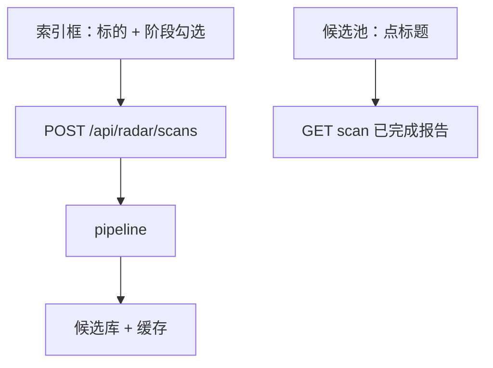
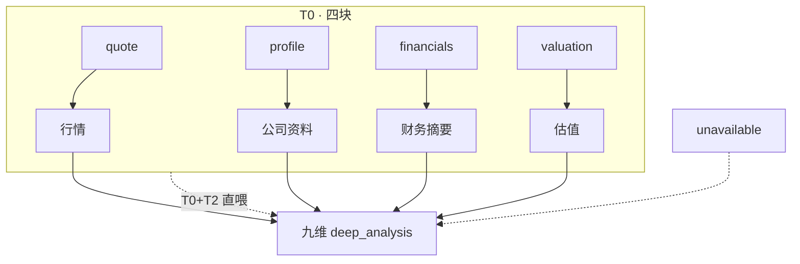
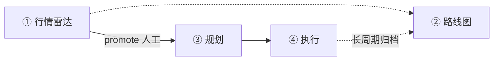

# 27 · 行情雷达工作区现状

> **As-Is**：diting Copilot「行情解析工作台」中 **① 行情雷达** 的产品位置、三段流水线逻辑、三种扫描组合，以及 T0 / T1 / T2 数据与指令规格。  
> **代码**：`diting-src/apps/copilot/modules/radar/`（`pipeline` · `scanner` · `context_matrix` · `t1_distill` · `schema`）

> [!NOTE] **[TRACEBACK]**
> - L3 落地：[step_14 行情雷达扫描与三段流水线](../00_维度零_AI投资副驾驶/stages/stage_1_启动期/steps/step_14_行情雷达扫描与三段流水线.md)
> - 四区漏斗：[25_四区漏斗_三段流水线_架构脊柱_设计](./25_四区漏斗_三段流水线_架构脊柱_设计.md)

---

## §1 产品背景与位置

### §1.1 在四区漏斗中的角色

| 顺序 | 工作区 | 职责 |
|:---:|---|---|
| **①** | **行情雷达** | **认知生成**：单标的结构化深度评估（生态位、龙头、壁垒、阶段、催化、风险、估值等） |
| ② | 滚动路线图 | **时间锚定**：爆发点入时间线、合理性/生命周期 |
| ③ | 规划中 | **验证证伪**：对雷达结论做持续监控 |
| ④ | 执行中 | **仓位指导**：advisory 建议（禁止自动下单） |

**入口**：`/planning?view=radar`。  
**主路径**：**模式 C** — 输入 6 位代码或简称 → 扫描 → 候选池 → 可人工晋级规划区。

### §1.2 责任边界

| 负责 | 不负责 |
|---|---|
| T0 采集（行情/资料/财务/估值） | 跨区时间线编排 |
| T1 事实矩阵压缩（DeepSeek 或规则） | 自动交易 |
| T2 深度研报（九维 + 布局自定义维） | 依赖 D2/D3 引擎填空（自给式 akshare） |
| 扫描会话、候选、缓存、三段 artifact 落库 | 自动晋级 |
| 候选人工 `promote` 至规划区 | |

**红线**：源失败 `status=error`（不伪 pending）；全 advisory；T0/T1/T2 各落 `stage_artifacts`。

### §1.3 三段流水线（本区落地）

| 段 | 实现 | 作用 |
|---|---|---|
| **T0** | 无 LLM · `scanner.py` | 四类真实数据 JSON |
| **T1** | DeepSeek `radar_distill` 或 `context_matrix` 规则 | 压成事实矩阵 + `unavailable` |
| **T2** | Opus `radar_assess` · `schema.py` | 九维结构化 `deep_analysis` |

---

## §2 核心功能逻辑

### §2.1 用户侧能力

- 工具栏输入标的，勾选 **仅 T2 / T0+T2 / T0+T1+T2** 之一后「分析」；HTMX 轮询进度与研报卡。  
- **展示布局**：维度顺序、显隐、自定义维（PVC `display_layout.json`）；T2 Prompt 读布局主题。  
- **候选池**：近 N 日已分析标的；点标题 **只读** 该次 scan 报告（不重新推演）。  
- **晋级**：候选带入 `analysis_snapshot` 进入规划漏斗。  
- **仅采集**：`POST /api/radar/collect` 跑 T0+T1，不跑 T2。  
- 同页 **Opus 对话** 与扫描流水线独立（`radar_chat`）。

### §2.2 缓存与触发

| 层 | 内容 |
|---|---|
| 文件 PVC | bundle、`display_layout.json`、`workbench_prefs.json`（约 24h，可配置） |
| 数据库 | `radar_scans`、`radar_candidates`、`stage_artifacts`、`workspace_artifacts`、版本表（约 30 天 / 每标的 7 版） |

| 触发 | 行为 |
|---|---|
| 索引框「分析」 | `scan_origin=workbench`：**每次重新推演**，不读 T0/T1/T2 **推理**缓存；完成后写入 |
| 候选池点标题 | `GET /api/radar/scans/{id}` + 缓存视图头：只展示已完成 HTML |
| 预拉 + sync | `scan_origin=internal`：可读 PVC 预拉 bundle（非工作台路径） |

### §2.3 模型分工

| 段 | 模型 |
|---|---|
| T0 | 无（行情链 + akshare；Pod 不设全局 `HTTPS_PROXY`） |
| T1 | `deepseek-chat`（auto），失败 → 规则矩阵 |
| T2 | `claude-opus-4-*`；Anthropic 单独走 `ANTHROPIC_HTTPS_PROXY` |

---

## §3 三种扫描组合

> 合法组合：仅 T2 · T0+T2 · T0+T1+T2。须勾选 T2；勾选 T1 必须同时勾选 T0。

| 组合 | T0 | T1 | T2 输入 | Prompt 构建 |
|---|---|---|---|---|
| **仅 T2** | ✗ | ✗ | 布局维度主题 | `build_opus_messages_freeform` |
| **T0+T2** | live | 跳过 | T0 四块原始 JSON | `build_opus_messages_from_t0` |
| **T0+T1+T2** | live | 矩阵 | `fact_matrix` | `build_opus_messages` |



### §3.1 仅 T2

1. 解析 `symbol` / `name`。  
2. 不采 T0/T1；`t0_raw` 仅 `{symbol, name}`。  
3. T2：按 `display_layout` 的 `ordered_display_metas` 生成维度简报 + 动态 JSON schema；System 要求基于公开认知推演，禁止编造精确 PE/股价。  
4. 解析 `parse_opus_verdict(text, dim_keys)` → 落库。

**逻辑**：主题框架下快速研判；证据弱，靠低 confidence 与约束防编造。

### §3.2 T0 + T2

1. T0 live 四块：`quote` / `profile` / `financials` / `valuation`。  
2. 不跑 T1。  
3. T2：T0 JSON + 布局维度简报；仅基于数据推理，缺口写进 `reasoning`。

**逻辑**：有数字锚点，省 T1 token/成本。

### §3.3 T0 + T1 + T2（全链路）

1. T0 live。  
2. T1：DeepSeek 压矩阵，或规则 `build_context_matrix`；工作台 **不用** 缓存里的旧矩阵。  
3. T2：事实矩阵 + 固定九维 `_SCHEMA_HINT`；严禁编造矩阵外数字。  
4. 工作台 scan **不回退** 历史 Opus 覆盖失败结果。  
5. 九维 → `radar_candidates` + `raw_json.deep_analysis` + 三段 artifact。

**逻辑**：T2 只读压缩集，省 Opus token；九维与候选列、下游字段对齐。

---

## §4 T0 / T1 / T2 数据与指令规格

### §4.0 三层关系



| 层 | 职责 |
|---|---|
| T0 | 确定性采数；子块 `status=ok\|error` |
| T1 | 中文键矩阵 + 缺口清单 |
| T2 | 跨维推理；`verdict` / `reasoning` / `evidence` / `confidence` |

---

### §4.1 T0 四类数据

**顶层**：`symbol`, `name`, `collected_at`, `source`, `cache_hit` + 四子块。子块失败含 `detail`，无 `pending`。

#### quote（行情）

| 字段 | 含义 |
|---|---|
| `last_close` | 最新收盘 |
| `pct_chg_1d/5d/20d/60d` | 多周期涨跌幅 % |
| `volume_ratio_5d` | 当日量 / 前 5 日均量 |
| `bars`, `as_of` | K 线数、最近交易日 |

来源：`fetch_bars_60d`（腾讯 → 新浪 → 东财）。不足 6 根 K 线 → `error`。

#### profile（公司资料）

| 字段 | 含义 |
|---|---|
| `name`, `industry` | 简称、行业 |
| `total_mv_yi`, `float_mv_yi` | 总/流通市值（亿） |
| `listing_date` | 上市时间 |

来源：`stock_individual_info_em` 优先，失败 `stock_profile_cninfo` + `stock_value_em`。

#### financials（财务摘要）

最新报告期列 → 英文字段：

| 字段 | 东财指标名 |
|---|---|
| `revenue` | 营业总收入 |
| `net_profit_parent` | 归母净利润 |
| `net_profit` | 净利润 |
| `gross_margin` | 销售毛利率 / 毛利率 |
| `roe` | 净资产收益率(ROE) |
| `debt_ratio` | 资产负债率 |
| `revenue_yoy`, `net_profit_yoy` | 营收/净利同比（可 ths 补） |
| `operating_cashflow` | 经营现金流量净额 |
| `report_period` | 报告期 |

#### valuation（估值）

| 字段 | 含义 |
|---|---|
| `pe_ttm` | 当前 PE(TTM) |
| `pe_percentile` | PE 在历史序列中的分位 % |
| `pb` | 市净率 |
| `history_points`, `as_of` | 样本数、日期 |

来源：`stock_a_indicator_lg` 优先，失败 `stock_value_em`。

#### 四块关系

- 并行采集，单块失败不阻断其它块。  
- `quote` = 交易行为；`valuation` = 定价水平，语义分离。  
- `profile` + `financials` 支撑生意质量类维度；失败块不进 T1 `matrix`，仅进 `unavailable`。  
- 当前 T0 **仅** 上述四块（无公告、新闻、同业、筹码等独立块）。

---

### §4.2 T1 压缩

#### 输出契约

```json
{
  "matrix": { "行情": {}, "公司资料": {}, "财务摘要": {}, "估值": {} },
  "unavailable": ["分区:原因", "..."]
}
```

#### 规则映射（`context_matrix.py`）

| T0 | matrix 分区 | 写入 |
|---|---|---|
| quote | 行情 | 最新收盘，涨跌幅 1/5/20/60 日，量比_5日，截至 |
| profile | 公司资料 | 简称，行业，总市值_亿，流通市值_亿，上市时间 |
| financials | 财务摘要 | 除 status/detail 外 **原样透传**（en 键） |
| valuation | 估值 | PE_TTM，PE历史分位_%，PB，历史样本点 |

`status!=ok` → 该分区不进 matrix，记入 `unavailable`。

#### DeepSeek 指令

**System**：

```text
你是证券研究助理。将 T0 原始 JSON 压缩为紧凑事实矩阵 JSON，
只保留 status=ok 的事实；失败源写入 unavailable 列表。
输出必须是单个 JSON 对象，含 keys: matrix, unavailable（数组）。
matrix 下分 行情/公司资料/财务摘要/估值 等中文键，勿编造。
```

**User**：`标的 {symbol} {name}\nT0:\n{四块 JSON，最长 12000 字符}`  

参数：`radar_distill`，`max_tokens=2048`，`temperature=0.1`。解析失败 → 整段回退规则。

#### 设计意图

- 去掉 T0 噪声与元字段，只留数值事实。  
- 中文分区与 T2 System 表述一致。  
- `unavailable` 驱动 T2 降 confidence、在 reasoning 说明缺口。

---

### §4.3 T2 九维指令

#### 三种 Prompt 变体

| 变体 | System 要点 | User 主体 |
|---|---|---|
| **A 全链路** | 基于事实矩阵做 9 维推理；**严禁编造矩阵外数字** | `fact_matrix` + `_SCHEMA_HINT` |
| **B T0+T2** | 仅基于 T0 原始数据；缺失说明 | T0 四块 + 维度简报 + 动态 schema |
| **C 仅 T2** | 公开认知推演；禁止编造 PE/股价 | 维度简报 + 动态 schema |

`radar_assess`，`max_tokens=4096`，`temperature=0.2`。

#### 变体 A — System（全文）

```text
你是一名严谨的 A 股深度研究分析师，对标巴菲特式基本面+产业链穿透。
你将收到一份由真实数据（行情/公司资料/财务摘要/估值分位）压缩成的事实矩阵，
请基于这些事实做 9 个维度的深度推理，每个维度给出：明确结论(verdict)、
推理过程(reasoning，结合矩阵中的真实数字)、证据(evidence，引用矩阵字段或数值)、
置信度(confidence，0~1，事实不足时调低而非编造)。
**严禁编造矩阵中没有的数字**；事实不足时在 reasoning 中说明并降低 confidence。
全部为研究 advisory，不构成交易指令。只输出 JSON，不要任何额外文字。
```

#### 九维定义与输出约束

| key | 中文 | 主题 hint | verdict 约束 | 额外字段 |
|---|---|---|---|---|
| `niche` | 生态位 | 产业定位与不可替代性 | 自由文本 | — |
| `value_chain` | 价值链 | 上中下游、议价分配 | 上游\|中游\|下游\|平台 | — |
| `is_leader` | 龙头 | 是否细分龙头 | yes\|no\|inferred | — |
| `moat` | 护城河 | 壁垒强度 | 强\|中\|弱 | — |
| `profit_quality` | 利润质量 | 真实性、可持续性、现金 | 高\|中\|低 | — |
| `market_phase` | 市场阶段 | 资金博弈阶段 | concept\|expectation\|realization\|exhaustion | — |
| `catalyst_timeline` | 利好时间线 | 催化与时间窗 | 自由文本 | `items[]`: window, event, probability |
| `risk` | 风险 | 基本面/估值/政策/流动性 | 自由文本 | — |
| `valuation` | 估值 | PE 分位、戴维斯 | 低估\|合理\|高估 | `davis_double`，`pe_percentile` |

`market_phase`：concept=炒概念，expectation=炒预期，realization=炒业绩，exhaustion=利好出尽。

每维：`verdict`, `reasoning`, `evidence[]`, `confidence`。  
`overall`：`conclusion`, `action_advisory`, `confidence`。

#### 变体 B / C — 布局维度简报

每维一行：`- {key}（{emoji} {label}）[自定义]：{prompt_guide 或 hint}`  

**B System**：

```text
你是严谨的 A 股基本面分析师。你将收到标的的 T0 原始采集数据（行情/资料/财务/估值分位），
请仅基于这些数据与合理行业逻辑完成各维度深度推理；数据字段缺失时在 reasoning 中说明。
全部为研究 advisory。只输出 JSON。
```

**C System**：

```text
你是 A 股深度研究分析师。用户给出标的与一组分析维度主题；
请基于你对该公司/行业的公开认知与逻辑推演完成各维度研报（非交易指令）。
不得编造具体股价、精确 PE、未公开的财务数字；不确定处降低 confidence 并说明。
只输出 JSON，不要额外文字。
```

自定义维：`custom[].id`、`label`、`hint`、`prompt_guide`（简报优先 `prompt_guide`）。

#### 落库与下游列

| T2 key | `radar_candidates` |
|---|---|
| `niche` | `niche_text` |
| `value_chain` | `value_chain_pos` |
| `is_leader` | `is_leader`, `leader_confidence` |
| `moat` | `moat_level` |
| `profit_quality` | `profit_quality` |
| `market_phase` | `market_phase` |
| `catalyst_timeline` | `catalyst_window`（首条 item） |
| `risk` | `risk_summary` |
| `valuation` | `raw_json.deep_analysis` |
| `overall.confidence` | `confidence` |

完整 JSON：`raw_json.deep_analysis`；晋级：`analysis_snapshot`。

---

### §4.4 九维与 T0/T1 事实依赖

| T2 维 | 主要事实来源 |
|---|---|
| niche | 行业、市值、营收 |
| value_chain | 行业 |
| is_leader | 市值、行业、营收 |
| moat | ROE、毛利率、现金流、负债率 |
| profit_quality | 净利、毛利率、ROE、现金流、同比 |
| market_phase | 多周期涨跌、量比 |
| catalyst_timeline | 同比、报告期 + 模型推演 |
| risk | 负债率、估值分位、涨跌 |
| valuation | PE_TTM、PE 分位、PB |

变体 A：`evidence` 引用 matrix 字段；变体 B：引用 T0 字段名；变体 C：无强制数字证据。

---

## §5 上下游工作区关系



| 雷达产出 | 下游用法 |
|---|---|
| 候选列（niche、moat、phase、catalyst、risk、confidence） | 路线图排期、规划证伪、执行上下文 |
| `deep_analysis` / `analysis_snapshot` | 晋级规划区完整认知 |
| `workspace_artifacts` | 区间级联精简视图 |
| `stage_artifacts` ×3 | 段级审计 |

**漏斗**：扫描后 `funnel_stage=radar_intake`；`promote` → `planning`。标的级唯一记录，四区 Tab 按 stage 过滤。

**边界**：T2 自产 `market_phase`（四档），不读 D3 monitor:dict；T0 不经过 D2 Lighthouse；Opus 代理仅 Anthropic 客户端。

---

*2026-06-04 · 行情雷达 As-Is 逻辑与数据指令规格。*
