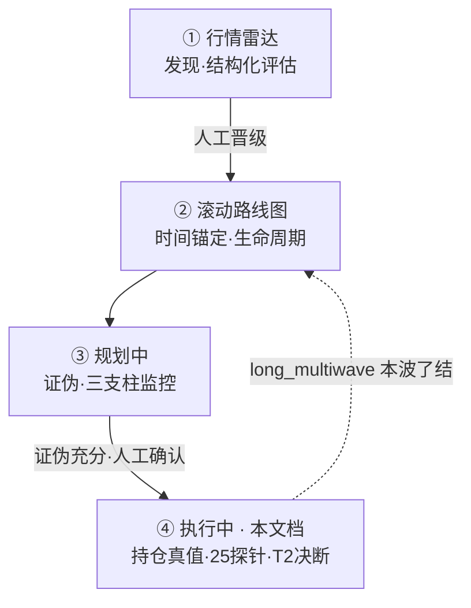
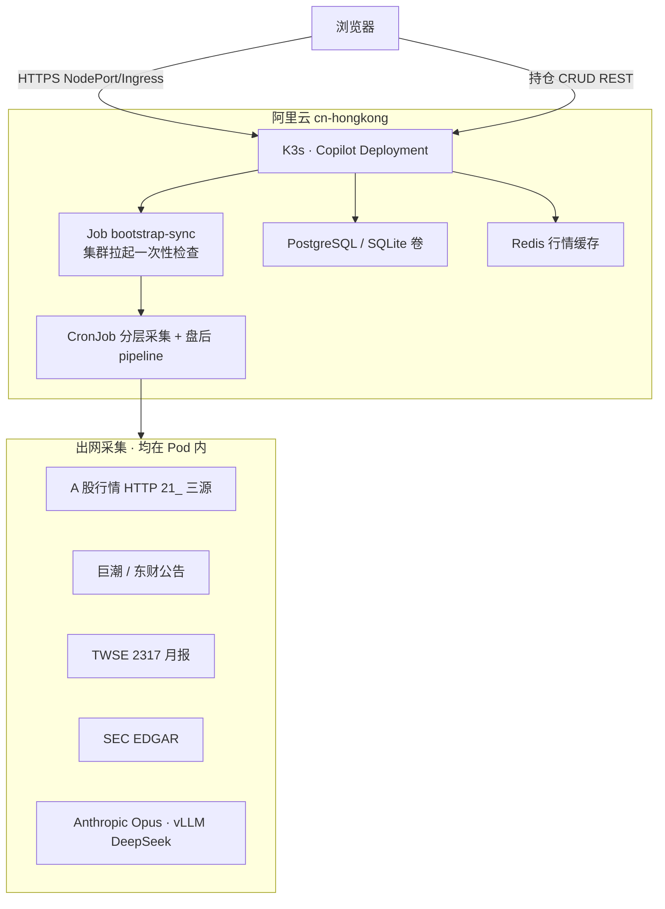
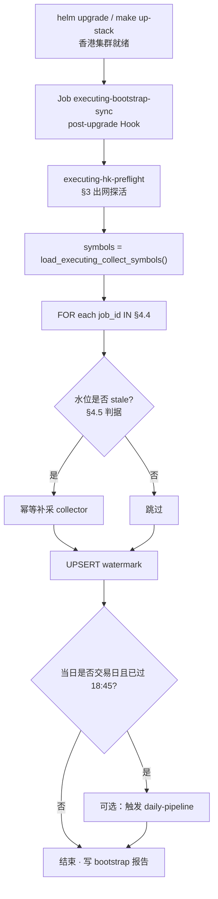

# 28 · 执行中工作区 · 标的深度监控与利润保卫（601138 首版落地规划）

> **文档定位（读前必懂）**
>
> | 维度 | 说明 |
> |------|------|
> | **产品功能归属** | **④ 执行中工作区**（四区漏斗末端 · [25_ §1.2](./25_四区漏斗_三段流水线_架构脊柱_设计.md)）的**独立功能规划**——对已晋级、真实持仓的标的做 **T0 全量采集 → T1 客观度量 → T2 交叉验证决断 → 前端可读体检** |
> | **首版样板标的** | **工业富联 601138.SH**（25 项买方级探针 · 保护大额浮盈）——是执行区的**第一个 `executing_profile`**，不是「仅为一只股票写的旁路脚本」 |
> | **运行时** | **唯一生产面 = 阿里云 ECS + K3s + Helm**（文档默认 `cn-hongkong` · P 轨亦可用 `ap-southeast-1` 新加坡；**二者均为境外 Pod 出网采境内源**，验收方式相同）；**禁止**马尼拉本机、Windows QMT 本地桥 |
> | **质量铁律（完善期唯一标准 · 2026-06-04 用户裁决）** | **① 不接受降级**：无替代估算、无「先用 proxy」、无启动期/扩展期/完善期分档；**② 禁止 mock/假数/占位 ok**；**③ 缺数据 = `error` + 阻塞项**，写入 `probe_blockers` 并前端/CLI **立即输出**；**④ 准出 = 指标全绿或 blocker 清单闭环**，不得宣称「基本完成」 |
>
> **业务锚点**：在真实持仓成本与股数之上，用 25 项宏观—微观探针 + Opus 交叉验证，输出明日操作 advisory（**no-auto-execute**）。

> [!NOTE] **[TRACEBACK] 战略追溯锚点**
> - **L1**：[06_投资哲学体系总纲](../../01_顶层概念/06_投资哲学体系总纲.md)（②多源验证 / ⑧归因）
> - **L2**：[06_标的深度分析与阶段判定实践规划](../../02_战略维度/06_跨维度协作/06_标的深度分析与阶段判定实践规划.md)
> - **产品漏斗**：[25_ 四区漏斗 + 三段流水线](./25_四区漏斗_三段流水线_架构脊柱_设计.md)
> - **工作台 IA**：[04_前端开发与用户体验 §2.1.0](../00_维度零_AI投资副驾驶/stages/stage_1_启动期/04_前端开发与用户体验.md)（`🚀 执行中` Tab）
> - **工程先例（仅借模式）**：[27_ 雷达内存主链 + 混合 T1 算子](./27_行情雷达全链路架构设计优化.md) · [21_ 行情多源](./21_行情数据源降级与断路器规约.md)（香港 Pod 内直 HTTP，**非** akshare 封装依赖 `push2his`）
> - **可选参考实现**：[step_17](../00_维度零_AI投资副驾驶/stages/stage_1_启动期/steps/step_17_执行中仓位指导.md)（M11 通用 advisory · **不绑定、不裁剪本文功能**）
> - **代码仓（规划）**：`diting-src/apps/copilot/modules/executing/` · `templates/planning/executing/`
> - **DNA**：`deliverables.modules[M11]` 扩展键 `executing_workspace_v1` / `executing_profile_601138`

---

## §1 执行中工作区 · 产品定位与漏斗位置

### §1.1 在四区漏斗中的位置（权威）



| 层级 | 功能 | 用户价值 | 本工作区交付 |
|------|------|----------|--------------|
| **上一级（直接前置）** | **③ 规划中** | 逻辑是否仍成立（证伪/三支柱） | 执行区**可只读**拉取规划区 Artifact 作 T2 上下文；**缺了也不阻塞**本区 25 探针与决断 |
| **上二级** | **② 滚动路线图** | 何时建仓/下一波 | 只读「建仓窗」展示；**不**替代本区利润保卫 |
| **更上游** | **① 行情雷达** | 为什么关注这只票 | 只读 9 维快照；**不**替代本区日频体检 |
| **本区核心** | **④ 执行中** | **已持仓 · 保利润 · 辨派发** | 持仓 CRUD（前端真值）+ 25 探针 T0-T2 + 体检 UI + advisory 建议（禁下单） |

**入口**：`/planning?view=executing`（与 [04_ §2.1.0](../00_维度零_AI投资副驾驶/stages/stage_1_启动期/04_前端开发与用户体验.md) 一致）。

**流转条件**：`CampaignSymbol.funnel_stage = executing` 的标的出现在本 Tab；**601138** 挂载 `executing_profile=601138` 时展示「利润堡垒 · 25 项体检」完整布局（见 §7），其他 executing 标的可先展示「通用执行卡」，后续复制 profile 机制。

### §1.2 与 step_17 / 其他 step 的边界（防功能打折）

> [!IMPORTANT] **原则：以本文档（执行中工作区）为功能主文档；其他 step 仅可「借用已有代码/表结构」，不得让执行区能力从属于 step_17 准出或删减。**

| 关系 | 处理方式 |
|------|----------|
| **step_17（M11）** | 已实现 `advisor.py` / `execution_advices` 等**可复用**；本工作区的 T2 `Execution_Command` **独立落库** `executing_daily_audits`，前端**独立区块**展示；是否与 step_17 六场景建议并排 = **产品增强**，不是本规划前置 |
| **step_16 / 15 / 14** | 仅 **Optional Context** 注入 T2；接口失败 → 字段省略，**不**降低 25 探针要求 |
| **holdings_sot YAML** | **退居同步/批处理兜底**；执行区**权威真值 = DB `user_positions`（前端 CRUD）** |
| **D1~D5 维度 step** | 采集管道可**复用**（公告、财报、行情）；必须在 **香港 Pod** 跑通，见 §3 |

**功能完整性清单（不得因引用他 step 而删减）**：

1. 前端录入/修改/删除真实持仓（成本、股数、仓位%、备注）并持久化  
2. 25 项探针在香港运行时 **全量规划为必达**（§3 + §4 调度）  
3. 每日 T0→T1→T2 一键/定时跑批 + 三段旁路审计  
4. 执行中专属 UI：持仓堡垒条 + L3/L4 矩阵 + T2 决断 + 冲突叙事 + 硬防线 + 溯源  
5. **no-auto-execute** + **no-mock** 全链路  
6. **§4 调度体系**：香港集群 **bootstrap 补洞** + **分层 CronJob** + **25 项 cadence/stale**；数据新鲜度在 UI 可读  

---

## §2 运行时裁决：阿里云香港 ECS 统一算力（取代「双轨/QMT 桥」）

### §2.1 裁决结论

| 否决项 | 理由 |
|--------|------|
| 马尼拉 Windows + QMT 本地脚本 | 与生产 **cn-hongkong ECS/K3s** 不一致；运维割裂、审计断裂 |
| `QMT_BRIDGE_URL` 依赖 | 仅适合个人桌面；**不纳入**本工作区规划 |
| 规划中的「软跳过 / 启动期先做 15 项」 | 用户要求：**规划即最高标准，不预写降级** |

| 采用项 | 说明 |
|--------|------|
| **单运行时** | 全部 T0 采集、T1 算子、T2 Opus、CronJob 在 **香港 Copilot Pod**（`diting-src` 镜像 · Helm values `region: cn-hongkong`） |
| **行情与微观** | 在 Pod 内用 **直连 HTTP**（腾讯 `qt.gtimg.cn` / 新浪 `hq.sinajs.cn` / 东财 `push2` · 见 [21_](./21_行情数据源降级与断路器规约.md)）+ **自算** ATR/换手/量价背离/Beta（与 [27_](./27_行情雷达全链路架构设计优化.md) `fetch_bars_250d` 同路径） |
| **跨境与文本** | 台湾 TWSE、SEC EDGAR、巨潮、财联社等：在 §3 **香港可达性矩阵** 逐项规定代理/镜像/API Key；**规划阶段即写清 URL 与验收 curl** |
| **Level-2 超大单 (#18)** | 走 **港交所/供应商 API 或东财资金流接口**（香港 Pod 可访问的付费或官方源）；**不**写 QMT L2 |

### §2.2 香港生产拓扑



**部署验收（规划必做）**：在香港 ECS 上执行 `make executing-hk-preflight`（规划合约）——对 §3 矩阵每一行 `curl`/Python 探活 **200 或合法 JSON**，失败项记入 **§9 阻塞报告**，不得在规划里改为「先用 mock」。

---

## §3 香港可达性 · 数据源与采集路径（25 项 · 无降级规划）

> **列说明**：`HK 采集路径` = 在香港 Pod 内的实现方式；`验收` = 上线前必须跑通的检查。  
> **无数据时**：运行结束写入 `probe_blockers.yaml`（key + 原因 + 最后尝试时间），前端显示「未获数」**红色**，禁止填充默认值。

### §3.1 L3_Business（14 项）

| # | T1 Key | T1 引擎 | HK 采集路径（生产） | 频率 | 验收（香港 Pod） |
|---|--------|---------|---------------------|------|------------------|
| 1 | `nvda_gpu_leadtime` | Python | 签约分销商 REST 或合规爬虫 + 固定出口 IP；备选：人工录入表 `external_facts` **仅当有真实录入** | 周 | `curl` 或 DB 有最新 `as_of` 行 |
| 2 | `tsmc_cowos_capacity` | DeepSeek | 巨潮/台媒 RSS →对象存储→vLLM 抽取；原文 hash 落 `stage_artifacts` | 动态 | 样本文本→T1 四字段非空 |
| 3 | `parent_honhai_revenue` | Python | TWSE Open API `https://www.twse.com.tw` + 2317 月营收 JSON；**HK/SG Pod 不通则 blocker**，禁止 akshare 静默替代 | 每月 | 近 3 月 MoM/YoY 可算 |
| 4 | `cloud_capex_consensus` | Python | SEC EDGAR `data.sec.gov`（HTTPS）四云商 10-Q/指引 XPath 或 EDGAR API | 季 | 四社合计 Capex 数值 |
| 5 | `smci_quanta_share` | DeepSeek | 纪要 PDF/HTML 入库→DeepSeek 抽取份额表述 | 季 | 证据句 + 数值 |
| 6 | `gb200_iteration_node` | DeepSeek | 东财/财联社公告 API（`push2` 族）关键词 GB200+工业富联 | 日 | ≥1 条相关公告或明确「无匹配」 |
| 7 | `inventory_turnover` | Python | 东财/巨潮财报指标或 D1 已入库 `financial_reports` | 季 | 周转天数 |
| 8 | `contract_liabilities` | Python | 同上 · 合同负债环比 | 季 | 环比% |
| 9 | `copper_cost_pressure` | Python | 沪铜主连：新浪/东财期货日线 HTTP（非 `push2his`） | 日 | 30 日涨幅% |
| 10 | `cpi_ppi_spread` | Python | 国家统计局公开页或镜像 API；**禁止**假数 | 月 | 中美剪刀差 |
| 11 | `exchange_rate_impact` | Python | 离岸人民币：新浪/东财 FX 序列 | 日 | 30 日升贬值% |
| 12 | `mgmt_and_core_team` | DeepSeek | 巨潮董监高公告日更管道 | 日 | 变更事件列表或「无」 |
| 13 | `related_party_trans` | Python | D1 关联交易表 + 环比 | 季 | 金额环比% |
| 14 | `gross_margin_trend` | Python | 财报毛利率 QoQ | 季 | 绝对值+环比 |

### §3.2 L4_Game（11 项）

| # | T1 Key | T1 引擎 | HK 采集路径（生产） | 频率 | 验收（香港 Pod） |
|---|--------|---------|---------------------|------|------------------|
| 15 | `qmt_atr_trailing` | Python | **250 日 K 线**（21_ 腾讯 K）自算 ATR(20)；`peak_price` 来自持仓区间或 K 线高点 | 日/盘后 | 倍数公式可复现 |
| 16 | `volume_price_div` | Python | 同上 K 线 · 10 日涨跌日量比 | 盘后 | 比值 |
| 17 | `northbound_net_flow` | Python | 东财 `push2` 北向个股 / akshare `stock_hsgt_individual_em`（HK 实测后择一 **写死主源**） | 盘后 | 3 日累计净流入 |
| 18 | `level2_super_order` | Python | 东财资金流「超大单」接口或采购 L2 供应商 API（**DECISION：选型后写入 values**） | 盘后 | 5 日净差 |
| 19 | `margin_short_skew` | Python | 交易所融资融券历史（东财/akshare HK 可达接口） | 日 | 融券/融资比 |
| 20 | `turnover_acceleration` | Python | 日 K 换手率字段 · 3 日/60 日均值比 | 盘后 | 倍数 |
| 21 | `block_trade_discount` | Python | 东财大宗交易明细 `601138` | 盘后 | 折价率% |
| 22 | `retail_concentration` | Python | 股东户数公告 / 互动易 | 动态 | 环比% |
| 23 | `insider_sell_actual` | Python | 巨潮减持公告解析 | 日 | 占总股本% |
| 24 | `etf_redemption_impact` | Python | 持仓相关 ETF 份额（东财基金持仓接口） | 周 | 周净申赎 |
| 25 | `tech_beta_correlation` | Python | 601138 与中证1000/AI 指数收益率 · 10 日滚动相关（K 线自算） | 盘后 | ρ 值 |

> **命名说明**：`qmt_atr_trailing` 保留 key 名以兼容白皮书，**实现与 QMT 无关**，改为 `atr_trailing` 显示名；代码注释 `[Ref: 28_ §3.2 #15 · HK K线自算]`。

---

## §4 数据新鲜度 · 采集周期 · K8s 调度（香港集群）

> **设计目标**：产品数据始终处于 **预期内的最新状态**——不是靠人工记得跑脚本，而是 **集群拉起必自检、运行中按日历 Cron、缺口自动补跑、前端可读 stale**。
>
> **模式对齐**：[27_ §2.8 T0 CronJob 与 bootstrap](./27_行情雷达全链路架构设计优化.md#28-t0-cronjob-pod-任务规划与冷启动补同步)（水位表 · Hook · `startingDeadlineSeconds` · Chart 内模板）；执行区 **独立 job 命名空间**，与雷达 **共用镜像与 DSN**，**不共用** watermark 表。

### §4.1 新鲜度分层（规划即最高标准）

| 层级 | 含义 | 用户可见 |
|------|------|----------|
| **L0 实时** | 交易时段现价（层 A 浮盈） | 绿点 · 标注采集时刻 |
| **L1 日频** | 上一 A 股交易日收盘后可用的探针 | 日频探针 `ok` |
| **L2 周频** | 7 个自然日内成功 | 周频探针 `ok` |
| **L3 月频** | 35 自然日内成功 | 月频探针 `ok` |
| **L4 季频** | 上一报告期披露后可算 | 季频探针 `ok` |
| **stale** | 超过该层 `max_age` 仍未更新 | 黄点 + 「应更新于 …」 |
| **missing** | 从未成功或源永久失败 | 红点 + blocker |

**禁止**：在规划里写「先不做周频」；未达标只在 **§9 阻塞报告** 说明原因。

### §4.2 调度宇宙（哪些标的参与采集）

| SoT | 规则 |
|-----|------|
| **`executing_collect_symbols`**（PG 表 · 规划） | `symbol` + `profile`（如 `601138`）+ `enabled` + `funnel_stage` 快照；**Cron / bootstrap / 一次性 Job 只读此表** |
| **写入时机** | ① `funnel_stage→executing` 时 UPSERT；② 前端「加入执行区体检」；③ `user_positions` 有 portfolio 且用户勾选「启用采集」 |
| **与 `user_positions`** | 持仓 CRUD **不自动**扩表；避免误采未晋级标的 |
| **表为空** | 除 **全局探活** `hk-preflight` 外，per-symbol Job **no-op**（日志 `executing_collect_empty`），**禁止**扫全 A 股 |

```python
# 规划合约（apps/copilot/modules/executing/universe.py）
def load_executing_collect_symbols() -> list[str]:
    """bootstrap · CronJob · daily-pipeline · status 均调用。"""
```

### §4.3 水位表 `executing_t0_sync_watermarks`

| 字段 | 说明 |
|------|------|
| `job_id` | PK · 与 §4.4 注册表一致 |
| `symbol` | `601138` 或 `*`（全局 job） |
| `last_success_at` | TIMESTAMPTZ |
| `last_trade_date` | 日频：最后覆盖的 **A 股交易日**（Asia/Shanghai） |
| `last_period_key` | 季频：如 `2025Q4`；月频：`2026-05` |
| `last_row_count` | 可观察摘要 |
| `last_error` | 失败原因；成功 NULL |
| `catch_up_pending` | bootstrap 标记待补跑 |

**辅助表 `executing_t0_probe_state`**（可选，与 watermark 同步）

| 字段 | 说明 |
|------|------|
| `symbol`, `probe_key` | 联合 PK（25 项 T1 Key） |
| `as_of` | 该探针事实对应业务日期 |
| `collected_at` | 入库时间 |
| `stale_after` | 按 §4.5 公式预计算 |

### §4.4 CronJob 任务注册表（香港 · Asia/Shanghai）

> **Chart**：`diting-infra/charts/diting-stack/templates/executing-t0/`（ConfigMap + CronJob + Job）；`values.yaml` → `copilot.executingT0Jobs`（对齐 `radarT0Jobs` 结构）。
>
> **Workload 公约**：`concurrencyPolicy: Forbid` · `startingDeadlineSeconds: 3600` · 共享 `copilot` 镜像 · 入口 `python -m apps.copilot.jobs.executing_t0.<job_id>`

| job_id | 覆盖 probe_key | 频率层 | Cron（北京时间） | 执行内容 | 写入 |
|--------|----------------|--------|------------------|----------|------|
| `quote-intraday` | （层 A 现价，非 25 项） | L0 | `*/5 9-15 * * 1-5` | [21_] 三源 realtime → Redis `executing:quote:{symbol}` | Redis |
| `l4-micro-eod` | 15,16,17,19,20,21,25 | L1 | `10 16 * * 1-5` | K 线自算 ATR/量价/换手/Beta + 北向/两融/大宗 | PG `executing_t0_raw` |
| `l4-margin-morning` | 19 | L1 | `30 9 * * 1-5` | 融资融券 T 日可用数据 | PG |
| `l3-news-daily` | 6,12,23 | L1 | `0 18 * * 1-5` | 巨潮/东财公告日更 | PG |
| `l3-fx-copper-daily` | 9,11 | L1 | `5 16 * * 1-5` | 沪铜 + USD/CNY 序列 | PG |
| `l3-weekly-gpu-etf` | 1,24 | L2 | `0 11 * * 6` | GPU 交期源 + ETF 份额 | PG |
| `l3-honhai-monthly` | 3 | L3 | `0 8 5 * *` | TWSE 2317 上月营收（每月 5 日） | PG |
| `l3-macro-cpi-monthly` | 10 | L3 | `0 9 10 * *` | 统计局 CPI/PPI（每月 10 日） | PG |
| `l3-sec-capex-quarterly` | 4 | L4 | `0 10 1 2,5,8,11 *` | SEC 四云 Capex（财报季后） | PG |
| `l3-peer-earnings-quarterly` | 5 | L4 | `0 12 1 2,5,8,11 *` | 竞品纪要 DeepSeek 抽取 | PG |
| `l3-financials-quarterly` | 7,8,13,14 | L4 | `0 6 1 5,9,11 *` | 财报指标 + 关联交易 + 毛利率 | PG |
| `l3-tsmc-text-dynamic` | 2 | 动态 | `0 */6 * * *` | 新文本入库则抽取，无新文则 no-op | PG |
| `l3-shareholders-dynamic` | 22 | 动态 | `0 20 * * 1-5` | 股东户数变动 | PG |
| `l2-super-order-eod` | 18 | L1 | `25 17 * * 1-5` | 超大单净差（数据源就绪后） | PG |
| **`daily-pipeline`** | T1 全 25 + T2 | L1 | `45 18 * * 1-5` | 读 PG 最新 T0 → T1 → Opus T2 → `executing_daily_audits` | PG + artifacts |
| **`collect-once`** | 用户指定 | — | 一次性 Job | 前端「立即采集基础数据」/ `make executing-t0-collect` | PG |

**盘后主链路顺序（同一交易日）**：

```
16:10 l4-micro-eod → 16:18 l3-news-daily → … → 18:45 daily-pipeline（T1+T2）
```

`daily-pipeline` **依赖**当日日频 T0 job 已 success（或 bootstrap 刚补完）；若关键 job stale → pipeline **失败并告警**，**不**用昨日 T0 冒充今日（no-mock）。

### §4.5 二十五项探针 · 采集周期与 stale 判据

| # | probe_key | 频率层 | 计划更新时刻 | `stale_after` 规则 |
|---|-----------|--------|--------------|-------------------|
| 1 | `nvda_gpu_leadtime` | L2 周 | 周六 11:00 | >7 天 |
| 2 | `tsmc_cowos_capacity` | 动态 | 每 6h 扫描新文 | >7 天且无新文 |
| 3 | `parent_honhai_revenue` | L3 月 | 每月 5 日 08:00 | 上月营收未入库 |
| 4 | `cloud_capex_consensus` | L4 季 | 2/5/8/11 月 1 日 | 缺最新一季 |
| 5 | `smci_quanta_share` | L4 季 | 季后首周六 | 缺最新一季 |
| 6 | `gb200_iteration_node` | L1 日 | 每日 18:00 | `< 上一交易日` |
| 7–8,13–14 | 财报四键 | L4 季 | 5/9/11 月 1 日 06:00 | 缺最新报告期 |
| 9–11 | 铜/汇率 | L1 日 | 每日 16:05 | `< 上一交易日` |
| 12,23 | 公告 | L1 日 | 每日 18:00 | `< 上一交易日` |
| 15–17,19–21,25 | L4 微观 | L1 日 | 16:10 批 | `< 上一交易日` |
| 18 | `level2_super_order` | L1 日 | 17:25 | `< 上一交易日` |
| 22 | `retail_concentration` | 动态 | 每日 20:00 | 公告未更新 >35 天 |
| 24 | `etf_redemption_impact` | L2 周 | 周六 11:00 | >7 天 |

配置真相源：`executing_profiles/601138.yaml` 中 `probes.{key}.cadence` / `stale_after`，**禁止**代码 hardcode。

### §4.6 集群拉起 · Bootstrap 一次性检查（ECS/K3s 重建必跑）



| 触发时机 | 动作 |
|----------|------|
| **Helm install/upgrade** | `post-upgrade` Hook Job `executing-bootstrap-sync`（权重低于 Copilot Deployment 就绪） |
| **P 轨 ECS 重建 / `make up-stack`** | `diting-infra`: `make executing-t0-bootstrap-sync`（与 Hook 二选一或双跑，**须幂等**） |
| **人工补洞** | 同上 make target |

**Bootstrap 算法（摘要）**

```
1. ASSERT DEPLOY_REGION=cn-hongkong
2. RUN hk-preflight → 失败 job 记入 bootstrap_report（不 mock）
3. symbols = load_executing_collect_symbols()
4. FOR job_id in REGISTERED_JOBS:
     IF per-symbol AND symbols empty → SKIP
     IF watermark stale OR catch_up_pending → RUN job collectors
     UPSERT watermark
5. FOR symbol IN symbols:
     FOR probe_key IN 25: 若 probe_state stale → 归入 catch-up 队列并 RUN
6. EMIT executing_bootstrap_report.json → ConfigMap 或 PG（供 UI 「数据同步状态」）
```

**防止「集群关掉再开就忘了同步」**

| 机制 | 说明 |
|------|------|
| Helm Hook | **每次** upgrade 全量检查缺口（不只首次安装） |
| `startingDeadlineSeconds: 3600` | Cron 错过 1h 内仍补跑 |
| `executing-pipeline-status` | `make executing-daily-status` 输出每 job watermark + 每 probe stale |
| 前端顶栏 | 「数据同步：✅ 新鲜 / ⚠️ N 项 stale」链到 status API |

### §4.7 运行中 steady-state（Pod 按时间线自愈）

| 状态 | 行为 |
|------|------|
| Copilot Deployment **Running** | §4.4 全部 CronJob **enabled=true**（values 开关） |
| 某 Cron 失败 | `last_error` 写入 watermark；下一合法调度重试；**连续 3 次**失败 → UI 橙条告警 |
| 用户点击「立即跑今日体检」 | 创建 **`collect-once` Job** + 同步触发 `daily-pipeline`（HTTP 202 + poll） |
| 用户改持仓 CRUD | **不**自动重跑全量 T0；提示「持仓已变，建议重新体检」；可选勾选「保存并刷新现价」只调 `quote-intraday` |

**与雷达 T0 的边界**：雷达采行业/候选标的；执行区 **只采 `executing_collect_symbols`**。若同一 symbol 两表都有，**允许**执行区 **只读** 雷达已落 PG 的 K 线/公告（减少重复出网），但 **watermark 独立**，stale 判据仍按 §4.5。

---

## §5 T0 → T1 → T2 流水线（执行区标准）

### §5.1 三段职责

| 段 | 输入 | 输出 | 运行位置 |
|----|------|------|----------|
| **T0** | §3 各采集器 raw | `t0_raw_executing_{symbol}` | 香港 Pod |
| **T1** | T0 raw + **DB 持仓** `user_positions` | `executing_telemetry.json`（25×`feature_node`） | 香港 Pod |
| **T2** | T1 + 可选规划 Artifact | `Executing_Daily_Audit` JSON | 香港 Pod · Opus |

**T1 节点结构（不可改）**：

```json
{
  "value": "<number|string|null>",
  "source": "香港 Pod 实际命中 URL/表",
  "calculation_logic": "公式与窗口",
  "fact_statement": "客观事实，无操作建议"
}
```

### §5.2 主链与旁路（借 27_ 模式，运行时改为香港）

| 路径 | 行为 |
|------|------|
| **主链（交互）** | `POST /api/executing/{symbol}/daily-run` → 内存 T0→T1→T2 → `run_id`；HTMX 轮询（与 §4.4 `collect-once` 同源） |
| **主链（生产）** | CronJob `daily-pipeline` @ **18:45** 自动跑；读 **已落库 T0**（§4.4 日频 job 产物） |
| **旁路** | `stage_artifacts` workspace=`executing` 异步写入，不阻塞 |
| **调度总览** | 见 **§4**（bootstrap + 分层 Cron + stale 判据） |

### §5.3 持仓真值（前端 CRUD · 分析基准）

**表 `user_positions`（规划）**：

| 字段 | 类型 | 说明 |
|------|------|------|
| `id` | UUID | 主键 |
| `symbol` | char(6) | 唯一索引（执行区一只票一条；多票扩展多条） |
| `name` | str | 显示名 |
| `quantity` | decimal | 持股数量 |
| `cost_price` | decimal | 成本价 |
| `position_pct` | decimal | 占组合仓位%（可自动算或手填） |
| `opened_at` | date | 建仓日 |
| `notes` | text | 备注 |
| `updated_at` | timestamptz | 最后修改（前端每次保存） |
| `source` | enum | `ui` / `import_yaml` |

**API（REST · JSON）**：

| 方法 | 路径 | 说明 |
|------|------|------|
| GET | `/api/executing/positions` | 列表 |
| GET | `/api/executing/positions/{symbol}` | 单条 |
| POST | `/api/executing/positions` | 新增 |
| PUT | `/api/executing/positions/{symbol}` | 全量更新（明日可改成本/股数） |
| DELETE | `/api/executing/positions/{symbol}` | 删除 |

**与 T1/T2**：`profit_context` **只读 DB**；`unrealized_pnl_pct = (mark_price - cost_price) / cost_price`，`mark_price` 来自 [21_](./21_行情数据源降级与断路器规约.md) 香港三源。

**YAML**：`my_holdings.yaml` 仅 **一次性 import** 或运维脚本同步，**不以文件为运行期 SoT**。

---

## §6 T2 决断契约（Opus · 仅读 T1）

### §6.1 输入边界

- 必填：`<T1_Telemetry_25>` + `<Profit_Context from DB>`  
- 可选：`<Planning_Falsify_Summary>`（有则加分，无则省略）  
- **禁止**：T0 原始全文、mock 填充

### §6.2 输出 JSON（`Executing_Daily_Audit`）

```json
{
  "Executing_Daily_Audit": {
    "L3_Fundamental_Verdict": "string",
    "L4_Microstructure_Verdict": "string"
  },
  "Reasoning_Engine": {
    "signal_conflicts": "string",
    "cross_validation_logic": "string"
  },
  "Execution_Command": {
    "action": "hold|trim_30_pct|dump_all|rotate",
    "stop_loss_line": "string",
    "one_sentence_summary": "string"
  },
  "probe_coverage": {
    "filled": 25,
    "missing": [],
    "blockers": []
  },
  "meta": { "model": "", "cost_yuan_est": 0 }
}
```

**交叉验证规则**（白皮书 §3，配置化 prompt）：L3 好 + L4 背离 → 警惕卖现实；L4 回撤未破 2.5×ATR + L3 供应链稳 → 持有；竞品抢单 → rotate **advisory**。

**人工门控**：`trim_30_pct` / `dump_all` / `rotate` 在前端须 **二次确认勾选**，无「一键执行」。

---

## §7 前端展示规划（执行中 Tab · 主交付）

> **技术栈（与现网一致）**：Jinja2 模板 + **HTMX** 局部刷新 + 少量 Alpine.js 状态；**不**为本功能单独立 React 仓；静态资源随 Copilot 镜像发版。

### §7.1 页面信息架构（`view=executing`）

```
🚀 执行中
├── 顶栏：组合级「利润堡垒」摘要 + **数据同步状态**（§4.6 stale 数 / 上次 bootstrap）
├── 左栏（30%）：执行中标的列表（funnel_stage=executing）
│     └── 选中 601138 → 右侧详情
└── 右栏（70%）：标的详情 · 三叠层（人类阅读顺序）
      ├── 【层 A】我的真持仓（可编辑 · 永远置顶）
      ├── 【层 B】25 项探针体检（L3 上 / L4 下 · 可折叠）
      └── 【层 C】T2 首席风控官日报（决断 + 冲突 + 硬防线）
```

### §7.2 层 A · 持仓真值卡（CRUD）

```
┌─ 工业富联 601138 ───────────────────────────── [保存] [删除] ─┐
│  持股数量 [________] 股    成本价 [________] 元                │
│  仓位占比 [________] %     建仓日 [____-__-__]                 │
│  现价     27.10（腾讯源 · 16:00）  浮盈 +38.2%  ← 自动算       │
│  备注     [________________________________]                  │
│  上次保存：2026-06-04 22:15  来源：前端录入                    │
└───────────────────────────────────────────────────────────────┘
```

| 交互 | 行为 |
|------|------|
| 保存 | `PUT /api/executing/positions/601138` → Toast「已写入数据库」→ 触发 HTMX 刷新层 B/C |
| 改成本/股数 | 次日可再改；历史版本可选 `position_revision` 表（扩展）或 `updated_at` 审计 |
| 缺行情 | 现价灰字「行情未获数」；浮盈显示「—」，**不**用昨收冒充实时除非标注 `stale` |

### §7.3 层 B · 25 项探针矩阵（清晰分区）

**布局**：两个 **Sticky 域标题** + 表格（HTMX `hx-get` 每日 run 结果）

| 域 | 色标 | 列 |
|----|------|-----|
| **L3 宏观与产业链** | 蓝左边框 | 探针名 · 数值 · 客观事实（截断 hover 全文）· 数据源 · 状态 |
| **L4 资金博弈** | 橙左边框 | 同上 |

**状态徽章**：

| 状态 | 含义 | 样式 |
|------|------|------|
| `ok` | 四字段齐全且 value 非 null | 绿点 |
| `missing` | 采集失败 | 红点 + 「查看阻塞原因」→ 弹窗显示 `blockers` |
| `stale` | 超过 §4.5 `stale_after` 未更新 | 黄点 + 显示「应更新于 …」 |
| `syncing` | bootstrap / collect-once 运行中 | 蓝点旋转 |

**顶部工具条**：`[ 立即跑今日体检 ]` → 一次性 Job `collect-once` + `daily-pipeline`；`[ 检查数据同步 ]` → `GET /api/executing/sync-status`（watermark 快照）。

### §7.4 层 C · T2 风控日报卡

```
┌─ 今日决断 · 2026-06-04 ─────────────────────────────────────┐
│  [hold]  一句总结：「……」                                    │
│  硬防线：收盘跌破 26.50 元 → 建议止盈（advisory）             │
├─ 信号冲突 ──────────────────────────────────────────────────┤
│  · L3 Capex 上修 vs L4 北向三日流出 …                        │
├─ 交叉验证推理（可折叠全文）──────────────────────────────────┤
│  …                                                           │
├─ [ ] 我已阅读，记录今日意向（非下单）                        │
└──────────────────────────────────────────────────────────────┘
```

**与层 A 关系**：决断区 **引用** 层 A 浮盈%；用户改持仓后提示「建议重新跑体检」。

### §7.5 融合与导航（不凌乱）

| 场景 | 展示策略 |
|------|----------|
| 仅 601138 有 `executing_profile` | 右侧默认三叠层完整版 |
| 其他 executing 标的 | 层 A 通用持仓卡 + 「探针模板开发中」+ 可选只读 step_17 建议条 **独立折叠区**（标题注明「通用 M11」） |
| 从规划区跳转 | URL `?view=executing&symbol=601138` 深链；**不**带规划区表单进执行区 |
| 移动端 | 三叠层改垂直 Tab：持仓 / 探针 / 决断 |

### §7.6 组件与模板路径（规划）

| 模板 | 职责 |
|------|------|
| `templates/planning/executing/index.html` | 列表 + 右栏容器 |
| `executing/_position_card.html` | 层 A CRUD |
| `executing/_probe_matrix.html` | 层 B |
| `executing/_audit_card.html` | 层 C |
| `static/executing.css` | 蓝/橙域区分 · 堡垒条强调色 |

---

## §8 代码与部署结构（香港）

```
apps/copilot/modules/executing/
├── positions.py
├── universe.py                        # load_executing_collect_symbols
├── orchestrator.py                    # daily-pipeline · daily-run API
├── sync_watermark.py                  # §4.3 读写 · stale 判据
├── t0_collectors/                     # 25 项 · 按 job_id 分组调用
├── t1_operators/
├── t2_opus_audit.py
├── routes.py
└── hk_preflight.py

apps/copilot/jobs/executing_t0/        # §4.4 每 job_id 一个模块
├── quote_intraday.py
├── l4_micro_eod.py
├── daily_pipeline.py
├── bootstrap_sync.py
└── ...

data/config/executing_profiles/
└── 601138.yaml                        # probes.*.cadence / stale_after

diting-infra/charts/diting-stack/templates/executing-t0/
├── configmap-jobs.yaml
├── cronjobs.yaml                      # §4.4 全表
├── job-bootstrap-sync.yaml            # Hook + 手动 Job
└── job-collect-once.yaml
```

**Makefile**

| 仓 | target | 用途 |
|----|--------|------|
| `diting-infra` | `executing-t0-cron-install` | `helm upgrade` 启用 `copilot.executingT0Jobs.enabled=true` |
| `diting-infra` | `executing-t0-bootstrap-sync` | 集群重建后一次性补洞（§4.6） |
| `diting-src` | `executing-hk-preflight` | §3 出网探活 |
| `diting-src` | `executing-positions-migrate` | `user_positions` + watermark 表 |
| `diting-src` | `executing-pipeline-status` | watermark + 25 probe stale 报告 |
| `diting-src` | `executing-daily` | 本地模拟 `daily-pipeline`（香港 DSN） |
| `diting-src` | `executing-t0-collect` | 一次性采集 Job 等价 CLI |
| `diting-src` | `executing-test` | pytest |

---

## §9 完成标准与阻塞报告（唯一允许「完不成」的出口）

规划与验收 **只认一张表**：

| 准出 | 条件 |
|------|------|
| **功能准出** | §7 前端三层 + 顶栏同步状态；持仓 CRUD；`executing-t0-cron-install` + bootstrap 在香港跑通 |
| **调度准出** | 模拟 `helm upgrade` 后 bootstrap 补洞；交易日 18:45 `daily-pipeline` 成功；`executing-pipeline-status` 无未解释 stale |
| **数据准出** | **25/25** `feature_node` 均有真实 `source`；`probe_coverage.missing` 为空 |
| **若未达标** | 发布 **`executing_probe_blockers.md`**：每项 {key, 原因, 最后命令输出, 待用户决策}；**禁止** mock 补洞 |

**no-mock**：`CRYO_MOCK` / stub JSON / 随机数 一律禁止；测试夹具仅 `tests/` 内，不得进生产库。

### §9.1 完善期铁律（用户 2026-06-04 · 覆盖全仓）

| 禁止 | 必须 |
|------|------|
| 降级链 / proxy 字段冒充真指标 / 60 日 K 替 250 日 K | 真实源 + 真实字段名（如 `pct_chg_3d` 须来自 3 日序列） |
| `status=ok` 但数据为估算、借位、规则冒充 LLM | DeepSeek/Opus 槽位须写 `llm_tag`，无则 T1 **unavailable** |
| 启动期/扩展期/完善期分档准出 | **单一完善期准出**：全指标 success 或 §9.2 blocker |
| 静默 `skip` 掩盖应采未采 | 应采项失败 → **`error`** + blocker 行 + 命令输出 |

### §9.2 当前实现审计 · 27_ 雷达 T0（601138 · 2026-06-04）

> **说明**：下列为 **diting-src 代码仓实采 + 代码审查** 结论；**不是**准出通过。曾用「食材 OK」表述 **作废**。

| T0 | 指标 | 当前状态 | 是否曾以次充好 | 根因 | 待办（完善期） |
|----|------|----------|----------------|------|----------------|
| 1 | 全市场情绪 | **error**（限流时） | 是 · 曾用板块汇总冒充全 A | 东财 `spot_em` 重表 + 境外 IP 限流 | K3s Cron 单例 + 退避；**禁止**板块汇总替代 |
| 2 | 板块 3 日涨跌 | **部分 ok** | 是 · 曾用「当日涨跌」标 `3d_proxy` | 字段造假 | 已改 `stock_board_industry_hist_em` 自算 3 日 |
| 3 | 板块 5 日资金 | **部分 ok** | 是 · 曾 fallback「今日」 | 偷懒 fallback | 已删今日 fallback，失败即 error |
| 4 | 公司档案 | **部分 ok** | 是 · 规则行业名冒充 DeepSeek | 未接 vLLM | T0 采 raw + T1 **须** `profile.llm_tag` |
| 5 | 主营构成 | **error** | 是 · 曾用经营范围冒充分部 | 东财 zygc KeyError | **巨潮年报分部**解析器 |
| 6 | 供应链 Top5 客户 | **error** | **是 · 股东持股冒充客户** | 错用 API | **年报附注**前五客户解析 |
| 7 | 同业排名 | **error**（限流时） | 是 · 曾用板块成分降级 | 绑全 A 快照 | 全 A 快照 Cron 缓存 + Pod 重试 |
| 8 | 250 日 K | **ok** | 否 | 腾讯 fqkline | — |
| 9 | 北向 | **ok/skip** | 否 · 非陆股通 skip 合法 | 客观无披露 | — |
| 10 | 融资 ROC | **error/skip** | 是 · 曾默认 ENV 关闭 | 人为 skip | 已取消 ENV 门控，失败即 error |
| 11 | 龙虎榜 | **ok/skip** | 否 | 无榜 | — |
| 12–13 | 一致预期 | **ok** | 轻微 · `upgrade_proxy` 命名 | 字段来自研报表 | 改名 `buy_plus_add_count` |
| 14–16 | 财务/质押/解禁 | **ok** | 否（质押已改 datacenter 单标的） | — | — |
| 17 | 监管 | **T0 ok / T1 待 LLM** | 是 · 关键词规则冒充 DeepSeek | 未接 vLLM | `regulatory_events.llm_tag` 管道 |

**27_ 雷达 P3 准出**：**未达成**（17/17 未全绿）。

**28_ 执行区 25 探针（2026-06-05 集群实采 · rev35）**：**T0 数据层已准出** · `collect-once` → **25/25 ok**、`missing_count=0`（push2delay + `probe_cache` PVC 快照 + Copilot **1536Mi**）。**产品级「功能完成」**仍须 T2 日报 + daily-pipeline Cron 实跑（见 §13）。

**输出物**：阻塞清单见 [executing_probe_blockers.md](../../06_追溯与审计/executing_probe_blockers.md)。

### §9.3 K3s 境外运行时（香港 / 新加坡通用）

| 项 | 要求 |
|----|------|
| 探活 | Pod 内 `make radar-pipeline-status` / `executing-hk-preflight`；**禁止**用开发者本机结论代表集群 |
| 重采集 | 全 A 快照、一致预期全表等 **仅 Cron**；API 扫描 **只读 Redis/PVC** |
| 失败 | watermark `last_error` + §9.2 表行 + 告警；**不得**写 ok |
| 地域 | `DEPLOY_REGION` 自检；新加坡与香港 **同一套 blocker 纪律** |

**no-auto-execute**：`rg` 执行区路径下单语义 = 0。

---

## §10 环境变量（香港 Helm）

| 变量 | 用途 |
|------|------|
| `DEPLOY_REGION` | 固定 `cn-hongkong`（自检） |
| `ANTHROPIC_API_KEY` | T2 |
| `VLLM_BASE_URL` | T1 DeepSeek |
| `EXECUTING_PROFILE` | `601138` |
| `EXECUTING_T2_MODEL` | Opus 型号 |
| `EXECUTING_T0_JOBS_ENABLED` | Chart 开关 · 与 `copilot.executingT0Jobs.enabled` 一致 |
| `EXECUTING_BOOTSTRAP_ON_UPGRADE` | Helm Hook 默认 true |
| 各第三方 API Key | 按 §3 选型注入 Secret |

**禁止依赖**：`RADAR_QMT_BRIDGE_URL` / 马尼拉 IP。

---

## §11 一致性检查表

- [ ] 产品主语是 **执行中工作区**，601138 是首版 profile  
- [ ] 运行时仅 **香港 ECS/K3s**，§3 每行有 HK 路径与验收  
- [ ] **§4** 含：采集周期表 · CronJob 注册表 · bootstrap Hook · stale 判据 · 与雷达边界  
- [ ] 集群重建后 **bootstrap-sync** 可幂等补洞；运行中 Cron 按 §4.4 执行  
- [ ] 规划无「启动期/完善期/软跳过/降级链」  
- [ ] 持仓 **DB + 前端 CRUD** 为分析真值  
- [ ] §7 前端含 **数据同步状态** 与 stale 徽章  
- [ ] step_17 **不**裁剪本文功能清单  
- [ ] no-mock · no-auto-execute  
- [x] 25/25 T0 探针（2026-06-05 生产 Pod 实采）或 §9 阻塞报告  

---

## §13 实施记录（仅列已线上验证项 · 2026-06-05）

> **T0 25/25 已线上验证**；**未**写「功能完成」直至 T2 + Cron 全链路（下表）。

### 已验证（香港 K3s · `platform` · 镜像 `diting-copilot:db454e51-p4t6c`）

| 项 | 证据命令 / 结果 |
|----|----------------|
| Helm 部署 + 滚动更新 | rev **35** · Copilot limit **1536Mi** · rollout 成功 |
| executing T0 CronJob ×4 | `kubectl -n platform get cronjob -l component=executing-t0` → 4 条 |
| DB 表 + 持仓 | Pod 内 `init_db`（1536Mi 后 migrate ok） |
| HTTP · 持仓 / 同步 / 三层详情 | `copilot-executing-tier2-verify-k8s.sh` → **通过** |
| **T0 采集（真源）** | `collect-once --symbol 601138` → **ok_count 25/25** · `missing_count=0` |
| 渠道韧性 | `probe_cache.py`：ETF/level2 PVC 快照 · push2delay 直连 · level2 **3 轮退避** · ETF akshare **60s** |
| EXECUTING_T2_ENABLED | Pod 内 `EXECUTING_T2=true` |
| 本机 pytest | `make executing-workspace-test` → 4 passed |

### 未验证 / 禁止标「功能完成」

| 项 | 状态 |
|----|------|
| 交易日 18:45 `daily-pipeline` Cron | Cron 已安装，**尚未**等真实调度跑通（**手动** `daily-pipeline` 已 **t2_status=ok**） |
| 本机 NodePort tier-2 | `prod.conn` EIP 释放时外网不可达（集群内已验） |

### 2026-06-05 追加验证（T2 闭环）

| 项 | 证据 |
|----|------|
| T2 根因修复 | `t2_opus.py` 改走 `AIDispatcher` + `ANTHROPIC_HTTPS_PROXY`（香港直连曾 403） |
| Opus 探活 | Pod：`AIDispatcher` ping → `route=remote` · ~1.5s |
| **daily-pipeline** | `601138` → **t2_status=ok** · `action=hold` · `meta.anthropic_proxy_configured=true` |

**部署入口**：`cd diting-infra && make copilot-executing-workspace-deploy`（含 migrate · 集群内 tier-2 · pipeline-status 摘要）。

---

## §12 修订记录

| 日期 | 内容 |
|------|------|
| 2026-06-05 | **T2 闭环**：`t2_opus`→`AIDispatcher`/新加坡代理；生产 `daily-pipeline` **t2_status=ok** |
| 2026-06-05 | **渠道韧性轮**：`probe_cache` + push2delay 重试 + Copilot 1.5Gi；生产 **25/25**；§11 T0 项已勾选 |
| 2026-06-05 | **根因修复轮**：SEC/巨潮/行业池/`[A-E]` blocker；生产曾 **23/25** |
| 2026-06-05 | **§13 实施记录**：线上 HTTP/Cron/bootstrap/25 T0 证据；明确 **未** 标功能完成；链 `executing_probe_blockers.md` |
| 2026-06-04 | v1：601138 25 探针 + QMT 双轨（已废弃） |
| 2026-06-04 | **v2 重构**：执行中工作区产品定位；香港 ECS 单运行时；废除 QMT/马尼拉/降级规划；持仓前端 CRUD；前端专章；25 项 HK 可达矩阵；阻塞报告机制 |
| 2026-06-04 | **v2.2**：用户裁决完善期铁律（禁止降级/mock/分档）；新增 **§9.1～§9.3** + **§9.2 雷达 T0 审计表**（以次充好清单）；运行时表述兼容 cn-hongkong / ap-southeast-1 |
| 2026-06-04 | **v2.1**：新增 **§4 数据新鲜度与 K8s 调度**（分层 Cron · watermark · bootstrap-sync · 25 项 cadence/stale · 顶栏同步状态）；章节顺延 §5～§12 |
