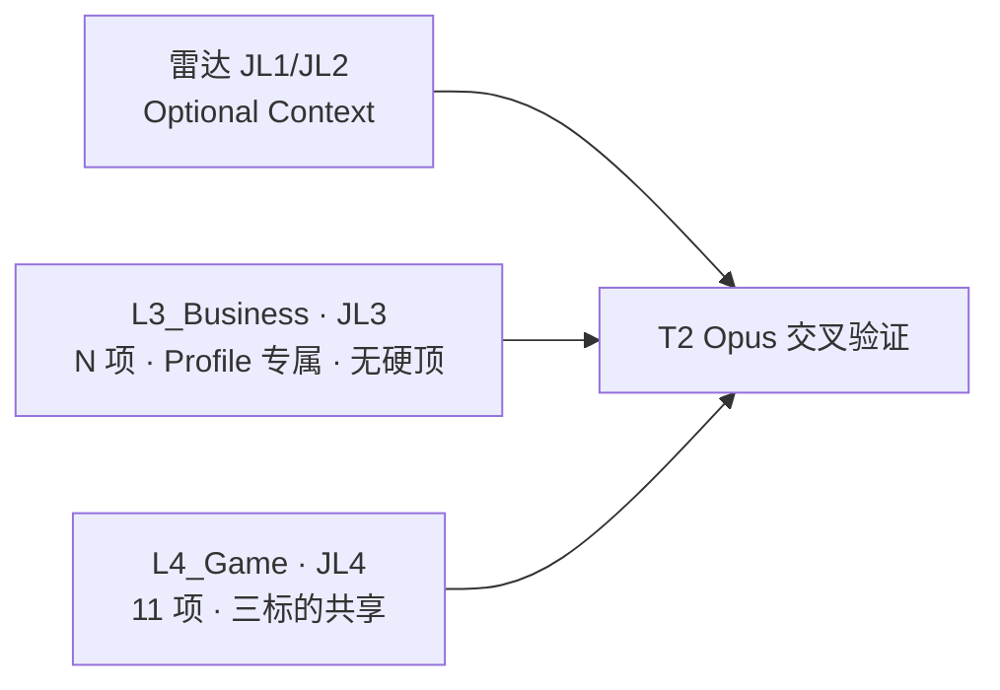
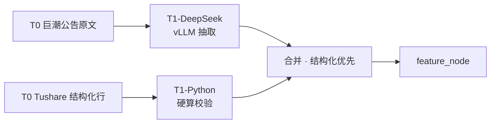
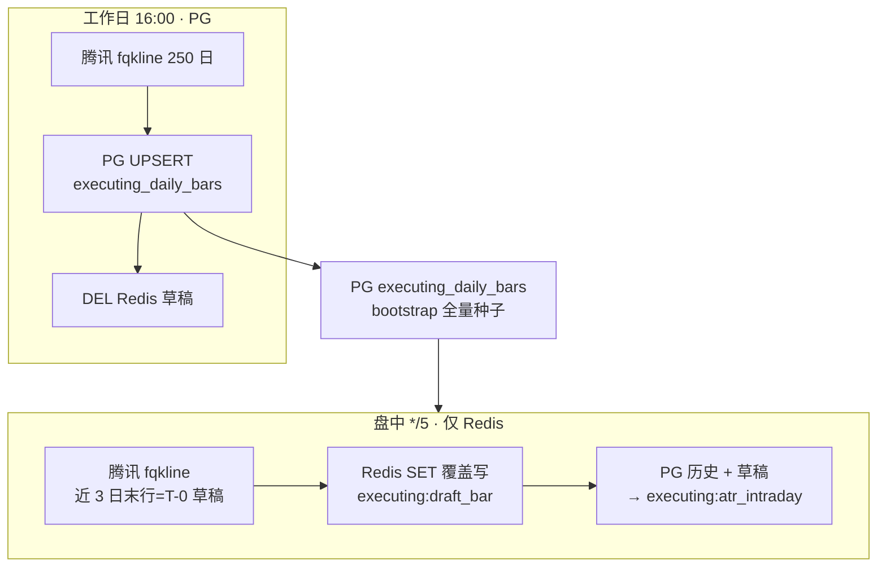
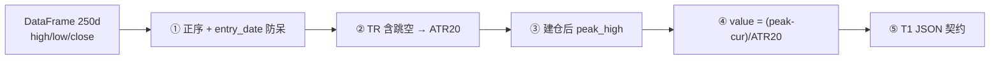
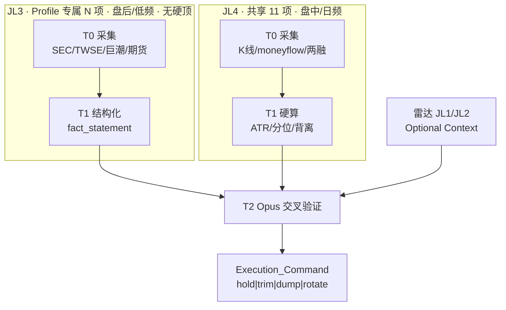
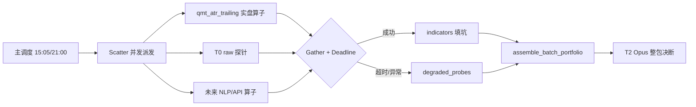

# 28 · 执行中工作区 · 标的深度监控与利润保卫（T0-T2 · Profile 可扩展）

> **文档定位**
>
> | 维度 | 说明 |
> |------|------|
> | **产品归属** | **④ 执行中工作区**（[25_ §1.2](./25_四区漏斗_三段流水线_架构脊柱_设计.md) 漏斗末端）— 对已晋级、真实持仓标的做 **T0 采集 → T1 度量 → T2 交叉验证 → 前端体检** |
> | **Profile 矩阵** | **AI 算力三杰** · **JL3 可变长**（Profile YAML `l3_probes`）+ **JL4 固定 11 项**；当前三杰各 14 项 JL3，**非槽位上限** |
> | **运行时** | 唯一生产面 = **阿里云 ECS + K3s + Helm**（`cn-hongkong` / `ap-southeast-1`）；境外 Pod 出网采境内源；**禁止**马尼拉本机、Windows QMT 本地桥 |
> | **质量铁律** | ① 不接受降级/mock ② 缺数据 = `error` + blocker ③ 准出 = **Profile 已启用探针全量**真实源或 blocker 闭环 |
>
> **术语**：**研判层 JL1～JL4**（投资四层）≠ **矩阵域 `L3_Business`/`L4_Game`**（工程/UI 键，与 JL3/JL4 1:1）≠ **频率层 F0～F4**（采集新鲜度，§3.1）

> [!NOTE] **[TRACEBACK]**
> - **L1**：[06_投资哲学体系总纲](../../01_顶层概念/06_投资哲学体系总纲.md)
> - **L2**：[06_标的深度分析与阶段判定实践规划](../../02_战略维度/06_跨维度协作/06_标的深度分析与阶段判定实践规划.md)
> - **关联**：[25_ 四区漏斗](./25_四区漏斗_三段流水线_架构脊柱_设计.md) · [27_ 雷达主链](./27_行情雷达全链路架构设计优化.md) · [21_ 行情多源](./21_行情数据源降级与断路器规约.md) · [29_ 三底座](./29_三大数据底座与任务调度架构契约.md)
> - **代码**：`diting-src/apps/copilot/modules/executing/` · `diting-infra/charts/diting-stack/templates/executing-t0/`
> - **审计（非本文）**：实施进展见 [executing_probe_blockers.md](../../06_追溯与审计/executing_probe_blockers.md)；雷达十七项见 [27_](./27_行情雷达全链路架构设计优化.md)

---

## §1 产品定位与边界

### §1.1 漏斗位置

**入口**：`/planning?view=executing`。`funnel_stage=executing` 且挂载 `executing_profile` 的标的展示完整体检；未配置 profile 先展示通用持仓卡。

| 上游 | 与本区关系 |
|------|------------|
| ③ 规划中 | 可选只读 Artifact 注入 T2；**缺了不阻塞** Profile 已启用探针 |
| ② 滚动路线图 | 只读建仓窗 |
| ① 行情雷达 | 只读九维快照；JL1/JL2 信号经 Optional Context 注入 T2（[27_ §2](./27_行情雷达全链路架构设计优化.md)） |
| **④ 本区** | 持仓 CRUD + Profile 探针 T0-T2 + advisory（**no-auto-execute**） |

### §1.2 研判四层与探针映射

**每 Profile 探针数 = `|l3_probes|`（可变）+ 11（JL4 共享）**，对应研判层 **JL3 + JL4**。**JL1、JL2 不占探针行**，由雷达/规划只读供给 Optional Context。



| 研判层 | 矩阵域 | 项数 | 核心问题 | 扩展方式 |
|--------|--------|:----:|----------|----------|
| JL3 微观靶向 | `L3_Business` | **N ≥ 1 · 无硬顶** | 车间、库房、订单簿、账本是否仍健康 | `executing_profiles/{symbol}.yaml` → `l3_probes` 增删 |
| JL4 资金博弈 | `L4_Game` | **11 · 固定** | 主力是否派发、利润是否该锁 | 代码 `probe_keys.PROBE_KEYS` |

**槽位原则（2026-06-09）**

| 规则 | 说明 |
|------|------|
| **JL3 不设上限** | 有价值的新物理事实 → 加 Key；仅因「凑满 14」而加 → 禁止 |
| **价值重叠才删** | 两探针回答**同一投资问题**且口径不可区分 → 合并或删其一 |
| **允许多口径并存** | 同一维度**不同物理量**可并存（如原材料备料 vs 产成品库存；应收周转 vs 经营现金流） |
| **三 Profile 独立** | 601138 只跑 `fii_*`，300502 只跑 `eop_*`，002837 只跑 `env_*`；**禁止**共用泛化 L3 行 |
| **JL1/L2 永不占行** | 宏观/行业总盘子 → 雷达 Optional Context → T2 背景 |

**当前三杰快照**（仅为现版编排，**非**架构上限）：601138 · **20** JL3（融合定稿）；300502 · 14 JL3；002837 · 14 JL3。

T2 交叉验证示例：JL3 订单/良率/现金流完好 + JL4 量价背离/主力流出 → **事出反常必有妖 · 清仓逃顶**；JL4 未破 2.5×ATR + JL3 全项无 blocker → 持有。

### §1.3 与其他 step 的边界

| 关系 | 处理 |
|------|------|
| step_17（M11） | 可复用 `advisor.py`；本区 T2 **独立落库** `executing_daily_audits` |
| step_14～16 | 仅 Optional Context |
| 持仓真值 | **DB `user_positions`（前端 CRUD）**；YAML 仅 import 兜底 |

**必达功能**：① 持仓 CRUD ② Profile 已启用探针香港全量采集 ③ 日频 T0→T1→T2 ④ 三层 UI + 同步状态 ⑤ §3 调度体系 ⑥ no-mock / no-auto-execute

---

## §2 探针规格

> **通则**：无数据 → `probe_blockers` + 前端红点；禁止默认值。**L3 Key 以 Profile YAML `l3_probes` 为准（可变长）**；L4 Key 以 `probe_keys.PROBE_KEYS` 为准（固定 11）。JL1/JL2 经雷达 Optional Context 注入 T2，**禁止**写入 L3 探针行。

### §2.0 矩阵总览（JL3 可变 + JL4 固定）

| 层 | 矩阵域 | 项数 | Key 命名空间 | 采集节奏 |
|----|--------|:----:|--------------|----------|
| JL3 | `L3_Business` | **N（无硬顶）** | `{profile_prefix}_*`（如 `fii_*` / `eop_*` / `env_*`） | 日/周/月/季/动态（§2.2～§2.4） |
| JL4 | `L4_Game` | **11 · 固定** | 共享（`qmt_atr_trailing` … `tech_beta_correlation`） | 盘中 5～15min + 日频 EOD（§2.6） |

**Profile 探针总数**：`|l3_probes| + |probes.enabled|`。601138 融合定稿 **20 + 11 = 31**；300502 / 002837 当前 **14 + 11 = 25**（待按 §2.1 同法融合）。

**共享 JL4（11 项 · 三标的相同）**

| # | T1 Key | 中文简写 | 矩阵域 |
|:---:|--------|----------|:------:|
| 15 | `qmt_atr_trailing` | ATR止盈 | `L4_Game` |
| 16 | `volume_price_div` | 量价背离 | `L4_Game` |
| 17 | `smart_money_flow` | L2主力大单 | `L4_Game` |
| 18 | `level2_super_order` | 超大单 | `L4_Game` |
| 19 | `margin_short_skew` | 融资融券 | `L4_Game` |
| 20 | `turnover_acceleration` | 换手加速 | `L4_Game` |
| 21 | `block_trade_discount` | 大宗折价 | `L4_Game` |
| 22 | `retail_concentration` | 散户接盘 | `L4_Game` |
| 23 | `insider_sell_actual` | 减持实况 | `L4_Game` |
| 24 | `etf_redemption_impact` | ETF申赎 | `L4_Game` |
| 25 | `tech_beta_correlation` | 板块β | `L4_Game` |

> **前端展示**：`PROBE_LABELS` 与上表 JL4 + 各 Profile `l3_probes.label` 一一对应；技术键仅作灰字脚注。

### §2.1 JL3 融合规划原则（旧泛化 14 × 新靶向 14）

**601138 首版融合方法**：对「废止前泛化 JL3 十四项」与「新靶向 `fii_*` 十四项」做**并集 → 去重 → 定稿**，不是二选一替换。

| 融合动作 | 含义 | 示例 |
|----------|------|------|
| **合并** | 同一投资问题 · 新 Key 口径更窄更优 | `parent_honhai_revenue` + `fii_twse_cloud` → 只留 `fii_twse_cloud` |
| **并存** | 不同物理量 / 不同子问题 | `fii_raw_inventory`（原材料额）+ `fii_inventory_turnover`（周转天数） |
| **回补** | 旧版有独特价值 · 新版未覆盖 | `contract_liabilities` → `fii_contract_liab` |
| **移出 JL3** | L1/L2 行业/宏观 · 不占探针行 | `nvda_gpu_leadtime` 等 → 雷达 Optional Context |

**JL1/JL2 四件（不占 601138 JL3 行，但进 T2 背景）**：`nvda_gpu_leadtime` · `tsmc_cowos_capacity` · `cloud_capex_consensus` · `cpi_ppi_spread` → 雷达 Optional Context。

#### §2.1.1 601138 · 旧 14 × 新 14 融合对照表

| 废止前 Key | 废止前简写 | 新靶向 Key | 融合决策 | 定稿 Key | 说明 |
|------------|------------|------------|----------|----------|------|
| `parent_honhai_revenue` | 母公司营收 | `fii_twse_cloud` | **合并** | `fii_twse_cloud` | 收窄为鸿海「云端网路」板块 |
| `smci_quanta_share` | 同业份额 | `fii_quanta_share` | **合并** | `fii_quanta_share` | 对标广达月营收增速差 |
| `copper_cost_pressure` | 铜价压力 | `fii_copper_shfe` | **合并** | `fii_copper_shfe` | 同一物理量（沪铜 30 日） |
| `related_party_trans` | 关联交易 | `fii_related_pty` | **合并** | `fii_related_pty` | 精确定位流向鸿海 |
| `gb200_iteration_node` | 技术迭代 | `fii_gb200_yield` | **并存** | `fii_gb200_milestone` + `fii_gb200_yield` | 节点/量产 vs 组装良率 · 不同问题 |
| `inventory_turnover` | 存货周转 | `fii_raw_inventory` | **并存** | `fii_inventory_turnover` + `fii_raw_inventory` | 周转天数 vs 原材料绝对值 |
| `gross_margin_trend` | 毛利率 | `fii_ai_margin` | **并存** | `fii_gross_margin` + `fii_ai_margin` | 公司整体 vs AI 分部 |
| `contract_liabilities` | 合同负债 | — | **回补** | `fii_contract_liab` | 订单前瞻 · 新版未覆盖 |
| `exchange_rate_impact` | 汇率影响 | — | **回补** | `fii_exchange_rate` | 出口报价/汇兑 · 新版未覆盖 |
| `mgmt_and_core_team` | 董监高 | — | **回补** | `fii_mgmt_stability` | 核心团队稳定性 |
| — | — | `fii_odm_direct_ratio` | **保留** | `fii_odm_direct_ratio` | 纯新增 · ODM 直供占比 |
| — | — | `fii_ar_turnover` | **保留** | `fii_ar_turnover` | 纯新增 · 应收周转 |
| — | — | `fii_cfo_health` | **保留** | `fii_cfo_health` | 纯新增 · 经营现金流 |
| — | — | `fii_labor_auto_capex` | **保留** | `fii_labor_auto_capex` | 纯新增 · 自动化降本 |
| — | — | `fii_overseas_fdi` | **保留** | `fii_overseas_fdi` | 纯新增 · 海外建厂 |
| — | — | `fii_apple_base` | **保留** | `fii_apple_base` | 纯新增 · 消费电子拖累 |
| — | — | `fii_network_switch` | **保留** | `fii_network_switch` | 纯新增 · 800G 交换机 |
| `nvda_gpu_leadtime` | GPU交期 | — | **移出 JL3** | — | L2 → Optional Context |
| `tsmc_cowos_capacity` | 封装产能 | — | **移出 JL3** | — | L2 → Optional Context |
| `cloud_capex_consensus` | 四云Capex | — | **移出 JL3** | — | L2 → Optional Context |
| `cpi_ppi_spread` | 通胀剪刀 | — | **移出 JL3** | — | L1 → Optional Context |

**601138 融合定稿**：**20 项 JL3**（合并消重 4 组 + 并存补 3 组 + 回补 3 项 + 纯新增 7 项 − 移出 4 项）+ **11 项 JL4** = **31 项 / Profile**。

#### §2.1.2 JL3 增删门禁（防价值重叠 · 非防数量）

新增 JL3 探针须满足 **AND**：

1. **物理事实可验收**：有明确一手源 + T1 输出字段 + 频率  
2. **投资问题未被覆盖**：现有 `l3_probes` 中无探针能回答同一问题  
3. **非 L1/L2 降级回填**：不是把宏观/行业指标换个 Key 塞回 JL3  

**重叠判定示例**

| 关系 | 示例 | 处置 |
|------|------|------|
| ✅ 可并存 | `fii_raw_inventory`（原材料）+ `eop_finished_gd`（产成品） | 不同物理量 · 保留 |
| ✅ 可并存 | `fii_ar_turnover` + `fii_cfo_health` | 应收质量 vs 整体造血 · 保留 |
| ❌ 应合并 | `parent_honhai_revenue` + `cloud_capex_consensus` | 都在猜「订单/frontlog 好不好」· 只留更窄的 `fii_twse_cloud` |
| ❌ 应剔除 | `nvda_gpu_leadtime` + `tsmc_cowos_capacity` | L2 行业景气 · 移出 JL3 |

**新增流程**：Profile YAML 增 `l3_probes.{key}` → 本文 §2.2～§2.4 补规格行 → Cron §3.4 登记 → [executing_probe_blockers.md](../../06_追溯与审计/executing_probe_blockers.md) 审计。

### §2.2 Profile · 601138 工业富联（融合定稿 20 项 JL3）

**微观靶向核心**：上游料件齐套率、下游大客户话语权、高端机柜制造良率、利润转移风险。  
**来源**：§2.1.1 旧泛化 14 × 新靶向 14 融合（非 28 项叠加）。

| # | T1 Key | 中文简写 | 融合来源 | 阅读子类 | 一手官方渠道 | 频次 | T1 物理事实契约（输出示例） |
|:---:|--------|----------|----------|----------|--------------|:----:|----------------------------|
| 1 | `fii_twse_cloud` | 母公司云端营收 | 旧③+新① 合并 | 生态传导 | TWSE 2317「云端网路」月报 | 月 | 母公司云端营收环比 +8.5%，AI 代工交付实质性增长 |
| 2 | `fii_odm_direct_ratio` | ODM直供占比 | 新② | 客户结构 | 深交所财报 / 业绩会 QA | 季 | ODM-Direct 直供云服务商占比提升至 60% |
| 3 | `fii_gb200_milestone` | GB200量产节点 | 旧⑥ 并存 | 制造节点 | 巨潮/东财 GB200/NVL 公告 | 动 | 官方披露 GB200 整机柜进入量产/交付节点 |
| 4 | `fii_gb200_yield` | GB200良率 | 新③ 并存 | 制造良率 | TrendForce / 供应链简报 | 动 | GB200 整机柜组装良率突破 90% |
| 5 | `fii_copper_shfe` | 沪铜成本 | 旧⑨+新④ 合并 | 成本因子 | SHFE 沪铜期货 | 日 | 沪铜 30 日暴涨 15%，机柜制造成本端承压 |
| 6 | `fii_quanta_share` | 广达增速差 | 旧⑤+新⑤ 合并 | 同业抢单 | TWSE 广达 2382 月报 | 月 | 营收增速落后广达 8%，订单份额面临蚕食 |
| 7 | `fii_raw_inventory` | 原材料备料 | 新⑥ | 财务运营 | 巨潮「存货分类」· 原材料 | 季 | 原材料同比大增 40%，符合超级大单备料 |
| 8 | `fii_inventory_turnover` | 存货周转 | 旧⑦ 并存 | 财务运营 | Tushare / 财报 · 周转天数 | 季 | 存货周转 61.6 天，备货节奏偏慢 |
| 9 | `fii_contract_liab` | 合同负债 | 旧⑧ 回补 | 订单前瞻 | Tushare · 合同负债及环比 | 季 | 合同负债 37.69 亿，QoQ -3.96%，短期能见度走弱 |
| 10 | `fii_gross_margin` | 整体毛利率 | 旧⑭ 并存 | 盈利质量 | Tushare · 毛利率 | 季 | 整体毛利率 7.35%，QoQ +5.37ppt |
| 11 | `fii_ai_margin` | AI服务器毛利 | 新⑦ 并存 | 盈利质量 | 业绩会 / IR · AI 分部 | 季 | AI 服务器毛利率突破 8.5% |
| 12 | `fii_ar_turnover` | 应收周转 | 新⑧ | 财务运营 | Tushare · 应收周转天数 | 季 | 应收周转天数 60 天，大客户账期轻微恶化 |
| 13 | `fii_cfo_health` | 经营现金流 | 新⑨ | 财务运营 | Tushare · CFO/净利润 | 季 | 经营现金流覆盖净利润 1.2 倍 |
| 14 | `fii_labor_auto_capex` | 自动化降本 | 新⑩ | 成本因子 | 巨潮附注 · 折旧 vs 薪酬 | 季 | 折旧增速远超薪酬，自动化降本显现 |
| 15 | `fii_related_pty` | 鸿海关联交易 | 旧⑬+新⑪ 合并 | 治理 | 巨潮「关联交易」表 | 季 | 对鸿海关联采购比例稳定，无异常利润转移 |
| 16 | `fii_overseas_fdi` | 海外建厂投资 | 新⑫ | 交付力 | 对外投资公告 · 墨/越 | 动 | 对墨西哥工厂新增投资 2 亿美元 |
| 17 | `fii_apple_base` | 消费电子拖累 | 新⑬ | 业务结构 | 定期报告非 AI 拆分 | 季 | 消费电子板块同比下滑 10%，拖累 AI 增量 |
| 18 | `fii_network_switch` | 800G交换机 | 新⑭ | 产品渗透 | 互动易 · 800G 交换机 | 动 | 800G 高速交换机进入量产 |
| 19 | `fii_exchange_rate` | 汇率影响 | 旧⑪ 回补 | 成本因子 | 外汇交易中心 USDCNY | 日 | 人民币 30 日升值 0.98%，出口报价略不利 |
| 20 | `fii_mgmt_stability` | 董监高稳定 | 旧⑫ 回补 | 治理 | 巨潮董监高公告 | 日 | 365 日内无核心高管突发辞任 |

**移出 JL3、改走 Optional Context（旧泛化 #1/#2/#4/#10）**：`nvda_gpu_leadtime` · `tsmc_cowos_capacity` · `cloud_capex_consensus` · `cpi_ppi_spread`。

**Profile 扩展键**（`601138.yaml`）：`sector_index_code` · `honhai_twse_code: "2317.TW"` · `peer_quanta_code: "2382.TW"`

### §2.3 Profile · 300502 新易盛（当前 14 项 JL3 · 可扩展）

**微观靶向核心**：代际研发抢位、核心 DSP 拿货能力、产线良率报废、巨头客户单一化风险。

| # | T1 Key | 中文简写 | 阅读子类 | 一手官方渠道 | HK ECS 技术栈 | 频次 | T1 物理事实契约（输出示例） |
|:---:|--------|----------|----------|--------------|---------------|:----:|----------------------------|
| 1 | `eop_16t_qual` | 1.6T送样 | 研发抢位 | OFC / 以太网联盟招标 | Playwright + DeepSeek | 动 | 1.6T 模块已通过核心客户小批量测试 |
| 2 | `eop_dsp_lead` | DSP交期 | 供应链 | Digi-Key / Mouser API | OAuth2 REST · LeadTime 天数 | 周 | 核心 DSP 交期延长至 32 周，产能受限风险 |
| 3 | `eop_eml_laser` | 激光器供给 | 上游芯片 | SEC EDGAR Lumentum/Coherent | XBRL API + DeepSeek · 10-Q 指引 | 季 | 海外激光大厂指引产能紧缺，光芯片涨价断供风险 |
| 4 | `eop_client_top2` | 前二客户集中度 | 客户结构 | 巨潮「主要客户」附注 | PyMuPDF · 前两大客户占比 | 季 | 前两大客户依存度升至 68%，单客户路线变更暴雷风险极高 |
| 5 | `eop_800g_yield` | 800G良率折损 | 制造良率 | 营业成本-直接材料 | Tushare Pro · 材料增速 − 营收增速 | 季 | 直接材料消耗超营收增速 5%，800G 爬坡期良率折损 |
| 6 | `eop_inno_delta` | 中际增速差 | 同业抢单 | 深交所财务横向对标 | Tushare Pro · vs 300308 单季营收增速差 | 季 | 营收增速落后中际旭创 15%，份额拉跨风险 |
| 7 | `eop_800g_margin` | 800G净利率 | 盈利质量 | 深交所 `fina_indicator` | Tushare Pro · 单季净利率环比基点 | 季 | 单季净利率 22.5%，环比下滑 1.2%，降价可控 |
| 8 | `eop_siph_ratio` | 硅光出货占比 | 技术路径 | 调研纪要 / 互动易 | Cninfo API + DeepSeek · SiPh 占比 | 动 | 硅光出货量占比突破 10%，低成本路径跑通 |
| 9 | `eop_finished_gd` | 产成品库存 | 财务运营 | 巨潮「存货分类」 | PyMuPDF · 库存商品+发出商品 | 季 | 产成品库存环比激增 30%，警惕大客户提货放缓 |
| 10 | `eop_usd_cny` | 汇兑损益 | 成本因子 | 外汇交易中心 USDCNY | 新浪/中行汇率序列 · 30 日变动 | 日 | 人民币单月升值 2%，显著汇兑损失压制净利 |
| 11 | `eop_domestic_bid` | 国内集采份额 | 订单簿 | 电信/移动/采招网 | Playwright + DeepSeek · 400G 中标份额 | 月 | 移动 400G 集采份额跌出前三，国内基本盘受冲击 |
| 12 | `eop_32t_rd` | 3.2T研发强度 | 研发抢位 | 深交所研发费用 | Tushare Pro · 研发费用绝对值环比 | 季 | 研发费用环比增长 20%，3.2T 预研投入坚决 |
| 13 | `eop_intangible` | 商誉占比 | 财务风险 | 深交所标准财务 | Tushare Pro · (商誉+无形资产)/净资产 | 季 | 商誉占净资产 2%，年末无大规模减值排雷 |
| 14 | `eop_thai_util` | 泰国工厂达产 | 交付力 | 海外建厂进度公告 | Cninfo API + DeepSeek · 产能利用率 | 动 | 泰国一期产能利用率突破 80%，本地化交付闭环 |

**Profile 扩展键**（`300502.yaml`）：`peer_inno_code: "300308.SZ"` · `sector_index_code: "931235.CSI"` · `sector_index_name: "中证全指通信设备"`

### §2.4 Profile · 002837 英维克（当前 14 项 JL3 · 可扩展）

**微观靶向核心**：液冷抢单胜率、原厂适配认证、纯铜铝耗材吞噬、坏账垫资失血。

| # | T1 Key | 中文简写 | 阅读子类 | 一手官方渠道 | HK ECS 技术栈 | 频次 | T1 物理事实契约（输出示例） |
|:---:|--------|----------|----------|--------------|---------------|:----:|----------------------------|
| 1 | `env_liquid_win_rate` | 液冷中标率 | 订单簿 | 中移动采购网 / 采招网 | Playwright + OCR · 液冷/冷板标包 | 月 | 移动液冷集采第一份额 40%，抢单能力碾压同行 |
| 2 | `env_oem_certs` | 原厂认证数 | 生态护城河 | 浪潮/新华三/宁畅白皮书 | RSS + NER · 冷板兼容认证型号数 | 动 | 新增 5 款浪潮 AI 服务器原厂冷板认证 |
| 3 | `env_al_cu_idx` | 铝铜成本指数 | 成本因子 | SHFE 沪铜+沪铝 | 期货日线 · CDU 钣金铝铜权重合成 | 日 | 铝铜合成成本 30 日攀升 8%，CDU 毛利承压 |
| 4 | `env_coolant_ratio` | 冷却液耗材 | 商业模式 | 专利局 / 财报耗材拆分 | Playwright + DeepSeek · 氟化液专利+耗材营收 | 季 | 自主冷却液专利获批，设备+耗材模式打通 |
| 5 | `env_margin_pass` | 成本转嫁能力 | 盈利质量 | 铜价 vs 毛利率时滞 | Python `scipy.stats` · 原材料周期 vs 毛利周期 | 季 | 本季毛利未受铜价上涨拖累，已成功提价转嫁 |
| 6 | `env_cdu_share` | CDU市占率 | 竞争格局 | CCID / IDC 调研公报 | Playwright + DeepSeek · CDU 市占榜单 | 年 | 国内液冷 CDU 份额稳定在 35% 以上 |
| 7 | `env_ess_growth` | 储能温控 | 业务结构 | 巨潮「营业收入构成」 | PyMuPDF · 剥离数据中心单提储能温控 | 季 | 储能温控同比下滑 15%，业绩依赖 AI 单核 |
| 8 | `env_b2b_aging` | 长账龄应收 | 财务风险 | 巨潮「按账龄披露」 | PyMuPDF · 1 年期以上应收总计 | 季 | 1 年期以上应收占比攀升，B 端回款拖欠风险 |
| 9 | `env_cfo_to_net` | 经营现金流 | 财务运营 | 深交所标准财务 | Tushare Pro · CFO/净利润 | 季 | 经营现金流入不敷出，垫资模式流动性隐患 |
| 10 | `env_warranty` | 售后准备金 | 产品质量 | 巨潮「预计负债」附注 | PyMuPDF · 售后/质量维修计提比例 | 季 | 售后准备金比例稳定，未见液冷漏水巨额赔付 |
| 11 | `env_inv_structure` | 存货结构 | 财务运营 | 巨潮「存货分类」 | PyMuPDF · 原材料(铜铝) vs 库存商品(CDU) | 季 | 库存商品积压大增而原材料锐减，交付受阻 |
| 12 | `env_immersion_rd` | 浸没式液冷 | 研发抢位 | 调研纪要 / 互动易 | Cninfo API + DeepSeek · 浸没式进度 | 动 | 单相浸没式液冷已交付测试，下一代未掉队 |
| 13 | `env_client_top5` | 前五大客户 | 客户结构 | 巨潮「主要客户」 | PyMuPDF · 前五大占比 | 季 | 前五大集中度降至 40%，客群多元化提升 |
| 14 | `env_goodwill_imp` | 商誉占比 | 财务风险 | 深交所标准财务 | Tushare Pro · 商誉/净资产 | 季 | 商誉占净资产逼近 12%，年末轻微减值排雷风险 |

**Profile 扩展键**（`002837.yaml`）：`metal_weights: {cu: 0.4, al: 0.6}` · `sector_index_code: "931071.CSI"` · `sector_index_name: "中证人工智能"`

### §2.5 L3 引擎通则（T0 / T1 边界）

| 引擎 | 适用 | 输出要求 |
|------|------|----------|
| **Python** | Tushare/期货/财务硬算 | `value` + `calculation_logic` + `fact_statement` · 禁止 LLM 算数 |
| **Python + PyMuPDF** | 巨潮 PDF 表格硬解析 | 表格行列 + 正则；LLM 仅补 NL 字段 |
| **DeepSeek / vLLM** | 业绩会 QA、互动易、研报 NLP | 须 `llm_tag` + 证据句 ≤512 字 |
| **Playwright** | TWSE、采招网、OFC、第三方榜单 | T0 落 HTML/PDF 摘要；T1 抽取结构化字段 |

**T1 契约**：`fact_statement` **仅拼装物理事实**，禁止买卖建议；缺字段 → `error` + blocker（与 JL4 同 §4.1 降噪规则）。

### §2.6 `L4_Game`（11 项 · JL4 · 三标的共享 · 金融级规范）

#### 前置清洗（全部 JL4 适用）

| 规则 | 要求 |
|------|------|
| 前复权 | K 线价格/量语义对齐 QMT `get_market_data_ex(adjust='forward')`；Pod 经 [21_] `fqkline` 或 Tushare |
| 日频空值 | 停牌 NaN → forward fill 后再算 |
| 无 mock | 窗不足/缺字段 → error + blocker |

> QMT 接口名仅作字段契约；生产禁止本地 QMT 桥。

#### T1 引擎分工（JL4 专则）

JL4 属**盘面微观量化**；与 [29_ §1.2](./29_三大数据底座与任务调度架构契约.md) 一致：**时序硬算必须 Python/Pandas**，禁止把 ATR/量价比/Beta 等交给 LLM。

| 引擎 | 适用条件 | JL4 项数 |
|------|----------|:--------:|
| **Python** | 结构化数值/序列；公式可写死；输出须可复现审计 | **10** |
| **Python + DeepSeek** | 结构化表 + 公告正文并存；需本体/关联方消歧与 NL 抽取 | **1**（#23） |
| **DeepSeek 独揽** | — | **0** |

**T0 / T1 边界**：T0 只落原始序列/表/公告原文；T1 算子产出 `feature_node`（`value` + `calculation_logic` + `fact_statement`）。DeepSeek 槽位须写 `llm_tag`，禁止关键词规则冒充 LLM（§8）。

#### 探针明细（时间工程规划）

> **主源**：#15/#16/#25 → [21_] `fqkline` 前复权；#17 → Tushare Pro `moneyflow` + `daily_basic.free_share`；#18～#22/#23 结构化部分 → Tushare Pro；#24 → 新浪 ETF 份额 HTTP。

| # | Key | T1 引擎 | Lookback（历史窗） | 颗粒度 | Cron（北京时间） | 时序防坑 | T1 逻辑 |
|---|-----|:-------:|-------------------|--------|------------------|----------|---------|
| 15 | `qmt_atr_trailing` | Python | **峰值**：`entry_date`→T-0；**ATR**：T-20→T-0 | 日线 | **盘中** `*/5 9-15 * * 1-5`（Redis 草稿）；**PG 增量** `0 16 * * 1-5` | 盘中 Redis 覆盖写当日 OHLC 算回撤；**不能等盘后**才反应跳水 | `(peak_high-close)/ATR20` |
| 16 | `volume_price_div` | Python | T-10→T-0（约 10 交易日 · ~160 根） | **15min** | **盘中** `*/15 9-15 * * 1-5`（10:00、10:15…） | **禁止日线**；日线无法识别「日内冲高回落爆天量」顶背离 | 高位下跌 15min K 量占比 → 背离指数 |
| 17 | `smart_money_flow` | Python | T-3→T-0（PG 250 日底库） | 日线 | **14:00** 回填 / **16:00** 日更（`l4-smart-money-*`） | 北向/CCASS 已停更（2024-08）；**禁止**混用旧 `northbound` 源 | 近 3 日 elg+lg 净量占流通盘 % |
| 18 | `level2_super_order` | Python | T-120→T-0 | 日线 | **14:00** 回填 / **17:00** 日更（`l2-super-order-*`） | 仅 elg 金额；输出 **120 日历史分位**（防单日对倒） | PercentileRank(今日 elg 净额, 120日) |
| 19 | `margin_short_skew` | Python | T-250→T-0 | 日线 | `30 8 * * 2-6`（**T+1** · `l4-margin-skew-morning`） | 两融 T+1 披露；T1 输出融资占流通市值 **250 日分位** | PercentileRank(融资余额/流通市值, 250日) |
| 20 | `turnover_acceleration` | Python | T-140→T-0 | 日线 | `30 15 * * 1-5`（`l4-turnover-accel-eod`） | 须 `turnover_rate_f`（自由流通换手率）；T1 输出 20 日均值加速倍数 + 120 日分位 | 今日换手 / 20d_mean；见 §2.2.7 |
| 21 | `block_trade_discount` | Python | T-3→T-0（近 3 交易日全部记录） | 事件 | `0 17 * * 1-5`（交易所 15:30–17:00 陆续披露） | 须纳入当日 **15:00 后**滞后披露大宗；查 T-3 防漏单 | `amount>3000万` 且折价>10% |
| 22 | `retail_concentration` | Python | T-5→T-0 | 日线 | `30 15 * * 1-5`（随 Level-2/moneyflow 盘后） | 周末无数据；**节后首日** 5 日均值须跳过休市日 | 中小单净买/总成交比 |
| 23 | `insider_sell_actual` | **混合** | **回溯** T-3→T-0；**前瞻** 公告拟减持结束日 | 事件 | `0 20 * * 1-5`（晚间公告巡检） | 上市公司常**周五晚/半夜**发减持；18:00 易漏，**20:00 为最佳巡检点** | 见 §2.2.1 |
| 24 | `etf_redemption_impact` | Python | T-5→T-0（近 1 周） | 日线 | `15 15 * * 1-5`（ETF 场内份额收盘即定） | 份额极稳，不需深历史；只看近一周**边际变动率** | 5 日份额缩水% |
| 25 | `tech_beta_correlation` | Python | T-120→T-0（601138 + profile `sector_index_code` **同窗**） | 日线 | `30 15 * * 1-5`（`l4-beta-correlation-eod`） | 个股与指数序列须**等长且逐日对齐**；冷启动 ≥120 日；T1 用 60 日滚动 Pearson ρ / R² / Beta | 见 §2.2.8 |

> **`northbound_net_flow` 已废弃**（2026-06-09）：北向持股明细自 2024-08 停更，#17 改为 **`smart_money_flow`**（L2 特大单+大单 · Tushare moneyflow），管道规约见 **§2.2.4～§2.2.7**。

#### §2.2.1 `#23 insider_sell_actual` · 混合 T1 契约



| 路径 | 职责 | 输出 |
|------|------|------|
| **T1-Python** | `insider_ts_code_filter` 硬过滤；`vol/总股本` 算减持%；与 DeepSeek 字段交叉校验 | `value`（减持%）、`calculation_logic` |
| **T1-DeepSeek** | 巨潮正文：股东名、变动股数、**本体 vs 关联方**、未来 3～6 月**拟减持上限** | `fact_statement` + `llm_tag` + 证据句（≤512 字） |

**合并规则**：Tushare 有合规结构化行 → Python 为主、DeepSeek 仅补「承诺上限」；仅公告无表 → DeepSeek 抽取 + Python 算%; 二者冲突 → `error` + blocker，禁止静默取一。

#### §2.2.2 `#15` 日线底库 · 双轨（Redis 盘中草稿 + PG 收盘增量）

> **用途**：`qmt_atr_trailing` 的 T0 底稿。**盘中**只在 Redis 覆盖写当日未收盘 K 线（草稿）；**盘后** 16:00 增量 UPSERT PG。T1 硬算 = PG 历史 249 根 + Redis 当日草稿合并，**禁止**盘中每 5 分钟打 250 日 HTTP 写库。



**Redis 盘中草稿（`quote-intraday` · 不写 PG）**

| 项 | 规格 |
|----|------|
| **语义** | 250 日序列中 **T-0 行**在内存里「原位覆盖」：10:00 high=75 → 10:05 high=76 直接 `SET` 覆盖，**禁止** `RPUSH` 追加 |
| **Key** | `executing:draft_bar:{symbol}` · JSON `{trade_date,open,high,low,close,volume,mode:intraday_overwrite}` |
| **衍生** | `executing:quote:{symbol}`（现价+当日 OHLC）· `executing:atr_intraday:{symbol}`（回撤倍数快照） |
| **TTL** | 草稿 10h · ATR 快照 10min |
| **数据源** | `fetch_kline(days=3)` 末行 `trade_date=今天`；无当日行 → skip（非交易日） |
| **ATR 算** | `merge_pg_rows_with_draft` → `process_qmt_atr_trailing`（§2.2.3 五步法） |

**PG 收盘底库（`l4-atr-bars-sync` · 工作日 16:00）**

| 项 | 规格 |
|----|------|
| **数据源** | 仅 `tencent_kline.fetch_kline`（[21_] fqkline · `param={code},day,,,250,qfq`）· **禁止** akshare 写入 |
| **根数** | 请求 250 交易日；验收 `bars_count >= 200` |
| **库表** | `diting_copilot.executing_daily_bars`（L2 PG） |
| **主键** | `(symbol, trade_date, adjust)` · `adjust='qfq'` |
| **刷新策略** | **增量 UPSERT**（按主键覆盖/插入，**不** DELETE 全表）· 落库后 `DEL` Redis 草稿 |
| **Bootstrap** | 一次性 Job `executing-bars250-bootstrap` 仍用 **全量 replace**（冷启动种子） |
| **Cron** | `l4-atr-bars-sync` · `0 16 * * 1-5`（收盘后落盘，与 §2.2 表 #15 盘后清算对齐） |

**落库后联动**

1. 写 `executing_daily_bars` N 行  
2. 同步写 `executing_t0_raw`（`probe_key=qmt_atr_trailing`）摘要  
3. 更新 `executing_t0_sync_watermarks`（`job_id=l4-atr-bars-sync`）  
4. `daily-pipeline` / `collect-once` 优先 `load_daily_bars()`，再 T1 硬算

**验收 SQL（生产 Pod / psql）**

```sql
SELECT symbol, COUNT(*) AS n, MIN(trade_date), MAX(trade_date), MAX(source)
FROM executing_daily_bars
WHERE symbol = '601138' AND adjust = 'qfq'
GROUP BY symbol;
-- 期望：n >= 200 · source = tencent_fqkline · max(trade_date) = 最近交易日
```

**Profile 扩展键**（`601138.yaml`）：`etf_watchlist`、`insider_ts_code_filter`、`ccass_foreign_participants`

#### §2.2.3 `#15` T1 算子 · `qmt_atr_trailing` 五步法

> **代码**：`diting-src/apps/copilot/modules/executing/t1_operators/qmt_atr_trailing.py`  
> **输入**：`rows_to_dataframe` ← PG `executing_daily_bars` +（盘中）Redis `draft_bar` 合并为 250 日序列  
> **建仓日**：`user_positions.opened_at` · 缺失或超出 K 线窗 → `AtrTrailingError` → blocker（**禁止**输出错误倍数）



| 步骤 | 机构级要求 | 实现要点 |
|:----:|------------|----------|
| ① 防呆 | 时间正序；`entry_date ∈ [min(trade_date), max(trade_date)]` | `sort_index()` · 越界 `raise AtrTrailingError` |
| ② ATR₂₀ | **True Range** = `max(H-L, |H-prev_close|, |L-prev_close|)`；取末 20 日 TR 均值 | Pandas/numpy · 尾部含盘中 Redis 草稿行 |
| ③ 峰值 | 仅 `index >= entry_date` 的 `high.max()` | 剔除建仓前「前朝历史」 |
| ④ 倍数 | `(peak_high - close[-1]) / ATR20`；`ATR20 < 0.01` → `value=0` | 防除零 |
| ⑤ 契约 | 剥离主观判断 · 标准 feature_node | 见下表 |

**T1 输出 JSON（落 `executing_t0_raw` / 送 T2 Opus）**

| 字段 | 说明 |
|------|------|
| `indicator_key` | 固定 `qmt_atr_trailing` |
| `value` | 回撤倍数（保留 2 位小数） |
| `source` | 盘中：`PG executing_daily_bars + Redis draft_bar · tencent_fqkline`；盘后：`PG executing_daily_bars · tencent_fqkline` |
| `calculation_logic` | 可审计公式串，含 peak/current/ATR20 数值 |
| `fact_statement` | 客观事实句（无买卖建议） |

兼容审计字段：`atr20`、`peak_price`、`current`、`atr_multiple`、`as_of`、`entry_date_used`。

> **生产约束**：禁止 QMT 本地桥；数据源为腾讯 fqkline（[21_]）+ PG/Redis 双轨（§2.2.2）。T1 由 `t1_build.build_telemetry` 直引 payload 的 `value` / `calculation_logic` / `fact_statement`。

---

#### §2.2.4 #17 `smart_money_flow` · L2 主力大单管道（T0→T1）

> **废弃原因**：`northbound_net_flow`（陆股通/北向持股）数据源已停更，不再作为 JL4 资金博弈信号。  
> **新指标**：不看「外资马甲」，只看 **L2 特大单 + 大单** 的净流向（Smart Money Delta）。

#### 一、T0 基础数据采集（L2 Moneyflow Pipeline）

| 项 | 规约 |
|----|------|
| **数据源** | Tushare Pro **`moneyflow`**（个股资金流向 · 高阶清洗数据） |
| **凭证** | 环境变量 **`TUSHARE_TOKEN`**（Pro Token · 接口需 **≥2000 积分**） |
| **执行时序** | **`0 14 * * 1-5`** 250 日回填检查 · **`0 16 * * 1-5`** 日更增量（Tushare 聚合稳定窗口） |
| **job_id** | `l4-smart-money-backfill`（14:00）· `l4-smart-money-eod`（16:00） |

**存储（生产级 · Redis + PG 双写）**

| 层 | 表/键 | 内容 |
|----|------|------|
| **PG 底库** | `executing_moneyflow_daily` | 目标 **250 交易日** 全字段日终行（冷启动/分位数预留） |
| **PG T1** | `executing_t1_probe_snapshots` | 最新 Smart Money Delta 白盒节点 |
| **PG T0 摘要** | `executing_t0_raw` | 末 3 日样本 + `rows_in_pg`（非 250 行全文） |
| **Redis** | `executing:moneyflow:{symbol}` | 250 行热缓存 · TTL 14d · **miss 时从 PG 回灌** |

**核心采集字段**（T0 raw · 写入 `executing_moneyflow_daily` + T0 摘要）：

| 字段 | 含义 |
|------|------|
| `buy_elg_vol` / `sell_elg_vol` | 特大单买/卖量（顶尖机构/量化） |
| `buy_lg_vol` / `sell_lg_vol` | 大单买/卖量（游资/大户） |
| `buy_md_vol` / `sell_md_vol` | 中单（T1 丢弃 · 仅作 retail 对照） |
| `buy_sm_vol` / `sell_sm_vol` | 小单（T1 丢弃） |
| `net_mf_vol` | 净流入量（参考） |
| `daily_basic.free_share` | 自由流通股本（万股 → T1 换算为股） |

#### 二、T1 算子 · Smart Money Delta

**第一步 · 阶级隔离**：丢弃中单/小单；仅合并 **特大单 (elg) + 大单 (lg)** 为 Smart_Money。

**第二步 · 3 日累计**：

$$\text{主力净量} = \sum_{i=1}^{3}(\text{buy\_elg}_i + \text{buy\_lg}_i) - \sum_{i=1}^{3}(\text{sell\_elg}_i + \text{sell\_lg}_i)$$

**第三步 · 流通盘归一化**：

$$\text{value\_pct} = \frac{\text{主力净量（股）}}{\text{自由流通股本（股）}} \times 100$$

#### 三、T1 白盒 JSON 契约（喂 T2 Opus）

```json
{
  "smart_money_flow": {
    "indicator_name": "L2主力大单资金流向",
    "value": -1.24,
    "fact_statement": "近 3 个交易日内，大单与特大单（主力资金）累计净流出占自由流通盘的 1.24%。",
    "calculation_logic": "Sum(近3日大单+特大单净买入量) / 自由流通股本",
    "source": "Tushare API (moneyflow)",
    "raw_metrics": {
      "3d_smart_money_net_vol": -156000.0,
      "3d_retail_net_vol": 185000.0,
      "free_float_shares": 12580000.0,
      "last_update_date": "2026-06-08"
    }
  }
}
```

**代码落位**：`apps/copilot/modules/executing/smart_money_flow.py` · T0 Cron `l4-smart-money-*` · T1 入口 `t1_assembler._calc_smart_money_flow`。

---

#### §2.2.5 #18 `level2_super_order` · L2 特大单净动能历史分位（T0→T1）

> **与 #17 分工**：#17 看 **elg+lg 近 3 日** 占流通盘比例；#18 **仅 elg（特大单）**、看 **今日净流入金额在 120 日样本中的历史分位**（防幻觉 · 给 Opus 统计学坐标而非绝对值）。

#### 一、T0 物理规格（Data Pipeline）

| 项 | 规约 |
|----|------|
| **数据粒度** | 交易所 L2 逐笔快照聚合为 **单日 elg 日终行**（**禁止**混入 lg/md/sm） |
| **数据源** | Tushare Pro **`moneyflow`**（与 #17 同源 · `buy_elg_amount` / `sell_elg_amount`） |
| **凭证** | **`TUSHARE_TOKEN`**（≥2000 积分） |
| **冷启动** | **≥120 交易日**（约半年 · 肥尾效应需足够样本估 Mean/Std/分位） |
| **执行时序** | **`0 14 * * 1-5`** 120 日回填 · **`0 17 * * 1-5`** 日更增量（等数据商日终清算完成） |
| **job_id** | `l2-super-order-backfill`（14:00）· `l2-super-order-eod`（17:00） |

**T0 Schema（写入 `executing_moneyflow_daily` · 与 #17 共享表 · 仅消费 elg 列）**

| 字段 | 含义 |
|------|------|
| `trade_date` | 交易日期 |
| `buy_elg_vol` / `sell_elg_vol` | 特大单主动买/卖量 |
| `buy_elg_amount` / `sell_elg_amount` | 特大单主动买/卖金额（**万元**） |
| `net_elg_amount` | 特大单净流入金额（万元）= 买入 − 卖出 |

#### 二、T1 算子 · Percentile Rank

1. 取今日 `net_elg_amount`（元）
2. 取过去 **120 交易日** `net_elg_amount` 序列
3. `value` = 今日数值在样本中的 **历史分位（0~100）**
4. 极值异动参考：**>95%** 或 **<5%**（写入 `fact_statement` · 非 T2 结论）

#### 三、T1 白盒 JSON 契约

```json
{
  "level2_super_order": {
    "indicator_name": "L2特大单净动能历史分位",
    "value": 98.5,
    "fact_statement": "今日特大单净流入额为 +4250.00 万元，该绝对数值处于过去 120 个交易日样本中的 98.5% 分位（系统预设极值异动阈值为 >95% 或 <5%）。",
    "calculation_logic": "PercentileRank(今日特大单净额, 过去120日特大单净额分布)",
    "source": "Tushare L2 Moneyflow (elg_amount)",
    "raw_metrics": {
      "current_net_elg_amount": 42500000.0,
      "current_buy_elg_amount": 85000000.0,
      "current_sell_elg_amount": 42500000.0,
      "120d_mean_net_amount": -1500000.0,
      "120d_p95_threshold": 28000000.0,
      "120d_p05_threshold": -31000000.0,
      "lookback_window_days": 120
    }
  }
}
```

**代码落位**：`apps/copilot/modules/executing/level2_super_order.py` · PG 迁移 `migrate_step33` · T1 入口 `t1_assembler._calc_level2_super_order`。

---

#### §2.2.6 #19 `margin_short_skew` · 两融杠杆倾斜度历史分位（T0→T1）

> **情绪温度计**：融资余额看杠杆做多沉淀；融券余额看做空势力。**T+1 官方披露** · T1 **禁止**向 Opus 输出绝对金额，只输出 **融资余额/自由流通市值** 的 **250 日历史分位**。

#### 一、T0 物理规格（Margin/Short Pipeline）

| 项 | 规约 |
|----|------|
| **数据粒度** | 日线 · 交易所融资融券汇总/个股明细 |
| **数据源** | Tushare Pro **`margin_detail`** + **`daily_basic`**（`free_share`×`close` → 流通市值） |
| **凭证** | **`TUSHARE_TOKEN`** |
| **冷启动** | **≥250 交易日**（杠杆慢变量 · 常态分布） |
| **执行时序** | **`30 8 * * 2-6`**（周二至周六 08:30 · **T+1**：周二早晨拉周一数据） |
| **job_id** | `l4-margin-skew-morning` |

**T0 Schema（`executing_margin_daily`）**

| 字段 | 含义 |
|------|------|
| `trade_date` | 交易日期（业务日 T-1） |
| `rzye` | 融资余额 |
| `rqye` | 融券余额 |
| `rzmre` | 融资买入额 |
| `margin_short_ratio` | 融资融券比 = rzye / rqye |
| `margin_to_float_ratio` | 融资余额 / 自由流通市值（T1 输入） |

#### 二、T1 算子 · Skew + Percentile

1. `margin_to_float_ratio = rzye / (free_share × 10000 × close)`
2. `value` = 今日占盘比在 **250 日**同维度序列中的 **PercentileRank（0~100）**
3. 高危参考：**>95%**（杠杆堰塞湖 · 写入 `fact_statement`）

#### 三、T1 白盒 JSON 契约

```json
{
  "margin_short_skew": {
    "indicator_name": "两融杠杆倾斜度历史分位",
    "value": 99.2,
    "fact_statement": "截至 T-1 日，该标的融资余额占流通盘比例升至 8.4%，此杠杆倾斜度处于过去 250 个交易日样本中的 99.2% 分位（系统预设高危杠杆堰塞湖阈值为 >95%）。",
    "calculation_logic": "PercentileRank(今日融资余额/流通市值, 过去250日同维度分布)",
    "source": "Tushare Margin Detail (T+1 Lag)",
    "raw_metrics": {
      "inferred_trade_date": "2026-06-08",
      "margin_balance": 2540000000.0,
      "short_balance": 12000000.0,
      "margin_to_float_ratio": 0.084,
      "250d_mean_ratio": 0.045,
      "settlement_lag_days": 1
    }
  }
}
```

**代码落位**：`margin_short_skew.py` · `margin_storage.py` · `migrate_step34` · `t1_assembler._calc_margin_short_skew`。

---

#### §2.2.7 #20 `turnover_acceleration` · 自由换手率异动倍数（T0→T1）

> **流动性心跳**：必须用 **`turnover_rate_f`（自由流通换手率）**，禁止总股本换手率。T1 输出**相对自身 20 日均值的加速倍数**，并给出 **120 日加速分位**。

#### 一、T0 物理规格（Liquidity Pipeline）

| 项 | 规约 |
|----|------|
| **数据源** | Tushare Pro **`daily_basic`**（`turnover_rate_f` + `volume_ratio`） |
| **冷启动** | **≥120 交易日**（T1 需额外 20 日基线 → PG 目标 **140 行**） |
| **执行时序** | **`30 15 * * 1-5`**（15:30 盘后） |
| **job_id** | `l4-turnover-accel-eod` |

**T0 Schema（`executing_turnover_daily`）**

| 字段 | 含义 |
|------|------|
| `trade_date` | 交易日期 |
| `turnover_rate_f` | 自由流通换手率（小数，0.1625=16.25%） |
| `volume_ratio` | 量比（辅助） |

#### 二、T1 算子 · Acceleration Multiplier

1. `20d_mean = mean(turnover_rate_f[-21:-1])`
2. `value = today_turnover_rate_f / 20d_mean`（异动倍数）
3. `120d_accel_percentile = PercentileRank(今日倍数, 过去120日每日倍数序列)`
4. 异动参考：**>3.0 倍**（写入 `fact_statement`）

#### 三、T1 白盒 JSON 契约

见用户规格 · `value` = 加速倍数 · `raw_metrics.120d_accel_percentile` = 历史分位。

**代码落位**：`turnover_acceleration.py` · `turnover_storage.py` · `migrate_step35` · `t1_assembler._calc_turnover_acceleration`。

---

#### §2.2.8 #25 `tech_beta_correlation` · 板块 Beta 共振度与解释系数（T0→T1）

> **抗 Alpha 幻觉**：防范「单日逆势」误判脱钩；T1 用 **60 日滚动 Pearson ρ、R²、Beta**，禁止 1～2 日涨跌描述共振。

#### 一、T0 物理规格（Sector Correlation Pipeline）

| 项 | 规约 |
|----|------|
| **数据源** | Tushare Pro **`daily`**（个股 `pct_chg`）+ **`index_daily`**（板块指数 `pct_chg`） |
| **板块映射** | `executing_profiles/{symbol}.yaml` → `sector_index_code`（必须预先配置） |
| **冷启动** | **≥120 交易日**对齐样本（PG 目标 **150 行**） |
| **执行时序** | **`30 15 * * 1-5`**（15:30 盘后） |
| **job_id** | `l4-beta-correlation-eod` |

**T0 Schema（`executing_beta_correlation_daily`）**

| 字段 | 含义 |
|------|------|
| `trade_date` | 交易日期 |
| `sector_index_code` | 关联板块指数代码 |
| `stock_pct_chg` | 个股单日涨跌幅（小数） |
| `index_pct_chg` | 板块单日涨跌幅（小数） |

#### 二、T1 算子 · Anti-Hallucination Engine

1. 取近 **60** 日对齐 `stock_pct_chg` / `index_pct_chg`
2. `pearson_r` = Pearson 相关系数；`value` = `pearson_r`（保留 2 位）
3. `r_squared` = `pearson_r²`（解释度）
4. `beta_coefficient` = Cov(个股, 指数) / Var(指数)
5. `alpha_deviation_today` = 今日个股收益 − Beta × 今日指数收益

#### 三、T1 白盒 JSON 契约

见用户规格 · `raw_metrics.sector_index_used` = profile 映射 · `lookback_window` = 60。

**代码落位**：`tech_beta_correlation.py` · `beta_correlation_storage.py` · `migrate_step40` · `probes/tech_beta_correlation.py`。

**Profile 扩展键**（`601138.yaml`）：`sector_index_code` · `sector_index_name`（示例 `931071.CSI` / 中证人工智能）

---

### §2.7 L3 × L4 × T2 架构闭环



| 层 | 频率 | 核心问题 | T2 用法 |
|----|------|----------|---------|
| **JL3** | 日～季（Profile `l3_probes.cadence`） | 车间/库房/订单/账本是否仍健康 | `L3_Fundamental_Verdict` |
| **JL4** | 5～15min + EOD | 好公司为何被砸盘？量价是否背离？ | `L4_Microstructure_Verdict` |
| **T2** | 日频 21:00 pipeline | L3 完好 + L4 全线破位 → **清仓逃顶** | `cross_validation_logic` |

**准出**：每 Profile **已启用探针全覆盖**（`|l3_probes|` + 11 L4）`feature_node` 有真实 `source`；`probe_coverage.missing` 为空；L3 实现进度见 [executing_probe_blockers.md](../../06_追溯与审计/executing_probe_blockers.md) 按 Profile 分表审计。

---

## §3 调度与数据新鲜度

### §3.1 新鲜度分层

| 层 | 含义 | stale 表现 |
|----|------|------------|
| F0 实时 | 交易时段现价 | 黄点 |
| F1 日频 | 上一交易日探针 | 黄点+「应更新于…」 |
| F2～F4 | 周/月/季 | 同上 |
| missing | 从未成功 | 红点+blocker |

### §3.2 采集宇宙

- **SoT**：`executing_collect_symbols`（symbol + profile + enabled）；Cron/bootstrap 只读此表
- **写入**：`funnel_stage→executing`、前端「启用采集」、用户勾选
- **空表**：除 `hk-preflight` 外 per-symbol Job no-op

### §3.3 水位表 `executing_t0_sync_watermarks`

`job_id` · `symbol` · `last_success_at` · `last_trade_date` · `last_period_key` · `last_error` · `catch_up_pending`

辅助表 `executing_t0_probe_state`：`symbol`+`probe_key` · `as_of` · `collected_at` · `stale_after`

### §3.4 CronJob 注册表（Asia/Shanghai）

> JL4 探针 Cron **以 §2.2 表为准**；`executing_profiles/601138.yaml` 中 `probes.{key}.cadence` 须与下表一致，禁止代码 hardcode。

| job_id | probe_key | Cron | 内容 |
|--------|-----------|------|------|
| `quote-intraday` | 15 盘中草稿 | `*/5 9-14 * * 1-5` + `quote-intraday-close` `0 15 * * 1-5` | 腾讯 fqkline 当日 OHLC → Redis **覆盖写**（**9–14:55 每 5 分 + 15:00 收盘快照**；禁止 15:05+ 空跑） |
| `l4-atr-bars-sync` | 15 底库 | `0 16 * * 1-5` | 腾讯 250 日 → PG **增量 UPSERT** · 清除 Redis 草稿 |
| `l4-vol-div-15m` | 16 | `*/15 9-15 * * 1-5` | 15min K 量价背离指数 |
| `l4-beta-correlation-eod` | 25 | `30 15 * * 1-5` | Tushare daily+index_daily 对齐 ≥120日 + T1 ρ/R²/Beta |
| `l4-atr-eod` | 15 | `5 15 * * 1-5` | 盘后 ATR/峰值清算落库 |
| `l4-etf-eod` | 24 | `15 15 * * 1-5` | 新浪 ETF 份额 T-5 |
| `l4-turnover-accel-eod` | 20 | `30 15 * * 1-5` | `turnover_rate_f` 140日 + T1 加速倍数 |
| `l4-turnover-retail-eod` | 22 | `30 15 * * 1-5` | Tushare `moneyflow` 散户集中度 |
| `l2-super-order-backfill` | 18 | `0 14 * * 1-5` | elg 金额 120 日回填 |
| `l2-super-order-eod` | 18 | `0 17 * * 1-5` | elg 日更 + 120 日分位 T1 |
| `l4-smart-money-backfill` | 17 | `0 14 * * 1-5` | Tushare moneyflow 250 日回填 |
| `l4-smart-money-eod` | 17 | `0 16 * * 1-5` | moneyflow 日更 + T1 快照 |
| `l4-block-trade-eod` | 21 | `0 17 * * 1-5` | Tushare 大宗 T-3 |
| `l4-margin-skew-morning` | 19 | `30 8 * * 2-6` | T+1 margin_detail 250日 + T1 分位 |
| `l4-insider-evening` | 23 | `0 20 * * 1-5` | 巨潮减持公告 + Tushare 交叉 |
| `l3-fii-twse-monthly` | `fii_twse_cloud` | `0 8 5 * *` | TWSE 2317 云端月报 · **601138** |
| `l3-fii-quanta-monthly` | `fii_quanta_share` | `0 9 5 * *` | TWSE 2382 广达月报 · **601138** |
| `l3-fii-copper-daily` | `fii_copper_shfe` | `5 16 * * 1-5` | 沪铜 30 日 · **601138** |
| `l3-fii-financials-quarterly` | `fii_*` 财报类 | `0 6 1 5,9,11 *` | 601138 季频财务/PDF · 见 §2.2 |
| `l3-fii-dynamic` | `fii_gb200_yield` 等 | `0 18 * * 1-5` | 601138 公告/互动易/研报 |
| `l3-eop-financials-quarterly` | `eop_*` 财报类 | `0 7 1 5,9,11 *` | 300502 季频 · 见 §2.3 |
| `l3-eop-fx-daily` | `eop_usd_cny` | `5 16 * * 1-5` | USDCNY 30 日 · **300502** |
| `l3-eop-dynamic` | `eop_16t_qual` 等 | `0 19 * * 1-5` | 300502 采招/OFC/公告 |
| `l3-env-metal-daily` | `env_al_cu_idx` | `5 16 * * 1-5` | 沪铜+沪铝合成 · **002837** |
| `l3-env-financials-quarterly` | `env_*` 财报类 | `0 8 1 5,9,11 *` | 002837 季频 · 见 §2.4 |
| `l3-env-bid-monthly` | `env_liquid_win_rate` | `0 10 3 * *` | 采招网液冷中标 · **002837** |
| `l3-env-dynamic` | `env_oem_certs` 等 | `0 18 * * 1-5` | 002837 白皮书/互动易 |
| `daily-pipeline` | T1+T2 全 25 | `0 21 * * 1-5` | T0→T1→Opus；**须在 #23 20:00 之后** |
| `collect-once` | 用户触发 | 一次性 Job | 前端「立即体检」 |

**交易日时间线（JL4 摘要）**：

```
08:30 l4-margin-morning(#19)
09:00–15:00 */5 quote-intraday(#15 Redis 草稿 + ATR 快照)
09:00–15:00 */15 l4-vol-div-15m(#16)
16:00 l4-atr-bars-sync(#15 腾讯250日→PG 增量) + l4-atr-eod(#15 清算)
15:15 l4-etf-eod(#24)
14:00 l4-smart-money-backfill(#17) + l2-super-order-backfill(#18)
15:30 l4-turnover-accel-eod(#20) + l4-beta-correlation-eod(#25) + l4-turnover-retail-eod(#22)
16:00 l4-smart-money-eod(#17) + l4-atr-bars-sync(#15 腾讯250日→PG)
17:00 l2-super-order-eod(#18) + l4-block-trade-eod(#21)
18:00 l3-fii-dynamic / l3-eop-dynamic / l3-env-dynamic(JL3 公告/NLP)
20:00 l4-insider-evening(#23)
21:00 daily-pipeline（T1+T2 · 须在 #23 20:00 巡检完成后）
```

**stale 判据**：`executing_profiles/{symbol}.yaml` → `l3_probes.{key}.stale_after` / `probes.{key}.stale_days`；盘中探针（#15/#16）以**最近一次成功采集时刻**计；日频 EOD 默认 `< 上一交易日`。

### §3.5 Bootstrap 与自愈

- **Helm post-upgrade** / `make executing-t0-bootstrap-sync`：hk-preflight → 逐 job 检查 stale → 幂等补采
- **Cron 失败**：写 `last_error`；连续 3 次 → UI 告警
- **与雷达边界**：可只读雷达已落 PG 的 K 线/公告；watermark **独立**

---

## §4 T0 → T1 → T2 流水线

| 段 | 输入 | 输出 | 位置 |
|----|------|------|------|
| T0 | §2 采集器 | `executing_t0_raw` | 香港 Pod |
| T1 | T0 + `user_positions` | **批量 portfolio_signals**（Scatter-Gather 装配） | 香港 Pod |
| T2 | T1 + 可选规划 Artifact | `Executing_Daily_Audit` | Opus |

#### §4.1 批量巡检 T1 ➔ T2 终极数据结构契约

> **代码**：`t1_assembler.assemble_batch_portfolio` · `t1_build.build_telemetry`（单标的同步路径）  
> **铁律**：无真实数据的探针 **不写入** `indicators`，仅记入该标的 `degraded_probes`（禁止虚构 `value`）。

T1 循环跑完 `executing_collect_symbols` 全列表后，**统一打包**递给 Opus 的标准 JSON：

```json
{
  "batch_meta": {
    "execution_id": "batch_task_20260608_150500",
    "timestamp": "2026-06-08T15:05:00Z",
    "total_stocks_checked": 2,
    "system_status": "Nominal",
    "money_unit": "人民币"
  },
  "portfolio_signals": {
    "601138.SH": {
      "stock_name": "工业富联",
      "position_context": {
        "entry_date": "2026-04-10",
        "cost_basis": 53.66,
        "current_price": 74.06,
        "unrealized_profit_pct": "38.01%",
        "position_pct": "29.7%",
        "holding_volume": 20000
      },
      "indicators": {
        "qmt_atr_trailing": {
          "indicator_name": "动态ATR追踪止盈",
          "value": 2.35,
          "source": "PG executing_daily_bars · tencent_fqkline",
          "calculation_logic": "(84.95 - 74.06) / 4.64 = 2.35",
          "fact_statement": "收盘价为 74.06，较持仓期绝对峰值 84.95 回撤 2.35 倍 ATR。",
          "raw_metrics": {
            "atr_20": 4.64,
            "peak_price": 84.95,
            "current_price": 74.06
          }
        }
      },
      "degraded_probes": ["nvda_gpu_leadtime (未采集)"]
    }
  }
}
```

| 区块 | 键名 | 说明 |
|------|------|------|
| `batch_meta` | `execution_id` | `batch_task_<日期>_<run_id 前缀>` |
| `batch_meta` | `money_unit` | **整包统一货币标识**（字符串 `"人民币"`）；`position_context` 价格与 `account_available_cash` 均以此为准 |
| `batch_meta` | `system_status` | `Nominal` 全标的无降级；任一标的 `degraded_probes` 非空 → `Degraded` |
| `portfolio_signals` | `<代码.SH/SZ>` | 每标的独立账本 + 指标字典 |
| 标的 | `position_context` | 来自 `user_positions` + 三源现价；`cost_basis`/`current_price` 为数值（元）；`position_pct`/`unrealized_profit_pct` 带 `%` |
| 标的 | `indicators` | **仅有数据才出现**；键名 = `PROBE_KEYS` |
| 标的 | `degraded_probes` | 缺项/超时/算子失败说明（可选） |

**单探针节点**（Opus 名牌 + 客观事实 + 前端抽屉 · `indicator_nodes.py`）：

> **降噪**：`entry_date` / 批次时间已在 `position_context` / `batch_meta`；指标节点**禁止**重复 `as_of`、`entry_date_used`。  
> **精度**：浮点统一 **两位小数**。  
> **定性边界**：`fact_statement` **仅拼装数值事实**，禁止「击穿防线」「逼近界碑」等 T2 推断语；2.5×ATR 风控界碑由 Opus 在 T2 交叉验证阶段读取 `value` 后自行推断。

**盘后（PG 收盘）示例**：

```json
{
  "indicator_name": "动态ATR追踪止盈",
  "value": 3.06,
  "fact_statement": "收盘价为 70.48，较持仓期绝对峰值 84.95 回撤 3.06 倍 ATR。",
  "calculation_logic": "(84.95 - 70.48) / 4.73 = 3.06",
  "source": "PG executing_daily_bars · tencent_fqkline",
  "raw_metrics": {
    "atr_20": 4.73,
    "peak_price": 84.95,
    "current_price": 70.48
  }
}
```

**盘中（Redis 热数据）切片对比** — 现价从 80→70 时，**仅**下列字段机械变更（`atr_20` / `peak_price` 不变）：

| 字段 | 10:00 切片 | 14:00 切片 |
|------|------------|------------|
| `raw_metrics.current_price` | 80.00 | 70.00 |
| `raw_metrics.last_tick_time` | `2026-06-08 10:00:00` | `2026-06-08 14:00:00` |
| `calculation_logic` | `(85.00 - 80.00) / 5.00 = 1.00` | `(85.00 - 70.00) / 5.00 = 3.00` |
| `value` | 1.00 | 3.00 |
| `fact_statement` | 盘中快照现价为 80.00…回撤 1.00 倍 ATR。 | 盘中快照现价为 70.00…回撤 3.00 倍 ATR。 |

```json
{
  "indicator_name": "动态ATR追踪止盈",
  "value": 3.00,
  "fact_statement": "盘中快照现价为 70.00，较持仓期绝对峰值 85.00 回撤 3.00 倍 ATR。",
  "calculation_logic": "(85.00 - 70.00) / 5.00 = 3.00",
  "source": "Redis In-Memory Cache (Intraday Tick)",
  "raw_metrics": {
    "atr_20": 5.00,
    "peak_price": 85.00,
    "current_price": 70.00,
    "last_tick_time": "2026-06-08 14:00:00"
  }
}
```

| 字段 | 读者 | 说明 |
|------|------|------|
| `indicator_name` | Opus | 中文名牌；简写见 `PROBE_LABELS` |
| `value` / `fact_statement` / `calculation_logic` | Opus | 纯客观数值事实；无买卖建议、无界碑定性 |
| `source` | 审计 | 盘中=`Redis In-Memory Cache (Intraday Tick)`；盘后=`PG executing_daily_bars · tencent_fqkline` |
| `raw_metrics` | 前端画图 | 审计抽屉；盘中含 `last_tick_time`（来自 Redis `collected_at`） |

> **前端层 B**：名牌 + 客观 `fact_statement` + `raw_metrics` 标签（含快照时间）；**不**渲染击穿红标。

**触发**：
- Cron `daily-pipeline` @ 21:00 → `run_batch_daily_pipeline`（一次整包 T2）
- `POST /api/executing/{symbol}/daily-run` → 单标的 batch JSON（`portfolio_signals` 仅 1 键）

**审计落库**：批量 pipeline 存 `ExecutingDailyAudit.symbol='*'`；单标的 API 存具体 `symbol`。

#### §4.2 Scatter-Gather 装配架构（T1 算子矩阵）



| 阶段 | 行为 | 代码 |
|------|------|------|
| **Scatter** | `asyncio.gather` 并发派发各算子；`qmt_atr_trailing` 走 PG+Redis 五步法实盘路径 | `t1_assembler._gather_stock_indicators` |
| **Timeout** | 默认 `EXECUTING_T1_OPERATOR_TIMEOUT_SEC=10`；`asyncio.wait_for` 强杀慢任务 | 同上 |
| **Gather** | `return_exceptions=True`；部分失败不拖垮整包 | `assemble_stock_signal` → `assemble_batch_portfolio` |
| **Assemble** | 按契约填入 `portfolio_signals[代码]` | `orchestrator.run_batch_daily_pipeline` |

**已实现算子**：`qmt_atr_trailing`（#15 五步法 · Redis 草稿优先）。其余探针暂从 T0 `executing_t0_raw` 转四字段节点；未采集进 `degraded_probes`。

### 持仓真值 `user_positions`

| 字段 | 说明 |
|------|------|
| `symbol` | 6 位代码 |
| `quantity` / `cost_price` / `position_pct` | 股数、成本、仓位% |
| `opened_at` | 建仓日（#15 峰值窗依赖） |
| `notes` / `updated_at` / `source` | 备注、审计、`ui`/`import_yaml` |

**API**：`GET/POST/PUT/DELETE /api/executing/positions[/{symbol}]`

浮盈：`unrealized_pnl_pct = (mark_price - cost_price) / cost_price`；`mark_price` 来自 [21_] 三源。

---

## §5 T2 决断契约

**输入**：必填 `<T1_Telemetry_25>` + `<Profit_Context>`；可选规划摘要。**禁止** T0 原文、mock。

**输出** `Executing_Daily_Audit`：

```json
{
  "Executing_Daily_Audit": { "L3_Fundamental_Verdict": "", "L4_Microstructure_Verdict": "" },
  "Reasoning_Engine": { "signal_conflicts": "", "cross_validation_logic": "" },
  "Execution_Command": { "action": "hold|trim_30_pct|dump_all|rotate", "stop_loss_line": "", "one_sentence_summary": "" },
  "probe_coverage": { "expected": 25, "filled": 25, "missing": [], "blockers": [] }
}
```

`trim_30_pct` / `dump_all` / `rotate` 须前端二次确认；**no-auto-execute**。

---

## §6 前端（`view=executing`）

**三叠层**：层 A 持仓 CRUD（置顶）→ 层 B Profile 探针矩阵（JL3 蓝域按阅读子类折叠 / JL4 橙域）→ 层 C T2 决断+冲突+硬防线。

**状态徽章**：`ok` 绿 · `stale` 黄 · `missing` 红 · `syncing` 蓝。

**顶栏**：利润堡垒摘要 + 数据同步状态（stale 数 / bootstrap 时刻）。

**模板**：`templates/planning/executing/` · `_position_card` · `_probe_matrix` · `_audit_card`

---

## §7 代码与部署

```
apps/copilot/modules/executing/
├── collectors/daily_bars.py          # §2.2.2 腾讯 250 日 → PG
├── positions.py · universe.py · orchestrator.py · storage.py
├── t0_collectors.py · t1_build.py · t1_assembler.py · t2_opus.py · routes.py
apps/copilot/jobs/executing_t0/     # §3.4 每 job 一模块
data/config/executing_profiles/{601138,300502,002837}.yaml
diting-infra/charts/diting-stack/templates/executing-t0/
```

| Make target | 用途 |
|-------------|------|
| `executing-t0-cron-install` | Helm 启用 Cron |
| `executing-t0-bootstrap-sync` | 集群重建补洞 |
| `executing-hk-preflight` | §2 出网探活 |
| `executing-pipeline-status` | watermark + stale 报告 |
| `executing-t0-collect` | 一次性采集 |
| `executing-test` | pytest |

---

## §8 验收标准

| 准出项 | 条件 |
|--------|------|
| 功能 | §6 三层 UI + 持仓 CRUD + 同步状态 |
| 调度 | §3.4 全部 Cron 安装；bootstrap 幂等；交易日 21:00 pipeline 成功 |
| 数据 | **每 Profile 已启用探针全覆盖**（`|l3_probes|` + 11 L4）`feature_node` 有真实 `source`；`probe_coverage.missing` 为空 |
| 未达标 | 更新 [executing_probe_blockers.md](../../06_追溯与审计/executing_probe_blockers.md)；禁止 mock 补洞 |

**禁止**：降级链 · proxy 冒充 · 规则冒充 LLM · 静默 skip · `CRYO_MOCK`

---

## §9 环境变量

| 变量 | 用途 |
|------|------|
| `DEPLOY_REGION` | `cn-hongkong` |
| `ANTHROPIC_API_KEY` | T2 Opus |
| `TUSHARE_TOKEN` | #17 `smart_money_flow` · #18～#20 Tushare Pro（≥2000 积分） |
| **生产注入** | `diting-src/.env` → `diting-infra/scripts/copilot-sync-ai-from-src-env.sh` → Secret `diting-copilot-conn`；部署后 `kubectl exec` 仅验证 `test -n "$TUSHARE_TOKEN"`（**禁止** echo 明文） |
| `VLLM_BASE_URL` | T1 DeepSeek |
| `EXECUTING_PROFILE` | 默认 `601138` |
| `EXECUTING_T0_JOBS_ENABLED` | Chart Cron 开关 |
| `EXECUTING_T1_OPERATOR_TIMEOUT_SEC` | T1 Scatter-Gather 单标的算子死线（默认 10s） |

**禁止依赖**：`RADAR_QMT_BRIDGE_URL` / 马尼拉 IP。

---

*版本 v3.9 · 2026-06-09 · 601138 JL3 融合定稿：旧泛化14×新靶向14→20项（§2.1.1）；非28项叠加；L1/L2四项移Optional Context*
