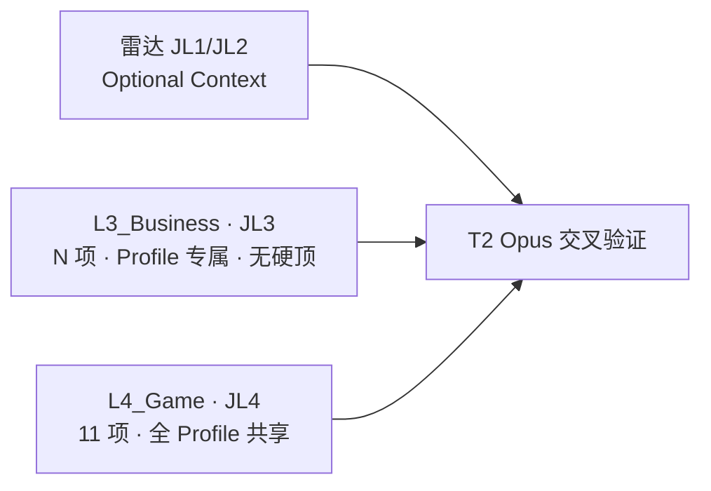
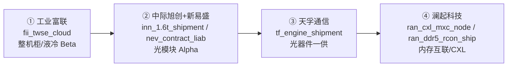
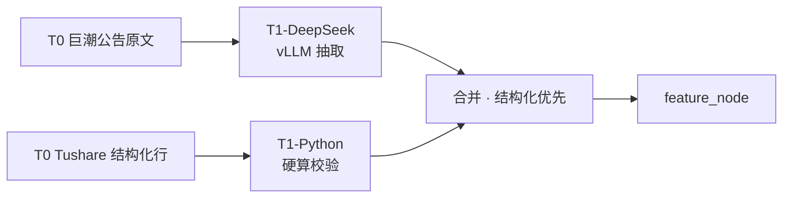
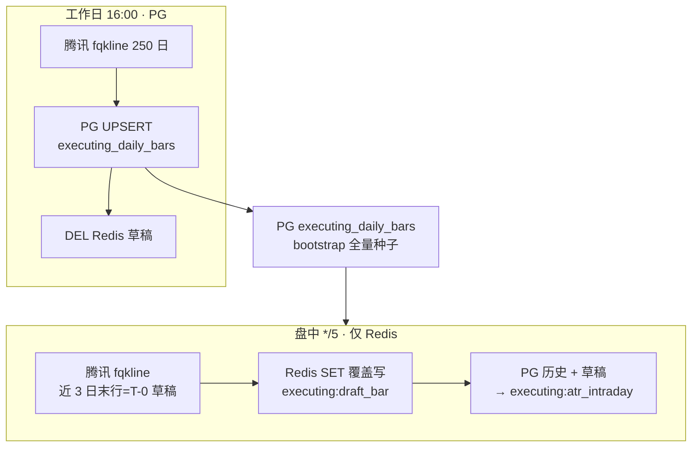
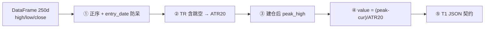
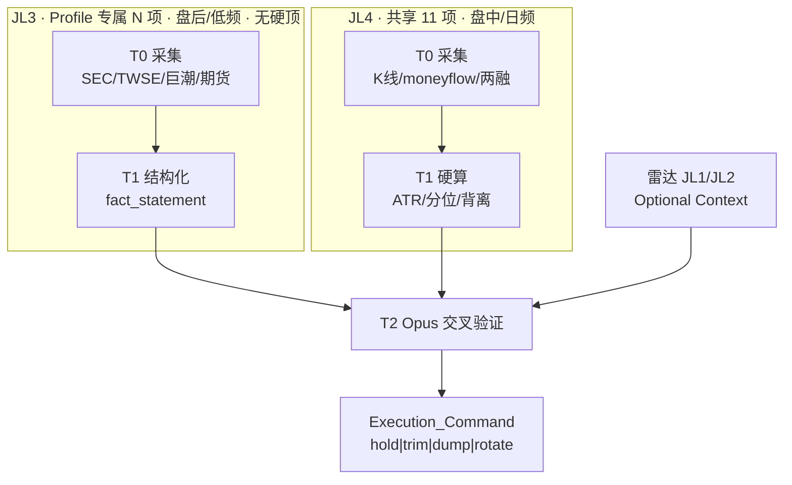
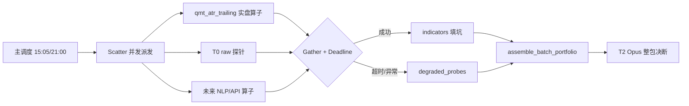
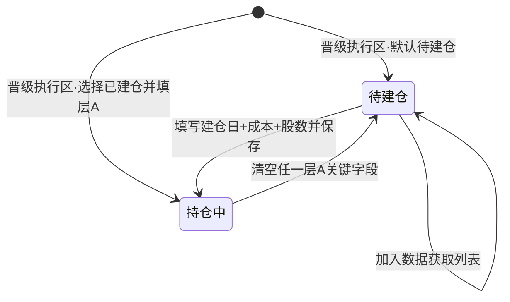

# 28 · 执行中工作区 · 标的深度监控与利润保卫（T0-T2 · Profile 可扩展）

> **文档定位**
>
> | 维度 | 说明 |
> |------|------|
> | **产品归属** | **④ 执行中工作区**（[25_ §1.2](./25_四区漏斗_三段流水线_架构脊柱_设计.md) 漏斗末端）— 对已晋级、真实持仓标的做 **T0 采集 → T1 度量 → T2 交叉验证 → 前端体检** |
> | **Profile 矩阵** | **AI 生态五龙** + **液冷扩展 002837** · **JL3 进攻 `{prefix}_*` + 防守 `r_{prefix}_*`** + **JL2 行业风险**（Optional Context）+ **JL4 固定 11 项** |
> | **运行时** | 唯一生产面 = **阿里云 ECS + K3s + Helm**（`cn-hongkong` / `ap-southeast-1`）；境外 Pod 出网采境内源；**禁止**马尼拉本机、Windows QMT 本地桥 |
> | **质量铁律** | ① 不接受降级/mock ② 缺数据 = `error` + blocker ③ 准出 = **Profile 已启用探针全量**真实源或 blocker 闭环 |
>
> **术语**：**研判层 JL1～JL4**（投资四层）≠ **矩阵域 `L3_Business`/`L4_Game`**（工程/UI 键，与 JL3/JL4 1:1）≠ **频率层 F0～F4**（采集新鲜度，§3.1）

> [!NOTE] **[TRACEBACK]**
> - **L1**：[06_投资哲学体系总纲](../../01_顶层概念/06_投资哲学体系总纲.md)
> - **L2**：[06_标的深度分析与阶段判定实践规划](../../02_战略维度/06_跨维度协作/06_标的深度分析与阶段判定实践规划.md)
> - **关联**：[25_ 四区漏斗](./25_四区漏斗_三段流水线_架构脊柱_设计.md) · [27_ 雷达主链](./27_行情雷达全链路架构设计优化.md) · [30_ 战略板块](./30_战略板块与滚动路线图_前端与数据契约.md) · [21_ 行情多源](./21_行情数据源降级与断路器规约.md) · [29_ 三底座](./29_三大数据底座与任务调度架构契约.md)
> - **代码**：`diting-src/apps/copilot/modules/executing/` · `diting-infra/charts/diting-stack/templates/executing-t0/`
> - **审计（非本文）**：实施进展见 [executing_probe_blockers.md](../../06_追溯与审计/executing_probe_blockers.md)；雷达十七项见 [27_](./27_行情雷达全链路架构设计优化.md)

---

## §1 产品定位与边界

### §1.1 漏斗位置

**入口**：`/planning?view=executing`。`funnel_stage=executing` 且挂载 `executing_profile` 的标的展示完整体检；未配置 profile 先展示通用持仓卡。

| 上游 | 与本区关系 |
|------|------------|
| ③ 规划中 | 可选只读 Artifact 注入 T2；**缺了不阻塞** Profile 已启用探针 |
| ② 滚动路线图 | 只读建仓窗；战略板块标签 + JL1/JL2 板块监控摘要（[30_ §6](./30_战略板块与滚动路线图_前端与数据契约.md)） |
| ① 行情雷达 | 只读九维快照；JL1/JL2 信号经 Optional Context 注入 T2（[27_ §2](./27_行情雷达全链路架构设计优化.md)） |
| **④ 本区** | 持仓 CRUD + Profile 探针 T0-T2 + advisory（**no-auto-execute**） |

### §1.2 研判四层与探针映射

**每 Profile 探针数 = `|l3_probes|`（可变）+ 11（JL4 共享）**，对应研判层 **JL3 + JL4**。**JL1、JL2 不占探针行**，由雷达/规划只读供给 Optional Context。



| 研判层 | 矩阵域 | 项数 | 核心问题 | 扩展方式 |
|--------|--------|:----:|----------|----------|
| JL3 微观事实 | `L3_Business` | **N ≥ 1 · 无硬顶** | 车间、库房、订单簿、账本是否仍健康 | `executing_profiles/{symbol}.yaml` → `l3_probes` 增删 |
| JL4 资金博弈 | `L4_Game` | **11 · 固定** | 主力是否派发、利润是否该锁 | 代码 `probe_keys.PROBE_KEYS` |

**槽位原则（2026-06-09）**

| 规则 | 说明 |
|------|------|
| **JL3 不设上限** | 有价值的新物理事实 → 加 Key；仅为凑数而加 → 禁止 |
| **价值重叠才删** | 两探针回答**同一投资问题**且口径不可区分 → 合并或删其一 |
| **允许多口径并存** | 同一维度**不同物理量**可并存（如原材料备料 vs 产成品库存；应收周转 vs 经营现金流） |
| **Profile 独立** | 进攻 `fii_*`/`inn_*`/… · 防守 `r_fii_*`/`r_inn_*`/… · **同口径不重复建 Key**，进攻探针挂**红旗阈值**（§2.1.1） |
| **JL1/L2 永不占行** | 宏观/行业总盘子 → 雷达 Optional Context → T2 背景 |

**Profile 一览**（JL3 进攻 + 防守为当前编排，**非**架构上限）：

| 标的 | 代码 | JL3 进攻 | JL3 防守 | JL2 风险 | JL4 | Profile 合计 |
|------|------|:--------:|:--------:|:--------:|:---:|:------------:|
| 工业富联 | 601138 | 21 | 6 | 1 | 11 | 39 |
| 中际旭创 | 300308 | 15 | 6 | 3 | 11 | 35 |
| 新易盛 | 300502 | 15 | 6 | 0 | 11 | 32 |
| 天孚通信 | 300394 | 15 | 7 | 2 | 11 | 35 |
| 澜起科技 | 688008 | 15 | 4 | 5 | 11 | 35 |
| 英维克 | 002837 | 14 | — | — | 11 | 25 |

T2 交叉验证示例：JL3 进攻完好 + **JL3 防守红旗未触发** + JL4 未破位 → 持有；**任一 JL3 防守红旗触发**（大客户砍单 / 路线颠覆 / 毛利击穿）→ **机械减仓，不恋战**（§1.6）。

### §1.3 与其他 step 的边界

| 关系 | 处理 |
|------|------|
| step_17（M11） | 可复用 `advisor.py`；本区 T2 **独立落库** `executing_daily_audits` |
| step_14～16 | 仅 Optional Context |
| 持仓真值 | **DB `user_positions`（前端 CRUD）**；YAML 仅 import 兜底 |

**必达功能**：① 持仓 CRUD ② Profile 已启用探针香港全量采集 ③ 日频 T0→T1→T2 ④ 三层 UI + 同步状态 ⑤ §3 调度体系 ⑥ no-mock / no-auto-execute

### §1.4 算力建设生命周期 · 板块轮动传导链

五龙监控的核心价值，是将模糊行业传闻转化为**可量化、可验证、具备排他性渠道的物理事实契约**，并在 AI 硬件基建生命周期中识别**板块轮动（Sector Rotation）**节点：



| 传导阶段 | 触发信号（示例） | 资金倾向 | 物理含义 |
|----------|------------------|----------|----------|
| **算力基建** | `fii_twse_cloud` 超预期 · `fii_gb200_milestone` 量产 | 工业富联 | 机架/液冷大批量落成 |
| **网络互联** | `inn_1.6t_shipment` 放量 · `nev_contract_liab` 环比 +30% | 中际旭创 / 新易盛 | 机柜插满光模块 |
| **器件上游** | `tf_engine_shipment` 突破 · `tf_awg_fiber_ratio` 稳 70%+ | 天孚通信 | 模块厂抢上游产能 |
| **数据流底层** | `ran_ddr5_rcon_ship` 占比升 · `ran_cxl_mxc_node` 商用 | 澜起科技 | 海量数据交互 · CXL 登场 |

**生态位区分（勿混比）**：天孚通信是「卖超级精密零件的」（小营收 · 50%+ 毛利 Alpha）；工业富联是「造航空母舰的」（千亿营收 · 大个位数毛利 · Beta）。二者赚不同生态位的钱。

### §1.5 操盘手实战雷达执行手册

**信息雷达网铁律**：T1 物理事实契约须来自**一手官方渠道**（TWSE 月报、巨潮财报附注、Tushare 硬算、供应链报关/招标），禁止 LLM 臆造数值。

**爆发前夜（绝对右侧买点）共振条件**（须同时满足 ≥2 项）：

1. **产品侧**：新产品量产出货 / 良率迈过临界点（如 `inn_yield_rate` ≥95.5% · `nev_silicon_photon` 闭环误码率过关）
2. **订单侧**：合同负债 + 原材料备货共振（如 `nev_contract_liab` 与 `inn_raw_material` 环比均超越 **30%** 阻力线）
3. **财务侧**：利润含金量回升（如 `inn_cfo_ratio` ≥1.15 · `nev_free_cash_flow` 连续 3 季为正）

**故事顶端获利了结（清仓信号）** — 三大死穴优先：

1. **大客户砍单 / 需求萎缩**（JL2 `cloud_capex_consensus` 下修 · JL3 `r_*_meta_delay` 等）
2. **技术路线颠覆**（JL2 铜退光缓 · JL3 `r_*_cpo_delay` / `r_*_lpo_fail` 等）
3. **毛利率击穿**（JL3 进攻毛利探针跌破 §2.x 阈值表 · 或 `r_*_gross_*` 红旗）

辅以：JL3 完好 + JL4 量价背离/主力流出 → T2 **事出反常必有妖 · 清仓逃顶**（§1.2）。完整 50 项防守矩阵见 **§1.6**、各 Profile **§2.2～§2.6**。

**量化中台接入**：Python 调 Tushare 一手数据 + 产业非结构化文本（Playwright/DeepSeek NLP）→ `executing_t0_raw` → T1 `fact_statement` → T2 Opus 交叉验证。

### §1.6 防守与风险监控执行手册

**铁律**：进攻决定能赚多少，防守决定能在桌上活多久。防守探针输出 **红旗物理事实契约**（`fact_statement` 仅陈述恶化事实；T2 映射 `trim_30_pct` / `dump_all`）。

**机械砍仓规则**（须同时写入 T2 `Execution_Command` 优先级，**高于**进攻共振）：

| 优先级 | 触发类型 | 动作 |
|:------:|----------|------|
| P0 | JL3 防守 Key 触发 + 一手源可复核 | `dump_all` 或 `trim_30_pct`（按持仓集中度） |
| P1 | JL2 行业风险 Key 触发 + ≥1 个 JL3 财务红旗 | `trim_30_pct` |
| P2 | 仅 JL2 行业风险（无公司财务确认） | `watch` + 禁止加仓 |

**三大死穴 ↔ 代表 Key**：

| 死穴 | 代表红旗（示例） |
|------|------------------|
| 大客户砍单 | `cloud_capex_consensus` 下修 · `r_nev_meta_delay` · `r_tf_mellanox_cut` |
| 路线颠覆 | `r_inn_cpo_delay` · `r_nev_lpo_fail` · `r_ran_cxl_abandon`（JL2） |
| 毛利击穿 | `inn_gross_margin` <28% · `nev_net_margin` <25% · `tf_gross_margin` <45% · `fii_ai_margin` <4% |

**宁可卖错，绝不扛单** — 卖方「信仰充值」不得覆盖 P0 红旗；风波平息且进攻逻辑重构后再评估回补。

---

## §2 探针规格

> **通则**：无数据 → `probe_blockers` + 前端红点；禁止默认值。**L3 Key 以 Profile YAML `l3_probes` 为准（可变长）**；L4 Key 以 `probe_keys.PROBE_KEYS` 为准（固定 11）。JL1/JL2 经雷达 Optional Context 注入 T2，**禁止**写入 L3 探针行。

### §2.0 四层矩阵总览

| 研判层 | 矩阵域 | 项数 | Key 命名空间 | 采集节奏 | 供给方式 |
|--------|--------|:----:|--------------|----------|----------|
| **JL1** 宏观 | — | 可变 | 雷达键 | 日～月 | 雷达 Optional Context → T2 |
| **JL2** 行业 | — | 可变 | 雷达键 | 日～季 | 雷达 Optional Context → T2 |
| **JL3** 微观 | `L3_Business` | **N · 无硬顶** | `{prefix}_*` 进攻 · `r_{prefix}_*` 防守 | 日～季/动态 | Profile YAML `l3_probes` |
| **JL4** 博弈 | `L4_Game` | **11 · 固定** | 共享键 | 盘中+EOD | `probe_keys.PROBE_KEYS` |

**Profile 探针总数** = `|l3_probes| + 11`（JL4）。

**Profile 探针总数** = `|l3_probes 进攻| + |l3_probes 防守| + 11`（JL4）；JL2 风险经雷达 Optional Context 注入，**不计入** Profile 探针行。

#### JL1 · JL2 · Optional Context（不占探针行 · 雷达注入 T2）

**共用 JL2（全市场）**

| Key | 中文简写 | 研判层 | 一手官方渠道 | 频次 | 红旗触发（示例） |
|-----|----------|:------:|--------------|:----:|------------------|
| `cpi_ppi_spread` | 通胀剪刀差 | JL1 | 国家统计局 CPI/PPI | 月 | PPI 连续 3 月高于 CPI 且扩大 |
| `cloud_capex_consensus` | 四云 Capex 共识 | JL2 | MSFT/GOOG/META/AMZN 季报 | 季 | 北美四云**下调** AI Capex 指引 |
| `nvda_gpu_leadtime` | GPU 交期 | JL2 | 供应链交期跟踪 | 月 | 交期反常延长 >8 周 |
| `tsmc_cowos_capacity` | CoWoS 封装产能 | JL2 | 台积电法说会 | 季 | 先进封装产能分配收紧 |
| `lme_copper_spike` | 铜价极端行情 | JL1 | LME/SHFE 铜期货 | 日 | 单月涨幅 >30%，成本失控 |
| `copper_optical_shift` | 铜退光缓 | JL2 | NVDA/AMD 互联规范 | 动 | NVL 柜内短距全面转向高速铜缆 |
| `dram_cycle_peak` | 存储周期见顶 | JL2 | 三星/海力士 Capex | 季 | 三大内存厂削减 DRAM 资本开支 |
| `cxl_adoption_risk` | CXL 架构退潮 | JL2 | OCP 峰会 / 云架构白皮书 | 动 | 云巨头转向 NVLink 等私有池化 |
| `intel_platform_delay` | 服务器平台推迟 | JL2 | Intel/AMD 路线图 | 动 | 支持 PCIe5/CXL 新 CPU 推迟 ≥6 月 |
| `eda_ip_sanction` | EDA/IP 断供 | JL2 | BIS / ARM/Synopsys 公告 | 动 | 先进节点 EDA 或 IP 授权受限 |
| `tsmc_advanced_restriction` | 先进制程受限 | JL2 | 台湾出口管制 / TSMC 法说 | 动 | 7nm 及以下代工受限或停供 |
| `tfln_disruption` | 薄膜铌酸锂替代 | JL2 | OFC / 龙头新品 | 动 | 分立光学器件需求被 TFLN 集成替代 |
| `domestic_optical_price_war` | 国内光器件价格战 | JL2 | 三大运营商集采 | 动 | 器件集采报价同比下跌 >30% |

#### JL4 · 资金博弈（11 项 · 全 Profile 共享）

| # | T1 Key | 中文简写 | T1 引擎 | 频次 |
|:---:|--------|----------|:-------:|:----:|
| 1 | `qmt_atr_trailing` | ATR 动态止盈 | Python | 盘中 5min + 日 |
| 2 | `volume_price_div` | 量价背离 | Python | 盘中 15min |
| 3 | `smart_money_flow` | L2 主力大单 | Python | 日 |
| 4 | `level2_super_order` | L2 特大单分位 | Python | 日 |
| 5 | `margin_short_skew` | 两融杠杆分位 | Python | 日 T+1 |
| 6 | `turnover_acceleration` | 换手加速 | Python | 日 |
| 7 | `block_trade_discount` | 大宗折价 | Python | 日 |
| 8 | `retail_concentration` | 散户接盘 | Python | 日 |
| 9 | `insider_sell_actual` | 减持实况 | Python+DeepSeek | 日 |
| 10 | `etf_redemption_impact` | ETF 申赎冲击 | Python | 日 |
| 11 | `tech_beta_correlation` | 板块 Beta 共振 | Python | 日 |

> JL4 采集规格、Cron、算子契约见 **§2.9**。前端 `PROBE_LABELS` 与上表及各 Profile `l3_probes.label` 一一对应。

### §2.1 JL3 扩展原则

**进攻 / 防守双轨**

| 轨道 | Key 前缀 | 层 | 问题 |
|------|----------|-----|------|
| **进攻** | `{prefix}_*` | JL3 | 暴利引擎是否仍在加速 |
| **防守** | `r_{prefix}_*` | JL3 | 致命红旗是否已触发 |
| **行业风险** | 见 §2.0 JL2 表 | JL2 | 赛道 Beta 是否破裂 |

#### §2.1.1 口径去重与红旗阈值

**同口径不重复建 Key**：进攻探针已覆盖的物理量，防守侧只补 **阈值** 或 **反向契约**，不另建同义 `r_*` 行。

| 规则 | 说明 |
|------|------|
| **阈值对照** | 进攻 Key 在 T1 算子内嵌 `red_flag_threshold`；T2 读取同一 `fact_statement` |
| **独立防守 Key** | 进攻未覆盖的风险物理量（诉讼、停产、实体清单等）→ 新增 `r_*` |
| **JL2 优先** | 行业/宏观/地缘共因 → JL2 Optional Context，禁止降级写入 JL3 |

**进攻探针 ↔ 防守阈值对照（五龙共用逻辑）**

| 进攻 Key | 红旗阈值 / 契约 | 死穴 |
|----------|-----------------|------|
| `inn_nv_share` | 一供份额 <50% 或竞品 ≥30% | 生态位 |
| `inn_gross_margin` | 1.6T 分部毛利 <28% | 毛利击穿 |
| `inn_eml_laser_stock` | 交期延长 >24 周或断供公告 | 供应链 |
| `inn_insider_sell` / `inn_mgmt_stock` | 董事长/核心 CTO **顶格**减持预披露 | 治理 |
| `nev_net_margin` | 单季净利率 <25% | 毛利击穿 |
| `nev_free_cash_flow` | 连续 2 季经营现金流大幅为负 | 现金流 |
| `nev_fin_expense` | 汇兑**损失**超预期（非收益） | 宏观 |
| `nev_inventory_days` | 周转天数 >90 | 资产 |
| `nev_lpo_progress` | LPO 误码率不达标被弃标 | 路线颠覆 |
| `tf_gross_margin` | 综合毛利 <45% | 毛利击穿 |
| `tf_engine_shipment` | 连续 2 季环比 ≤0 | 需求 |
| `tf_mellanox_order` | 北美直供同比 <-40% | 大客户 |
| `ran_gross_margin` | 芯片设计毛利 <50% | 毛利击穿 |
| `ran_jintide_server` | 信创核心大单连续零中标 | 生态位 |
| `fii_ai_margin` | AI 分部毛利 <4% | 毛利击穿 |
| `fii_quanta_share` | 增速落后广达且 GB200 份额被抢 ≥70% | 生态位 |
| `fii_apple_base` | 消费电子板块断崖式下滑 | 业务结构 |
| `fii_copper_shfe` | 30 日涨幅 >30% 且无法转嫁 | 成本 |
| `fii_cfo_health` / `fii_ar_turnover` | 经营现金流百亿级缺口或应收天数倒挂 | 现金流 |

新增 JL3 探针须同时满足：

1. **物理事实可验收** — 明确一手源、T1 输出字段、频次  
2. **投资问题未被覆盖** — 现有 `l3_probes` 无同口径探针  
3. **归属 JL3** — 宏观/行业指标不得降级填入 JL3，应走 JL1/JL2 Optional Context  

**流程**：Profile YAML 增 `l3_probes.{key}`（进攻或 `r_*` 防守）→ 本文 §2.2～§2.6 补规格行 → Cron §3.4 登记 → [executing_probe_blockers.md](../../06_追溯与审计/executing_probe_blockers.md) 审计。

**JL3 探针表列定义**（§2.2～§2.6 进攻/防守表统一）：

| 列 | 说明 |
|----|------|
| **#** | Profile 内序号（进攻、防守分表自 1 起） |
| **T1 Key** | 落库/前端技术键 |
| **中文简写** | UI 展示名牌 |
| **阅读子类** | 前端矩阵折叠分组 |
| **一手官方渠道** | T0 权威数据源 |
| **T1 引擎** | Python / PyMuPDF / DeepSeek / Playwright 及组合 |
| **频次** | 日 / 周 / 月 / 季 / 半年 / 年 / 动态 |
| **T1 物理事实契约** | 进攻=景气事实；防守=红旗触发示例（客观事实，T2 映射减仓） |

> **Cursor 实现**：上表为人类规格；**机器真相源**为 `diting-src/data/config/probe_registry/{symbol}.yaml`（§2.13）。新增探针须**同时**更新注册表 + Profile YAML + 本节表格。

### §2.2 Profile · 601138 工业富联

**监控焦点**：ODM-Direct · AI 服务器毛利 · GB200 量产 · 液冷渗透 · 代工基本盘防反噬。

#### JL3 · 进攻（21 项）

| # | T1 Key | 中文简写 | 阅读子类 | 一手官方渠道 | T1 引擎 | 频次 | T1 物理事实契约（输出示例） |
|:---:|--------|----------|----------|--------------|:-------:|:----:|----------------------------|
| 1 | `fii_twse_cloud` | 母公司云端营收 | 生态传导 | TWSE 2317「云端网路」月报 | Playwright | 月 | 母公司云端营收环比 +8.5%，AI 代工交付实质性增长 |
| 2 | `fii_odm_direct_ratio` | ODM 直供占比 | 客户结构 | 深交所财报 / 业绩会 QA | DeepSeek | 季 | ODM-Direct 直供云服务商占比提升至 65% |
| 3 | `fii_gb200_milestone` | GB200 量产节点 | 制造节点 | 巨潮业绩会实录 / 自愿性披露 | DeepSea 语义 | 动 | 状态机 `RUMOR→MP`；多点 `evidence_quotes` 拼图；`momentum_delta` 对比上期 |
| 4 | `fii_gb200_yield` | GB200 组装良率 | 制造良率 | TrendForce / 供应链简报 | DeepSeek | 动 | GB200 整机柜组装良率突破 90% |
| 5 | `fii_liquid_attach` | 液冷系统渗透率 | 盈利质量 | 出货结构拆解 / 券商调研 | DeepSeek | 季 | AI 服务器搭载全栈液冷方案比例提升至 40% |
| 6 | `fii_ai_margin` | AI 服务器毛利 | 盈利质量 | 业绩会 / IR · AI 分部 | DeepSeek | 季 | AI 服务器毛利率突破 9.5% |
| 7 | `fii_gross_margin` | 整体毛利率 | 盈利质量 | Tushare · 毛利率 | Python | 季 | 整体毛利率 7.35%，QoQ +5.37ppt |
| 8 | `fii_raw_inventory` | 原材料备料 | 财务运营 | 巨潮「存货分类」· 原材料 | PyMuPDF | 季 | 原材料同比大增 40%，符合超级大单备料 |
| 9 | `fii_inventory_turnover` | 存货周转天数 | 财务运营 | Tushare / 财报 | Python | 季 | 存货周转 61.6 天，备货节奏偏慢 |
| 10 | `fii_contract_liab` | 合同负债 | 订单前瞻 | Tushare · 合同负债及环比 | Python | 季 | 合同负债 45 亿，QoQ +15%，订单能见度高 |
| 11 | `fii_quanta_share` | 广达增速差 | 同业抢单 | TWSE 广达 2382 月报 | Playwright | 月 | 单月营收增速领先广达 12 个百分点 |
| 12 | `fii_copper_shfe` | 沪铜成本 | 成本因子 | SHFE 沪铜期货 | Python | 日 | 沪铜 30 日变动 +15%，机柜制造成本端承压 |
| 13 | `fii_exchange_rate` | 汇率影响 | 成本因子 | 外汇交易中心 USDCNY | Python | 日 | 人民币 30 日升值 0.98%，出口报价略不利 |
| 14 | `fii_ar_turnover` | 应收周转天数 | 财务运营 | Tushare · 应收周转 | Python | 季 | 应收周转 60 天，大客户账期轻微恶化 |
| 15 | `fii_cfo_health` | 经营现金流 | 财务运营 | Tushare · CFO/净利润 | Python | 季 | 经营现金流覆盖净利润 1.2 倍 |
| 16 | `fii_labor_auto_capex` | 自动化降本 | 成本因子 | 巨潮附注 · 折旧 vs 薪酬 | PyMuPDF | 季 | 折旧增速远超薪酬，自动化降本显现 |
| 17 | `fii_overseas_fdi` | 海外建厂投资 | 交付力 | 对外投资公告 · 墨/美/越 | DeepSeek | 动 | 墨西哥 AI 服务器工厂二期正式投产 |
| 18 | `fii_network_switch` | 800G 交换机 | 产品渗透 | 互动易 · 800G/1.6T 交换机 | DeepSeek | 动 | 800G 高速交换机营收同比 +150% |
| 19 | `fii_apple_base` | 消费电子拖累 | 业务结构 | 定期报告非 AI 拆分 | PyMuPDF | 季 | 消费电子板块同比下滑 8%，拖累整体 EPS |
| 20 | `fii_related_pty` | 鸿海关联交易 | 治理 | 巨潮「关联交易」表 | PyMuPDF | 季 | 对鸿海关联采购比例稳定，无异常利润转移 |
| 21 | `fii_mgmt_stability` | 董监高稳定 | 治理 | 巨潮董监高公告 | Python+DeepSeek | 日 | 365 日内无核心高管突发辞任 |

#### JL3 · 防守（6 项 · `r_fii_*`）

| # | T1 Key | 中文简写 | 阅读子类 | 一手官方渠道 | T1 引擎 | 频次 | T1 物理事实契约（红旗触发） |
|:---:|--------|----------|----------|--------------|:-------:|:----:|----------------------------|
| 1 | `r_fii_gb200_flaw` | GB200 设计缺陷 | 技术路线 | The Information / 供应链通报 | DeepSeek | 动 | GB200 过热/设计缺陷，整机柜组装叫停返工 |
| 2 | `r_fii_liquid_fail` | 液冷漏液事故 | 供应链 | 数据中心运营事故通报 | DeepSeek | 动 | CDU 液冷大规模漏液短路，面临天价索赔 |
| 3 | `r_fii_honhai_tunnel` | 母公司利益输送 | 治理风险 | 关联交易额度异常公告 | PyMuPDF | 季 | 鸿海单方面调高管理费或组件采购价，截留利润 |
| 4 | `r_fii_us_mexico_sanction` | 美墨工厂审查 | 地缘政治 | CFIUS / 商务部审查 | DeepSeek | 动 | 美/墨组装厂遭国安审查停产或限制 NVDA 供货 |
| 5 | `r_fii_inventory_write` | 存货大额计提 | 财务预警 | 巨潮 · 资产减值准备 | PyMuPDF | 半年 | GB200 切换致数百亿备料计提，超级存货减值 |
| 6 | `r_fii_ar_cycle_bad` | 资金链承压 | 财务预警 | 资产负债表 · 应收应付 | Python | 季 | 下游压账期+上游现款，经营现金流百亿级缺口 |

**阈值对照（不另建 Key）**：`fii_ai_margin` <4% · `fii_quanta_share` 落后且竞品垄断 ≥70% · `fii_apple_base` 断崖 · `fii_copper_shfe` 30日 >+30% → 见 §2.1.1。

**JL2 风险关联**：`lme_copper_spike` · `cloud_capex_consensus` 下修。

**Profile 扩展键**：`honhai_twse_code: "2317.TW"` · `peer_quanta_code: "2382.TW"` · `peer_wistron_code: "3231.TW"` · `sector_index_code: "931071.CSI"`

#### §2.2.1 标杆实践 · `fii_gb200_milestone`（DeepSea V2.1 五段完整拆解）

> **机器真相源**：`diting-src/data/config/probe_registry/601138.yaml#l3_probes.fii_gb200_milestone`  
> **代码路径**：`diting-src/apps/copilot/modules/executing/l3/fii_gb200_milestone/` · `services/deepsea/`  
> **契约版本**：`fii_gb200_milestone_deepsea_v1`  
> **TRACEBACK**：L3 本节 → [29_ §5.4](./29_三大数据底座与任务调度架构契约.md) Dispatcher → L4 `l3-fii-dynamic` Cron §3.4 → L5 `l5-stage-fii-gb200`

##### 一、指标画像与调度分配（Profiling & Routing）

| 字段 | 设定值 | 架构师说明 |
|------|--------|------------|
| `signal_type` | `semantic` | 纯语义状态机型；NDA 下无确切台数，禁止假方程 |
| `t1_pipeline` | `deepsea_semantic` | 深海 V4 Cache 挂载 + 概念探针抽取 |
| `update_trigger` | `event_driven` | 巨潮公告/业绩会实录入库即刻批推 |
| `cadence` | `dynamic` | 取决于官方披露节奏，无固定 Cron 周期 |
| `stale_days` | `90` | 超一季无进度披露亮黄灯 |
| `batch_id` / `cache_group` | `fii-cninfo-dynamic` | **核心调度锁** · 同篇全文 1 折 Cache Hit |
| `job_id` | `l3-fii-dynamic` | 事件流后台常驻任务 |
| `t0_source_id` | `cninfo_announcement_feed` | 巨潮 + 互动易 |
| `model_tier` | `flash` | 常规状态抽取 |
| `model_tier_escalation` | `pro_on_low_confidence` | MP/PVT 证据不足或置信偏低 → Pro 复核 |

**同组批推探针（共享 `fii-cninfo-dynamic`）**：`fii_odm_direct_ratio` · `fii_liquid_attach` · `fii_ai_margin`（别名 `fii_ai_margin_tone`）· `r_fii_gb200_flaw`

##### 二、T0 基础数据采集（Sensor Layer）

| 项 | 约定 |
|----|------|
| `doc_type` | `earnings_transcript`（业绩说明会实录）· `cninfo_announcement`（自愿性披露/互动易） |
| 物理对象 | 巨潮 PDF 或 Whisper 转写 Markdown · 对象湖 `parsed/{doc_id}.md` |
| 状态机枚举 | `RUMOR` → `EVT` → `DVT` → `PVT` → `MP` |
| 时序基准 | `nvidia_blackwell_ga_date`（默认 `2024-10-01` · env `EXECUTING_GB200_UPSTREAM_BOTTLENECK_DATE`） |
| T1 记忆 | `prior_signal_snapshot` ← PG `executing_t1_probe_snapshot`（等价 deepsea_indicator_state） |
| 采集通道 | 巨潮 API · IR 实录 · 互动易；侧翼 `fii_raw_inventory` QoQ 备料影子 |
| T0 降噪 | 回购/减持/理财类公告 **强降权**（除非标题含 GB200/NVL 关键词） |

##### 三、T0 → T1 推演链（Bridge）

1. **全局记忆加载**：`warm_context_cache(cache_group, doc_id, full_text)`  
2. **全量证据扫雷**：概念探针穷举「验证→良率/直通→交付」闭环原句  
3. **多点拼图**：联合多处 `evidence_quotes[]` 映射 `signal_status`  
4. **动量判定**：对比上期 `prior_signal_status` → `momentum_delta`（accelerating/stalled/reversed）  
5. **侧翼验真**：`MP` 节点 + 原材料 QoQ≥30% → `shadow_validation.passed`

##### 四、T1 防幻觉契约（Contract Layer）

- `value` / `calculation_logic` **恒 null**（禁止假算术）  
- 必填：`signal_status` · `evidence_quotes[]` · `fact_statement` · `momentum_delta` · `momentum_rationale` · `shadow_validation` · `doc_id` · `llm_tag`  
- 示例 JSON 见 `diting-doc/06_追溯与审计/` 会话样例或单测 `SAMPLE_T0`

##### 五、交付物与验证

```yaml
# probe_registry/601138.yaml · 节选
l3_probes:
  fii_gb200_milestone:
    signal_type: semantic
    t1_pipeline: deepsea_semantic
    update_trigger: event_driven
    batch_id: fii-cninfo-dynamic
    cache_group: fii-cninfo-dynamic
    job_id: l3-fii-dynamic
    t0_source_id: cninfo_announcement_feed
    cadence: dynamic
    stale_days: 90
    model_tier: flash
    model_tier_escalation: pro_on_low_confidence
    state_machine_nodes: [RUMOR, EVT, DVT, PVT, MP]
```

**同会话验证**（工作目录 `diting-src`）：

```bash
.venv/bin/python -m pytest tests/copilot/test_fii_gb200_milestone.py tests/copilot/test_deepsea_dispatcher.py -q
```

### §2.3 Profile · 300308 中际旭创

**监控焦点**：CSP 一供份额 · 1.6T/硅光量产 · 北美 Capex Beta · 霸主崩塌防线。

#### JL3 · 进攻（15 项）

| # | T1 Key | 中文简写 | 阅读子类 | 一手官方渠道 | T1 引擎 | 频次 | T1 物理事实契约（输出示例） |
|:---:|--------|----------|----------|--------------|:-------:|:----:|----------------------------|
| 1 | `inn_1.6t_shipment` | 1.6T 出货量 | 产品迭代 | B200/GB200 供应链流向 | DeepSeek | 月 | 1.6T 光模块单月出货量突破 10 万只，进入全面放量期 |
| 2 | `inn_nv_share` | 英伟达一供份额 | 客户结构 | 供应链访谈 / 厂商供货单 | DeepSeek | 季 | 英伟达 1.6T 可插拔模块采购中维持 60% 一供份额 |
| 3 | `inn_cpo_milestone` | CPO 商业化节点 | 技术跨越 | 超算中心招标书 / 公告 | DeepSeek | 动 | 硅光 CPO 方案通过谷歌下一代 AI 架构灰度测试 |
| 4 | `inn_eml_laser_stock` | EML 芯片交期 | 供应链瓶颈 | 住友/三菱等上游出货报告 | DeepSeek | 月 | EML 芯片到货周期由 24 周缩短至 12 周 |
| 5 | `inn_gross_margin` | 1.6T 单品毛利 | 盈利质量 | 定期报告 · 光电子器件分部 | Python | 季 | 1.6T 高端产品线毛利率逆势冲上 36.5% |
| 6 | `inn_contract_liab` | 合同负债 | 订单前瞻 | 财报 · 合同负债变动 | Python | 季 | 合同负债 18.5 亿，QoQ +25%，订单能见度极高 |
| 7 | `inn_raw_material` | 原材料备料 | 财务运营 | 季报附注 · 存货（原材料） | PyMuPDF | 季 | 原材料期末余额环比 +55%，确证大单排产 |
| 8 | `inn_tw_competitor` | 台湾同业增速差 | 同业抢单 | 台湾众达/富士康光通信月报 | Playwright | 月 | 营收增速跑赢台湾同业中枢 15 个百分点 |
| 9 | `inn_yield_rate` | 1.6T 工艺良率 | 制造良率 | 封测外线 / 产线台账 | DeepSeek | 动 | 1.6T 整机出厂良率稳定在 95.5% 以上 |
| 10 | `inn_inter_receivable` | 应收周转天数 | 财务运营 | Tushare · 应收账款周转 | Python | 季 | 应收周转 72 天，海外大客户无坏账风险 |
| 11 | `inn_cfo_ratio` | 现金流/净利润 | 盈利质量 | 现金流量表 · 净利润现金含量 | Python | 季 | 经营现金流/净利润比值回升至 1.15 |
| 12 | `inn_overseas_rev` | 海外营收占比 | 业务结构 | 年报 · 地域分部 | PyMuPDF | 半年 | 海外营收占比维持 85% 以上 |
| 13 | `inn_rd_intensity` | 研发强度 | 蓄力指标 | 财报 · 研发费用明细 | Python | 季 | 研发费用率 7.5%，重点投向 3.2T 及薄膜铌酸锂 |
| 14 | `inn_mgmt_stock` | 核心高管持股 | 治理 | 巨潮股份变动 / 大宗交易 | Python+DeepSeek | 日 | 核心技术领军人物无减持，激励锁定 2026–2028 |
| 15 | `inn_insider_sell` | 减持合规 | 治理 | 深交所董监高变动披露 | Python+DeepSeek | 日 | 窗口期无高管减持计划 |

#### JL3 · 防守（6 项 · `r_inn_*`）

| # | T1 Key | 中文简写 | 阅读子类 | 一手官方渠道 | T1 引擎 | 频次 | T1 物理事实契约（红旗触发） |
|:---:|--------|----------|----------|--------------|:-------:|:----:|----------------------------|
| 1 | `r_inn_entity_list` | 实体清单/关税 | 地缘政治 | 美国商务部 BIS 公报 | Playwright | 动 | 公司或核心上游入实体清单或遭遇惩罚性关税 |
| 2 | `r_inn_cpo_delay` | 硅光/CPO 掉队 | 技术路线 | 大客户下代架构白皮书 | DeepSeek | 动 | 下一代 CPO 招标落选，技术代差红利终结 |
| 3 | `r_inn_inventory_bad` | 存货高额减值 | 财务预警 | 资产减值准备公告 | PyMuPDF | 半年 | 巨额存货跌价计提，前期备货成废料 |
| 4 | `r_inn_ar_default` | 应收账款坏账 | 财务预警 | 财报附注 · 账龄分析 | PyMuPDF | 半年 | 1 年以上应收异常飙升，云客户实质性违约 |
| 5 | `r_inn_eml_cut` | 激光器断供 | 供应链 | 三菱/住友公告或出口禁令 | DeepSeek | 动 | 日系 EML 芯片断供或大幅延期，产线停工 |
| 6 | `r_inn_insider_dump` | 核心高管顶格减持 | 治理风险 | 巨潮 · 减持预披露 | Python+DeepSeek | 动 | 董事长/核心 CTO 静默期前顶格减持 |

**阈值对照**：`inn_nv_share` <50% 或竞品 ≥30% · `inn_gross_margin` <28% · `inn_eml_laser_stock` 交期 >24 周。

**JL2 风险关联**：`cloud_capex_consensus` · `copper_optical_shift`。

**Profile 扩展键**：`peer_nev_code: "300502.SZ"` · `sector_index_code: "931235.CSI"`

### §2.4 Profile · 300502 新易盛

**监控焦点**：超高净利率 · Meta/北美渗透 · 泰国产能 · 高弹性反噬防线。

#### JL3 · 进攻（15 项）

| # | T1 Key | 中文简写 | 阅读子类 | 一手官方渠道 | T1 引擎 | 频次 | T1 物理事实契约（输出示例） |
|:---:|--------|----------|----------|--------------|:-------:|:----:|----------------------------|
| 1 | `nev_net_margin` | 整体净利率 | 盈利质量 | Tushare · 净利率 | Python | 季 | 单季净利率 38.5%，刷新行业纪录 |
| 2 | `nev_meta_share` | Meta 采购渗透 | 客户结构 | 北美供应链尽调 / JDM 订单 | DeepSeek | 动 | Meta 800G/1.6T 增量订单份额达 30% |
| 3 | `nev_thailand_cap` | 泰国产能爬坡 | 交付力 | 泰国子公司纪要 / 扩产公告 | DeepSeek | 动 | 泰国新线投产，海外产能提升 100% |
| 4 | `nev_lpo_progress` | LPO 批量交付 | 技术迭代 | 互动易 / 新品测试公告 | DeepSeek | 动 | LPO 光模块实现万只级批量交付 |
| 5 | `nev_gross_premium` | 高端毛利差 | 盈利质量 | 定期报告明细折算 | Python | 季 | 800G/1.6T 毛利率 48.2%，高出同业 6ppt |
| 6 | `nev_inventory_days` | 存货周转天数 | 财务运营 | 财报 · 存货周转率 | Python | 季 | 存货周转 58 天，无呆滞料 |
| 7 | `nev_contract_liab` | 合同负债增速 | 订单前瞻 | 财报 · 合同负债 | Python | 季 | 合同负债 QoQ +42%，下季利润爆发可期 |
| 8 | `nev_silicon_photon` | 硅光量产验证 | 技术跨越 | OFC / 大客户测试反馈 | DeepSeek | 动 | 1.6T 硅光引擎通过闭环误码率测试 |
| 9 | `nev_cw_laser_cost` | CW 激光器成本 | 成本因子 | 上游 CW 激光器采购价 | DeepSeek | 月 | 外置光源芯片采购成本环比下降 8% |
| 10 | `nev_fin_expense` | 汇兑损益 | 成本因子 | 利润表 · 财务费用（汇兑） | Python | 季 | 单季汇兑收益 4500 万元，增厚净利 |
| 11 | `nev_top5_concen` | 前五大客户集中度 | 客户结构 | 年报 · 前五大销售额 | PyMuPDF | 年 | 前五大占比 70%，客户结构逐步泛化 |
| 12 | `nev_sales_growth` | 营收增速差 | 扩张动能 | 季报 vs 300308 营收增速 | Python | 季 | 营收增速超中际旭创 12 个百分点 |
| 13 | `nev_free_cash_flow` | 自由现金流 | 财务运营 | 现金流量表折算 | Python | 季 | 自由现金流连续 3 季为正 |
| 14 | `nev_fixed_asset` | 在建工程转固 | 产能前瞻 | 资产负债表 · 在建工程 | PyMuPDF | 季 | 泰国及成都二期大额转固，产能即将释放 |
| 15 | `nev_insider_sell` | 董监高合规 | 治理 | 深交所董监高变动披露 | Python+DeepSeek | 日 | 窗口期无高管减持计划 |

#### JL3 · 防守（6 项 · `r_nev_*`）

| # | T1 Key | 中文简写 | 阅读子类 | 一手官方渠道 | T1 引擎 | 频次 | T1 物理事实契约（红旗触发） |
|:---:|--------|----------|----------|--------------|:-------:|:----:|----------------------------|
| 1 | `r_nev_meta_delay` | Meta 订单推迟 | 客户依赖 | Meta 财报 / 基础设施博客 | DeepSeek | 动 | Meta 推迟大集群组网，核心增量订单悬空 |
| 2 | `r_nev_thai_tariff` | 泰国产能地缘风险 | 地缘政治 | 美国 CBP 原产地审查 | DeepSeek | 动 | 泰国组装模块遭溯源调查或绕道关税 |
| 3 | `r_nev_lpo_fail` | LPO 商业化失败 | 技术路线 | OIF / 大客户采购名录 | DeepSeek | 动 | LPO 误码率未达标，被头部客户全盘放弃 |
| 4 | `r_nev_yield_crash` | 1.6T 良率滑坡 | 供应链 | 退货记录 / 客户投诉 | DeepSeek | 月 | 批量交付后大规模退货，良率跌破 85% |
| 5 | `r_nev_talent_loss` | 硅光大牛离职 | 治理风险 | 离职公告 / 猎头动向 | DeepSeek | 动 | 核心硅光带头人离职或被竞争对手挖角 |
| 6 | `r_nev_patent_sue` | 知识产权诉讼 | 地缘政治 | 美国 ITC 337 调查 | Playwright | 动 | 遭海外巨头专利侵权诉讼，面临禁售 |

**阈值对照**：`nev_net_margin` <25% · `nev_free_cash_flow` 连续 2 季大幅为负 · `nev_fin_expense` 巨额汇兑损失 · `nev_inventory_days` >90。

**Profile 扩展键**：`peer_inno_code: "300308.SZ"` · `sector_index_code: "931235.CSI"`

### §2.5 Profile · 300394 天孚通信

**监控焦点**：光引擎/CPO · AWG 生态位 · 高毛利议价 · 垂直整合穿透防线。

#### JL3 · 进攻（15 项）

| # | T1 Key | 中文简写 | 阅读子类 | 一手官方渠道 | T1 引擎 | 频次 | T1 物理事实契约（输出示例） |
|:---:|--------|----------|----------|--------------|:-------:|:----:|----------------------------|
| 1 | `tf_engine_shipment` | 高速光引擎出货 | 技术跨越 | 旭创/新易盛采购端 | DeepSeek | 月 | 高速光引擎单月交付突破 5 万套 |
| 2 | `tf_awg_fiber_ratio` | AWG/光纤阵列份额 | 生态位 | 行业协会 / 光模块厂调研 | DeepSeek | 季 | 800G 核心器件供应链份额维持 70% |
| 3 | `tf_gross_margin` | 综合毛利率 | 盈利质量 | Tushare · 综合毛利率 | Python | 季 | 综合毛利率 51.3%，产业链议价权极强 |
| 4 | `tf_barrel_effect` | 陶瓷套管/适配器 | 供应链瓶颈 | 开工率 / 海关出口报关 | DeepSeek | 月 | 精密陶瓷件产能利用率 98% 饱开 |
| 5 | `tf_jiangxi_expansion` | 江西基地扩产 | 交付力 | 江西天孚项目官方公示 | DeepSeek | 动 | AI 光器件扩产项目进度 90%，即将投产 |
| 6 | `tf_rd_capitalized` | 研发资本化率 | 财务运营 | 财报附注 · 开发支出 | PyMuPDF | 季 | 研发费用资本化率 0%，利润真实度高 |
| 7 | `tf_contract_liab` | 合同负债 | 订单前瞻 | 资产负债表 · 合同负债 | Python | 季 | 订单定金类合同负债创历史新高 |
| 8 | `tf_roic_premium` | ROIC | 盈利质量 | 财务分析 · ROIC | Python | 季 | 年化 ROIC 28%，板块领先 |
| 9 | `tf_mellanox_order` | 北美直供订单 | 客户结构 | US Customs 进口报关 | DeepSeek | 月 | 直供海外设备巨头金额环比 +15% |
| 10 | `tf_inventory_write` | 存货跌价计提 | 财务运营 | 资产减值准备明细 | PyMuPDF | 半年 | 存货跌价计提比例低于 1% |
| 11 | `tf_capacity_util` | 无尘车间稼动率 | 生产节点 | 工厂电力 / 排班数据 | DeepSeek | 月 | 高级封装车间三班倒满负荷（稼动率 105%） |
| 12 | `tf_employee_bonus` | 核心人才流失率 | 治理 | 股权激励名单 / HR 披露 | PyMuPDF | 年 | 核心技术骨干离职率低于 2% |
| 13 | `tf_tax_credit` | 高新税收优惠 | 成本因子 | 税务局公示 / 政府补助 | DeepSeek | 动 | 15% 优惠税率及科技专项补助顺畅展期 |
| 14 | `tf_glass_lens_yield` | 非球面透镜良率 | 制造良率 | 精密光学质检月报 | DeepSeek | 月 | 1.6T 聚合透镜压制良率攻克 92% |
| 15 | `tf_co_op_rnd` | 联合研发提案 | 技术前瞻 | OIF 等行业标准组织 | DeepSeek | 动 | 与前三大模块厂联合提交 CPO 接口标准 |

#### JL3 · 防守（7 项 · `r_tf_*`）

| # | T1 Key | 中文简写 | 阅读子类 | 一手官方渠道 | T1 引擎 | 频次 | T1 物理事实契约（红旗触发） |
|:---:|--------|----------|----------|--------------|:-------:|:----:|----------------------------|
| 1 | `r_tf_downstream_inhouse` | 下游模块厂内化 | 生态位 | 旭创/新易盛器件扩产公告 | DeepSeek | 动 | 大客户自建光引擎/AWG 线，大幅削减外购 |
| 2 | `r_tf_engine_stagnate` | 光引擎放量停滞 | 供应链 | 季度交流会产量通报 | DeepSeek | 季 | 光引擎连续 2 季出货量环比零增或负增 |
| 3 | `r_tf_jiangxi_stop` | 核心产线停摆 | 供应链 | 应急管理部 / 公司公告 | DeepSeek | 动 | 江西主力厂区环保/电力原因停工 ≥1 周 |
| 4 | `r_tf_mellanox_cut` | 海外直供腰斩 | 客户依赖 | 海关出口 / 大客户动态 | DeepSeek | 季 | 北美设备巨头直供订单同比下滑 >40% |
| 5 | `r_tf_asset_impair` | 商誉/资产减值 | 财务预警 | 资产负债表 · 商誉 | PyMuPDF | 年 | 并购项目未达对赌，巨额商誉减值 |
| 6 | `r_tf_inventory_pile` | 产成品积压 | 财务预警 | 财报附注 · 存货分类 | PyMuPDF | 季 | 产成品高企、原材料锐减，终端销售卡壳 |
| 7 | `r_tf_overseas_block` | 东南亚设厂失败 | 地缘政治 | 对外投资进展公告 | DeepSeek | 动 | 东南亚产能转移受阻，无法满足 China+1 合规 |

**阈值对照**：`tf_gross_margin` <45% · `tf_engine_shipment` 连续 2 季环比 ≤0。

**JL2 风险关联**：`tfln_disruption` · `domestic_optical_price_war`。

**Profile 扩展键**：`peer_inno_code: "300308.SZ"` · `peer_nev_code: "300502.SZ"` · `sector_index_code: "931235.CSI"`

### §2.6 Profile · 688008 澜起科技

**监控焦点**：DDR5/CXL · PCIe Retimer · 津迈信创 · 技术青黄不接防线。

#### JL3 · 进攻（15 项）

| # | T1 Key | 中文简写 | 阅读子类 | 一手官方渠道 | T1 引擎 | 频次 | T1 物理事实契约（输出示例） |
|:---:|--------|----------|----------|--------------|:-------:|:----:|----------------------------|
| 1 | `ran_ddr5_rcon_ship` | DDR5 RCD 出货 | 产品迭代 | 三星/海力士/美光出货 | DeepSeek | 月 | DDR5 第三子代 RCD 出货占比突破 60% |
| 2 | `ran_cxl_mxc_node` | CXL MXC 量产 | 技术跨越 | 浪潮/超微等服务器厂采购 | DeepSeek | 动 | MXC 获北美大厂首批商业量产订单 |
| 3 | `ran_pcie_retimer` | PCIe Retimer | 生态位 | GB200 主板拆解 / 供货链 | DeepSeek | 动 | PCIe 5.0 Retimer 切入高端智算主板 |
| 4 | `ran_gross_margin` | 芯片设计毛利 | 盈利质量 | 季报 · 芯片设计分部 | Python | 季 | 互联芯片分部毛利率 58.8% |
| 5 | `ran_contract_liab` | 合同负债 | 订单前瞻 | 巨潮 · 合同负债 | Python | 季 | 境外客户预付款大幅攀升 |
| 6 | `ran_inventory_turn` | 存货周转天数 | 财务运营 | Tushare · 存货周转 | Python | 季 | 存货周转由 140 天降至 92 天 |
| 7 | `ran_jintide_server` | 津迈服务器中标 | 客户结构 | 政府采购网 / 智算招标 | Playwright | 动 | 搭载津迈 CPU 服务器连续中标信创项目 |
| 8 | `ran_rd_expense` | 正向研发费用 | 蓄力指标 | 利润表 · 研发费用 | Python | 季 | 单季研发费用同比 +30% |
| 9 | `ran_aic_chip_test` | 边缘 AI 芯片测试 | 技术前瞻 | 实验室灰度测试数据 | DeepSeek | 动 | 边缘 AI 芯片通过板级电性能测试 |
| 10 | `ran_cfo_health` | 现金充裕度 | 财务运营 | Tushare · 经营现金流/现金 | Python | 季 | 现金及理财超 70 亿，无有息负债 |
| 11 | `ran_serdes_ip` | SerDes 自研比例 | 成本因子 | 知识产权局专利公告 | DeepSeek | 动 | 112G SerDes IP 100% 自研 |
| 12 | `ran_rambus_patent` | Rambus 专利诉讼 | 治理 | 全球专利诉讼库 / 法律公告 | DeepSeek | 动 | 与 Rambus 无新增专利纠纷 |
| 13 | `ran_headcount_all` | 研发人员结构 | 治理 | 社会责任报告 / 年报 | PyMuPDF | 年 | 硕博研发人员占比超 75% |
| 14 | `ran_intel_platform` | 英特尔/AMD 平台适配 | 产业周期 | Intel 平台更迭指南 | DeepSeek | 季 | 配合最新服务器平台出货比重超预期 |
| 15 | `ran_tsmc_wafer` | 台积电投片量 | 供应链前瞻 | 台积电排产台账 | DeepSeek | 月 | 6nm/7nm 节点投片量单月环比 +25% |

#### JL3 · 防守（4 项 · `r_ran_*`）

| # | T1 Key | 中文简写 | 阅读子类 | 一手官方渠道 | T1 引擎 | 频次 | T1 物理事实契约（红旗触发） |
|:---:|--------|----------|----------|--------------|:-------:|:----:|----------------------------|
| 1 | `r_ran_rambus_share` | Rambus 份额逆袭 | 生态位 | Rambus(RMBS) 财报指引 | DeepSeek | 季 | Rambus 在 DDR5 RCD 份额反超突破 50% |
| 2 | `r_ran_tapeout_fail` | 核心芯片流片失败 | 供应链 | 产业链尽调 / 研发披露 | DeepSeek | 半年 | 下一代 PCIe6 Retimer 流片失败需推倒重来 |
| 3 | `r_ran_jintide_zero` | 津迈信创出局 | 生态位 | 信创采购目录 / 中标公告 | Playwright | 季 | 津迈 CPU 服务器在政务/金融大单连续零中标 |
| 4 | `r_ran_rd_capital_bad` | 研发资本化暴雷 | 财务预警 | 财报 · 开发支出转费用化 | PyMuPDF | 年 | 资本化开发支出失败转费用，暴杀净利润 |

**阈值对照**：`ran_gross_margin` <50% · `ran_jintide_server` 连续零中标。

**JL2 风险关联**：`intel_platform_delay` · `dram_cycle_peak` · `cxl_adoption_risk` · `eda_ip_sanction` · `tsmc_advanced_restriction`。

**Profile 扩展键**：`sector_index_code: "H30184.CSI"` · `sector_index_name: "中证半导体"`

### §2.7 Profile · 002837 英维克（JL3 进攻 × 14 · 液冷扩展）

**监控焦点**：液冷中标率 · 原厂认证 · 铝铜成本 · 垫资与回款风险。

#### JL3 · 进攻（14 项）

| # | T1 Key | 中文简写 | 阅读子类 | 一手官方渠道 | T1 引擎 | 频次 | T1 物理事实契约（输出示例） |
|:---:|--------|----------|----------|--------------|:-------:|:----:|----------------------------|
| 1 | `env_liquid_win_rate` | 液冷中标率 | 订单簿 | 中移动采购网 / 采招网 | Playwright | 月 | 移动液冷集采第一份额 40% |
| 2 | `env_oem_certs` | 原厂认证数 | 生态护城河 | 浪潮/新华三/宁畅白皮书 | Playwright | 动 | 新增 5 款浪潮 AI 服务器冷板认证 |
| 3 | `env_al_cu_idx` | 铝铜成本指数 | 成本因子 | SHFE 沪铜 + 沪铝 | Python | 日 | 铝铜合成成本 30 日 +8%，CDU 毛利承压 |
| 4 | `env_coolant_ratio` | 冷却液耗材 | 商业模式 | 专利局 / 财报耗材拆分 | DeepSeek | 季 | 自主冷却液专利获批，设备+耗材打通 |
| 5 | `env_margin_pass` | 成本转嫁能力 | 盈利质量 | 铜价 vs 毛利率时滞 | Python | 季 | 本季毛利未受铜价上涨拖累 |
| 6 | `env_cdu_share` | CDU 市占率 | 竞争格局 | CCID / IDC 调研公报 | DeepSeek | 年 | 国内液冷 CDU 份额稳定 35% 以上 |
| 7 | `env_ess_growth` | 储能温控 | 业务结构 | 巨潮「营业收入构成」 | PyMuPDF | 季 | 储能温控同比下滑 15% |
| 8 | `env_b2b_aging` | 长账龄应收 | 财务风险 | 巨潮「按账龄披露」 | PyMuPDF | 季 | 1 年期以上应收占比攀升 |
| 9 | `env_cfo_to_net` | 经营现金流 | 财务运营 | Tushare · CFO/净利润 | Python | 季 | 经营现金流入不敷出，垫资风险 |
| 10 | `env_warranty` | 售后准备金 | 产品质量 | 巨潮「预计负债」附注 | PyMuPDF | 季 | 售后准备金比例稳定 |
| 11 | `env_inv_structure` | 存货结构 | 财务运营 | 巨潮「存货分类」 | PyMuPDF | 季 | 库存商品积压增而原材料锐减 |
| 12 | `env_immersion_rd` | 浸没式液冷 | 研发抢位 | 调研纪要 / 互动易 | DeepSeek | 动 | 单相浸没式液冷已交付测试 |
| 13 | `env_client_top5` | 前五大客户 | 客户结构 | 巨潮「主要客户」 | PyMuPDF | 季 | 前五大集中度降至 40% |
| 14 | `env_goodwill_imp` | 商誉占比 | 财务风险 | Tushare · 商誉/净资产 | Python | 季 | 商誉占净资产逼近 12% |

**Profile 扩展键**：`metal_weights: {cu: 0.4, al: 0.6}` · `sector_index_code: "931071.CSI"`

### §2.8 L3 引擎通则（T0 / T1 边界）

| 引擎 | 适用 | 输出要求 |
|------|------|----------|
| **Python** | Tushare/期货/财务硬算 | `value` + `calculation_logic` + `fact_statement` · 禁止 LLM 算数 |
| **Python + PyMuPDF** | 巨潮 PDF 表格硬解析 | 表格行列 + 正则；LLM 仅补 NL 字段 |
| **DeepSeek / vLLM** | 业绩会 QA、互动易、研报 NLP | 须 `llm_tag` + 证据句 ≤512 字 |
| **Playwright** | TWSE、采招网、OFC、第三方榜单 | T0 落 HTML/PDF 摘要；T1 抽取结构化字段 |

**T1 契约**：`fact_statement` **仅拼装物理事实**，禁止买卖建议；缺字段 → `error` + blocker（与 JL4 同 §4.1 降噪规则）。

### §2.9 `L4_Game`（11 项 · JL4 · 全 Profile 共享 · 金融级规范）

#### 前置清洗（全部 JL4 适用）

| 规则 | 要求 |
|------|------|
| 前复权 | K 线价格/量语义对齐 QMT `get_market_data_ex(adjust='forward')`；Pod 经 [21_] `fqkline` 或 Tushare |
| 日频空值 | 停牌 NaN → forward fill 后再算 |
| 无 mock | 窗不足/缺字段 → error + blocker |

> QMT 接口名仅作字段契约；生产禁止本地 QMT 桥。

#### T1 引擎分工（JL4 专则）

JL4 属**盘面微观量化**；与 [29_ §1.2](./29_三大数据底座与任务调度架构契约.md) 一致：**时序硬算必须 Python/Pandas**，禁止把 ATR/量价比/Beta 等交给 LLM。

| 引擎 | 适用条件 | JL4 项数 |
|------|----------|:--------:|
| **Python** | 结构化数值/序列；公式可写死；输出须可复现审计 | **10** |
| **Python + DeepSeek** | 结构化表 + 公告正文并存；需本体/关联方消歧与 NL 抽取 | **1**（#9） |
| **DeepSeek 独揽** | — | **0** |

**T0 / T1 边界**：T0 只落原始序列/表/公告原文；T1 算子产出 `feature_node`（`value` + `calculation_logic` + `fact_statement`）。DeepSeek 槽位须写 `llm_tag`，禁止关键词规则冒充 LLM（§8）。

#### 探针明细（JL4 · #1～#11）

> **主源**：#1/#2/#11 → [21_] `fqkline` 前复权；#3 → Tushare Pro `moneyflow` + `daily_basic.free_share`；#4～#8/#9 结构化部分 → Tushare Pro；#10 → 新浪 ETF 份额 HTTP。

| # | Key | T1 引擎 | Lookback | 颗粒度 | Cron（北京时间） | T1 逻辑 |
|:---:|-----|:-------:|----------|--------|------------------|---------|
| 1 | `qmt_atr_trailing` | Python | 峰值：`entry_date`→T-0；ATR：T-20→T-0 | 日线 | 盘中 `*/5 9-15 * * 1-5`；PG `0 16 * * 1-5` | `(peak_high-close)/ATR20` |
| 2 | `volume_price_div` | Python | T-10→T-0 | 15min | 盘中 `*/15 9-15 * * 1-5` | 高位下跌 15min K 量占比 → 背离指数 |
| 3 | `smart_money_flow` | Python | T-3→T-0（PG 250 日底库） | 日线 | `0 14` 回填 / `0 16` 日更 | 近 3 日 elg+lg 净量占流通盘 % |
| 4 | `level2_super_order` | Python | T-120→T-0 | 日线 | `0 14` 回填 / `0 17` 日更 | PercentileRank(今日 elg 净额, 120日) |
| 5 | `margin_short_skew` | Python | T-250→T-0 | 日线 | `30 8 * * 2-6`（T+1） | PercentileRank(融资余额/流通市值, 250日) |
| 6 | `turnover_acceleration` | Python | T-140→T-0 | 日线 | `30 15 * * 1-5` | 今日换手 / 20d_mean 加速倍数 |
| 7 | `block_trade_discount` | Python | T-3→T-0 | 事件 | `0 17 * * 1-5` | `amount>3000万` 且折价>10% |
| 8 | `retail_concentration` | Python | T-5→T-0 | 日线 | `30 15 * * 1-5` | 中小单净买/总成交比 |
| 9 | `insider_sell_actual` | 混合 | T-3→T-0 + 拟减持结束日 | 事件 | `0 20 * * 1-5` | 见 §2.9.1 |
| 10 | `etf_redemption_impact` | Python | T-5→T-0 | 日线 | `15 15 * * 1-5` | 5 日 ETF 份额边际变动率 |
| 11 | `tech_beta_correlation` | Python | T-120→T-0（个股+板块指数同窗） | 日线 | `30 15 * * 1-5` | 60 日滚动 Pearson ρ / R² / Beta |

#### §2.9.1 `#9 insider_sell_actual` · 混合 T1 契约



| 路径 | 职责 | 输出 |
|------|------|------|
| **T1-Python** | `insider_ts_code_filter` 硬过滤；`vol/总股本` 算减持%；与 DeepSeek 字段交叉校验 | `value`（减持%）、`calculation_logic` |
| **T1-DeepSeek** | 巨潮正文：股东名、变动股数、**本体 vs 关联方**、未来 3～6 月**拟减持上限** | `fact_statement` + `llm_tag` + 证据句（≤512 字） |

**合并规则**：Tushare 有合规结构化行 → Python 为主、DeepSeek 仅补「承诺上限」；仅公告无表 → DeepSeek 抽取 + Python 算%; 二者冲突 → `error` + blocker，禁止静默取一。

#### §2.9.2 `#1` 日线底库 · 双轨（Redis 盘中草稿 + PG 收盘增量）

> **用途**：`qmt_atr_trailing` 的 T0 底稿。**盘中**只在 Redis 覆盖写当日未收盘 K 线（草稿）；**盘后** 16:00 增量 UPSERT PG。T1 硬算 = PG 历史 249 根 + Redis 当日草稿合并，**禁止**盘中每 5 分钟打 250 日 HTTP 写库。



**Redis 盘中草稿（`quote-intraday` · 不写 PG）**

| 项 | 规格 |
|----|------|
| **语义** | 250 日序列中 **T-0 行**在内存里「原位覆盖」：10:00 high=75 → 10:05 high=76 直接 `SET` 覆盖，**禁止** `RPUSH` 追加 |
| **Key** | `executing:draft_bar:{symbol}` · JSON `{trade_date,open,high,low,close,volume,mode:intraday_overwrite}` |
| **衍生** | `executing:quote:{symbol}`（现价+当日 OHLC）· `executing:atr_intraday:{symbol}`（回撤倍数快照） |
| **TTL** | 草稿 10h · ATR 快照 10min |
| **数据源** | `fetch_kline(days=3)` 末行 `trade_date=今天`；无当日行 → skip（非交易日） |
| **ATR 算** | `merge_pg_rows_with_draft` → `process_qmt_atr_trailing`（§2.9.3 五步法） |

**PG 收盘底库（`l4-atr-bars-sync` · 工作日 16:00）**

| 项 | 规格 |
|----|------|
| **数据源** | 仅 `tencent_kline.fetch_kline`（[21_] fqkline · `param={code},day,,,250,qfq`）· **禁止** akshare 写入 |
| **根数** | 请求 250 交易日；验收 `bars_count >= 200` |
| **库表** | `diting_copilot.executing_daily_bars`（L2 PG） |
| **主键** | `(symbol, trade_date, adjust)` · `adjust='qfq'` |
| **刷新策略** | **增量 UPSERT**（按主键覆盖/插入，**不** DELETE 全表）· 落库后 `DEL` Redis 草稿 |
| **Bootstrap** | 一次性 Job `executing-bars250-bootstrap` 仍用 **全量 replace**（冷启动种子） |
| **Cron** | `l4-atr-bars-sync` · `0 16 * * 1-5`（收盘后落盘，与 §2.9 JL4 #1 盘后清算对齐） |

**落库后联动**

1. 写 `executing_daily_bars` N 行  
2. 同步写 `executing_t0_raw`（`probe_key=qmt_atr_trailing`）摘要  
3. 更新 `executing_t0_sync_watermarks`（`job_id=l4-atr-bars-sync`）  
4. `daily-pipeline` / `collect-once` 优先 `load_daily_bars()`，再 T1 硬算

**验收 SQL（生产 Pod / psql）**

```sql
SELECT symbol, COUNT(*) AS n, MIN(trade_date), MAX(trade_date), MAX(source)
FROM executing_daily_bars
WHERE symbol = '601138' AND adjust = 'qfq'
GROUP BY symbol;
-- 期望：n >= 200 · source = tencent_fqkline · max(trade_date) = 最近交易日
```

**Profile 扩展键**（`601138.yaml`）：`etf_watchlist`、`insider_ts_code_filter`、`ccass_foreign_participants`

#### §2.9.3 `#1` T1 算子 · `qmt_atr_trailing` 五步法

> **代码**：`diting-src/apps/copilot/modules/executing/t1_operators/qmt_atr_trailing.py`  
> **输入**：`rows_to_dataframe` ← PG `executing_daily_bars` +（盘中）Redis `draft_bar` 合并为 250 日序列  
> **建仓日**：`user_positions.opened_at` · 缺失或超出 K 线窗 → `AtrTrailingError` → blocker（**禁止**输出错误倍数）



| 步骤 | 机构级要求 | 实现要点 |
|:----:|------------|----------|
| ① 防呆 | 时间正序；`entry_date ∈ [min(trade_date), max(trade_date)]` | `sort_index()` · 越界 `raise AtrTrailingError` |
| ② ATR₂₀ | **True Range** = `max(H-L, |H-prev_close|, |L-prev_close|)`；取末 20 日 TR 均值 | Pandas/numpy · 尾部含盘中 Redis 草稿行 |
| ③ 峰值 | 仅 `index >= entry_date` 的 `high.max()` | 剔除建仓前「前朝历史」 |
| ④ 倍数 | `(peak_high - close[-1]) / ATR20`；`ATR20 < 0.01` → `value=0` | 防除零 |
| ⑤ 契约 | 剥离主观判断 · 标准 feature_node | 见下表 |

**T1 输出 JSON（落 `executing_t0_raw` / 送 T2 Opus）**

| 字段 | 说明 |
|------|------|
| `indicator_key` | 固定 `qmt_atr_trailing` |
| `value` | 回撤倍数（保留 2 位小数） |
| `source` | 盘中：`PG executing_daily_bars + Redis draft_bar · tencent_fqkline`；盘后：`PG executing_daily_bars · tencent_fqkline` |
| `calculation_logic` | 可审计公式串，含 peak/current/ATR20 数值 |
| `fact_statement` | 客观事实句（无买卖建议） |

兼容审计字段：`atr20`、`peak_price`、`current`、`atr_multiple`、`as_of`、`entry_date_used`。

> **生产约束**：禁止 QMT 本地桥；数据源为腾讯 fqkline（[21_]）+ PG/Redis 双轨（§2.9.2）。T1 由 `t1_build.build_telemetry` 直引 payload 的 `value` / `calculation_logic` / `fact_statement`。

---

#### §2.9.4 `#3 smart_money_flow` · L2 主力大单管道（T0→T1）

> **信号定义**：L2 **特大单 + 大单** 净流向（Smart Money Delta），数据源 Tushare Pro `moneyflow`。

#### 一、T0 基础数据采集（L2 Moneyflow Pipeline）

| 项 | 规约 |
|----|------|
| **数据源** | Tushare Pro **`moneyflow`**（个股资金流向 · 高阶清洗数据） |
| **凭证** | 环境变量 **`TUSHARE_TOKEN`**（Pro Token · 接口需 **≥2000 积分**） |
| **执行时序** | **`0 14 * * 1-5`** 250 日回填检查 · **`0 16 * * 1-5`** 日更增量（Tushare 聚合稳定窗口） |
| **job_id** | `l4-smart-money-backfill`（14:00）· `l4-smart-money-eod`（16:00） |

**存储（生产级 · Redis + PG 双写）**

| 层 | 表/键 | 内容 |
|----|------|------|
| **PG 底库** | `executing_moneyflow_daily` | 目标 **250 交易日** 全字段日终行（冷启动/分位数预留） |
| **PG T1** | `executing_t1_probe_snapshots` | 最新 Smart Money Delta 白盒节点 |
| **PG T0 摘要** | `executing_t0_raw` | 末 3 日样本 + `rows_in_pg`（非 250 行全文） |
| **Redis** | `executing:moneyflow:{symbol}` | 250 行热缓存 · TTL 14d · **miss 时从 PG 回灌** |

**核心采集字段**（T0 raw · 写入 `executing_moneyflow_daily` + T0 摘要）：

| 字段 | 含义 |
|------|------|
| `buy_elg_vol` / `sell_elg_vol` | 特大单买/卖量（顶尖机构/量化） |
| `buy_lg_vol` / `sell_lg_vol` | 大单买/卖量（游资/大户） |
| `buy_md_vol` / `sell_md_vol` | 中单（T1 丢弃 · 仅作 retail 对照） |
| `buy_sm_vol` / `sell_sm_vol` | 小单（T1 丢弃） |
| `net_mf_vol` | 净流入量（参考） |
| `daily_basic.free_share` | 自由流通股本（万股 → T1 换算为股） |

#### 二、T1 算子 · Smart Money Delta

**第一步 · 阶级隔离**：丢弃中单/小单；仅合并 **特大单 (elg) + 大单 (lg)** 为 Smart_Money。

**第二步 · 3 日累计**：

$$\text{主力净量} = \sum_{i=1}^{3}(\text{buy\_elg}_i + \text{buy\_lg}_i) - \sum_{i=1}^{3}(\text{sell\_elg}_i + \text{sell\_lg}_i)$$

**第三步 · 流通盘归一化**：

$$\text{value\_pct} = \frac{\text{主力净量（股）}}{\text{自由流通股本（股）}} \times 100$$

#### 三、T1 白盒 JSON 契约（喂 T2 Opus）

```json
{
  "smart_money_flow": {
    "indicator_name": "L2主力大单资金流向",
    "value": -1.24,
    "fact_statement": "近 3 个交易日内，大单与特大单（主力资金）累计净流出占自由流通盘的 1.24%。",
    "calculation_logic": "Sum(近3日大单+特大单净买入量) / 自由流通股本",
    "source": "Tushare API (moneyflow)",
    "raw_metrics": {
      "3d_smart_money_net_vol": -156000.0,
      "3d_retail_net_vol": 185000.0,
      "free_float_shares": 12580000.0,
      "last_update_date": "2026-06-08"
    }
  }
}
```

**代码落位**：`apps/copilot/modules/executing/smart_money_flow.py` · T0 Cron `l4-smart-money-*` · T1 入口 `t1_assembler._calc_smart_money_flow`。

---

#### §2.9.5 `#4 level2_super_order` · L2 特大单净动能历史分位（T0→T1）

> **与 #3 分工**：#3 看 **elg+lg 近 3 日** 占流通盘比例；#4 **仅 elg（特大单）**、看 **今日净流入金额在 120 日样本中的历史分位**。

#### 一、T0 物理规格（Data Pipeline）

| 项 | 规约 |
|----|------|
| **数据粒度** | 交易所 L2 逐笔快照聚合为 **单日 elg 日终行**（**禁止**混入 lg/md/sm） |
| **数据源** | Tushare Pro **`moneyflow`**（与 #3 同源 · `buy_elg_amount` / `sell_elg_amount`） |
| **凭证** | **`TUSHARE_TOKEN`**（≥2000 积分） |
| **冷启动** | **≥120 交易日**（约半年 · 肥尾效应需足够样本估 Mean/Std/分位） |
| **执行时序** | **`0 14 * * 1-5`** 120 日回填 · **`0 17 * * 1-5`** 日更增量（等数据商日终清算完成） |
| **job_id** | `l2-super-order-backfill`（14:00）· `l2-super-order-eod`（17:00） |

**T0 Schema（写入 `executing_moneyflow_daily` · 与 #3 共享表 · 仅消费 elg 列）**

| 字段 | 含义 |
|------|------|
| `trade_date` | 交易日期 |
| `buy_elg_vol` / `sell_elg_vol` | 特大单主动买/卖量 |
| `buy_elg_amount` / `sell_elg_amount` | 特大单主动买/卖金额（**万元**） |
| `net_elg_amount` | 特大单净流入金额（万元）= 买入 − 卖出 |

#### 二、T1 算子 · Percentile Rank

1. 取今日 `net_elg_amount`（元）
2. 取过去 **120 交易日** `net_elg_amount` 序列
3. `value` = 今日数值在样本中的 **历史分位（0~100）**
4. 极值异动参考：**>95%** 或 **<5%**（写入 `fact_statement` · 非 T2 结论）

#### 三、T1 白盒 JSON 契约

```json
{
  "level2_super_order": {
    "indicator_name": "L2特大单净动能历史分位",
    "value": 98.5,
    "fact_statement": "今日特大单净流入额为 +4250.00 万元，该绝对数值处于过去 120 个交易日样本中的 98.5% 分位（系统预设极值异动阈值为 >95% 或 <5%）。",
    "calculation_logic": "PercentileRank(今日特大单净额, 过去120日特大单净额分布)",
    "source": "Tushare L2 Moneyflow (elg_amount)",
    "raw_metrics": {
      "current_net_elg_amount": 42500000.0,
      "current_buy_elg_amount": 85000000.0,
      "current_sell_elg_amount": 42500000.0,
      "120d_mean_net_amount": -1500000.0,
      "120d_p95_threshold": 28000000.0,
      "120d_p05_threshold": -31000000.0,
      "lookback_window_days": 120
    }
  }
}
```

**代码落位**：`apps/copilot/modules/executing/level2_super_order.py` · PG 迁移 `migrate_step33` · T1 入口 `t1_assembler._calc_level2_super_order`。

---

#### §2.9.6 `#5 margin_short_skew` · 两融杠杆倾斜度历史分位（T0→T1）

> **情绪温度计**：融资余额看杠杆做多沉淀；融券余额看做空势力。**T+1 官方披露** · T1 **禁止**向 Opus 输出绝对金额，只输出 **融资余额/自由流通市值** 的 **250 日历史分位**。

#### 一、T0 物理规格（Margin/Short Pipeline）

| 项 | 规约 |
|----|------|
| **数据粒度** | 日线 · 交易所融资融券汇总/个股明细 |
| **数据源** | Tushare Pro **`margin_detail`** + **`daily_basic`**（`free_share`×`close` → 流通市值） |
| **凭证** | **`TUSHARE_TOKEN`** |
| **冷启动** | **≥250 交易日**（杠杆慢变量 · 常态分布） |
| **执行时序** | **`30 8 * * 2-6`**（周二至周六 08:30 · **T+1**：周二早晨拉周一数据） |
| **job_id** | `l4-margin-skew-morning` |

**T0 Schema（`executing_margin_daily`）**

| 字段 | 含义 |
|------|------|
| `trade_date` | 交易日期（业务日 T-1） |
| `rzye` | 融资余额 |
| `rqye` | 融券余额 |
| `rzmre` | 融资买入额 |
| `margin_short_ratio` | 融资融券比 = rzye / rqye |
| `margin_to_float_ratio` | 融资余额 / 自由流通市值（T1 输入） |

#### 二、T1 算子 · Skew + Percentile

1. `margin_to_float_ratio = rzye / (free_share × 10000 × close)`
2. `value` = 今日占盘比在 **250 日**同维度序列中的 **PercentileRank（0~100）**
3. 高危参考：**>95%**（杠杆堰塞湖 · 写入 `fact_statement`）

#### 三、T1 白盒 JSON 契约

```json
{
  "margin_short_skew": {
    "indicator_name": "两融杠杆倾斜度历史分位",
    "value": 99.2,
    "fact_statement": "截至 T-1 日，该标的融资余额占流通盘比例升至 8.4%，此杠杆倾斜度处于过去 250 个交易日样本中的 99.2% 分位（系统预设高危杠杆堰塞湖阈值为 >95%）。",
    "calculation_logic": "PercentileRank(今日融资余额/流通市值, 过去250日同维度分布)",
    "source": "Tushare Margin Detail (T+1 Lag)",
    "raw_metrics": {
      "inferred_trade_date": "2026-06-08",
      "margin_balance": 2540000000.0,
      "short_balance": 12000000.0,
      "margin_to_float_ratio": 0.084,
      "250d_mean_ratio": 0.045,
      "settlement_lag_days": 1
    }
  }
}
```

**代码落位**：`margin_short_skew.py` · `margin_storage.py` · `migrate_step34` · `t1_assembler._calc_margin_short_skew`。

---

#### §2.9.7 `#6 turnover_acceleration` · 自由换手率异动倍数（T0→T1）

> **流动性心跳**：必须用 **`turnover_rate_f`（自由流通换手率）**，禁止总股本换手率。T1 输出**相对自身 20 日均值的加速倍数**，并给出 **120 日加速分位**。

#### 一、T0 物理规格（Liquidity Pipeline）

| 项 | 规约 |
|----|------|
| **数据源** | Tushare Pro **`daily_basic`**（`turnover_rate_f` + `volume_ratio`） |
| **冷启动** | **≥120 交易日**（T1 需额外 20 日基线 → PG 目标 **140 行**） |
| **执行时序** | **`30 15 * * 1-5`**（15:30 盘后） |
| **job_id** | `l4-turnover-accel-eod` |

**T0 Schema（`executing_turnover_daily`）**

| 字段 | 含义 |
|------|------|
| `trade_date` | 交易日期 |
| `turnover_rate_f` | 自由流通换手率（小数，0.1625=16.25%） |
| `volume_ratio` | 量比（辅助） |

#### 二、T1 算子 · Acceleration Multiplier

1. `20d_mean = mean(turnover_rate_f[-21:-1])`
2. `value = today_turnover_rate_f / 20d_mean`（异动倍数）
3. `120d_accel_percentile = PercentileRank(今日倍数, 过去120日每日倍数序列)`
4. 异动参考：**>3.0 倍**（写入 `fact_statement`）

#### 三、T1 白盒 JSON 契约

见用户规格 · `value` = 加速倍数 · `raw_metrics.120d_accel_percentile` = 历史分位。

**代码落位**：`turnover_acceleration.py` · `turnover_storage.py` · `migrate_step35` · `t1_assembler._calc_turnover_acceleration`。

---

#### §2.9.8 `#11 tech_beta_correlation` · 板块 Beta 共振度（T0→T1）

> **抗 Alpha 幻觉**：防范「单日逆势」误判脱钩；T1 用 **60 日滚动 Pearson ρ、R²、Beta**，禁止 1～2 日涨跌描述共振。

#### 一、T0 物理规格（Sector Correlation Pipeline）

| 项 | 规约 |
|----|------|
| **数据源** | Tushare Pro **`daily`**（个股 `pct_chg`）+ **`index_daily`**（板块指数 `pct_chg`） |
| **板块映射** | `executing_profiles/{symbol}.yaml` → `sector_index_code`（必须预先配置） |
| **冷启动** | **≥120 交易日**对齐样本（PG 目标 **150 行**） |
| **执行时序** | **`30 15 * * 1-5`**（15:30 盘后） |
| **job_id** | `l4-beta-correlation-eod` |

**T0 Schema（`executing_beta_correlation_daily`）**

| 字段 | 含义 |
|------|------|
| `trade_date` | 交易日期 |
| `sector_index_code` | 关联板块指数代码 |
| `stock_pct_chg` | 个股单日涨跌幅（小数） |
| `index_pct_chg` | 板块单日涨跌幅（小数） |

#### 二、T1 算子 · Anti-Hallucination Engine

1. 取近 **60** 日对齐 `stock_pct_chg` / `index_pct_chg`
2. `pearson_r` = Pearson 相关系数；`value` = `pearson_r`（保留 2 位）
3. `r_squared` = `pearson_r²`（解释度）
4. `beta_coefficient` = Cov(个股, 指数) / Var(指数)
5. `alpha_deviation_today` = 今日个股收益 − Beta × 今日指数收益

#### 三、T1 白盒 JSON 契约

见用户规格 · `raw_metrics.sector_index_used` = profile 映射 · `lookback_window` = 60。

**代码落位**：`tech_beta_correlation.py` · `beta_correlation_storage.py` · `migrate_step40` · `probes/tech_beta_correlation.py`。

**Profile 扩展键**（`601138.yaml`）：`sector_index_code` · `sector_index_name`（示例 `931071.CSI` / 中证人工智能）

---

### §2.10 L3 × L4 × T2 架构闭环



| 层 | 频率 | 核心问题 | T2 用法 |
|----|------|----------|---------|
| **JL3** | 日～季（Profile `l3_probes.cadence`） | 车间/库房/订单/账本是否仍健康 | `L3_Fundamental_Verdict` |
| **JL4** | 5～15min + EOD | 好公司为何被砸盘？量价是否背离？ | `L4_Microstructure_Verdict` |
| **T2** | 日频 21:00 pipeline | L3 完好 + L4 全线破位 → **清仓逃顶** | `cross_validation_logic` |

**准出**：每 Profile **已启用探针全覆盖**（`|l3_probes|` + 11 L4）`feature_node` 有真实 `source`；`probe_coverage.missing` 为空；L3 实现进度见 [executing_probe_blockers.md](../../06_追溯与审计/executing_probe_blockers.md) 按 Profile 分表审计。

### §2.11 指标语义信号评估与 Dispatcher 批推分组

> **目的**：对齐 [29_ §1.3 DeepSea V2.0](./29_三大数据底座与任务调度架构契约.md)——凡需从长文获取隐性信号的指标，**禁止**切块 RAG；须走 **对象湖全量读 → Dispatcher 血缘批推 → Flash 概念探针 →（可选）Pro 复核 → PG 状态机 + `momentum_delta`**。  
> **战略板块长文**：JL1/JL2 板块级监控的数据流与 UI 契约见 [30_ §6](./30_战略板块与滚动路线图_前端与数据契约.md)；执行区仍 **不占探针行**，但 T0 采集与 DeepSea 批推 **与 JL3 共用对象湖与 Dispatcher**。

#### §2.11.1 评估维度（列定义）

| 列 | 含义 |
|----|------|
| **信号类型** | `硬算`（Python/SQL）· `结构抽取`（PyMuPDF/Playwright 表格）· `语义`（长文状态机）· `混合`（硬算校验 + 语义证据） |
| **需语义** | ✅ 必须 · ◐ 部分（仅 NL 字段/消歧）· — 不需要 |
| **T0 文档血缘** | 触发 Dispatcher 的 `doc_type` + 发布窗口（同血缘 = 可 Cache 批推） |
| **DeepSea 流程** | `Flash` 概念探针 / `Pro` 复核 / `状态机` 节点 / `momentum` 比对 |
| **批推组** | 同 `batch_id` 的 probe 在**同一文档事件**下并发推理，最大化 Context Cache 命中 |

**引擎 → 信号类型速查**（继承 §2.8，供自检）：

| T1 引擎 | 默认信号类型 | 需语义 |
|---------|-------------|--------|
| Python | 硬算 | — |
| PyMuPDF | 结构抽取 | ◐（附注长句偶需 Flash 补全） |
| Playwright（仅抓取） | 结构抽取 | ◐ |
| DeepSeek | 语义 | ✅ |
| Python + DeepSeek | 混合 | ◐～✅ |

#### §2.11.2 JL1/JL2 · Optional Context（13 项 · 不占探针行）

| Key | 信号类型 | 需语义 | T0 文档血缘 | DeepSea 流程 | 批推组 |
|-----|----------|--------|-------------|--------------|--------|
| `cpi_ppi_spread` | 硬算 | — | 统计局月度发布 | — | `macro-cpi-ppi-monthly` |
| `cloud_capex_consensus` | 语义 | ✅ | `earnings_transcript` MSFT/GOOG/META/AMZN 季报同日窗 | Flash×4 云 · 状态机 `guidance_revision` · [30_ §6](./30_战略板块与滚动路线图_前端与数据契约.md) JL2 聚合 | `jl2-cloud-capex-q` |
| `nvda_gpu_leadtime` | 语义 | ✅ | `industry_news` 供应链交期专题 | Flash 交期探针 · momentum | `jl2-gpu-leadtime-monthly` |
| `tsmc_cowos_capacity` | 语义 | ✅ | `earnings_transcript` TSMC 法说 | Flash CoWoS 产能分配 · Pro 若与 TrendForce 冲突 | `jl2-tsmc-earnings-q` |
| `lme_copper_spike` | 硬算 | — | LME/SHFE 日频 | — | `jl1-copper-daily` |
| `copper_optical_shift` | 语义 | ✅ | `policy`+`industry_news` NVL/互联规范 | Flash 铜缆 vs 光 · 状态机 `interconnect_shift` | `jl2-copper-optical-dynamic` |
| `dram_cycle_peak` | 语义 | ✅ | `earnings_transcript` 三星/海力士 Capex 指引 | Flash CapEx 方向 · momentum | `jl2-dram-capex-q` |
| `cxl_adoption_risk` | 语义 | ✅ | `policy` OCP 峰会 / 云架构白皮书 | Flash CXL vs NVLink · Pro 红旗 | `jl2-cxl-whitepaper-dynamic` |
| `intel_platform_delay` | 语义 | ✅ | `industry_news` Intel/AMD 路线图 | Flash 平台推迟月数 · 状态机 | `jl2-cpu-roadmap-dynamic` |
| `eda_ip_sanction` | 语义 | ✅ | `policy` BIS/ARM/Synopsys 公告 | Flash 制裁范围 · Pro 红旗 | `jl2-eda-sanction-dynamic` |
| `tsmc_advanced_restriction` | 语义 | ✅ | `policy`+`earnings_transcript` 出口管制/法说 | Flash 制程受限 · Pro 地缘 | `jl2-tsmc-geo-dynamic` |
| `tfln_disruption` | 语义 | ✅ | `industry_news` OFC / 龙头新品 | Flash TFLN 替代进度 | `jl2-tfln-ofc-dynamic` |
| `domestic_optical_price_war` | 混合 | ◐ | 集采公告 PDF（结构）+ 降幅语义 | PyMuPDF 中标价 + Flash 价格战定性 | `jl2-optical-bid-dynamic` |

#### §2.11.3 JL3 · 全量评估（按 Profile）

**图例**：批推组 `batch_id` 与 §3.4 `job_id` 对齐；同组 probe 在**同一 `doc_id` 入库事件**触发一次 Cache 预热后并发。

##### 601138 · 工业富联（27 JL3 + 阈值 4）

| Key | 信号类型 | 需语义 | T0 文档血缘 | DeepSea 流程 | 批推组 |
|-----|----------|--------|-------------|--------------|--------|
| `fii_twse_cloud` | 结构抽取 | ◐ | TWSE 2317 月报 HTML | Playwright 抓表；无需 Flash | `fii-twse-monthly` |
| `fii_odm_direct_ratio` | 语义 | ✅ | 业绩会 `earnings_transcript` / 巨潮公告 | Flash 直供占比 · 与 GB200 **同 Cache 批推** | `fii-cninfo-dynamic` |
| `fii_gb200_milestone` | 语义 | ✅ | 业绩会实录 / 自愿性披露 `cninfo_announcement` | **纯语义状态机** `RUMOR→MP` · `evidence_quotes[]` · `shadow_validation` | `fii-cninfo-dynamic` |
| `fii_gb200_yield` | 语义 | ✅ | 同上 + `industry_news` 供应链简报 | 与 milestone **同文档批推** | `fii-cninfo-dynamic` |
| `fii_liquid_attach` | 语义 | ✅ | 业绩会 / 互动易 | Flash 液冷渗透率 · 同 Cache 批推 | `fii-cninfo-dynamic` |
| `fii_ai_margin` | 语义 | ✅ | 业绩会 AI 分部语调 | Flash 毛利语调（`fii_ai_margin_tone`）· 同 Cache 批推 | `fii-cninfo-dynamic` |
| `fii_gross_margin` | 硬算 | — | Tushare | — | `fii-earnings-q` |
| `fii_raw_inventory` | 结构抽取 | ◐ | 巨潮存货分类 PDF | PyMuPDF | `fii-earnings-q` |
| `fii_inventory_turnover` | 硬算 | — | Tushare | — | `fii-earnings-q` |
| `fii_contract_liab` | 硬算 | — | Tushare | — | `fii-earnings-q` |
| `fii_quanta_share` | 结构抽取 | ◐ | TWSE 2382 月报 | Playwright | `fii-quanta-monthly` |
| `fii_copper_shfe` | 硬算 | — | SHFE 日频 | — | `fii-copper-daily` |
| `fii_exchange_rate` | 硬算 | — | 外汇中心日频 | — | `fii-fx-daily` |
| `fii_ar_turnover` | 硬算 | — | Tushare | — | `fii-earnings-q` |
| `fii_cfo_health` | 硬算 | — | Tushare | — | `fii-earnings-q` |
| `fii_labor_auto_capex` | 结构抽取 | ◐ | 巨潮折旧/薪酬附注 | PyMuPDF | `fii-earnings-q` |
| `fii_overseas_fdi` | 语义 | ✅ | 对外投资公告 | Flash 工厂投产节点 | `fii-cninfo-dynamic` |
| `fii_network_switch` | 语义 | ✅ | 互动易 / 定期报告 | Flash 800G 营收增速 | `fii-cninfo-dynamic` |
| `fii_apple_base` | 结构抽取 | ◐ | 定期报告分部 | PyMuPDF | `fii-earnings-q` |
| `fii_related_pty` | 结构抽取 | ◐ | 关联交易表 | PyMuPDF | `fii-earnings-q` |
| `fii_mgmt_stability` | 混合 | ◐ | 董监高公告 | Python 计数 + Flash 辞任原因 | `fii-governance-daily` |
| `r_fii_gb200_flaw` | 语义 | ✅ | 业绩会实录 / 公告（防守红旗） | **Pro 强制** · 与 GB200 milestone **同 Cache 批推** | `fii-cninfo-dynamic` |
| `r_fii_liquid_fail` | 语义 | ✅ | 事故通报 / 新闻 | Flash · Pro 红旗 | `fii-risk-dynamic` |
| `r_fii_honhai_tunnel` | 结构抽取 | ◐ | 关联交易公告 | PyMuPDF | `fii-earnings-q` |
| `r_fii_us_mexico_sanction` | 语义 | ✅ | CFIUS / 商务部 | Flash · Pro 地缘 | `fii-risk-dynamic` |
| `r_fii_inventory_write` | 结构抽取 | ◐ | 减值公告 | PyMuPDF | `fii-earnings-semi` |
| `r_fii_ar_cycle_bad` | 硬算 | — | 资产负债表 | — | `fii-earnings-q` |

##### 300308 · 中际旭创（21 JL3）

| Key | 信号类型 | 需语义 | 批推组 |
|-----|----------|--------|--------|
| `inn_1.6t_shipment` | 语义 ✅ | `industry_news` 供应链 | `inn-dynamic-monthly` |
| `inn_nv_share` | 语义 ✅ | 季报 + 供应链纪要 | `inn-earnings-q` |
| `inn_cpo_milestone` | 语义 ✅ | 招标书/公告 | `inn-dynamic-daily` |
| `inn_eml_laser_stock` | 语义 ✅ | 上游出货报告 | `inn-supply-monthly` |
| `inn_gross_margin` | 硬算 — | Tushare | `inn-earnings-q` |
| `inn_contract_liab` | 硬算 — | 财报 | `inn-earnings-q` |
| `inn_raw_material` | 结构抽取 ◐ | 存货附注 PDF | `inn-earnings-q` |
| `inn_tw_competitor` | 结构抽取 ◐ | TWSE 同业月报 | `inn-twse-monthly` |
| `inn_yield_rate` | 语义 ✅ | 产线台账/纪要 | `inn-dynamic-daily` |
| `inn_inter_receivable` | 硬算 — | Tushare | `inn-earnings-q` |
| `inn_cfo_ratio` | 硬算 — | 现金流表 | `inn-earnings-q` |
| `inn_overseas_rev` | 结构抽取 ◐ | 年报地域分部 | `inn-earnings-semi` |
| `inn_rd_intensity` | 硬算 — | 研发费用 | `inn-earnings-q` |
| `inn_mgmt_stock` | 混合 ◐ | 股份变动公告 | `inn-governance-daily` |
| `inn_insider_sell` | 混合 ◐ | 减持披露 | `inn-governance-daily` |
| `r_inn_entity_list` | 语义 ✅ | BIS 公报 | `inn-risk-dynamic` |
| `r_inn_cpo_delay` | 语义 ✅ | 客户白皮书 | `inn-risk-dynamic` |
| `r_inn_inventory_bad` | 结构抽取 ◐ | 减值公告 | `inn-earnings-semi` |
| `r_inn_ar_default` | 结构抽取 ◐ | 账龄附注 | `inn-earnings-semi` |
| `r_inn_eml_cut` | 语义 ✅ | 日系上游公告 | `inn-risk-dynamic` |
| `r_inn_insider_dump` | 混合 ◐ | 减持预披露 | `inn-governance-dynamic` |

##### 300502 · 新易盛（21 JL3）

| Key | 信号类型 | 需语义 | 批推组 |
|-----|----------|--------|--------|
| `nev_net_margin` | 硬算 — | Tushare | `nev-earnings-q` |
| `nev_meta_share` | 语义 ✅ | 北美供应链纪要 | `nev-dynamic-daily` |
| `nev_thailand_cap` | 语义 ✅ | 泰国扩产公告 | `nev-dynamic-daily` |
| `nev_lpo_progress` | 语义 ✅ | 互动易/测试公告 | `nev-dynamic-daily` |
| `nev_gross_premium` | 硬算 — | 财报折算 | `nev-earnings-q` |
| `nev_inventory_days` | 硬算 — | 财报 | `nev-earnings-q` |
| `nev_contract_liab` | 硬算 — | 财报 | `nev-earnings-q` |
| `nev_silicon_photon` | 语义 ✅ | OFC/客户测试反馈 | `nev-dynamic-daily` |
| `nev_cw_laser_cost` | 语义 ✅ | 上游采购价跟踪 | `nev-supply-monthly` |
| `nev_fin_expense` | 硬算 — | 利润表 | `nev-earnings-q` |
| `nev_top5_concen` | 结构抽取 ◐ | 年报前五大 | `nev-earnings-annual` |
| `nev_sales_growth` | 硬算 — | 季报对比 | `nev-earnings-q` |
| `nev_free_cash_flow` | 硬算 — | 现金流表 | `nev-earnings-q` |
| `nev_fixed_asset` | 结构抽取 ◐ | 在建工程 | `nev-earnings-q` |
| `nev_insider_sell` | 混合 ◐ | 减持披露 | `nev-governance-daily` |
| `r_nev_meta_delay` | 语义 ✅ | Meta 财报/博客 | `nev-risk-dynamic` |
| `r_nev_thai_tariff` | 语义 ✅ | CBP 审查新闻 | `nev-risk-dynamic` |
| `r_nev_lpo_fail` | 语义 ✅ | OIF/采购名录 | `nev-risk-dynamic` |
| `r_nev_yield_crash` | 语义 ✅ | 退货/投诉 | `nev-risk-monthly` |
| `r_nev_talent_loss` | 语义 ✅ | 离职公告 | `nev-risk-dynamic` |
| `r_nev_patent_sue` | 结构抽取 ◐ | ITC 337 公告 | `nev-risk-dynamic` |

##### 300394 · 天孚通信（22 JL3）

| Key | 信号类型 | 需语义 | 批推组 |
|-----|----------|--------|--------|
| `tf_engine_shipment` | 语义 ✅ | 下游采购端纪要 | `tf-dynamic-monthly` |
| `tf_awg_fiber_ratio` | 语义 ✅ | 行业调研 | `tf-dynamic-q` |
| `tf_gross_margin` | 硬算 — | Tushare | `tf-earnings-q` |
| `tf_barrel_effect` | 语义 ✅ | 开工率/海关 | `tf-dynamic-monthly` |
| `tf_jiangxi_expansion` | 语义 ✅ | 项目公示 | `tf-dynamic-daily` |
| `tf_rd_capitalized` | 结构抽取 ◐ | 开发支出附注 | `tf-earnings-q` |
| `tf_contract_liab` | 硬算 — | 资产负债表 | `tf-earnings-q` |
| `tf_roic_premium` | 硬算 — | 财务分析 | `tf-earnings-q` |
| `tf_mellanox_order` | 语义 ✅ | 海关进口 | `tf-dynamic-monthly` |
| `tf_inventory_write` | 结构抽取 ◐ | 减值明细 | `tf-earnings-semi` |
| `tf_capacity_util` | 语义 ✅ | 产线稼动 | `tf-dynamic-monthly` |
| `tf_employee_bonus` | 结构抽取 ◐ | 年报 HR | `tf-earnings-annual` |
| `tf_tax_credit` | 语义 ✅ | 税务公示 | `tf-dynamic-daily` |
| `tf_glass_lens_yield` | 语义 ✅ | 质检月报 | `tf-dynamic-monthly` |
| `tf_co_op_rnd` | 语义 ✅ | OIF 标准提案 | `tf-dynamic-daily` |
| `r_tf_downstream_inhouse` | 语义 ✅ | 下游扩产公告 | `tf-risk-dynamic` |
| `r_tf_engine_stagnate` | 语义 ✅ | 季报交流会 | `tf-earnings-q` |
| `r_tf_jiangxi_stop` | 语义 ✅ | 停工公告 | `tf-risk-dynamic` |
| `r_tf_mellanox_cut` | 语义 ✅ | 海关/客户动态 | `tf-risk-q` |
| `r_tf_asset_impair` | 结构抽取 ◐ | 商誉减值 | `tf-earnings-annual` |
| `r_tf_inventory_pile` | 结构抽取 ◐ | 存货分类 | `tf-earnings-q` |
| `r_tf_overseas_block` | 语义 ✅ | 对外投资进展 | `tf-risk-dynamic` |

##### 688008 · 澜起科技（19 JL3）

| Key | 信号类型 | 需语义 | 批推组 |
|-----|----------|--------|--------|
| `ran_ddr5_rcon_ship` | 语义 ✅ | 内存厂出货 | `ran-dynamic-monthly` |
| `ran_cxl_mxc_node` | 语义 ✅ | 服务器厂采购 | `ran-dynamic-daily` |
| `ran_pcie_retimer` | 语义 ✅ | GB200 拆解/供货 | `ran-dynamic-daily` |
| `ran_gross_margin` | 硬算 — | 季报分部 | `ran-earnings-q` |
| `ran_contract_liab` | 硬算 — | 巨潮 | `ran-earnings-q` |
| `ran_inventory_turn` | 硬算 — | Tushare | `ran-earnings-q` |
| `ran_jintide_server` | 结构抽取 ◐ | 政府采购网 | `ran-bid-dynamic` |
| `ran_rd_expense` | 硬算 — | 利润表 | `ran-earnings-q` |
| `ran_aic_chip_test` | 语义 ✅ | 实验室灰度 | `ran-dynamic-daily` |
| `ran_cfo_health` | 硬算 — | Tushare | `ran-earnings-q` |
| `ran_serdes_ip` | 语义 ✅ | 专利公告 | `ran-dynamic-daily` |
| `ran_rambus_patent` | 语义 ✅ | 诉讼库 | `ran-risk-dynamic` |
| `ran_headcount_all` | 结构抽取 ◐ | 社会责任报告 | `ran-earnings-annual` |
| `ran_intel_platform` | 语义 ✅ | 平台更迭指南 | `ran-dynamic-q` |
| `ran_tsmc_wafer` | 语义 ✅ | 投片台账 | `ran-supply-monthly` |
| `r_ran_rambus_share` | 语义 ✅ | RMBS 财报 | `ran-risk-q` |
| `r_ran_tapeout_fail` | 语义 ✅ | 研发披露 | `ran-risk-semi` |
| `r_ran_jintide_zero` | 结构抽取 ◐ | 中标公告 | `ran-bid-q` |
| `r_ran_rd_capital_bad` | 结构抽取 ◐ | 费用化公告 | `ran-earnings-annual` |

##### 002837 · 英维克（14 JL3）

| Key | 信号类型 | 需语义 | 批推组 |
|-----|----------|--------|--------|
| `env_liquid_win_rate` | 结构抽取 ◐ | 采招网 | `env-bid-monthly` |
| `env_oem_certs` | 结构抽取 ◐ | 厂商白皮书 | `env-dynamic-daily` |
| `env_al_cu_idx` | 硬算 — | 沪铜+沪铝 | `env-metal-daily` |
| `env_coolant_ratio` | 混合 ◐ | 专利+财报拆分 | `env-earnings-q` |
| `env_margin_pass` | 硬算 — | 铜价 vs 毛利 | `env-earnings-q` |
| `env_cdu_share` | 语义 ✅ | CCID/IDC 公报 | `env-dynamic-annual` |
| `env_ess_growth` | 结构抽取 ◐ | 收入构成 | `env-earnings-q` |
| `env_b2b_aging` | 结构抽取 ◐ | 账龄披露 | `env-earnings-q` |
| `env_cfo_to_net` | 硬算 — | Tushare | `env-earnings-q` |
| `env_warranty` | 结构抽取 ◐ | 预计负债 | `env-earnings-q` |
| `env_inv_structure` | 结构抽取 ◐ | 存货分类 | `env-earnings-q` |
| `env_immersion_rd` | 语义 ✅ | 调研纪要/互动易 | `env-dynamic-daily` |
| `env_client_top5` | 结构抽取 ◐ | 主要客户 | `env-earnings-q` |
| `env_goodwill_imp` | 硬算 — | Tushare | `env-earnings-q` |

#### §2.11.4 JL4 · 资金博弈（11 项）

| Key | 信号类型 | 需语义 | 批推组 | 说明 |
|-----|----------|--------|--------|------|
| `qmt_atr_trailing` | 硬算 | — | `jl4-bars-eod` | PG+Redis K 线 |
| `volume_price_div` | 硬算 | — | `jl4-15m-intraday` | 15min K |
| `smart_money_flow` | 硬算 | — | `jl4-moneyflow-eod` | 与 #4 共享 T0 表 |
| `level2_super_order` | 硬算 | — | `jl4-moneyflow-eod` | 与 #3 **同 T0 批** |
| `margin_short_skew` | 硬算 | — | `jl4-margin-morning` | T+1 两融 |
| `turnover_acceleration` | 硬算 | — | `jl4-liquidity-eod` | 与 #8/#11 同窗 |
| `block_trade_discount` | 硬算 | — | `jl4-block-eod` | |
| `retail_concentration` | 硬算 | — | `jl4-liquidity-eod` | |
| `insider_sell_actual` | 混合 | ◐ | `jl4-insider-evening` | 巨潮全文 Flash + Tushare 硬算校验（§2.9.1） |
| `etf_redemption_impact` | 硬算 | — | `jl4-etf-eod` | |
| `tech_beta_correlation` | 硬算 | — | `jl4-liquidity-eod` | 与 #6 同窗 15:30 |

#### §2.11.5 Dispatcher 批推分组总表（Cache 最大化）

> **规则**（[29_ §1.3.2](./29_三大数据底座与任务调度架构契约.md)）：`doc_id` 入库 → 扫描 `deepsea_indicator_config.lineage_filter` → 同 `batch_id` 全部 probe **一次 Cache 预热、N 路并发**。

| batch_id | 触发 job_id / 事件 | 典型 doc_type | 同批 probe 数（示例） | 频次 |
|----------|-------------------|---------------|----------------------|------|
| `fii-earnings-q` | `l3-fii-financials-quarterly` | 巨潮季报 PDF + 业绩会 | 12～15 | 季 |
| `fii-cninfo-dynamic` | `l3-fii-dynamic` | `earnings_transcript` / `cninfo_announcement` | **8**（gb200_milestone + odm + liquid + ai_margin + r_gb200_flaw + yield + fdi + switch） | 动/日 |
| `fii-risk-dynamic` | 同上或风险 RSS | 新闻/通报 | 3～4 · **Pro 强制** | 动 |
| `fii-twse-monthly` | `l3-fii-twse-monthly` | TWSE HTML | 1 | 月 |
| `inn-earnings-q` | `l3-inn-financials-quarterly` | 财报 PDF | 8～10 | 季 |
| `inn-dynamic-daily` | `l3-inn-dynamic` | 公告/招标/供应链 | 5～7 | 动 |
| `nev-dynamic-daily` | `l3-nev-dynamic` | 互动易/OFC/公告 | 6～8 | 动 |
| `tf-dynamic-monthly` | `l3-tf-dynamic` | 海关/纪要/稼动 | 4～5 | 月/动 |
| `ran-dynamic-daily` | `l3-ran-dynamic` | 公告/招标/专利 | 5～6 | 动 |
| `jl2-cloud-capex-q` | 雷达/战略 JL2 Cron | 四云季报 transcript | 4 · [30_ §6](./30_战略板块与滚动路线图_前端与数据契约.md) 板块聚合 | 季 |
| `jl4-moneyflow-eod` | `l4-smart-money-eod` | Tushare moneyflow 行 | 2（#3+#4） | 日 |
| `jl4-liquidity-eod` | 15:30 Cron 簇 | daily_basic 行 | 3（#6+#8+#11） | 日 |

**统计（当前矩阵）**：

| 类别 | 数量 | 占比 |
|------|:----:|:----:|
| JL3+防守 需语义 ✅ | **~72** | ~38% |
| JL3 结构抽取 ◐ | **~45** | ~24% |
| JL3+JL4 纯硬算 — | **~73** | ~38% |
| JL4 混合 ◐ | **1**（`insider_sell_actual`） | — |

**实施优先级**：Phase 1 MVP = `fii-cninfo-dynamic`（**核心五探针** `fii_gb200_milestone` + `fii_odm_direct_ratio` + `fii_liquid_attach` + `fii_ai_margin` + `r_fii_gb200_flaw` 同篇 Cache 1 折批推；辅以 `fii_gb200_yield` + `fii_overseas_fdi`）；Phase 2 = 各 Profile `*-earnings-q` 季报批推。

---

### §2.13 Cursor / AI 实现路由契约（必读）

> **结论（v4.5）**：仅读 §2.2 Markdown 表格 **不足以**自动选型；须按下列顺序读取 **机器注册表**。

#### §2.13.1 读取顺序（禁止跳步）

```
1. diting-src/data/config/probe_registry/{symbol}.yaml   ← 实现路由真相源
2. diting-src/data/config/executing_profiles/{symbol}.yaml ← UI label / stale_days
3. 本文 §2.2～§2.6 规格表                              ← 业务语义与验收示例
4. 本文 §3.4 CronJob 表                                ← job_id 时间表
5. 29_ §5.4 / §8                                        ← DeepSea 运行时与代码落位
```

缺 `probe_registry/{symbol}.yaml` 或某 `probe_key` 无条目 → **中止实现**，先补注册表。

#### §2.13.2 单指标路由算法

```python
# 伪代码 · Cursor 实现单探针时须等价执行
reg = load_yaml(f"probe_registry/{symbol}.yaml")
p = reg["l3_probes"][probe_key]  # 或 jl4_probes

match p["t1_pipeline"]:
    case "python_hard":
        impl → modules/executing/t1_operators/ 或 t1_assembler
    case "pymupdf_structured" | "playwright_structured":
        impl → collectors/ + 结构化解析；禁止默认走 LLM
    case "deepsea_semantic":
        impl → services/deepsea/dispatcher.py；全量文档；禁止 ES/RAG
    case "hybrid_merge":
        impl → 硬算主路径 + DeepSea 补 NL；冲突 → error

match p["update_trigger"]:
    case "event_driven":
        on doc_ingested: dispatch(cache_group=p["cache_group"])
    case "cron":
        on job_id cron only
    case "intraday":
        Redis 热状态 + 盘中 Cron；禁止每 tick 写 PG 全量
```

#### §2.13.3 注册表必填字段（每个 probe_key）

| 字段 | 类型 | 说明 |
|------|------|------|
| `signal_type`* | enum | `hard` · `structured` · `semantic` · `hybrid` |
| `t1_pipeline`* | enum | `python_hard` · `pymupdf_structured` · `playwright_structured` · `deepsea_semantic` · `hybrid_merge` |
| `update_trigger`* | enum | `event_driven`（文档入库**即时**）· `cron`（仅定时）· `intraday`（盘中轮询） |
| `batch_id`* | string | 调度逻辑组；与 `batch_groups` 索引一致 |
| `cache_group`* | string | **缓存共享组**——同组在一次触发中共享 T0 原文或同次 API 响应 |
| `job_id`* | string | 对齐 §3.4；`event_driven` 写监听/扫描任务名 |
| `t0_source_id`* | string | T0 物理源唯一键（同 `cache_group` 内可共享） |
| `cadence`* | enum | 与 Profile `l3_probes.cadence` 一致 |
| `stale_days`* | int | 超期黄点 |
| `model_tier` | enum | 仅 semantic/hybrid：`flash` / `pro_required` |

**`cache_group` vs `batch_id`**：

| 场景 | 关系 |
|------|------|
| 语义·同一巨潮公告 | `cache_group` = `batch_id`（如 `fii-cninfo-dynamic`） |
| 硬算·同一 Tushare 接口多字段 | `cache_group` = `tushare_fina_indicator_q`；`batch_id` 可为 `fii-earnings-q` |
| JL4·#3+#4 共享 moneyflow 表 | `cache_group` = `tushare_moneyflow_daily` |

#### §2.13.4 `update_trigger` 与 Cron 关系

| update_trigger | 何时跑 T1 | Cron 角色 |
|----------------|-----------|-----------|
| `event_driven` | 新 `doc_id` 入库 **立即** enqueue `deepsea:q:dispatch` | `job_id` 仅**扫描**是否有新文档（如每日 18:00） |
| `cron` | 仅 `job_id` 触发时刻 | 采集 T0 + 算 T1 同一 Job |
| `intraday` | 交易时段按 Cron 频率 | Redis 草稿；盘后 PG 落库 |

#### §2.13.5 注册表现状

| symbol | 名称 | JL3 项 | `batch_groups` | 注册表路径 | 状态 |
|--------|------|:------:|:--------------:|------------|------|
| 601138 | 工业富联 | 27 | 6+JL4 | `probe_registry/601138.yaml` | ✅ |
| 300308 | 中际旭创 | 21 | 14 | `probe_registry/300308.yaml` | ✅ |
| 300502 | 新易盛 | 21 | 13 | `probe_registry/300502.yaml` | ✅ |
| 300394 | 天孚通信 | 22 | 12 | `probe_registry/300394.yaml` | ✅ |
| 688008 | 澜起科技 | 19 | 16 | `probe_registry/688008.yaml` | ✅ |
| 002837 | 英维克 | 14 | 10 | `probe_registry/002837.yaml` | ✅ |

**工作目录**：`diting-src/data/config/probe_registry/` · 再生成脚本：`diting-src/scripts/generate_probe_registry.py`

#### §2.13.6 实现验收（单探针）

```bash
# 工作目录 diting-src
python -c "
from pathlib import Path
import yaml
sym, key = '601138', 'fii_gb200_milestone'
reg = yaml.safe_load(Path('data/config/probe_registry').joinpath(f'{sym}.yaml').read_text())
p = reg['l3_probes'][key]
assert p['t1_pipeline'] == 'deepsea_semantic'
assert p['cache_group'] == 'fii-cninfo-dynamic'
print('OK', p)
"
```

---

### §2.12 指标实践规划模板

> **深海 V2.0 全栈拆解话术**（投喂 Gemini/Cursor 用，与 `probe_registry` 字段 1:1 对齐）见项目内会话交付版；输出物须写入 `diting-src/data/config/probe_registry/{symbol}.yaml` + `executing_profiles/{symbol}.yaml` + 本文 §2.2 规格行。

---

## §3 调度与数据新鲜度

### §3.1 新鲜度分层

| 层 | 含义 | stale 表现 |
|----|------|------------|
| F0 实时 | 交易时段现价 | 黄点 |
| F1 日频 | 上一交易日探针 | 黄点+「应更新于…」 |
| F2～F4 | 周/月/季 | 同上 |
| missing | 从未成功 | 红点+blocker |

### §3.2 采集宇宙

- **SoT**：`executing_collect_symbols`（symbol + profile + enabled）；Cron/bootstrap 只读此表
- **写入**：`funnel_stage→executing`、前端「**加入数据获取列表**」、层 A 保存（同步入表）、用户勾选
- **待建仓可入表**：层 A 未填成本/建仓日亦可 `enroll-collect` 入表；Cron 对**持仓无关 JL4（#2～#11）**照常采集（§6.1）
- **空表**：除 `hk-preflight` 外 per-symbol Job no-op

### §3.3 水位表 `executing_t0_sync_watermarks`

`job_id` · `symbol` · `last_success_at` · `last_trade_date` · `last_period_key` · `last_error` · `catch_up_pending`

辅助表 `executing_t0_probe_state`：`symbol`+`probe_key` · `as_of` · `collected_at` · `stale_after`

### §3.4 CronJob 注册表（Asia/Shanghai）

> JL4 探针 Cron **以 §2.9 表为准**；`executing_profiles/{symbol}.yaml` 中 `probes.{key}.cadence` 须与下表一致，禁止代码 hardcode。

| job_id | probe_key | Cron | 内容 |
|--------|-----------|------|------|
| `quote-intraday` | `qmt_atr_trailing` 盘中 | `*/5 9-14 * * 1-5` + `0 15 * * 1-5` | 腾讯 fqkline 当日 OHLC → Redis 覆盖写 |
| `l4-atr-bars-sync` | `qmt_atr_trailing` 底库 | `0 16 * * 1-5` | 腾讯 250 日 → PG 增量 UPSERT |
| `l4-vol-div-15m` | `volume_price_div` | `*/15 9-15 * * 1-5` | 15min K 量价背离 |
| `l4-atr-eod` | `qmt_atr_trailing` | `5 15 * * 1-5` | 盘后 ATR/峰值清算 |
| `l4-smart-money-backfill` | `smart_money_flow` | `0 14 * * 1-5` | moneyflow 250 日回填 |
| `l4-smart-money-eod` | `smart_money_flow` | `0 16 * * 1-5` | moneyflow 日更 + T1 |
| `l2-super-order-backfill` | `level2_super_order` | `0 14 * * 1-5` | elg 120 日回填 |
| `l2-super-order-eod` | `level2_super_order` | `0 17 * * 1-5` | elg 日更 + 分位 T1 |
| `l4-block-trade-eod` | `block_trade_discount` | `0 17 * * 1-5` | 大宗 T-3 |
| `l4-margin-skew-morning` | `margin_short_skew` | `30 8 * * 2-6` | T+1 两融 250 日 + 分位 |
| `l4-turnover-accel-eod` | `turnover_acceleration` | `30 15 * * 1-5` | 换手加速倍数 |
| `l4-turnover-retail-eod` | `retail_concentration` | `30 15 * * 1-5` | 散户集中度 |
| `l4-etf-eod` | `etf_redemption_impact` | `15 15 * * 1-5` | ETF 份额 T-5 |
| `l4-beta-correlation-eod` | `tech_beta_correlation` | `30 15 * * 1-5` | 板块 Beta ρ/R² |
| `l4-insider-evening` | `insider_sell_actual` | `0 20 * * 1-5` | 巨潮减持 + Tushare 交叉 |
| `l3-fii-twse-monthly` | `fii_twse_cloud` | `0 8 5 * *` | TWSE 2317 云端月报 · **601138** |
| `l3-fii-quanta-monthly` | `fii_quanta_share` | `0 9 5 * *` | TWSE 2382 广达月报 · **601138** |
| `l3-fii-copper-daily` | `fii_copper_shfe` | `5 16 * * 1-5` | 沪铜 30 日 · **601138** |
| `l3-fii-financials-quarterly` | `fii_*` 财报类 | `0 6 1 5,9,11 *` | 601138 季频财务/PDF · 见 §2.2 |
| `l3-fii-dynamic` | `fii_gb200_yield` 等 | `0 18 * * 1-5` | 601138 公告/互动易/研报 |
| `l3-inn-financials-quarterly` | `inn_*` 财报类 | `0 6 2 5,9,11 *` | 300308 季频 · 见 §2.3 |
| `l3-inn-dynamic` | `inn_cpo_milestone` 等 | `0 18 * * 1-5` | 300308 公告/供应链/NLP |
| `l3-nev-financials-quarterly` | `nev_*` 财报类 | `0 7 1 5,9,11 *` | 300502 季频 · 见 §2.4 |
| `l3-nev-fx-daily` | `nev_fin_expense` | `5 16 * * 1-5` | USDCNY 30 日 · **300502** |
| `l3-nev-dynamic` | `nev_meta_share` 等 | `0 19 * * 1-5` | 300502 采招/OFC/公告 |
| `l3-tf-financials-quarterly` | `tf_*` 财报类 | `0 7 2 5,9,11 *` | 300394 季频 · 见 §2.5 |
| `l3-tf-dynamic` | `tf_co_op_rnd` 等 | `0 19 * * 1-5` | 300394 公告/OIF/海关 |
| `l3-ran-financials-quarterly` | `ran_*` 财报类 | `0 8 2 5,9,11 *` | 688008 季频 · 见 §2.6 |
| `l3-ran-dynamic` | `ran_cxl_mxc_node` 等 | `0 19 * * 1-5` | 688008 公告/招标/专利 |
| `l3-env-metal-daily` | `env_al_cu_idx` | `5 16 * * 1-5` | 沪铜+沪铝合成 · **002837** |
| `l3-env-financials-quarterly` | `env_*` 财报类 | `0 8 1 5,9,11 *` | 002837 季频 · 见 §2.7 |
| `l3-env-bid-monthly` | `env_liquid_win_rate` | `0 10 3 * *` | 采招网液冷中标 · **002837** |
| `l3-env-dynamic` | `env_oem_certs` 等 | `0 18 * * 1-5` | 002837 白皮书/互动易 |
| `daily-pipeline` | T1+T2 全量 | `0 21 * * 1-5` | T0→T1→Opus；须在 JL4 #9 20:00 巡检之后 |
| `collect-once` | 用户触发 | 一次性 Job | 前端「立即体检」 |

**交易日时间线（JL4 摘要）**：

```
08:30  margin_short_skew（JL4 #5）
09:00–15:00  quote-intraday（JL4 #1 盘中 Redis + ATR）
09:00–15:00  volume_price_div（JL4 #2 · 15min）
14:00  smart_money_flow / level2_super_order 回填（JL4 #3/#4）
15:15  etf_redemption_impact（JL4 #10）
15:30  turnover_acceleration / tech_beta_correlation / retail_concentration（JL4 #6/#11/#8）
16:00  qmt_atr_trailing 底库 + smart_money_flow 日更（JL4 #1/#3）
17:00  level2_super_order / block_trade_discount（JL4 #4/#7）
18:00  JL3 dynamic 公告/NLP（全 Profile）
20:00  insider_sell_actual（JL4 #9）
21:00  daily-pipeline（T1+T2）
```

**stale 判据**：`executing_profiles/{symbol}.yaml` → `l3_probes.{key}.stale_after` / `probes.{key}.stale_days`；盘中 JL4 #1/#2 以最近一次成功采集时刻计；日频 EOD 默认 `< 上一交易日`。

### §3.5 Bootstrap 与自愈

- **Helm post-upgrade** / `make executing-t0-bootstrap-sync`：hk-preflight → 逐 job 检查 stale → 幂等补采
- **Cron 失败**：写 `last_error`；连续 3 次 → UI 告警
- **与雷达边界**：可只读雷达已落 PG 的 K 线/公告；watermark **独立**

---

## §4 T0 → T1 → T2 流水线

| 段 | 输入 | 输出 | 位置 |
|----|------|------|------|
| T0 | §2 采集器 | `executing_t0_raw` | 香港 Pod |
| T1 | T0 + `user_positions` | **批量 portfolio_signals**（Scatter-Gather 装配） | 香港 Pod |
| T2 | T1 + 可选规划 Artifact | `Executing_Daily_Audit` | Opus |

#### §4.1 批量巡检 T1 ➔ T2 终极数据结构契约

> **代码**：`t1_assembler.assemble_batch_portfolio` · `t1_build.build_telemetry`（单标的同步路径）  
> **铁律**：无真实数据的探针 **不写入** `indicators`，仅记入该标的 `degraded_probes`（禁止虚构 `value`）。

T1 循环跑完 `executing_collect_symbols` 全列表后，**统一打包**递给 Opus 的标准 JSON：

```json
{
  "batch_meta": {
    "execution_id": "batch_task_20260608_150500",
    "timestamp": "2026-06-08T15:05:00Z",
    "total_stocks_checked": 2,
    "system_status": "Nominal",
    "money_unit": "人民币"
  },
  "portfolio_signals": {
    "601138.SH": {
      "stock_name": "工业富联",
      "position_context": {
        "entry_date": "2026-04-10",
        "cost_basis": 53.66,
        "current_price": 74.06,
        "unrealized_profit_pct": "38.01%",
        "position_pct": "29.7%",
        "holding_volume": 20000
      },
      "indicators": {
        "qmt_atr_trailing": {
          "indicator_name": "动态ATR追踪止盈",
          "value": 2.35,
          "source": "PG executing_daily_bars · tencent_fqkline",
          "calculation_logic": "(84.95 - 74.06) / 4.64 = 2.35",
          "fact_statement": "收盘价为 74.06，较持仓期绝对峰值 84.95 回撤 2.35 倍 ATR。",
          "raw_metrics": {
            "atr_20": 4.64,
            "peak_price": 84.95,
            "current_price": 74.06
          }
        }
      },
      "degraded_probes": ["nvda_gpu_leadtime (未采集)"]
    }
  }
}
```

| 区块 | 键名 | 说明 |
|------|------|------|
| `batch_meta` | `execution_id` | `batch_task_<日期>_<run_id 前缀>` |
| `batch_meta` | `money_unit` | **整包统一货币标识**（字符串 `"人民币"`）；`position_context` 价格与 `account_available_cash` 均以此为准 |
| `batch_meta` | `system_status` | `Nominal` 全标的无降级；任一标的 `degraded_probes` 非空 → `Degraded` |
| `portfolio_signals` | `<代码.SH/SZ>` | 每标的独立账本 + 指标字典 |
| 标的 | `position_context` | 来自 `user_positions` + 三源现价；`cost_basis`/`current_price` 为数值（元）；`position_pct`/`unrealized_profit_pct` 带 `%` |
| 标的 | `indicators` | **仅有数据才出现**；键名 = `PROBE_KEYS` |
| 标的 | `degraded_probes` | 缺项/超时/算子失败说明（可选） |

**单探针节点**（Opus 名牌 + 客观事实 + 前端抽屉 · `indicator_nodes.py`）：

> **降噪**：`entry_date` / 批次时间已在 `position_context` / `batch_meta`；指标节点**禁止**重复 `as_of`、`entry_date_used`。  
> **精度**：浮点统一 **两位小数**。  
> **定性边界**：`fact_statement` **仅拼装数值事实**，禁止「击穿防线」「逼近界碑」等 T2 推断语；2.5×ATR 风控界碑由 Opus 在 T2 交叉验证阶段读取 `value` 后自行推断。

**盘后（PG 收盘）示例**：

```json
{
  "indicator_name": "动态ATR追踪止盈",
  "value": 3.06,
  "fact_statement": "收盘价为 70.48，较持仓期绝对峰值 84.95 回撤 3.06 倍 ATR。",
  "calculation_logic": "(84.95 - 70.48) / 4.73 = 3.06",
  "source": "PG executing_daily_bars · tencent_fqkline",
  "raw_metrics": {
    "atr_20": 4.73,
    "peak_price": 84.95,
    "current_price": 70.48
  }
}
```

**盘中（Redis 热数据）切片对比** — 现价从 80→70 时，**仅**下列字段机械变更（`atr_20` / `peak_price` 不变）：

| 字段 | 10:00 切片 | 14:00 切片 |
|------|------------|------------|
| `raw_metrics.current_price` | 80.00 | 70.00 |
| `raw_metrics.last_tick_time` | `2026-06-08 10:00:00` | `2026-06-08 14:00:00` |
| `calculation_logic` | `(85.00 - 80.00) / 5.00 = 1.00` | `(85.00 - 70.00) / 5.00 = 3.00` |
| `value` | 1.00 | 3.00 |
| `fact_statement` | 盘中快照现价为 80.00…回撤 1.00 倍 ATR。 | 盘中快照现价为 70.00…回撤 3.00 倍 ATR。 |

```json
{
  "indicator_name": "动态ATR追踪止盈",
  "value": 3.00,
  "fact_statement": "盘中快照现价为 70.00，较持仓期绝对峰值 85.00 回撤 3.00 倍 ATR。",
  "calculation_logic": "(85.00 - 70.00) / 5.00 = 3.00",
  "source": "Redis In-Memory Cache (Intraday Tick)",
  "raw_metrics": {
    "atr_20": 5.00,
    "peak_price": 85.00,
    "current_price": 70.00,
    "last_tick_time": "2026-06-08 14:00:00"
  }
}
```

| 字段 | 读者 | 说明 |
|------|------|------|
| `indicator_name` | Opus | 中文名牌；简写见 `PROBE_LABELS` |
| `value` / `fact_statement` / `calculation_logic` | Opus | 纯客观数值事实；无买卖建议、无界碑定性 |
| `source` | 审计 | 盘中=`Redis In-Memory Cache (Intraday Tick)`；盘后=`PG executing_daily_bars · tencent_fqkline` |
| `raw_metrics` | 前端画图 | 审计抽屉；盘中含 `last_tick_time`（来自 Redis `collected_at`） |

> **前端层 B**：名牌 + 客观 `fact_statement` + `raw_metrics` 标签（含快照时间）；**不**渲染击穿红标。

**触发**：
- Cron `daily-pipeline` @ 21:00 → `run_batch_daily_pipeline`（一次整包 T2）
- `POST /api/executing/{symbol}/daily-run` → 单标的 batch JSON（`portfolio_signals` 仅 1 键）

**审计落库**：批量 pipeline 存 `ExecutingDailyAudit.symbol='*'`；单标的 API 存具体 `symbol`。

#### §4.2 Scatter-Gather 装配架构（T1 算子矩阵）



| 阶段 | 行为 | 代码 |
|------|------|------|
| **Scatter** | `asyncio.gather` 并发派发各算子；`qmt_atr_trailing` 走 PG+Redis 五步法实盘路径 | `t1_assembler._gather_stock_indicators` |
| **Timeout** | 默认 `EXECUTING_T1_OPERATOR_TIMEOUT_SEC=10`；`asyncio.wait_for` 强杀慢任务 | 同上 |
| **Gather** | `return_exceptions=True`；部分失败不拖垮整包 | `assemble_stock_signal` → `assemble_batch_portfolio` |
| **Assemble** | 按契约填入 `portfolio_signals[代码]` | `orchestrator.run_batch_daily_pipeline` |

**已实现算子**：`qmt_atr_trailing`（JL4 #1 五步法 · Redis 草稿优先）。其余探针暂从 T0 `executing_t0_raw` 转四字段节点；未采集进 `degraded_probes`。

### 持仓真值 `user_positions`

| 字段 | 说明 |
|------|------|
| `symbol` | 6 位代码 |
| `quantity` / `cost_price` / `position_pct` | 股数、成本、仓位% |
| `opened_at` | 建仓日（**仅** JL4 #1 峰值窗依赖；待建仓可空） |
| `notes` / `updated_at` / `source` | 备注、审计、`ui`/`import_yaml` |

**生命周期（层 A）**：`opened_at` + `cost_price` + `quantity` 三项齐备 → **持仓中**；任一缺失 → 默认 **待建仓**（§6.1）。待建仓不阻塞入采集表与独立 JL4。

**API**：`GET/POST/PUT/DELETE /api/executing/positions[/{symbol}]` · `POST /api/executing/{symbol}/enroll-collect`（仅入采集宇宙）

浮盈：`unrealized_pnl_pct = (mark_price - cost_price) / cost_price`；`mark_price` 来自 [21_] 三源。**待建仓**不展示浮盈条（无成本真值）。

---

## §5 T2 决断契约

**输入**：必填 `<T1_Telemetry>`（`|l3_probes| + 11` JL4）+ `<Profit_Context>`；可选 JL1/JL2 Optional Context 与规划摘要。**禁止** T0 原文、mock。

**输出** `Executing_Daily_Audit`：

```json
{
  "Executing_Daily_Audit": { "L3_Fundamental_Verdict": "", "L4_Microstructure_Verdict": "" },
  "Reasoning_Engine": { "signal_conflicts": "", "cross_validation_logic": "" },
  "Execution_Command": { "action": "hold|trim_30_pct|dump_all|rotate", "stop_loss_line": "", "one_sentence_summary": "" },
  "probe_coverage": { "expected": 0, "filled": 0, "missing": [], "blockers": [] }
}
```

> `probe_coverage.expected` = 该 Profile 已启用 JL3 + JL4 探针总数（运行时按 YAML 计算，上式为占位）。

`trim_30_pct` / `dump_all` / `rotate` 须前端二次确认；**no-auto-execute**。

---

## §6 前端（`view=executing`）

**三叠层**：层 A 持仓 CRUD（置顶）→ 层 B Profile 探针矩阵（JL3 蓝域按阅读子类折叠 / JL4 橙域）→ 层 C T2 决断+冲突+硬防线。

**状态徽章**：`ok` 绿 · `stale` 黄 · `missing` 红 · `syncing` 蓝 · 层 A **待建仓** 天蓝 · **持仓中** 翠绿。

**顶栏**：利润堡垒摘要 + 数据同步状态（stale 数 / bootstrap 时刻）。

**模板**：`templates/planning/executing/` · `_position_card` · `_probe_matrix` · `_audit_card`

### §6.1 持仓生命周期与层 B 分期开放（2026-06-10）



**晋级入口**（`POST /api/campaigns/{id}/promote-executing`）：规划区/证伪面板表单提供 **待建仓 / 已建仓** 单选；**不选默认待建仓**。选已建仓须同时提交建仓日、成本价、股数（可选仓位%）；批量晋级（无 `symbol`）一律待建仓。

| 状态 | 判定（层 A） | 层 B | JL4 开放范围 | T2 |
|------|--------------|------|--------------|-----|
| **待建仓** | `opened_at` 或 `cost_price` 或 `quantity` 任一缺失/为 0 | 须先 **加入数据获取列表**（`executing_collect_symbols.enabled`） | **#2～#11** 照常采集、展示、跟踪；**#1 `qmt_atr_trailing`** 显示占位说明，**禁止**展示 ATR 缓存 | 可跑；`Profit_Context` 缺成本时 T2 须标注「预监控」 |
| **持仓中** | 三项齐备 | 入表后全量 | **#1～#11** 全开放 | 全量 `Profit_Context` + JL4 交叉验证 |

**JL4 持仓依赖矩阵**（代码 `probe_keys.JL4_POSITION_*`）：

| 依赖 | Key | 说明 |
|------|-----|------|
| **须建仓日** | `qmt_atr_trailing`（#1） | 峰值窗从 `opened_at` 起算；缺则 `AtrTrailingError` + blocker |
| **无持仓依赖** | #2～#11 | 仅依赖行情/K 线/资金/公告等公开市场序列；**待建仓即可** Cron + 前端跟踪 |

**门闸顺序**（由严到松）：

1. 未入 `executing_collect_symbols` → 层 B 关闭，仅展示「加入数据获取列表」
2. 已入表 + 待建仓 → 层 B 预监控（独立 JL4 + #1 占位）
3. 已入表 + 持仓中 → 层 B 全量

**no-mock 铁律不变**：待建仓时禁止用历史 ATR 缓存冒充持仓止盈；独立 JL4 缺源仍走 `probe_blockers` 红点。

### §6.2 标的卡 T2 摘要条 · 自动同步与手动固定（2026-06-10）

每只执行区标的卡**顶部**展示 T2 摘要（操作建议 + 一句话结论 + 交叉验证摘要），数据源 `executing_t2_analyst_requests`。

| 模式 | 触发 | 展示标签 | 行为 |
|------|------|----------|------|
| **自动同步**（默认） | 每次刷新执行区列表 | `最近一次 · 自动同步` | 取该标的**最近一次成功** Opus 分析摘要 |
| **手动固定** | Opus 回复菜单「固定为 T2 摘要」 | `已固定 · 自动同步已阻塞` | 写入 `executing_t2_executing_pins`；**阻塞**后续自动更新 |
| **解除固定** | 摘要条「解除固定」或 `POST …/unpin-t2-summary` | 恢复 `最近一次 · 自动同步` | 删除 pin 行，恢复自动同步 |

**API**：`POST /api/executing/analyst/pin-to-executing` · `POST /api/executing/{symbol}/unpin-t2-summary`

**单标的摘要提取**（`extract_symbol_advice`）：卡片**禁止**展示组合级 `one_sentence_summary` / `cross_validation_logic`；仅取 `symbol_audits.{symbol}` 的 `cross_validation` · `holding_honesty` · `near_term_advice`，及 `Execution_Command.targets[]` 中匹配标的的 `rationale`。

---

## §7 代码与部署

```
apps/copilot/modules/executing/
├── collectors/daily_bars.py          # §2.9.2 腾讯 250 日 → PG
├── probe_runtime.py                # §2.13 读 registry · 按 t1_pipeline 路由（待建）
├── positions.py · universe.py · orchestrator.py · storage.py
├── t0_collectors.py · t1_build.py · t1_assembler.py · t2_opus.py · routes.py
apps/copilot/jobs/executing_t0/     # §3.4 每 job 一模块
data/config/probe_registry/{symbol}.yaml   # §2.13 实现路由真相源（601138 ✅）
data/config/executing_profiles/{601138,300308,300502,300394,688008,002837}.yaml
diting-infra/charts/diting-stack/templates/executing-t0/
```

| Make target | 用途 |
|-------------|------|
| `executing-t0-cron-install` | Helm 启用 Cron |
| `executing-t0-bootstrap-sync` | 集群重建补洞 |
| `executing-hk-preflight` | §2 出网探活 |
| `executing-pipeline-status` | watermark + stale 报告 |
| `executing-t0-collect` | 一次性采集 |
| `executing-test` | pytest |

---

## §8 验收标准

| 准出项 | 条件 |
|--------|------|
| 功能 | §6 三层 UI + 持仓 CRUD + 同步状态 |
| 调度 | §3.4 全部 Cron 安装；bootstrap 幂等；交易日 21:00 pipeline 成功 |
| 数据 | **每 Profile 已启用探针全覆盖**（`|l3_probes|` + 11 L4）`feature_node` 有真实 `source`；`probe_coverage.missing` 为空 |
| 未达标 | 更新 [executing_probe_blockers.md](../../06_追溯与审计/executing_probe_blockers.md)；禁止 mock 补洞 |

**禁止**：降级链 · proxy 冒充 · 规则冒充 LLM · 静默 skip · `CRYO_MOCK`

---

## §9 环境变量

| 变量 | 用途 |
|------|------|
| `DEPLOY_REGION` | `cn-hongkong` |
| `ANTHROPIC_API_KEY` | T2 Opus |
| `TUSHARE_TOKEN` | JL4 #3～#8 · Tushare Pro（≥2000 积分） |
| **生产注入** | `diting-src/.env` → `diting-infra/scripts/copilot-sync-ai-from-src-env.sh` → Secret `diting-copilot-conn`；部署后 `kubectl exec` 仅验证 `test -n "$TUSHARE_TOKEN"`（**禁止** echo 明文） |
| `VLLM_BASE_URL` | T1 DeepSeek |
| `EXECUTING_PROFILE` | 默认 `601138` |
| `EXECUTING_T0_JOBS_ENABLED` | Chart Cron 开关 |
| `EXECUTING_T1_OPERATOR_TIMEOUT_SEC` | T1 Scatter-Gather 单标的算子死线（默认 10s） |

**禁止依赖**：`RADAR_QMT_BRIDGE_URL` / 马尼拉 IP。

---

*版本 v4.6 · 2026-06-11 · 六 Profile 全量 `probe_registry` 已补全（124 JL3 + 11 JL4/Profile）*
