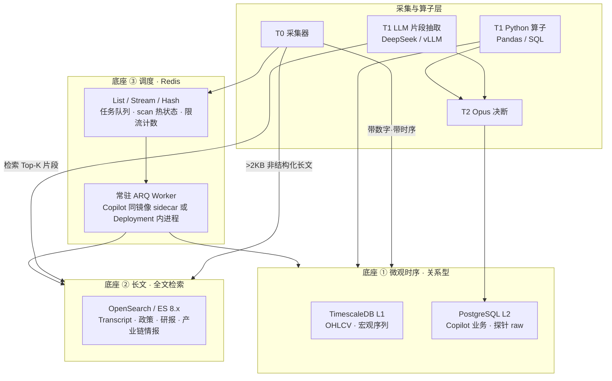
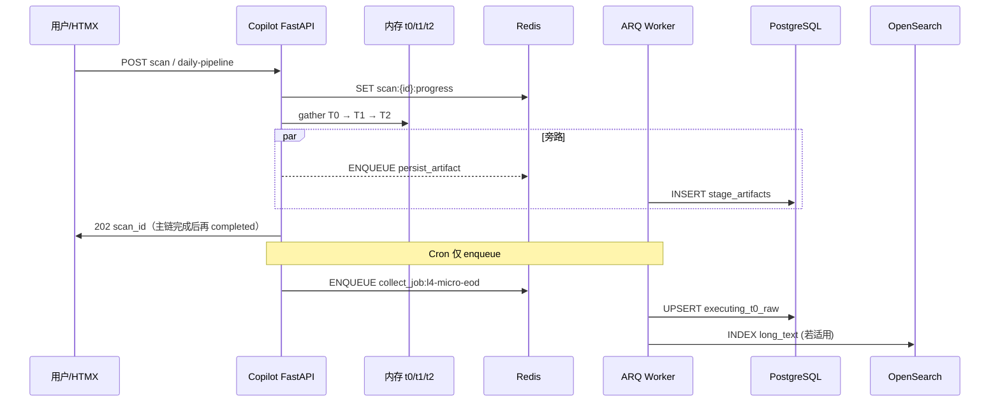
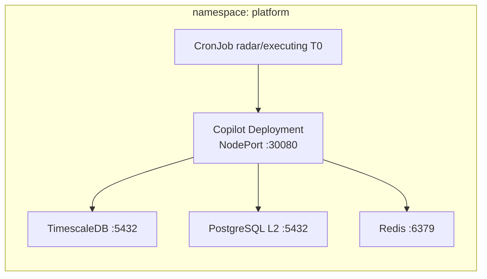
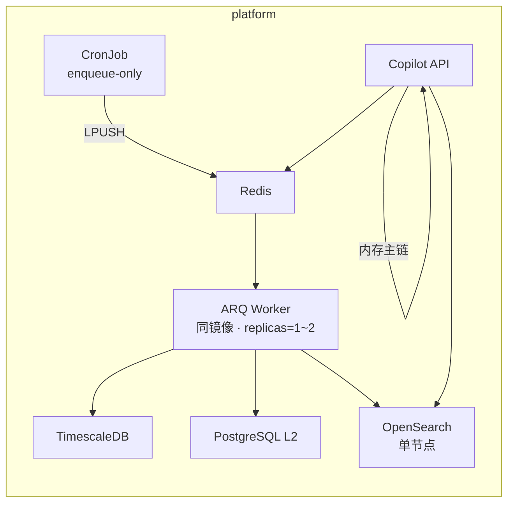

# 29 · 三大数据底座与任务调度架构契约（L3 · 投研生产线基础设施）

> **一句话**：把买方投研流水线的存储与调度拆成**三个各就各位的底座**——**微观时序 → 关系型库（TimescaleDB / PostgreSQL）**、**宏观/中观长文 → 全文检索集群（OpenSearch / Elasticsearch）**、**任务编排 → Redis 内存队列 + 常驻 Worker（ARQ 优先 / Celery 备选）**；**T0→T1→T2 交互主链**仍遵守 [27_](./27_行情雷达全链路架构设计优化.md) 的**内存直传 + 旁路落库**，队列只承担**采集、索引、审计、重试**等后台职责。
>
> **文档定位**：Cursor 重构代码的**终极架构说明书**——界定「什么数据进哪个库」「什么任务走哪条队列」「与现有 K3s / Helm 如何衔接」；**不替代** [25_](./25_四区漏斗_三段流水线_架构脊柱_设计.md) 漏斗语义、[27_](./27_行情雷达全链路架构设计优化.md) 雷达工程细节、[28_](./28_执行中工作区_标的深度监控_T0-T2开发计划.md) 执行区 25 探针清单。

> [!NOTE] **[TRACEBACK] 战略追溯锚点**
> - **L1**：[06_投资哲学体系总纲](../../01_顶层概念/06_投资哲学体系总纲.md)（②多源验证 / ⑧归因闭环）
> - **L2**：[06_标的深度分析与阶段判定实践规划](../../02_战略维度/06_跨维度协作/06_标的深度分析与阶段判定实践规划.md)
> - **架构脊柱**：[25_四区漏斗_三段流水线_架构脊柱_设计](./25_四区漏斗_三段流水线_架构脊柱_设计.md)
> - **内存主链先例**：[27_行情雷达全链路架构设计优化](./27_行情雷达全链路架构设计优化.md) · [28_执行中 T0-T2](./28_执行中工作区_标的深度监控_T0-T2开发计划.md)
> - **行情与降级**：[21_行情数据源降级与断路器规约](./21_行情数据源降级与断路器规约.md)
> - **事实门控**：[22_事实交叉验证与防幻觉规约](./22_事实交叉验证与防幻觉规约.md)
> - **长文采集动脉**：[18_动态采集流水线规约](./18_动态采集流水线规约.md)
> - **AI 调度**：[19_异构AI调度栈规约](./19_异构AI调度栈规约.md)
> - **平台拓扑**：[16_阿里云ECS_K3s_ACR_Helm部署与deploy-engine链路](./16_阿里云ECS_K3s_ACR_Helm部署与deploy-engine链路.md) · [共享平台基础 01_平台拓扑设计](../共享平台基础/stages/stage_1_启动期/01_平台拓扑设计.md)
> - **DNA**：[`global_const.yaml#tech_stack`](../_System_DNA/global_const.yaml) · [`dna_shared_platform_baseline.yaml`](../_System_DNA/shared/dna_shared_platform_baseline.yaml)
> - **代码仓（主战场）**：`diting-src/apps/copilot/modules/{radar,executing}/` · `diting-infra/config/diting-prod.yaml`
> - **L5 锚点**：`l5-shared-platform-three-tier-storage-v1`（本文 §9 验收通过后更新 [02_验收标准](../../05_成功标识与验证/02_验收标准.md)）

---

## §0 本文档管什么 / 不管什么

| 管 | 不管 |
|---|---|
| 三类存储底座的**数据归属边界**与**读写契约** | 单个 probe 的业务公式（归 [28_](./28_执行中工作区_标的深度监控_T0-T2开发计划.md) / 各 step） |
| Redis 队列、Worker、Rate Limit、指数退避的**统一约定** | LLM Prompt 正文（归 19_ / 各 T2 模块） |
| 与**当前已部署** K3s 组件的映射（As-Is）与迁移路径（To-Be） | D5 ETL 训练管线细节（归 D5 step_01 + `dna_super_evo_etl_llm.yaml`） |
| T0→T1→T2 **主链 vs 旁路** 的调度分界 | Kafka topic 全量矩阵（归 [18_](./18_动态采集流水线规约.md) · Lighthouse 嗅探层） |
| 重构**三阶段迭代顺序**与最小验收命令 | 前端 IA / Tab 布局（归 04_ 前端文档） |

**永久红线**（继承 25_/27_/28_）：no-mock · no-auto-execute · 缺数据 = `error`/`null`+blocker · 主链 verdict **不**因旁路落库失败而回滚。

---

## §1 三大数据底座契约

### §1.1 总览



### §1.2 底座 ① · 微观时序 → 关系型数据库

**各就各位**：凡满足以下**任一**条件的数据，**必须**走关系型库（+ Pandas/SQL 硬算），**禁止**整段塞入 ES 或 LLM 上下文：

| 特征 | 示例（雷达 17 项 / 执行 25 探针） | 存储 |
|---|---|---|
| 数值序列、可聚合 | 250 日 OHLCV、沪铜、USD/CNY、GPU ETF 份额 | L1 TimescaleDB 或 L2 时序表 |
| 毫秒～秒级硬算特征 | ATR×倍数动态止盈、10 日量价比、换手加速度、Beta | L2 `executing_t0_raw` / `radar_t0_*` + 内存计算 |
| 结构化财务指标 | 毛利率、存货周转、关联交易占比 | L2 PG 列或 JSONB（**有 schema**） |
| 水位 / 审计 / 业务真值 | watermark、持仓 CRUD、StageArtifact、`executing_daily_audits` | L2 `diting_copilot` |
| 短文本结构化抽取结果 | DeepSeek 从纪要抽出的 **≤512 字** JSON 字段 | L2 PG（**原文**仍进 ES） |

**生产 As-Is（香港 K3s · `platform` 命名空间）**

| 实例 | 集群内 DNS | 集群外 NodePort | 用途 |
|---|---|---|---|
| **TimescaleDB L1** | `timescaledb-primary.platform.svc.cluster.local:5432` | `:30001` | 全局 OHLCV、ingest 历史 K 线 |
| **PostgreSQL L2** | `postgresql-l2.platform.svc.cluster.local:5432` | `:30002` | 库 `diting_l2` + **`diting_copilot`**（Copilot ORM） |
| **文件缓存** | PVC `diting-radar-t0-cache` | — | Parquet/JSON 大列（250 日 bars · 24h TTL） |

连接串真相源：`diting-infra/prod.conn`（`TIMESCALE_DSN` / `PG_L2_DSN`）；Chart 值：`diting-infra/config/diting-prod.yaml` → `stack.databases.*`。

**QMT 本地桥**：**不纳入**生产路径（[28_ §2.1](./28_执行中工作区_标的深度监控_T0-T2开发计划.md)）；微观行情在 **香港 Pod 内 HTTP 三源**（[21_](./21_行情数据源降级与断路器规约.md)）+ L1/L2 自算。

### §1.3 底座 ② · 宏观/中观长文 → OpenSearch / Elasticsearch

**各就各位**：凡满足以下**任一**条件的数据，**必须**进全文检索集群；T1 算子**禁止**把全文直接丢给 T2/Opus：

| 类型 | 示例 | 索引策略 |
|---|---|---|
| 财报电话会实录 | NVDA / MSFT / GOOG / AMZN Transcript | 按 `symbol` + `fiscal_period` 分片 |
| 产业链情报 | 台湾《电子时报》CoWoS/GB200 专题 | 按 `theme` + `published_at` |
| 政策红头 | 国务院 / 工信部 / 海关总署 | 按 `doc_type` + `effective_date` |
| 卖方深度研报 | 30 页 PDF 提取正文 | 按 `broker` + `symbol` |
| 竞品纪要长文 | 广达 / 中际旭创 季度说明会 | 按 `peer_symbol` + `period` |

**检索 → T1 片段契约**

```
用户/探针查询: ("GB200" AND "良率" AND "漏水") OR (peer:2317.TW AND theme:cowos)
  → BM25 Top-N（默认 N=5）
  → 可选 dense_vector rerank（与 global_const#vector_store_candidate 对齐）
  → 拼接 ≤1000 汉字 fact_snippets[] 注入 T1 feature_node
  → T2 只读 T1 矩阵，不读 ES 原文
```

**生产 As-Is**：**尚未部署**。DNA `global_const#tech_stack.search = opensearch`；D5 `dna_super_evo_etl_llm.yaml` 预留 `SUPER_EVO_ES_URL`。Copilot 雷达/执行区 **当前** 长文暂落 PG `TEXT` / 外链 URL（过渡态，见 §4）。

**To-Be 部署约束**

| 项 | 规约 |
|---|---|
| **Chart 归属** | `diting-infra/charts/diting-stack` 增 `opensearch` 子 Chart 或 Bitnami OpenSearch values；**禁止**在 `diting-core` 放 compose |
| **持久化** | 与 L1/L2 同 ESSD 数据盘 hostPath 子路径 `opensearch/` · `Retain` |
| **资源档位** | 启动期 **单节点** `512Mi–1Gi` heap；索引总量 >50GB 再扩数据节点 |
| **命名** | 环境变量统一 `OPENSEARCH_URL`（兼容别名 `ES_URL` / `ELASTICSEARCH_URL` 只读映射） |
| **与 D5 关系** | D5 ETL 写入索引；Copilot **只读**检索；写索引走异步 Worker 队列 |

### §1.4 底座 ③ · 任务调度 → Redis + 常驻 Worker

**各就各位**

| 职责 | 机制 | **禁止** |
|---|---|---|
| 交互式 scan 热状态 | Redis String/Hash · TTL | 用 DB 轮询代替进度条 |
| T0→T1→T2 **段间数据** | **进程内内存 dict**（asyncio） | 段间 `await save()` 再 `SELECT` 唤醒下一段 |
| 定时采集触发 | K8s CronJob **仅负责 enqueue** | 每标的起一个 Job Pod |
| 爬虫 / 海关 / TWSE / 巨潮 | ARQ task + rate_limit + 指数退避 | 主线程同步 `requests` 循环 |
| 旁路 StageArtifact / ES bulk index | ARQ `persist_*` 低优先级队列 | 阻塞 `mark_scan_completed` |
| 跨服务事件（D4 等） | Redis Stream（既有） | 与 ARQ 混用同一 DB index 时不硬编码 key |

**生产 As-Is**

| 组件 | 现状 | 本文目标 |
|---|---|---|
| **Redis** | Bitnami · `redis-master.platform.svc:6379` · NodePort `:30379` · PVC Retain | 保持不变，扩展队列命名空间 |
| **CronJob** | `radarT0Jobs` / `executingT0Jobs` · Copilot 镜像 `python -m apps.copilot.jobs.*` | Cron **改 enqueue**；Worker 消费 |
| **进程内调度** | Copilot `AsyncIOScheduler`（报表/ledger） | 与 ARQ 并存；**不**迁移交互主链 |
| **Redis Stream** | `exit_engine` health/timer · `copilot` events | 保留；新任务优先 ARQ List |
| **ARQ / Celery** | **未部署** | **Phase 1 引入 ARQ**（async-native · 与 FastAPI 同栈） |

**框架选型（项目裁决）**

| 框架 | 适用 | 不选原因 |
|---|---|---|
| **ARQ（默认）** | Copilot 内 async 采集、旁路落库、ES bulk | 与 asyncio 主链同进程友好；依赖轻 |
| **Celery（备选）** | 18_ Lighthouse Playwright 重进程池、D5 训练触发 | sync 为主；独立 worker 镜像时再引入 |
| **K8s Job 一次性** | bootstrap、schema-init、ingest-deploy | 保留；**不**用于高频 per-symbol 采集 |

---

## §2 主链 vs 旁路 vs 队列：调度分界（与 27_ 对齐）

> [!IMPORTANT] **关键澄清**
> 本文**不是**用 Celery 把 T0→T1→T2 改回「落库唤醒」批处理；而是：
> - **主链**：27_/28_ 已规定的 **内存直传**（`t0_data → build_fact_matrix → call_opus`）；
> - **队列**：接管 **Cron 触发的采集**、**易封禁 HTTP**、**旁路 persist**、**ES 索引**。



| 路径 | 同步/异步 | 失败策略 |
|---|---|---|
| `run_radar_pipeline` / `run_daily_pipeline` 主链 | 同步 await T2 | T2 失败 → scan `error`；T0/T1 内存可重试 |
| `save_artifact` / `save_t0_batch` 旁路 | ARQ 异步 | 3 次指数退避；仍失败 → `write_failed` 指标 |
| `collect_job:*` 采集 | ARQ + rate_limit | 5s→20s→60s 退避；入 DLQ 后 UI stale |
| ES `index_document` | ARQ 低优先级 | 不阻塞 PG 写入成功 |

---

## §3 数据路由决策树（开发自检）

```
新字段/新探针
  ├─ 是否纯数值或可 SQL/Pandas 聚合？
  │    └─ 是 → PostgreSQL/TimescaleDB（§1.2）
  ├─ 是否 >2KB 非结构化中文/英文长文？
  │    └─ 是 → OpenSearch 存全文 + PG 存 doc_id 指针与抽取 JSON
  ├─ T1 是否需要语义理解？
  │    ├─ 否 → Python 算子（L4_KEYS）
  │    └─ 是 → ES 检索 Top-K → DeepSeek 抽 feature_node（≤512 字）
  └─ 采集是否易触发反爬/高延迟？
       └─ 是 → ARQ 队列 + rate_limit（§1.4）
```

### §3.1 执行区 25 探针 · 存储分层（601138 首版）

| 层 | probe_key 示例 | 底座 | T1 引擎 |
|---|---|---|---|
| **L4 微观** | `qmt_atr_trailing`, `volume_price_div`, `level2_super_order`, `turnover_accel` | PG + Redis 现价 | **Python L4**（Phase 1 优先） |
| **L3 结构化** | `gb200_iteration_node`, 财报四键, `retail_concentration` | PG JSONB | Python + 可选 DeepSeek |
| **L3 长文** | `tsmc_cowos_capacity`, `cloud_capex_consensus`, `smci_quanta_share` | **ES 全文** + PG 指标 | ES 检索 → DeepSeek 抽取 |
| **L2 宏观序列** | `nvda_gpu_leadtime`, `etf_redemption_impact` | PG / L1 | Python |
| **L1 公告** | 巨潮短公告 | PG；超长按 §1.3 双写 ES | DeepSeek 若 >1KB |

### §3.2 雷达 17 项 T0 · 存储分层（摘要）

| T0 域 | 代表项 | 底座 |
|---|---|---|
| 盘面/量价 | T0-8 250 日 OHLCV | L1 + Parquet 缓存 PVC |
| 财务/估值 | T0-5/6/7 | PG |
| 产业长文 | T0-4/T0-17 非结构化 | ES（To-Be）+ PG 过渡 |
| 宏观情绪 | T0-1 全市场 | Redis `radar:sentiment:intraday`（已有） |

---

## §4 Redis 队列与 Key 命名契约

### §4.1 队列（ARQ `Queue` 名）

| 队列名 | 优先级 | 任务类型 | rate_limit |
|---|---|---|---|
| `copilot:q:interactive` | 高 | 用户触发的 collect-once 补采 | 10/min per symbol |
| `copilot:q:crawl` | 中 | 海关/TWSE/巨潮/SEC | **1 req/2s per host** |
| `copilot:q:persist` | 低 | artifact / audit / watermark | 不限 |
| `copilot:q:search_index` | 低 | ES bulk index | 5 bulk/s |

### §4.2 热状态 Key（与现有兼容）

| Key 模式 | TTL | 用途 | 现状 |
|---|---|---|---|
| `radar:scan:{scan_id}:progress` | 24h | HTMX 进度 | 已有类似 |
| `radar:sentiment:intraday` | 5min | T0-1 宏观 | 已有 |
| `executing:quote:{symbol}` | 5min | 执行区现价 | [28_ §3.4](./28_执行中工作区_标的深度监控_T0-T2开发计划.md) |
| `executing:pipeline:{run_id}` | 24h | daily-pipeline 状态 | 待建 |
| `dlq:copilot:{queue}:{task_id}` | 7d | 死信 | 待建 |

### §4.3 环境变量（diting-src · Copilot）

```text
# 已有
REDIS_URL=redis://redis-master.platform.svc.cluster.local:6379/0
TIMESCALE_DSN=postgresql://...
PG_L2_DSN=postgresql://.../diting_copilot   # 或 ORM DATABASE_URL

# 本文新增（To-Be）
OPENSEARCH_URL=http://opensearch.platform.svc.cluster.local:9200
ARQ_REDIS_URL=redis://redis-master.platform.svc.cluster.local:6379/1
ARQ_MAX_JOBS=8
ARQ_RETRY_BACKOFF=5,20,60
```

Redis DB 划分：`/0` 热状态与 Stream；`/1` ARQ 任务（**禁止**与 exit_engine DB 混用，见 `EXIT_REDIS_URL`）。

---

## §5 OpenSearch 索引契约（To-Be · 最小可用）

### §5.1 索引命名

`diting-docs-{env}-v1`（alias `diting-docs-active`）；按 `doc_type` 路由：

| doc_type | 必填字段 | 分词 |
|---|---|---|
| `earnings_transcript` | `symbol`, `fiscal_period`, `published_at`, `body` | ik_max_word + english |
| `industry_news` | `theme`, `region`, `published_at`, `body`, `source` | ik_max_word |
| `policy` | `agency`, `effective_date`, `title`, `body` | ik_smart |
| `research_report` | `broker`, `symbol`, `rating`, `body` | ik_max_word |

### §5.2 检索 API（Copilot 内部）

```python
# apps/copilot/services/search/doc_retriever.py（规划路径）
async def retrieve_fact_snippets(
    query: str,
    *,
    filters: dict[str, str],
    max_chars: int = 1000,
    top_k: int = 5,
) -> list[dict]: ...
```

返回：`[{doc_id, score, snippet, source, published_at}]` — **仅**此列表可进入 T1/T2。

---

## §6 与现有 K8s 部署的衔接

### §6.1 As-Is 拓扑（2026-06 · 生产）



### §6.2 To-Be 拓扑（Phase 2 完成后）



**Helm 变更原则**（遵守系统规则）：

1. 组件开关与副本数写在 `diting-infra/config/diting-prod.yaml` / values；**禁止** Makefile 写死。
2. Compose 仅用于 `diting-infra/compose/` 本地联调；**禁止** `diting-core` 内放 compose。
3. OpenSearch Chart 与 Redis 一样走 **existingClaim + Retain PV**。

---

## §7 工程迭代顺序（敏捷三阶段）

与当前持仓（601138 +38%、新易盛 +29%）对齐的**最安全重构序**：

### Phase 1 · L4 Python 算子 + Redis 队列护利润（**当前 sprint**）

| 交付 | 路径 | 验收 |
|---|---|---|
| L4 算子库 | `apps/copilot/modules/shared/l4/` 或 `executing/l4/` | ATR 跟踪止盈、Level-2 主力背离、换手加速度 **单元测试** |
| ARQ 骨架 | `apps/copilot/workers/arq_worker.py` | Worker 启动 + 消费 smoke task |
| Cron → enqueue | `jobs/executing_t0/*`  refactor | CronJob 日志见 enqueue；Worker 写 PG |
| 利润相关探针 | #15–18, #25 | `make executing-daily-status` 无 stale blocker |

**不做**：ES 集群、T2 Rotation Prompt 大改。

### Phase 2 · ES 筑巢 + 长文接入

| 交付 | 验收 |
|---|---|
| Helm 部署 OpenSearch | `curl OPENSEARCH_URL/_cluster/health` green/yellow |
| 海关出口 / 四云 Capex 入库 | 索引 ≥1 文档；检索 `GB200` 有 hit |
| 探针 #2/#4/#5 改 ES→T1 | T1 `fact_snippet` 字段有 `doc_id` 溯源 |
| 异步 index Worker | bulk 失败不阻塞 PG watermark |

### Phase 3 · 同业 Rotation 与对冲 T2

| 交付 | 验收 |
|---|---|
| T2 Prompt：601138↔2317.TW、300502↔300308 | Opus 输出 `rotation_hint` + `hedge_rationale` |
| ES 同业纪要并行检索 | 单次 T2 输入 token < 8K（较全文降 ≥80%） |
| [22_](./22_事实交叉验证与防幻觉规约.md) 门控 | rotation 断言带 `evidence[]` + `independence_score` |

---

## §8 代码模块映射（Ref 注释目标）

| 模块 | 职责 | 底座 |
|---|---|---|
| `modules/radar/pipeline.py` | 雷达内存主链 | MEM + 旁路 PG |
| `modules/executing/orchestrator.py` | 执行 daily-pipeline | MEM + PG |
| `modules/executing/t1_build.py` | 25×feature_node | PG raw → 内存 |
| `modules/shared/l4/`（新建） | ATR/量比/换手/Beta | PG + Pandas |
| `services/search/doc_retriever.py`（新建） | ES 检索 | OpenSearch |
| `workers/arq_worker.py`（新建） | 队列消费 | Redis |
| `jobs/radar_t0/` · `jobs/executing_t0/` | Cron enqueue | Redis → Worker |

所有新建文件注释须含：`[Ref: 29_]` + 相关 28_/27_ 节号。

---

## §9 可执行验证清单

> **工作目录**：`diting-infra`（集群）· `diting-src`（代码/单测）

| # | 命令 / 检查 | 期望 | 阶段 |
|---|---|---|---|
| 1 | `kubectl -n platform get pods -l app.kubernetes.io/name=redis,postgresql,timescale` | Running | As-Is |
| 2 | `redis-cli -u $REDIS_URL PING` | `PONG` | As-Is |
| 3 | `psql $PG_L2_DSN -c "SELECT 1"` | 成功 | As-Is |
| 4 | Copilot NodePort `/health` | 200 | As-Is |
| 5 | `pytest apps/copilot/modules/executing/ -q -k atr` | 通过 | Phase 1 |
| 6 | `python -m apps.copilot.workers.arq_worker --check` | 连接 Redis /1 | Phase 1 |
| 7 | `curl -s $OPENSEARCH_URL/_cluster/health` | yellow+ | Phase 2 |
| 8 | `make executing-daily-status`（diting-infra） | 25 探针 stale 清单可读 | Phase 1–3 |

---

## §10 与其他规约的边界

| 规约 | 关系 |
|---|---|
| **25_** | 漏斗 + StageArtifact 语义；本文落实其**存储与调度物理层** |
| **27_** | 雷达内存主链 **不可被队列化打断**；本文补全 Cron/采集/ES |
| **28_** | 25 探针清单与 cadence **不变**；本文规定每探针进哪座库 |
| **18_** | Lighthouse Kafka 嗅探 **保留**；长文最终 **镜像**进 OpenSearch 供 Copilot 读 |
| **21_** | 行情三源仍在 Pod 内 HTTP；结果进 L1/L2，**不**进 ES |
| **19_** | T2 模型路由不变；T1 DeepSeek 调用次数因 ES 检索 **下降** |

---

## §11 违反检测

| 反模式 | 检测 |
|---|---|
| 250 日 K 线塞 Opus Prompt | T2 输入 token 监控 >20K 告警 |
| T0 全文塞 DeepSeek | T1 单探针输入 >4K chars 告警 |
| CronJob 每 symbol 起 Pod | `kubectl get jobs --watch` 爆量 |
| 段间 DB 唤醒主链 | `pipeline.py` 代码审查：段间无 `await save_*` 阻塞 |
| ES 当业务 SoT | 持仓/成本/verdict **仅** PG；ES 仅文档 |

---

## §12 修订记录

| 日期 | 版本 | 说明 |
|---|---|---|
| 2026-06-05 | v1.0 | 首版：三大底座边界 + Redis/ARQ 调度 + As-Is 生产映射 + 三阶段迭代 + 与 25/27/28 对齐 |

---

## 一致性检查表（§7.5）

| 项 | 状态 |
|---|---|
| TRACEBACK 锚点 | ✅ |
| 与 25_/27_/28_ 无冲突 | ✅（主链内存 + 队列旁路） |
| As-Is 引用 `diting-prod.yaml` / `prod.conn` | ✅ |
| 部署归属 diting-infra | ✅ |
| 可执行验证命令 | ✅ §9 |
| DNA `tech_stack.search=opensearch` 对齐 | ✅ |
| L5 锚点待 Phase 1 通过后反写 | ⏳ |
