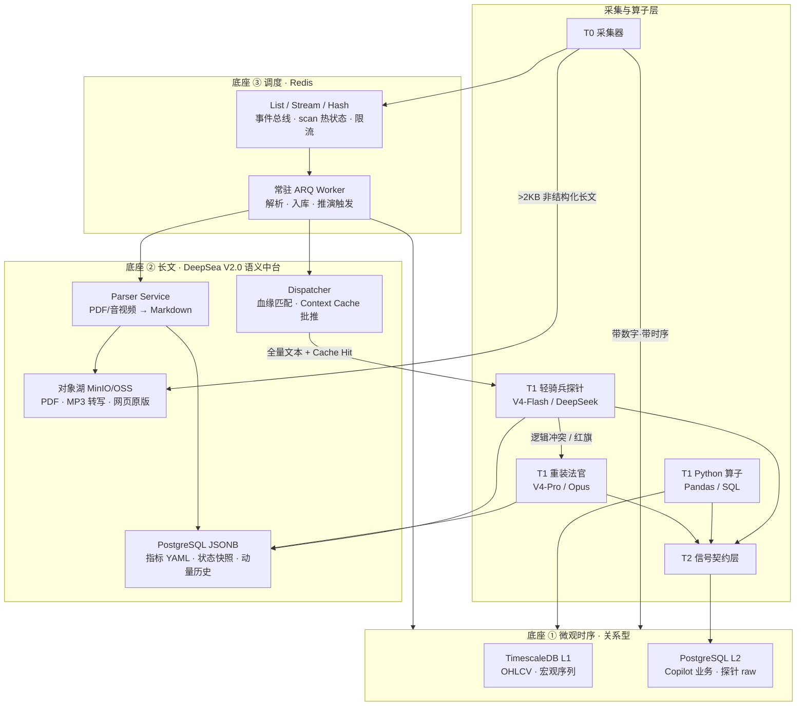
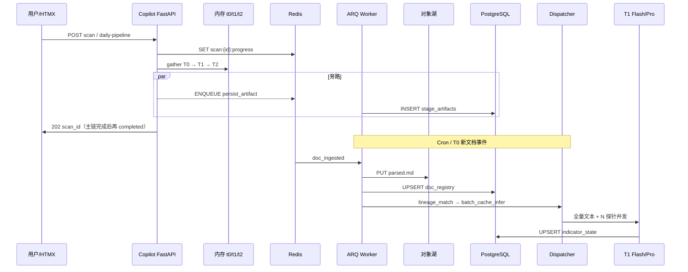
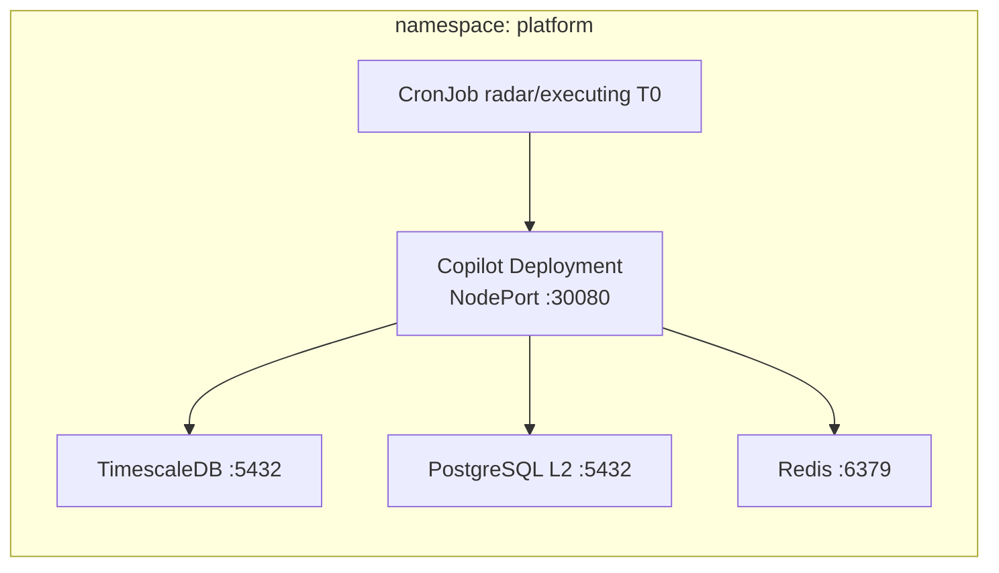
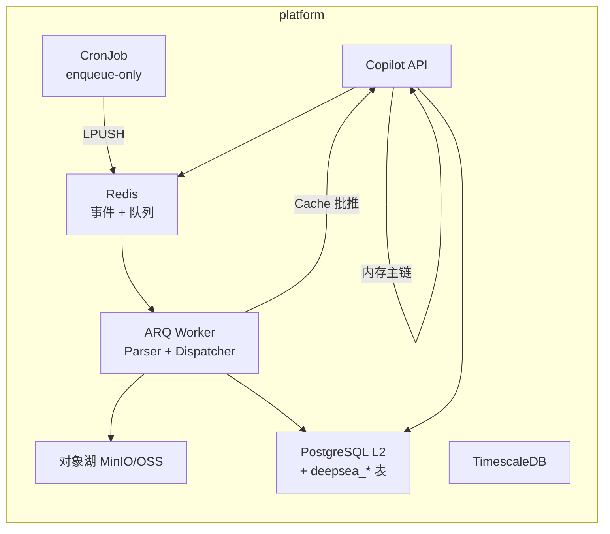

# 29 · 三大数据底座与任务调度架构契约（L3 · 投研生产线基础设施）

> **一句话**：把买方投研流水线的存储与调度拆成**三个各就各位的底座**——**微观时序 → 关系型库（TimescaleDB / PostgreSQL）**、**宏观/中观长文 → 深海 DeepSea V2.0 语义量化中台（对象湖 + PG 状态机 + 超大上下文推理）**、**任务编排 → Redis 事件总线 + 常驻 Worker（ARQ 优先 / Celery 备选）**；**T0→T1→T2 交互主链**仍遵守 [27_](./27_行情雷达全链路架构设计优化.md) 的**内存直传 + 旁路落库**，队列承担**采集、解析、Dispatcher 路由、状态快照、审计、重试**等后台职责。
>
> **文档定位**：Cursor 重构代码的**终极架构说明书**——界定「什么数据进哪个库」「什么任务走哪条队列」「长文语义如何不经切块 RAG 而全量推理」「与现有 K3s / Helm 如何衔接」；**不替代** [25_](./25_四区漏斗_三段流水线_架构脊柱_设计.md) 漏斗语义、[27_](./27_行情雷达全链路架构设计优化.md) 雷达工程细节、[28_](./28_执行中工作区_标的深度监控_T0-T2开发计划.md) 执行区 25 探针清单。

> [!NOTE] **[TRACEBACK] 战略追溯锚点**
> - **L1**：[06_投资哲学体系总纲](../../01_顶层概念/06_投资哲学体系总纲.md)（②多源验证 / ⑧归因闭环）
> - **L2**：[06_标的深度分析与阶段判定实践规划](../../02_战略维度/06_跨维度协作/06_标的深度分析与阶段判定实践规划.md)
> - **架构脊柱**：[25_四区漏斗_三段流水线_架构脊柱_设计](./25_四区漏斗_三段流水线_架构脊柱_设计.md)
> - **内存主链先例**：[27_行情雷达全链路架构设计优化](./27_行情雷达全链路架构设计优化.md) · [28_执行中 T0-T2](./28_执行中工作区_标的深度监控_T0-T2开发计划.md)
> - **行情与降级**：[21_行情数据源降级与断路器规约](./21_行情数据源降级与断路器规约.md)
> - **事实门控**：[22_事实交叉验证与防幻觉规约](./22_事实交叉验证与防幻觉规约.md)
> - **长文采集动脉**：[18_动态采集流水线规约](./18_动态采集流水线规约.md)
> - **AI 调度**：[19_异构AI调度栈规约](./19_异构AI调度栈规约.md)
> - **平台拓扑**：[16_阿里云ECS_K3s_ACR_Helm部署与deploy-engine链路](./16_阿里云ECS_K3s_ACR_Helm部署与deploy-engine链路.md) · [共享平台基础 01_平台拓扑设计](../共享平台基础/stages/stage_1_启动期/01_平台拓扑设计.md)
> - **DNA**：[`global_const.yaml#tech_stack`](../_System_DNA/global_const.yaml) · [`dna_shared_platform_baseline.yaml`](../_System_DNA/shared/dna_shared_platform_baseline.yaml)
> - **代码仓（主战场）**：`diting-src/apps/copilot/modules/{radar,executing}/` · `diting-infra/config/diting-prod.yaml`
> - **L5 锚点**：`l5-shared-platform-three-tier-storage-v1`（本文 §9 验收通过后更新 [02_验收标准](../../05_成功标识与验证/02_验收标准.md)）

---

## §0 本文档管什么 / 不管什么

| 管 | 不管 |
|---|---|
| 三类存储底座的**数据归属边界**与**读写契约** | 单个 probe 的业务公式（归 [28_](./28_执行中工作区_标的深度监控_T0-T2开发计划.md) / 各 step） |
| DeepSea Dispatcher **血缘匹配**与**批处理缓存并发** | LLM Prompt 正文（归 19_ / 各 T2 模块） |
| Redis 队列、Worker、Rate Limit、指数退避的**统一约定** | D5 ETL 训练管线细节（归 D5 step_01 + `dna_super_evo_etl_llm.yaml`） |
| 与**当前已部署** K3s 组件的映射（As-Is）与迁移路径（To-Be） | 前端 IA / Tab 布局（归 04_ 前端文档） |
| T0→T1→T2 **主链 vs 旁路** 的调度分界 | Kafka topic 全量矩阵（归 [18_](./18_动态采集流水线规约.md) · Lighthouse 嗅探层） |
| 重构**四阶段迭代顺序**（DeepSea Phase 1–4）与最小验收命令 | 极寒/态势 pillar 独立审计检索（仍可用 OpenSearch，见 §10） |

**永久红线**（继承 25_/27_/28_）：no-mock · no-auto-execute · 缺数据 = `error`/`null`+blocker · 主链 verdict **不**因旁路落库失败而回滚。

**架构裁决（v2.0 · 2026-06）**：Copilot **长文语义理解主链**彻底废弃 **切块 RAG / BM25 Top-K / ES 切片检索**；改为 **全文入湖 → Parser 纯文本 → Dispatcher 缓存批推 → T1 概念探针 → PG 状态机 + 动量记忆 → T2 契约输出**。

---

## §1 三大数据底座契约

### §1.1 总览



### §1.2 底座 ① · 微观时序 → 关系型数据库

**各就各位**：凡满足以下**任一**条件的数据，**必须**走关系型库（+ Pandas/SQL 硬算），**禁止**整段塞入对象湖 Prompt 或 LLM 上下文：

| 特征 | 示例（雷达 17 项 / 执行 25 探针） | 存储 |
|---|---|---|
| 数值序列、可聚合 | 250 日 OHLCV、沪铜、USD/CNY、GPU ETF 份额 | L1 TimescaleDB 或 L2 时序表 |
| 毫秒～秒级硬算特征 | ATR×倍数动态止盈、10 日量价比、换手加速度、Beta | L2 `executing_t0_raw` / `radar_t0_*` + 内存计算 |
| 结构化财务指标 | 毛利率、存货周转、关联交易占比 | L2 PG 列或 JSONB（**有 schema**） |
| 水位 / 审计 / 业务真值 | watermark、持仓 CRUD、StageArtifact、`executing_daily_audits` | L2 `diting_copilot` |
| T1 状态机输出（短 JSON） | `signal_status`、`momentum_delta`、≤512 字 `evidence_quote` | L2 PG JSONB（**原文**在对象湖） |

**生产 As-Is（香港 K3s · `platform` 命名空间）**

| 实例 | 集群内 DNS | 集群外 NodePort | 用途 |
|---|---|---|---|
| **TimescaleDB L1** | `timescaledb-primary.platform.svc.cluster.local:5432` | `:30001` | 全局 OHLCV、ingest 历史 K 线 |
| **PostgreSQL L2** | `postgresql-l2.platform.svc.cluster.local:5432` | `:30002` | 库 `diting_l2` + **`diting_copilot`**（Copilot ORM） |
| **文件缓存** | PVC `diting-radar-t0-cache` | — | Parquet/JSON 大列（250 日 bars · 24h TTL） |

连接串真相源：`diting-infra/prod.conn`（`TIMESCALE_DSN` / `PG_L2_DSN`）；Chart 值：`diting-infra/config/diting-prod.yaml` → `stack.databases.*`。

**QMT 本地桥**：**不纳入**生产路径（[28_ §2.1](./28_执行中工作区_标的深度监控_T0-T2开发计划.md)）；微观行情在 **香港 Pod 内 HTTP 三源**（[21_](./21_行情数据源降级与断路器规约.md)）+ L1/L2 自算。

### §1.3 底座 ② · 宏观/中观长文 → DeepSea V2.0 语义量化中台

**各就各位**：凡满足以下**任一**条件的数据，**必须**走 DeepSea 四层栈；**禁止**切块入库 ES、**禁止** BM25 Top-K 片段拼接进 T1/T2：

| 类型 | 示例 | 存储与处理 |
|---|---|---|
| 财报电话会实录 | NVDA / 601138 半年报说明会 | 对象湖存原版 + PG `doc_registry` 指针 |
| 产业链情报 | 台湾《电子时报》CoWoS/GB200 专题 | 对象湖 + `theme` 血缘标签 |
| 政策红头 | 国务院 / 工信部 / 海关总署 | 对象湖 + `effective_date` 元数据 |
| 卖方深度研报 | 30 页 PDF 提取正文 | Parser → Markdown 全量文本入湖 |
| 竞品纪要长文 | 广达 / 中际旭创 季度说明会 | 对象湖；指标 YAML 定义状态机节点 |

#### §1.3.1 T0 Sensor Layer（基础设施）

| 组件 | 职责 | 规约 |
|---|---|---|
| **对象湖** | 存原版 PDF、MP3 转写、网页快照 | S3 兼容（`global_const#data_store_object`）；K3s 可过渡 PVC `diting-docs/` 再迁 MinIO |
| **Parser Service** | 毫秒级 PDF/音视频 → Markdown 纯文本 | ARQ 异步；输出写对象湖 `parsed/{doc_id}.md` |
| **PG JSONB 配置中心** | 全市场指标 YAML 字典、`probe_key` ↔ `doc_lineage` 映射 | 表 `deepsea_indicator_config`；研究员无代码增指标 |
| **PG 状态快照** | 每次 T1 输出的 `signal_status` JSON | 表 `deepsea_indicator_state`；供动量比对 |
| **事件总线** | T0 新文档入库 → 非阻塞调度 | Redis Stream / ARQ；可选 Kafka 镜像（18_ Lighthouse） |

#### §1.3.2 Dispatcher Layer（智能调度与路由 · 核心升级）

彻底解耦「数据采集」与「模型推演」，按**成本最优**批处理：

```
T0 新文档事件（如《工业富联 2026 半年报》）
  → 血缘匹配 (Lineage Mapping)：扫描指标库，命中 fii_gb200_yield、fii_odm_ratio 等 N 个 probe
  → 动态打包：
       N=1 低频指标 → 文本 + Prompt 一次性推理
       N>1 同频指标 → 群发推演 (Batch Inference)
         ① 全文静默推入 Provider Context Cache（DeepSeek / 兼容 1M 窗口模型）
         ② 并发 N 个「概念探针」查询，榨取 Cache Hit 价格红利
  → 旁路 enqueue；不阻塞交互主链
```

**禁止**：无差别全局扫描全库指标；无血缘匹配的「每文档 × 全指标」笛卡尔积。

#### §1.3.3 T1 Inference Layer（多模态推理）

| 角色 | 模型档（对齐 19_） | 触发条件 |
|---|---|---|
| **轻骑兵探针** | V4-Flash / DeepSeek 快速档 | 默认；对缓存内超长文本并发下发「隐性概念探针」（如不良率、直通率、量产节点） |
| **重装法官** | V4-Pro / Opus | 轻骑兵证据逻辑冲突；或核心「防守红旗指标」命中 |

**推理输入契约**：单篇公告/纪要 **全量 Markdown** 装入超大上下文（目标 ≥128K token，向 1M 窗口演进）；**零切块、零关键词切片**。

**泛化防置换**：无硬数字支撑的指标必须绑定 **状态机节点** + **T0 影子指标倒推**（如「是否跃迁至 MP 量产阶段」→ 布尔 + 证据句）。

#### §1.3.4 T2 Contract Layer（信号契约）

推演完毕，向策略/执行端暴露标准化 JSON 流；每条强制字段：

| 字段 | 含义 | 约束 |
|---|---|---|
| `signal_status` | 状态机当前节点 | 枚举来自指标 YAML |
| `evidence_quote` | 官方原句精准引用 | **禁止**无出处断言；对齐 [22_](./22_事实交叉验证与防幻觉规约.md) |
| `momentum_delta` | 对比 `deepsea_indicator_state` 前值的边际变化 | `accelerating` / `stalled` / `reversed` / `unknown` |
| `doc_id` | 对象湖文档指针 | 可审计回溯 |
| `inferred_at` | ISO8601 时间戳 | 与 watermark 对齐 |

**动量时序记忆（Momentum Tracker）**：T1 每次输出**必须** UPSERT 状态表；后续 Prompt 自动注入前值比对。

#### §1.3.5 生产 As-Is / To-Be

**As-Is（2026-06）**：

| 项 | 现状 |
|---|---|
| 长文落点 | PG `TEXT` / 外链 URL（过渡态） |
| 对象湖 | PVC `diting-docs` 部分路径；无统一 `doc_registry` |
| Parser / Dispatcher | **未部署**；T1 部分探针仍内存拼原文 |
| ES / OpenSearch | **从未作为 Copilot 长文主链部署**；v1.0 规划已废止 |

**To-Be 部署约束**

| 项 | 规约 |
|---|---|
| **Chart 归属** | `diting-infra/charts/diting-stack` 增 `minio`（或对接云 OSS）子 Chart；Parser/Dispatcher 为 Copilot Worker 子模块或 sidecar Deployment |
| **持久化** | 对象湖与 L1/L2 同 ESSD 数据盘 hostPath 子路径 `object-lake/` · `Retain` |
| **环境变量** | `DEEPSEA_OBJECT_STORE_URL`、`DEEPSEA_DISPATCHER_ENABLED=true`；**禁止**新增 `OPENSEARCH_URL` 作为 Copilot 长文依赖 |
| **与 D5 关系** | D5 知识库可保留独立向量检索；Copilot 执行/雷达 **长文语义只读 DeepSea 契约**，不写 ES |

### §1.4 底座 ③ · 任务调度 → Redis + 常驻 Worker

**各就各位**

| 职责 | 机制 | **禁止** |
|---|---|---|
| 交互式 scan 热状态 | Redis String/Hash · TTL | 用 DB 轮询代替进度条 |
| T0→T1→T2 **段间数据** | **进程内内存 dict**（asyncio） | 段间 `await save()` 再 `SELECT` 唤醒下一段 |
| T0 文档入库事件 | Redis Stream `deepsea:doc:ingested` | 同步阻塞 Parser |
| 定时采集触发 | K8s CronJob **仅负责 enqueue** | 每标的起一个 Job Pod |
| 爬虫 / 海关 / TWSE / 巨潮 | ARQ task + rate_limit + 指数退避 | 主线程同步 `requests` 循环 |
| Dispatcher 批推 | ARQ `deepsea:dispatch` 高优先级 | 无血缘的全量扫描 |
| 旁路 StageArtifact / 状态快照 | ARQ `persist_*` 低优先级队列 | 阻塞 `mark_scan_completed` |
| 跨服务事件（D4 等） | Redis Stream（既有） | 与 ARQ 混用同一 DB index 时不硬编码 key |

**生产 As-Is**

| 组件 | 现状 | 本文目标 |
|---|---|---|
| **Redis** | Bitnami · `redis-master.platform.svc:6379` · NodePort `:30379` · PVC Retain | 扩展 DeepSea 事件流与队列 |
| **CronJob** | `radarT0Jobs` / `executingT0Jobs` · Copilot 镜像 `python -m apps.copilot.jobs.*` | Cron **改 enqueue**；Worker 消费 |
| **进程内调度** | Copilot `AsyncIOScheduler`（报表/ledger） | 与 ARQ 并存；**不**迁移交互主链 |
| **Redis Stream** | `exit_engine` health/timer · `copilot` events | 保留；新增 `deepsea:*` |
| **ARQ / Celery** | **未部署** | **DeepSea Phase 1 引入 ARQ** |

**框架选型（项目裁决）**

| 框架 | 适用 | 不选原因 |
|---|---|---|
| **ARQ（默认）** | Parser、Dispatcher、旁路落库、对象湖上传 | 与 asyncio 主链同进程友好 |
| **Celery（备选）** | 18_ Lighthouse Playwright 重进程池、D5 训练触发 | sync 为主；独立 worker 镜像时再引入 |
| **K8s Job 一次性** | bootstrap、schema-init、ingest-deploy | 保留；**不**用于高频 per-symbol 采集 |

---

## §2 主链 vs 旁路 vs 队列：调度分界（与 27_ 对齐）

> [!IMPORTANT] **关键澄清**
> 本文**不是**用队列把 T0→T1→T2 改回「落库唤醒」批处理；而是：
> - **主链**：27_/28_ 已规定的 **内存直传**（`t0_data → build_fact_matrix → call_opus`）；
> - **队列**：接管 **Cron 触发的采集**、**Parser/对象湖入库**、**Dispatcher 血缘批推**、**旁路 persist**、**状态快照**。



| 路径 | 同步/异步 | 失败策略 |
|---|---|---|
| `run_radar_pipeline` / `run_daily_pipeline` 主链 | 同步 await T2 | T2 失败 → scan `error`；T0/T1 内存可重试 |
| `save_artifact` / `save_t0_batch` 旁路 | ARQ 异步 | 3 次指数退避；仍失败 → `write_failed` 指标 |
| `collect_job:*` 采集 | ARQ + rate_limit | 5s→20s→60s 退避；入 DLQ 后 UI stale |
| `deepsea:parse` / `deepsea:dispatch` | ARQ 中优先级 | 解析失败 → DLQ；不阻塞 PG watermark |
| `deepsea:persist_state` | ARQ 低优先级 | 不阻塞主链 verdict |

---

## §3 数据路由决策树（开发自检）

```
新字段/新探针
  ├─ 是否纯数值或可 SQL/Pandas 聚合？
  │    └─ 是 → PostgreSQL/TimescaleDB（§1.2）
  ├─ 是否 >2KB 非结构化中文/英文长文？
  │    └─ 是 → 对象湖存全文 + PG doc_registry + Parser Markdown
  │         └─ 禁止 ES 切块 / BM25 Top-K
  ├─ T1 是否需要语义理解（隐性指标、状态机）？
  │    ├─ 否 → Python 算子（L4_KEYS）
  │    └─ 是 → Dispatcher 血缘匹配 → Context Cache 全量文本
  │         → Flash 概念探针 →（可选）Pro 复核 → PG 状态 + momentum_delta
  └─ 采集是否易触发反爬/高延迟？
       └─ 是 → ARQ 队列 + rate_limit（§1.4）
```

### §3.1 执行区 25 探针 · 存储分层（601138 首版）

| 层 | probe_key 示例 | 底座 | T1 引擎 |
|---|---|---|---|
| **L4 微观** | `qmt_atr_trailing`, `volume_price_div`, `level2_super_order`, `turnover_accel` | PG + Redis 现价 | **Python L4**（Phase 1 优先） |
| **L3 结构化** | `gb200_iteration_node`, 财报四键, `retail_concentration` | PG JSONB | Python + 可选 DeepSeek |
| **L3 长文语义** | `tsmc_cowos_capacity`, `cloud_capex_consensus`, `smci_quanta_share` | **对象湖全文** + PG 状态机 | Dispatcher → Flash 探针 → Pro 复核 |
| **L2 宏观序列** | `nvda_gpu_leadtime`, `etf_redemption_impact` | PG / L1 | Python |
| **L1 公告** | 巨潮短公告 | PG；超长按 §1.3 入湖 + DeepSea | Flash 全量读；禁止切片 RAG |

### §3.2 雷达 17 项 T0 · 存储分层（摘要）

| T0 域 | 代表项 | 底座 |
|---|---|---|
| 盘面/量价 | T0-8 250 日 OHLCV | L1 + Parquet 缓存 PVC |
| 财务/估值 | T0-5/6/7 | PG |
| 产业长文 | T0-4/T0-17 非结构化 | DeepSea 对象湖 + PG 状态（To-Be）；PG TEXT 过渡 |
| 宏观情绪 | T0-1 全市场 | Redis `radar:sentiment:intraday`（已有） |

---

## §4 Redis 队列与 Key 命名契约

### §4.1 队列（ARQ `Queue` 名）

| 队列名 | 优先级 | 任务类型 | rate_limit |
|---|---|---|---|
| `copilot:q:interactive` | 高 | 用户触发的 collect-once 补采 | 10/min per symbol |
| `copilot:q:crawl` | 中 | 海关/TWSE/巨潮/SEC | **1 req/2s per host** |
| `deepsea:q:parse` | 中 | PDF/音视频 → Markdown | 20/min per worker |
| `deepsea:q:dispatch` | 中高 | 血缘匹配 + Cache 批推 | 按 Provider TPM 动态限流 |
| `copilot:q:persist` | 低 | artifact / audit / watermark / state | 不限 |

> **废止**：`copilot:q:search_index`（ES bulk）— 长文不再写 ES 索引。

### §4.2 热状态 Key（与现有兼容）

| Key 模式 | TTL | 用途 | 现状 |
|---|---|---|---|
| `radar:scan:{scan_id}:progress` | 24h | HTMX 进度 | 已有类似 |
| `radar:sentiment:intraday` | 5min | T0-1 宏观 | 已有 |
| `executing:quote:{symbol}` | 5min | 执行区现价 | [28_ §3.4](./28_执行中工作区_标的深度监控_T0-T2开发计划.md) |
| `executing:pipeline:{run_id}` | 24h | daily-pipeline 状态 | 待建 |
| `deepsea:cache:{doc_id}:provider_ref` | 24h | Context Cache 句柄 | 待建 |
| `dlq:copilot:{queue}:{task_id}` | 7d | 死信 | 待建 |

### §4.3 环境变量（diting-src · Copilot）

```text
# 已有
REDIS_URL=redis://redis-master.platform.svc.cluster.local:6379/0
TIMESCALE_DSN=postgresql://...
PG_L2_DSN=postgresql://.../diting_copilot   # 或 ORM DATABASE_URL

# DeepSea To-Be（v2.0）
DEEPSEA_OBJECT_STORE_URL=s3://diting-docs/   # 或 MinIO endpoint
DEEPSEA_DISPATCHER_ENABLED=true
DEEPSEA_CONTEXT_CACHE_PROVIDER=deepseek      # 对齐 19_ 网关
ARQ_REDIS_URL=redis://redis-master.platform.svc.cluster.local:6379/1
ARQ_MAX_JOBS=8
ARQ_RETRY_BACKOFF=5,20,60
```

Redis DB 划分：`/0` 热状态与 Stream；`/1` ARQ 任务（**禁止**与 exit_engine DB 混用，见 `EXIT_REDIS_URL`）。

---

## §5 DeepSea 数据契约（To-Be · 最小可用）

### §5.1 PostgreSQL 表（`diting_copilot` 库）

**`deepsea_doc_registry`**

| 列 | 类型 | 说明 |
|---|---|---|
| `doc_id` | UUID PK | 全局文档 ID |
| `symbol` | TEXT | 主标的（可空，主题文） |
| `doc_type` | TEXT | `earnings_transcript` / `industry_news` / `policy` / `research_report` |
| `object_uri` | TEXT | 对象湖原版路径 |
| `parsed_uri` | TEXT | Parser 输出 Markdown 路径 |
| `published_at` | TIMESTAMPTZ | 发布时间 |
| `lineage_tags` | JSONB | `theme`、`peer_symbol`、`fiscal_period` 等 |
| `content_sha256` | TEXT | 去重 |

**`deepsea_indicator_config`**（指标 YAML 物化 · 从 `probe_registry` 同步）

| 列 | 类型 | 说明 |
|---|---|---|
| `probe_key` | TEXT PK | 与 28_ / `probe_registry/{symbol}.yaml` 一致 |
| `signal_type` | TEXT | `hard` / `structured` / `semantic` / `hybrid` |
| `t1_pipeline` | TEXT | `python_hard` / `pymupdf_structured` / `playwright_structured` / `deepsea_semantic` / `hybrid_merge` |
| `update_trigger` | TEXT | `event_driven` / `cron` / `intraday` |
| `batch_id` | TEXT | 调度批组（[28_ §2.11.5](./28_执行中工作区_标的深度监控_T0-T2开发计划.md)） |
| `cache_group` | TEXT | **缓存共享组**——Dispatcher/Worker 合并触发键 |
| `job_id` | TEXT | Cron 或事件扫描任务（[28_ §3.4](./28_执行中工作区_标的深度监控_T0-T2开发计划.md)） |
| `t0_source_id` | TEXT | T0 物理源唯一标识 |
| `state_machine` | JSONB | 节点枚举与跃迁条件（semantic/hybrid） |
| `lineage_filter` | JSONB | 触发 Dispatcher 的 doc 匹配规则 |
| `tier` | TEXT | `flash` / `pro_required` |
| `cadence` | TEXT | 与 Profile `cadence` 对齐 |

**`deepsea_indicator_state`**（动量记忆）

| 列 | 类型 | 说明 |
|---|---|---|
| `id` | BIGSERIAL PK | |
| `probe_key` | TEXT | |
| `symbol` | TEXT | |
| `signal_status` | TEXT | 状态机当前节点 |
| `evidence_quote` | TEXT | 官方原句 |
| `momentum_delta` | TEXT | `accelerating` / `stalled` / `reversed` / `unknown` |
| `snapshot` | JSONB | T1 完整输出 |
| `doc_id` | UUID FK | 溯源 |
| `inferred_at` | TIMESTAMPTZ | |

### §5.2 Dispatcher API（Copilot 内部 · 规划路径）

```python
# apps/copilot/services/deepsea/dispatcher.py  （已实现 · v2.1）
async def dispatch_doc_inference(
    doc_id: str,
    *,
    symbol: str,
    t0_payload: dict,
    cache_group: str | None = None,
    force_probes: list[str] | None = None,
) -> list[dict]: ...

async def dispatch_cohort_inference(
    *,
    symbol: str,
    cache_group: str,
    t0_payload: dict,
    force_probes: list[str] | None = None,
) -> list[dict]: ...

# apps/copilot/services/deepsea/contract.py
class DeepSeaContract(BaseModel):
    probe_key: str
    signal_status: str
    evidence_quote: str
    momentum_delta: str
    doc_id: str
    inferred_at: datetime
```

**T2 只读** `DeepSeaContract` 列表与 L4 硬算矩阵；**禁止** T2 直接读对象湖全文（控制 token 与幻觉面）。

### §5.4 Probe 实现注册表（Cursor 真相源）

> **权威文件**：`diting-src/data/config/probe_registry/{symbol}.yaml`（[28_ §2.13](./28_执行中工作区_标的深度监控_T0-T2开发计划.md)）  
> **已就绪**：601138 · 300308 · 300502 · 300394 · 688008 · 002837（共 124 JL3 + 每文件 11 JL4）

**文件结构**：

```yaml
registry_version: "1.0"
symbol: "601138"
l3_probes:
  {probe_key}:
    signal_type: semantic
    t1_pipeline: deepsea_semantic
    update_trigger: event_driven   # 即时 · 见下表
    batch_id: fii-cninfo-dynamic
    cache_group: fii-cninfo-dynamic  # 同组共享 Cache
    job_id: l3-fii-dynamic
    t0_source_id: cninfo_announcement_feed
    model_tier: flash
    cadence: dynamic
    stale_days: 14
jl4_probes: { ... }
batch_groups:
  fii-cninfo-dynamic:
    update_trigger: event_driven
    cache_kind: deepsea_context
    probe_keys: [fii_gb200_milestone, fii_gb200_yield, ...]
```

**`update_trigger` 运行时语义**：

| 值 | T0 完成后 | T1 触发 | Cache 行为 |
|----|-----------|---------|------------|
| `event_driven` | 写 `deepsea_doc_registry` + Redis `deepsea:doc:ingested` | **立即** `deepsea:q:dispatch` 按 `cache_group` 批推 | 同 `cache_group` 只预热一次 Context |
| `cron` | `job_id` Cron 写 PG/API 缓存 | 同 Job 末尾或下一算子步 | 同 `t0_source_id` 一次 API 应答多 probe |
| `intraday` | Redis 热键覆盖写 | 盘中 Cron；盘后 PG 增量 | 不用 DeepSea Context |

**Dispatcher 批推伪码**（实现须等价）：

```python
async def on_doc_ingested(doc_id: str):
    doc = await load_doc_registry(doc_id)
    probes = await match_probes(doc, update_trigger="event_driven")
    for cache_group, group in groupby(probes, key=lambda p: p.cache_group):
        text = await load_parsed_markdown(doc.parsed_uri)
        cache_ref = await warm_context_cache(text)
        await asyncio.gather(*[
            run_probe(p, cache_ref=cache_ref) for p in group
        ])
```

**硬算 probe**（`t1_pipeline=python_hard`）**不经过** Dispatcher；但须遵守 `cache_group` 在 T0 采集层合并 API 调用。

### §5.3 对象湖路径约定

```text
s3://diting-docs/{env}/raw/{doc_type}/{yyyy}/{doc_id}.pdf
s3://diting-docs/{env}/parsed/{doc_type}/{yyyy}/{doc_id}.md
```

---

## §6 与现有 K3s 部署的衔接

### §6.1 As-Is 拓扑（2026-06 · 生产）



### §6.2 To-Be 拓扑（DeepSea Phase 2 完成后）



**Helm 变更原则**（遵守系统规则）：

1. 组件开关与副本数写在 `diting-infra/config/diting-prod.yaml` / values；**禁止** Makefile 写死。
2. Compose 仅用于 `diting-infra/compose/` 本地联调；**禁止** `diting-core` 内放 compose。
3. 对象湖 Chart 与 Redis 一样走 **existingClaim + Retain PV**。
4. **禁止**为 Copilot 长文语义新增 OpenSearch 子 Chart（v1.0 规划废止）。

---

## §7 工程迭代顺序（DeepSea Phase 1–4）

与《深海 DeepSea V2.0》路线图及当前持仓（601138 +38%、新易盛 +29%）对齐：

### Phase 1 · 基建与单链路 MVP（Week 1–3 · **当前 sprint 延续**）

| 交付 | 路径 | 验收 |
|---|---|---|
| L4 算子库 | `apps/copilot/modules/shared/l4/` | ATR/量比/换手 **单元测试** 通过 |
| ARQ 骨架 | `apps/copilot/workers/arq_worker.py` | Worker 消费 smoke task |
| `deepsea_*` PG migration | `diting-infra` schema-init | 三表可 INSERT |
| 601138 三指标 MVP | `fii_gb200_yield` 等配置 YAML | T0 抓取 → Parser → Dispatcher → T1 JSON 落地 |
| Cron → enqueue | `jobs/executing_t0/*` | Cron 日志见 enqueue；Worker 写 PG |

**不做**：OpenSearch；全市场泛化。

### Phase 2 · 配置驱动与 Dispatcher 路由中心（Week 4–5）

| 交付 | 验收 |
|---|---|
| 指标 YAML 配置中心（PG 或 GitOps） | 研究员无代码新增 probe + lineage |
| 同源 Batch Inference + Context Cache | 单文档 8 指标并发；账单 Cache Hit 率可观测 |
| 海关 / 四云 Capex 长文入湖 | `doc_registry` ≥1；`parsed_uri` 可读 |
| 探针 #2/#4/#5 改 DeepSea 链路 | T1 输出含 `evidence_quote` + `doc_id` |

### Phase 3 · 动量记忆与回测（Week 6–7）

| 交付 | 验收 |
|---|---|
| Momentum Tracker 注入 Prompt | `momentum_delta` 非 `unknown` 占比 ≥80%（有历史时） |
| 两年财报/新闻压测 | Dispatcher 无全量扫描；DLQ <1% |
| [22_](./22_事实交叉验证与防幻觉规约.md) 门控 | 无 `evidence_quote` 的断言 → blocker |

### Phase 4 · 全市场泛化（Week 8+）

| 交付 | 验收 |
|---|---|
| A/H/TWSE 核心池接入 | 配置中心仅增 YAML，不改代码 |
| T2 信号流订阅 | WebSocket 或 Redis Stream 消费 `DeepSeaContract` |
| 同业 Rotation T2 | 601138↔2317.TW 带 `rotation_hint` + 独立 `evidence[]` |

---

## §8 代码模块映射（Ref 注释目标）

| 模块 | 职责 | 底座 |
|---|---|---|
| `modules/radar/pipeline.py` | 雷达内存主链 | MEM + 旁路 PG |
| `modules/executing/orchestrator.py` | 执行 daily-pipeline | MEM + PG |
| `modules/executing/t1_build.py` | 25×feature_node | PG raw + DeepSea 契约 |
| `modules/shared/l4/`（新建） | ATR/量比/换手/Beta | PG + Pandas |
| `services/deepsea/parser.py`（新建） | PDF/音视频 → MD | 对象湖 |
| `services/deepsea/dispatcher.py`（新建） | 血缘匹配 + Cache 批推 | Redis + 19_ 网关 |
| `services/deepsea/contract.py`（新建） | T2 信号契约模型 | PG |
| `config/probe_registry/{symbol}.yaml`（**已有 601138**） | Cursor 实现路由真相源 | Git 配置 |
| `modules/executing/probe_runtime.py`（新建） | 加载 registry · 按 `t1_pipeline` 分发 | 内存 |
| `workers/arq_worker.py`（新建） | 队列消费 | Redis |
| `jobs/radar_t0/` · `jobs/executing_t0/` | Cron enqueue | Redis → Worker |

**废止路径**：`services/search/doc_retriever.py`（ES BM25）— 不得新建或调用。

**Cursor 实现单探针检查清单**：

1. 读 `probe_registry/{symbol}.yaml` 该 `probe_key` 是否存在  
2. `t1_pipeline` → 对应代码目录（§5.4 · [28_ §2.13.2](./28_执行中工作区_标的深度监控_T0-T2开发计划.md)）  
3. `update_trigger` + `job_id` → 注册 Cron 或事件监听  
4. `cache_group` → 与同组 probe 合并 T0/Cache，禁止单探针全文推理  
5. semantic 输出含 `evidence_quote`；缺则 blocker  

所有新建文件注释须含：`[Ref: 29_]` + 相关 28_/27_ 节号。

---

## §9 可执行验证清单

> **工作目录**：`diting-infra`（集群）· `diting-src`（代码/单测）

| # | 命令 / 检查 | 期望 | 阶段 |
|---|---|---|---|
| 1 | `kubectl -n platform get pods -l app.kubernetes.io/name=redis,postgresql,timescale` | Running | As-Is |
| 2 | `redis-cli -u $REDIS_URL PING` | `PONG` | As-Is |
| 3 | `psql $PG_L2_DSN -c "SELECT 1"` | 成功 | As-Is |
| 4 | Copilot NodePort `/health` | 200 | As-Is |
| 5 | `pytest apps/copilot/modules/executing/ -q -k atr` | 通过 | Phase 1 |
| 6 | `python -m apps.copilot.workers.arq_worker --check` | 连接 Redis /1 | Phase 1 |
| 7 | `psql $PG_L2_DSN -c "\\d deepsea_indicator_state"` | 表存在 | Phase 1 |
| 8 | `aws s3 ls $DEEPSEA_OBJECT_STORE_URL` 或 MinIO health | 可达 | Phase 2 |
| 9 | 单文档 3 探针 dispatch 冒烟 | 3 条 `DeepSeaContract` + Cache 指标 | Phase 2 |
| 10 | `make executing-daily-status`（diting-infra） | 25 探针 stale 清单可读 | Phase 1–4 |

---

## §10 与其他规约的边界

| 规约 | 关系 |
|---|---|
| **25_** | 漏斗 + StageArtifact 语义；本文落实其**存储与调度物理层** |
| **27_** | 雷达内存主链 **不可被队列化打断**；本文补全 Cron/采集/DeepSea |
| **28_** | 25 探针清单与 cadence **不变**；长文探针改 DeepSea 状态机输出；**probe 级 batch_id** 见 [28_ §2.11.5](./28_执行中工作区_标的深度监控_T0-T2开发计划.md) |
| **18_** | Lighthouse Kafka 嗅探 **保留**；长文 **镜像**入对象湖供 Dispatcher 读 |
| **21_** | 行情三源仍在 Pod 内 HTTP；结果进 L1/L2，**不**进对象湖语义链 |
| **19_** | Flash/Pro 模型路由；Context Cache 经推理网关统一计费 |
| **22_** | `evidence_quote` 强制；无证据 → blocker |
| **极寒/态势 DNA** | `opensearch_indexer` **独立 pillar**；与 Copilot 长文主链 **解耦**，不阻塞 DeepSea |

---

## §11 违反检测

| 反模式 | 检测 |
|---|---|
| 250 日 K 线塞 Opus Prompt | T2 输入 token 监控 >20K 告警 |
| 切块 RAG / BM25 Top-K 进 T1 | 代码审查：禁止 `doc_retriever` / ES client |
| 长文切片丢上下文 | T1 输入须关联 `doc_id` 全量 parsed_uri |
| CronJob 每 symbol 起 Pod | `kubectl get jobs --watch` 爆量 |
| 段间 DB 唤醒主链 | `pipeline.py` 审查：段间无阻塞 `await save_*` |
| 无 `evidence_quote` 的语义断言 | T2 门控 + 单测断言 |
| Dispatcher 无血缘全量扫描 | 指标 × 文档数监控；异常笛卡尔积告警 |
| 对象湖当业务 SoT | 持仓/成本/verdict **仅** PG；对象湖仅文档 |

---

## §12 修订记录

| 日期 | 版本 | 说明 |
|---|---|---|
| 2026-06-05 | v1.0 | 首版：三大底座边界 + Redis/ARQ 调度 + As-Is 生产映射 + 三阶段迭代 + 与 25/27/28 对齐 |
| 2026-06-11 | v2.0 | **DeepSea V2.0**：废止 Copilot 长文 ES/RAG 路径；对象湖 + PG 状态机 + Dispatcher 缓存批推 + 动量记忆 + T2 契约；Phase 1–4 路线图 |
| 2026-06-11 | v2.1 | **§5.4 `probe_registry`**：`update_trigger` / `cache_group` / `t1_pipeline` 机器路由；对齐 [28_ §2.13](./28_执行中工作区_标的深度监控_T0-T2开发计划.md) |

---

## 一致性检查表（§7.5）

| 项 | 状态 |
|---|---|
| TRACEBACK 锚点 | ✅ |
| 与 25_/27_/28_ 无冲突 | ✅（主链内存 + 队列旁路） |
| As-Is 引用 `diting-prod.yaml` / `prod.conn` | ✅ |
| 部署归属 diting-infra | ✅ |
| 可执行验证命令 | ✅ §9 |
| DNA `tech_stack.semantic_long_text_platform=deepsea_v2` 对齐 | ✅ |
| 废止 v1.0 OpenSearch 作为 Copilot 长文方案 | ✅ 显式标注 |
| L5 锚点待 Phase 1 通过后反写 | ⏳ |
