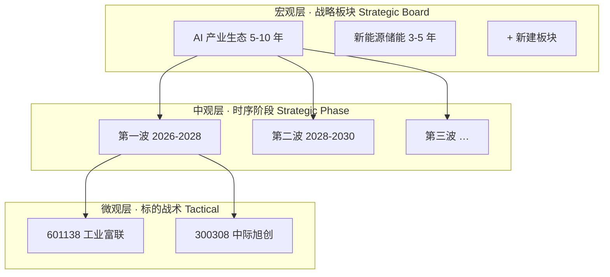
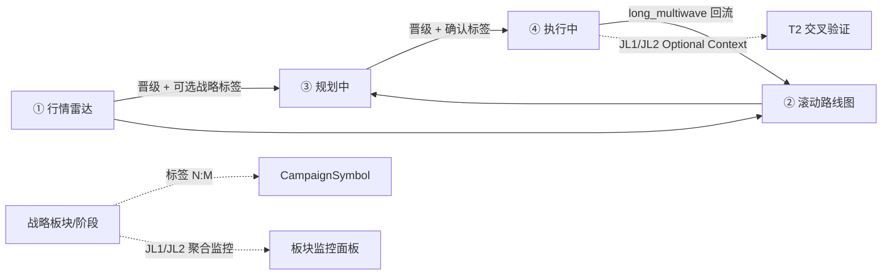
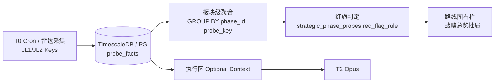

# 30 · 战略板块与滚动路线图 · 前端与数据契约（L3 · 波次三扩展）

> **一句话**：在既有 **四区漏斗 + 标的级状态机**（[25_](./25_四区漏斗_三段流水线_架构脊柱_设计.md)）之上，将 **② 滚动路线图** 升维为 **「宏观战略指挥台 + 微观战术时间线」双层结构**——支持创建多个 **5～10 年生态战略板块**、时序 **阶段（波次）** 划分、阶段级 **JL1/JL2 物理监控** 与 **核心猎物池**；雷达→规划→执行晋级时可选择性挂载 **战略板块 × 阶段** 标签，使执行中标的的 JL1/JL2 调查跟踪与战略演进闭环耦合。

> [!NOTE] **[TRACEBACK] 战略追溯锚点**
> - **L1 哲学**：[06_投资哲学体系总纲](../../01_顶层概念/06_投资哲学体系总纲.md)（②纵深进攻·多源验证 / ⑦壁垒 / 长期产业周期）
> - **L2 实践规划**：[06_标的深度分析与阶段判定实践规划](../../02_战略维度/06_跨维度协作/06_标的深度分析与阶段判定实践规划.md)
> - **架构脊柱**：[25_ 四区漏斗 + 三段流水线](./25_四区漏斗_三段流水线_架构脊柱_设计.md) · [27_ 雷达主链](./27_行情雷达全链路架构设计优化.md) · [28_ 执行中 JL 矩阵](./28_执行中工作区_标的深度监控_T0-T2开发计划.md) · [29_ 三底座](./29_三大数据底座与任务调度架构契约.md)
> - **本维度 L3 总览**：[维度零 stage_1 启动期 steps/README](../00_维度零_AI投资副驾驶/stages/stage_1_启动期/steps/README.md)
> - **关联 step**：← [step_15 滚动路线图双层锚定](../00_维度零_AI投资副驾驶/stages/stage_1_启动期/steps/step_15_滚动路线图双层锚定.md)（战术层已实现）· → **step_18 战略板块与滚动路线图**（待建 · 本文落地目标）
> - **需求主表**：[24_ 行情解析与规划工作台_需求实现表](./24_行情解析与规划工作台_需求实现表.md) §9 波次三扩展
> - **DNA**：[`dna_stage_1_启动期.yaml`](../_System_DNA/00_co_pilot/dna_stage_1_启动期.yaml) `strategic_board_v1`（待增）
> - **代码仓（目标）**：`diting-src/apps/copilot/modules/strategic/` · `templates/planning/_strategic_*` · `routers/strategic_routes.py`

---

## §0 本文档定位

| 维度 | 说明 |
|------|------|
| **产品归属** | **② 滚动路线图工作区** 宏观升维 + 四区漏斗横切 **战略标签** + **JL1/JL2 板块级监控 UI** |
| **与 step_15 关系** | step_15 已交付 **战术双层锚定**（`campaign_timeline` · `regime_assessments` · 4 flag · 滚动闭环）；本文 **不替换** 战术层，在其上叠加 **战略板块层** |
| **L3 责任边界** | 信息架构 · 前端组件契约 · 数据模型 · API 草约 · 分期验收；**不嵌入完整实现代码** |
| **永久红线** | no-mock · no-auto-execute · 晋级须人工确认 · 战略建议全 advisory · JL1/JL2 在执行区仍 **不占探针行**（继承 [28_ §1.2](./28_执行中工作区_标的深度监控_T0-T2开发计划.md)） |

<a id="design-strategic-board-goal"></a>

## §1 设计目标与核心命题

<a id="l4-strategic-board-goal"></a>

### §1.1 要解决什么问题

| 命题 | As-Is（step_15 及当前 UI） | To-Be（本文） |
|------|---------------------------|---------------|
| 滚动路线图定位 | 单 Campaign 战术甘特 + 生命周期 chip | **宏观 5～10 年战略指挥台** + 战术甘特 **嵌套于阶段内** |
| 战略与标的关系 | 标的仅有 `funnel_stage` | 标的可挂载 **战略板块 × 阶段 × 角色** 标签（横切维度） |
| JL1/JL2 监控 | 雷达/执行 Optional Context，无战略聚合视图 | **按板块/阶段** 聚合 JL1/JL2 探针与红旗告警 |
| 晋级流程 | 人工确认，无战略上下文 | 雷达→规划→执行每步可 **打/改战略标签**，形成追溯链 |
| 多生态并行 | 不支持 | 可创建多个战略板块（如 AI 生态、液冷基建、国产算力…） |

### §1.2 设计原则

1. **不破坏标的级漏斗**：`CampaignSymbol.funnel_stage` 仍是四区唯一状态机；战略标签为 **正交横切**，见 [25_ §1.3](./25_四区漏斗_三段流水线_架构脊柱_设计.md)。
2. **双层时间语义分离**：**战略阶段**（年尺度波次）≠ **战术窗口**（`catalyst_window` · 建仓 lead days）。
3. **JL 分层不变**：板块级监控 **只展示 JL1/JL2**；JL3/JL4 仍在执行区 Profile 矩阵，见 [28_ §2.0](./28_执行中工作区_标的深度监控_T0-T2开发计划.md)。
4. **HTMX 为主**：延续 `workbench.html` 局部刷新；复杂编辑器（阶段时间块、10 年轴）可用 Alpine.js 轻交互。
5. **战略演进可审计**：板块/阶段变更、标签挂载、阶段复盘须落库可追溯。

<a id="design-strategic-dual-layer"></a>

## §2 双层滚动路线图信息架构

<a id="l4-strategic-dual-layer"></a>

### §2.1 三层结构



| 层级 | 回答的问题 | 数据实体 | 与现有表关系 |
|------|------------|----------|--------------|
| **宏观 · 板块** | 为何在这个时代关注这类资产？ | `strategic_boards` | 独立；一对多 `strategic_phases` |
| **中观 · 阶段** | 当前处于产业周期的哪一波？ | `strategic_phases` | 含 JL1/JL2 监控配置、核心猎物池、CSO 杠铃 |
| **微观 · 战术** | 这只票何时建仓、窗口是否冲突？ | `campaign_timeline` · `regime_assessments` | **保留** step_15 全部能力 |

### §2.2 与四区漏斗的耦合



- **流转单元不变**：一个 `symbol` = 一条 `CampaignSymbol` 漏斗记录。
- **标签关系**：`symbol_strategic_tags` 允许多条，但 **`is_primary=true` 全局至多一条**（主战略归属）；次归属用于跨板块观察。
- **计数联动**：阶段卡片上的「规划中 / 执行中 / 雷达」数字 = 按 `symbol_strategic_tags.phase_id` + 当前 `funnel_stage` 聚合。

<a id="design-strategic-shell"></a>

## §3 全局 Shell 与工作区 Tab

<a id="l4-strategic-shell"></a>

### §3.1 页头与常驻漏斗进度条

**入口**：`/planning?view={radar|roadmap|planning|executing}`（与现网一致）。

当用户从标的卡进入详情上下文时，页头下方展示 **漏斗进度条**（仅上下文模式）：

```
🔭 雷达 ──→ 🗓️ 路线图 ──→ 📝 规划 ──→ 🚀 执行    [601138 工业富联]
  ✓          ● 当前         ○            ○      🏷 AI 生态 · 第一波
```

| 元素 | 行为 |
|------|------|
| 进度节点 | 映射 `funnel_stage`；当前节点高亮 |
| 战略 chip | 读取 `symbol_strategic_tags` 主标签；无则「未归属战略」虚线样式 |
| 战略总览 ⊞ | 页头右侧按钮，打开 **跨 Tab 抽屉**（§3.3） |

### §3.2 四 Tab 职责扩展

| Tab | 图标 | 角色 | 本文新增能力 |
|-----|:----:|------|--------------|
| 行情雷达 | 🔭 | 发现 + 九维评估 | 晋级弹窗 **战略标签选择器** + AI 标签建议 |
| 滚动路线图 | 🗓️ | **战略主战场** | 三栏指挥台（§4） |
| 规划中 | 📝 | 证伪 + 监控 | 标的卡战略 chip；可修改标签 |
| 执行中 | 🚀 | JL3/JL4 + advisory | 顶部 **战略上下文条**（只读 JL1/JL2 摘要） |

Tab 顺序保持：**雷达 → 路线图 → 规划 → 执行**（与漏斗阅读顺序一致）。

### §3.3 战略总览抽屉（跨 Tab）

**触发**：页头「战略总览 ⊞」或快捷键（实现期可选）。

**内容**：

| 区块 | 说明 |
|------|------|
| 板块列表 | 各板块 JL1/JL2 红灯/黄灯计数、当前活跃阶段 |
| 执行聚焦 | 筛选「板块 × 阶段 × funnel_stage=executing」标的列表 |
| 快捷跳转 | 点击板块 → 切换 `view=roadmap` 并选中该板块 |

<a id="design-strategic-roadmap-ui"></a>

## §4 滚动路线图 Tab · 三栏指挥台

<a id="l4-strategic-roadmap-ui"></a>

### §4.1 布局（Desktop ≥1280px）

```
┌──────────────┬────────────────────────────┬──────────────────────┐
│ 左栏 240px   │      中栏（主画布）         │   右栏 320px         │
│ 战略板块列表  │                            │   阶段详情 + 监控    │
├──────────────┼────────────────────────────┼──────────────────────┤
│ ▶ AI 产业生态 │  ┌─ 10 年战略时间轴 ────────┐ │  🌊 第一波 2026-2028 │
│   5-10 年     │  │2026    2028    2030 2032│ │  战略定性 · 局势研判  │
│ ○ 液冷基建   │  │[====波1====][==波2==]... │ │  JL1 宏观监控        │
│              │  └─────────────────────────┘ │  JL2 行业监控        │
│ [+ 新建板块] │  阶段卡片网格                 │  核心猎物池          │
│              │  ▼ 展开：标的矩阵 + 战术甘特   │  CSO 杠铃 · 三死穴   │
└──────────────┴────────────────────────────┴──────────────────────┘
```

**Mobile**：左栏折叠为下拉；右栏变为底部 Sheet。

### §4.2 左栏 · 战略板块列表

| 项 | 规范 |
|----|------|
| 列表项 | 板块名 · 时间跨度 · 当前活跃阶段名 · JL 告警 badge |
| 选中态 | 左边框 4px 板块主色 + 中栏/右栏联动刷新（HTMX `hx-get`） |
| 新建 | 「+ 新建板块」→ 四步向导 Modal（§4.3） |
| 排序 | 默认 `updated_at DESC`；拖拽排序为 P2 |

### §4.3 新建/编辑板块 · 四步向导

| 步骤 | 字段 | UI 控件 |
|:----:|------|---------|
| ① 板块元信息 | `name`, `horizon_start`, `horizon_end`, `qualitative_md` | 文本 + Markdown 预览 |
| ② 阶段划分 | 每阶段：`wave_no`, `name`, `start_year`, `end_year`, `situation_md`, `playbook_md` | 可拖拽排序的时间块编辑器 |
| ③ 核心猎物 | 每阶段：`symbol`, `role_tag`, `watch_only` | 股票搜索 + 从雷达候选池导入 |
| ④ JL 监控 | 从 JL1/JL2 指标库勾选 + `red_flag_rule_json` | 复选表格 + 阈值 builder |

**JL1/JL2 指标库**：Key 命名空间与 [28_ §2.0 JL2 表](./28_执行中工作区_标的深度监控_T0-T2开发计划.md) 一致（如 `cpi_ppi_spread`, `cxl_adoption_risk`）；禁止臆造未登记 Key。

**参考样板**：附录 A「AI 产业生态 5-10 年四波次」可作为向导预填模板（seed YAML，非硬编码）。

### §4.4 中栏 · 10 年战略时间轴 + 阶段卡片

**10 年轴**：

- 横向 scroll；当前日 `pin` 竖线；
- 各阶段以 `[====]` 色块表示，色深随 `wave_no` 递增变浅；
- 点击色块 → 选中阶段，刷新右栏。

**阶段卡片**（网格，每卡最小信息）：

```
🌊 第一波次 · 2026-2028
硬核硬件基建 → 性能调优跨越
猎物 3 · 执行中 1 · 规划中 1 · 雷达 1
JL1/JL2 告警  🔴1  🟡2  🟢9
阶段进度 ████████░░  （由日期自动计算，非投资判断）
[展开详情] [编辑战略] [阶段复盘]
```

**展开详情区**（阶段卡片下方内联）：

| 子区 | 内容 |
|------|------|
| 标的矩阵 | 核心猎物 + 已打标签的漏斗标的；热力按 JL2 命中率 |
| 战术甘特 | **嵌入** 现有 `GET /api/campaigns/{id}/timeline` HTML partial |
| 合理性 flag | 继承 step_15 四 flag 展示 |

### §4.5 右栏 · 阶段详情与 JL 监控

| 区块 | 规范 |
|------|------|
| 战略文案 | 渲染 `qualitative_md` / `situation_md` / `playbook_md`（Markdown） |
| JL1/JL2 探针行 | Key 简写 · 最新值 · sparkline · 状态灯 🔴🟡🟢⚪ |
| 🔴 展开 | 触发条件 · 数据来源 · 近 3 期历史 |
| 核心猎物池 | symbol · 角色 chip · 漏斗 stage chip · 进度条（JL2 指标覆盖度，非仓位） |
| CSO 杠铃 | 只读展示 `barbell_config_json`（如 70% 硬件 / 30% 期权） |
| 伪科技三死穴 | 独立风控条：研发率 / DSO / 减持；触发 → 「待清仓审查」标记（advisory） |

<a id="design-strategic-promote"></a>

## §5 晋级链路与战略标签

<a id="l4-strategic-promote"></a>

### §5.1 扩展后的晋级状态（不改变 funnel_stage 枚举）

| 动作 | `funnel_stage` 变化 | 战略标签 |
|------|---------------------|----------|
| 雷达 → 规划 | `radar_intake` → `planning` | **可选** 写入 `symbol_strategic_tags` |
| 雷达 → 路线图 | → `roadmap` | 建议选标签 |
| 路线图 → 规划 | `roadmap` → `planning` | 可补标签 |
| 规划 → 执行 | `planning` → `executing` | **建议确认** 主标签 |
| 执行 → 归档 | → `archived` | 标签保留；long_multiwave 回流路线图 |
| 阶段切换（人工） | 不变 | 更新 `phase_id` + 写 `strategic_tag_audit` |

### §5.2 晋级弹窗组件 `_promote_modal.html`

**共用**：雷达候选晋级、规划区晋级执行。

| 字段 | 说明 |
|------|------|
| 标的信息 | symbol · name · 雷达九维摘要（若有） |
| 板块 `[select]` | `strategic_boards` 列表 |
| 阶段 `[select]` | 随板块级联 |
| 角色 `[select]` | 阶段预定义 `role_tag`（如「硬件巨头」「卡脖子新贵」） |
| □ 同步加入核心猎物池 | 勾选则 upsert `strategic_phase_symbols` |
| AI 建议 | T2/规则比对雷达 `market_phase` 与阶段 `situation_md` 相似度，**advisory 预填** |
| 按钮 | 取消 · 跳过标签直接晋级 · 确认 |

**规则**：

- 「跳过标签」必须二次确认文案：「该标的将不纳入任何战略板块监控聚合」。
- 禁止自动晋级；守 [25_ no-auto-execute](./25_四区漏斗_三段流水线_架构脊柱_设计.md)。

### §5.3 战略 Chip 组件 `_strategic_chip.html`

**全 Tab 复用**：

```
🏷 AI 生态 · 第一波 · 硬件巨头     [改标签]
```

| 态 | 样式 |
|----|------|
| 有主标签 | 实线边框；颜色 = `hash(board_id)` |
| 无标签 | 虚线灰底「未归属战略」 |
| 多标签 | 主标签 + `+N` tooltip 展示次归属 |

<a id="design-strategic-jl-monitor"></a>

## §6 JL1/JL2 战略监控数据流

<a id="l4-strategic-jl-monitor"></a>

### §6.1 数据流



| 规则 | 说明 |
|------|------|
| 存储 | 微观时序走 [29_ §2](./29_三大数据底座与任务调度架构契约.md) PG/Timescale；与 JL4 探针同底座 |
| 缺数据 | ⚪ pending + blocker 文案；**禁止 mock** |
| 执行区 | JL1/JL2 **仍不占探针行**；仅顶部「战略上下文条」摘要 + 跳转路线图 deep-link |

### §6.2 执行区战略上下文条

```
┌─ 战略上下文 ─────────────────────────────────────┐
│ 🏷 AI 生态 · 第一波 · JL1/JL2：CXL 风险🔴 GPU 交期🟢 │
│ [查看板块监控详情 → /planning?view=roadmap&phase_id=…] │
└──────────────────────────────────────────────────┘
```

<a id="design-strategic-flows"></a>

## §7 关键用户流程

<a id="l4-strategic-flows"></a>

### §7.1 流程 A · 创建 AI 战略板块

1. 路线图 Tab →「+ 新建板块」
2. 四步向导填入四波次（可加载附录 A 模板）
3. 第三步导入核心猎物（601138、300308、688008…）
4. 第四步勾选 JL2 监控项（CXL、CoWoS、四云 Capex…）
5. 保存 → 中栏渲染 10 年轴 + 阶段卡片

### §7.2 流程 B · 雷达扫描 → 战略晋级

1. 雷达 Mode C 扫描标的 → 九维研报
2. 「晋级到规划区」→ 弹窗 AI 建议「AI 生态 · 第一波」
3. 确认 → `funnel_stage=planning` + `symbol_strategic_tags`
4. 对应阶段卡片计数 +1

### §7.3 流程 C · 战略演进 · 阶段切换

1. JL2 多指标 🔴（如硬件 Capex 见顶）
2. 「阶段复盘」→ 记录 `strategic_phase_reviews`（理由 Markdown）
3. 将标的标签从第一波改挂第二波（或 archived 回流）
4. 审计：`strategic_tag_audit` + 可选 `stage_artifacts` 引用

### §7.4 流程 D · 执行区战略聚焦

1. 战略总览抽屉 → 筛选「AI 生态 · 第一波 · 执行中」
2. 列表展示标的 + JL1/JL2 摘要 + JL3/JL4 探针入口
3. 板块级 🔴 → 注入执行区 T2 Optional Context（与 [28_ T2](./28_执行中工作区_标的深度监控_T0-T2开发计划.md)  envelope 兼容）

<a id="design-strategic-components"></a>

## §8 前端组件清单

<a id="l4-strategic-components"></a>

| 组件 | 路径（目标） | 职责 |
|------|--------------|------|
| `_strategic_chip.html` | `templates/planning/` | 全 Tab 战略标签 chip |
| `_promote_modal.html` | `templates/planning/` | 晋级 + 标签选择 |
| `_roadmap_command_center.html` | `templates/planning/` | 路线图三栏主布局 |
| `_strategic_board_list.html` | partial | 左栏板块列表 |
| `_strategic_timeline.html` | partial | 10 年轴 + 阶段网格 |
| `_phase_detail_panel.html` | partial | 右栏 JL 监控 + 猎物池 |
| `_strategic_overview_drawer.html` | partial | 跨 Tab 战略摘要 |
| `strategic-board.js` | `static/js/` | 时间轴、阶段编辑器（Alpine） |

**改造现有文件**：

| 文件 | 变更 |
|------|------|
| `workbench.html` | 页头漏斗条 + 战略总览按钮 |
| `_workbench_panel.html` | `view=roadmap` 分支替换为三栏指挥台 |
| 雷达候选 partial | 晋级按钮触发 `_promote_modal` |
| 规划/执行标的卡 partial | 嵌入 `_strategic_chip` + 执行区上下文条 |

<a id="design-strategic-data-model"></a>

## §9 数据模型

<a id="l4-strategic-data-model"></a>

### §9.1 新增表

| 表 | 关键列 | 用途 |
|----|--------|------|
| **`strategic_boards`** | `id, name, horizon_start, horizon_end, qualitative_md, barbell_config_json, color_token, created_at, updated_at` | 战略板块 |
| **`strategic_phases`** | `id, board_id FK, wave_no, name, start_year, end_year, situation_md, playbook_md, cso_barbell_pct_json, sort_order` | 时序阶段（波次） |
| **`strategic_phase_symbols`** | `id, phase_id FK, symbol, role_tag, watch_only bool, added_at, source(manual/radar/promote)` | 核心猎物池 |
| **`strategic_phase_probes`** | `id, phase_id FK, probe_key, layer(JL1/JL2), red_flag_rule_json, cadence, enabled` | 阶段级 JL 监控配置 |
| **`symbol_strategic_tags`** | `id, symbol, board_id, phase_id, role_tag, is_primary bool, tagged_at, tagged_from(radar/planning/manual/executing)` | 标的战略归属 |
| **`strategic_tag_audit`** | `id, symbol, old_phase_id, new_phase_id, reason_md, operator, created_at` | 标签变更审计 |
| **`strategic_phase_reviews`** | `id, phase_id, review_md, trigger_summary_json, created_at` | 阶段复盘 |

**约束**：

- `symbol_strategic_tags`：`(symbol) WHERE is_primary` 部分唯一索引，至多一条主标签。
- `strategic_phase_probes.probe_key` 须存在于 JL1/JL2 登记库（与 28_ §2.0 同步）。
- `symbol` 与 `CampaignSymbol.symbol` 格式一致（6 位 normalize）。

### §9.2 与现有表关系

| 现有 | 关系 |
|------|------|
| `CampaignSymbol` | 同 `symbol`；`funnel_stage` 独立 |
| `campaign_timeline` | 战术甘特嵌在 `strategic_phases` 详情内；可按 `symbol` 关联 |
| `regime_assessments` | 生命周期 chip 仍在标的卡；与战略阶段 **可并存**（战术 vs 战略） |
| `radar_candidates` | 晋级时读九维快照供 AI 标签建议 |
| `stage_artifacts` | 可选引用至 `strategic_phase_reviews` |

<a id="design-strategic-api"></a>

## §10 API 契约（草约）

<a id="l4-strategic-api"></a>

| 方法 | 路径 | 说明 |
|------|------|------|
| GET | `/api/strategic/boards` | 板块列表（HTML partial 或 JSON） |
| POST | `/api/strategic/boards` | 创建板块（向导提交） |
| GET | `/api/strategic/boards/{id}` | 板块详情 + 阶段列表 |
| PATCH | `/api/strategic/boards/{id}` | 更新板块元信息 |
| POST | `/api/strategic/boards/{id}/phases` | 批量 upsert 阶段 |
| GET | `/api/strategic/phases/{id}/panel` | 右栏 HTMX partial |
| GET | `/api/strategic/phases/{id}/probes` | JL1/JL2 监控状态聚合 |
| POST | `/api/strategic/phases/{id}/symbols` | 猎物池增删 |
| GET | `/api/strategic/tags?symbol=` | 查询标的标签 |
| POST | `/api/strategic/tags` | 挂载/更新标签（晋级弹窗） |
| POST | `/api/strategic/phases/{id}/reviews` | 阶段复盘 |
| GET | `/api/strategic/overview` | 战略总览抽屉数据 |

**晋级 API 扩展**（向后兼容）：

- `POST /api/radar/candidates/{id}/promote` 增可选 body：`board_id`, `phase_id`, `role_tag`, `add_to_watchlist`
- `POST /api/campaigns/{id}/promote-executing` 同上

<a id="design-strategic-visual"></a>

## §11 视觉规范

<a id="l4-strategic-visual"></a>

| 维度 | 规范 |
|------|------|
| 板块主色 | 每板块 `color_token`（默认 hash）；AI 生态建议 indigo |
| 阶段 wave | 同板块内 wave1 最深 → wave4 最浅渐变 |
| 告警 | 🔴 红旗 · 🟡 接近阈值 · 🟢 正常 · ⚪ 缺数据 pending |
| 战略 vs 战术 | 战略 **实线 + 渐变头**；战术甘特 **虚线 + gray-200** |
| 10 年轴 | 横向 scroll；支持年/季 zoom（P2） |

<a id="design-strategic-phases"></a>

## §12 分期实施与验收

<a id="l4-strategic-phases"></a>

| 期 | 范围 | 验收标准 |
|:--:|------|----------|
| **P0** | 数据模型 migration + 板块 CRUD + 三栏骨架 + 战略 chip | 可创建四波次板块并展示；`pytest test_strategic_board.py` ≥ 8 passed |
| **P1** | 晋级弹窗标签 + 猎物池 + 阶段卡片漏斗计数 | 雷达晋级后阶段卡计数正确；标签 audit 可查 |
| **P2** | JL1/JL2 板块级监控 + T0 探针联通 | 右栏探针行非 mock；🔴 可展开触发条件 |
| **P3** | 战略总览抽屉 + 执行上下文条 + AI 标签建议 | 跨 Tab 筛选；T2 Context 含板块 JL 摘要 |
| **P4** | 阶段复盘 + CSO 杠铃 + 伪科技三死穴 | 复盘落库；三死穴触发 advisory 标记 |

**Makefile 目标（待增）**：

| target | 用途 |
|--------|------|
| `copilot-step18-migrate` | 战略表 migration |
| `copilot-step18-seed-ai-board` | 附录 A 样板入库 |
| `copilot-step18-test` | 单测 |
| `copilot-step18-all` | migrate + seed + test |

<a id="design-strategic-redlines"></a>

## §13 永久红线与 DECISION_PENDING

<a id="l4-strategic-redlines"></a>

| 红线 | 说明 |
|------|------|
| no-auto-execute | 战略标签、阶段切换、三死穴标记均 **不触发下单** |
| no-mock | JL 探针缺源 → ⚪ pending，禁止假数值 |
| 人工确认晋级 | 继承 [25_ §1.3](./25_四区漏斗_三段流水线_架构脊柱_设计.md) |
| JL 分层 | 板块 UI **不展示 JL3/JL4 为战略探针行**；执行区矩阵不变 |
| 主标签唯一 | 同一 symbol 仅一条 `is_primary=true` |

| DECISION_PENDING | 说明 |
|------------------|------|
| AI 标签建议模型 | P3 前可用规则相似度；是否上 T2 需架构师 |
| 多主标签 | 当前设计禁止；跨板块观察用 `is_primary=false` |
| OpenSearch | 战略 Markdown 长文是否迁 ES，follow [29_](./29_三大数据底座与任务调度架构契约.md) 三阶段 |

<a id="l4-strategic-exit"></a>

## §14 L4/L5 锚点与下游 step

<a id="design-strategic-exit"></a>

| 层级 | 锚点 | 内容 |
|------|------|------|
| L3 目标 | `#design-strategic-board-goal` | 本文 §1 |
| L3 准出 | `#design-strategic-exit` | P0～P4 分期 + step_18 待建 |
| L4 实践 | `l4-strategic-board-goal` … `l4-strategic-exit` | 与上表 id 一一对应 |
| L5 | `l5-stage-strategic_board`（待增） | 验收：板块 CRUD + 晋级标签 + JL 监控非 mock |

**下游 step_18（待编写 L3 step 文档）**：工作目录 `diting-src`；验证 `make copilot-step18-all`；1:1:1 反写 DNA `strategic_board_v1`、24_ §9、L5 验收行。

---

## 附录 A · 样板：AI 产业生态 5-10 年战略（摘要）

> 完整文案为用户提供的四波次 + CSO 框架；入库为 `strategic_boards` seed，**非硬编码 UI 逻辑**。

| 波次 | 年份 | 战略定性 | A 股核心猎物（示例） |
|:----:|------|----------|---------------------|
| 第一波 | 2026-2028 | Beta 利润尾声 · Alpha 硬件爆发前夜 | 601138 工业富联 · 300308 中际旭创 · 300502 新易盛 · 688008 澜起科技 |
| 第二波 | 2028-2030 | 硬件→软件调优 · 算力精算 | 688316 青云科技 · 688229 博睿数据 · 603496 恒为科技 |
| 第三波 | 2030-2032 | AI 软件赚真金白银 · B 端私有化 | 688111 金山办公 · 002230 科大讯飞 · 300033 同花顺 |
| 第四波 | 2032-2036 | 具身智能 · Multi-Agent | 300378 鼎捷数智 · 002929 润建股份 |

**CSO 杠铃（板块级 `barbell_config_json` 示例）**：

| 时段 | 硬件基建 | 调度/工具 | 现金/其他 |
|------|:--------:|:---------:|:---------:|
| 2026-2028 | 70% | 30% | — |
| 2028-2031 | 30% | 50% | 20% |
| 2031-2036 | 清减 | 60% 应用/Agent | 40% |

**伪科技三死穴（程序化风控条件 · advisory）**：

1. 连续两季度研发费用率 &lt; 5% 且资本化率 &gt; 25%
2. 应收账款周转天数连续 3 季度环比拉长 &gt; 20%
3. CTO/首席科学家流失或大股东高位大宗减持

---

## 变更记录

| 日期 | 变更 |
|------|------|
| 2026-06-10 | 初版：双层滚动路线图 · 战略板块/阶段/标签 · 三栏指挥台 UI · JL1/JL2 板块监控 · 数据模型与 API 草约 · P0-P4 分期 · 附录 A AI 四波次样板 |
