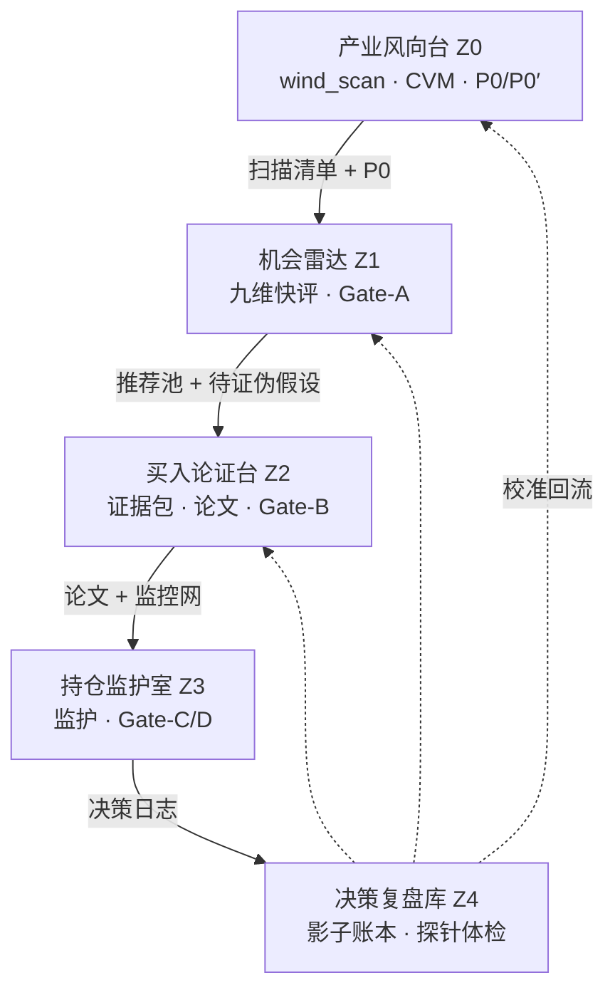
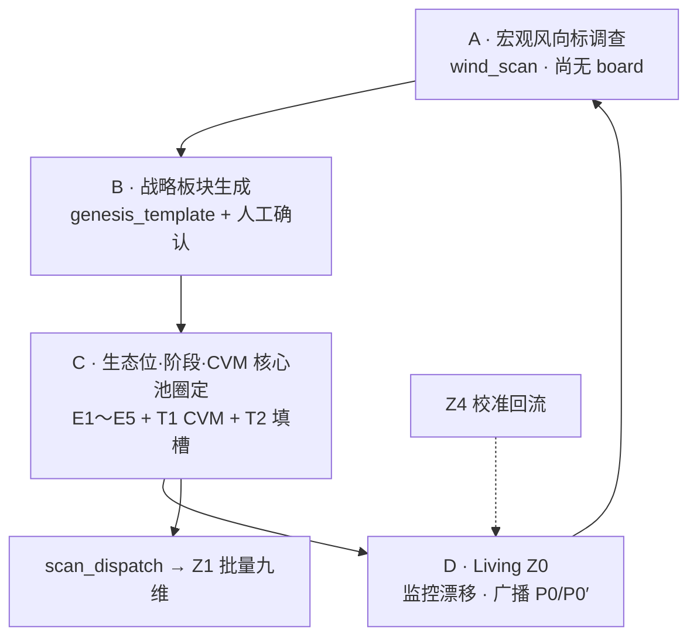
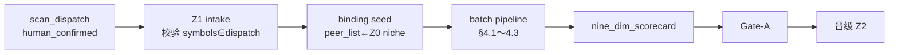

# 32 · 五区漏斗工作流与数据工程标准化规约（L3 · 产品工程总纲 · v3.0）

> **一句话**：把 Diting 从「数据仓库」升级为**价值引擎**——**价值面栈 + 资金面栈**（各宏观/中观/微观）经 **V0→V4 提炼链** 产出信号与评分，驱动 **Z0～Z4 五区漏斗** 与 **买入论文（Thesis Contract）**；采集长度由 **V2 信号类型倒推**，禁止无决策终点的数据吃灰。
>
> **文档定位**：本文是 **工作流 · 数据流 · 闸门 · 论文 · 探针 · 调度** 的**跨区总纲**；不替代 [25_](./25_四区漏斗_三段流水线_架构脊柱_设计.md) 的三段流水线细节、[28_](./28_执行中工作区_标的深度监控_T0-T2开发计划.md) 的单标的探针矩阵、[29_](./29_三大数据底座与任务调度架构契约.md) 的存储底座、[33_](./33_五区工作台_前端区际联动与数据携带契约.md) 的前端区际联动契约；**Z0～Z4 逐区指标矩阵（S0～S3 共享范围 · 运行时 T0/T1/T2）** 见 [34_](./34_五区指标矩阵与T0-T2集成规约.md)。

> [!NOTE] **[TRACEBACK] 战略追溯锚点**
> - **L1 哲学**：[06_投资哲学体系总纲](../../01_顶层概念/06_投资哲学体系总纲.md)（价值三角：安全性 > 确定性 > 收益率；逻辑链正确性；认知边界）
> - **L2 实践规划**：[06_标的深度分析与阶段判定实践规划](../../02_战略维度/06_跨维度协作/06_标的深度分析与阶段判定实践规划.md)
> - **架构脊柱**：[25_ 四区漏斗 + T0/T1/T2](./25_四区漏斗_三段流水线_架构脊柱_设计.md)
> - **前端区际联动**：[33_ 五区工作台](./33_五区工作台_前端区际联动与数据携带契约.md)（HTMX · 晋级/降级 · Z0 战略 UI）
> - **执行探针**：[28_ 执行中 JL 矩阵](./28_执行中工作区_标的深度监控_T0-T2开发计划.md)（= 本文 **Z3 探针实例**）
> - **指标矩阵实施**：[34_ 五区指标矩阵与 T0-T2 集成](./34_五区指标矩阵与T0-T2集成规约.md)（Z0～Z4 · **S0～S3 共享范围** · 运行时 T0/T1/T2）
> - **三底座**：[29_ PG/DeepSea/Redis](./29_三大数据底座与任务调度架构契约.md)
> - **数据源裁决**：[35_ Tushare 主源收敛](./35_Tushare数据源优先收敛规约.md)
> - **防幻觉**：[22_ 事实交叉验证](./22_事实交叉验证与防幻觉规约.md)
> - **需求主表**：[24_ 行情解析与规划工作台](./24_行情解析与规划工作台_需求实现表.md)
> - **DNA**：[`dna_stage_1_启动期.yaml`](../_System_DNA/00_co_pilot/dna_stage_1_启动期.yaml) `funnel_pipeline_v3 / strategic_board_v1`
> - **L4 实践入口**：[04_/维度零/stage_1_启动期/](../../04_阶段规划与实践/00_维度零_AI投资副驾驶/stage_1_启动期/)

---

## §0 本文档管什么 / 不管什么

| 管 | 不管 |
|---|---|
| 五区**工程区码**、Gate 量化条件、交付物 DAG、**Z0 指标先行工作流（§2.4）** | 单个 probe 的业务公式与 YAML 阈值（归 [28_](./28_执行中工作区_标的深度监控_T0-T2开发计划.md)） |
| **§1.4 产品工作区命名**（Tab/提醒/记录类目） | T0/T1/T2 算子实现代码（归 L4 / `diting-src`） |
| **九维计分卡、论文对象、决策日志** JSON 契约 | 具体 HTMX 组件与区际联动（归 [33_](./33_五区工作台_前端区际联动与数据携带契约.md) / 04_ 前端） |
| **S0～S3 共享范围（Share Scope）** + **价值指标矩阵**（§5B.6） | 逐区可执行矩阵（→ [34_ §3～§7](./34_五区指标矩阵与T0-T2集成规约.md)） |
| **双回路决策**（认知 + 风控）与论文-价格背离协议 | LLM 路由成本细目（归 [19_ 异构 AI 调度](./19_异构AI调度栈规约.md)） |
| **采集 cron 调度总表**、`history_required` 原则（§5B.2） | P 轨 Spot ECS 起停（归 [共享平台基础](../共享平台基础/)） |
| **对抗法庭**模板 A/B/C/Bull + 证据包/`fact_layer` Schema | 各 `metric_id` 的 Python 采集器实现（归 L4 / `diting-src`） |
| **指标生产线** + **V0→V4 价值提炼链** + **价值面/资金面双栈** | — |
| **§15 统计严谨性与认知独立性**（单写者事实 · 对抗异构 · 权重治理 · PIT） | 逐区矩阵明细（→ [34_](./34_五区指标矩阵与T0-T2集成规约.md)） |

**永久红线**（继承 25_/28_）：no-mock · no-auto-execute · 晋级/清仓须人工确认或预注册规则触发 · advisory 不下单。

**与既有四区映射**（避免命名混乱）：

> **命名分层（强制）**：**Z0～Z4** 仅用于 L3/DNA/后端日志；**前端主导航、Toast、面包屑、提醒标题** 必须使用 [§1.4 产品工作区](#design-32-product-workspaces) 的**用户价值名**，禁止对用户展示「Z0」「战略瞭望」等工程称谓。

| 工程区码 | 产品工作区（用户可见） | `funnel_stage` | 前端 Tab / 入口 | 25_ 四区 | 典型 step |
|---|---|---|---|---|---|
| **Z0** | **产业风向台** | （横切 · 不绑定单 stage） | `view=roadmap` 滚动路线图 + 战略总览抽屉 | ② 滚动路线图·宏观层 | step_15 / step_18 |
| **Z1** | **机会雷达** | `radar_intake` | `view=radar` 行情雷达 | ① 行情雷达 | step_14 |
| **Z2** | **买入论证台** | `roadmap` → `planning` | `view=planning` 规划中 | ③ 规划中 | step_16 |
| **Z3** | **持仓监护室** | `executing` | `view=executing` 执行中 + `/portfolio-guard` 持仓监管 | ④ 执行中 | step_17 |
| **Z4** | **决策复盘库** | `archived` + 横切 | `/ledger` 价值账本（+ 归档区） | 横切归档 + 校准回流 | L4 实践记录 + Z4 脚本 |

**阅读顺序（漏斗进度条 · Tab 主链）**：**产业风向台 → 机会雷达 → 买入论证台 → 持仓监护室**（与 §1.4 用户心智及 §2.6 数据 DAG 一致；`/planning` 默认 `view=roadmap`）。**决策复盘库**为横切，不占漏斗主链节点（见 [33_ §3.2](./33_五区工作台_前端区际联动与数据携带契约.md)）。

<a id="design-32-product-workspaces"></a>

### §1.4 产品工作区命名与体验映射（前端权威）

用户心智是 **「看风向 → 找机会 → 写理由 → 守持仓 → 复盘对错」**，不是工程区码。下表为 **Copilot 工作台** 的命名契约；实现时写入 `workspace_registry.yaml`（或 DNA `product_workspaces.*`），UI **只读展示名**，禁止硬编码多套文案。

| 工程区码 | 产品工作区名 | Tab 短标签 | 用户价值一句话 | 典型**记录**（用户可回看） | 典型**提醒**（推送/站内） |
|---|---|---|---|---|---|
| **Z0** | **产业风向台** | 产业风向 | 先看风往哪吹，再决定打哪一场 | 战略板块与阶段、P0/P0′ 前提快照、生态位地图、扫描清单派单 | 风口反转、流动性熔断（P0′）、板块 JL1/JL2 红灯 |
| **Z1** | **机会雷达** | 机会雷达 | 广撒网找值得深究的候选 | 九维快评卡、候选池、待证伪假设、Gate-A 结果 | 扫描完成、可晋级论证、D5/D7 否决 |
| **Z2** | **买入论证台** | 买入论证 | 把信念写成可证伪的买入合同 | `thesis.json`、证据包版本链、Kill 条件、立案 `decision_log` | 7 日待立案、Bear 杀死论文、证据包 stale |
| **Z3** | **持仓监护室** | 持仓监护 | 论文在手才持仓，前提死了就动 | 前提 status 时间线、Daily Digest、回路 2 减仓记录 | 探针报警、前提 dead、回撤触及减仓线 |
| **Z4** | **决策复盘库** | 决策复盘 | 验过去对错，校系统规则 | 影子账本、reject 90 日跟踪、探针 precision 报告 | 逻辑对但影子跑输、季审反吃灰、规则重建建议 |

**代码标识（`workspace_id` · 英文 slug · 稳定）**：

| workspace_id | 工程区码 | 说明 |
|---|---|---|
| `strategic_wind` | Z0 | 宏观战略 + 路线图指挥台 |
| `opportunity_radar` | Z1 | 发现与九维粗筛 |
| `thesis_lab` | Z2 | 对抗法庭 + 论文契约 |
| `position_guard` | Z3 | 执行区 + 持仓监管横切 |
| `decision_ledger` | Z4 | 价值账本 + 归档校准 |

**提醒类目（`reminder_category` · 写入通知/待办）**：

```
Z0: wind_shift | liquidity_regime | board_jl_alert | scan_list_dispatch
Z1: scan_complete | gate_a_pass | gate_a_veto | promote_prompt
Z2: thesis_registration_due | bear_killed | evidence_stale | gate_b_pass
Z3: probe_alert | premise_dead | circuit2_trim | max_drawdown_breach
Z4: shadow_underperform | probe_health | calibration_due | anti_dust_audit
```

**与 `funnel_stage` 对齐**（[25_ §1.3](./25_四区漏斗_三段流水线_架构脊柱_设计.md) · `funnel.py`）：

```
radar_intake → roadmap → planning → executing → archived
     Z1           Z2前段    Z2后段      Z3          Z4
```

- **`roadmap` stage 标的**在现网 `view=planning` Tab 与 `planning` stage 一并展示；**产业风向台**的宏观指挥台在 `view=roadmap` Tab（战略板块三栏），二者同属 Z0/Z2 交界，UI 用 **战略 chip + 漏斗进度条** 消歧。
- **Z0 横切数据**（P0、P0′、`liquidity_regime`）在 **产业风向台 + 战略总览抽屉 + 各 Tab 顶栏摘要** 广播，不单占 funnel stage。

**文案禁令**：

| 场景 | 禁止 | 应使用 |
|---|---|---|
| Tab 标签 | Z0、Z1、战略瞭望 | 产业风向 / 机会雷达 / … |
| Toast | 「已进入 Z2」 | 「已进入买入论证台」 |
| 待办标题 | Gate-A 通过 | 「机会雷达 · 可进入买入论证」 |
| 调试面板 | — | 可同时展示 `zone_id` + 产品名 |

---

<a id="design-32-goal"></a>

## §1 系统目标与工程约束

<a id="design-32-value-triangle"></a>

### §1.1 价值三角（优先级不可颠倒）

```
安全性（本金不可逆）> 确定性（能理解 + 能验证）> 收益率（90～180 天窗口）
```

| 转化路径 | 系统做什么 | 工程落点 |
|---|---|---|
| **认识论套利** | 跨源拼图 + 语义压缩，在共识形成前得出可执行结论 | Z1/Z2 九维 + 预期差 + 证据包 |
| **本金保护** | 交叉验尸 + 熔断门禁 | Z3 A9 硬中断 + D5/D7 否决 + P0 宏观熔断 |
| **纪律变现** | thesis 逻辑链持续监控，逻辑断即退出 | Z3 论文前提状态机 + 双回路 |

**工程铁律三条**（刻进最高层配置）：

1. **方向相反原则**：Z1 默认「找理由放过」；Z2/Z3 默认「找理由杀掉」。立场切换发生在 **Gate-A**。
2. **预注册原则**：跨 Gate 的买卖决定，执行前写入不可篡改 `decision_log`；事后补写逻辑无效。
3. **影子记账原则**：reject/清仓标的虚拟跟踪 90 天；**逻辑正确率**与**影子组合收益**并排展示。

### §1.2 认识论系统的可证伪要求（对冲「怎么都对」）

| 问题 | 错误做法 | 正确做法 |
|---|---|---|
| 价值账本 | 反事实「避雷省 ¥X」直接计入总价值 | **确认账** vs **嫌疑账**分离；仅事实证实后转确认账 |
| 决策正确性 | reject 后涨了也算对 → 系统永不犯错 | 过程指标（逻辑链）+ 结果裁判（影子组合）**双轨** |
| edge 是否存在 | 飞轮叙事、人格画像 | 飞轮转 **探针 precision**（年数千信号，样本够大） |

<a id="design-32-dual-stack"></a>

### §1.3 双栈架构：价值面 + 资金面（各含宏观/中观/微观）

此前设计在**价值面**（政策→赛道→公司）较完整，**资金面**仅做到微观个股筹码，宏观流动性与中观板块轮动缺失——导致无法判断「顺水推舟还是逆水行舟」，回路 2 归因也缺少数据支撑。

| 栈 | 宏观 | 中观 | 微观 | 回答 |
|---|---|---|---|---|
| **价值面栈** | 国家政策/经济周期 | 赛道/产业生态/政策方向 | 公司基本面/治理 | **值不值钱** |
| **资金面栈** | A股/美股大盘流动性、利率/VIX | 板块资金轮动/拥挤度 | 个股北向/两融/换手 | **有没有水推/水位如何** |
| **价格/技术面** | — | 赛道相对强度 | 价量/均线/回撤 | **资金的影子**（非独立栈，依附资金面+事实层） |

**工程约束**：

1. **微观资金必须用宏观/中观水位折价**：个股北向流入 + 大盘失血/板块外逃 → D8 强制打折，不得给高分。
2. **回路 2 归因 = 资金面三层定位**：`systemic`（宏观）/ `beta`（中观板块）/ `idiosyncratic`（微观独有）——见 §3.2b `liquidity_context`。
3. **Z0 流动性 regime**：宏观资金面突变可广播 **P0′ 流动性熔断**（类似风口反转的全持仓降暴露），见 §5B.7。
4. **第三方「主力净流入」等估算指标**：无纯官方源，**不得**作为一手事实直接触发 Gate；仅作辅助、须降 tier。

<a id="design-32-funnel"></a>

## §2 五区状态机与量化闸门

<a id="design-32-gates"></a>

### §2.1 证伪强度递增漏斗



**漏斗淘汰率基准**：Z1 收 100 → Z2 留 15～20 → Z3 持 1～3（单人带宽现实上限）。

### §2.2 五区速查（工程区码 · 括号内为产品工作区名）

| 区码 | 产品工作区 | 目的 | AI 角色 | 核心产出 | 量化闸门 |
|---|---|---|---|---|---|
| **Z0** | 产业风向台 | 指标先行选对风口，圈定价值链锚点，监控变天 | 趋势分析师（T1 为主 · T2 填槽） | `wind_scan` · 战略板 genesis · E1～E5 · **CVM 核心池** · P0/P0′ · `scan_dispatch` | CVM 达标 + 人工确认 → 派 Z1（**无 symbol Gate**） |
| **Z1** | 机会雷达 | 广度粗筛 | 筛子（九维 JSON） | 推荐池 + 待证伪假设 | **Gate-A**：攻击分 ≥ +4 且 D5/D7 ≥ 0 且 D9 ≥ +1 |
| **Z2** | 买入论证台 | 证伪 + 写合同 | 对抗法庭 Bear/Bull/Judge | **买入论文 P0～Pn** + 监控网 + Kill 条件 | **Gate-B**：全前提扛过 Bear + 预期差未定价 + Kill 已定 |
| **Z3** | 持仓监护室 | 监护 + 交易 | 审计员（裁前提状态） | 增减清仓 + 预注册日志 | **Gate-C 建仓** / **Gate-D 退出**（见 §2.4） |
| **Z4** | 决策复盘库 | 复盘 + 校准 | 评估员 | 影子账本 + 探针体检 + 论文尸检 | 连续 30 次逻辑正确但影子跑输基准 → 重建规则 |

### §2.3 九维通用语言（贯穿 Z1～Z3）

| 维度 | 类型 | 可证伪问题 | 评分 [-2,+2] | 主数据源 |
|---|---|---|---|---|
| **D1 行业地位** | 攻 | 份额/议价权上升、稳定还是下降？ | +2 绝对龙头扩张 / -2 份额流失 | 行业份额、同业营收 |
| **D2 技术壁垒** | 攻 | 护城河是什么？追平需多久？ | +2 代差 ≥2 年 / -2 随时可替代 | 拆解、专利、认证壁垒 |
| **D3 成长空间** | 攻 | 赛道 2～3 年需求斜率？ | +2 S 曲线加速 / -2 已过拐点 | 下游 Capex、TAM |
| **D4 盈利能力** | 攻 | 毛利率/ROE 趋势？ | +2 利润率扩张 / -2 商品化下滑 | **Tushare `fina_indicator`** · 分部见巨潮附注 |
| **D5 财务质量** | **守·否决** | 现金流/商誉/负债/应收暴雷？ | **≤ -1 一票否决** | **Tushare 三表** · 审计/问询函（巨潮） |
| **D6 估值水位** | 时机 | 历史/同业分位？预期打入多少？ | +2 低分位 / -2 透支 2 年 | PE/PB 分位、PEG |
| **D7 治理结构** | **守·否决** | 减持/关联交易损害中小股东？ | **≤ -1 一票否决** | 巨潮公告 · **Tushare `stk_holdertrade` 交叉** |
| **D8 资金筹码** | 时机 | 北向/两融/情绪流向？ | +2 低位吸筹 / -2 过热派发 | **Tushare `moneyflow_hsgt` / `margin_detail`** · 雷达 T0-2/3 板块流（东财 · [35_ §3](./35_Tushare数据源优先收敛规约.md)） |
| **D9 预期差** | 攻·核心 | 存在可验证、未定价的认知差？ | +2 明确预期差 / -2 纯共识追高 | 卖方一致预期 vs 判断 |

**运算规则**（施工级 · 见 `gates.yaml`；**去相关与置信度**见 [§15.3](#design-32-fact-provenance) · [§15.5](#design-32-confidence)）：

```
# 启动期（v3.0 前兼容 · 逐步废弃裸加总）
attack_score_legacy = D1 + D2 + D3 + D4 + D9     // 整数 ∈ [-10, +10]

# 目标（§15.3 · weight_governance 冻结后启用）
attack_score = normalize( Σ_i  w_i · D_i · c_i )
  w_i = 边际信息权重（1 − mean|ρ_ij|，高相关维收缩 · 见 orthogonality_audit）
  c_i = 该维 signal_confidence ∈ [0,1]；c_i < 0.5 → 该维不进 Gate-A
  D_i ∈ {-2,-1,0,1,2}

缺失处理：任一攻击维 = null → 不可过 Gate-A（禁止用 0 顶替）
否决判定：min(D5, D7) <= veto_floor → veto=true（先于 attack_score）
时机判定：entry_ok = (D6 达阈值) AND (D8 拐点)  // 仅 Gate-C，不参与 attack_score
取整：每维评分 ∈ {-2,-1,0,1,2}，禁止小数
```

> **禁止误解**：D8（Gate-C 择时）、`fact_layer.liquidity_context`（回路 2 归因）、探针 `axis.flow_chips`（前提监控）**可共用同一北向 Raw**，但须按 [§15.3](#design-32-fact-provenance) 声明 **decision_function × authoritative_consumer**；§8.1「镜像因子合并」**仅**合并同一探针轴内正负端，**不**替代跨路径去重。

**Gate 参数化**（`gates.yaml` · 禁止硬编码在代码）：

```yaml
gate_a:
  attack_score_min: 4          # provisional 直至 gate_calibration.md 落库（§15.6）
  veto_floor: -1
  d9_min: 1
  calibration_status: provisional   # calibrated | provisional
gate_c:
  valuation_percentile_max: 0.5
  flow_signal_required: true
gate_d:
  premise_dead_action: liquidate
  veto_action: liquidate
  impaired_action: trim_to_half
  double_overheat_action: take_profit_trim
z0_cvm:
  c7_required: pass
  min_c1_c2_c3_c4_band: acceptable
  c5_bypass_block: high
  max_dispatch_per_niche_phase: 4
  representative_watch_only: true
```

**九维 vs P0-P5 关系**（同一指标底座、两种视图）：

| 视图 | 用途 | 产出区 | 消费方 |
|---|---|---|---|
| **九维 D1-D9** | 筛选/打分/否决/择时 | Z1 → Z2 | Gate-A/C；**模板 A/C 输入** `{nine_dim_scorecard}` |
| **前提 P0-P5** | 监控/退出合同 | Z2 → Z3 | Gate-D；模板 A 产出；探针挂载 |

> 指标采集见 [§5A](#design-32-metric-pipeline)；九维评分见 [§5A.8](#design-32-nine-dim-scoring)。

<a id="design-32-z0-workflow"></a>

### §2.4 Z0 产业风向台 · 指标先行工作流（权威）

> **与旧口径差异**：产业风向台 **不是**「先空壳建 `strategic_board` 再补数」。**正确顺序**：宏观/风口指标调查 → 数据识别优势大方向 → 套 **genesis 模板** 生成板块与阶段 → 生态位·阶段·**CVM 核心标的圈定** → 人工确认 → `scan_dispatch` 派 Z1 → **Living Z0** 持续监控。指标矩阵与 T0/T1/T2 落点见 [34_ §3](./34_五区指标矩阵与T0-T2集成规约.md)；**四段×矩阵实践次序**见 [34_ §3.0b](./34_五区指标矩阵与T0-T2集成规约.md#design-34-z0-segment-matrix) · **双轨分期**见 [34_ §11](./34_五区指标矩阵与T0-T2集成规约.md#design-34-exit) / [33_ §12.1](./33_五区工作台_前端区际联动与数据携带契约.md#design-strategic-phases-crossref)；前端交互见 [33_ §4/§7](./33_五区工作台_前端区际联动与数据携带契约.md)。

#### §2.4.1 四段内循环（A→B→C→D）



| 段 | 做什么 | 主产出 | T2 角色 | 人工确认点 |
|----|--------|--------|---------|------------|
| **A 风向标** | S0 全市场宏观/政策/流动性 → **优势行业/赛道候选排序** | **`wind_scan.json`** | **禁止** 10 年白皮书；仅 `{ sector, wind_score, evidence_spans[] }` | 采纳哪些候选进入 B |
| **B 建板** | 对候选套用 **`strategic_board_genesis_template`** | `strategic_board` + `strategic_phases[]`（5～15 年） | 填 phase 窗口 / S 曲线 / 一句话 thesis；须 fact_gate | **确认建板** |
| **C 圈定** | phase×niche：**E1～E5** + **CVM 6+1** 圈 **价值链锚点**（非伪龙头） | `ecosystem_scores` · **`cvm_scorecard`** · **`core_symbol_pool`** | **仅** C2/C5/C6 语义槽；C7 **零 LLM** | **确认 niche + 核心猎物池** |
| **D Living** | 监控宏观/板块/phase/池 **漂移**；微调 E 分、池 membership | 更新快照 · 可选增量 dispatch | JL/事件语义摘要 | **wind_shift** 二次确认 |

**永久红线**：Z0 **不对单 symbol 写 Gate**；战略/派单 **advisory + 人工确认**；**no-mock**；T2 须 `evidence_spans` / fact_gate（[22_](./22_事实交叉验证与防幻觉规约.md)）。

#### §2.4.2 区际分界（Z0 / Z1 / Z2 / Z3）

| 能力 | Z0 | Z1 | Z2 | Z3 |
|------|----|----|----|-----|
| 大方向/板块 | **数据驱动选出** + genesis 建板 | 只读 `scan_dispatch.theme` | 可选战略 chip | Optional Context |
| 生态位 + 阶段 | **大致规划**；多 phase **可并发** | phase 语境折价 D3/D8 | 写入 thesis 前提 | 前提 dead · 探针 |
| 标的 | **CVM 圈定**价值链锚点（2～4/niche×phase） | **批量九维 + Gate-A** | 证据包 + Gate-B | Gate-C/D |
| 深度调查 | **结构级**（T1 为主） | **可交易级** | **可证伪级** | **监护级** |
| 监控 | **持续**宏观/板块/phase/池 | 扫描完成 | 7 日立案 | JL 主战场 |

**Z1 不得重新圈定「谁是产业锚点」**——只读 Z0 `cvm_scorecard` 摘要；D5/D7 否决的是「能不能买」，不是「是不是锚点」（锚点可 `watch_only` 待 Z4 移池）。

#### §2.4.3 战略生成模板（`strategic_board_genesis_template.yaml`）

**定位**：段 A 的 sector 候选 → **只填模板** → 生成 5/10/15 年 `strategic_board` + `strategic_phases[]`。

**配置落点（目标）**：`diting-src/data/config/strategic_board_genesis_template.yaml` + `strategic_boards/` 实例。

```yaml
template_version: "1.0"
board:
  title: ""
  horizon_years: 10                    # 5 | 10 | 15
  macro_wind_refs: []                  # 段 A metric 快照
  sector_candidate:
    theme_keywords: []                 # 建板后绑定 Z0-M2 语料
    wind_score: null
    evidence_spans: []
phases:
  - phase_id: null
    label: ""
    window: { start: "", end: "" }
    layer: ""                          # infra | platform | app | terminal
    s_curve_position: ""               # early | ramp | late | exhaustion
    concurrent_with: []                # 并发 phase（如基建 late ∥ 应用 early）
    niche_layers:
      - niche_id: ""
        position: ""                   # upstream | midstream | downstream
        e1_e5_weights: { e1: 0.2, e2: 0.25, e3: 0.2, e4: 0.2, e5: 0.15 }
        heat_cycle_note: ""
        jl2_keys: []
    core_symbol_pool: []               # 段 C CVM 确认后写入
jl1_keys: []
p0_hooks: []
genesis_audit:
  confirmed_by: human
  confirmed_at: null
  source_wind_scan_id: null
```

**流程**：`wind_scan_job` → 用户选候选 → `apply_genesis_template` → 预览 10 年轴 → **人工确认** → PG 落库 → 触发段 C（[34_ §3.7～§3.8](./34_五区指标矩阵与T0-T2集成规约.md)）。

#### §2.4.4 CVM · 核心价值链锚定矩阵（6+1 · T1 + 模版 + T2 填槽 + 人确认）

**定义**：在每个 `strategic_phase × niche` 内，圈定 **价值链锚点（Value Anchor）**——未来产业关系里对 **利润池、价值量、结构主导权** 至少一项具备 **持续放大或长期主导** 潜力；**排除** 叙事龙头、小龙头、路线弃子（**伪龙头**）。

**架构（强制）**：

```text
CVM 价值目标模版（rubric + 进池规则 A/B/C）
    → T1 cvm_scorer（可复算指标 · C7 硬否决）
    → T2 cvm_gap_fill（仅 C2/C5/C6 缺口 · schema + fact_gate）
    → cvm_scorecard.json
    → 人工确认 core_symbol_pool → scan_dispatch
```

**不推荐** 旗舰模型全权圈池：易跟共识叙事选伪龙头；与 Z1 深研重复；Z4 无法校准。T2 只做 **填槽**，**不得单独发布进池名单**。

| 维 | 名称 | 主引擎 | 可证伪问题 |
|----|------|--------|------------|
| **C1** | 利润池占有 | **T1** | 该 niche 可分配利润池中 capture 是否高且趋势向上？ |
| **C2** | 卡脖子深度 | T1 + **T2 填槽** | 替换成本、认证/产能稀缺是否深？ |
| **C3** | 价值量弹性 | **T1** | 行业放量时单机/单线价值量是否同步放大？ |
| **C4** | 结构主导权 | **T1** | 份额、Top 客户锁、配额/标准话语权？ |
| **C5** | 生态迁移安全 | **T2 填槽** | S 曲线推进时升格还是被 bypass？ |
| **C6** | 价值持续性 | T1 + T2 摘要 | 跨 2～3 phase 是否仍为锚点？ |
| **C7** | 伪龙头哨兵 | **仅 T1（零 LLM）** | 叙事龙头/小龙头/路线弃子/代工无锚？ |

**进池必要条件**（`gates.yaml` · `z0_cvm` · 与 Gate-A **分离**）：

1. **C7 = pass**
2. **min(C1,C2,C3,C4) ≥ 可接受档**（禁止单项叙事掩盖三项边缘）
3. **C5 ≠ bypass_risk_high**
4. **至少一路径**：**A 利润锚**（C1 高且趋势升）· **B 结构锚**（C2 高且 C4 中高）· **C 成长锚**（C3 高且 C6 中高）

**role 标签**（进池后 · 每 niche×phase **2～4 只** dispatch 优先）：

| role | 含义 |
|------|------|
| **monopoly** | C2+C4 联合最高 · 链上不可替代 |
| **max_value** | C1+C3 联合最高 · 利润池+价值量双锚 |
| **leader** | C4 最高且 C1 或 C3 不低 · **真龙头** |
| **representative** | 通过 CVM 但非优先 dispatch · 默认 `watch_only` |

**伪龙头模式（C7 子集）**：叙事龙头（热但 C1/C3 弱）· 小龙头（窄细分第一但主链价值池外）· 弹性伪成长 · 代工无锚 · 路线弃子（C5 high bypass）。

**Living Z0 池漂移**：C1 连续 2 季降 + C4 份额降 → 降级/移池；C7 触发 → 立即移出 dispatch；Z4 尸检 → 调 `z0_cvm` 权重（非只调 Z1 九维）。

```yaml
# gates.yaml 摘录 · z0_cvm（与 gate_a 分离）
z0_cvm:
  c7_required: pass
  min_c1_c2_c3_c4_band: acceptable
  c5_bypass_block: high
  anchor_paths:
    profit: { c1_min: high, c1_trend_min: stable }
    structure: { c2_min: high, c4_min: mid_high }
    growth: { c3_min: high, c6_min: mid_high }
  max_dispatch_per_niche_phase: 4
  representative_watch_only: true
```

#### §2.4.5 多 phase 并发与 `scan_dispatch`

同一 board 下 phase 可重叠（例：算力 infra **late** ∥ 应用 app **early**）。**scan_dispatch 必须**带 `strategic_phase_id` + `layer`；Z1 **按 phase 分批**扫描。

段 C 人工确认后产出（Z0→Z1 权威契约）：

```yaml
scan_dispatch:
  genesis_ref: { board_id, wind_scan_id, template_version: "1.0" }
  theme: "AI算力基建"
  strategic_phase_id: 12
  layer: infra
  symbols: ["601138", "300308"]
  symbol_roles: { "601138": leader, "300308": monopoly }
  cvm_scorecard_ref: "cvm/phase-12-niche-gpu.json"
  p0_snapshot: { regime: normal, p0_prime: risk_neutral }
  ecosystem_e1_e5: { e1: 0.82, e2: 0.91, e3: 0.75, e4: 0.68, e5: 0.80 }
  liquidity_regime_ref: "liquidity_regime.json#2026-06-17"
  advisory_only: true
  human_confirmed: true
```

#### §2.4.6 Z0 交付物 DAG（扩展 §2.6）

| 序号 | 对象 | 产生段 | 消费方 |
|------|------|--------|--------|
| 1 | **`wind_scan.json`** | A | B · UI 候选列表 |
| 2 | **`strategic_board` / `strategic_phases`** | B | C · D · 33_ 三栏 |
| 3 | **`ecosystem_scores`**（phase 级 E1～E5） | C | scan_dispatch · Z1 语境 |
| 4 | **`cvm_scorecard.json`**（symbol×phase×niche） | C | 核心池 UI · Z1 只读继承 |
| 5 | **`core_symbol_pool` / `strategic_phase_symbols`** | C（人确认） | scan_dispatch |
| 6 | **`scan_dispatch`** | C（人确认） | **Z1 扫描范围** |
| 7 | **`liquidity_regime.json` / P0 快照** | A · D | 全 Tab 横切 |

<a id="design-32-z1-dispatch-workflow"></a>

#### §2.4.7 Z1 · 派单约束扫描工作流（消费 `scan_dispatch`）

> **前端**：[33_ §4.7](./33_五区工作台_前端区际联动与数据携带契约.md#design-strategic-radar-ui) · **数据 intake**：[34_ §4.0a](./34_五区指标矩阵与T0-T2集成规约.md#design-34-z1-dispatch-intake)



| 步骤 | 规则 |
|------|------|
| **intake** | 仅处理 `status=active` 且 `human_confirmed=true` 的 dispatch；symbol **必须** ∈ `symbols[]` |
| **binding** | 若缺 `binding/{symbol}.yaml`，从 dispatch 的 `niche_id` + Z0 `peer_set` **自动 seed**（只写 peer_list/sector/niche，不写 Gate） |
| **扫描** | 默认 **对 dispatch 全量 batch**；禁止无 dispatch 时跑「全市场 Mode A」（见 33_ §5.7.1） |
| **CVM 只读** | Z1 **不得**改 `role`/锚点判定；`cvm_scorecard_slice` 仅展示；D5/D7 否决 ≠ 移出 Z0 池 |
| **晋级** | Gate-A 绿 → `_promote_modal`；预填 `strategic_phase_id` / `symbol_roles` 作战略标签建议 |

**`scan_dispatch` 生命周期**：

| status | 含义 | Z1 行为 |
|--------|------|---------|
| `draft` | Z0 未确认 | 不可见 |
| `active` | 已派单 | 可扫描 |
| `superseded` | 被新 dispatch 取代 | 只读历史；进行中的 scan 任务可跑完但不新扫 |
| `revoked` | Z0 C7 移池/人工撤销 | 队列移除；已产 scorecard 保留审计 |

**Z0 重派单**：新 dispatch 写 `supersedes_id`；旧 dispatch → `superseded`；Z1 待办刷新。

**`falsify_hypotheses[]` 种子**（Z1 产出 · 晋级 Z2 必带）：D9 预期差 + `scan_dispatch.theme` + phase 级 `ecosystem_e1_e5` 各 ≥1 条可证伪句；schema 见 33_ §9.2。

### §2.5 Gate-C / Gate-D 明细

**Gate-C 建仓**（埋伏 → 持仓，三条全满足）：

1. 论文前提全部存活
2. D6 估值进入可接受分位（非透支区）
3. D8 出现资金/情绪拐点（如北向转流入 + 缩量企稳）

**Gate-D 退出**（持仓 → 清仓/减仓）：

| 优先级 | 条件 | 动作 |
|---|---|---|
| 1 | **任一前提判定「死亡」** | 清仓（逻辑链断） |
| 2 | D5/D7 否决触雷 | **无条件清仓** |
| 3 | 前提「受损」未死 | 减仓至半仓 |
| 4 | D6 + D8 双过热 | 止盈减仓（前提完好也可减） |
| 5 | **回路 2 风控**（见 §10） | 按背离协议减仓（不论论文） |

### §2.6 交付物 DAG（数据依赖链）

| 关口 | 上游产出 | 下游消费 |
|---|---|---|
| **Z0 段 A** | **`wind_scan.json`**、P0/P0′ | 段 B 候选 · UI |
| **Z0 段 B** | **`strategic_board` / `strategic_phases`** | 段 C · 33_ 指挥台 |
| **Z0 段 C** | **E1～E5** · **`cvm_scorecard`** · **`scan_dispatch`** | **Z1 仅在清单内扫描** |
| **Z0 段 D** | 漂移更新 · JL 聚合 · `liquidity_regime` | Z2/Z3 语境 · wind_shift 提醒 |
| **Z1→Z2** | 九维基线、待证伪假设 | Z2 证伪靶子 + 证据包起点 |
| **Z2→Z3** | 论文 P0～Pn、13 轴监控网、Kill 条件 | Z3 日更监护 |
| **Z3→Z4** | 预注册决策日志、前提快照 | Z4 影子对账 |
| **Z4→上游** | 探针 precision、尸检 | 修正 **Z0 CVM/E1～E5** / Z1 权重 / Z2 探针 |

**依赖顺序不可跳**：即使先买入（Z3），也必须 **Z0 → Z1 → Z2 倒灌补齐** 后才能进入「正式持仓」监护。

<a id="design-32-thesis"></a>

## §3 买入论文（Thesis Contract）对象契约

### §3.1 定义

**论文不是散文，是买入合同**：「我因相信 A、B、C 而持有；任一前提死亡即卖。」

### §3.2 论文 JSON Schema（系统地基 · `thesis.json`）

```json
{
  "symbol": "601138",
  "name": "工业富联",
  "zone_state": "pending_registration",
  "entry_date": "2026-XX-XX",
  "premises": [
    {
      "id": "P0",
      "type": "macro",
      "statement": "AI算力基建风口未反转",
      "death_criteria": "下游云厂集体下修明年 Capex 指引",
      "probe_refs": ["Z0.regime_monitor", "axis.demand_csp"],
      "status": "intact",
      "last_check": "2026-XX-XX",
      "evidence_refs": ["E1", "E2"]
    }
  ],
  "surprise": {
    "consensus": "卖方一致预期摘要",
    "my_view": "我的偏离判断",
    "verification_signal": "靠什么验证",
    "priced_in": false
  },
  "risk_params": {
    "normal_band_pct": 12,
    "circuit2_trim_pct": 15,
    "max_drawdown_pct": 25,
    "investigation_days": 5
  },
  "entry_conditions": "D6 回中位 + D8 北向转流入",
  "reentry_signals": "前提修复 + 估值回归 + 情绪出清",
  "position_cap_pct": 20,
  "signed_by": "user",
  "signed_at": "2026-XX-XXT..."
}
```

**前提 ID 约定**：

| ID | 归属 | 典型内容 |
|---|---|---|
| **P0** | Z0 下沉 | 宏观/风口总前提（一键熔断） |
| **P1～Pn** | Z2 证伪 | 需求、份额、价值量、治理、情绪等 |

**前提 status 枚举**（与模板 C v2 一致）：

| 值 | 含义 | 典型触发 |
|---|---|---|
| `intact` | 完好 | 无反面证据 |
| `impaired` | 受损 | 探针/基本面可解释恶化 |
| `impaired_market_doubt` | 受损-市场质疑 | 回路 2：聪明钱撤离且不可解释 |
| `dead` | 死亡 | Kill Criteria 命中 |

**状态迁移规则**（仅允许以下转换；每次转换写 `decision_log`）：

> **写入权**：探针 / 回路 2 / Judge **不得**直接写 `premises[].status`——仅可向 **`premise_state_machine`** 提交 **状态变更提议**；仲裁规则见 [§15.8](#design-32-premise-arbiter)（最保守者胜）。

```
intact ──探针可解释恶化──▶ impaired
intact ──回路2不可解释异动──▶ impaired_market_doubt
impaired ──基本面恢复──▶ intact
impaired ──Kill命中──▶ dead
impaired_market_doubt ──调查盒内证伪/查清──▶ intact
impaired_market_doubt ──超时仍不可解释 / Kill──▶ dead
dead ──终态──▶ Gate-D；再入场须新建论文（禁止 dead→intact 直接跳回）
```

**字段类型字典**（`thesis.json` / `premises[]`）：

| 字段 | 类型 | 必填 | 说明 |
|---|---|---|---|
| `symbol` | string | ✅ | 6 位代码 |
| `zone_state` | enum | ✅ | `pending_registration` \| `formal` \| `archived` |
| `premises[].id` | enum | ✅ | `P0`…`P5`（启动期固定 6 条） |
| `premises[].status` | enum | ✅ | 见上表 |
| `premises[].death_criteria` | string | ✅ | 可触发客观信号 |
| `premises[].probe_refs` | string[] | ✅ | 探针轴或 Z0 键 |
| `premises[].evidence_refs` | string[] | ✅ | 槽位 `EVD.*` 或 metric_id |
| `risk_params.*` | number | ✅ | 见 §9.2 |
| `position_cap_pct` | number | ✅ | 单标的上限（默认 20，见 §13.4） |

### §3.2a `evidence_pack.json` Schema（Layer4 · 装配产出）

```json
{
  "symbol": "601138",
  "collected_at": "2026-06-14T18:00:00Z",
  "collector": "evidence_pack_builder",
  "slots": [
    {
      "slot_id": "EVD.P1.csp_capex_guidance",
      "status": "filled",
      "value": "微软 FY26 Capex 指引同比约 +35%……",
      "raw_quote": "原文引述",
      "source": {"name": "MSFT earnings call", "url": "https://...", "tier": 1},
      "source_metric": "M.sector.capex_total",
      "as_of": "2026-04-XX",
      "shared": true,
      "verified_by_human": true
    }
  ],
  "overall": {"filled": 28, "missing": 2, "blocking": false}
}
```

- `status`: `filled` \| `MISSING`
- `blocking=true`：任一 **P0/P4** 的 `required` 槽位为 `MISSING`
- `verified_by_human=false` 且 `tier>1` → 模板 A 引用时置信度封顶 0.5

### §3.2b `fact_layer.json` Schema（规则引擎 · 禁止 LLM 生成）

```json
{
  "symbol": "601138",
  "as_of": "2026-06-14",
  "price": {
    "close": 0.0,
    "vs_cost_pct": -12.3,
    "drawdown_from_peak_pct": -18.0,
    "ma_state": "below_ma20",
    "volume_signal": "放量下跌"
  },
  "capital_flow": {
    "northbound_net_5d": -3.2,
    "northbound_net_20d": -8.1,
    "margin_balance_chg_5d_pct": -4.5,
    "turnover_percentile_2y": 0.95
  },
  "cross_market": {
    "mapped_5d_pct_avg": -5.1,
    "self_5d_pct": -18.0,
    "is_idiosyncratic": true
  },
  "sector": {"sector_index_5d_pct": -5.5, "relative_strength_pct": -12.5},
  "liquidity_context": {
    "macro": {
      "north_market_net_20d": -120.0,
      "us10y_chg_1w": 0.15,
      "vix": 28.0,
      "regime": "risk_off"
    },
    "meso": {
      "sector_main_inflow_5d": -8.5,
      "sector_crowding_pct": 0.92,
      "sox_etf_flow_5d": -2.1
    },
    "micro": {
      "northbound_net_20d": -8.1,
      "margin_balance_chg_5d_pct": -4.5
    },
    "attribution": "idiosyncratic"
  },
  "risk_param_breach": {
    "normal_band": false,
    "circuit2_trim": true,
    "max_drawdown": false
  }
}
```

**编排层**：

- `circuit2_trigger = risk_param_breach.circuit2_trim && 认知模式仍 intact`
- `liquidity_context.attribution` 由规则引擎判定（**禁止 LLM**），与 §9.3 / 模板 C 风控模式对齐

### §3.3 预注册决策日志（`decision_log.json`）

```json
{
  "date": "2026-XX-XX",
  "symbol": "601138",
  "action": "hold",
  "premises_snapshot": {"P0": "intact", "P1": "impaired"},
  "reason": "P1 受损来自可解释赛道 β，非前提死亡",
  "expected": "5 个交易日内验证",
  "kill_review_date": "2026-XX-XX",
  "judge_consistency": "2/2",
  "circuit2_triggered": false,
  "circuit2_reason": null,
  "override": null
}
```

`circuit2_triggered=true` 时须填 `circuit2_reason`（归因 + 矩阵档位），与认知回路理由分开。

### §3.4 论文生产流水线（Z2 · 禁止凭空起草）

```
metric_registry（含 V0→V4 声明）
        ↓ pipeline：采集 → V1 Metric → V2 Signal
metric_store（信号+分值，非裸数据吃灰）
        ↓ evidence_pack_builder + nine_dim_scorer
evidence_pack.json + nine_dim_scorecard
        ↓ 模板 A → B(Bear) → C(Judge) ×2 → 用户签字
thesis.json
```

| 步骤 | 执行者 | 动作 |
|---|---|---|
| **2.0 指标+信号** | `pipeline.py`（§5B） | V0 采集 → V1 指标 → **V2 信号** → `metric_store` |
| **2.1 装配** | `evidence_pack_builder` | 按槽位模版 + binding 自动提货 |
| **2.2 九维** | Z1 评分器（§5A.8） | 产出 `{nine_dim_scorecard}` |
| **2.3 起草** | 模板 A | 消费 `evidence_pack` + 九维；禁止记忆填数 |
| **2.4 攻击** | 模板 B（Bear 独立会话） | 禁止泄露持仓 |
| **2.5 裁决** | 模板 C × 2 | 认知/风控模式 |
| **2.6 签字** | 用户 | 写入 `thesis.json` |

**完整提示词正文见 [§10（v3 施工版）](#design-32-prompt-templates)**。

**已持仓回溯立案**（`zone_state: pending_registration`）：

- **不退区**：客观在 Z3，子状态「待立案」
- **7 日期限**：Z0→Z1→Z2 倒灌；核心问题：**「若现在空仓，还会按当前价买吗？」**
- 论文被 Bear 杀死且无法修复 → 清仓（沉没成本不是理由）

<a id="design-32-data-layers"></a>

## §4 运行时三层（事实 / 探针 / 决策上下文）

> **命名说明**：本节 **运行时三层** 与 §5B 的 **V0～V4 价值提炼链** 不同维度，勿混用。

| 层 | 是什么 | 运行方式 | 决策角色 |
|---|---|---|---|
| **事实层** | 价/量/均线、`fact_layer`、流动性上下文 | 日更（必要时盘中），纯规则 | 仪表盘；回路 2 输入 |
| **探针层** | 13 轴（或 28_ JL 矩阵实例） | **事件驱动**，非每日全跑 | 前提死活报警 |
| **决策上下文** | 决策会临时打包 | **仅触发时** | Bear/Bull/Judge 全量输入 |

**日常节奏**：事实层刷新 + 探针层监听 → **不做全面判断**  
**报警时**：召开决策会 → 决策上下文打包 事实层 + 探针层 + 证据包 + P0

<a id="design-32-share-scope"></a>
<a id="design-32-reuse-tiers"></a>

## §5 数据共享范围（S0～S3 · Share Scope）

> **命名约定**：共享范围用 **S0～S3**（Share Scope）；**T0/T1/T2** 专指运行时流水线（[25_ §2](./25_四区漏斗_三段流水线_架构脊柱_设计.md) · [34_ §1](./34_五区指标矩阵与T0-T2集成规约.md)）。

| 层级 | 共享范围 | 英文 | 含义 | 采集策略 | `share_scope` cache key |
|---|---|---|---|---|---|
| **S0** | 全市场 | System-wide | 宏观、大盘、汇率、利率 | 采一次，全系统共享 | `global` |
| **S1** | 赛道 | Sector | 云厂 Capex、CoWoS、地缘框架 | 按赛道一份 | `board:{board_id}` |
| **S2** | 生态位 | Niche | 组装/代工环节（铜缆 vs CPO、份额格局） | 按生态位一份 | `niche:{niche_id}` |
| **S3** | 单标的 | Symbol | 治理、映射股、非 AI 业务、技术面数值 | 每标的单独 | `symbol:{code}` |

**13 轴模板 vs 实例**（结构可复用，数据分公用/定制）：

| 探针轴 | 共享(S) | 说明 |
|---|---|---|
| A1 需求 / A4 代际 / A5 供应 / A6 地缘 / A7 新市场 | S1 | 赛道内共享 |
| A2 份额 / A3 价值量 | S2 | 生态位共享；对手列表定制 |
| A8～A13 + A6 产地细节 | S3 | 标的定制 |
| A10/A13 算法 | S0 方法 + S3 数值 | schema 固定，值随标的 |

> **与 [28_](./28_执行中工作区_标的深度监控_T0-T2开发计划.md) 关系**：28_ 的 `601138` Profile 是 **Z3 执行探针实例**；本文 **§5A** 是 **Z2 写论文 + Z1 九维** 的指标底座，二者通过 `probe_refs` / `map_slot` 对齐。

<a id="design-32-metric-pipeline"></a>

## §5A 指标生产线（写论文前的数据底座）

### §5A.0 四层数据流（施工主链）

```
Layer1 metric_registry.yaml     指标定义 + V0→V4 价值链声明（§5B.1）
        ↓ pipeline.py：采集 → V1 Metric → V2 Signal
Layer2 metric_store             信号+分值（非裸 L0 吃灰）
        ↓ evidence_pack_builder + nine_dim_scorer
Layer3 thesis_slot_template     通用前提-槽位模版（P0-P5 bind metric_id）
     + binding/{symbol}.yaml    标的绑定（sector/niche/peer_list/mapped_list）
        ↓
Layer4 evidence_pack.json       自动装配 → 喂模板 A；nine_dim_scorecard → Z1/Z2
```

**`metric_registry` 每条指标最低字段**（采集层 + 价值链层）：

```yaml
- metric_id: M.liquidity.north_net_20d
  share_scope: S0                   # S0～S3 · 见 §5
  collection: {source: hkex_ccass, cron: "0 9 * * *"}
  computation:                      # V1
    method: rolling_sum
    window_days: 20
  signal:                           # V2 — 价值主要在此
    transform: percentile
    contextualization_window: 36个月
    baseline: self_3y_distribution
    consistency_discount:           # 资金面三层折价（§5B.5）
      macro_regime: risk_off
      rule: cap_positive_at_zero
  value:                            # V3
    maps_to: [D8_筹码, fact_layer.liquidity_context]
    scoring_ref: nine_dim_scoring.yaml#D8
  fact_provenance:                  # §15.3 · 单写者事实台账
    raw_fact_id: north_net_20d
    authoritative_by_function:
      gate_c_timing: D8_筹码
      circuit2_attribution: fact_layer.liquidity_context
      premise_monitor: axis.flow_chips
    display_only_rule: "非 authoritative 路径仅解释/归因/UI，禁止再次进入加权评分"
  decision:                         # V4
    gates: [gate_c, circuit2_attribution]
  history_required: 36个月          # = max(V1窗口, V2语境) + buffer
```

> **首采列说明**：§5A.1～P5 与 §6 表格「首采」= `history_required` 缺省值；规则见 [§5B.2](#design-32-history-required)。

**配置文件落点**（`diting-src/apps/copilot/`）：

| 文件 | 层级 | 换标的是否改 |
|---|---|---|
| `metrics/metric_registry.yaml` | L1 | 否（增指标才改） |
| `thesis/thesis_slot_template.yaml` | L3 基线 | 否（生态位特化另建 `thesis_slot_template_{niche}.yaml`） |
| `thesis/binding/601138.yaml` | L3 绑定 | **每标的一份** |
| `metrics/pipeline.py` + `thesis/evidence_pack_builder.py` | L2→L4 | 否 |

**列说明**：**共享(S)** 列 — `S0/S1/S2`=换标的不重采；`S3`=换标的重采；`衍生`=由已有指标计算。

### §5A.1 层 P0 · 宏观/风口

| 指标 | 共享(S) | 一手源 | 首采 | 增量 | 计算 |
|---|---|---|---|---|---|
| GDP/PMI/工业增加值 | 通用S0 | 国家统计局 | **36个月** | 月/季 | 原值+同比 |
| 社融/M2/利率 | 通用S0 | 中国人民银行 | **36个月** | 月 | 原值+同比 |
| 美国利率/流动性 | 通用S0 | 美联储、BEA | **24个月** | 月/事件 | 原值+周变 |
| 赛道产业政策方向 | 通用S1 | 发改委、工信部、Federal Register | **滚动保留24个月** | 事件 | LLM 抽取 enum |
| 赛道下游 Capex 总量 | 通用S1 | 四大云厂 IR、SEMI | 8个季度 | 季 | 求和+同比 |
| 生态位利润分布 | 通用S2 | 产业链财报汇总 | **12个季度** | 季 | 各环节净利占比 |
| 风口 S 曲线阶段 | 通用S2 | Z0 生态位评分 | — | 季 | 规则(基建/爆发/过剩) |

### §5A.2 层 P1 · 客户需求

| 指标 | 共享(S) | 一手源 | 首采 | 增量 | 计算 |
|---|---|---|---|---|---|
| 四大云厂 Capex 指引 | 通用S1 | 法说会 transcript | 8个季度 | 季 | 原值+同环比 |
| Capex 指引方向 | 通用S1 | 同上 | 4个季度 | 季 | LLM(上修/维持/下修) |
| 主权 AI/大单 | 通用S1 | 招标/FDI 公告 | 滚动保留12个月 | 事件 | 事件+金额 |
| 标的订单能见度 | 定制S3 | 标的法说会/月报 | 4个季度 | 季 | LLM 引述 |

### §5A.3 层 P2 · 份额竞争

| 指标 | 共享(S) | 一手源 | 首采 | 增量 | 计算 |
|---|---|---|---|---|---|
| 标的月营收 | 定制S3 | MOPS、巨潮月报 | **36个月** | 月(11日) | 同环比 |
| 同业月营收 | 定制S3 | MOPS（peer_list） | **36个月** | 月 | 同环比 |
| 估算份额 | 定制S3 | 上两项 | — | 月 | self/(self+Σpeers) |
| 价格战信号 | 通用S2 | Digitimes 等 | 滚动6月 | 事件 | LLM+置信度 |
| 配额/顺位变化 | 通用S2 | NVDA 伙伴名单 | 滚动12月 | 事件 | LLM 抽取 |

### §5A.4 层 P3 · 产品价值量/技术替代

| 指标 | 共享(S) | 一手源 | 首采 | 增量 | 计算 |
|---|---|---|---|---|---|
| 高价值组件自供率 | 定制S3 | 子公司月报、BOM | 8个季度 | 月/季 | 原值 |
| 单机柜 ASP | 通用S2 | 拆解报告 | 最新2-3份 | 事件 | 趋势 |
| 替代技术时间表 | 通用S1 | 产业白皮书、GTC | 滚动保留12个月 | 事件 | LLM+日期 |
| 液冷形态演进 | 通用S2 | OCP、供应链法说 | 滚动保留12个月 | 事件 | LLM |

> **生态位特化**：组装代工（FII）用铜缆/CDU；光模块（新易盛）换为 800G→1.6T 升级、EML 自供、CPO/LPO 渗透（见 §12.6）。

### §5A.5 层 P4 · 治理财务（否决维 · 最高优先级）

| 指标 | 共享(S) | 一手源 | 首采 | 增量 | 计算 |
|---|---|---|---|---|---|
| 经营性现金流 | 定制S3 | 巨潮现金流量表 | **12个季度** | 季 | 同比 |
| 关联交易额度 | 定制S3 | 巨潮公告 | 3年 | 事件 | 同比+占比 |
| 减持/质押 | 定制S3 | 巨潮、披露易 | 3年 | **实时** | 事件标记 |
| 应收/商誉异动 | 定制S3 | 巨潮资产负债表 | **12个季度** | 季 | 占营收比 |
| 有息负债/现金比 | 定制S3 | 巨潮 | **12个季度** | 季 | 比值 |
| 审计/问询函 | 定制S3 | 巨潮 | 3年 | 事件 | 事件标记 |

**硬中断**（零 LLM）：减持/问询/关联交易暴增 → 巨潮 RSS 关键词 → 直通 Gate-D。

### §5A.6 层 P5 · 估值情绪（时机维）

| 指标 | 共享(S) | 一手源 | 首采 | 增量 | 计算 |
|---|---|---|---|---|---|
| PE/PB 历史分位 | 定制S3(算法通用) | 交易所+财报 | **10年** | 日 | percentile |
| 北向净额 | 定制S3 | 港交所 CCASS | **3年** / **30日** | 日(T+1) | 5/20日滚动 |
| 两融占流通市值 | 定制S3 | 交易所 | **3年** | 日 | 占比+2年分位 |
| 换手率分位 | 定制S3 | 交易所 | 2年 | 日 | 分位 |
| 卖方一致预期 | 定制S3 | 研报汇总 | 4个季度 | 周 | surprise=实际-一致 |
| 舆情情绪 | 定制S3(算法通用) | 股吧/雪球 | 2年 | 日 | 情绪+极值分位 |

### §5A.7 层 RF · 价格/技术面（回路 2 · 规则引擎）

> **RF** = Risk/Fact 价格事实；勿与 §5B 的 V 层或 §4 运行时「事实层」混称。

| 指标 | 共享(S) | 一手源 | 首采 | 增量 | 计算 |
|---|---|---|---|---|---|
| 行情日线 | 定制S3 | 交易所 | **约2年** | 日/盘中 | 原值 |
| 均线状态 | 定制S3(算法) | 行情衍生 | **75日** | 日 | MA5/20/60 |
| 自峰值回撤 | 定制S3 | 行情衍生 | 建仓起 | 日 | (现-峰)/峰 |
| 量价信号 | 定制S3(算法) | 行情衍生 | 1年 | 日 | 量×价判定 |
| 映射异动 | 定制S3 | TWSE/同业（binding） | 1年 | 盘中 | 特异性判定 |
| 赛道相对强度 | 定制S3 | 赛道指数 | 2年 | 日 | 标的-指数 |

<a id="design-32-nine-dim-scoring"></a>

### §5A.8 九维专属指标与评分（`nine_dim_scoring.yaml`）

九维 **80% 复用 §5A.1～P5 指标**；下表为 **需额外采集/衍生** 项 + 评分规则：

| 维度 | 复用指标 | 九维专属补充 | 评分 → [-2,+2] |
|---|---|---|---|
| D1 行业地位 | P2 份额 | 客户集中度（财报附注） | 份额升+2 / 平0 / 流失-2 |
| D2 技术壁垒 | P3 自供/替代 | 专利存量、认证壁垒(LLM) | 代差≥2年+2 / 可替代-2 |
| D3 成长空间 | P0/P1 Capex、S曲线 | TAM（行业研报） | 加速+2 / 拐点-2 |
| D4 盈利能力 | — | **毛利率/ROE 趋势**（巨潮） | 扩张+2 / 下滑-2 |
| D5 财务质量 | P4 全部 | — | 干净0 / **≤-1 否决** |
| D6 估值 | P5 PE分位 | **PEG**（衍生） | 低分位+2 / 透支-2 |
| D7 治理 | P4 减持/关联交易 | — | 干净0 / **≤-1 否决** |
| D8 筹码 | P5 北向/两融/换手 + **§5B.4 宏/中观水位** | 三层一致性折价 | 见 §5B.5 |
| D9 预期差 | P5 一致预期、P1 surprise | 催化是否 price-in | 未定价+2 / 追高-2 |

**九维输出**（Z1 → Z2，`nine_dim_scorecard.json`）：

```json
{
  "symbol": "601138",
  "scores": {"D1": 2, "D2": 1, "D3": 2, "D4": 1, "D5": 0, "D6": -1, "D7": 0, "D8": 1, "D9": 1},
  "attack_score": 7,
  "veto": false,
  "entry_ok": false,
  "as_of": "2026-06-14"
}
```

**computation.method 枚举**（`metric_registry` 必填）：

| method | 含义 |
|---|---|
| `raw_value` | 直接取数 |
| `yoy_qoq` | 同环比 |
| `percentile` | 历史分位 |
| `rolling_sum` | 滚动求和 |
| `ratio_share` | 份额比 |
| `relative_compare` | 映射/特异性 |
| `aggregate` | 汇总 |
| `llm_extract` | 语义抽取 |
| `event_flag` | 事件标记 |
| `regime` | 周期/状态判定（需完整周期历史） |

<a id="design-32-value-chain"></a>

## §5B 数据→价值提炼链与资金面三层栈

> **采数据是 ETL，化价值才是 Diting。** 每个指标必须声明 V0→V4 全链路；无链路 → 不采集（§5B.3）。

### §5B.1 V0～V4 五层提炼链

| 层 | 名称 | 做什么 | 产出 | 存储策略 |
|---|---|---|---|---|
| **V0** | Raw | 一手序列入库 | 裸数值 | 仅保留 `history_required` 长度；分位类可日级降采样 |
| **V1** | Metric | 滚动/同比/比值/份额 | 可比数值 | 写入 `metric_store` |
| **V2** | Signal | **与基线/分位/阈值/预期差比较** | 方向+强度 `[-100,100]` + 置信度 | **价值主要在此层** |
| **V3** | Value | 映射九维 D-score / 前提 status | 维度分 / 前提状态 | `nine_dim_scorecard` / `premises[].status` |
| **V4** | Decision | 聚合进 Gate / 仓位 / 回路 2 | 买卖/晋级/减仓/归因 | `gates.yaml` / `decision_log` |

**北向示例（走完五层）**：

```
V0: CCASS 日净额（history_required=3年，因 V2 要 3 年分位）
V1: 20 日滚动净额（全市场 / 板块 / 个股三层）
V2: 个股 20 日净额 3 年分位=+70；但 macro.regime=risk_off → 折价至 +20
V3: D8=+1（微观流入但宏观失血，打折）
V4: Gate-C 择时未过；fact_layer.liquidity_context.attribution 供回路 2
```

<a id="design-32-history-required"></a>

### §5B.2 `history_required` 规划

首采长度由 **V2 信号计算窗口** 决定：`history_required = max(V1 窗口, V2 语境窗口) + buffer`。追溯不到 V4 决策终点的序列不采集（§5B.3）。

**V2 transform → 语境窗口**：

| transform | V2 语境窗口 | history_required 示例 |
|---|---|---|
| `raw_value` / `raw_threshold` / `event_flag` | 0 | **无回填** 或 **1日** |
| `yoy` / `qoq` | 13个月 或 5个季度 | **36个月**（宏观 P0） |
| `rolling_sum_20d` | 20日 | **30日** |
| `percentile_3y` | 3年 | **3年** |
| `percentile_10y` | 10年 | **10年** |
| `baseline_surprise` | 4个季度 | **4个季度** |
| `regime` / `trend` | 24～36个月 或 8～12个季度 | **24个月** / **8个季度** |
| `llm_corpus` | 滚动语料 | **滚动保留24个月** |

**指标缺省（与 [34_ §2.2](./34_五区指标矩阵与T0-T2集成规约.md#design-34-history-required) 一致）**：

| 指标 / 用途 | V1 窗口 | history_required |
|---|---|---|
| 北向 20 日净额（滚动） | 25日 | **30日** |
| 北向 20 日净额（3年分位） | 25日 | **3年** |
| GDP/PMI/社融（同比 + P0） | 13个月 | **36个月** |
| 10Y 美债（P0′ 周变） | 5日 | **24个月** |
| VIX（3年分位） | 1日 | **3年** |
| VIX（阈值） | 1日 | **30日** |
| PE 10年分位（D6） | 1日 | **10年** |
| MA60 | 60日 | **75日** |
| 毛利率 4季斜率（D4） | 4个季度 | **8个季度** |
| 月营收份额（D1） | 36个月 | **36个月** |
| Capex 同比 | 8个季度 | **8个季度** |
| 政策 LLM enum | 滚动语料 | **滚动保留24个月** |
| 减持 RSS 硬中断 | 事件 | **无回填** |
| 行情日线（Gate-C） | 250日 | **约2年** |

**存储**：V0 仅保留 `history_required` 长度；到期裁剪。分位类序列可日收盘降采样。

**`metric_registry` 必填**：`history_required` · `v2_signal.transform` · `decision_endpoints[]`。

**YAML 示例**：

```yaml
- metric_id: M.macro.pmi
  share_scope: S0
  v2_signal:
    transform: yoy
    contextualization_window: 36个月
  computation:
    method: yoy_qoq
    window: 13个月
  history_required: 36个月
  decision_endpoints: [P0_context, liquidity_regime.macro_overlay]
```

<a id="design-32-no-dust"></a>

### §5B.3 反吃灰铁律

```
每个 V0 序列必须追溯到 ≥1 条完整链：V2 Signal → V3 Value → V4 Decision。
追溯不到决策终点 → 不采集、不入库。
每季审计：列出全部 V0，标注价值链终点（Gate/前提/回路）；无终点 → 停采 + 清理。
```

<a id="design-32-liquidity-stack"></a>

### §5B.4 资金面三层指标（宏 / 中 / 微）

#### 宏观 · 通用 T0（全市场共享）

| 指标 | 一手源 | history_required(示例) | 增量 | V1 计算 | V2 信号类型 |
|---|---|---|---|---|---|
| 北向全市场净额 | 港交所 CCASS | 3年 / 30日 | 日 | 5/20 日滚动 | percentile / raw |
| 两融余额总量 | SSE/SZSE | 3年 | 日 | 趋势+变化率 | percentile |
| A 股总成交额 | 交易所 | 3年 | 日 | 原值 | percentile（拥挤度） |
| 偏股基金发行 | 基金业协会 | 5年 | 周/月 | 新增规模 | yoy |
| 股票 ETF 净申赎 | 交易所 | 3年 | 日 | 净额 | rolling_sum |
| 央行公开市场净投放 | 人民银行 | 5年 | 日/事件 | 净投放 | event_flag |
| DR007 / SHIBOR | 银行间中心 | 5年 | 日 | 原值 | raw_threshold |
| 10Y 美债收益率 | US Treasury | 24个月 | 日 | 原值+周变化 | regime |
| VIX | CBOE | 3年 / 30日 | 日 | 原值 | percentile / threshold |
| 美元指数 DXY | ICE | 5年 | 日 | 原值 | — |
| 美股 SOX / AI ETF 资金流 | 交易所/ETF | 3年 | 日 | 净流入 | rolling_sum（**A 股领先 1～2 日**） |

#### 中观 · 通用 T1（板块/赛道共享）

| 指标 | 一手源 | history_required | 增量 | 备注 |
|---|---|---|---|---|
| 板块主力净流入 | 成交明细衍生 | 3年 | 日 | **第三方估算 · tier-2 · 不可直触发 Gate** |
| 板块成交额占全市场比 | 交易所 | 3年 | 日 | 拥挤度 |
| 板块换手率分位 | 交易所 | 3年 | 日 | 过热 |
| 北向行业聚合净额 | CCASS 聚合 | 3年 | 日 | 行业级 |
| 板块 ETF 净申赎 | 交易所 | 3年 | 日 | — |
| 美股对标板块 ETF（SOXX/SMH） | 交易所 | 3年 | 日 | 领先指标 |
| 板块轮动强度 | 涨幅排名衍生 | 3年 | 日 | 排名 delta |

#### 微观 · 定制 T3（已有 · 略）

个股北向、两融、换手、龙虎榜、大单净流入——见 §5A.6 P5；须与宏/中观联动折价。

<a id="design-32-d8-watermark"></a>

### §5B.5 D8「三层资金水位」评分

```
D8_raw = w_macro·S_macro + w_meso·S_meso + w_micro·S_micro   # 各 S 来自 V2，映射 [-2,+2]

一致性折价规则（规则引擎 · 禁止 LLM）：
  微观流入 + 宏观/中观流出 → D8 封顶 +0（不给高分）
  三层共振流入 → 可至 +2
  三层背离（方向不一致）→ 按背离方向降档
```

权重默认建议：`w_macro=0.35, w_meso=0.35, w_micro=0.30`（写入 `nine_dim_scoring.yaml#D8`，可调）。

<a id="design-32-value-matrix"></a>

### §5B.6 价值指标矩阵（L2→L3→L4 横向汇总）

| V2 信号 | V3 价值映射 | V4 决策落点 | 栈/层 |
|---|---|---|---|
| 北向三层共振/背离 | D8 筹码 | Gate-C / 回路 2 归因 | 资金面·宏中微 |
| PE 10 年分位 | D6 估值 | Gate-C / Gate-D 双过热 | 价值面·微观 |
| Capex 指引预期差 | D9 / P1 | Gate-A / 前提 status | 价值面·中观 |
| 减持 event | D7 否决 / P4 | Gate-D 清仓 | 价值面·微观 |
| 美债+VIX regime | P0′ 流动性熔断 | 全持仓降暴露 | 资金面·宏观 |
| 台股/同业映射特异性 | `liquidity_context.attribution` | 回路 2 idiosyncratic | 资金面+跨市场 |

**验收**：矩阵任一行左侧算不出右侧 → 该信号不应存在于 `metric_registry`。

<a id="design-32-liquidity-regime"></a>

### §5B.7 Z0 流动性 regime 与 P0′ 熔断

宏观资金面突变属**全市场级杀伤**，纳入 Z0 风向监测盘（与 P0 风口并列）：

| 触发条件（示例 · 写入 `gates.yaml#P0_prime`） | 动作 |
|---|---|
| 10Y 美债单周跳升超阈值 | 广播 risk_off |
| VIX 突破阈值或 10y 分位 >90% | 降暴露 |
| 北向单周巨额净流出 | 降暴露 |
| macro.regime 切换 risk_off | 类似 P0 风口反转 · **全持仓** |

产出：`liquidity_regime.json`（T0 共享）→ 写入各标的 `fact_layer.liquidity_context.macro` → D8 折价 + 回路 2 归因。

<a id="design-32-zone-data"></a>

## §6 五区数据指标规范

### §6.0 列说明（首采 / history_required）

| 列 | 含义 |
|---|---|
| **共享(S)** | S0～S3 共享范围（见 §5） |
| **一手源** | 推荐官方/一手数据来源 |
| **首采** | **`history_required`**：见 [§5B.2](#design-32-history-required) 与 [34_ §2.2](./34_五区指标矩阵与T0-T2集成规约.md#design-34-history-required) |
| **增量** | 首次全量入库后的更新节奏 |
| **执行时间** | 建议 cron / 批处理触发点 |

**首采长度单位**（文档与 `metric_registry` 统一用中文）：

| 写法 | 含义 | 示例 |
|---|---|---|
| **N个月** | 自然月或滚动月窗口 | `36个月` |
| **N日** | 交易日或自然日窗口 | `30日` · `75日` |
| **N年** | 自然年或滚动年窗口 | `3年` · `10年` |
| **N个季度** | 财报季数 | `8个季度` |
| **约2年** | 日频约 504 个交易日 | 行情 Gate-C |
| **滚动保留N个月** | 语料库滚动窗口 | `滚动保留24个月` |
| **无回填** | 仅增量采集 | RSS 硬中断 |
| **建仓起** | 自建仓日累计 | 回撤 |

> 新建指标须在 `metric_registry` 声明 `history_required` · `v2_signal.transform` · `decision_endpoints[]`。

### §6.1 产业风向台（Z0）

> **工作流权威**：[§2.4 指标先行四段 A→B→C→D](#design-32-z0-workflow) · **CVM 6+1** · genesis 模板 · `scan_dispatch`。逐区指标矩阵见 [34_ §3](./34_五区指标矩阵与T0-T2集成规约.md)。

| 指标 | 共享(S) | 一手源 | history_required | 增量 | 执行时间 |
|---|---|---|---|---|---|
| GDP/PMI/社融 | S0 | 国家统计局、央行 | **36个月** | 月/季 | 发布日+1 |
| 产业政策 | S0（段 A 全市场）→ S1（段 B 后按 board 关键词） | 发改委、工信部、国务院 | **滚动保留24个月** | 事件 | 日轮询 |
| 云厂 Capex 总量 | S1 | 云厂 IR、SEMI | **8个季度** | 季 | 财报季 |
| 生态位利润分布 | S2 | 产业链财报汇总 | **12个季度** | 季 | 财报季 |
| 同业份额/价值量（CVM C1/C3/C4） | S2+S3 | 月营收 peer_set · 分部毛利 | **36个月** / **8个季度** | 月/季 | 11 日/披露日 |
| **流动性 regime（P0′）** | S0 | 北向/两融/美债/VIX/ETF（§5B.4） | **按子指标 §5B.2** | 日 | T 日 18:00 |

**Z0 产出资产**（按段）：

| 段 | 产出 |
|----|------|
| **A** | **`wind_scan.json`** · P0/P0′ 语境 |
| **B** | **`strategic_board` / `strategic_phases`** · 10 年轴骨架 |
| **C** | 产业生态地图（E1～E5）· **`cvm_scorecard`** · **`core_symbol_pool`** · **`scan_dispatch`** |
| **D** | 风向监控盘 · **`liquidity_regime.json`** · 池漂移/ wind_shift 审计 |

**生态位五维（E1～E5）**：phase 级热度 → 驱动 CVM 语境；**不替代 CVM 圈定**。

**CVM（6+1）**：T1 `cvm_scorer` 为主 · T2 仅填 C2/C5/C6 · C7 零 LLM · 人确认后进 `scan_dispatch`。

### §6.2 机会雷达（Z1）

| 指标 | 共享(S) | 一手源 | history_required | 增量 | 执行时间 |
|---|---|---|---|---|---|
| 行情日线 | S3 | 交易所 | **约2年** | 日 | T 日 18:00 |
| 估值分位 | S3 | 交易所+财报 | **10年** | 日 | T 日 18:00 |
| 财报核心科目 | S3 | 巨潮 cninfo | **12个季度** | 季 | 披露日 |
| 北向/两融 | S3/S0 | CCASS / 交易所 | **3年** / **30日** | 日 | T+1 09:00 / T 日晚 |

### §6.3 买入论证台（Z2）

| 指标 | 共享(S) | 一手源 | history_required | 增量 | 执行时间 |
|---|---|---|---|---|---|
| 财报全文/附注 | S3 | 巨潮 | **8个季度** | 季 | 披露日 |
| 法说会 transcript | S1/S3 | 公司 IR | **8个季度** | 季 | 会后 24h |
| 关联交易/减持 | S3 | 巨潮 | **36个月（事件）** / RSS **无回填** | 事件 | 日轮询 |
| 台股月营收 | S3 | 台湾 MOPS | **36个月** | 月 | **每月 11 日** |
| 卖方一致预期 | S3 | 研报汇总 | **4个季度** | 周 | 周末 |

### §6.4 持仓监护室（Z3）

| 指标 | 共享(S) | 一手源 | history_required | 增量 | 执行时间 |
|---|---|---|---|---|---|
| 事实层（RF · 价量/liquidity_context） | S3 + S0 | 交易所 + §5B.4 | **按 §5B.2** | 日/盘中 | T 日 18:00 |
| A9 公告硬中断 | S3 | 巨潮 RSS | **—**（仅增量） | **实时** | 盘中每 30min |
| A11 台股映射 | S3 | TWSE | **252日** | 盘中 | 台股时段 |
| A1/A6 语义 | S1 | RSS + IR + Federal Register | **滚动保留24个月** | 事件 | 日批 20:00 + 实时 |
| A13 拥挤温度 | S3 | 换手/两融/舆情 | **2年** | 日 | T 日 18:00 |

### §6.5 决策复盘库（Z4 · 内部生成）

| 数据 | 来源 | 频率 |
|---|---|---|
| 影子组合净值 | 系统记账 | 日 |
| 探针 precision | 人工标注 + 回测 | 月 |
| 论文版本链 | `thesis.json` 修订 | 事件 |

<a id="design-32-cron"></a>

## §7 全系统采集调度总表

```
【实时/盘中】
  09:30-15:00  A9 公告 RSS（每 30min）+ A11 台股映射（台股时段）

【每日 T+1 09:00】
  北向持股（CCASS）

【每日 T 18:00】
  行情/估值/两融/L1/A13 → Daily Digest

【每日 20:00】
  新闻去重 → 粗筛 → A1/A6 语义探针（embedding 过滤 >95%）

【每月 11 日】
  台股月营收 → A2/A11

【每周周末】
  卖方一致预期 → 预期差重算

【事件驱动】
  财报/法说会/重大公告 → 深度复核 + 决策会候选

【每月 1 日】
  Z4 影子对账 + 探针 precision 体检

【每季】
  Z0 生态位重估 + 论文全文复核
```

**首采长度原则**（单位见 [§6.0](#design-32-zone-data)）：

| 类型 | 长度 | 原因 |
|---|---|---|
| 估值分位 | **10 年** | 覆盖完整牛熊 |
| 行情复权 | **10 年**（或上市起） | 长周期均线、回测 |
| 财报趋势 | **5 年**（20 季） | 一个产业周期 |
| 北向 | **2017 年～** | 沪股通开通起 |
| 语义语料 | **滚动 2～3 年** | 措辞基线 + point-in-time |
| 宏观 | **15 年** | 多经济周期 |

存储落点见 [29_ §1](./29_三大数据底座与任务调度架构契约.md)：数值 → PG/Timescale；长文 → DeepSea 对象湖 + Dispatcher；任务 → Redis ARQ。

<a id="design-32-probes"></a>

## §8 13 轴探针模板与前提映射

### §8.1 正交双向轴（消除共线性）

每轴输出 `[-100, +100]` + 置信度；**镜像因子合并** = 同一 `axis.*` 内正负端（如 `axis.flow_chips` 增/减）合并为 **一条轴信号**，**不**合并 D8 ↔ `fact_layer` ↔ 探针轴之间的跨路径重复（见 [§15.3](#design-32-fact-provenance) · [§15.7](#design-32-alert-discipline)）。

**告警预算**（单人带宽 · 防假阳性洪水）：见 [§15.7](#design-32-alert-discipline)。

| 轴 Key | 正端（Alpha） | 负端（Risk） | 半衰期 |
|---|---|---|---|
| `axis.demand_csp` | Capex 上修 | ROI 寒冬/砍单 | 90d |
| `axis.share_nvda` | 配额提升 | 白牌化/价格战 | 60d |
| `axis.content_value` | 铜缆/CDU 自供↑ | CPO 替代提前 | 120d |
| `axis.next_gen` | 代际卡位 | 代际旁落 | 180d |
| `axis.supply_chain` | 瓶颈缓解 | CoWoS/HBM/电力卡死 | 90d |
| `axis.geopolitics` | 关税豁免 | 关税/制裁/台海升级 | 事件分档 |
| `axis.new_markets` | 主权 AI/ASIC 落地 | 大单流标 | 180d |
| `axis.execution` | 良率/降本 | 漏液/召回 | 90d |
| `axis.governance` | 分红回购 | 减持/关联交易 | 30日 |
| `axis.flow_chips` | 北向/机构增持 | 资金流出/过热 | 10d |
| `axis.cross_market` | 台股领先传导 | 同左（双向） | 1～3d |
| `axis.non_ai_business` | 苹果链/汇兑利好 | 砍单/汇损 | 60d |
| `axis.crowding_thermometer` | — | 情绪极值/拥挤 | 10d |

### §8.2 探针输出 Schema（强制 · 对接 [22_](./22_事实交叉验证与防幻觉规约.md)）

```json
{
  "axis": "axis.geopolitics",
  "event_cluster_id": "EC-20260614-0042",
  "polarity": -1,
  "raw_score": -72,
  "surprise_score": -55,
  "confidence": 0.81,
  "source_tier": 1,
  "evidence_spans": ["原文引用，必填"],
  "first_seen_utc": "2026-06-14T03:12:00Z",
  "half_life_days": 30,
  "corroboration": {
    "independent_sources": 2,
    "structured_sidecar": "鸿海2317盘中-4.2%",
    "passed_gate": true
  },
  "fact_gate_status": "verified_strong"
}
```

无 `evidence_spans` 或 `fact_gate_status` 非 strong/weak → **观察队列**，不得进 Gate-D。

### §8.3 维护 Tier（单人带宽）

| Tier | 轴 | 频率 | 实现 |
|---|---|---|---|
| **T1 硬中断** | A9 治理 | 盘中实时 | RSS + 关键词，**零 LLM** |
| **T1 日更** | A10/A11/L1 | 日批 | API + 规则 |
| **T2 事件语义** | A1/A6 | 事件 | RSS 粗筛 → LLM 深读 |
| **T3 月复核** | A2/A3/A5/A12 | 月 | 人工 + LLM |
| **T4 季审视** | A4/A7/A8 | 季 | 财报/GTC |

**覆盖率验收**（每季）：每条 P0～Pn 有 ≥1 探针；每个探针映射到某条前提，否则删除。

### §8.4 `raw_score` / `surprise_score` 计算归属

| 轴类型 | raw_score [-100,+100] | surprise_score |
|---|---|---|
| **结构化**（A9/A10/A11/A13、L1） | **规则函数**，无 LLM | `raw - consensus_baseline`；无基线则 `baseline_available=false`，surprise=raw |
| **语义**（A1/A6 等） | LLM 固定 rubric + `evidence_spans` | 基线来自卖方一致预期（Z2 周末更新）或 sector 一致口径 |

**入库门控**（对接 [22_](./22_事实交叉验证与防幻觉规约.md)）：

- 仅当 `fact_gate_status ∈ {verified_strong, verified_weak}` **且**（`independent_sources≥2` 或 `source_tier=1`）→ 进决策层
- 否则 → **观察队列**（不得触发 Gate-D 自动清仓，除 A9 硬中断）

<a id="design-32-dual-loop"></a>

## §9 双回路决策与论文-价格背离协议

### §9.1 双回路

| 回路 | 问题 | 触发 | 性质 |
|---|---|---|---|
| **回路 1·认知** | 为什么相信它值钱？ | 前提死亡 | 慢 · 价值 |
| **回路 2·风控** | 错了最多亏多少？ | 回撤/聪明钱撤离 | 快 · 风险 |

**独立触发**：论文完好 + 价格突破容忍带 → **回路 2 仍可减仓**。

### §9.2 论文内嵌风控参数（`risk_params`）

| 字段 | 典型值 | 含义 |
|---|---|---|
| `normal_band_pct` | ±12% | 正常波动带 |
| `circuit2_trim_pct` | -15% 自峰值 | 回路 2 减仓线 |
| `max_drawdown_pct` | -25% | 无条件清仓线 |
| `investigation_days` | 5 | 不可解释异动调查盒 |

### §9.3 背离协议流程

**归因（规则引擎 · 数据驱动）**：优先读 `fact_layer.liquidity_context`（§3.2b / §5B.4）：

| `attribution` | 含义 | 典型数据 |
|---|---|---|
| **systemic** | 宏观流动性失血 | 北向全市场流出、VIX/美债 risk_off |
| **beta** | 板块 β / 中观资金外逃 | 板块主力流出、拥挤度极高、SOX ETF 流出 |
| **idiosyncratic** | 微观独有（板块没事只有它在跌） | 映射股/同业未跟跌 · **最危险** |

**流程**：

1. **归因**：上表三档（替代纯 LLM 拍脑袋）；辅助 A11 台股同跌、赛道相对强度
2. **聪明钱**：北向/两融/大股东（A9）+ **宏/中观水位**（§5B.5 一致性）
3. **决策矩阵**（能否解释 × 聪明钱是否撤离）→ 持有 / 减 1/3 / 减 1/2 / 底仓
4. **时间盒**：5 日仍不可解释 → 继续减
5. **前提降级**：持续不可解释异动 → 相关前提 `impaired_market_doubt`

**铁律**：纯语义致命信号最高自动权限 = 减半仓；**清仓需结构化证据或人工签字**（除 `max_drawdown_pct` 硬线）。

<a id="design-32-adversarial"></a>

## §10 对抗法庭与 Opus 标准提示词（A / B / Bull / C · v3）

<a id="design-32-prompt-templates"></a>

### §10.0 模板版本演进（当前 = **v3 施工就绪版**）

| 版本 | A | B | C | 其它 |
|---|---|---|---|---|
| v0 | 凭记忆起草 | Bear | 趋势判官 | — |
| v1 | 仅证据包 | Bear | 裁前提 | — |
| v2 | +九维/consistency | +禁止编造数字 | 认知+**风控**双模式；`fact_layer` | 模板 **Bull** |
| **v3（现行）** | **强制 P0-P5** + `{nine_dim_scorecard}` + 槽位 `EVD.*` + `evidence_health` | `attack_strength` 枚举可机械消费 | +`{evidence_health}` blocking；D5/D7→dead | 消费 **装配好的** `evidence_pack`；**文本标的无关** |

> **A/B/C/Bull 四段 prompt 文本通用**；换标的只换 `evidence_pack` / `binding` / 采集任务，**不改模板正文**。

### §10.1 模板一览与调用约定

| 模板 ID | 角色 | 模型建议 | 会话隔离 | 用途 |
|---|---|---|---|---|
| **模板 A** | Analyst 起草 | Opus 4.8 / 5 | 与 B/C **分开** | 基于证据包产出 `premises[]` 草案 |
| **模板 B** | Bear 攻击 | **须异构于 Bull/Judge**（见 [§15.2](#design-32-adversarial)） | **必须独立新会话** | 逐条攻击前提；禁止泄露持仓立场 |
| **模板 C** | Judge 裁决 | **须独立于 Bear/Bull 家族** | **必须独立新会话**（v3.0 起禁止与 A/B 同线程） | **认知模式**：裁前提状态；**风控模式**（§10.5.2）：论文-价格背离 |
| **模板 Bull** | Bull 辩护 | **须异构于 Bear/Judge** | 独立新会话 | 决策会；与 Bear 对称 |

**占位符**（实现时替换）：

| 占位符 | 含义 |
|---|---|
| `{symbol}` | 标的代码，如 `601138` |
| `{name}` | 标的名称，如 `工业富联` |
| `{evidence_pack}` | 装配好的 `evidence_pack.json`（§3.2a） |
| `{evidence_slots}` | 只读槽位字典（`thesis_slot_template`） |
| `{nine_dim_scorecard}` | Z1 九维评分卡（§5A.8） |
| `{evidence_health}` | 证据包 `overall` + 模板 A 的 `overall_evidence_health` |
| `{premises_json}` | 模板 A 产出或 `thesis.json` 的 `premises` |
| `{bear_report}` | 模板 B 产出全文 |
| `{bull_report}` | 模板 Bull 产出（决策会必填） |
| `{fact_layer}` | **机械事实层**（不经 LLM）：价/量/均线/峰值回撤/北向/两融/台股映射/赛道 β + **`liquidity_context` 三层归因** |
| `{market_signals}` | L2 探针新报警 + 语义信号摘要 |
| `{risk_params}` | `thesis.json` 的 `risk_params` JSON |
| `{circuit2_trigger}` | 是否触发回路 2：`true` / `false` |

**代码落点建议**：`diting-src/apps/copilot/prompts/thesis_template_a.md` 等；调用时注入占位符。

**Opus 职责边界（v2 铁律）**：

- **只裁「前提状态」**，**禁止**输出「看涨/看跌/目标价/价格方向」——价格描述只出现在 `{fact_layer}`，由规则引擎生成。
- **回路 1**：前提 `death` → 认知回路清仓/减仓（见 Gate-D）。
- **回路 2**：论文仍 `intact` 但 `{circuit2_trigger}=true` → 按 §10.5.2 背离矩阵减仓；**风控可独立于论文触发**。
- **自洽性 vs 反奉承**（[§15.1 铁律 ①](#design-32-anti-self-deception)）：模板 C **连跑 2 次** **仅** 抓 **输出不稳定（variance）**；**禁止**将 2/2 一致当作「已防奉承」。反奉承须 [§15.2](#design-32-adversarial) 异构对抗 + 异议地板 + 金丝雀。

### §10.2 槽位模版与绑定（Layer3 · 施工配置）

**通用槽位模版** `thesis/thesis_slot_template.yaml`：P0-P5 各槽位 `bind: M.*`（metric_id），**不含数值**。  
**标的绑定** `thesis/binding/{symbol}.yaml`：只填 `sector` / `niche` / `peer_list` / `mapped_list` / `risk_params`。

FII 示例（`binding/601138.yaml`）：

```yaml
symbol: "601138"
name: 工业富联
sector: AI算力
niche: AI算力组装
template: thesis_slot_template.yaml
relation_bindings:
  peer_list: ["2382", "3231"]
  mapped_list: ["2317", "2382"]
  parent_company: "2317"
risk_params: {normal_band_pct: 12, circuit2_trim_pct: 15, max_drawdown_pct: 25, investigation_days: 5}
position_cap_pct: 20
```

### §10.3 模板 A · 起草（v3 · 消费装配证据包 + 九维）

```
你是顶尖卖方分析师。【证据包】为已采集计算的真实数据，按前提层/槽位组织。
请仅基于证据包，把「买入它」拆解为 P0-P5 共 6 条可证伪前提。禁止散文、禁止买卖结论。

【硬约束】
1. 必须输出全部 P0,P1,P2,P3,P4,P5，顺序固定。
2. supporting_evidence 必须引用 slot_id(EVD.*)；证据包不存在的数字=幻觉，禁止。
3. required 槽位 status=MISSING → evidence_completeness=incomplete，missing_slots 列出，confidence≤0.4。
4. P0 或 P4 incomplete → overall.blocking=true（不可进 Gate-B）。
5. death_criteria 须为可被未来具体信号触发的客观条件。
6. 与【九维评分卡】一致：veto=true → blocking=true；D9 预期差须在 P1/P5 有承接并标注 priced_in。
7. 禁止 price_target / direction / 涨跌预测。

【证据包】{evidence_pack}
【槽位字典·只读】{evidence_slots}
【九维评分卡】{nine_dim_scorecard}

输出 JSON：
{
  "symbol":"{symbol}","drafted_at":"<ISO>",
  "premises":[
    {"id":"P0","type":"macro","statement":"…",
     "supporting_evidence":[{"slot":"EVD.P0.policy_stance","value":"…","interpretation":"…"}],
     "death_criteria":"…","map_probe":["axis.demand_csp"],
     "evidence_completeness":"complete|incomplete","missing_slots":[],"confidence":0.0}
  ],
  "overall_evidence_health":{"complete_count":0,"incomplete_count":0,"blocking":false}
}
```

### §10.4 模板 B · Bear 攻击（独立会话）

```
你是一位以做空为生、极度挑剔的对冲基金风险官。
下面是一份关于【{name}/{symbol}】的投资前提清单。
【不要告诉我任何利好】。唯一任务：逐条攻击，
证明每条前提可能是错的、脆弱的、或已被市场定价。

对每条前提输出：
- 最强反驳论据（基于产业逻辑，可引用公开逻辑，禁止编造具体数字）
- 这条前提最可能在什么情况下崩塌
- 当前市场是否已 price-in（若已 price-in，则非预期差）
- 攻击强度：[致命|重伤|轻伤|无效]   // 致命=该前提应判 dead 候选

【前提清单】
{premises_json}
```

> 禁止透露「已买入 {symbol}」。致命攻击须对应模板 C 可机械映射为 `dead` 候选。

### §10.5 模板 C · Judge（v3 · 认知 + 风控）

#### §10.5.1 认知模式（Z2 初审 · Z3 日常 · 决策会）

**触发**：L2 探针报警 / 前提复核 / 决策会；`{circuit2_trigger}=false`。

```
你是中立的投资委员会主席（审计员，不是趋势交易员）。
【禁止】判断价格方向、目标价、涨跌预测——价格事实仅引用 fact_layer。

输入：
① 前提清单  ② Bear 报告（日常可为空）  ③ Bull 报告（决策会必填，日常可空）
④ 机械事实层 fact_layer  ⑤ L2 市场信号  ⑥ 风控参数 risk_params  ⑦ 证据健康度 evidence_health  ⑧ 九维评分卡 nine_dim_scorecard

【前提清单】
{premises_json}

【Bear 攻击报告】
{bear_report}

【Bull 辩护报告】
{bull_report}

【机械事实层 · 禁止改写，仅引用】
{fact_layer}

【L2 探针 / 语义信号】
{market_signals}

【风控参数 · 预注册】
{risk_params}

【九维评分卡】
{nine_dim_scorecard}

【证据健康度】
{evidence_health}

输出严格 JSON：
{
  "mode": "cognitive",
  "verdict": [
    {
      "id": "P0",
      "状态": "intact|impaired|impaired_market_doubt|dead",
      "裁决依据": "（引用 fact_layer / 信号 / 证据，一句话）",
      "置信度": 0.0
    }
  ],
  "整体结论": "持有|减仓|清仓|不确定",
  "回路": 1,
  "需人工介入": false
}

状态枚举（写入 thesis.json 时映射）：
- intact = 完好
- impaired = 受损（基本面/探针可解释）
- impaired_market_doubt = 受损-市场质疑（价格/聪明钱异动，硬数据尚未确认）
- dead = 死亡

规则：
1. 任一前提 dead → 整体结论必须是清仓或减仓。
2. evidence_health.blocking=true 或 nine_dim.veto=true → 整体强制「不确定」+ 需人工介入=true。
3. D5 或 D7 ≤ -1 → 对应治理/财务前提直接判 dead。
4. 连跑 2 次；不一致 → 需人工介入=true。**一致通过 ≠ 反奉承**（见 §15.1 铁律 ①）。
5. 禁止 price_target / direction 字段。
6. Bear 实质攻击数 < `dissent_floor.bear_min_material_attacks` → 输出 `REJECT_AS_INSUFFICIENT_ADVERSARIAL_COVERAGE`，不得进入 Judge 终裁。
```

#### §10.5.2 风控模式（`circuit2_trigger=true` · 见 §3.2b / §9.3）

**触发**：`{circuit2_trigger}=true`—— typically：自峰值回撤 ≥ `circuit2_trim_pct`，或 max_drawdown 逼近，且**认知模式仍判 intact**。

```
你是风控官（回路 2）。前提：买入论文认知上仍成立，但价格/聪明钱与论文背离。
【禁止】重新起草论文、禁止价格方向预测；只输出：归因 + 仓位建议。

【前提清单 · 快照】
{premises_json}

【机械事实层】
{fact_layer}

【L2 信号 · 含北向/两融/台股映射】
{market_signals}

【风控参数】
{risk_params}

按 §9.3 执行：
Step1 归因：赛道 β（同业同跌？） vs 特异性（独跌？）
Step2 聪明钱：谁在卖？有无基本面催化？能否解释？
Step3 决策矩阵：
  | 可解释 | 不可解释 |
  | 聪明钱未撤离 → 持有核心仓 | 减仓 1/3 观察 |
  | 聪明钱撤离 → 减仓 1/2 | 减至底仓或清仓 |
Step4 若 investigation_days 内仍不可解释 → 继续减；相关前提标记 impaired_market_doubt

输出 JSON：
{
  "mode": "circuit2",
  "归因": "beta|systemic|idiosyncratic",
  "聪明钱撤离": true,
  "下跌可解释": false,
  "建议动作": "持有|减仓三分之一|减仓一半|减至底仓|清仓",
  "前提降级": {"P2": "impaired_market_doubt"},
  "调查截止日": "YYYY-MM-DD",
  "回路": 2,
  "需人工介入": false
}

规则：
- 触及 max_drawdown_pct → 建议动作必须是清仓（不论论文）。
- 连续运行 2 次；建议动作不一致 → 需人工介入 = true。
- 回路 2 的减仓**不视为**「论文错了」；须写入 decision_log.circuit2_reason。
```

### §10.6 模板 Bull · 辩护（决策会）

```
你是一位做多侧卖方首席。下面是与 Bear 相同的前提清单与市场信号。
【不要讨论明显利空】。唯一任务：逐条论证前提仍成立、尚未被证伪。

对每条前提输出：
- 最强支撑论据（须引用前提中的 evidence_refs 或 market_signals）
- 攻击报告中哪些点不成立及原因
- 辩护强度：[强/中/弱/无法辩护]

【前提清单】
{premises_json}

【Bear 攻击报告】
{bear_report}

【最新市场信号】
{market_signals}
```

### §10.7 决策会固定结构（v2）

1. **事实层**（**规则引擎 · 不经 LLM**）→ 填入 `{fact_layer}`
2. **模板 Bull** → `{bull_report}`
3. **模板 B** Bear 独立会话 → `{bear_report}`
4. **模板 C · 认知模式** × 2（`circuit2_trigger=false`）
5. 若 Step4 后仍 intact **且** fact_layer 触发 `circuit2_trim_pct` → **模板 C · 风控模式** × 2
6. **用户签字** → `decision_log.json`（含 `circuit2_reason` 若回路 2 触发）

**Z3 日常监护**：

| 场景 | 调用 |
|---|---|
| L2 探针报警 | C · 认知模式（`bear_report` 可附最近一次） |
| 论文 intact 但回撤超线 | 先 C · 认知模式；仍 intact → C · 风控模式 |
| A9 硬中断 | **跳过 LLM**，机械 Gate-D |

<a id="design-32-ledger"></a>

## §11 价值账本 v2 与 Z4 飞轮

| 栏目 | 内容 |
|---|---|
| **确认账** | 事实证实的避雷/告警价值 |
| **嫌疑账** | 反事实估算，**不得**汇入总价值 |
| **影子组合** | reject/清仓虚拟跟踪 90d vs 实际操作（**可执行影子** · 含摩擦 · §15.10） |
| **理论影子** | 同上但不计摩擦 · **仅展示** · **禁止**用于 Z4 改权重 |
| **探针体检** | 各轴 precision / 误报 / 漏报 |

**Z4 回流规则**（须同时满足 [§15.4 weight_governance](#design-32-weight-governance)）：

- precision 差的探针 → Z2 重设阈值
- 生态位判断错 → Z0 重估
- 连续 30 逻辑正确但 **可执行影子** 跑输 → 重建九维/Gate 参数（**禁止**用 n=1 亏损单案直接改权）

<a id="design-32-fii-walkthrough"></a>

## §12 工业富联（601138）完整流程示例

### §12.1 倒灌补齐（已持仓场景）

| 步骤 | 动作 | 判据 |
|---|---|---|
| **Step1 补 Z0** | AI 算力基建生态位 E1～E5 + **P0** | P0 死亡 → 直接清仓 |
| **Step2 补 Z1** | 九维基线 | D5/D7 否决 → 清仓 |
| **Step3 补 Z2** | 证据包 → 模板 A/B/C → 论文 | Bear 杀死 → 清仓 |
| **Step4 启 Z3** | 事实层 + A9/A10/A11 + Daily Digest | 论文在手才监护 |

### §12.2 示例论文前提（演示 · 须用真实数据替换）

| ID | 前提 | 探针 | Kill Criteria |
|---|---|---|---|
| P0 | AI 算力基建风口未反转 | Z0 风向 | 云厂集体下修 Capex |
| P1 | 北美 CSP Capex 4 季维持增长 | A1 | 两家头部下修指引 |
| P2 | 新一代机柜份额不被侵蚀 | A2+A4 | 月营收连 2 月低于同业 |
| P3 | 单机柜价值量维持/提升 | A3 | CPO 替代官方提前 |
| P4 | 无地缘断链与治理掏空 | A6+A9 | 制裁公告或异常关联交易 |
| P5 | 估值情绪未不可持续过热 | A13 | 情绪极值 + 量价背离 |

### §12.3 Gate-D 清仓演示

- A3：CPO 替代时间表提前 → **P3 dead**
- A13：融资分位 95% + 顶背离 → **P5 dead**
- Judge 2/2 → 清仓 + 预注册日志 → Z4 影子跟踪

### §12.4 再入场（非永久拉黑）

P3 修复 + D6 回归中位 + D8 情绪出清 → **Gate-C** 三条全满足 → 可重建仓。

### §12.5 论文完好但跌 18%（回路 2）

- 鸿海/广达仅跌 5%，FII 独跌 → 特异性
- 北向减持，无基本面催化 → 不可解释 + 聪明钱撤离
- 动作：**减至底仓** + 5 日调查盒 + P2/P4 降级为 `impaired_market_doubt`

### §12.6 换标的示例：新易盛（300502 · 光模块）

| 变更项 | FII | 新易盛 |
|---|---|---|
| **A/B/C/Bull 模板正文** | — | **零改动** |
| `sector` | AI算力 | AI算力（P0/P1 **S1 管道共享**） |
| `niche` | AI算力组装 | **光模块** → 用 `thesis_slot_template_optical.yaml` |
| `peer_list` | 2382, 3231 | **300308, 300394, 603083** |
| `mapped_list` | 2317, 2382 | **300308**（+ 可选 ADR COHR/LITE） |
| P3 指标 | 铜缆/CDU/液冷 | **800G→1.6T、EML 自供、CPO/LPO 威胁** |
| P4 关注 | 鸿海关联交易 | 实控人减持、海外建厂 Capex |
| 上游瓶颈 | CoWoS/HBM | **EML 光芯片、DSP** |

**换标的工作量** ≈ 新建 `binding/300502.yaml` + P3 生态位槽位模版 + **S3 采集任务**；通用 S0/S1 与四段模板 **零成本共享**。

<a id="design-32-implementation"></a>

## §13 落地优先级与代码建造顺序

### §13.1 八周节奏（实践少 · 禁止五区同时上线）

| 周期 | 区 | 交付 |
|---|---|---|
| **W1-2** | Z2+Z3 | FII 回溯立案 + A9 公告硬中断 |
| **W3-4** | Z3 | Daily Digest + `decision_log` |
| **W5-6** | Z2 | 对抗法庭跑通 FII |
| **W7-8** | Z4 | 影子账本 + 探针体检 |
| **W8+** | Z1/Z0 | 第二标的 + 批量扫描 |

### §13.2 代码建造顺序（修正 · 先工厂后论文）

| 顺序 | 内容 | 产出 |
|---|---|---|
| **0** | **`adversarial_independence.yaml` + `fact_provenance` + `weight_governance.yaml`**（§15.1） | 防自欺配置包 |
| 1 | `metric_registry.yaml`（**V0→V4 + history_required + fact_provenance**）+ `nine_dim_scoring.yaml#D8` + `gates.yaml#P0_prime` | 指标价值链 + 闸门字典 |
| 2 | `pipeline.py` → **V2 Signal** → `metric_store`（**优先 T0 流动性** + FII 用到的 T1/T3） | 信号值（非裸数据） |
| 3 | `liquidity_regime.json` 规则 + `fact_layer` 组装含 `liquidity_context` | 宏观水位 + 归因 |
| 4 | `thesis_slot_template.yaml` + `binding/601138.yaml` | 槽位+绑定 |
| 5 | `evidence_pack_builder.py` + Schema（§3.2a/3.2b） | 自动证据包+fact_layer |
| 6 | 九维评分器（Z1 · **D8 三层折价**） | `nine_dim_scorecard.json` |
| 7 | 模板 A/B/C/Bull + FII 回溯立案 | 第一份 `thesis.json` |
| 8 | A9 硬中断 + 事实层 Daily Digest | Z3 监护 |
| 9 | 影子账本 + **季审反吃灰**（§5B.3） | Z4 |

### §13.3 待定参数（provisional 默认 · 校准后升格）

> **v3.0**：下表为 **provisional** 起步值；升格 **calibrated** 须 [§15.6 `gate_calibration`](#design-32-gate-calibration) 落库。改权须 [§15.4](#design-32-weight-governance)。

| 参数 | 建议默认 | 说明 |
|---|---|---|
| `position_cap_pct` | 20 | 单人深度监控 1～3 只 |
| `circuit2_trim_pct` | 15 | 自峰值回撤减仓线 |
| `max_drawdown_pct` | 25 | 硬清仓线 |
| `investigation_days` | 5 | 不可解释调查盒 |
| `gate_a.attack_score_min` | 4 | 漏斗松紧 · **provisional** |
| `d8.w_macro / w_meso / w_micro` | 0.35 / 0.35 / 0.30 | D8 三层资金水位权重（§5B.5）· **冻结期见 weight_governance** |

### §13.4 与现有代码对齐点

| 本文概念 | 代码/配置落点 |
|---|---|
| `CampaignSymbol.funnel_stage` | [25_ §1.3](./25_四区漏斗_三段流水线_架构脊柱_设计.md) `apps/copilot/modules/planning/funnel.py` |
| FII 探针实例 | [28_ §2.2.1](./28_执行中工作区_标的深度监控_T0-T2开发计划.md) `probe_registry/601138.yaml` |
| 战略板块 P0 | [33_](./33_五区工作台_前端区际联动与数据携带契约.md) `strategic_boards` |
| 事实门控 | [22_](./22_事实交叉验证与防幻觉规约.md) + `dna_fact_gate.yaml` |
| 存储/队列 | [29_](./29_三大数据底座与任务调度架构契约.md) |

**工作目录**：`diting-src/apps/copilot/`（`metrics/` · `thesis/` · `prompts/` · `planning/` · `executing/`）。

<a id="design-32-anti-self-deception"></a>

## §15 统计严谨性与认知独立性（横切 · 防自欺）

> **本节定位**：32/33/34 已定义「系统长什么样」；本节定义 **系统会不会自欺**——贯穿 Z0～Z4，**不**另建 35_ 文档；配置合约落 `diting-src/apps/copilot/config/`（与 `gates.yaml` 并列）。

### §15.0 三条铁律（必读 · 禁止误读现有机制）

| # | 铁律 | 人话 | 常见误读 |
|---|------|------|----------|
| **①** | **自洽 ≠ 反奉承** | 模板 C「连跑 2 次」只抓 **两次结果是否一样（方差）**；模型若 **稳定地奉承**，会 2/2 **一致通过** | 「2/2 一致 = 安全」 |
| **②** | **一事实 · 一决策函数 · 一权威路径** | 同一 Raw（如北向 20 日净流出）可被 D8、fact_layer、探针 **复用**，但 **每个 Gate/回路** 只能有 **一个** 参与计分的 authoritative consumer；其余 **display-only**（解释/UI，不再加权） | 「§8.1 镜像合并 = 已防重复计分」（镜像 **仅** 轴内正负端） |
| **③** | **权重须治理，不能随手拟合** | `gates.yaml` / 九维权重 **版本化 + 冻结期**；Z4 改权 **必须** 样本外验证；**禁止** 单次亏损 n=1 回调 | 「人工确认回流 = 已治理」 |

### §15.1 开工前须就绪的三份配置（即「Phase 0 配置包」）

> **「Phase 0」** = 相对 [§13.2](#design-32-implementation) 建造顺序的 **第 0 步**：在跑 Z1 九维 / 对抗法庭 **之前**，先把下面三份 YAML **登记进仓库**（可先 provisional 值，但 **结构必须存在**）。**不是**新建 L3 文档，而是 **代码仓里的配置合约**。

| 配置文件（目标路径） | 管什么 | 对应铁律 |
|----------------------|--------|----------|
| `config/adversarial_independence.yaml` | Bear/Bull/Judge **异构 provider** · 异议地板 · 金丝雀 · 顺序偏误检测 | ① |
| `metrics/fact_provenance.yaml`（或 `metric_registry` 内嵌 `fact_provenance` 块） | 每个 `raw_fact_id` × `decision_function` → **authoritative_consumer** | ② |
| `config/weight_governance.yaml` | 权重 **semver 冻结** · OOS 改权协议 · 变更审计 | ③ |

**§13.2 建造顺序修正**：上表三文件为 **步骤 0**（先于 `metric_registry` 全量填充）；[34_ §11.2 Wave 0](./34_五区指标矩阵与T0-T2集成规约.md#design-34-wave-order) 与 [33_ §12.1](./33_五区工作台_前端区际联动与数据携带契约.md#design-strategic-phases-crossref) 已对齐。

<a id="design-32-adversarial"></a>

### §15.2 对抗独立性（反奉承 · 配置合约）

**问题**：Bear / Bull / Judge 若同属 **一个模型家族**，对抗是 **表演性** 的；[22_](./22_事实交叉验证与防幻觉规约.md) 管断言多源，**不管** 对抗覆盖度。

**`adversarial_independence.yaml`（目标 · 节选）**：

```yaml
model_diversity:
  bear:  { provider: anthropic_opus, temperature: 0.7 }
  bull:  { provider: deepseek_or_other, temperature: 0.7 }  # 必须异构于 bear
  judge: { provider: third_model, temperature: 0.2 }         # 裁决独立于双方
  rationale: "同构模型对抗 = 自我安慰"

dissent_floor:
  bear_min_material_attacks: 3
  each_attack_requires: [evidence_span, failure_scenario, priced_in_check]
  if_below_floor: REJECT_AS_INSUFFICIENT_ADVERSARIAL_COVERAGE

bias_detection:
  order_randomization: true
  order_bias_test:
    swap_order_rerun: true
    flip_on_swap: FLAG_ANCHORING
  canary_thesis:
    frequency: every_20_decisions
    expect: judge_must_output_dead
    if_judge_says_intact: SYCOPHANCY_ALARM

sycophancy_metrics:   # Z4 长期追踪
  bull_bear_convergence_rate: monitor
  judge_siding_with_holding_rate: monitor
```

**与 §10 关系**：模板 C **连跑 2 次** 保留，但文档与实现 **必须** 标注 `purpose: stability_only`。

<a id="design-32-fact-provenance"></a>

### §15.3 单写者事实台账（反重复计分）

**原则**：`raw_fact_id` × `decision_function` → **至多一个** `authoritative_consumer`；其余路径 `display_only: true`。

| decision_function | 典型 authoritative | display-only 示例 |
|-------------------|-------------------|-------------------|
| `gate_a_attack` | 九维 D1～D9 各维一次 | — |
| `gate_c_timing` | **D8** | fact_layer 宏观/中观只作折价 **输入** |
| `circuit2_attribution` | **fact_layer.liquidity_context** | 探针 flow 同源则 **suppress 重复告警** |
| `premise_monitor` | **探针 axis.***（映射前提） | UI 可折叠展示 D8 摘要 |

**正交性审计**（季度 · Z4 产出 `correlation_matrix.json`）：

```
orthogonality_audit:
  compute: 各 D 维 / 各 axis 历史信号两两 ρ
  threshold: |ρ| > 0.7 → 合并或降权（写入 weight_governance 下一版）
```

**attack_score 目标公式**：见 [§2](#design-32-gates) `attack_score = normalize(Σ w_i · D_i · c_i)`；`w_i` **预注册**，禁止事后用 Z4 回测偷拟合（链 §15.4）。

<a id="design-32-weight-governance"></a>

### §15.4 权重治理（反过拟合）

**`weight_governance.yaml`（目标 · 节选）**：

```yaml
baseline_freeze:
  weights_frozen_for: ">=30 decisions OR >=1 quarter"
  version: semver   # e.g. weights_v1.2.0

change_protocol:
  require_out_of_sample: true
  require_delta: "OOS up AND in-sample not worse"
  require_attribution: "为何改、影响哪些历史决策"
  max_change_per_cycle: "single param <= 20% relative"

forbidden:
  - "n=1 loss case direct threshold change"
  - "change >3 params same cycle"

audit: weight_change_log.json
```

**与 `gates.yaml` 关系**：`gate_a.calibration_status: provisional` 时 UI 须展示「未校准」（[33_ §5.10.13](./33_五区工作台_前端区际联动与数据携带契约.md#design-strategic-governance-ui)）；Z0 `z0_cvm` 与 Gate-A **分文件治理**。

<a id="design-32-confidence"></a>

### §15.5 置信度传播

| 层级 | 规则 |
|------|------|
| 探针 | 已有 `confidence` + `fact_gate_status` → 非 strong/weak **观察队列**（§8.4） |
| 九维 | 每维输出 `signal_confidence`；**c_i < 0.5 → 该维不进 Gate-A** |
| Judge | 前提级 `置信度` 写入 **提议**，由 §15.8 仲裁服务合并 |
| 硬规则 | A9 / D5/D7 机械否决 **无置信度折扣**（安全优先） |

<a id="design-32-gate-calibration"></a>

### §15.6 Gate 阈值校准（非「拍板」）

每个 Gate 阈值在 `gates.yaml` 旁挂 **`gate_calibration.md`**（或 YAML 块）：

```yaml
gate_a.attack_score_min: 4
  historical_base_rate: "达标标的 90d 跑赢基准 = X%"
  precision_recall: { precision: __, recall: __ }
  calibration_source: "8持仓 point-in-time + 影子样本"
  recalibrate: quarterly_z4
  status: provisional   # → calibrated
```

§13.3「须架构师拍板」= **provisional 默认值**；**calibrated** 须填上表字段。

<a id="design-32-alert-discipline"></a>

### §15.7 告警预算与 PIT 重放

**告警预算**：

```yaml
alert_discipline:
  min_effect_size: "|signal| > 1.5σ vs baseline"
  alert_budget_per_symbol_week: N
  family_wise_control: "同 event_cluster / 同 raw_fact → 聚合 1 条"
  decay: "已确认告警半衰期内不重复推送"
```

**Point-in-Time（metric_store）**：

```yaml
point_in_time:
  metric_store: append-only   # 禁止原地覆盖；每条 as_of + ingested_at
  replay_api: get_signal(metric_id, symbol, as_of=T)  # 仅返回 ≤T 已知值
  shadow_and_precision: 必须走 replay_api
  test: PIT-leakage 单测
```

与 [29_](./29_三大数据底座与任务调度架构契约.md) 衔接：Z4 precision / 权重 OOS **依赖** PIT 完整。

<a id="design-32-premise-arbiter"></a>

### §15.8 前提 status 单一仲裁

```yaml
premise_status_arbiter:
  single_writer: premise_state_machine
  inputs_as_proposals: [probe_alerts, circuit2, judge_cognitive]
  resolution_order: dead > impaired_market_doubt > impaired > intact
  conflict_log: true
```

探针 / 回路 2 / Judge **只提交提议**；**最保守者胜**（对齐 L1 价值三角 · 安全性优先）。

### §15.9 evidence_span 回检（接 22_）

T2 输出的 `evidence_spans[]` **须**在 DeepSea 源文档 **精确或模糊命中**；未命中 → `fact_gate_status=unverified` → **观察队列**。Z4 追踪各模型 `fabrication_rate`。

### §15.10 影子组合摩擦（可执行 vs 理论）

| 轨道 | 用途 |
|------|------|
| **可执行影子** | 佣金+印花税、冲击成本、涨跌停不可成交、T+1 → **Z4 改权唯一依据** |
| **理论影子** | 无摩擦 · 仅展示 edge 上限 · **禁止**驱动 weight 变更 |

---

<a id="design-32-exit"></a>

## §14 施工就绪验收清单

**W1 开工前**：

- [ ] **§15.1 三份配置**（adversarial_independence · fact_provenance · weight_governance）已登记
- [ ] **§15.0 三条铁律** 已写入团队共识（2×≠反奉承 · 单写者 · 权重治理）
- [ ] `metric_registry.yaml` 含 V0→V4 字段 + `history_required` + **`fact_provenance`**（§5B.1～§5B.2 · §15.3）
- [ ] `pipeline.py` 产出 **V2 Signal**（非裸 V0）至 metric_store
- [ ] **资金面 T0/T1** 宏/中观指标 + `liquidity_regime.json`（§5B.4～§5B.7）
- [ ] `thesis_slot_template.yaml` + `binding/601138.yaml`
- [ ] `evidence_pack_builder` 输出符合 §3.2a；`fact_layer` 含 `liquidity_context`（§3.2b）
- [ ] D8 三层水位 + 一致性折价（§5B.5）；`nine_dim_scorecard` + `gates.yaml` 可算 Gate-A
- [ ] **价值指标矩阵**（§5B.6）每行 V2→V4 可跑通；**反吃灰**季审清单（§5B.3）
- [ ] 模板 A/B/C/Bull v3（§10）+ **§15.2 异构对抗** + 九维/证据健康度已接入
- [ ] **premise_state_machine** 单一写者（§15.8）；探针/Judge 仅提议
- [ ] **metric_store PIT** append-only + replay_api（§15.7）
- [ ] **可执行影子** 含 A 股摩擦（§15.10）
- [ ] `status` 迁移规则（§3.2）+ `raw_score` 归属（§8.4）
- [ ] **产品工作区名**（§1.4）已接入 Tab/Toast/提醒；用户界面无裸「Z0～Z4」
- [ ] `workspace_registry` / `reminder_category` 与 `funnel_stage` 映射可解析

**架构一致性**：
- [ ] 每个 Z3 持仓有 `thesis.json`（含 P0 + risk_params）
- [ ] 每条前提 ≥1 探针；每个探针映射前提
- [ ] **价值面 + 资金面双栈**（§1.3）宏/中/微无结构性缺口
- [ ] T0/T1 公用池（含流动性 T0）先于 T3 定制层建设
- [ ] 决策会仅探针层报警触发；日常不全面 LLM 判断
- [ ] 双回路 + 背离协议 + **`liquidity_context.attribution`** 已写入 `fact_layer`
- [ ] 价值账本四栏分离（确认/嫌疑/影子/探针）
- [ ] 与 25_/28_/29_/33_/22_ 无冲突；28_ 为探针实例权威

---

## 修订记录

| 日期 | 版本 | 说明 |
|---|---|---|
| 2026-06-17 | **v3.1** | **数据源裁决**：链 [35_](./35_Tushare数据源优先收敛规约.md)；§2.3 九维 D4/D5/D7/D8 主数据源列 Tushare 化；D8 板块流保留东财白名单 |
| 2026-06-17 | **v3.0** | **§15 统计严谨性与认知独立性**（三条铁律 · 三份开工配置 · 对抗异构 · 单写者事实 · 权重治理 · 置信度/校准/告警/PIT/仲裁/span/影子摩擦）；§2 attack_score 去相关目标式；§8.1/§10/§11/§13/§14 联动 |
| 2026-06-17 | **v2.9** | **§2.4** 增链 34_/33_ 四段×矩阵 · 双轨分期 |
| 2026-06-17 | **v2.8** | **§2.4.7 Z1 派单约束扫描工作流**：intake · binding seed · dispatch 生命周期 · falsify 种子；链 [33_ §4.7 v1.6](./33_五区工作台_前端区际联动与数据携带契约.md#design-strategic-radar-ui) · [34_ §4.0a](./34_五区指标矩阵与T0-T2集成规约.md#design-34-z1-dispatch-intake) |
| 2026-06-17 | **v2.7** | **Z0 指标先行工作流（§2.4）**：四段 A→B→C→D · genesis 模板 · **CVM 6+1（T1+模版+T2填槽+人确认）** · `wind_scan`/`cvm_scorecard`/`scan_dispatch` DAG · `gates.yaml` 增 `z0_cvm` · §2.6/§6.1 同步；实施矩阵见 [34_ v1.6](./34_五区指标矩阵与T0-T2集成规约.md) · UI 见 [33_ v1.6](./33_五区工作台_前端区际联动与数据携带契约.md) |
| 2026-06-17 | v2.4 | **主链 Tab/进度条对齐用户心智**：§1.4 阅读顺序改为产业风向台→机会雷达→…；`/planning` 默认 `view=roadmap`；与 33_ v1.4、`workspace_registry` 同步 |
| 2026-06-17 | v2.3 | **前端联动迁至 33_**：废止 30_；HTMX/区际联动引用 [33_](./33_五区工作台_前端区际联动与数据携带契约.md) |
| 2026-06-16 | v2.2 | **产品工作区命名**：§1.4 用户价值名（产业风向台/机会雷达/买入论证台/持仓监护室/决策复盘库）+ `workspace_id` + `reminder_category` + 与 Tab/`funnel_stage` 映射；§0/§2 双轨命名；§14 前端验收项 |
| 2026-06-16 | v2.1 | **价值引擎升维**：§1.3 价值面/资金面双栈；§5B V0→V4 提炼链 + `history_required` 倒推 + 反吃灰；§5B.4～§5B.7 资金面三层 + D8 水位 + P0′ 流动性熔断 + 价值矩阵；§3.2b `liquidity_context`；§9.3 归因数据化；§4 运行时三层命名与 V 层解耦；§14 验收扩展 |
| 2026-06-16 | v2.0 | **施工层补全**：§5A 四层指标生产线+前提层指标表+九维评分；§2 attack_score/gates.yaml；§3 evidence_pack/fact_layer Schema+status FSM；§8.4 raw_score；§10 v3+九维接线；§12.6 新易盛；§13/§14 建造顺序与验收清单 |
| 2026-06-16 | v1.2 | §10 v2 双回路；`impaired_market_doubt`；decision_log `circuit2_*` |
| 2026-06-16 | v1.1 | 补全 §10 Opus 模板 A/B/C/B′ 全文 + 证据包清单；§6.0 首采单位说明（y=年）；表格首采列改为中文「N 年」 |
| 2026-06-17 | **v2.6**：首采统一中文单位（个月/日/年/个季度）；§5B.2 改为缺省表，去掉对照式表述 |
| 2026-06-17 | **v2.5**：§5B.2 `history_required` 规划 + §5A/§6 首采缺省值 |
| 2026-06-17 | **v2.4**：§5 **复用半径 T0～T3 → 共享范围 S0～S3**（Share Scope）；`share_scope` 取代 `reuse_tier`；T 专指运行时流水线 |
| 2026-06-16 | v1.0 | 整合 a.txt 对话稿：五区漏斗 Gate、九维、论文契约、共享范围（原 T0～T3 复用）、13 轴模板、双回路、FII  walkthrough、落地顺序；与 25_/28_/29_/33_ 对齐 |
