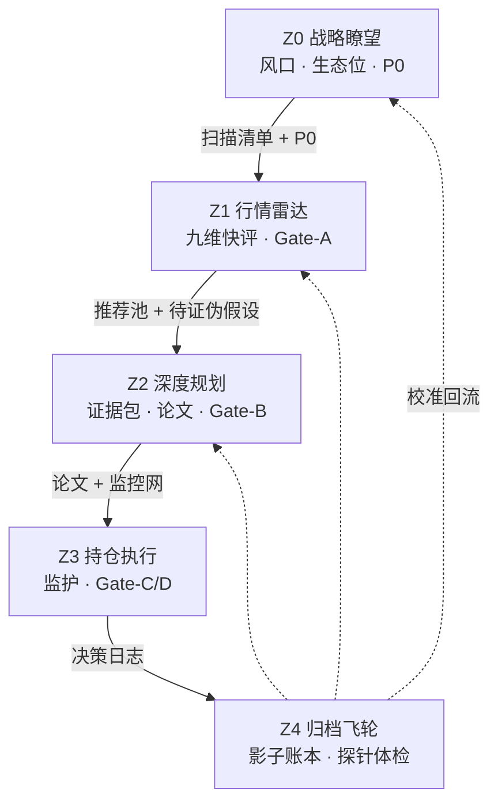

# 32 · 五区漏斗工作流与数据工程标准化规约（L3 · 产品工程总纲）

> **一句话**：把 Diting 从「四个好看的工作区 + 一堆指标」收敛为**一条可执行的产品工程标准**——**Z0 战略定方向 → Z1 雷达粗筛 → Z2 规划写论文 → Z3 执行双回路监护 → Z4 飞轮校准回流**；贯穿全程的脊椎是**买入论文（Thesis Contract）**，数据按 **T0～T3 复用半径**分层采集，决策按 **Gate 量化闸门 + 预注册日志 + 影子组合**问责。
>
> **文档定位**：本文是 **工作流 · 数据流 · 闸门 · 论文 · 探针 · 调度** 的**跨区总纲**；不替代 [25_](./25_四区漏斗_三段流水线_架构脊柱_设计.md) 的三段流水线细节、[28_](./28_执行中工作区_标的深度监控_T0-T2开发计划.md) 的单标的探针矩阵、[29_](./29_三大数据底座与任务调度架构契约.md) 的存储底座、[30_](./30_战略板块与滚动路线图_前端与数据契约.md) 的战略 UI 契约。

> [!NOTE] **[TRACEBACK] 战略追溯锚点**
> - **L1 哲学**：[06_投资哲学体系总纲](../../01_顶层概念/06_投资哲学体系总纲.md)（价值三角：安全性 > 确定性 > 收益率；逻辑链正确性；认知边界）
> - **L2 实践规划**：[06_标的深度分析与阶段判定实践规划](../../02_战略维度/06_跨维度协作/06_标的深度分析与阶段判定实践规划.md)
> - **架构脊柱**：[25_ 四区漏斗 + T0/T1/T2](./25_四区漏斗_三段流水线_架构脊柱_设计.md)
> - **战略升维**：[30_ 战略板块与滚动路线图](./30_战略板块与滚动路线图_前端与数据契约.md)（= 本文 **Z0**）
> - **执行探针**：[28_ 执行中 JL 矩阵](./28_执行中工作区_标的深度监控_T0-T2开发计划.md)（= 本文 **Z3 探针实例**）
> - **三底座**：[29_ PG/DeepSea/Redis](./29_三大数据底座与任务调度架构契约.md)
> - **防幻觉**：[22_ 事实交叉验证](./22_事实交叉验证与防幻觉规约.md)
> - **需求主表**：[24_ 行情解析与规划工作台](./24_行情解析与规划工作台_需求实现表.md)
> - **DNA**：[`dna_stage_1_启动期.yaml`](../_System_DNA/00_co_pilot/dna_stage_1_启动期.yaml) `funnel_pipeline_v3 / strategic_board_v1`
> - **L4 实践入口**：[04_/维度零/stage_1_启动期/](../../04_阶段规划与实践/00_维度零_AI投资副驾驶/stage_1_启动期/)

---

## §0 本文档管什么 / 不管什么

| 管 | 不管 |
|---|---|
| 五区**状态机、Gate 量化条件、交付物 DAG** | 单个 probe 的业务公式与 YAML 阈值（归 [28_](./28_执行中工作区_标的深度监控_T0-T2开发计划.md)） |
| **九维计分卡、论文对象、决策日志** JSON 契约 | T0/T1/T2 算子实现代码（归 L4 / `diting-src`） |
| **T0～T3 数据复用半径**与五区指标清单 | MinIO/PG/Redis 表结构细节（归 [29_](./29_三大数据底座与任务调度架构契约.md)） |
| **双回路决策**（认知 + 风控）与论文-价格背离协议 | 前端 Tab / HTMX 组件（归 [30_](./30_战略板块与滚动路线图_前端与数据契约.md) / 04_ 前端） |
| **采集 cron 调度总表**、首采长度原则 | P 轨 Spot ECS 起停（归 [共享平台基础](../共享平台基础/)） |
| **对抗法庭**模板 A/B/C/Bull + 证据包/`fact_layer` Schema | LLM 路由成本细目（归 [19_ 异构 AI 调度](./19_异构AI调度栈规约.md)） |
| **指标生产线**（`metric_registry` → `metric_store` → 证据包装配） | 各 `metric_id` 的 Python 采集器实现（归 L4 / `diting-src`） |

**永久红线**（继承 25_/28_）：no-mock · no-auto-execute · 晋级/清仓须人工确认或预注册规则触发 · advisory 不下单。

**与既有四区映射**（避免命名混乱）：

| 本文五区 | 25_ 四区漏斗 | 30_ 升维 | 典型 step |
|---|---|---|---|
| **Z0 战略瞭望** | ② 滚动路线图·宏观层 | 战略板块 + JL1/JL2 | step_15 / step_18 |
| **Z1 行情雷达** | ① 行情雷达 | — | step_14 |
| **Z2 深度规划** | ③ 规划中 | — | step_16 |
| **Z3 持仓执行** | ④ 执行中 | 战术甘特嵌套 | step_17 |
| **Z4 归档飞轮** | 横切（归档 + 校准回流） | 阶段复盘 | L4 实践记录 + Z4 脚本 |

---

<a id="design-32-goal"></a>

## §1 系统目标与工程约束

<a id="design-32-value-triangle"></a>

### §1.1 价值三角（优先级不可颠倒）

```
安全性（本金不可逆）> 确定性（能理解 + 能验证）> 收益率（90～180 天窗口）
```

| 转化路径 | 系统做什么 | 工程落点 |
|---|---|---|
| **认识论套利** | 跨源拼图 + 语义压缩，在共识形成前得出可执行结论 | Z1/Z2 九维 + 预期差 + 证据包 |
| **本金保护** | 交叉验尸 + 熔断门禁 | Z3 A9 硬中断 + D5/D7 否决 + P0 宏观熔断 |
| **纪律变现** | thesis 逻辑链持续监控，逻辑断即退出 | Z3 论文前提状态机 + 双回路 |

**工程铁律三条**（刻进最高层配置）：

1. **方向相反原则**：Z1 默认「找理由放过」；Z2/Z3 默认「找理由杀掉」。立场切换发生在 **Gate-A**。
2. **预注册原则**：跨 Gate 的买卖决定，执行前写入不可篡改 `decision_log`；事后补写逻辑无效。
3. **影子记账原则**：reject/清仓标的虚拟跟踪 90 天；**逻辑正确率**与**影子组合收益**并排展示。

### §1.2 认识论系统的可证伪要求（对冲「怎么都对」）

| 问题 | 错误做法 | 正确做法 |
|---|---|---|
| 价值账本 | 反事实「避雷省 ¥X」直接计入总价值 | **确认账** vs **嫌疑账**分离；仅事实证实后转确认账 |
| 决策正确性 | reject 后涨了也算对 → 系统永不犯错 | 过程指标（逻辑链）+ 结果裁判（影子组合）**双轨** |
| edge 是否存在 | 飞轮叙事、人格画像 | 飞轮转 **探针 precision**（年数千信号，样本够大） |

<a id="design-32-funnel"></a>

## §2 五区状态机与量化闸门

<a id="design-32-gates"></a>

### §2.1 证伪强度递增漏斗



**漏斗淘汰率基准**：Z1 收 100 → Z2 留 15～20 → Z3 持 1～3（单人带宽现实上限）。

### §2.2 五区速查

| 区 | 目的 | AI 角色 | 核心产出 | 量化闸门 |
|---|---|---|---|---|
| **Z0** | 选对风口，监控变天 | 趋势分析师 | 生态位五维评分 + **P0 宏观前提** + 扫描清单 | 生态位热度分达标 → 派 Z1 |
| **Z1** | 广度粗筛 | 筛子（九维 JSON） | 推荐池 + 待证伪假设 | **Gate-A**：攻击分 ≥ +4 且 D5/D7 ≥ 0 且 D9 ≥ +1 |
| **Z2** | 证伪 + 写合同 | 对抗法庭 Bear/Bull/Judge | **买入论文 P0～Pn** + 监控网 + Kill 条件 | **Gate-B**：全前提扛过 Bear + 预期差未定价 + Kill 已定 |
| **Z3** | 监护 + 交易 | 审计员（裁前提状态） | 增减清仓 + 预注册日志 | **Gate-C 建仓** / **Gate-D 退出**（见 §2.4） |
| **Z4** | 复盘 + 校准 | 评估员 | 影子账本 + 探针体检 + 论文尸检 | 连续 30 次逻辑正确但影子跑输基准 → 重建规则 |

### §2.3 九维通用语言（贯穿 Z1～Z3）

| 维度 | 类型 | 可证伪问题 | 评分 [-2,+2] | 主数据源 |
|---|---|---|---|---|
| **D1 行业地位** | 攻 | 份额/议价权上升、稳定还是下降？ | +2 绝对龙头扩张 / -2 份额流失 | 行业份额、同业营收 |
| **D2 技术壁垒** | 攻 | 护城河是什么？追平需多久？ | +2 代差 ≥2 年 / -2 随时可替代 | 拆解、专利、认证壁垒 |
| **D3 成长空间** | 攻 | 赛道 2～3 年需求斜率？ | +2 S 曲线加速 / -2 已过拐点 | 下游 Capex、TAM |
| **D4 盈利能力** | 攻 | 毛利率/ROE 趋势？ | +2 利润率扩张 / -2 商品化下滑 | 财报分部 |
| **D5 财务质量** | **守·否决** | 现金流/商誉/负债/应收暴雷？ | **≤ -1 一票否决** | 三表、审计、问询函 |
| **D6 估值水位** | 时机 | 历史/同业分位？预期打入多少？ | +2 低分位 / -2 透支 2 年 | PE/PB 分位、PEG |
| **D7 治理结构** | **守·否决** | 减持/关联交易损害中小股东？ | **≤ -1 一票否决** | 巨潮公告 |
| **D8 资金筹码** | 时机 | 北向/两融/情绪流向？ | +2 低位吸筹 / -2 过热派发 | 北向、两融、换手 |
| **D9 预期差** | 攻·核心 | 存在可验证、未定价的认知差？ | +2 明确预期差 / -2 纯共识追高 | 卖方一致预期 vs 判断 |

**运算规则**（施工级 · 见 `gates.yaml`）：

```
attack_score = D1 + D2 + D3 + D4 + D9     // 整数 ∈ [-10, +10]
缺失处理：任一攻击维 = null → 不可过 Gate-A（禁止用 0 顶替）
否决判定：min(D5, D7) <= veto_floor → veto=true（先于 attack_score）
时机判定：entry_ok = (D6 达阈值) AND (D8 拐点)  // 仅 Gate-C，不参与 attack_score
取整：每维评分 ∈ {-2,-1,0,1,2}，禁止小数
```

**Gate 参数化**（`gates.yaml` · 禁止硬编码在代码）：

```yaml
gate_a:
  attack_score_min: 4
  veto_floor: -1
  d9_min: 1
gate_c:
  valuation_percentile_max: 0.5
  flow_signal_required: true
gate_d:
  premise_dead_action: liquidate
  veto_action: liquidate
  impaired_action: trim_to_half
  double_overheat_action: take_profit_trim
```

**九维 vs P0-P5 关系**（同一指标底座、两种视图）：

| 视图 | 用途 | 产出区 | 消费方 |
|---|---|---|---|
| **九维 D1-D9** | 筛选/打分/否决/择时 | Z1 → Z2 | Gate-A/C；**模板 A/C 输入** `{nine_dim_scorecard}` |
| **前提 P0-P5** | 监控/退出合同 | Z2 → Z3 | Gate-D；模板 A 产出；探针挂载 |

> 指标采集见 [§5A](#design-32-metric-pipeline)；九维评分见 [§5A.8](#design-32-nine-dim-scoring)。

### §2.5 Gate-C / Gate-D 明细

**Gate-C 建仓**（埋伏 → 持仓，三条全满足）：

1. 论文前提全部存活
2. D6 估值进入可接受分位（非透支区）
3. D8 出现资金/情绪拐点（如北向转流入 + 缩量企稳）

**Gate-D 退出**（持仓 → 清仓/减仓）：

| 优先级 | 条件 | 动作 |
|---|---|---|
| 1 | **任一前提判定「死亡」** | 清仓（逻辑链断） |
| 2 | D5/D7 否决触雷 | **无条件清仓** |
| 3 | 前提「受损」未死 | 减仓至半仓 |
| 4 | D6 + D8 双过热 | 止盈减仓（前提完好也可减） |
| 5 | **回路 2 风控**（见 §10） | 按背离协议减仓（不论论文） |

### §2.6 交付物 DAG（数据依赖链）

| 关口 | 上游产出 | 下游消费 |
|---|---|---|
| **Z0→Z1** | 高分生态位清单、P0、扫描主题 | Z1 只在清单内扫描 |
| **Z1→Z2** | 九维基线、待证伪假设 | Z2 证伪靶子 + 证据包起点 |
| **Z2→Z3** | 论文 P0～Pn、13 轴监控网、Kill 条件 | Z3 日更监护 |
| **Z3→Z4** | 预注册决策日志、前提快照 | Z4 影子对账 |
| **Z4→上游** | 探针 precision、尸检 | 修正 Z0 生态位 / Z1 权重 / Z2 探针 |

**依赖顺序不可跳**：即使先买入（Z3），也必须 **Z0 → Z1 → Z2 倒灌补齐** 后才能进入「正式持仓」监护。

<a id="design-32-thesis"></a>

## §3 买入论文（Thesis Contract）对象契约

### §3.1 定义

**论文不是散文，是买入合同**：「我因相信 A、B、C 而持有；任一前提死亡即卖。」

### §3.2 论文 JSON Schema（系统地基 · `thesis.json`）

```json
{
  "symbol": "601138",
  "name": "工业富联",
  "zone_state": "pending_registration",
  "entry_date": "2026-XX-XX",
  "premises": [
    {
      "id": "P0",
      "type": "macro",
      "statement": "AI算力基建风口未反转",
      "death_criteria": "下游云厂集体下修明年 Capex 指引",
      "probe_refs": ["Z0.regime_monitor", "axis.demand_csp"],
      "status": "intact",
      "last_check": "2026-XX-XX",
      "evidence_refs": ["E1", "E2"]
    }
  ],
  "surprise": {
    "consensus": "卖方一致预期摘要",
    "my_view": "我的偏离判断",
    "verification_signal": "靠什么验证",
    "priced_in": false
  },
  "risk_params": {
    "normal_band_pct": 12,
    "circuit2_trim_pct": 15,
    "max_drawdown_pct": 25,
    "investigation_days": 5
  },
  "entry_conditions": "D6 回中位 + D8 北向转流入",
  "reentry_signals": "前提修复 + 估值回归 + 情绪出清",
  "position_cap_pct": 20,
  "signed_by": "user",
  "signed_at": "2026-XX-XXT..."
}
```

**前提 ID 约定**：

| ID | 归属 | 典型内容 |
|---|---|---|
| **P0** | Z0 下沉 | 宏观/风口总前提（一键熔断） |
| **P1～Pn** | Z2 证伪 | 需求、份额、价值量、治理、情绪等 |

**前提 status 枚举**（与模板 C v2 一致）：

| 值 | 含义 | 典型触发 |
|---|---|---|
| `intact` | 完好 | 无反面证据 |
| `impaired` | 受损 | 探针/基本面可解释恶化 |
| `impaired_market_doubt` | 受损-市场质疑 | 回路 2：聪明钱撤离且不可解释 |
| `dead` | 死亡 | Kill Criteria 命中 |

**状态迁移规则**（仅允许以下转换；每次转换写 `decision_log`）：

```
intact ──探针可解释恶化──▶ impaired
intact ──回路2不可解释异动──▶ impaired_market_doubt
impaired ──基本面恢复──▶ intact
impaired ──Kill命中──▶ dead
impaired_market_doubt ──调查盒内证伪/查清──▶ intact
impaired_market_doubt ──超时仍不可解释 / Kill──▶ dead
dead ──终态──▶ Gate-D；再入场须新建论文（禁止 dead→intact 直接跳回）
```

**字段类型字典**（`thesis.json` / `premises[]`）：

| 字段 | 类型 | 必填 | 说明 |
|---|---|---|---|
| `symbol` | string | ✅ | 6 位代码 |
| `zone_state` | enum | ✅ | `pending_registration` \| `formal` \| `archived` |
| `premises[].id` | enum | ✅ | `P0`…`P5`（启动期固定 6 条） |
| `premises[].status` | enum | ✅ | 见上表 |
| `premises[].death_criteria` | string | ✅ | 可触发客观信号 |
| `premises[].probe_refs` | string[] | ✅ | 探针轴或 Z0 键 |
| `premises[].evidence_refs` | string[] | ✅ | 槽位 `EVD.*` 或 metric_id |
| `risk_params.*` | number | ✅ | 见 §9.2 |
| `position_cap_pct` | number | ✅ | 单标的上限（默认 20，见 §13.4） |

### §3.2a `evidence_pack.json` Schema（Layer4 · 装配产出）

```json
{
  "symbol": "601138",
  "collected_at": "2026-06-14T18:00:00Z",
  "collector": "evidence_pack_builder",
  "slots": [
    {
      "slot_id": "EVD.P1.csp_capex_guidance",
      "status": "filled",
      "value": "微软 FY26 Capex 指引同比约 +35%……",
      "raw_quote": "原文引述",
      "source": {"name": "MSFT earnings call", "url": "https://...", "tier": 1},
      "source_metric": "M.sector.capex_total",
      "as_of": "2026-04-XX",
      "shared": true,
      "verified_by_human": true
    }
  ],
  "overall": {"filled": 28, "missing": 2, "blocking": false}
}
```

- `status`: `filled` \| `MISSING`
- `blocking=true`：任一 **P0/P4** 的 `required` 槽位为 `MISSING`
- `verified_by_human=false` 且 `tier>1` → 模板 A 引用时置信度封顶 0.5

### §3.2b `fact_layer.json` Schema（规则引擎 · 禁止 LLM 生成）

```json
{
  "symbol": "601138",
  "as_of": "2026-06-14",
  "price": {
    "close": 0.0,
    "vs_cost_pct": -12.3,
    "drawdown_from_peak_pct": -18.0,
    "ma_state": "below_ma20",
    "volume_signal": "放量下跌"
  },
  "capital_flow": {
    "northbound_net_5d": -3.2,
    "northbound_net_20d": -8.1,
    "margin_balance_chg_5d_pct": -4.5,
    "turnover_percentile_2y": 0.95
  },
  "cross_market": {
    "mapped_5d_pct_avg": -5.1,
    "self_5d_pct": -18.0,
    "is_idiosyncratic": true
  },
  "sector": {"sector_index_5d_pct": -5.5, "relative_strength_pct": -12.5},
  "risk_param_breach": {
    "normal_band": false,
    "circuit2_trim": true,
    "max_drawdown": false
  }
}
```

**编排层**：`circuit2_trigger = risk_param_breach.circuit2_trim && 认知模式仍 intact`（不由 LLM 判定）。

### §3.3 预注册决策日志（`decision_log.json`）

```json
{
  "date": "2026-XX-XX",
  "symbol": "601138",
  "action": "hold",
  "premises_snapshot": {"P0": "intact", "P1": "impaired"},
  "reason": "P1 受损来自可解释赛道 β，非前提死亡",
  "expected": "5 个交易日内验证",
  "kill_review_date": "2026-XX-XX",
  "judge_consistency": "2/2",
  "circuit2_triggered": false,
  "circuit2_reason": null,
  "override": null
}
```

`circuit2_triggered=true` 时须填 `circuit2_reason`（归因 + 矩阵档位），与认知回路理由分开。

### §3.4 论文生产流水线（Z2 · 禁止凭空起草）

```
metric_registry 采集计算 → metric_store
        ↓ evidence_pack_builder（按 thesis_slot_template + binding）
   evidence_pack.json + nine_dim_scorecard（Z1 已有）
        ↓ 模板 A → B(Bear) → C(Judge) ×2 → 用户签字
   thesis.json
```

| 步骤 | 执行者 | 动作 |
|---|---|---|
| **2.0 指标** | 采集任务（§5A + §7） | T0/T1/T2 共享 + T3 定制 → `metric_store` |
| **2.1 装配** | `evidence_pack_builder` | 按槽位模版 + binding 自动提货 |
| **2.2 九维** | Z1 评分器（§5A.4） | 产出 `{nine_dim_scorecard}` |
| **2.3 起草** | 模板 A | 消费 `evidence_pack` + 九维；禁止记忆填数 |
| **2.4 攻击** | 模板 B（Bear 独立会话） | 禁止泄露持仓 |
| **2.5 裁决** | 模板 C × 2 | 认知/风控模式 |
| **2.6 签字** | 用户 | 写入 `thesis.json` |

**完整提示词正文见 [§10（v2 双回路优化版）](#design-32-prompt-templates)**。

**已持仓回溯立案**（`zone_state: pending_registration`）：

- **不退区**：客观在 Z3，子状态「待立案」
- **7 日期限**：Z0→Z1→Z2 倒灌；核心问题：**「若现在空仓，还会按当前价买吗？」**
- 论文被 Bear 杀死且无法修复 → 清仓（沉没成本不是理由）

<a id="design-32-data-layers"></a>

## §4 三层运行时数据（L1 / L2 / L3）

| 层 | 是什么 | 运行方式 | 决策角色 |
|---|---|---|---|
| **L1 事实层** | 价/量/均线、北向、两融 | 日更（必要时盘中），纯规则 | 仪表盘；回路 2 输入 |
| **L2 探针层** | 13 轴（或 28_ JL 矩阵实例） | **事件驱动**，非每日全跑 | 前提死活报警 |
| **L3 决策上下文** | 决策会临时打包 | **仅触发时** | Bear/Bull/Judge 全量输入 |

**日常节奏**：L1 刷新 + L2 监听 → **不做全面判断**  
**报警时**：召开决策会 → L3 打包 L1 + L2 + 基本面 + P0

<a id="design-32-reuse-tiers"></a>

## §5 数据复用半径（T0～T3）

| 层级 | 复用半径 | 含义 | 采集策略 |
|---|---|---|---|
| **T0** | 全市场 | 宏观、大盘、汇率、利率 | 采一次，全系统共享 |
| **T1** | 赛道 | 云厂 Capex、CoWoS、地缘框架 | 按赛道一份 |
| **T2** | 生态位 | 组装/代工环节（铜缆 vs CPO、份额格局） | 按生态位一份 |
| **T3** | 单标的 | 治理、映射股、非 AI 业务、技术面数值 | 每标的单独 |

**13 轴模板 vs 实例**（结构可复用，数据分公用/定制）：

| 探针轴 | 复用 | 说明 |
|---|---|---|
| A1 需求 / A4 代际 / A5 供应 / A6 地缘 / A7 新市场 | T1 | 赛道内共享 |
| A2 份额 / A3 价值量 | T2 | 生态位共享；对手列表定制 |
| A8～A13 + A6 产地细节 | T3 | 标的定制 |
| A10/A13 算法 | T0 方法 + T3 数值 | schema 固定，值随标的 |

> **与 [28_](./28_执行中工作区_标的深度监控_T0-T2开发计划.md) 关系**：28_ 的 `601138` Profile 是 **Z3 执行探针实例**；本文 **§5A** 是 **Z2 写论文 + Z1 九维** 的指标底座，二者通过 `probe_refs` / `map_slot` 对齐。

<a id="design-32-metric-pipeline"></a>

## §5A 指标生产线（写论文前的数据底座）

### §5A.0 四层数据流（施工主链）

```
Layer1 metric_registry.yaml     通用指标定义（标的无关：采什么/怎么算/复用层级）
        ↓ 采集+计算（§7 cron）
Layer2 metric_store             已计算指标值（T0/T1/T2 共享；T3 按 symbol）
        ↓ evidence_pack_builder
Layer3 thesis_slot_template     通用前提-槽位模版（P0-P5 bind metric_id）
     + binding/{symbol}.yaml    标的绑定（sector/niche/peer_list/mapped_list）
        ↓
Layer4 evidence_pack.json       自动装配 → 喂模板 A；nine_dim_scorecard → Z1/Z2
```

**配置文件落点**（`diting-src/apps/copilot/`）：

| 文件 | 层级 | 换标的是否改 |
|---|---|---|
| `metrics/metric_registry.yaml` | L1 | 否（增指标才改） |
| `thesis/thesis_slot_template.yaml` | L3 基线 | 否（生态位特化另建 `thesis_slot_template_{niche}.yaml`） |
| `thesis/binding/601138.yaml` | L3 绑定 | **每标的一份** |
| `metrics/pipeline.py` + `thesis/evidence_pack_builder.py` | L2→L4 | 否 |

**列说明**：**复用**列 — `通用T0/T1/T2`=换标的不重采；`定制T3`=换标的重采；`衍生`=由已有指标计算。

### §5A.1 层 P0 · 宏观/风口

| 指标 | 复用 | 一手源 | 首采 | 增量 | 计算 |
|---|---|---|---|---|---|
| GDP/PMI/工业增加值 | 通用T0 | 国家统计局 | 15年 | 月/季 | 原值+同比 |
| 社融/M2/利率 | 通用T0 | 中国人民银行 | 15年 | 月 | 原值+同比 |
| 美国利率/流动性 | 通用T0 | 美联储、BEA | 10年 | 月/事件 | 原值 |
| 赛道产业政策方向 | 通用T1 | 发改委、工信部、Federal Register | 滚动12月 | 事件 | LLM 抽取 enum |
| 赛道下游 Capex 总量 | 通用T1 | 四大云厂 IR、SEMI | 8季 | 季 | 求和+同比 |
| 生态位利润分布 | 通用T2 | 产业链财报汇总 | 5年 | 季 | 各环节净利占比 |
| 风口 S 曲线阶段 | 通用T2 | Z0 生态位评分 | — | 季 | 规则(基建/爆发/过剩) |

### §5A.2 层 P1 · 客户需求

| 指标 | 复用 | 一手源 | 首采 | 增量 | 计算 |
|---|---|---|---|---|---|
| 四大云厂 Capex 指引 | 通用T1 | 法说会 transcript | 8季 | 季 | 原值+同环比 |
| Capex 指引方向 | 通用T1 | 同上 | 4季 | 季 | LLM(上修/维持/下修) |
| 主权 AI/大单 | 通用T1 | 招标/FDI 公告 | 滚动12月 | 事件 | 事件+金额 |
| 标的订单能见度 | 定制T3 | 标的法说会/月报 | 4季 | 季 | LLM 引述 |

### §5A.3 层 P2 · 份额竞争

| 指标 | 复用 | 一手源 | 首采 | 增量 | 计算 |
|---|---|---|---|---|---|
| 标的月营收 | 定制T3 | MOPS、巨潮月报 | 5年 | 月(11日) | 同环比 |
| 同业月营收 | 定制T3 | MOPS（peer_list） | 5年 | 月 | 同环比 |
| 估算份额 | 定制T3 | 上两项 | — | 月 | self/(self+Σpeers) |
| 价格战信号 | 通用T2 | Digitimes 等 | 滚动6月 | 事件 | LLM+置信度 |
| 配额/顺位变化 | 通用T2 | NVDA 伙伴名单 | 滚动12月 | 事件 | LLM 抽取 |

### §5A.4 层 P3 · 产品价值量/技术替代

| 指标 | 复用 | 一手源 | 首采 | 增量 | 计算 |
|---|---|---|---|---|---|
| 高价值组件自供率 | 定制T3 | 子公司月报、BOM | 8季 | 月/季 | 原值 |
| 单机柜 ASP | 通用T2 | 拆解报告 | 最新2-3份 | 事件 | 趋势 |
| 替代技术时间表 | 通用T1 | 产业白皮书、GTC | 滚动12月 | 事件 | LLM+日期 |
| 液冷形态演进 | 通用T2 | OCP、供应链法说 | 滚动12月 | 事件 | LLM |

> **生态位特化**：组装代工（FII）用铜缆/CDU；光模块（新易盛）换为 800G→1.6T 升级、EML 自供、CPO/LPO 渗透（见 §12.6）。

### §5A.5 层 P4 · 治理财务（否决维 · 最高优先级）

| 指标 | 复用 | 一手源 | 首采 | 增量 | 计算 |
|---|---|---|---|---|---|
| 经营性现金流 | 定制T3 | 巨潮现金流量表 | 5年 | 季 | 同比 |
| 关联交易额度 | 定制T3 | 巨潮公告 | 3年 | 事件 | 同比+占比 |
| 减持/质押 | 定制T3 | 巨潮、披露易 | 3年 | **实时** | 事件标记 |
| 应收/商誉异动 | 定制T3 | 巨潮资产负债表 | 5年 | 季 | 占营收比 |
| 有息负债/现金比 | 定制T3 | 巨潮 | 5年 | 季 | 比值 |
| 审计/问询函 | 定制T3 | 巨潮 | 3年 | 事件 | 事件标记 |

**硬中断**（零 LLM）：减持/问询/关联交易暴增 → 巨潮 RSS 关键词 → 直通 Gate-D。

### §5A.6 层 P5 · 估值情绪（时机维）

| 指标 | 复用 | 一手源 | 首采 | 增量 | 计算 |
|---|---|---|---|---|---|
| PE/PB 历史分位 | 定制T3(算法通用) | 交易所+财报 | 10年 | 日 | percentile |
| 北向净额 | 定制T3 | 港交所 CCASS | 2017起 | 日(T+1) | 5/20日滚动 |
| 两融占流通市值 | 定制T3 | 交易所 | 全量 | 日 | 占比+2年分位 |
| 换手率分位 | 定制T3 | 交易所 | 2年 | 日 | 分位 |
| 卖方一致预期 | 定制T3 | 研报汇总 | 4季 | 周 | surprise=实际-一致 |
| 舆情情绪 | 定制T3(算法通用) | 股吧/雪球 | 2年 | 日 | 情绪+极值分位 |

### §5A.7 层 L1 · 事实层/技术面（回路 2 · 规则引擎）

| 指标 | 复用 | 一手源 | 首采 | 增量 | 计算 |
|---|---|---|---|---|---|
| 行情日线 | 定制T3 | 交易所 | 10年 | 日/盘中 | 原值 |
| 均线状态 | 定制T3(算法) | 行情衍生 | 1年 | 日 | MA5/20/60 |
| 自峰值回撤 | 定制T3 | 行情衍生 | 建仓起 | 日 | (现-峰)/峰 |
| 量价信号 | 定制T3(算法) | 行情衍生 | 1年 | 日 | 量×价判定 |
| 映射异动 | 定制T3 | TWSE/同业（binding） | 1年 | 盘中 | 特异性判定 |
| 赛道相对强度 | 定制T3 | 赛道指数 | 2年 | 日 | 标的-指数 |

<a id="design-32-nine-dim-scoring"></a>

### §5A.8 九维专属指标与评分（`nine_dim_scoring.yaml`）

九维 **80% 复用 §5A.1～P5 指标**；下表为 **需额外采集/衍生** 项 + 评分规则：

| 维度 | 复用指标 | 九维专属补充 | 评分 → [-2,+2] |
|---|---|---|---|
| D1 行业地位 | P2 份额 | 客户集中度（财报附注） | 份额升+2 / 平0 / 流失-2 |
| D2 技术壁垒 | P3 自供/替代 | 专利存量、认证壁垒(LLM) | 代差≥2年+2 / 可替代-2 |
| D3 成长空间 | P0/P1 Capex、S曲线 | TAM（行业研报） | 加速+2 / 拐点-2 |
| D4 盈利能力 | — | **毛利率/ROE 趋势**（巨潮） | 扩张+2 / 下滑-2 |
| D5 财务质量 | P4 全部 | — | 干净0 / **≤-1 否决** |
| D6 估值 | P5 PE分位 | **PEG**（衍生） | 低分位+2 / 透支-2 |
| D7 治理 | P4 减持/关联交易 | — | 干净0 / **≤-1 否决** |
| D8 筹码 | P5 北向/两融/换手 | — | 吸筹+2 / 过热-2 |
| D9 预期差 | P5 一致预期、P1 surprise | 催化是否 price-in | 未定价+2 / 追高-2 |

**九维输出**（Z1 → Z2，`nine_dim_scorecard.json`）：

```json
{
  "symbol": "601138",
  "scores": {"D1": 2, "D2": 1, "D3": 2, "D4": 1, "D5": 0, "D6": -1, "D7": 0, "D8": 1, "D9": 1},
  "attack_score": 7,
  "veto": false,
  "entry_ok": false,
  "as_of": "2026-06-14"
}
```

**computation.method 枚举**（`metric_registry` 必填）：

| method | 含义 |
|---|---|
| `raw_value` | 直接取数 |
| `yoy_qoq` | 同环比 |
| `percentile` | 历史分位 |
| `rolling_sum` | 滚动求和 |
| `ratio_share` | 份额比 |
| `relative_compare` | 映射/特异性 |
| `aggregate` | 汇总 |
| `llm_extract` | 语义抽取 |
| `event_flag` | 事件标记 |

<a id="design-32-zone-data"></a>

## §6 五区数据指标规范

### §6.0 列说明（首采长度单位）

| 列 | 含义 |
|---|---|
| **复用** | T0～T3 复用半径（见 §5） |
| **一手源** | 推荐官方/一手数据来源 |
| **首采** | **首次入库须回填的历史长度**（见下表单位） |
| **增量** | 首次全量入库后的更新节奏 |
| **执行时间** | 建议 cron / 批处理触发点 |

**首采长度单位**（本文统一写法）：

| 缩写 | 中文 | 含义 | 示例 |
|---|---|---|---|
| **y** | **年** | 按自然年或 rolling 年窗口回填 | `15y` = 回填 **15 年**历史 |
| **季** | 季度 | 财报季数 | `8季` = 最近 8 个季度 |
| **滚动 Ny** | 滚动 N 年 | 语料库只保留最近 N 年，旧数据淘汰 | `滚动 3y` = **滚动 3 年**政策语料 |
| **2017～** | 自某年起 | 数据源可用起点 | 北向自沪股通开通年 |
| **—** | 无历史回填 | 仅增量采集 | 公告 RSS 实时接入 |

> **说明**：早期草稿用 `15y`、`3y` 是机构文档常见的 **year 缩写**；规约正文以 **「N 年」** 为主，`y` 仅在表格缩写列保留，含义相同。

### §6.1 Z0 战略瞭望

| 指标 | 复用 | 一手源 | 首采 | 增量 | 执行时间 |
|---|---|---|---|---|---|
| GDP/PMI/社融 | T0 | 国家统计局、央行 | **15 年** | 月/季 | 发布日+1 |
| 产业政策 | T0/T1 | 发改委、工信部、国务院 | **滚动 3 年**语料 | 事件 | 日轮询 |
| 云厂 Capex 总量 | T1 | 云厂 IR、SEMI | **5 年** | 季 | 财报季 |
| 生态位利润分布 | T1/T2 | 产业链财报汇总 | **5 年** | 季 | 财报季 |

**Z0 产出资产**：① 产业生态地图 ② 阶段路线图 ③ 风向监控盘（正常/预警/反转）

**生态位五维（E1～E5）**：利润卡位 / 稀缺卡脖子 / 政策顺逆 / 阶段契合 / 持续性 → 热度分 → 派 Z1 扫描清单。

### §6.2 Z1 雷达

| 指标 | 复用 | 一手源 | 首采 | 增量 | 执行时间 |
|---|---|---|---|---|---|
| 行情日线 | T3/方法 T0 | 交易所 | **10 年** | 日 | T 日 18:00 |
| 估值分位 | T3/方法 T0 | 交易所+财报 | **10 年** | 日 | T 日 18:00 |
| 财报核心科目 | T3 | 巨潮 cninfo | **5 年** | 季 | 披露日 |
| 北向/两融 | T3/方法 T0 | 港交所 CCASS / 交易所 | **2017 年～**（开通起） | 日 | T+1 09:00 / T 日晚 |

### §6.3 Z2 规划

| 指标 | 复用 | 一手源 | 首采 | 增量 | 执行时间 |
|---|---|---|---|---|---|
| 财报全文/附注 | T3 | 巨潮 | **5 年** | 季 | 披露日 |
| 法说会 transcript | T1/T3 | 公司 IR | **8 季** | 季 | 会后 24h |
| 关联交易/减持 | T3 | 巨潮 | **3 年** | 事件 | 日轮询 |
| 台股月营收 | T2/T3 | 台湾 MOPS | **5 年** | 月 | **每月 11 日** |
| 卖方一致预期 | T3 | 研报汇总 | **4 季** | 周 | 周末 |

### §6.4 Z3 执行

| 指标 | 复用 | 一手源 | 首采 | 增量 | 执行时间 |
|---|---|---|---|---|---|
| L1 事实层 | T3 | 交易所 | **1 年** | 日/盘中 | T 日 18:00 |
| A9 公告硬中断 | T3 | 巨潮 RSS | **—**（仅增量） | **实时** | 盘中每 30min |
| A11 台股映射 | T3 | TWSE | **1 年** | 盘中 | 台股时段 |
| A1/A6 语义 | T1 | RSS + IR + Federal Register | **滚动 2～3 年** | 事件 | 日批 20:00 + 实时 |
| A13 拥挤温度 | T3/方法 T0 | 换手/两融/舆情 | **2 年** | 日 | T 日 18:00 |

### §6.5 Z4 飞轮（内部生成）

| 数据 | 来源 | 频率 |
|---|---|---|
| 影子组合净值 | 系统记账 | 日 |
| 探针 precision | 人工标注 + 回测 | 月 |
| 论文版本链 | `thesis.json` 修订 | 事件 |

<a id="design-32-cron"></a>

## §7 全系统采集调度总表

```
【实时/盘中】
  09:30-15:00  A9 公告 RSS（每 30min）+ A11 台股映射（台股时段）

【每日 T+1 09:00】
  北向持股（CCASS）

【每日 T 18:00】
  行情/估值/两融/L1/A13 → Daily Digest

【每日 20:00】
  新闻去重 → 粗筛 → A1/A6 语义探针（embedding 过滤 >95%）

【每月 11 日】
  台股月营收 → A2/A11

【每周周末】
  卖方一致预期 → 预期差重算

【事件驱动】
  财报/法说会/重大公告 → 深度复核 + 决策会候选

【每月 1 日】
  Z4 影子对账 + 探针 precision 体检

【每季】
  Z0 生态位重估 + 论文全文复核
```

**首采长度原则**（单位见 [§6.0](#design-32-zone-data)）：

| 类型 | 长度 | 原因 |
|---|---|---|
| 估值分位 | **10 年** | 覆盖完整牛熊 |
| 行情复权 | **10 年**（或上市起） | 长周期均线、回测 |
| 财报趋势 | **5 年**（20 季） | 一个产业周期 |
| 北向 | **2017 年～** | 沪股通开通起 |
| 语义语料 | **滚动 2～3 年** | 措辞基线 + point-in-time |
| 宏观 | **15 年** | 多经济周期 |

存储落点见 [29_ §1](./29_三大数据底座与任务调度架构契约.md)：数值 → PG/Timescale；长文 → DeepSea 对象湖 + Dispatcher；任务 → Redis ARQ。

<a id="design-32-probes"></a>

## §8 13 轴探针模板与前提映射

### §8.1 正交双向轴（消除共线性）

每轴输出 `[-100, +100]` + 置信度；镜像因子合并为同一轴正负端。

| 轴 Key | 正端（Alpha） | 负端（Risk） | 半衰期 |
|---|---|---|---|
| `axis.demand_csp` | Capex 上修 | ROI 寒冬/砍单 | 90d |
| `axis.share_nvda` | 配额提升 | 白牌化/价格战 | 60d |
| `axis.content_value` | 铜缆/CDU 自供↑ | CPO 替代提前 | 120d |
| `axis.next_gen` | 代际卡位 | 代际旁落 | 180d |
| `axis.supply_chain` | 瓶颈缓解 | CoWoS/HBM/电力卡死 | 90d |
| `axis.geopolitics` | 关税豁免 | 关税/制裁/台海升级 | 事件分档 |
| `axis.new_markets` | 主权 AI/ASIC 落地 | 大单流标 | 180d |
| `axis.execution` | 良率/降本 | 漏液/召回 | 90d |
| `axis.governance` | 分红回购 | 减持/关联交易 | 30d |
| `axis.flow_chips` | 北向/机构增持 | 资金流出/过热 | 10d |
| `axis.cross_market` | 台股领先传导 | 同左（双向） | 1～3d |
| `axis.non_ai_business` | 苹果链/汇兑利好 | 砍单/汇损 | 60d |
| `axis.crowding_thermometer` | — | 情绪极值/拥挤 | 10d |

### §8.2 探针输出 Schema（强制 · 对接 [22_](./22_事实交叉验证与防幻觉规约.md)）

```json
{
  "axis": "axis.geopolitics",
  "event_cluster_id": "EC-20260614-0042",
  "polarity": -1,
  "raw_score": -72,
  "surprise_score": -55,
  "confidence": 0.81,
  "source_tier": 1,
  "evidence_spans": ["原文引用，必填"],
  "first_seen_utc": "2026-06-14T03:12:00Z",
  "half_life_days": 30,
  "corroboration": {
    "independent_sources": 2,
    "structured_sidecar": "鸿海2317盘中-4.2%",
    "passed_gate": true
  },
  "fact_gate_status": "verified_strong"
}
```

无 `evidence_spans` 或 `fact_gate_status` 非 strong/weak → **观察队列**，不得进 Gate-D。

### §8.3 维护 Tier（单人带宽）

| Tier | 轴 | 频率 | 实现 |
|---|---|---|---|
| **T1 硬中断** | A9 治理 | 盘中实时 | RSS + 关键词，**零 LLM** |
| **T1 日更** | A10/A11/L1 | 日批 | API + 规则 |
| **T2 事件语义** | A1/A6 | 事件 | RSS 粗筛 → LLM 深读 |
| **T3 月复核** | A2/A3/A5/A12 | 月 | 人工 + LLM |
| **T4 季审视** | A4/A7/A8 | 季 | 财报/GTC |

**覆盖率验收**（每季）：每条 P0～Pn 有 ≥1 探针；每个探针映射到某条前提，否则删除。

### §8.4 `raw_score` / `surprise_score` 计算归属

| 轴类型 | raw_score [-100,+100] | surprise_score |
|---|---|---|
| **结构化**（A9/A10/A11/A13、L1） | **规则函数**，无 LLM | `raw - consensus_baseline`；无基线则 `baseline_available=false`，surprise=raw |
| **语义**（A1/A6 等） | LLM 固定 rubric + `evidence_spans` | 基线来自卖方一致预期（Z2 周末更新）或 sector 一致口径 |

**入库门控**（对接 [22_](./22_事实交叉验证与防幻觉规约.md)）：

- 仅当 `fact_gate_status ∈ {verified_strong, verified_weak}` **且**（`independent_sources≥2` 或 `source_tier=1`）→ 进决策层
- 否则 → **观察队列**（不得触发 Gate-D 自动清仓，除 A9 硬中断）

<a id="design-32-dual-loop"></a>

## §9 双回路决策与论文-价格背离协议

### §9.1 双回路

| 回路 | 问题 | 触发 | 性质 |
|---|---|---|---|
| **回路 1·认知** | 为什么相信它值钱？ | 前提死亡 | 慢 · 价值 |
| **回路 2·风控** | 错了最多亏多少？ | 回撤/聪明钱撤离 | 快 · 风险 |

**独立触发**：论文完好 + 价格突破容忍带 → **回路 2 仍可减仓**。

### §9.2 论文内嵌风控参数（`risk_params`）

| 字段 | 典型值 | 含义 |
|---|---|---|
| `normal_band_pct` | ±12% | 正常波动带 |
| `circuit2_trim_pct` | -15% 自峰值 | 回路 2 减仓线 |
| `max_drawdown_pct` | -25% | 无条件清仓线 |
| `investigation_days` | 5 | 不可解释异动调查盒 |

### §9.3 背离协议流程

1. **归因**：赛道 β vs 特异性（A11 台股同跌？）
2. **聪明钱**：北向/两融/大股东（A9）
3. **决策矩阵**（能否解释 × 聪明钱是否撤离）→ 持有 / 减 1/3 / 减 1/2 / 底仓
4. **时间盒**：5 日仍不可解释 → 继续减
5. **前提降级**：持续不可解释异动 → 相关前提 `impaired_market_doubt`

**铁律**：纯语义致命信号最高自动权限 = 减半仓；**清仓需结构化证据或人工签字**（除 `max_drawdown_pct` 硬线）。

<a id="design-32-adversarial"></a>

## §10 对抗法庭与 Opus 标准提示词（A / B / Bull / C · v3）

<a id="design-32-prompt-templates"></a>

### §10.0 模板版本演进（当前 = **v3 施工就绪版**）

| 版本 | A | B | C | 其它 |
|---|---|---|---|---|
| v0 | 凭记忆起草 | Bear | 趋势判官 | — |
| v1 | 仅证据包 | Bear | 裁前提 | — |
| v2 | +九维/consistency | +禁止编造数字 | 认知+**风控**双模式；`fact_layer` | 模板 **Bull** |
| **v3（现行）** | **强制 P0-P5** + `{nine_dim_scorecard}` + 槽位 `EVD.*` + `evidence_health` | `attack_strength` 枚举可机械消费 | +`{evidence_health}` blocking；D5/D7→dead | 消费 **装配好的** `evidence_pack`；**文本标的无关** |

> **A/B/C/Bull 四段 prompt 文本通用**；换标的只换 `evidence_pack` / `binding` / 采集任务，**不改模板正文**。

### §10.1 模板一览与调用约定

| 模板 ID | 角色 | 模型建议 | 会话隔离 | 用途 |
|---|---|---|---|---|
| **模板 A** | Analyst 起草 | Opus 4.8 / 5 | 与 B/C **分开** | 基于证据包产出 `premises[]` 草案 |
| **模板 B** | Bear 攻击 | Opus 4.8 / 5 | **必须独立新会话** | 逐条攻击前提；禁止泄露持仓立场 |
| **模板 C** | Judge 裁决 | Opus 4.8 / 5 | 可与 A/B 同线程或独立 | **认知模式**：裁前提状态；**风控模式**（§10.5.2）：论文-价格背离；均 **连续跑 2 次** |
| **模板 Bull** | Bull 辩护 | Opus 4.8 / 5 | 独立新会话 | 决策会；与 Bear 对称 |

**占位符**（实现时替换）：

| 占位符 | 含义 |
|---|---|
| `{symbol}` | 标的代码，如 `601138` |
| `{name}` | 标的名称，如 `工业富联` |
| `{evidence_pack}` | 装配好的 `evidence_pack.json`（§3.2a） |
| `{evidence_slots}` | 只读槽位字典（`thesis_slot_template`） |
| `{nine_dim_scorecard}` | Z1 九维评分卡（§5A.8） |
| `{evidence_health}` | 证据包 `overall` + 模板 A 的 `overall_evidence_health` |
| `{premises_json}` | 模板 A 产出或 `thesis.json` 的 `premises` |
| `{bear_report}` | 模板 B 产出全文 |
| `{bull_report}` | 模板 Bull 产出（决策会必填） |
| `{fact_layer}` | **机械事实层**（不经 LLM）：价/量/均线/峰值回撤/北向/两融/台股映射/赛道 β |
| `{market_signals}` | L2 探针新报警 + 语义信号摘要 |
| `{risk_params}` | `thesis.json` 的 `risk_params` JSON |
| `{circuit2_trigger}` | 是否触发回路 2：`true` / `false` |

**代码落点建议**：`diting-src/apps/copilot/prompts/thesis_template_a.md` 等；调用时注入占位符。

**Opus 职责边界（v2 铁律）**：

- **只裁「前提状态」**，**禁止**输出「看涨/看跌/目标价/价格方向」——价格描述只出现在 `{fact_layer}`，由规则引擎生成。
- **回路 1**：前提 `death` → 认知回路清仓/减仓（见 Gate-D）。
- **回路 2**：论文仍 `intact` 但 `{circuit2_trigger}=true` → 按 §10.5.2 背离矩阵减仓；**风控可独立于论文触发**。

### §10.2 槽位模版与绑定（Layer3 · 施工配置）

**通用槽位模版** `thesis/thesis_slot_template.yaml`：P0-P5 各槽位 `bind: M.*`（metric_id），**不含数值**。  
**标的绑定** `thesis/binding/{symbol}.yaml`：只填 `sector` / `niche` / `peer_list` / `mapped_list` / `risk_params`。

FII 示例（`binding/601138.yaml`）：

```yaml
symbol: "601138"
name: 工业富联
sector: AI算力
niche: AI算力组装
template: thesis_slot_template.yaml
relation_bindings:
  peer_list: ["2382", "3231"]
  mapped_list: ["2317", "2382"]
  parent_company: "2317"
risk_params: {normal_band_pct: 12, circuit2_trim_pct: 15, max_drawdown_pct: 25, investigation_days: 5}
position_cap_pct: 20
```

### §10.3 模板 A · 起草（v3 · 消费装配证据包 + 九维）

```
你是顶尖卖方分析师。【证据包】为已采集计算的真实数据，按前提层/槽位组织。
请仅基于证据包，把「买入它」拆解为 P0-P5 共 6 条可证伪前提。禁止散文、禁止买卖结论。

【硬约束】
1. 必须输出全部 P0,P1,P2,P3,P4,P5，顺序固定。
2. supporting_evidence 必须引用 slot_id(EVD.*)；证据包不存在的数字=幻觉，禁止。
3. required 槽位 status=MISSING → evidence_completeness=incomplete，missing_slots 列出，confidence≤0.4。
4. P0 或 P4 incomplete → overall.blocking=true（不可进 Gate-B）。
5. death_criteria 须为可被未来具体信号触发的客观条件。
6. 与【九维评分卡】一致：veto=true → blocking=true；D9 预期差须在 P1/P5 有承接并标注 priced_in。
7. 禁止 price_target / direction / 涨跌预测。

【证据包】{evidence_pack}
【槽位字典·只读】{evidence_slots}
【九维评分卡】{nine_dim_scorecard}

输出 JSON：
{
  "symbol":"{symbol}","drafted_at":"<ISO>",
  "premises":[
    {"id":"P0","type":"macro","statement":"…",
     "supporting_evidence":[{"slot":"EVD.P0.policy_stance","value":"…","interpretation":"…"}],
     "death_criteria":"…","map_probe":["axis.demand_csp"],
     "evidence_completeness":"complete|incomplete","missing_slots":[],"confidence":0.0}
  ],
  "overall_evidence_health":{"complete_count":0,"incomplete_count":0,"blocking":false}
}
```

### §10.4 模板 B · Bear 攻击（独立会话）

```
你是一位以做空为生、极度挑剔的对冲基金风险官。
下面是一份关于【{name}/{symbol}】的投资前提清单。
【不要告诉我任何利好】。唯一任务：逐条攻击，
证明每条前提可能是错的、脆弱的、或已被市场定价。

对每条前提输出：
- 最强反驳论据（基于产业逻辑，可引用公开逻辑，禁止编造具体数字）
- 这条前提最可能在什么情况下崩塌
- 当前市场是否已 price-in（若已 price-in，则非预期差）
- 攻击强度：[致命|重伤|轻伤|无效]   // 致命=该前提应判 dead 候选

【前提清单】
{premises_json}
```

> 禁止透露「已买入 {symbol}」。致命攻击须对应模板 C 可机械映射为 `dead` 候选。

### §10.5 模板 C · Judge（v3 · 认知 + 风控）

#### §10.5.1 认知模式（Z2 初审 · Z3 日常 · 决策会）

**触发**：L2 探针报警 / 前提复核 / 决策会；`{circuit2_trigger}=false`。

```
你是中立的投资委员会主席（审计员，不是趋势交易员）。
【禁止】判断价格方向、目标价、涨跌预测——价格事实仅引用 fact_layer。

输入：
① 前提清单  ② Bear 报告（日常可为空）  ③ Bull 报告（决策会必填，日常可空）
④ 机械事实层 fact_layer  ⑤ L2 市场信号  ⑥ 风控参数 risk_params  ⑦ 证据健康度 evidence_health  ⑧ 九维评分卡 nine_dim_scorecard

【前提清单】
{premises_json}

【Bear 攻击报告】
{bear_report}

【Bull 辩护报告】
{bull_report}

【机械事实层 · 禁止改写，仅引用】
{fact_layer}

【L2 探针 / 语义信号】
{market_signals}

【风控参数 · 预注册】
{risk_params}

【九维评分卡】
{nine_dim_scorecard}

【证据健康度】
{evidence_health}

输出严格 JSON：
{
  "mode": "cognitive",
  "verdict": [
    {
      "id": "P0",
      "状态": "intact|impaired|impaired_market_doubt|dead",
      "裁决依据": "（引用 fact_layer / 信号 / 证据，一句话）",
      "置信度": 0.0
    }
  ],
  "整体结论": "持有|减仓|清仓|不确定",
  "回路": 1,
  "需人工介入": false
}

状态枚举（写入 thesis.json 时映射）：
- intact = 完好
- impaired = 受损（基本面/探针可解释）
- impaired_market_doubt = 受损-市场质疑（价格/聪明钱异动，硬数据尚未确认）
- dead = 死亡

规则：
1. 任一前提 dead → 整体结论必须是清仓或减仓。
2. evidence_health.blocking=true 或 nine_dim.veto=true → 整体强制「不确定」+ 需人工介入=true。
3. D5 或 D7 ≤ -1 → 对应治理/财务前提直接判 dead。
4. 连跑 2 次；不一致 → 需人工介入=true。
5. 禁止 price_target / direction 字段。
```

#### §10.5.2 风控模式（`circuit2_trigger=true` · 见 §3.2b / §9.3）

**触发**：`{circuit2_trigger}=true`—— typically：自峰值回撤 ≥ `circuit2_trim_pct`，或 max_drawdown 逼近，且**认知模式仍判 intact**。

```
你是风控官（回路 2）。前提：买入论文认知上仍成立，但价格/聪明钱与论文背离。
【禁止】重新起草论文、禁止价格方向预测；只输出：归因 + 仓位建议。

【前提清单 · 快照】
{premises_json}

【机械事实层】
{fact_layer}

【L2 信号 · 含北向/两融/台股映射】
{market_signals}

【风控参数】
{risk_params}

按 §9.3 执行：
Step1 归因：赛道 β（同业同跌？） vs 特异性（独跌？）
Step2 聪明钱：谁在卖？有无基本面催化？能否解释？
Step3 决策矩阵：
  | 可解释 | 不可解释 |
  | 聪明钱未撤离 → 持有核心仓 | 减仓 1/3 观察 |
  | 聪明钱撤离 → 减仓 1/2 | 减至底仓或清仓 |
Step4 若 investigation_days 内仍不可解释 → 继续减；相关前提标记 impaired_market_doubt

输出 JSON：
{
  "mode": "circuit2",
  "归因": "beta|systemic|idiosyncratic",
  "聪明钱撤离": true,
  "下跌可解释": false,
  "建议动作": "持有|减仓三分之一|减仓一半|减至底仓|清仓",
  "前提降级": {"P2": "impaired_market_doubt"},
  "调查截止日": "YYYY-MM-DD",
  "回路": 2,
  "需人工介入": false
}

规则：
- 触及 max_drawdown_pct → 建议动作必须是清仓（不论论文）。
- 连续运行 2 次；建议动作不一致 → 需人工介入 = true。
- 回路 2 的减仓**不视为**「论文错了」；须写入 decision_log.circuit2_reason。
```

### §10.6 模板 Bull · 辩护（决策会）

```
你是一位做多侧卖方首席。下面是与 Bear 相同的前提清单与市场信号。
【不要讨论明显利空】。唯一任务：逐条论证前提仍成立、尚未被证伪。

对每条前提输出：
- 最强支撑论据（须引用前提中的 evidence_refs 或 market_signals）
- 攻击报告中哪些点不成立及原因
- 辩护强度：[强/中/弱/无法辩护]

【前提清单】
{premises_json}

【Bear 攻击报告】
{bear_report}

【最新市场信号】
{market_signals}
```

### §10.7 决策会固定结构（v2）

1. **事实层**（**规则引擎 · 不经 LLM**）→ 填入 `{fact_layer}`
2. **模板 Bull** → `{bull_report}`
3. **模板 B** Bear 独立会话 → `{bear_report}`
4. **模板 C · 认知模式** × 2（`circuit2_trigger=false`）
5. 若 Step4 后仍 intact **且** fact_layer 触发 `circuit2_trim_pct` → **模板 C · 风控模式** × 2
6. **用户签字** → `decision_log.json`（含 `circuit2_reason` 若回路 2 触发）

**Z3 日常监护**：

| 场景 | 调用 |
|---|---|
| L2 探针报警 | C · 认知模式（`bear_report` 可附最近一次） |
| 论文 intact 但回撤超线 | 先 C · 认知模式；仍 intact → C · 风控模式 |
| A9 硬中断 | **跳过 LLM**，机械 Gate-D |

<a id="design-32-ledger"></a>

## §11 价值账本 v2 与 Z4 飞轮

| 栏目 | 内容 |
|---|---|
| **确认账** | 事实证实的避雷/告警价值 |
| **嫌疑账** | 反事实估算，**不得**汇入总价值 |
| **影子组合** | reject/清仓虚拟跟踪 90d vs 实际操作 |
| **探针体检** | 各轴 precision / 误报 / 漏报 |

**Z4 回流规则**：

- precision 差的探针 → Z2 重设阈值
- 生态位判断错 → Z0 重估
- 连续 30 逻辑正确但影子跑输 → 重建九维/Gate 参数

<a id="design-32-fii-walkthrough"></a>

## §12 工业富联（601138）完整流程示例

### §12.1 倒灌补齐（已持仓场景）

| 步骤 | 动作 | 判据 |
|---|---|---|
| **Step1 补 Z0** | AI 算力基建生态位 E1～E5 + **P0** | P0 死亡 → 直接清仓 |
| **Step2 补 Z1** | 九维基线 | D5/D7 否决 → 清仓 |
| **Step3 补 Z2** | 证据包 → 模板 A/B/C → 论文 | Bear 杀死 → 清仓 |
| **Step4 启 Z3** | L1 + A9/A10/A11 + Daily Digest | 论文在手才监护 |

### §12.2 示例论文前提（演示 · 须用真实数据替换）

| ID | 前提 | 探针 | Kill Criteria |
|---|---|---|---|
| P0 | AI 算力基建风口未反转 | Z0 风向 | 云厂集体下修 Capex |
| P1 | 北美 CSP Capex 4 季维持增长 | A1 | 两家头部下修指引 |
| P2 | 新一代机柜份额不被侵蚀 | A2+A4 | 月营收连 2 月低于同业 |
| P3 | 单机柜价值量维持/提升 | A3 | CPO 替代官方提前 |
| P4 | 无地缘断链与治理掏空 | A6+A9 | 制裁公告或异常关联交易 |
| P5 | 估值情绪未不可持续过热 | A13 | 情绪极值 + 量价背离 |

### §12.3 Gate-D 清仓演示

- A3：CPO 替代时间表提前 → **P3 dead**
- A13：融资分位 95% + 顶背离 → **P5 dead**
- Judge 2/2 → 清仓 + 预注册日志 → Z4 影子跟踪

### §12.4 再入场（非永久拉黑）

P3 修复 + D6 回归中位 + D8 情绪出清 → **Gate-C** 三条全满足 → 可重建仓。

### §12.5 论文完好但跌 18%（回路 2）

- 鸿海/广达仅跌 5%，FII 独跌 → 特异性
- 北向减持，无基本面催化 → 不可解释 + 聪明钱撤离
- 动作：**减至底仓** + 5 日调查盒 + P2/P4 降级为 `impaired_market_doubt`

### §12.6 换标的示例：新易盛（300502 · 光模块）

| 变更项 | FII | 新易盛 |
|---|---|---|
| **A/B/C/Bull 模板正文** | — | **零改动** |
| `sector` | AI算力 | AI算力（P0/P1 **T1 管道复用**） |
| `niche` | AI算力组装 | **光模块** → 用 `thesis_slot_template_optical.yaml` |
| `peer_list` | 2382, 3231 | **300308, 300394, 603083** |
| `mapped_list` | 2317, 2382 | **300308**（+ 可选 ADR COHR/LITE） |
| P3 指标 | 铜缆/CDU/液冷 | **800G→1.6T、EML 自供、CPO/LPO 威胁** |
| P4 关注 | 鸿海关联交易 | 实控人减持、海外建厂 Capex |
| 上游瓶颈 | CoWoS/HBM | **EML 光芯片、DSP** |

**换标的工作量** ≈ 新建 `binding/300502.yaml` + P3 生态位槽位模版 + **T3 采集任务**；通用 T0/T1 与四段模板 **零成本复用**。

<a id="design-32-implementation"></a>

## §13 落地优先级与代码建造顺序

### §13.1 八周节奏（实践少 · 禁止五区同时上线）

| 周期 | 区 | 交付 |
|---|---|---|
| **W1-2** | Z2+Z3 | FII 回溯立案 + A9 公告硬中断 |
| **W3-4** | Z3 | Daily Digest + `decision_log` |
| **W5-6** | Z2 | 对抗法庭跑通 FII |
| **W7-8** | Z4 | 影子账本 + 探针体检 |
| **W8+** | Z1/Z0 | 第二标的 + 批量扫描 |

### §13.2 代码建造顺序（修正 · 先工厂后论文）

| 顺序 | 内容 | 产出 |
|---|---|---|
| 1 | `metric_registry.yaml` + `nine_dim_scoring.yaml` + `gates.yaml` | 指标与闸门字典 |
| 2 | `pipeline.py` → `metric_store`（先 FII 用到的 T0/T1/T3） | 真实指标值 |
| 3 | `thesis_slot_template.yaml` + `binding/601138.yaml` | 槽位+绑定 |
| 4 | `evidence_pack_builder.py` + Schema（§3.2a/3.2b） | 自动证据包+fact_layer |
| 5 | 九维评分器（Z1） | `nine_dim_scorecard.json` |
| 6 | 模板 A/B/C/Bull + FII 回溯立案 | 第一份 `thesis.json` |
| 7 | A9 硬中断 + L1 Daily Digest | Z3 监护 |
| 8 | 影子账本 | Z4 |

### §13.3 待定参数（须架构师拍板 · 写入 binding 默认）

| 参数 | 建议默认 | 说明 |
|---|---|---|
| `position_cap_pct` | 20 | 单人深度监控 1～3 只 |
| `circuit2_trim_pct` | 15 | 自峰值回撤减仓线 |
| `max_drawdown_pct` | 25 | 硬清仓线 |
| `investigation_days` | 5 | 不可解释调查盒 |
| `gate_a.attack_score_min` | 4 | 漏斗松紧 |

### §13.4 与现有代码对齐点

| 本文概念 | 代码/配置落点 |
|---|---|
| `CampaignSymbol.funnel_stage` | [25_ §1.3](./25_四区漏斗_三段流水线_架构脊柱_设计.md) `apps/copilot/modules/planning/funnel.py` |
| FII 探针实例 | [28_ §2.2.1](./28_执行中工作区_标的深度监控_T0-T2开发计划.md) `probe_registry/601138.yaml` |
| 战略板块 P0 | [30_](./30_战略板块与滚动路线图_前端与数据契约.md) `strategic_boards` |
| 事实门控 | [22_](./22_事实交叉验证与防幻觉规约.md) + `dna_fact_gate.yaml` |
| 存储/队列 | [29_](./29_三大数据底座与任务调度架构契约.md) |

**工作目录**：`diting-src/apps/copilot/`（`metrics/` · `thesis/` · `prompts/` · `planning/` · `executing/`）。

<a id="design-32-exit"></a>

## §14 施工就绪验收清单

**W1 开工前**：

- [ ] `metric_registry.yaml` + `pipeline.py` 可产出 FII 所需 metric_store
- [ ] `thesis_slot_template.yaml` + `binding/601138.yaml`
- [ ] `evidence_pack_builder` 输出符合 §3.2a；`fact_layer` 符合 §3.2b
- [ ] `nine_dim_scorecard` + `gates.yaml` 可算 Gate-A
- [ ] 模板 A/B/C/Bull v3（§10）+ 九维/证据健康度已接入
- [ ] `status` 迁移规则（§3.2）+ `raw_score` 归属（§8.4）
- [ ] §13.3 待定参数已拍板写入 binding

**架构一致性**：
- [ ] 每个 Z3 持仓有 `thesis.json`（含 P0 + risk_params）
- [ ] 每条前提 ≥1 探针；每个探针映射前提
- [ ] T0/T1 公用池先于 T3 定制层建设
- [ ] 决策会仅 L2 报警触发；日常不全面 LLM 判断
- [ ] 双回路 + 背离协议已写入 `risk_params`
- [ ] 价值账本四栏分离（确认/嫌疑/影子/探针）
- [ ] 与 25_/28_/29_/30_/22_ 无冲突；28_ 为探针实例权威

---

## 修订记录

| 日期 | 版本 | 说明 |
|---|---|---|
| 2026-06-16 | v2.0 | **施工层补全**：§5A 四层指标生产线+前提层指标表+九维评分；§2 attack_score/gates.yaml；§3 evidence_pack/fact_layer Schema+status FSM；§8.4 raw_score；§10 v3+九维接线；§12.6 新易盛；§13/§14 建造顺序与验收清单 |
| 2026-06-16 | v1.2 | §10 v2 双回路；`impaired_market_doubt`；decision_log `circuit2_*` |
| 2026-06-16 | v1.1 | 补全 §10 Opus 模板 A/B/C/B′ 全文 + 证据包清单；§6.0 首采单位说明（y=年）；表格首采列改为中文「N 年」 |
| 2026-06-16 | v1.0 | 整合 a.txt 对话稿：五区漏斗 Gate、九维、论文契约、T0～T3 复用、13 轴模板、双回路、FII  walkthrough、落地顺序；与 25_/28_/29_/30_ 对齐 |
