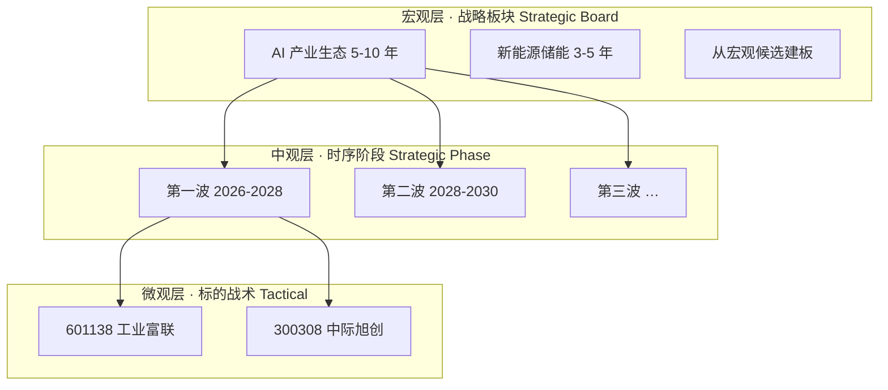
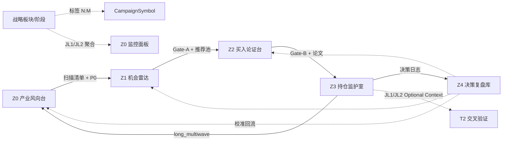
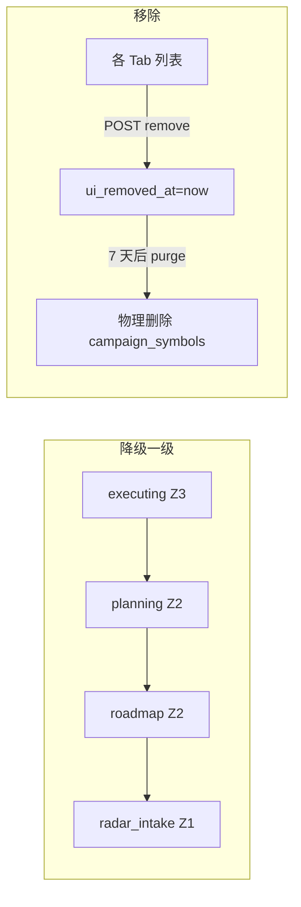
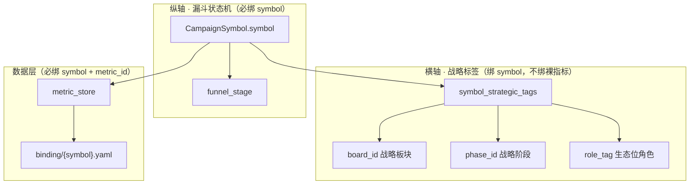
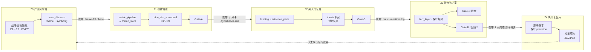
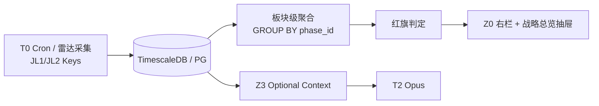

# 33 · 五区工作台 · 前端区际联动与数据携带契约（L3 · 取代原 30_）

> **一句话**：在 [32_ 五区漏斗](./32_五区漏斗工作流与数据工程标准化规约.md) 工程总纲之上，定义 **Z0～Z4** 的 Tab/进度条/区际联动，以及 **§5.8 展示 · §5.9 携带 · §5.10 端到端总览**（标签绑 symbol、九维矩阵、晋级叠层、chip↔后端对象）；Z0 战略指挥台，Z4 横切复盘。
>
> **取代声明**：本文 **完全取代** 已废止的 `30_战略板块与滚动路线图_前端与数据契约.md`；全仓链接须指向本文。

> [!NOTE] **[TRACEBACK] 战略追溯锚点**
> - **L1 哲学**：[06_投资哲学体系总纲](../../01_顶层概念/06_投资哲学体系总纲.md)（②纵深进攻·多源验证 / ⑦壁垒 / 长期产业周期）
> - **L2 实践规划**：[06_标的深度分析与阶段判定实践规划](../../02_战略维度/06_跨维度协作/06_标的深度分析与阶段判定实践规划.md)
> - **五区总纲**：[32_ 五区漏斗工作流与数据工程标准化规约](./32_五区漏斗工作流与数据工程标准化规约.md)（Gate · 论文 · 九维 · 产品命名）
> - **状态机底座**：[25_ §1.3](./25_四区漏斗_三段流水线_架构脊柱_设计.md) `funnel_stage` + `funnel.py`
> - **指标矩阵实施**：[34_ 五区指标矩阵与 T0-T2 集成](./34_五区指标矩阵与T0-T2集成规约.md)（Z0～Z4 逐区矩阵 · T0/T1/T2 · 继承包）
> - **关联**：[27_ 雷达主链](./27_行情雷达全链路架构设计优化.md) · [28_ 执行中 JL 矩阵](./28_执行中工作区_标的深度监控_T0-T2开发计划.md) · [29_ 三底座](./29_三大数据底座与任务调度架构契约.md)
> - **需求主表**：[24_ 行情解析与规划工作台](./24_行情解析与规划工作台_需求实现表.md) §9～§10
> - **关联 step**：← [step_15 战术双层锚定](../00_维度零_AI投资副驾驶/stages/stage_1_启动期/steps/step_15_滚动路线图双层锚定.md) · → **step_18 五区工作台前端联动**（待建 · 本文落地目标）
> - **DNA**：[`dna_stage_1_启动期.yaml`](../_System_DNA/00_co_pilot/dna_stage_1_启动期.yaml) `strategic_board_v1` · `product_workspaces.*`
> - **代码仓（目标）**：`diting-src/apps/copilot/modules/strategic/` · `modules/planning/funnel.py` · `templates/planning/_*` · `routers/`

---

## §0 本文档定位

| 维度 | 说明 |
|------|------|
| **产品归属** | **五区 Copilot 工作台** 前端信息架构 + 区际联动 + Z0 战略指挥台 UI |
| **与 32_ 分工** | [32_](./32_五区漏斗工作流与数据工程标准化规约.md) 管 Gate 量化条件、论文 JSON、**D1-D9 计分卡**、V0→V4 指标链；**本文管 HTMX 组件、Tab、晋级弹窗、§5.8 各区展示、§5.9 完整携带、§5.10 端到端标签×数据×指标总览、降级语义** |
| **与 step_15 关系** | step_15 已交付战术双层锚定（`campaign_timeline` · `regime_assessments`）；本文 **不替换** 战术层，Z0 在其上叠加战略板块层 |
| **L3 责任边界** | 信息架构 · 前端组件契约 · 区际数据携带 · 数据模型 · API 草约 · 分期验收；**不嵌入完整实现代码** |
| **永久红线** | no-mock · no-auto-execute · 晋级/清仓须人工确认 · 战略建议全 advisory · JL1/JL2 在 Z3 仍 **不占探针行**（[28_ §1.2](./28_执行中工作区_标的深度监控_T0-T2开发计划.md)） |

### §0.1 五区与 `funnel_stage` 映射（与 32_ §1.4 一致）

| 工程区码 | 产品工作区 | `funnel_stage` | 前端入口 | 主链节点 |
|---|---|---|---|:---:|
| **Z0** | 产业风向台 | 横切（不绑定单 stage） | `view=roadmap` + 战略总览抽屉 | ● |
| **Z1** | 机会雷达 | `radar_intake` | `view=radar` | ● |
| **Z2** | 买入论证台 | `roadmap` → `planning` | `view=planning` | ● |
| **Z3** | 持仓监护室 | `executing` | `view=executing` · `/portfolio-guard` | ● |
| **Z4** | 决策复盘库 | `archived` + 横切 | `/ledger` | 横切 |

**阅读顺序（漏斗进度条 · Tab 主链）**：**产业风向台 → 机会雷达 → 买入论证台 → 持仓监护室**（与 [32_ §1.4](./32_五区漏斗工作流与数据工程标准化规约.md#design-32-product-workspaces) 用户心智及 §2.6 数据 DAG 一致；`funnel_stage` 枚举顺序仍为 `radar_intake→roadmap→…`，与 UI 导航序解耦）。**决策复盘库**从页头全局入口进入，**不占**主链节点。

### §0.2 权威阅读路径（按问题找节）

| 若你要弄清… | 读 |
|-------------|-----|
| Tab / 进度条 / 晋级·降级弹窗 | §3～§5.5 |
| 旧 Mode C 九维 vs 新 D1-D9 | §5.7 |
| 各区 UI 读什么对象、任务徽章怎么显 | §5.8 |
| 晋级必携带字段、Gate-B/C 分离 | §5.9 |
| **标签绑谁、各区采什么、晋级带什么、前端叠层** | **[§5.10](#design-strategic-end-to-end)**（端到端权威总览） |
| **Z0 先实践哪些矩阵、34/33 分期如何对齐** | **[§12.1](#design-strategic-phases-crossref)** · [34_ §2.4/§3.0b/§11](./34_五区指标矩阵与T0-T2集成规约.md#design-34-generic-custom) |
| **防自欺 / 统计严谨（三条铁律 · 开工三配置）** | **[32_ §15](./32_五区漏斗工作流与数据工程标准化规约.md#design-32-anti-self-deception)** · 本文 [§5.10.13](#design-strategic-governance-ui) |
| 用户操作流程（含倒灌） | §7 |
| JL1/JL2 战略监控 | §6 |
| 组件清单与 API | §8～§9 |

---

<a id="design-strategic-board-goal"></a>

## §1 设计目标与核心命题

<a id="l4-strategic-board-goal"></a>

### §1.1 要解决什么问题

| 命题 | As-Is（四区时代） | To-Be（五区 · 本文） |
|------|-------------------|----------------------|
| 工作区划分 | 四 Tab 按 `funnel_stage` 过滤，路线图与规划边界模糊 | **五区产品名** + 主链进度条 + Z4 横切账本 |
| 区际联动 | 晋级仅改 stage，数据携带未标准化 | **§5.9 完整携带** + Gate 绑定 + 倒灌补齐 |
| 九维与指标 | 旧 Mode C 语义九维当 Gate 依据 | **§5.7 D1-D9 权威** + §5.8 各区展示/任务态 |
| Z0 定位 | 路线图 = 战术甘特 | **产业风向台** = 宏观战略指挥台 + 战术甘特嵌套于阶段内 |
| 战略与标的关系 | 标的仅有 `funnel_stage` | 横切 **战略板块 × 阶段 × 角色** 标签（正交于漏斗） |
| Z2 论证 | 规划中混放证伪与论文 | **买入论证台** 明确 thesis 契约 + Gate-B 立案 |
| Z4 闭环 | 归档即消失 | **决策复盘库** 影子账本 + 校准回流 Z0/Z1/Z2 |

### §1.2 设计原则

1. **不破坏标的级漏斗**：`CampaignSymbol.funnel_stage` 仍是区际唯一状态机；战略标签、论文、账本为 **正交横切**，见 [25_ §1.3](./25_四区漏斗_三段流水线_架构脊柱_设计.md)。
2. **产品名对用户、区码对工程**：Tab/Toast/提醒用 [32_ §1.4](./32_五区漏斗工作流与数据工程标准化规约.md#design-32-product-workspaces) 产品名；禁止对用户展示裸 `Z0`。
3. **Gate 绑定晋级**：跨区晋级须满足 [32_ §2](./32_五区漏斗工作流与数据工程标准化规约.md#design-32-gates) 对应 Gate；前端展示 Gate 结果，**禁止**无 Gate 记录的静默晋级。
4. **数据只增不丢**：降级/回流 **保留** 历史 `stage_artifacts` / `workspace_artifacts` / `decision_log`；移除仅 UI 隐藏（[24_ §10.3](./24_行情解析与规划工作台_需求实现表.md)）。
5. **HTMX 为主**：延续 `workbench.html` 局部刷新；复杂编辑器可用 Alpine.js。

---

<a id="design-strategic-dual-layer"></a>

## §2 Z0 产业风向台 · 双层路线图信息架构

<a id="l4-strategic-dual-layer"></a>

### §2.1 三层结构（宏观 · 中观 · 微观）



| 层级 | 回答的问题 | 数据实体 | 与现有表关系 |
|------|------------|----------|--------------|
| **宏观 · 板块** | 风往哪吹？为何关注这类资产？ | `strategic_boards` · **`wind_scan`** | 一对多 `strategic_phases`；**段 A 候选 → 段 B 建板**（[32_ §2.4](./32_五区漏斗工作流与数据工程标准化规约.md#design-32-z0-workflow)） |
| **中观 · 阶段** | 产业周期哪一波？ | `strategic_phases` | JL1/JL2 监控、核心猎物池、CSO 杠铃 |
| **微观 · 战术** | 何时建仓、窗口是否冲突？ | `campaign_timeline` · `regime_assessments` | **保留** step_15 全部能力 |

### §2.2 与五区漏斗的耦合



- **流转单元不变**：一个 `symbol` = 一条 `CampaignSymbol` 漏斗记录（[25_ §1.3](./25_四区漏斗_三段流水线_架构脊柱_设计.md)）。
- **Z0 横切**：P0、P0′、`liquidity_regime` 在 **产业风向台 + 战略总览抽屉 + 各 Tab 顶栏摘要** 广播。
- **标签关系**：`symbol_strategic_tags` 允许多条；**`is_primary=true` 全局至多一条**。
- **计数联动**：阶段卡片「论证中 / 监护中 / 雷达」= `symbol_strategic_tags.phase_id` + 当前 `funnel_stage` 聚合。

---

<a id="design-strategic-shell"></a>

## §3 全局 Shell 与工作区 Tab

<a id="l4-strategic-shell"></a>

### §3.1 页头与五区导航

**主入口**：`/planning` 默认 `view=roadmap`（产业风向台）；亦可 `view={roadmap|radar|planning|executing}`。

**横切入口**：`/ledger`（Z4 决策复盘库）；页头常驻 **「决策复盘」** 链接，不占主链 Tab。

| `view` | 产品工作区 | 工程区码 |
|--------|------------|:---:|
| `roadmap` | 产业风向 | Z0 |
| `radar` | 机会雷达 | Z1 |
| `planning` | 买入论证 | Z2 |
| `executing` | 持仓监护 | Z3 |
| `/ledger` | 决策复盘 | Z4 |

### §3.2 漏斗进度条（标的上下文模式）

当用户从标的卡进入详情时，页头下方展示 **主链进度条**（Z4 不在条上）：

```
产业风向 ──→ 机会雷达 ──→ 买入论证 ──→ 持仓监护    [601138 工业富联]
   ✓            ○ 当前          ○            ○      🏷 AI 生态 · 第一波
                                                      [决策复盘 ↗]
```

| 元素 | 行为 |
|------|------|
| 进度节点 | 映射 `funnel_stage`：`radar_intake`→Z1 · `roadmap`/`planning`→Z2 · `executing`→Z3 · `archived`→提示「已归档，见决策复盘」 |
| Z0 节点 | 若仅有战略标签无 stage 变化，高亮「产业风向」表示横切归属 |
| 战略 chip | 读取 `symbol_strategic_tags` 主标签；无则「未归属战略」虚线样式 |
| 决策复盘 ↗ | 跳转 `/ledger?symbol=` 该标的影子账本与归档记录 |
| 战略总览 ⊞ | 页头右侧，打开跨 Tab 抽屉（§3.4） |

### §3.3 五区 Tab 职责

| Tab 短标签 | 工程区 | 角色 | 本文能力 |
|------------|:------:|------|----------|
| 产业风向 | Z0 | 战略指挥台 | 三栏指挥台（§4）· P0/P0′ 摘要 · 扫描清单派单 |
| 机会雷达 | Z1 | 九维快评 · Gate-A | 候选池 · 晋级论证弹窗 · 降级/移除 |
| 买入论证 | Z2 | 对抗法庭 · Gate-B | thesis 卡 · 证据包 · 战略 chip · 晋级监护弹窗 |
| 持仓监护 | Z3 | 探针 · Gate-C/D | JL3/JL4 矩阵 · 战略上下文条 · 归档弹窗 |
| 决策复盘 | Z4 | 横切 | 影子账本 · 探针体检 · 校准回流入口 |

**Tab 顺序（主链）**：产业风向 → 机会雷达 → 买入论证 → 持仓监护（与 32_ §1.4 用户心智「看风向→找机会→…」及数据 DAG 一致）。

**Z2 消歧**：`roadmap` stage 标的与 `planning` stage 同在 `view=planning` Tab 展示；宏观指挥台在 `view=roadmap`。UI 用 **战略 chip + 漏斗进度条 + stage chip**（`路线图` / `论证中`）区分。

### §3.4 战略总览抽屉（跨 Tab）

| 区块 | 说明 |
|------|------|
| 板块列表 | 各板块 JL1/JL2 红灯/黄灯、当前活跃阶段 |
| P0/P0′ 广播 | 风口反转 · 流动性熔断状态 |
| 监护聚焦 | 筛选「板块 × 阶段 × funnel_stage=executing」 |
| 复盘入口 | 近 30 日 reject/清仓影子跟踪摘要 |
| 快捷跳转 | 点击板块 → `view=roadmap` 并选中 |

---

<a id="design-strategic-roadmap-ui"></a>

## §4 Z0 产业风向台 Tab · 三栏指挥台

<a id="l4-strategic-roadmap-ui"></a>

### §4.1 布局（Desktop ≥1280px）

> **工作流**：指标先行四段 A→B→C→D（[32_ §2.4](./32_五区漏斗工作流与数据工程标准化规约.md#design-32-z0-workflow)）。左栏无 board 时展示 **宏观风口候选**；有 board 后展示板块列表。

```
┌──────────────┬────────────────────────────┬──────────────────────┐
│ 左栏 240px   │      中栏（主画布）         │   右栏 320px         │
│ 风口/板块列表 │                            │   阶段详情 + 监控    │
├──────────────┼────────────────────────────┼──────────────────────┤
│ 【段 A】     │  ┌─ 宏观风口 Top-N ────────┐ │  （段 A）P0/P0′ 摘要 │
│  wind_scan   │  │ 候选赛道 · 证据 · 分数   │ │                      │
│ [刷新风向标] │  └─────────────────────────┘ │                      │
│ [从候选建板] │  ┌─ 10 年战略时间轴 ────────┐ │  🌊 第一波 2026-2028 │
│ ▶ AI 产业生态 │  │2026    2028    2030 2032│ │  E1～E5 · 局势研判  │
│ ○ 液冷基建   │  │[====波1====][==波2==]... │ │  JL1/JL2 监控        │
│              │  └─────────────────────────┘ │  【段 C】CVM 核心池   │
│              │  阶段卡片网格                 │  · C1～C7 矩阵预览   │
│              │  ▼ CVM 圈定向导 / 猎物矩阵    │  [确认圈定][派单 Z1] │
└──────────────┴────────────────────────────┴──────────────────────┘
```

**左栏两种模式**：

| 模式 | 触发 | 主操作 |
|------|------|--------|
| **风口模式** | 无选中 board / 用户点「宏观风向标」 | 展示 `wind_scan.candidates[]` · **从候选建板** |
| **板块模式** | 选中 `strategic_board` | 板块列表 · 切换 phase · 跳转 CVM |

### §4.2～§4.5

左栏 **genesis 四步向导**（取代空壳「新建板块」）、10 年轴、阶段卡片、右栏 JL 监控、**CVM 核心猎物池**、CSO 杠铃、伪科技三死穴等规范 **与原 30_ §4.2～§4.5 一致**，并受 [32_ §2.4](./32_五区漏斗工作流与数据工程标准化规约.md#design-32-z0-workflow) 约束：

| 步骤 | 用户动作 | 后端 |
|------|----------|------|
| 1 | 查看 **wind_scan** Top-N · 勾选候选 | 读 `wind_scan.json` |
| 2 | **genesis 预览**（horizon · phase 轴 · layer） | `apply_genesis_template` |
| 3 | 确认 **niche 层** · E1～E5 权重 | 写 `strategic_phases` |
| 4 | **CVM 矩阵确认**核心池（§4.6） | 写 `cvm_scorecard` · `strategic_phase_symbols` |

阶段卡片计数仍为五区口径：

```
猎物 3 · 监护中 1 · 论证中 1 · 雷达 1
```

<a id="design-strategic-cvm-ui"></a>

### §4.6 CVM 核心池圈定 UI（段 C · 人确认）

**数据**：`cvm_scorecard[]`（[34_ §3.7～§3.8](./34_五区指标矩阵与T0-T2集成规约.md#design-34-z0-cvm)）· 规则 [32_ §2.4.4](./32_五区漏斗工作流与数据工程标准化规约.md#design-32-z0-workflow)。

**中栏 · CVM 矩阵表**（按 `phase × niche` 过滤）：

| 列 | 内容 |
|----|------|
| symbol / 名称 | peer 候选行 |
| C1～C6 | 色带 `low / acceptable / mid_high / high` + 趋势箭头 |
| C7 | 🟢 pass · 🔴 伪龙头（行禁用 dispatch） |
| anchor_path | profit / structure / growth |
| role 建议 | monopoly / max_value / leader / representative |
| dispatch | 勾选（默认仅 `pool_eligible=true` 且非 representative） |

**交互**：

1. 「运行 CVM 评分」→ HTMX 调 `POST /api/strategic/phases/{id}/cvm/run` → 刷新矩阵（T1+T2 填槽）
2. 用户可 **覆盖 role**（须填一行理由 · 审计）
3. 「确认核心池」→ `human_confirmed=true` on scorecard + `strategic_phase_symbols`
4. 「派单至机会雷达」→ 写 `scan_dispatch`（**须**已确认 · `reminder_category=scan_list_dispatch`）

**右栏 · 核心猎物池**：只展示 **已确认** 且 C7 pass 的标的；`representative` 灰显 · 标签 `仅对照`；`provisional=true` 显示 ⚠️「T1 覆盖不足」。

**禁止**：未跑 CVM 直接从阶段卡派单；C7 fail 行不得勾选 dispatch。

<a id="design-strategic-wind-scan-ui"></a>

### §4.3 段 A · 宏观风向标 UI（`wind_scan`）

**组件**：`_wind_scan_panel.html` · API [§10.1](#design-strategic-api-z0-wind)。

| 状态 | 展示 |
|------|------|
| **loading** | 骨架屏 +「正在拉取宏观/政策/流动性…」 |
| **ready** | Top-N 候选表：排名 · 赛道名 · wind_score 条 · 证据摘要（可展开 DeepSea span） |
| **empty** | 「暂无显著风口偏移」+ 仍显示 P0/P0′ |
| **error** | 红色 banner + `blocker` 文案（缺凭证/源失败 · **no-mock**） |

**用户操作**：

| 操作 | 行为 |
|------|------|
| **刷新风向标** | `POST /api/strategic/wind-scan/run` → HTMX 刷新 panel |
| 勾选候选 | 多选 ≤ **5**（可配置）；启用「从候选建板」 |
| 展开证据 | 只读；链到 metric_id / 公告片段 |

**不展示**：10 年轴、阶段卡（须段 B 后才出现）。

### §4.4 段 B · genesis 四步向导（逐步字段 · 取代原 30_）

**组件**：`_genesis_wizard.html` · 模态或中栏全宽分步。

| 步 | 标题 | 用户输入/调整 | 系统返回（预览） |
|----|------|---------------|------------------|
| **1 选候选** | 确认赛道 | 勾选 wind_scan 候选（≥1）；可改 **board.title** | 绑定 `source_wind_scan_id` · 证据列表 |
| **2 时间骨架** | 战略跨度 | `horizon_years`（5/10/15）；phase 条数 1～4；每 phase **window** · **layer** · **s_curve_position**；**concurrent_with** 多选 | 10 年轴 HTMX 预览（`_strategic_timeline.html`） |
| **3 生态位** | niche 层 | 每 phase 增删 `niche_layers[]`：`niche_id` · position · **e1_e5_weights** 滑块 · `jl2_keys` 多选 | E1～E5 权重和=1 校验 |
| **4 确认建板** | 落库 | 只读总览；勾选「本人确认 advisory」 | `POST .../genesis/apply` → 左栏切板块模式 |

**校验**：window 不重叠冲突时 warning（并发 phase 允许重叠）；未确认 advisory **禁用**提交。

### §4.5 段 D · Living Z0 监控 UI

| 触发 | 前端 | 用户操作 |
|------|------|----------|
| `wind_shift` | 板块/JL 黄红灯 · 站内 `reminder_category=wind_shift` | 打开阶段卡复核；可选触发段 C 重跑 CVM |
| `board_jl_alert` | 右栏 JL 🔴 展开 | 只读详情；advisory |
| CVM 池漂移 | 猎物池项 ⚠️「锚点弱化」/「待移出」 | 「重新跑 CVM」或「移出池」→ 若已 dispatch 则 `revoke` 旧单 |
| P0/P0′ 熔断 | `_zone_context_bar` 全 Tab 广播 | 只读说明；链 Z3 减仓 advisory |
| Z4 校准 | `_calibration_reflow_panel` 链到 Z0 | 人工确认后改 `z0_cvm` 权重（配置 PR） |

<a id="design-strategic-radar-ui"></a>

### §4.7 Z1 机会雷达 Tab · 派单 intake 与清单内扫描

> **工作流**：[32_ §2.4.7](./32_五区漏斗工作流与数据工程标准化规约.md#design-32-z1-dispatch-workflow) · **intake**：[34_ §4.0a](./34_五区指标矩阵与T0-T2集成规约.md#design-34-z1-dispatch-intake)

#### §4.7.1 布局

```
┌─────────────────────────────────────────────────────────────┐
│ _dispatch_context_bar：本次扫描「AI算力基建·第一波」· P0/P0′  │
│ CVM 锚点 chip × N · [查看产业风向 →]                          │
├──────────────┬──────────────────────────────────────────────┤
│ 左栏 220px   │ 主列表                                        │
│ 待处理派单   │  ┌─ symbol 卡 ─────────────────────────────┐  │
│ · dispatch 1 │  │ _cvm_anchor_chip · _nine_dim_scorecard   │  │
│ · dispatch 2 │  │ Gate-A chip · [进入买入论证]              │  │
│ phase 分 Tab │  └─────────────────────────────────────────┘  │
│              │  [扫描本单全部标的]  [单只重扫]               │
└──────────────┴──────────────────────────────────────────────┘
```

#### §4.7.2 派单 intake

| 场景 | UI |
|------|-----|
| 有 **active** dispatch | 左栏列表；默认选中最新；顶栏 `_dispatch_context_bar` |
| 无 active dispatch | 空态：「请先在产业风向台完成 CVM 并派单」+ 链 `view=roadmap` |
| 收到 `scan_list_dispatch` 通知 | Toast「机会雷达 · 新扫描清单：{theme}」；可选 **不自动切 Tab**（用户点通知再跳） |
| 多条 active（多 phase） | 左栏按 `strategic_phase_id` 分组；**禁止**合并混扫 |

#### §4.7.3 扫描与约束

| 操作 | API | 说明 |
|------|-----|------|
| **扫描本单全部** | `POST /api/radar/dispatches/{id}/scan-all` | batch pipeline；进度 per-symbol spinner |
| 单只重扫 | `POST /api/radar/dispatches/{id}/symbols/{sym}/scan` | 同上 intake 校验 |
| 手动加 symbol | **默认禁用**；调试模式可开 | 越界 → `_dispatch_scope_warning.html` |
| 旧 Mode A 广搜 | 见 §5.7.1 | 有 active dispatch 时 **折叠/禁用** |

**候选卡必显（只读 Z0）**：`symbol_roles` · `anchor_path` · C7 pass（`_cvm_anchor_chip.html`）。

#### §4.7.4 Gate-A 与晋级

- 计分卡主卡 `_nine_dim_scorecard.html`；辅卡 `_radar_legacy_semantic_card` 折叠。
- `attack_score` 达标且 `veto=false` → Gate-A 绿 →「进入买入论证」启用。
- **D5/D7 否决**：卡红；**不**回写 Z0 移池（与 32_ §2.4.7 一致）。
- 晋级 `_promote_modal`：预填 `phase_id` · 战略标签建议 · `falsify_hypotheses[]` 预览。

---

<a id="design-strategic-promote"></a>

## §5 区际晋级 · 降级 · 移除 · 回流

<a id="l4-strategic-promote"></a>

> **端到端规划入口**：标签体系、双轨标识（symbol 主轴 + 战略横切）、Z0→Z4 指标采集与晋级携带、前端 chip 叠层、全链路一览 → **[§5.10](#design-strategic-end-to-end)**。实现验收时 §5.2 简表以 **§5.9** 为准。

### §5.1 晋级状态机（`funnel_stage` 枚举不变）

| 用户动作 | 源区 → 目标区 | `funnel_stage` 变化 | Gate | 战略标签 |
|----------|---------------|---------------------|------|----------|
| 扫描晋级论证 | Z1 → Z2 | `radar_intake` → `planning` | **Gate-A** | 可选写入 |
| 纳入路线图 | Z1/Z2 → Z2 | → `roadmap` | — | 建议选标签 |
| 路线图→论证 | Z2 → Z2 | `roadmap` → `planning` | — | 可补标签 |
| 立案进监护 | Z2 → Z3 | `planning` → `executing` | **Gate-B** | 建议确认主标签 |
| 波次归档 | Z3 → Z4 | `executing` → `archived` | **Gate-D** 或人工 | 标签保留 |
| 长标的回流 | Z3/Z4 → Z0 | `archived` → `roadmap`（`allow_backward`） | 人工 | `next_wave_window` |
| 阶段切换 | Z0 | 不变 | — | 更新 `phase_id` + audit |

**规则**：晋级 = `upsert_funnel_symbol` / `set_stage` 前向推进；**必须人工确认**；`no-auto-execute`。

### §5.2 跨区数据携带矩阵（简表 · 完整见 §5.9）

> **权威完整表**：[§5.9](#design-strategic-carry-full)（对齐 [32_ §2.6](./32_五区漏斗工作流与数据工程标准化规约.md) 交付物 DAG）。

| 晋级边 | 必携带（写入下游） | 可选携带 | 落库位置 |
|--------|-------------------|----------|----------|
| **Z1→Z2** | `nine_dim_scorecard` · Gate-A · `falsify_hypotheses[]` · `workspace_artifacts(Z1)` | 战略标签 · `radar_candidates`（溯源） | 见 §5.9 |
| **Z2 路线图** | `campaign_timeline` · `regime_assessments` | 战略标签 | step_15 表 |
| **Z2→Z3** | `thesis.json` · `evidence_pack`/`evidence_health` · `monitor_subscriptions` · Gate-B `decision_log` | 标签 · 层 A（Gate-C 路径） | 见 §5.9 |
| **Z3 Gate-C** | `fact_layer` 基准 · 建仓 `decision_log` | — | 不改 `funnel_stage` |
| **Z3→Z4** | `decision_log` 全量 · 前提终态 · 回路 2 | 影子跟踪 | Z4 账本 |
| **Z4→上游** | 探针 precision · 校准建议 | Gate/九维参数草案 | 配置审计 |

**区间级联**（[25_ §3](./25_四区漏斗_三段流水线_架构脊柱_设计.md)）：

```
workspace_artifacts(Z1) → workspace_artifacts(Z2) → workspace_artifacts(Z3)
```

每条 `workspace_artifacts` 含 `upstream_refs` 指向上一区 WA 与区内 `stage_artifacts(T2_verdict)`。

### §5.3 降级语义（扩展五区 · 继承 24_ §10.3）



| 操作 | 前端 | 后端 | 数据保留 |
|------|------|------|----------|
| **降级** | 标的卡按钮 · HTMX 刷新 | `funnel_stage` 降一级（最低 `radar_intake`） | **全部** Artifact / thesis / decision_log **保留** |
| **移除** | 立即从各 Tab 消失 | `ui_removed_at`；7 天后 `purge_expired_ui_removed` | 审计库 `radar_symbol_versions` 仍可查至 purge |
| **归档** | Z3 归档确认弹窗 | → `archived` | 进入 Z4 影子跟踪 |
| **回流** | Z0 路线图「下一波」 | `set_stage(allow_backward)→roadmap` | 保留 thesis 历史版本，新建波次窗口 |

**API**：`POST /api/funnel/symbols/{sym}/demote|remove`（[24_ §10.3](./24_行情解析与规划工作台_需求实现表.md)）。

### §5.4 晋级弹窗 `_promote_modal.html`

**共用场景**：Z1 候选晋级 Z2 · Z2 立案晋级 Z3（**Gate-C 建仓**见 §5.9.1 · `_gate_c_entry_panel`，不在此弹窗）。

| 字段 | Z1→Z2 | Z2→Z3 |
|------|-------|-------|
| 标的信息 | symbol · **D1-D9 计分卡摘要**（非旧 Mode C verdict） | symbol · thesis 摘要 · 前提数 · `evidence_health` |
| Gate 状态 | Gate-A：`attack_score` / `veto` / 缺失维 | Gate-B：Bear 结果 / `blocking` / Kill 已定义 |
| 板块/阶段/角色 | 可选 `[select]` | 建议确认主标签 |
| □ 同步核心猎物池 | 可选 | 可选 |
| 建仓态（Z2→Z3） | — | **待建仓 / 已建仓** + 层 A 参数 |
| AI 建议 | 标签 advisory 预填 | — |
| 按钮 | 取消 · 跳过标签晋级 · 确认 | 取消 · 确认立案 |

**规则**：「跳过标签」须二次确认；禁止自动晋级。

### §5.5 归档弹窗 `_archive_modal.html`（Z3→Z4）

| 字段 | 说明 |
|------|------|
| 归档原因 | 清仓 / 波次完成 / Gate-D 触发 / 人工放弃 |
| `regime` | `single` → 纯归档；`long_multiwave` → 回流 Z0 路线图 |
| 影子跟踪 | 默认开启 90 日（[32_ §1.1](./32_五区漏斗工作流与数据工程标准化规约.md) 影子记账原则） |
| 按钮 | 取消 · 确认归档 |

### §5.6 战略 Chip `_strategic_chip.html`

全 Tab 复用；有主标签实线边框；无标签虚线「未归属战略」；多标签主 + `+N` tooltip。

<a id="design-strategic-nine-dim-bridge"></a>

### §5.7 旧 Mode C 九维与新 D1-D9 过渡（双轨期 · 强制）

[32_ §2.3](./32_五区漏斗工作流与数据工程标准化规约.md#design-32-gates) 的 **D1～D9 计分卡** 与 [25_ §2.2 Mode C](./25_四区漏斗_三段流水线_架构脊柱_设计.md) 的 **语义九维** 是**两套不同契约**，不可混为同一 Gate 依据。

| 体系 | 字段示例 | 产出 | Gate 权威 |
|------|----------|------|:---:|
| **新 · D1-D9** | `scores.D1`…`D9`、`attack_score`、`veto` | `nine_dim_scorecard.json` | **是**（Gate-A/C） |
| **旧 · Mode C** | `niche/moat/market_phase/valuation…` + `verdict` | `radar_candidates` 列 + `deep_analysis` | **否**（仅展示/溯源） |

**语义映射（advisory · 仅供旧卡折叠区提示，不写入 Gate）**：

| 旧 Mode C | 新 D1-D9（主消费） |
|-----------|-------------------|
| `is_leader` / 份额叙述 | **D1** 行业地位 |
| `moat` | **D2** 技术壁垒 |
| `niche` / 赛道 | **D3** 成长空间 |
| `profit_quality` | **D4** 盈利能力 + **D5** 财务质量 |
| `valuation` | **D6** 估值水位 |
| `risk` 治理类 | **D7** 治理结构 |
| 资金/情绪叙述 | **D8** 资金筹码（须叠 `liquidity_context` 三层折价） |
| `catalyst_timeline` / 预期 | **D9** 预期差 |

**Z1 展示策略（强制）**：

| 优先级 | 组件 | 条件 |
|:------:|------|------|
| 1 | `_nine_dim_scorecard.html` | `nine_dim_scorecard` 存在且攻击维无 `null` |
| 2 | `_nine_dim_pending_banner.html` | 计分卡缺失或攻击维含 `null` → 显式「不可过 Gate-A」 |
| 3 | `_radar_legacy_semantic_card.html`（可折叠） | 仅作 Mode C 溯源；**禁止**作为晋级按钮可用态 |

**流水线**：`pipeline` → `nine_dim_scorer` → 写 `metric_store` + `nine_dim_scorecard`；Mode C T2 研报与计分卡 **并行落库**，晋级 API 只读计分卡 + `gates.yaml`。

#### §5.7.1 有 active `scan_dispatch` 时的雷达模式优先级

| 优先级 | 模式 | UI | 说明 |
|:------:|------|-----|------|
| **1** | **派单清单扫描** | §4.7 · `scan-all` | 主路径；symbol 范围 = `dispatch.symbols[]` |
| 2 | 单 symbol 深扫（仍在 dispatch 内） | 卡上「重扫」 | 同上 intake 校验 |
| **禁用** | 全市场 Mode A / 手动主题广搜 | 按钮灰显 + tooltip「请先完成产业风向派单或使用无派单调试开关」 | 防 bypass Z0 CVM |
| 折叠 | Mode C 语义溯源卡 | `_radar_legacy_semantic_card` | 非 Gate |

**调试开关**（仅 `COPILOT_RADAR_OPEN_SCAN=1` · 非生产默认关）：允许无 dispatch 扫描，UI 须显 **「非派单模式 · 结果不可晋级」** banner。

<a id="design-strategic-zone-data-ui"></a>

### §5.8 各工作区数据指标展示与任务态契约

> 指标定义与 V0→V4 链见 [32_ §5A/§5B](./32_五区漏斗工作流与数据工程标准化规约.md#design-32-metric-pipeline)；本节只规定 **UI 读什么、任务态怎么显、缺数据怎么显**。

#### §5.8.1 工作区 × 只读数据对象

| 工作区 | 主读对象 | 关键字段/视图 | 消费 Gate |
|--------|----------|---------------|-----------|
| **Z0** | `wind_scan` · `strategic_boards/phases` · `cvm_scorecard` · `liquidity_regime.json` · E1～E5 | P0/P0′ · **`scan_dispatch`** · JL1/JL2 · CVM 矩阵 | P0 死亡 → 广播 advisory · C7 移池 |
| **Z1** | `nine_dim_scorecard` · `metric_store`（D1-D9 源信号）· `radar_candidates`（旧，只读） | `attack_score` · `veto` · 各维 `[-2,+2]` · D8 `liquidity_context` 折价说明 | **Gate-A** |
| **Z2** | `evidence_pack` · `evidence_health` · `thesis.json`（草案）· `nine_dim_scorecard`（基线） | `slots[]` filled/missing · `overall.blocking` · 待证伪假设列表 | **Gate-B** |
| **Z3** | `thesis.json`（正式）· `fact_layer` · `decision_log` · [28_ Profile 探针](./28_执行中工作区_标的深度监控_T0-T2开发计划.md) | `premises[].status` 时间线 · `risk_param_breach` · `circuit2_*` | **Gate-C**（建仓）· **Gate-D**（退出） |
| **Z4** | 影子账本 · 探针 precision · `decision_log` 全集 · thesis 尸检 | 确认账/嫌疑账 · 逻辑正确率 vs 影子收益 | 校准回流（人工） |

**横切广播**（各 Tab 顶栏 `_zone_context_bar.html`）：`liquidity_regime.regime` · P0′ 熔断 · 主战略 chip。

#### §5.8.2 工作区 × 指标任务态（pipeline / cron）

| 工作区 | 任务标识（示例） | 触发 | UI 任务徽章 |
|--------|------------------|------|-------------|
| **Z0** | `z0-ecosystem-score` · `jl1-jl2-board-cron` · `liquidity-regime-daily` | Cron / 手动刷新 | 🟢就绪 / 🟡stale（>TTL）/ ⚪pending / 🔴error |
| **Z1** | `z1-nine-dim-score` · `radar-scan-{mode}` · `metric-pipeline-{symbol}` | 扫描后 / `make copilot-radar-*` | 扫描中 spinner；完成后刷新计分卡 |
| **Z2** | `evidence-pack-build` · `thesis-draft-a` · `bear-bull-judge` | 用户「装配证据包」/ 对抗法庭 | blocking 横幅；槽位 `MISSING` 计数 |
| **Z3** | `fact-layer-daily` · `daily-digest` · `jl3-probe-batch`（28_） | Cron + 用户启用 Profile | 探针矩阵行态；前提灯同步 |
| **Z4** | `shadow-ledger-roll` · `probe-precision-q` | 日更 / 季审 | 影子 PnL 曲线；precision 表 |

**任务态组件** `_metric_task_badge.html`：展示 `task_id` · `last_ok_at` · `blocker` 文案；**禁止**用假绿点。

**stale 规则**：读 `metric_store.as_of` 与 `metric_registry.cadence`；超 TTL → 黄标「数据过期」+ 禁止触发 Gate（与 32_「缺失不可用 0 顶替」一致）。

#### §5.8.3 工作区 × 核心 UI 组件

| 工作区 | 组件 | 展示内容 |
|--------|------|----------|
| **Z0** | `_ecosystem_score_panel.html` | E1～E5 五维热度 + 扫描清单派单按钮 |
| **Z0** | `_p0_regime_banner.html` | P0/P0′ 风口/流动性状态 |
| **Z1** | `_nine_dim_scorecard.html` | D1-D9 网格 + attack_score + veto 条 |
| **Z1** | `_gate_a_result_chip.html` | 通过/否决/待补齐（含 D5/D7 一票否决） |
| **Z2** | `_evidence_pack_slots.html` | EVD 槽位表 + filled/missing + blocking |
| **Z2** | `_falsify_hypothesis_list.html` | 自 Z1 带入的待证伪假设 |
| **Z2** | `_thesis_draft_panel.html` | 论文草案 + `evidence_health` |
| **Z2** | `_gate_b_result_chip.html` | Bear 杀死 / 可立案 |
| **Z3** | `_premise_status_timeline.html` | P0～Pn 状态灯 + 迁移箭头（32_ §3.2 FSM） |
| **Z3** | `_fact_layer_summary.html` | 价量/资金/归因 `liquidity_context.attribution` |
| **Z3** | `_gate_c_entry_panel.html` | D6 分位 + D8 拐点 · 待建仓→已建仓 |
| **Z3** | `_gate_d_alert.html` | 前提 dead / 双过热 / 回路 2 减仓建议 |
| **Z3** | `_jl_probe_matrix.html` | 28_ Profile 探针（JL3/JL4 行） |
| **Z4** | `_ledger_four_columns.html` | 确认账/嫌疑账/影子组合/探针体检 |
| **Z4** | `_calibration_reflow_panel.html` | 回流 Z0/Z1/Z2 建议（须人工确认） |
| **全局** | `_zone_context_bar.html` | 顶栏 P0′ + 战略 chip + 流动性 regime |

<a id="design-strategic-carry-full"></a>

### §5.9 完整区际携带矩阵（对齐 32_ §2.6 DAG）

> §5.2 为简表；**实现与验收以本节为准**。

| 关口 | 必携带（写入下游） | 可选 | 落库/API | 前端确认点 |
|------|-------------------|------|----------|------------|
| **Z0→Z1** | `scan_dispatch{id,symbols[],theme,p0_snapshot,cvm_scorecard_ref,symbol_roles}` · 生态位 E1～E5 | `strategic_phase_id` · `layer` | Z0 配置 + 通知 `scan_list_dispatch` | Z1 扫描范围受清单约束 · 只读 CVM 摘要 |
| **Z1→Z2** | `nine_dim_scorecard`（**完整**）· Gate-A 记录 · `falsify_hypotheses[]` · `workspace_artifacts(Z1)` | 战略标签 · `radar_candidates` 快照（溯源） | `analysis_snapshot` · `promoted_from_candidate_id` | 晋级弹窗展示 Gate-A + 计分卡摘要 |
| **Z2 内 roadmap** | `campaign_timeline` · `regime_assessments` | 战略标签 | step_15 表 | stage chip「路线图」 |
| **Z2→Z3 立案** | **`thesis.json`**（`zone_state=formal`）· `evidence_pack_id` · `evidence_health` · `monitor_subscriptions`（13 轴网）· **首条 `decision_log`**（Gate-B 立案） | 战略标签 · 层 A 建仓参数（已建仓路径） | thesis 表 · decision_log | Gate-B chip 绿 + blocking=false |
| **Z3 内 Gate-C** | 更新 `thesis.entry_conditions` 满足快照 · `fact_layer` 建仓日基准 · 建仓 `decision_log` | — | decision_log · 持仓层 A | `_gate_c_entry_panel` 三条全勾 |
| **Z3→Z4** | `decision_log` 全量 · 前提终态快照 · 回路 2 记录 · 归档原因 | `shadow_track_start` | Z4 账本 · `funnel_stage=archived` | `_archive_modal` |
| **Z3→Z0 回流** | `regime_assessments.next_wave_window` · 保留 thesis 历史版本 | 战略 `phase_id` 更新 | `set_stage(allow_backward)` | Z0 阶段卡「下一波」 |
| **Z4→Z0** | 生态位/E1～E5 修订建议 · P0 复核记录 | `gates.yaml` 草案 | 配置审计表 | 校准面板人工确认 |
| **Z4→Z1** | `nine_dim_scoring.yaml` / D8 权重修订建议 | — | DNA/config PR | 同上 |
| **Z4→Z2** | 探针 precision · Kill 阈值修订 · 槽位模板补丁 | — | `strategic_phase_reviews` 或 ADR | 同上 |

**`workspace_artifacts` 级联**（区间精简视图，审计用 `upstream_refs`）：

```
WA(Z1: nine_dim + gate_a) → WA(Z2: evidence_health + gate_b) → WA(Z3: premise_snapshot + gate_c/d)
```

**倒灌补齐**（[32_ §2.6](./32_五区漏斗工作流与数据工程标准化规约.md)）：已持仓标的直入 Z3 时，UI 须显示 **「倒灌任务条」**（Z0→Z1→Z2 缺项清单）；未补齐前 `zone_state` 保持 `pending_registration`，探针矩阵只读、**禁止**宣称正式监护。

#### §5.9.1 晋级弹窗补充（Gate-C 与 Gate-B 分离）

| 弹窗 | Gate | 触发 stage 变化 | 额外字段 |
|------|------|-----------------|----------|
| Z1→Z2 `_promote_modal` | **Gate-A** | `→ planning` | 计分卡摘要 · 待证伪假设预览 |
| Z2→Z3 `_promote_modal` | **Gate-B** | `→ executing`（**待建仓**默认） | thesis 摘要 · 前提数 · evidence_health |
| Z3 内 `_gate_c_entry_panel` | **Gate-C** | 不改 stage；更新持仓态 | D6 分位 · D8 拐点 · 层 A 成本/股数 |
| Z3 `_archive_modal` | **Gate-D** / 人工 | `→ archived` | 前提终态 · 影子跟踪开关 |

**禁止**：用 Gate-B 通过代替 Gate-C 建仓确认；用 Gate-A 通过代替 evidence_pack blocking 检查。

<a id="design-strategic-end-to-end"></a>

### §5.10 端到端：标签体系 × 数据继承 × 指标矩阵（Z0→Z4 权威总览）

| 指标采集明细见 [32_ §5A/§6](./32_五区漏斗工作流与数据工程标准化规约.md)；**Z0～Z4 逐区指标矩阵（S0～S3 共享范围 · 运行时 T0/T1/T2 · 继承包）** 见 **[34_ §3～§8](./34_五区指标矩阵与T0-T2集成规约.md)**；本节回答：**标签绑什么、数据绑什么、各区采什么、晋级带什么**。

#### §5.10.1 核心设计：双轨标识（标的主轴 + 战略横切）



| 问题 | 设计决策 |
|------|----------|
| 标签绑「词」还是绑「标的」？ | **绑标的**：`symbol_strategic_tags(symbol, board_id, phase_id, role_tag)`；同一板块词可贴多只票，但**每条标签行必有 symbol** |
| 产业生态/风口数据绑谁？ | **板块/阶段级**存 Z0（`strategic_phases`、JL1/JL2、`liquidity_regime`）；**派单**用 `scan_dispatch` 把「主题+候选 symbol 列表」推到 Z1；**指标值**仍按 symbol 写入 `metric_store` |
| `niche` 生态位绑谁？ | **`binding/{symbol}.yaml`** 的 `sector`/`niche`/`peer_list`（32_ Layer3）；决定 **S0～S3 共享范围**与 EVD 槽位模板，**不是**前端 chip alone |
| 前端 chip 代表什么？ | **战略 chip** = `symbol_strategic_tags` 主标签可视化；**stage chip** = `funnel_stage`；**niche chip** = `binding.niche`（Z2 论证台展示） |
| 数据能否只跟标签走、不跟 symbol？ | **禁止**。Gate/论文/计分卡/证据包一律 **symbol 主键**；标签仅用于筛选、聚合、JL 监控上下文 |

**主标签规则**：`is_primary=true` 全局每 symbol 至多一条；次标签 `is_primary=false` 用于跨板块观察。

---

#### §5.10.2 Z0 产业风向台

**定位**：宏观战略指挥台——政策/经济/产业/生态方向 + 5～10 年板块阶段 + P0/P0′ 风口与流动性。

| 类别 | 关键指标/数据（32_ §5A.1 / §6.1） | 产出对象 |
|------|-----------------------------------|----------|
| 宏观 | GDP/PMI/社融、利率、VIX | `metric_store`（通用 T0） |
| 政策产业 | 发改委/工信部/Federal Register 语料 | T1 政策方向 enum |
| 赛道 | 云厂 Capex 总量、生态位利润分布、风口 S 曲线 | T1/T2 赛道级信号 |
| 流动性 | 北向/两融/美债（§5B.4） | **`liquidity_regime.json`（P0′）** |
| 生态位 | **E1～E5** 五维热度（利润卡位/卡脖子/政策/阶段/持续性） | `ecosystem_scores{phase_id}` |
| 战略 UI | `strategic_boards` · `strategic_phases` · JL1/JL2 配置 | 三栏指挥台 |

**Z0 不绑定单只标的的 funnel_stage**；通过 **扫描清单派单** 影响 Z1。

---

#### §5.10.3 Z0 → Z1：携带什么、怎么绑

| 携带项 | 后端对象 | 绑定方式 | 前端展示 |
|--------|----------|----------|----------|
| 扫描主题 | `scan_dispatch.theme`（如「AI算力基建」） | 清单级；约束 Z1 Mode A/B 范围 | Z1 顶栏「本次扫描：{theme}」 |
| 候选标的池 | `scan_dispatch.symbols[]` | **CVM 确认后**的核心池；含 `symbol_roles` | Z1 扫描队列（按 phase Tab） |
| CVM 摘要 | `scan_dispatch.cvm_scorecard_ref` | 锚点路径 · role · C7 状态 | Z1 顶栏「产业锚点」chip |
| P0 快照 | `scan_dispatch.p0_snapshot` | 板块/阶段级 macro 前提状态 | `_zone_context_bar` P0 灯 |
| 战略阶段 | `scan_dispatch.strategic_phase_id` | 可选；预填晋级标签 | 派单时建议 `symbol_strategic_tags` |
| 生态位分数 | `scan_dispatch.ecosystem_e1_e5` | 按 **theme/phase** 一份，非 per-symbol | Z0 阶段卡 → Z1 扫描说明文案 |
| 流动性 | `liquidity_regime` 引用 | 全局横切 | 全 Tab 顶栏 P0′ |

**不携带**：单票 `nine_dim_scorecard`（Z1 才产）、`thesis`（Z2 才产）。

**流程**：Z0 阶段卡「派单扫描」→ 写 `scan_dispatch` + 通知 `reminder_category=scan_list_dispatch` → Z1 仅在清单内跑 pipeline。

---

#### §5.10.4 Z1 机会雷达：继承 + 本区采集 + 九维矩阵

**① 从 Z0 继承（只读上下文，不参与 Gate 计算）**

| 继承项 | 用途 |
|--------|------|
| `scan_dispatch` 全对象 | intake 校验 · 顶栏 theme/phase |
| `scan_dispatch.theme` / `phase_id` / `layer` | 限定扫描语义；预填战略标签 |
| `scan_dispatch.symbol_roles` | `_cvm_anchor_chip` |
| **`scan_dispatch.cvm_scorecard_ref`** | per-symbol slice · anchor_path |
| `p0_snapshot` / `liquidity_regime` | D3/D8 折价语境；顶栏广播 |
| `ecosystem_e1_e5` | D3 辅助 · **`falsify_hypotheses[]` 种子** |

**② Z1 本区采集（32_ §6.2 + §5A.2～P5 中与九维相关）**

| 数据层 | 采集项 | 复用 tier | 主要服务维度 |
|--------|--------|-----------|--------------|
| T0/T3 | 行情日线、估值分位 | T3 | D6 |
| T3 | 财报核心科目（毛利/ROE/现金流） | T3 | D4、D5 |
| T3 | 北向/两融/换手 | T3 + T0 宏观水位 | **D8**（三层折价） |
| T3 | 减持/关联交易/问询 | T3 | **D7** |
| T1/T3 | 卖方一致预期 | T3 | **D9** |
| T2/T3 | 份额/月营收（`binding.peer_list`） | T3 | **D1** |
| T1/T2 | Capex 指引、替代技术（赛道共享） | T1/T2 | **D2、D3** |

**③ 处理链 → 九维计分卡**

```
metric_registry → pipeline → metric_store(V2 Signal)
        → nine_dim_scorer → nine_dim_scorecard.json
```

| 维度 | 指标矩阵来源（32_ §5A.8） | Gate |
|------|---------------------------|------|
| D1～D4、D9 | 攻击维；`attack_score = D1+D2+D3+D4+D9` | **Gate-A** |
| D5、D7 | 守势维；`≤-1` → `veto=true` | 否决优先 |
| D6、D8 | 时机维；**不参与 attack_score** | **Gate-C**（Z3 建仓） |

**④ Z1 前端标识**

| 标识 | 后端 | 展示 |
|------|------|------|
| 战略 chip | `symbol_strategic_tags`（晋级 Z2 时可写入） | 🏷 板块·阶段·角色 |
| 生态位 chip | `binding.niche`（若已建 binding） | 「AI算力组装」 |
| Gate-A chip | `gates.yaml` 计算结果 | 可晋级论证 / 否决 |
| 计分卡 | `nine_dim_scorecard` | `_nine_dim_scorecard.html` **主卡** |

**⑤ 待证伪假设**（晋级 Z2 必带）：由 D9 预期差 + Z0 风口语境生成 `falsify_hypotheses[]`，挂 **symbol**。

---

#### §5.10.5 Z1 → Z2：携带 + Z2 本区工作

| 必携带 | 后端 | 前端 |
|--------|------|------|
| `nine_dim_scorecard` 全量 | `analysis_snapshot` | 论证台顶部「Z1 基线」只读条 |
| Gate-A 记录 | `decision_log` 或 `gate_results` | `_gate_a_result_chip` 灰态归档 |
| `falsify_hypotheses[]` | 新表/JSON 列 | `_falsify_hypothesis_list.html` |
| `workspace_artifacts(Z1)` | `upstream_refs` | 溯源抽屉 |
| 战略标签（可选） | `symbol_strategic_tags` | `_strategic_chip` |

**Z2 本区新增采集（32_ §6.3 + §5A）**

| 层级 | 数据 | 用途 |
|------|------|------|
| T3 | 财报全文/附注、关联交易 | EVD 槽位、D5/D7 深化 |
| T1/T3 | 法说会 transcript | P1 需求、D9 |
| T3 | 台股映射月营收 | P2 份额、A2 探针预埋 |
| Layer3 | `thesis_slot_template.yaml` + **`binding/{symbol}.yaml`** | 证据包装配 |
| Layer4 | `evidence_pack_builder` → **`evidence_pack.json`** | 模板 A/B/C/Bull |
| LLM | 对抗法庭 → **`thesis.json` 草案** | Gate-B |

**Z2 模板体系**

| 模板 | 消费数据 | 产出 |
|------|----------|------|
| 槽位模板 | `metric_id` ↔ `EVD.*` | `evidence_pack.slots[]` |
| 绑定文件 | `sector/niche/peer_list/mapped_list` | 决定采哪些 T3、哪些槽位 shared |
| 模板 A v3 | `evidence_pack` + `{nine_dim_scorecard}` + `{evidence_health}` | 论文前提 P0～Pn 草案 |
| 模板 B/C | Bear/Judge | Gate-B |

**Z2 前端标识（单标的卡应同时可见）**

```
🏷 AI生态·第一波·硬件巨头   ← symbol_strategic_tags（横切）
📋 论证中                    ← funnel_stage=planning
🔬 AI算力组装                ← binding.niche
📊 证据包 28/30 · blocking:false
🎯 Gate-B：待 Bear 复核
```

---

#### §5.10.6 Z2 → Z3：携带 + Z3 全链路标识

| 必携带（立案 Gate-B） | 说明 |
|----------------------|------|
| `thesis.json`（`zone_state=formal`） | P0～Pn + `risk_params` + `entry_conditions` |
| `evidence_pack_id` + `evidence_health` | blocking=false 方可立案 |
| `monitor_subscriptions`（13 轴网） | 28_ Profile 探针预埋 |
| 首条 `decision_log`（Gate-B） | 预注册 |
| **全部上游标签** | 见下表「Z3 标识叠层」 |

**Z3 单标的标识叠层（全部保留、分层展示）**

| 层级 | 标识来源 | 前端位置 | 后端代表 |
|------|----------|----------|----------|
| L0 战略 | `symbol_strategic_tags` 主+次 | 战略上下文条 + chip | 板块/阶段/角色 |
| L1 生态位 | `binding.niche` / `sector` | 标的卡副标题 | `binding/{symbol}.yaml` |
| L2 漏斗 | `funnel_stage=executing` | 进度条 · stage chip | `CampaignSymbol` |
| L3 论文 | `thesis.premises[].id/status` | 前提时间线 | P0～Pn FSM |
| L4 九维基线 | `nine_dim_scorecard`（Z1 快照） | 折叠「入场时九维」 | 只读历史 |
| L5 论证 | `evidence_pack` 版本链 | 溯源链接 | EVD 槽位 |
| L6 监护 | JL3/JL4 探针（28_） | 探针矩阵主区 | `probe_facts` |
| L7 事实 | `fact_layer` + `liquidity_context` | 日更摘要 | 机械规则层 |

**Z3 本区重点数据（32_ §6.4）**

| 类型 | 指标 | 频率 | 消费 |
|------|------|------|------|
| 日更 | `fact_layer`（价量/资金/归因） | T 日 18:00 | Gate-C/D、回路 2 |
| 实时 | A9 公告硬中断 | 30min | Gate-D 机械 |
| 日/批 | A1/A6 语义、A13 拥挤 | 日 | 前提 status |
| 盘中 | A11 台股映射 | 台股时段 | 特异性归因 |
| 事件 | Daily Digest + `decision_log` | 日 | 用户预注册决策 |

**Z3 内 Gate-C**（不改 stage）：D6 分位 + D8 拐点 + 层 A 建仓 → `_gate_c_entry_panel`。

---

#### §5.10.7 Z3 → Z4 决策复盘库

| 携带/生成 | 内容 |
|-----------|------|
| 自 Z3 带入 | `decision_log` 全量、前提终态、`thesis` 版本链、回路 2 记录 |
| Z4 生成 | 影子组合净值、reject 90 日跟踪、探针 precision |
| 默认标签 | **无新战略标签**；保留原 `symbol_strategic_tags` 只读 |
| 可选筛选标签 | 按 `board_id` / `phase_id` / 归档原因 / Gate-D 类型聚合查看 |

**Z4 监控数据**

| 栏目 | 数据源 | 用途 |
|------|--------|------|
| 确认账/嫌疑账 | 事实证实的避雷价值 | 价值账本 |
| 影子组合 | reject/清仓虚拟持仓 | 逻辑 vs 结果双轨 |
| 探针体检 | precision/误报/漏报 | 回流 Z2 阈值 |
| 论文尸检 | `thesis` 历史 + 前提死因 | 回流 Z0 生态位 / Z1 权重 |

**Z4→上游回流**（人工确认后写配置）：`gates.yaml`、`nine_dim_scoring.yaml#D8`、生态位 E1～E5、`thesis_slot_template` 补丁。

---

#### §5.10.8 全链路一览表

| 关口 | 前端用户可见标识 | 后端必写对象 | Gate |
|------|------------------|--------------|------|
| **Z0→Z1** | 扫描主题 + P0/P0′ 顶栏 | `scan_dispatch` | — |
| **Z1 内** | D1-D9 卡 + Gate-A | `nine_dim_scorecard` · `metric_store` | Gate-A |
| **Z1→Z2** | 战略 chip（可选）+ 待证伪列表 | 计分卡 · hypotheses · WA(Z1) | Gate-A 已满足 |
| **Z2 内** | 证据包 · niche chip · Gate-B | `evidence_pack` · `thesis` 草案 | Gate-B |
| **Z2→Z3** | 前提数 · 论文摘要 | `thesis` formal · monitors · decision_log | Gate-B |
| **Z3 内** | 前提灯 · 探针矩阵 · Gate-C/D | `fact_layer` · 探针 · decision_log | Gate-C/D |
| **Z3→Z4** | 归档原因 · 影子开关 | 账本 · `archived` | Gate-D/人工 |
| **Z4→上游** | 校准建议卡片 | 配置审计 · ADR | 人工 |

#### §5.10.9 全链路泳道图（数据 × 标识 × Gate）



**泳道读法**：横轴为 **主链晋级方向**；纵轴每区内为 **采集 → 结构化对象 → Gate**；虚线仅为 Z4 校准回流（须人工，非自动晋级）。

---

#### §5.10.10 前端 chip / 标识 ↔ 后端对象速查

| 前端展示 | 绑定粒度 | 后端对象 / 字段 | 出现工作区 |
|----------|----------|-----------------|------------|
| 🏷 战略 chip（板块·阶段·角色） | **symbol** | `symbol_strategic_tags(board_id, phase_id, role_tag, is_primary)` | 全 Tab · 顶栏 |
| 📋 stage chip（雷达/论证/监护/归档） | **symbol** | `CampaignSymbol.funnel_stage` | 主链 Tab · 进度条 |
| 🔬 niche / sector chip | **symbol** | `binding/{symbol}.yaml` → `niche` / `sector` / `peer_list` | Z1（若有 binding）· Z2 主 |
| 📊 九维计分卡 | **symbol** | `nine_dim_scorecard.json`（`scores.D1`…`D9` · `attack_score` · `veto`） | Z1 主卡 · Z2/Z3 只读基线 |
| 🕰 旧九维溯源卡（可折叠） | **symbol** | `radar_candidates` Mode C 列 · `deep_analysis` | Z1 辅 · **非 Gate** |
| ✅ Gate-A chip | **symbol** | `gates.yaml` 计算 + `decision_log` / `gate_results` | Z1→Z2 弹窗 |
| 📦 证据包进度 | **symbol** | `evidence_pack.slots[]` · `evidence_health.blocking` | Z2 |
| 🎯 Gate-B chip | **symbol** | Gate-B 记录 + `thesis.zone_state` | Z2→Z3 |
| 🧭 前提时间线灯 | **symbol** | `thesis.premises[].id/status` | Z3 |
| 💰 Gate-C 建仓面板 | **symbol** | D6 分位 + D8 拐点 + 层 A 成本/股数 | Z3 内 |
| 🚨 Gate-D / 回路 2 | **symbol** | `fact_layer` · `risk_param_breach` · `circuit2_*` | Z3 |
| 🌊 P0 / P0′ 顶栏灯 | **全局** | `liquidity_regime.json` · P0 死亡广播 | `_zone_context_bar` |
| 📡 扫描主题条 | **清单级** | `scan_dispatch.theme` · `strategic_phase_id` | Z1 顶栏 |
| 🔄 倒灌任务条 | **symbol** | 缺项清单（Z0/Z1/Z2 未补齐项）· `zone_state=pending_registration` | Z3 直入路径 |
| 📚 复盘聚合筛选 | **横切** | `board_id` / `phase_id` / 归档原因 · 无新标签写入 | Z4 |

**硬规则复述**：凡参与 Gate 或计分的对象 **必须绑 symbol**；板块/阶段/风口词仅作 Z0 配置与 `scan_dispatch` 语义，**不得**替代 `nine_dim_scorecard` 主键。

---

#### §5.10.11 倒灌补齐（持仓直入 Z3 · 端到端口径）

与 [§5.9 倒灌](#design-strategic-carry-full)、[§7.6 流程 F](#design-strategic-flows) 一致；本节纳入端到端总览便于与主链对照。

| 场景 | 触发 | 前端 | 后端状态 |
|------|------|------|----------|
| 正常主链 | Z1→Z2→Z3 逐步晋级 | 无倒灌条；标识按 §5.10.6 叠层递增 | `zone_state=formal`（Gate-B 后） |
| **持仓直入** | 用户将已持仓 symbol 加入 Z3，跳过 Z0～Z2 | `_backfill_task_strip.html` 列出缺项 | `zone_state=pending_registration` |
| 补齐顺序（建议） | ① Z0 生态位+P0 语境 → ② Z1 九维+Gate-A → ③ Z2 证据包+thesis+Gate-B | 每步完成打勾；全绿前探针矩阵 **只读** | 补齐后升 `formal` |
| 标识叠层 | 倒灌期仍展示已有 `symbol_strategic_tags` / `binding`（若有） | 缺项区黄标「待补齐」 | 历史 `stage_artifacts` 只增不删 |

**禁止**：倒灌未完成即宣称「正式监护」或触发 Gate-C 建仓确认（与 §13 红线「Gate 不可绕过」一致）。

---

#### §5.10.12 Gate 条件与 UI 禁用对照（摘要）

> 量化阈值以 [32_ §2 Gate](./32_五区漏斗工作流与数据工程标准化规约.md#design-32-gates) 为准；本节只规定 **前端何时禁用晋级按钮**。

| Gate | 适用关口 | UI 可用条件（全部满足） | 禁用态文案示例 |
|------|----------|-------------------------|----------------|
| **Gate-A** | Z1→Z2 | `nine_dim_scorecard` 存在 · 攻击维无 `null` · `veto=false` · `attack_score` 达阈值 | 「计分卡未完成」/「守势否决」 |
| **Gate-B** | Z2→Z3 立案 | `evidence_health.blocking=false` · thesis 草案前提 ≥1 · Bear 复核完成 | 「证据包 blocking」/「待对抗法庭」 |
| **Gate-C** | Z3 内建仓 | D6 分位 + D8 拐点 + 层 A 参数已填 · **不改** `funnel_stage` | 「待建仓确认」 |
| **Gate-D** | Z3 退出/归档 | 前提 dead / 机械规则触发 / 用户确认 | 归档弹窗二次确认 |

<a id="design-strategic-governance-ui"></a>

#### §5.10.13 治理态 UI（接 [32_ §15](./32_五区漏斗工作流与数据工程标准化规约.md#design-32-anti-self-deception)）

| 后端状态 | 组件 / 展示 | 用户可见 |
|----------|-------------|----------|
| `gate_*.calibration_status=provisional` | `_gate_calibration_badge.html` | Gate chip 旁 **「未校准」** 灰标 |
| `fact_provenance.display_only` | 九维/探针/fact_layer 同源告警 | 仅 **主权威路径** 亮红灯；其余折叠为「同源解释 · 不计分」 |
| `alert_discipline` 超预算 | `_alert_budget_strip.html` | 「本周自动告警已达上限 · 仅保留最高 surprise」 |
| Judge `REJECT_AS_INSUFFICIENT_ADVERSARIAL_COVERAGE` | Z2 对抗法庭 | Bear 攻击不足 · **禁止** 进入 Judge 终裁 |
| `SYCOPHANCY_ALARM` | 全局 banner + Z4 审计 | 金丝雀失败 · 暂停自动裁决 · 须人工复核 |
| 理论 vs 可执行影子 | Z4 `/ledger` | 双轨 NAV；**改权提示** 只链可执行影子 |

**禁止**：UI 将 **2/2 Judge 一致** 展示为「对抗已通过」——须文案区分 **「输出稳定」** vs **「Bear 异议达标」**（见 32_ §15.1 铁律 ①）。

---

<a id="design-strategic-jl-monitor"></a>

## §6 JL1/JL2 战略监控数据流

<a id="l4-strategic-jl-monitor"></a>

### §6.1 数据流



| 规则 | 说明 |
|------|------|
| 存储 | [29_ §2](./29_三大数据底座与任务调度架构契约.md) PG/Timescale |
| 缺数据 | ⚪ pending；**禁止 mock** |
| Z3 | JL1/JL2 **不占探针行**；仅顶部「战略上下文条」+ deep-link Z0 |

### §6.2 Z3 战略上下文条

```
┌─ 战略上下文 ─────────────────────────────────────┐
│ 🏷 AI 生态 · 第一波 · JL1/JL2：CXL 风险🔴 GPU 交期🟢 │
│ [查看产业风向详情 → /planning?view=roadmap&phase_id=…] │
└──────────────────────────────────────────────────┘
```

---

<a id="design-strategic-flows"></a>

## §7 关键用户流程

<a id="l4-strategic-flows"></a>

### §7.1 流程 A · 指标先行建板与 CVM 圈定（Z0）

> 权威：[32_ §2.4](./32_五区漏斗工作流与数据工程标准化规约.md#design-32-z0-workflow) · UI [§4.6](#design-strategic-cvm-ui)

1. **段 A**：产业风向 Tab →「刷新风向标」→ 展示 `wind_scan` Top-N → 勾选候选
2. **段 B**：「从候选建板」→ genesis 四步向导（§4.2 表）→ 预览 10 年轴 → **确认建板**
3. **段 C**：选 phase×niche →「运行 CVM 评分」→ 矩阵确认核心池（§4.6）→ **确认圈定**
4. **派单**：「派单至机会雷达」→ `scan_dispatch` + 通知 Z1（按 phase 分批）
5. **段 D**：Living Z0 监控；wind_shift / C7 触发时右栏提醒 · 可选移池

**禁止**：跳过 wind_scan 空壳建板；未 CVM 确认直接派单。

### §7.2 流程 B · Z1 派单 intake → 清单内扫描 → 晋级 Z2

> UI：[§4.7](#design-strategic-radar-ui) · 工作流：[32_ §2.4.7](./32_五区漏斗工作流与数据工程标准化规约.md#design-32-z1-dispatch-workflow)

1. **派单到达**：Toast / 左栏待办 → 用户进入「机会雷达」→ 选中 dispatch → 顶栏 `_dispatch_context_bar` 展示 theme · phase · P0
2. **扫描**：点「扫描本单全部标的」→ 逐卡 spinner → T0/T1/T2 → `_nine_dim_scorecard` + `_cvm_anchor_chip`（Z0 role 只读）
3. **Gate-A**：`_gate_a_result_chip` 绿/红；攻击维 null → `_nine_dim_pending_banner`；D5/D7 否决优先展示
4. **晋级**：「进入买入论证」→ `_promote_modal`（Gate-A 摘要 · `falsify_hypotheses[]` · 可选战略标签）→ 确认 → `funnel_stage=planning`
5. **约束**：无 active dispatch 时不可扫描（§5.7.1）；越界 symbol 显示 scope warning

**与旧流程差异**：不再默认「全市场 Mode C 扫一遍」；**必须先有 Z0 `scan_dispatch`**（调试开关除外）。

### §7.3 流程 C · Z2 立案 → Z3 监护

1. `evidence_pack_builder` → 对抗法庭 Gate-B（`evidence_health.blocking=false`）
2. 「立案进入持仓监护」→ **默认待建仓** · `zone_state=formal`
3. Z3 内 **Gate-C**（D6+D8）确认后填层 A → 已建仓
4. 启用 13 轴 `monitor_subscriptions` + `fact_layer` 日更

### §7.6 流程 F · 已持仓倒灌补齐

1. 持仓直入 Z3 时展示 `_backfill_task_strip.html`（缺 Z0/Z1/Z2 项）
2. 逐项补齐：**wind_scan/P0** → **CVM+核心池确认** → 九维+Gate-A → 证据包+thesis+Gate-B
3. 全绿前 `zone_state=pending_registration`；探针只读

### §7.4 流程 D · Z3 归档 → Z4 复盘 → 校准回流

1. 波次完成或 Gate-D → 归档弹窗
2. Z4 影子账本 90 日跟踪
3. 探针 precision 差 → 校准建议回流 Z0 重估风口或 Z2 重设阈值

### §7.5 流程 E · 降级与移除

1. 任意主链 Tab 标的卡 →「降级一级」或「从漏斗移除」
2. HTMX 刷新；降级保留全部历史数据
3. 移除 7 天内审计仍可查版本

---

<a id="design-strategic-components"></a>

## §8 前端组件清单

<a id="l4-strategic-components"></a>

| 组件 | 路径（目标） | 职责 |
|------|--------------|------|
| `_strategic_chip.html` | `templates/planning/` | 全 Tab 战略标签 |
| `_nine_dim_scorecard.html` | 同上 | Z1 D1-D9 计分卡（Gate 权威） |
| `_nine_dim_pending_banner.html` | 同上 | 攻击维 null · 不可过 Gate-A |
| `_radar_legacy_semantic_card.html` | 同上 | 旧 Mode C 溯源（可折叠 · 非 Gate） |
| `_gate_a_result_chip.html` | 同上 | Gate-A 通过/否决 |
| `_gate_b_result_chip.html` | 同上 | Gate-B 立案 |
| `_gate_c_entry_panel.html` | 同上 | Z3 建仓三门（D6+D8+层A） |
| `_gate_d_alert.html` | 同上 | Z3 退出/减仓建议 |
| `_evidence_pack_slots.html` | 同上 | Z2 EVD 槽位 + blocking |
| `_falsify_hypothesis_list.html` | 同上 | Z1→Z2 待证伪假设 |
| `_premise_status_timeline.html` | 同上 | Z3 前提 FSM 时间线 |
| `_fact_layer_summary.html` | 同上 | Z3 机械事实层 + 归因 |
| `_metric_task_badge.html` | 同上 | 各区 pipeline/cron 任务态 |
| `_zone_context_bar.html` | 同上 | 顶栏 P0′/流动性/战略 chip |
| `_backfill_task_strip.html` | 同上 | Z3 倒灌补齐进度 |
| `_promote_modal.html` | 同上 | Z1→Z2 · Z2→Z3 立案 |
| `_archive_modal.html` | 同上 | Z3→Z4 归档 |
| `_demote_confirm.html` | 同上 | 降级/移除确认片段 |
| `_funnel_progress.html` | 同上 | 五区主链进度条 |
| `_roadmap_command_center.html` | 同上 | Z0 三栏主布局 |
| `_strategic_board_list.html` | partial | 左栏板块列表 · **风口/板块双模式** |
| `_wind_scan_panel.html` | partial | 段 A · `wind_scan` Top-N · 从候选建板 |
| `_genesis_wizard.html` | partial | 段 B · genesis 四步向导 |
| `_cvm_matrix_table.html` | partial | 段 C · C1～C7 矩阵 · 确认圈定 |
| `_core_pool_panel.html` | partial | 右栏已确认猎物池 · role/dispatch |
| `_dispatch_context_bar.html` | partial | Z1 顶栏 · theme/phase/P0/CVM |
| `_dispatch_list_panel.html` | partial | Z1 左栏待处理派单 |
| `_cvm_anchor_chip.html` | partial | Z1 卡上 Z0 role/anchor_path |
| `_dispatch_scope_warning.html` | partial | 越界扫描警告 |
| `_strategic_timeline.html` | partial | 10 年轴 + 阶段网格 |
| `_phase_detail_panel.html` | partial | 右栏 JL + 猎物池 · 派单入口 |
| `_strategic_overview_drawer.html` | partial | 跨 Tab 战略摘要 |
| `_ledger_symbol_panel.html` | `templates/ledger/` | Z4 单标的复盘 |
| `_ledger_four_columns.html` | 同上 | 确认/嫌疑/影子/探针体检 |
| `_calibration_reflow_panel.html` | 同上 | Z4→Z0/Z1/Z2 校准建议 |
| `strategic-board.js` | `static/js/` | 时间轴、阶段编辑器 |

**改造现有文件**：

| 文件 | 变更 |
|------|------|
| `workbench.html` | 五区 Tab 产品名 · 漏斗条 · 战略总览 · 决策复盘链接 |
| `_workbench_panel.html` | 各 `view` 分支嵌入区际按钮与 chip |
| Z1 候选 partial | `_dispatch_list_panel` · `_dispatch_context_bar` · 主卡 `_nine_dim_scorecard` · `_cvm_anchor_chip` · 辅卡 `_radar_legacy_semantic_card`（折叠）· 晋级 `_promote_modal` |
| Z2 标的卡 | `_evidence_pack_slots` · `_gate_b_result_chip` · `_thesis_draft_panel` · chip |
| Z3 标的卡 | `_premise_status_timeline` · `_gate_c_entry_panel` · `_gate_d_alert` · `_fact_layer_summary` · 归档/降级 |

---

<a id="design-strategic-data-model"></a>

## §9 数据模型

<a id="l4-strategic-data-model"></a>

### §9.1 战略板块表（Z0 · 继承原 30_）

| 表 | 关键列 | 用途 |
|----|--------|------|
| **`strategic_boards`** | `id, name, horizon_start, horizon_end, qualitative_md, barbell_config_json, color_token` | 战略板块 |
| **`strategic_phases`** | `id, board_id, wave_no, name, start_year, end_year, situation_md, playbook_md` | 时序阶段 |
| **`strategic_phase_symbols`** | `phase_id, symbol, role_tag, watch_only, source` | 核心猎物池 |
| **`strategic_phase_probes`** | `phase_id, probe_key, layer, red_flag_rule_json` | 阶段级 JL |
| **`symbol_strategic_tags`** | `symbol, board_id, phase_id, role_tag, is_primary, tagged_from` | 标的战略归属 |
| **`strategic_tag_audit`** | `symbol, old_phase_id, new_phase_id, reason_md` | 标签审计 |
| **`strategic_phase_reviews`** | `phase_id, review_md, trigger_summary_json` | 阶段复盘 |

### §9.1a Z0 指标先行扩展表（v1.6 · 新增）

| 表/对象 | 关键列 | 用途 |
|---------|--------|------|
| **`wind_scans`** | `id, as_of, p0_snapshot_json, candidates_json, status, created_at` | 段 A 风口快照；`candidates[]` 含 sector/wind_score/evidence_spans |
| **`cvm_scorecards`** | `id, phase_id, niche_id, symbol, scores_json, anchor_path, role_suggested, pool_eligible, provisional, human_confirmed, confirmed_at` | 段 C 矩阵行；`scores_json` 含 C1～C7 |
| **`scan_dispatches`** | `id, board_id, phase_id, layer, theme, symbols[], symbol_roles_json, cvm_scorecard_ref, ecosystem_e1_e5_json, p0_snapshot_json, genesis_ref_json, status, supersedes_id, human_confirmed, dispatched_at, revoked_at` | Z0→Z1 派单；`status`: draft/active/superseded/revoked |
| **`scan_dispatch_audit`** | `dispatch_id, action, actor, reason_md, at` | 派单/撤销/ supersede 审计 |

**`strategic_phases` 扩展列（建议）**：`layer`, `s_curve_position`, `concurrent_with_json`, `niche_template_json`（含 peer_list）。

**`strategic_phase_symbols` 扩展**：`source` = `cvm_confirmed` · `dispatch_id` · `cvm_scorecard_id`。

### §9.2 区际联动扩展（五区新增约定）

| 对象 | 关键列 | 用途 |
|------|--------|------|
| `CampaignSymbol` | `funnel_stage, ui_removed_at, last_analyzed_at, analysis_snapshot` | 漏斗状态机 |
| `workspace_artifacts` | `workspace, symbol, upstream_refs, key_facts, verdict` | 跨区 WA 级联 |
| `decision_log` | `symbol, gate, action, thesis_version_id, registered_at` | 预注册决策 |
| `thesis_contracts` | `symbol, thesis_json, evidence_pack_id, evidence_health, status` | Z2→Z3 携带 |
| `falsify_hypotheses` | `symbol, hypothesis, source_zone, dispatch_id, created_at` | Z1→Z2 携带 |
| `radar_scan_jobs` | `id, dispatch_id, symbol, status, scorecard_id, error, started_at, finished_at` | Z1 batch 扫描任务态 |
| `metric_task_runs` | `task_id, symbol, zone, last_ok_at, status, blocker` | §5.8.2 任务徽章 |
| Z4 影子账本 | `symbol, track_start, virtual_pnl, reject_reason` | 归档后跟踪 |

**约束**：`symbol_strategic_tags` 主标签唯一；`probe_key` 须登记于 JL 库。

---

<a id="design-strategic-api"></a>

## §10 API 契约（草约）

<a id="l4-strategic-api"></a>

<a id="design-strategic-api-z0-wind"></a>

### §10.1 战略板块与 Z0 指标先行（完整）

| 方法 | 路径 | 说明 |
|------|------|------|
| GET | `/api/strategic/boards` | 板块列表 |
| GET | `/api/strategic/boards/{id}` | 板块详情 + phases |
| POST | `/api/strategic/wind-scan/run` | 段 A：跑 M0/M1/M2/M5 → 写 `wind_scans` |
| GET | `/api/strategic/wind-scan/latest` | 最新 wind_scan partial（HTMX） |
| POST | `/api/strategic/genesis/preview` | 段 B：body 含候选 + template 字段 → 10 年轴预览 |
| POST | `/api/strategic/genesis/apply` | 段 B：确认建板 → boards/phases |
| GET | `/api/strategic/phases/{id}/panel` | 右栏 HTMX partial |
| POST | `/api/strategic/phases/{id}/cvm/run` | 段 C：T1+T2 CVM → `cvm_scorecards` |
| GET | `/api/strategic/phases/{id}/cvm/matrix` | CVM 矩阵 partial |
| POST | `/api/strategic/phases/{id}/cvm/confirm` | 确认核心池 · `human_confirmed` |
| POST | `/api/strategic/phases/{id}/dispatch` | 创建 `scan_dispatch` · status=active · 通知 Z1 |
| POST | `/api/strategic/dispatches/{id}/revoke` | 撤销 · status=revoked |
| GET | `/api/strategic/overview` | 战略总览抽屉 |

### §10.2 机会雷达 · 派单与扫描（Z1）

| 方法 | 路径 | 说明 |
|------|------|------|
| GET | `/api/radar/dispatches?status=active` | 待处理派单列表 |
| GET | `/api/radar/dispatches/{id}` | 派单详情 + symbols + cvm slice |
| POST | `/api/radar/dispatches/{id}/scan-all` | batch 九维（intake 校验） |
| POST | `/api/radar/dispatches/{id}/symbols/{sym}/scan` | 单 symbol 重扫 |
| GET | `/api/radar/dispatches/{id}/jobs` | 扫描任务进度 |

### §10.3 区际联动（五区）

| 方法 | 路径 | 说明 |
|------|------|------|
| POST | `/api/radar/candidates/{id}/promote` | Z1→Z2；body 含 Gate-A 确认 + 可选 `board_id/phase_id` |
| POST | `/api/campaigns/{id}/promote-executing` | Z2→Z3；body 含 Gate-B + 建仓态 + 标签 |
| POST | `/api/campaigns/{id}/archive` | Z3→Z4；body 含 `regime` + 影子跟踪 |
| POST | `/api/funnel/symbols/{sym}/demote` | 降级一级 |
| POST | `/api/funnel/symbols/{sym}/remove` | UI 移除 |
| POST | `/api/funnel/symbols/{sym}/reflow` | `long_multiwave` 回流 Z0 |
| GET | `/api/metrics/scorecard/{sym}` | `nine_dim_scorecard` + Gate-A 可读态 |
| GET | `/api/evidence-pack/{sym}` | Z2 槽位 + `evidence_health` |
| GET | `/api/fact-layer/{sym}` | Z3 机械事实层 |
| GET | `/api/thesis/{sym}/premises` | 前提 status 时间线 |
| POST | `/api/campaigns/{sym}/gate-c-confirm` | Gate-C 建仓确认 + 层 A |
| GET | `/api/ledger/symbols/{sym}` | Z4 单标的复盘面板 |

---

<a id="design-strategic-visual"></a>

## §11 视觉规范

<a id="l4-strategic-visual"></a>

| 维度 | 规范 |
|------|------|
| 产品名 | 仅用 [32_ §1.4](./32_五区漏斗工作流与数据工程标准化规约.md#design-32-product-workspaces) 用户价值名 |
| 区码 | 仅调试面板可同时展示 `Z0` + 产品名 |
| 板块主色 | `color_token`；AI 生态建议 indigo |
| 告警 | 🔴🟡🟢⚪ 与现网一致 |
| 主链 vs 横切 | 主链 Tab 实线底栏；Z4 决策复盘用 outline 样式 |

---

<a id="design-strategic-phases"></a>

## §12 分期实施与验收

> **双轨说明**：本节 **P0～P4 = 前端 step_18 轨**（UI + 端到端验收）；[34_ §11](./34_五区指标矩阵与T0-T2集成规约.md#design-34-exit) **P0～P4 = 数据工程轨**（矩阵/registry 优先级）。**P 编号不完全同义**——合并 Wave 见 [§12.1](#design-strategic-phases-crossref) 与 [34_ §11.2](./34_五区指标矩阵与T0-T2集成规约.md#design-34-wave-order)。

<a id="l4-strategic-phases"></a>

| 期 | 范围 | 验收标准 |
|:--:|------|----------|
| **P0** | 五区 Tab + 漏斗条 + Z0 三栏（§4.1～§4.6 骨架）+ Z1 `_nine_dim_scorecard` 骨架 | Tab 文案 + 计分卡空态/ pending 横幅 |
| **P1** | **Z0→Z1 端到端**：wind_scan → genesis → CVM 确认 → dispatch → Z1 scan-all → ≥1 Gate-A 绿 → `_promote_modal` | `make copilot-step18-all` + 库内 dispatch/scorecard 可查 |
| **P1a** | §5.9 晋级携带 + `falsify_hypotheses` 写库 | Z1→Z2→Z3 后 scorecard/thesis/decision_log 可查 |
| **P1b** | Z2 `evidence_pack` + `evidence_health` UI · Gate-B chip | blocking 时晋级 Z3 按钮禁用 |
| **P2** | Z3 前提时间线 + `fact_layer` + Gate-C/D 面板 + JL 上下文条 | Gate-C 与 Gate-B 分离可验 |
| **P3** | Z4 `/ledger` 影子账本 + 校准回流入口 | 归档后 90 日跟踪可查 |
| **P4** | 阶段复盘 + CSO 杠铃 + 三死穴 | 复盘落库；advisory 标记 |

<a id="design-strategic-phases-crossref"></a>

### §12.1 Z0 四段 × UI × 34 矩阵 · 与数据轨映射

> **normative 工作流**：[32_ §2.4](./32_五区漏斗工作流与数据工程标准化规约.md#design-32-z0-workflow) · **指标矩阵**：[34_ §3.0b](./34_五区指标矩阵与T0-T2集成规约.md#design-34-z0-segment-matrix) · **通用/定制**：[34_ §2.4](./34_五区指标矩阵与T0-T2集成规约.md#design-34-generic-custom)

#### §12.1.1 Z0 段 A→B→C→D × 前端组件 × 34 矩阵

| 段 | 用户可见（本文） | 34_ 矩阵（按实践序） | 可否无 board 先做 |
|:--:|------------------|----------------------|-------------------|
| **A** | §4.3 `_wind_scan_panel` · 刷新风向标 · P0/P0′ 右栏 | M1 → M5 → M2(全市场) → M0 | **是**（纯通用 S0） |
| **B** | §4.4 genesis 四步向导 · 10 年轴预览 | 配置层（无新 T0）；M2 语料 S0→S1 | 须段 A 候选或 seed |
| **C** | §4.6 CVM 矩阵 · §4.2 阶段卡 · 派单 Z1 | M3 → M4 → M8 → M6 → M7 | **否**（须 phase×niche） |
| **D** | §4.5 Living · 战略总览抽屉 P0′ | M1/M5/M0 刷新 · 池漂移 | 须已有 board |

**定制矩阵无板块时**：段 C 的 M4/M8/M6 **不应**提前采数——先在段 B 确认 `strategic_board` + `niche_layers` +（CVM 前）`peer_list`；见 [34_ §2.4](./34_五区指标矩阵与T0-T2集成规约.md#design-34-generic-custom)。

#### §12.1.2 与 [34_ §11](./34_五区指标矩阵与T0-T2集成规约.md#design-34-phases-crossref) 分期对照

| 合并 Wave | 本文（33_ step_18） | 34_ 数据工程 | 说明 |
|-----------|---------------------|--------------|------|
| **Wave 0** | **P0** UI 骨架 | **步骤 0** 三份防自欺配置 + registry + Z0 段 A cron | 可并行 · [32_ §15.1](./32_五区漏斗工作流与数据工程标准化规约.md#design-32-anti-self-deception) |
| **Wave 1** | **P1** Z0→Z1 全链 | **P1** Z1 九维 + **P2** Z0 段 A/C 管线 | **产品主准出**；34 P2 ≠ 本文 P2 |
| **Wave 2** | **P1a/P1b** 携带 + Gate-B | **P1b** Z2 槽位 | |
| **Wave 3** | **P2** Z3 UI | **P3** Z3+28_ | 本文 P2 = 监护室 |
| **Wave 4** | **P3/P4** Z4 · 复盘 | **P4** Z4 数据 | |

#### §12.1.3 三条启动入口（与 34_ §2.4 一致）

| 入口 | 前端操作 | 数据侧 |
|------|----------|--------|
| **标准** | §7.1 流程 A：刷新 wind_scan → genesis → CVM → 派单 | 段 A 通用指标先行 |
| **seed 样板** | `make copilot-step18-seed-ai-board` → 左栏直接板块模式（附录 A） | 跳过 wind_scan 发现；段 C 在 seed board 上跑 CVM |
| **Z3 倒灌** | §5.10.11 `_backfill_task_strip` | 补齐序：Z0 语境 → Z1 九维 → Z2 证据包；探针只读至 formal |

**Makefile 目标**（工作目录 **`diting-src`**，除非注明 **`diting-infra`**）：

| target | 仓库 | 用途 |
|--------|------|------|
| `copilot-step18-migrate` | diting-src | 战略表 + 区际扩展 migration（`init_db` · step18/45） |
| `copilot-step18-seed-ai-board` | diting-src | 附录 A · AI 产业生态样板 |
| `copilot-step18-test` | diting-src | P0 单测：`test_strategic_board.py`（≥8）+ 注册表 + 五 Tab/ledger 路由 |
| `copilot-step18-all` | diting-src | migrate + seed + test（本机准出） |
| `copilot-zone-z0-collect` | diting-src | Z0 段 A：M1/M5/liquidity（Wave 0/1 前置 · [34_ §3.0b](./34_五区指标矩阵与T0-T2集成规约.md#design-34-z0-segment-matrix)） |
| `copilot-zone-z1-dispatch-intake` | diting-src | 拉 active dispatch + symbol guard（P1） |
| `copilot-zone-z1-scan-dispatch` | diting-src | 对 `dispatch_id` batch 九维（P1 主验收） |
| `copilot-step18-verify` | diting-infra | 生产 HTTP P0：`scripts/copilot-workbench-p0-verify.sh` |
| `copilot-step18-deploy` | diting-infra | 本机 test → `make copilot-deploy` → P0 HTTP 验收 |
| `copilot-step18-prod-all` | diting-infra | 本机 test + 生产 HTTP（须集群可达；镜像已 rollout 时用） |

**P0 生产 HTTP 验收项**（`copilot-step18-verify`）：`/planning` 默认产业风向台 · 主链 Tab/漏斗条顺序 **产业风向→机会雷达→…** · 战略总览 · `view=roadmap` 三栏指挥台 · `view=ledger` 决策复盘库 · `/value` 与 `/ledger` 302 → `view=ledger` · 顶栏「投资工作台 / 决策复盘」。

---

<a id="design-strategic-redlines"></a>

## §13 永久红线与 DECISION_PENDING

<a id="l4-strategic-redlines"></a>

| 红线 | 说明 |
|------|------|
| no-auto-execute | 晋级、归档、降级、标签切换 **不触发下单** |
| no-mock | JL 探针缺源 → ⚪ pending |
| 人工确认晋级 | [25_ §1.3](./25_四区漏斗_三段流水线_架构脊柱_设计.md) + Gate 绑定 |
| Gate 不可绕过 | 无 Gate 记录不得 `planning→executing`；**Gate-C 不得用 Gate-B 顶替** |
| 九维权威 | 晋级/Gate 只认 `nine_dim_scorecard`；旧 Mode C 仅溯源展示 |
| **2/2 一致 ≠ 反奉承** | Judge 连跑 2 次 **仅** 表稳定；须 Bear 异议地板 + 异构模型（[32_ §15](./32_五区漏斗工作流与数据工程标准化规约.md#design-32-adversarial)） |
| 计分卡 null | 攻击维 `null` → Gate-A 不可用 · 按钮禁用 |
| JL 分层 | Z0 不展示 JL3/JL4 为战略探针行 |
| 主标签唯一 | 同一 symbol 仅一条 `is_primary=true` |
| 降级不删数据 | demote 仅改 `funnel_stage` |

| DECISION_PENDING | 说明 |
|------------------|------|
| AI 标签建议 | P3 前规则相似度 |
| Z4 校准自动写回 | 回流 Z0/Z2 参数变更须人工确认 |

---

<a id="design-strategic-exit"></a>

## §14 L4/L5 锚点与下游 step

<a id="l4-strategic-exit"></a>

| 层级 | 锚点 | 内容 |
|------|------|------|
| L3 目标 | `#design-strategic-board-goal` | 本文 §1 |
| L3 区际联动 | `#design-strategic-promote` | 本文 §5 |
| L3 数据展示 | `#design-strategic-zone-data-ui` | 本文 §5.8 |
| L3 完整携带 | `#design-strategic-carry-full` | 本文 §5.9 |
| L3 端到端总览 | `#design-strategic-end-to-end` | 本文 §5.10（标签×数据×指标 Z0→Z4 · 泳道 · chip 速查 · 倒灌 · Gate 禁用） |
| L3 准出 | `#design-strategic-exit` | P0～P4 + step_18 |
| L4 实践 | `l4-strategic-board-goal` … `l4-strategic-exit` | 与上表 id 一一对应 |
| L5 | `l5-stage-workbench_linkage`（待增） | 五区 Tab + §5.9 携带 + D1-D9 UI + Gate-C/D |

**下游 step_18**：工作目录 `diting-src`；本机 `make copilot-step18-all`；生产 `cd diting-infra && make copilot-step18-deploy`（或 rollout 后 `make copilot-step18-verify`）；1:1:1 反写 DNA `strategic_board_v1` + `product_workspaces`、24_ §9、L5 验收行。

---

## 附录 A · 样板：AI 产业生态 5-10 年战略（摘要）

| 波次 | 年份 | 战略定性 | A 股核心猎物（示例） |
|:----:|------|----------|---------------------|
| 第一波 | 2026-2028 | Beta 利润尾声 · Alpha 硬件爆发前夜 | 601138 · 300308 · 300502 · 688008 |
| 第二波 | 2028-2030 | 硬件→软件调优 · 算力精算 | 688316 · 688229 · 603496 |
| 第三波 | 2030-2032 | AI 软件赚真金白银 · B 端私有化 | 688111 · 002230 · 300033 |
| 第四波 | 2032-2036 | 具身智能 · Multi-Agent | 300378 · 002929 |

**CSO 杠铃**与**伪科技三死穴**定义同原 30_ 附录，入库为 `strategic_boards` seed。

---

## 变更记录

| 日期 | 变更 |
|------|------|
| 2026-06-17 | **v1.8**：**§5.10.13** 治理态 UI（未校准 Gate · 同源告警折叠 · 告警预算 · 金丝雀）· §12.1.2 Wave 0 步骤 0 · §13 铁律 ① · 链 [32_ v3.0 §15](./32_五区漏斗工作流与数据工程标准化规约.md#design-32-anti-self-deception) |
| 2026-06-17 | **v1.7**：**§12 双轨说明** + **§12.1** Z0 四段×UI×34 矩阵 · 与 34_ §11 映射 · 三条启动入口；§0.2 增实践次序阅读路径；链 [34_ v1.7 §2.4/§3.0b/§11.2](./34_五区指标矩阵与T0-T2集成规约.md#design-34-wave-order) |
| 2026-06-17 | **v1.6 · Z0/Z1 闭环补全**：§4.3～§4.5 wind_scan/genesis/Living UI · **§4.7 Z1 派单 intake** · §5.7.1 模式优先级 · §7.2 扩写 · **§9.1a/§9.2 表** · **§10.1～§10.2 API 全表** · §8 派单 partial · §12 **P1 Z0→Z1 端到端**；链 [32_ §2.4.7](./32_五区漏斗工作流与数据工程标准化规约.md#design-32-z1-dispatch-workflow) · [34_ §4.0a](./34_五区指标矩阵与T0-T2集成规约.md#design-34-z1-dispatch-intake) |
| 2026-06-17 | **v1.5 · Z0 指标先行 + CVM UI**：对齐 [32_ §2.4](./32_五区漏斗工作流与数据工程标准化规约.md#design-32-z0-workflow) · [34_ §3.7～§3.8](./34_五区指标矩阵与T0-T2集成规约.md#design-34-z0-cvm)；§2.1/§4 wind_scan·genesis·**§4.6 CVM 矩阵** · §7.1 流程 A 重写 · §5.8/§5.9/§5.10 携带 `cvm_scorecard_ref` |
| 2026-06-17 | **v1.4 · 主链 Tab/进度条对齐用户心智**：产业风向→机会雷达→买入论证→持仓监护；`/planning` 默认 `view=roadmap`；与 32_ §1.4/§2.6 一致；代码 `workspace_registry` + 验收脚本同步 |
| 2026-06-17 | **v1.3 · §5.10 补全规划**：§0.2 阅读路径 · §5.10.9 泳道图 · §5.10.10 chip↔后端速查 · §5.10.11 倒灌 · §5.10.12 Gate 禁用对照 |
| 2026-06-17 | **v1.2 · §5.10 端到端总览**：标签绑 symbol 双轨体系 · Z0→Z4 各区指标/采集/携带/前端标识叠层 |
| 2026-06-17 | **v1.1 · 对齐 32_ 数据契约**：新增 §5.7～§5.9 |
| 2026-06-17 | **v1.0 · 取代 30_**：五区 Tab/进度条/区际晋级·降级·移除·回流 + 数据携带矩阵 + Gate 绑定；Z0 战略指挥台继承 30_；Z4 横切；锚点兼容原 `design-strategic-*`；废止 `30_战略板块与滚动路线图_前端与数据契约.md` |
| 2026-06-17 | **§12 上线验收落地**：`diting-src` Makefile `copilot-step18-*`；`diting-infra` `copilot-workbench-p0-verify.sh` + `copilot-step18-deploy/verify` |

## 一致性检查表

- [x] 与 [32_ §2.4/§2.6/§3/§5A/§5B](./32_五区漏斗工作流与数据工程标准化规约.md) 九维、**Z0 CVM**、证据包、fact_layer、DAG 1:1 反写至 §5.8/§5.9
- [x] Z0 **wind_scan → genesis → CVM → scan_dispatch** 流程与 §4.3～§4.6/§7.1 一致（v1.5）
- [x] **Z1 派单 intake** 与 [32_ §2.4.7](./32_五区漏斗工作流与数据工程标准化规约.md#design-32-z1-dispatch-workflow) · [34_ §4.0a](./34_五区指标矩阵与T0-T2集成规约.md#design-34-z1-dispatch-intake) · §4.7/§5.7.1/§7.2 一致（v1.6）
- [x] §9.1a `wind_scans`/`cvm_scorecards`/`scan_dispatches` 与 §10.1～§10.2 API 路径对齐（v1.6）
- [x] §12 **P1** Z0→Z1 端到端验收与 Makefile 分期一致（v1.6）
- [x] **§12.1** 与 [34_ §11.1～§11.2](./34_五区指标矩阵与T0-T2集成规约.md#design-34-phases-crossref) 双轨映射与 Wave 顺序一致（v1.7）
- [x] **§5.10.13 / §13** 与 [32_ §15](./32_五区漏斗工作流与数据工程标准化规约.md#design-32-anti-self-deception) 防自欺 UI 一致（v1.8）
- [x] 旧 Mode C 九维与 D1-D9 权威分离（§5.7）
- [x] Gate-B（立案）与 Gate-C（建仓）UI 分离（§5.9.1）
- [x] 与 [25_ §1.3](./25_四区漏斗_三段流水线_架构脊柱_设计.md) `funnel_stage` 一致
- [x] 与 [24_ §10.3](./24_行情解析与规划工作台_需求实现表.md) 降级/移除一致
- [x] 锚点 `design-strategic-*` / `l4-strategic-*` 保留供 L4 深链
- [x] 原 30_ 已废止，全仓链接指向本文
- [x] §5.10 端到端总览含泳道图、chip 速查、倒灌路径、Gate UI 禁用（v1.3）
- [x] 主链 Tab/漏斗条顺序与 32_ 用户心智一致：产业风向→机会雷达→…（v1.4）
