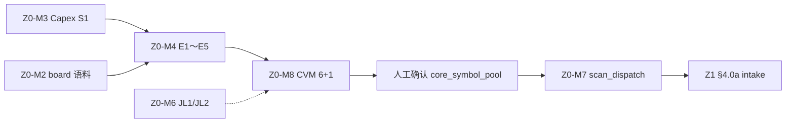
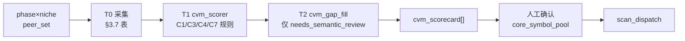
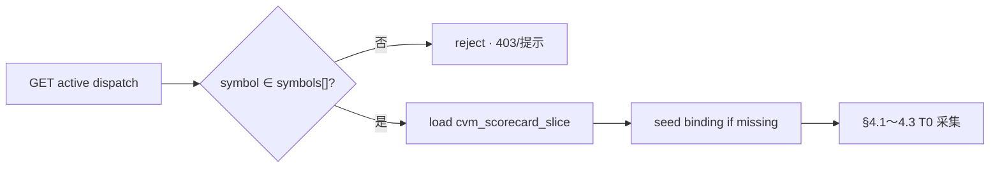
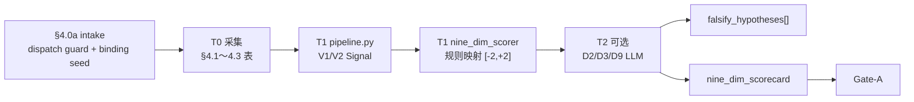

# 34 · 五区指标矩阵与 T0-T2 集成规约（L3 · 数据工程实施权威）

> **一句话**：在 [32_ 五区总纲](./32_五区漏斗工作流与数据工程标准化规约.md) 与 [33_ 前端区际联动](./33_五区工作台_前端区际联动与数据携带契约.md) 之上，**按 Z0～Z4 逐区罗列指标矩阵**（**S0～S3 共享范围** · 通用/定制 · 价值意义 · 一手源 · 首采/频率），并嵌入 **运行时 T0→T1→T2** 实践链与 **区际继承输入包**，供 `metric_registry` / `pipeline.py` / L4 逐步落地。
>
> **与 28_ 分工**：[28_](./28_执行中工作区_标的深度监控_T0-T2开发计划.md) 是 **Z3 探针深规**（JL3/JL4 逐 Key）；**本文不重复 28_ 探针行**，只写 Z3 的继承规则 + 矩阵索引。

> [!NOTE] **[TRACEBACK] 战略追溯锚点**
> - **L1 哲学**：[06_投资哲学体系总纲](../../01_顶层概念/06_投资哲学体系总纲.md)（价值三角 · 多源验证 · 认知边界）
> - **L2 实践规划**：[06_标的深度分析与阶段判定实践规划](../../02_战略维度/06_跨维度协作/06_标的深度分析与阶段判定实践规划.md)
> - **五区总纲**：[32_ §2.4/§5A/§5B/§6](./32_五区漏斗工作流与数据工程标准化规约.md)（**Z0 工作流** · 指标语义 · V0→V4 · 简表）
> - **前端携带**：[33_ §5.8～§5.10](./33_五区工作台_前端区际联动与数据携带契约.md)（UI 读什么 · 晋级带什么）
> - **Z3 探针深规**：[28_ 执行中 JL 矩阵](./28_执行中工作区_标的深度监控_T0-T2开发计划.md)
> - **数据源裁决**：[35_ Tushare 主源收敛](./35_Tushare数据源优先收敛规约.md)（结构化一手源 · 东财白名单）
> - **三底座**：[29_ PG/DeepSea/Redis](./29_三大数据底座与任务调度架构契约.md)
> - **DNA（目标）**：[`dna_stage_1_启动期.yaml`](../_System_DNA/00_co_pilot/dna_stage_1_启动期.yaml) `metric_registry` · `zone_pipeline`（待增）
> - **代码落点（目标）**：`diting-src/apps/copilot/metrics/` · `thesis/binding/` · `modules/executing/`

---

## §0 本文档管什么 / 不管什么

| 管 | 不管 |
|---|---|
| **Z0～Z4 各区指标矩阵清单**（通用/定制 + 定制原因） | 单个 JL3 probe 的 YAML 阈值（→ [28_](./28_执行中工作区_标的深度监控_T0-T2开发计划.md)） |
| 每指标的 **价值意义**、**一手源**、**history_required（价值倒推）**、**增量频率**、**最佳采集窗口** | HTMX 组件与 chip 样式（→ [33_](./33_五区工作台_前端区际联动与数据携带契约.md)） |
| **T0/T1/T2 运行时流水线** 与 **区际 T2 输入包** | Gate 阈值数字的最终裁决（→ [32_ §2](./32_五区漏斗工作流与数据工程标准化规约.md) `gates.yaml`） |
| **何时调 AI（T2）** vs **纯规则（T1）** | Python 采集器完整实现（→ L4 / `diting-src`） |
| `metric_id` 命名与 `metric_registry.yaml` 字段合约 | P 轨 ECS 起停（→ [共享平台基础](../共享平台基础/)） |
| **Z0 四段实践次序 · 通用/定制三档 · 与 33_ 双轨分期**（§2.4 · §3.0b · §11.1～§11.2） | HTMX / step_18 验收细节（→ [33_ §12.1](./33_五区工作台_前端区际联动与数据携带契约.md#design-strategic-phases-crossref)） |
| **`metric_registry` 内 `fact_provenance` / 单写者事实** | 对抗异构 · 权重治理全文（→ [32_ §15](./32_五区漏斗工作流与数据工程标准化规约.md#design-32-anti-self-deception)） |

**永久红线**：no-mock · 缺源 `pending/error` 禁止用 0 顶替 Gate · T2 须 `evidence_spans` / fact_gate（[22_](./22_事实交叉验证与防幻觉规约.md)）

---

<a id="design-34-t-naming"></a>

## §1 共享范围 S0～S3 · 运行时 T0/T1/T2 · V 层（读表前必读）

文档里 **S** 与 **T** 各管一件事；**禁止**用 T0～T3 表示「数据共享范围」（2026-06-17 起已废弃，见 [32_ §5](./32_五区漏斗工作流与数据工程标准化规约.md#design-32-share-scope)）。

### §1.1 对照总表

| | **共享范围 S0～S3** | **运行时 T0 / T1 / T2** |
|---|---------------------|-------------------------|
| **字母** | **S** = Share Scope（共享范围） | **T** = Pipeline Tier（流水线阶段） |
| **回答的问题** | 这条 Raw **采一次存几份**？换标的要不要重采？ | 单条指标 **走几步**：采集 → 信号 → 决断 |
| **本质** | 数据调度 / 成本（cache key 粒度） | 处理阶段 / 模型路由 |
| **权威来源** | [32_ §5](./32_五区漏斗工作流与数据工程标准化规约.md#design-32-share-scope) | [25_ §2](./25_四区漏斗_三段流水线_架构脊柱_设计.md) · [28_](./28_执行中工作区_标的深度监控_T0-T2开发计划.md) |
| **本文表列** | 列 **「共享(S)」** | 列 **「T0 / T1 / T2」** |
| **代码字段** | `metric_registry.share_scope: S0\|S1\|S2\|S3` | `stage_artifacts.stage: T0_raw\|T1_distilled\|T2_verdict` |

**记忆口诀**：

- **S** = 「**S**tore 几份」——S0 全市场一份 · S1 赛道 · S2 生态位 · S3 每 symbol。
- **T** = 「**T**ransform 几步」——T0 入库 · T1 数值/语义信号 · T2 跨维决断。

### §1.2 共享范围 S0～S3（Share Scope · 来自 32_ §5）

| 层级 | 共享范围 | 英文 | 含义 | 换标的时 | cache key |
|------|----------|------|------|----------|-----------|
| **S0** | 全市场 | System-wide | 宏观、VIX、社融、利率 | **不重采** | `global` |
| **S1** | 赛道 | Sector | Capex、赛道政策、地缘框架 | 同赛道共享 | `board:{id}` |
| **S2** | 生态位 | Niche | 光模块 vs 代工；份额格局模板 | 同生态位共享 | `niche:{id}` |
| **S3** | 单标的 | Symbol | 治理、月营收、映射股、技术面 | **每 symbol 采** | `symbol:{code}` |

**代码落点**：`metric_registry.yaml` → `share_scope: S0|S1|S2|S3` · `history_required`（中文单位）。

> **与 28_ 的关系**：28_ 表格「**T1 引擎** = DeepSeek / Python」= **运行时 T1**，与 **S1 赛道共享** 无关。

### §1.3 运行时 T0 / T1 / T2（流水线 · 来自 25_ §2 + 28_ 实践）

| 阶段 | 职责 | 典型实现 | AI |
|------|------|----------|-----|
| **T0** | 一手数据入库（V0 Raw） | 爬虫/API/Cron/Playwright → PG/Timescale/DeepSea | **否** |
| **T1** | **度量 + 语义信号**（V1 Metric + 部分 V2 Signal） | ① 数值：Python/Tushare 分位/同比<br>② 语义：LLM 抽 `signal_status` · `evidence_quotes[]` · `fact_statement` | **语义支常见** |
| **T2** | 跨维综合 / 对抗 / 决断 | Opus 交叉验证 · Bear/Judge · Digest | **是**（Gate 机械裁决除外） |

**边界判定**（[25_ §2.2](./25_四区漏斗_三段流水线_架构脊柱_设计.md)）：纯聚合 → T0/T1 数值支；公告/附注 **语义强弱** → T1 语义支（LLM，`fact_statement`，**禁止编数字**）；多信号 **最终决断** → T2。

**示例（同一指标两列并存）**：

| 读法 | 含义 |
|------|------|
| `M.policy.sector_direction` · **共享 S1** | 政策 Raw 按 **赛道** 只存一份 |
| 同上 · **运行时 T1 语义 = LLM enum** | 在该份 Raw 上抽顺逆风（亦可 T2 低置信复核，见 §9） |

### §1.4 价值链 V0～V4（第三套符号 · 来自 32_ §5B）

| 符号 | 含义 | 本文用法 |
|------|------|----------|
| **V0～V4** | Raw→Metric→Signal→Score→Gate | 表列 **「V 层」** |

> **符号纪律**：**S** = 存几份 · **T** = 走几步 · **V** = 价值链层级 · **Z** = 五区工作区——四套字母互不混用。

---

<a id="design-34-column-legend"></a>

## §2 指标矩阵统一列说明

以下各 §3～§7 主表列含义一致：

| 列 | 含义 |
|----|------|
| **metric_id** | `metric_registry.yaml` 键；新增指标须先登记 |
| **矩阵名** | 人类可读名 |
| **类型** | **通用** = 全市场/全 symbol 同一套；**定制** = 随板块/生态位/标的变化 |
| **定制原因** | 仅定制行填写：板块/行业/生态位/`binding`/`Profile` |
| **价值意义** | 本区为何需要该指标（决策问题） |
| **共享(S)** | S0～S3 共享范围（§1.2） |
| **一手源** | 官方/一手渠道 |
| **首采(history_required)** | 首次回填长度；由 V2 信号与决策终点倒推（§2.1 · [32_ §5B.2](./32_五区漏斗工作流与数据工程标准化规约.md#design-32-history-required)） |
| **增量·最佳窗口** | 频率 + 建议 cron（UTC+8） |
| **T0** | 采集动作摘要（Raw 入库） |
| **T1** | 度量/信号摘要：**数值支**（规则/Python）或 **语义支**（LLM 抽 `signal_status` / enum / 引述） |
| **T2** | 跨维综合/对抗/决断；**—** 表示本指标不在本区跑 T2 |
| **V 层** | 主要落点 V0～V4 |
| **产出对象** | 写入何处 |
| **Gate/用途** | 本区消费点 |
| **fact_provenance** | （可选列）`raw_fact_id` · `decision_function` → **authoritative_consumer**；见 [32_ §15.3](./32_五区漏斗工作流与数据工程标准化规约.md#design-32-fact-provenance) |

<a id="design-34-history-required"></a>

### §2.1 `history_required` 规划（与 32_ §5B.2 一致）

首采长度 = **本指标在价值链里怎么算信号** 所决定的最短历史，再加少量 buffer。公式：

```
history_required = max(V1 计算窗口, V2 语境窗口) + buffer
```

**登记步骤**（`metric_registry` 每条指标）：

1. `decision_endpoints[]`：喂给哪个 Gate / D 分 / P0′ / 硬中断。
2. `v2_signal.transform`：同比、分位、滚动、事件、语料 enum 等。
3. 按下表或 §2.2 填 `history_required`（**中文可读单位**：个月 / 日 / 年 / 个季度）。

**区际继承**：下游只读上游已提炼 JSON（如 `liquidity_regime`），**不重复**拉上游 Raw 的全量历史。

### §2.2 首采缺省表（Z0～Z1 主链 · 节选）

| metric_id / 簇 | 决策终点 | V2 信号 | history_required |
|----------------|----------|---------|------------------|
| `M.macro.gdp_yoy` / PMI / 社融 | P0 语境 | 同比 + 近36个月趋势 | **36个月** |
| `M.macro.us10y` | P0′ | 周变 / regime | **24个月** |
| `M.macro.vix` | P0′ | 3年分位 或 阈值 | **3年** / **30日** |
| `M.policy.sector_direction` | E1/E3 · 扫描 | LLM enum | **滚动保留24个月** |
| `M.policy.capex_total` | D3 · E1 | 同比 / 加速 | **8个季度** |
| `M.share.estimated` | Gate-A D1 | 份额趋势 | **36个月** |
| `M.fin.gross_margin_trend` | Gate-A D4 | 4个季度斜率 | **8个季度** |
| `M.val.pe_percentile` | Gate-C D6 | 10年分位 | **10年** |
| `M.rf.daily_ohlcv` | Gate-C · RF | 均线 / 相对强度 | **约2年** |
| `M.liq.north_net_20d` | P0′ D8 | 20日滚动 / 3年分位 | **30日** / **3年** |
| `M.gov.rss_hard_stop` | Gate-D A9 | 事件 | **无回填**（仅增量 RSS） |
| `M.expect.surprise` | D9 | 预期差 | **4个季度** |

> Z3 探针逐 Key 的 `history_required` 以 **[28_ `probe_registry`](./28_执行中工作区_标的深度监控_T0-T2开发计划.md)** 为准。

<a id="design-34-z0-workflow-ref"></a>

### §2.3 Z0 工作流引用（权威在 32_）

Z0 **指标先行四段工作流**（A 风向标 → B genesis 建板 → C E1～E5 + **CVM 6+1** → D Living Z0）、**genesis 模板**、**区际分界**、**CVM 进池规则**、**scan_dispatch 契约** 的 **normative 定义** 见 **[32_ §2.4](./32_五区漏斗工作流与数据工程标准化规约.md#design-32-z0-workflow)**。

**本文 §3 职责**：各段对应的 **metric 矩阵**、**T0/T1/T2 流水线**、**`cvm_scorecard` / `wind_scan` schema**——不重复 32_ 的产品工作流叙述。

**执行顺序**：先按 32_ §2.4 完成 A→B→C，再按 §3 采集/刷新；§3 表是 **段 A/C/D 的指标契约**，不是「先建空 board 再反查指标」。

**定制矩阵何时有采集目标**：段 A **尚无** `strategic_board`，**禁止**提前全量采 Z0-M4/M8/M6 的 niche/peer 定制数据；段 B genesis 落库后才有 `theme_keywords` / `niche_layers` / `jl*_keys`；段 C 才按 phase×niche 开 peer_set 与 CVM。**段 B 是配置定制，不是 T0 采数**。

<a id="design-34-generic-custom"></a>

### §2.4 通用 / 定制三档 · 实践次序（读 §3 表前）

| 档位 | 含义 | Z0 示例 | 何时可实践 |
|------|------|---------|------------|
| **纯通用** | 公式与一手源全市场一致 | Z0-M1 宏观 · Z0-M5 流动性 · Z0-M0 合成 | **段 A** 即可 T0 cron |
| **框架通用 + 定制语料/输入** | 流水线固定，过滤键随 board/binding 变 | Z0-M2 政策（段 A=S0 全市场 RSS → 段 B 后=S1 board 关键词） | 段 A 采 Raw；段 B 后 T1 按 board 过滤 |
| **纯定制** | 判据、peer、Key 随 board/phase/niche/symbol 变 | Z0-M4 E1～E5 · Z0-M8 CVM · Z0-M6 JL · Z1 `binding.peer_list` | **段 B 确认 niche 后**（CVM 须段 C） |

**与 Z1～Z4**：Z1 九维算法多为「通用算法 + 定制输入」——`scan_dispatch` + intake seed 的 `binding/{symbol}.yaml` 提供 peer/sector；**不得**在 Z0 未派单时独自重圈产业锚点（[32_ §2.4.2](./32_五区漏斗工作流与数据工程标准化规约.md#design-32-z0-workflow)）。

**启动期三条入口**（与 [33_ §12.1](./33_五区工作台_前端区际联动与数据携带契约.md#design-strategic-phases-crossref) 一致）：

| 入口 | 适用 | 段 A | 段 B | 段 C |
|------|------|------|------|------|
| **标准绿field** | 从零发现风口 | 跑 M1/M5/M2(A)/M0 | 用户选 wind_scan 候选 → genesis | E1～E5 + CVM + dispatch |
| **seed 样板** | 8 持仓 / step_18 | 可并行补 M1/M5；wind_scan 可选 | `copilot-step18-seed-ai-board`（附录 A） | 在 seed board 上跑 CVM |
| **Z3 倒灌** | 持仓直入监护 | 补 P0/生态位语境 | 可后补战略标签 | 先 Z1 九维 → Z2 证据包（[33_ §5.10.11](./33_五区工作台_前端区际联动与数据携带契约.md#design-strategic-end-to-end)） |

---

<a id="design-34-z0-matrix"></a>

## §3 Z0 · 产业风向台 · 指标矩阵

> **执行顺序**：见 [32_ §2.4](./32_五区漏斗工作流与数据工程标准化规约.md#design-32-z0-workflow)、[§2.3～§2.4](#design-34-z0-workflow-ref) 与 **[§3.0b 四段×矩阵对照](#design-34-z0-segment-matrix)**。

### §3.0 本区指标矩阵总览（价值定位）

| 矩阵 ID | 名称 | 段 | 通用/定制 | 价值意义 | 主产出 |
|---------|------|-----|-----------|----------|--------|
| **Z0-M0** | 宏观风口扫描 | **A** | **通用** | 全市场优势赛道排序 | **`wind_scan.json`** |
| **Z0-M1** | 宏观景气矩阵 | A · D | **通用** | 经济周期 · 利率方向 | P0 语境 |
| **Z0-M2** | 政策产业矩阵 | A · B · D | **框架 + 定制语料** | 政策顺逆风 | T1 enum · board 关键词 |
| **Z0-M3** | 赛道 Capex 矩阵 | C · D | **S1 + 定制 IR** | 下游资本开支周期 | 生态位 · CVM C3 输入 |
| **Z0-M4** | 生态位 E1～E5 | C · D | **定制（phase/board）** | phase 级五维卡位 | `ecosystem_scores` |
| **Z0-M5** | 流动性 regime（P0′） | A · D | **通用** | 全市场资金面突变 | **`liquidity_regime.json`** |
| **Z0-M6** | 战略 JL1/JL2 | C · D | **定制（board）** | 板块级红灯 | JL 聚合面板 |
| **Z0-M8** | **CVM 核心池矩阵（6+1）** | **C** | **niche×phase 定制 peer** | **价值链锚点圈定** | **`cvm_scorecard.json`** |
| **Z0-M7** | 扫描派单 | C | **定制（phase）** | 派 Z1 清单 | **`scan_dispatch`** |

**Z0 不绑定单 symbol 的 `funnel_stage`**；段 A 主键 **wind_scan**；段 C 主键 **board/phase/niche**；派单时落到 symbol 列表。

<a id="design-34-z0-segment-matrix"></a>

### §3.0b Z0 四段 × 矩阵 × 前置条件 × Make（实施对照）

> **UI 与人工确认点**见 [33_ §4.3～§4.6](./33_五区工作台_前端区际联动与数据携带契约.md#design-strategic-roadmap-ui)；**合并 Wave**见 [§11.2](#design-34-wave-order)。

| 段 | 矩阵 ID（按序） | 通用/定制 | 前置条件 | 主产出 | Make / 动作（目标） |
|:--:|-----------------|-----------|----------|--------|---------------------|
| **A** | **Z0-M1** → **Z0-M5** → **Z0-M2**（全市场 RSS）→ **Z0-M0** | 通用 + M2 段 A 语料 | 无 board；`metric_registry` 已登记 | `wind_scan.json` · `liquidity_regime.json` | `copilot-zone-z0-collect` · `POST .../wind-scan/run` |
| **B** | （无新 T0 矩阵）genesis 配置 | **配置定制** | 段 A 候选 + 人工确认 | `strategic_board` · `strategic_phases[]` · `theme_keywords` | `apply_genesis_template` · [33_ §4.4](./33_五区工作台_前端区际联动与数据携带契约.md) |
| **B′** | **Z0-M2**（board 关键词过滤） | 框架+定制语料 | 段 B 已落库 | S1 政策 enum per board | 同 M2 T1 · 语料 scope 切换 S0→S1 |
| **C** | **Z0-M3** → **Z0-M4** → **Z0-M8** → **Z0-M6** → **Z0-M7** | 定制 | phase×niche 已声明 · `peer_list` 在 niche_template | `ecosystem_scores` · `cvm_scorecard` · `scan_dispatch` | `POST .../cvm/run` · 人工确认 · 派单 |
| **D** | **Z0-M1/M5/M0** 刷新 + 池/JL 漂移 | 通用刷新 + 定制监控 | Living board 存在 | 更新快照 · 可选 wind_shift dispatch | cron 同段 A + CVM 漂移规则 [32_ §2.4.4](./32_五区漏斗工作流与数据工程标准化规约.md#design-32-z0-workflow) |

**段 C 矩阵依赖**（不可跳步）：



---

### §3.0a Z0-M0 · 宏观风口扫描（段 A · 通用）

| 步骤 | 输入 metric | T0 | T1 | T2 | 产出 |
|------|-------------|----|----|-----|------|
| 宏观合成 | Z0-M1 全表 | 统计局/央行/FRED | 同比·分位·regime | **可选** sector 语义排序 | `wind_scan.candidates[]` |
| 政策事件 | 全市场 RSS（**无 board 关键词**） | DeepSea 入库 | 行业标签聚类 | `{ sector, evidence_spans[] }` | 同上 |
| 流动性 | Z0-M5 | CCASS/两融/VIX | `liquidity_regime` | — | `wind_scan.p0_prime` |

**`wind_scan.json` schema（目标）**：

```yaml
wind_scan_id: "ws-2026-06-17"
as_of: "2026-06-17"
p0_snapshot: { ... }
candidates:
  - sector: "AI算力"
    wind_score: 0.82
    rank: 1
    evidence_spans: [{ source, span, metric_id }]
    macro_wind_refs: [M.macro.pmi, M.policy.capex_total]
advisory_only: true
```

### §3.1 Z0-M1 · 宏观景气矩阵（通用）

| metric_id | 矩阵名 | 类型 | 定制原因 | 价值意义 | 共享(S) | 一手源 | 首采(history_required) | 增量·最佳窗口 | T0 | T1 | T2 | V | 产出 | Gate |
|-----------|--------|------|----------|----------|------|--------|------|---------------|----|----|-----|---|------|------|
| `M.macro.gdp_yoy` | GDP 同比 | 通用 | — | 经济大盘温度 | S0 | 国家统计局 | **36个月** | 季 · 发布日+1 | 统计局 API/公告 | 同比 | — | V1→V2 | metric_store | P0 语境 |
| `M.macro.pmi` | 制造业 PMI | 通用 | — | 景气边际 | S0 | 国家统计局 | **36个月** | 月 · 月末+1 | 同上 | 原值+同比 | — | V1 | metric_store | P0 |
| `M.macro.social_financing` | 社融/M2 | 通用 | — | 信用脉冲 | S0 | 中国人民银行 | **36个月** | 月 · 发布日+1 | 央行 | 同比 | — | V1→V2 | metric_store | P0/P0′ |
| `M.macro.us10y` | 10Y 美债 | 通用 | — | 全球 risk 定价锚 | S0 | 美联储/FRED | **24个月** | 日 · 07:00 | 行情/API | 日变/周变 | — | V2 | liquidity_regime | **P0′** |
| `M.macro.vix` | VIX | 通用 | — | 恐慌 regime | S0 | CBOE | **3年** | 日 · 07:00 | 行情 | 3年分位 | — | V2 | liquidity_regime | **P0′** |

### §3.2 Z0-M2 · 政策产业矩阵（通用框架 · 定制语料）

| metric_id | 矩阵名 | 类型 | 定制原因 | 价值意义 | 共享(S) | 一手源 | 首采 | 增量·最佳窗口 | T0 | T1 | T2 | V | 产出 | Gate |
|-----------|--------|------|----------|----------|------|--------|------|---------------|----|----|-----|---|------|------|
| `M.policy.sector_direction` | 赛道政策方向 | **定制语料** | 段 A：**全市场** RSS；段 B 后 **按 `strategic_board` 关键词** 过滤 | 顺逆风 enum | S0→S1 | 发改委/工信部/国务院 | **滚动保留24个月** | 事件 · 日轮询 08:00 | RSS/公告入库 DeepSea | 去重 | **LLM 抽取 enum** | V2 | `wind_scan` / board | E1/E3 |
| `M.policy.capex_total` | 云厂 Capex 合计 | 通用 S1 | — | 赛道需求天花板 | S1 | 四大云 IR、SEMI | **8个季度** | 季 · 财报季+1 | transcript/报表 T0 | 求和+同比 | 可选 LLM 方向 | V1→V2 | metric_store | E1 · D3 语境 |

### §3.3 Z0-M4 · 生态位 E1～E5 矩阵（按 phase 定制）

| 维度 | 类型 | 定制原因 | 价值意义 | 依赖矩阵 | T0/T1/T2 | 产出 |
|------|------|----------|----------|----------|----------|------|
| **E1 利润卡位** | 定制 | **产业链环节不同**（组装 vs 光模块 vs 设备） | 钱在链上哪一环 | Z0-M3 + 财报汇总 T1 | T1 规则 + 季审 T2 叙事 | `ecosystem_scores.e1` |
| **E2 稀缺/卡脖子** | 定制 | **板块瓶颈不同**（CoWoS/HBM/电力/液冷） | 供给约束是否利好本环节 | Z0-M2 + 行业新闻 | T2 LLM 事件簇 | `ecosystem_scores.e2` |
| **E3 政策顺逆** | 定制 | 同上 Z0-M2 | 政策 wind | Z0-M2 | T1 enum | `ecosystem_scores.e3` |
| **E4 阶段契合** | 定制 | **S 曲线位置因赛道而异** | 基建/爆发/过剩 | Z0-M3 + 历史营收 T1 | T1 规则 | `ecosystem_scores.e4` |
| **E5 持续性** | 定制 | 赛道竞争格局 | 是否 2～3 年主线 | 综合 E1～E4 | T2 季审 | `ecosystem_scores.e5` |

**为何不全通用**：同一「AI 生态」板内，液冷 vs 光模块 vs 代工组装的 **E2/E4 判据不同**——须按 `strategic_phase.niche_template` 引用不同 `metric_id` 子集（非换公式）。

### §3.4 Z0-M5 · 流动性 regime（P0′ · 通用）

| metric_id | 类型 | 价值意义 | 一手源 | 首采 | 增量·窗口 | T0 | T1 | T2 | 产出 |
|-----------|------|----------|--------|------|-----------|----|----|-----|------|
| `M.liq.north_net_20d` | 通用 | 外资流向 | 港交所 CCASS | **3年** / **30日** | 日 · **T+1 09:00** | CCASS | 20日滚动 | — | liquidity_regime |
| `M.liq.margin_balance` | 通用 | 杠杆温度 | 交易所两融 | **3年** | 日 · T 日 18:00 | 交易所 | 占流通+分位 | — | 同上 |
| `M.liq.regime_composite` | 通用 | **P0′ 合成 regime** | 上列 + 美债/VIX | 按子项 | 日 · T 日 18:00 | — | 规则合成 | 可选 LLM 摘要 | **`liquidity_regime.json`** |

详见 [32_ §5B.4～§5B.7](./32_五区漏斗工作流与数据工程标准化规约.md#design-32-liquidity-regime)。

### §3.5 Z0-M6 · 战略 JL1/JL2（按 board 定制）

| 层级 | 类型 | 定制原因 | 价值意义 | T0/T1/T2 | 与 Z3 关系 |
|------|------|----------|----------|----------|------------|
| **JL1 宏观** | 定制 | 每 board 配置不同 Key（如 AI vs 电力） | 板块级宏观探针 | T0 结构化 + T2 事件语义 | **Optional Context** 注入 Z1/Z3 T2，**不占 Z3 探针行** |
| **JL2 行业** | 定制 | 行业风险因子不同 | 行业红灯 | 同上 | 同上 |

配置落点：`strategic_boards.jl1_keys[]` / `jl2_keys[]`（见 [33_ §5.10.2](./33_五区工作台_前端区际联动与数据携带契约.md)）。

<a id="design-34-z0-cvm"></a>

### §3.7 Z0-M8 · CVM 核心池矩阵（6+1 · 段 C）

> **进池规则与 role 枚举**：[32_ §2.4.4](./32_五区漏斗工作流与数据工程标准化规约.md#design-32-z0-workflow) · rubric 模版 `metrics/cvm_rubric.yaml`（目标）。

| CVM 维 | 主引擎 | 绑定 metric_id / 簇 | T0 | T1 | T2 |
|--------|--------|---------------------|----|----|-----|
| **C1 利润池** | T1 | `M.niche.profit_pool_share` · 分部毛利 · S2 生态位利润分布 | 巨潮分部 · 同业汇总 | 占比+4季趋势 | — |
| **C2 卡脖子** | T1+T2 | `M.tech.substitution_risk` · 产能/认证事件 | 公告/白皮书 | 规则+事件标记 | **填槽** bypass 时间表 |
| **C3 价值量** | T1 | `M.growth.capex_cycle` · `M.product.asp_trend` · 订单能见度 | IR/月报 | Capex链×ASP | — |
| **C4 结构主导** | T1 | `M.share.estimated` · Top客户/配额事件 | 月营收 peer_set | 份额+顺位 | — |
| **C5 迁移安全** | T2 | `M.tech.substitution_risk` · 路线渗透 | 产业白皮书 | 规则骨架 | **填槽** bypass_risk |
| **C6 持续性** | T1+T2 | E1～E4 跨 phase 对照 | — | 规则 | **one_line** 跨 phase |
| **C7 伪龙头哨兵** | **T1 only** | 三死穴 · 题材占比 · 份额降+叙事升 | RSS/巨潮 | **硬规则** | **禁止** |

**peer_set 定制**：每 `niche_template` 声明 `binding.peer_list`（S2/S3）；**禁止**全 A 扫。

**`cvm_scorecard.json` schema（目标）**：

```yaml
phase_id: 12
niche_id: "gpu-optical"
symbol: "300308"
scores:
  c1: { band: high, trend: up, evidence_refs: [...] }
  c2: { band: high, needs_semantic_review: false }
  c3: { band: high }
  c4: { band: high }
  c5: { bypass_risk: low }
  c6: { band: mid_high }
  c7: { pass: true, triggers: [] }
anchor_path: structure          # profit | structure | growth
role_suggested: monopoly
pool_eligible: true
dispatch_priority: 1
provisional: false              # T1 覆盖不足时为 true
human_confirmed: false
```

### §3.8 Z0 段 C · CVM 流水线（T0→T1→T2→人确认）



| 步骤 | 实现目标 | 验证 |
|------|----------|------|
| T1 | `apps/copilot/metrics/cvm_scorer.py` + [32_ `z0_cvm`](./32_五区漏斗工作流与数据工程标准化规约.md#design-32-z0-workflow) | 伪龙头样例 C7=fail |
| T2 | `prompt_profile: cvm_gap_v1` · 输入 T1 缺口格 | 输出须 schema · fact_gate |
| 确认 | UI [33_ §4.6](./33_五区工作台_前端区际联动与数据携带契约.md#design-strategic-cvm-ui) | `human_confirmed=true` 才可 dispatch |

**T2 在 Z0 的 prompt 约束**（结构化 · 禁止长文）：

| 场景 | 输入 | 输出 schema |
|------|------|-------------|
| 段 A 风口 | M0/M1 Raw | `{ sector, wind_score, evidence_spans[] }` |
| 段 B phase | genesis + Capex | `{ phases[].window, s_curve_position }` |
| 段 C C2/C5/C6 | T1 缺口 + DeepSea | `{ dimension, band, evidence_spans[] }` |

### §3.6 Z0 → 下游：交付包（Z0 不跑 symbol 级 Gate）

Z0 **不向单 symbol 写 Gate**；产出为 **清单级 + 全局 JSON**（契约见 [32_ §2.4.5～§2.4.6](./32_五区漏斗工作流与数据工程标准化规约.md#design-32-z0-workflow)）：

```yaml
# scan_dispatch（Z0→Z1 · 段 C 人确认后）
genesis_ref: { board_id, wind_scan_id, template_version: "1.0" }
theme: "AI算力基建"
strategic_phase_id: 12
layer: infra
symbols: ["601138", "300308"]
symbol_roles: { "601138": leader, "300308": monopoly }
cvm_scorecard_ref: "cvm/phase-12-niche-gpu.json"
p0_snapshot: { regime: normal, p0_prime: risk_neutral }
ecosystem_e1_e5: { e1: 0.82, e2: 0.91, e3: 0.75, e4: 0.68, e5: 0.80 }
liquidity_regime_ref: "liquidity_regime.json#2026-06-17"
advisory_only: true
human_confirmed: true
```

---

<a id="design-34-z1-matrix"></a>

## §4 Z1 · 机会雷达 · 指标矩阵

### §4.0 本区指标矩阵总览

| 矩阵 ID | 名称 | 通用/定制 | 价值意义 | 主产出 |
|---------|------|-----------|----------|--------|
| **Z1-M0** | 派单 intake + 继承上下文 | 只读 + **校验** | 清单内扫描 · binding seed · CVM 只读 | **`dispatch_intake`** → `scan_dispatch` + `cvm_scorecard_slice` |
| **Z1-M1** | 九维攻击维 D1/D2/D3/D4/D9 | **通用算法 + 定制输入** | 「值不值得深研」 | `nine_dim_scorecard` |
| **Z1-M2** | 九维守势维 D5/D7 | **通用 + 定制事件** | 一票否决 | `veto` |
| **Z1-M3** | 九维时机维 D6/D8 | **通用算法 + 定制水位** | 暂不 Gate-A；供 Z3 Gate-C | 计分卡时机列 |
| **Z1-M4** | 待证伪假设 | **定制（symbol）** | 晋级 Z2 的证伪种子 | `falsify_hypotheses[]` |

**本区核心产出**：**`nine_dim_scorecard.json`** → **Gate-A**（[32_ §5A.8](./32_五区漏斗工作流与数据工程标准化规约.md#design-32-nine-dim-scoring) · 工作流 [32_ §2.4.7](./32_五区漏斗工作流与数据工程标准化规约.md#design-32-z1-dispatch-workflow)）。

<a id="design-34-z1-dispatch-intake"></a>

### §4.0a Z1-M0 · 派单 intake 流水线（dispatch 约束 · 先于 T0）

> **normative**：[32_ §2.4.7](./32_五区漏斗工作流与数据工程标准化规约.md#design-32-z1-dispatch-workflow) · UI [33_ §4.7](./33_五区工作台_前端区际联动与数据携带契约.md#design-strategic-radar-ui)



| 步骤 | 实现要点 | 验证 |
|------|----------|------|
| **load dispatch** | `scan_dispatch.status=active` · `human_confirmed=true` | 无 active 时 Z1 显示空态（33_ §4.7） |
| **symbol guard** | API/ pipeline 入口校验 `symbol in dispatch.symbols` | 越界 symbol 返回 403 + `DISPATCH_SCOPE_VIOLATION` |
| **cvm slice** | 从 `cvm_scorecard_ref` 取该 symbol 行 → `T2Context.inherited.cvm_scorecard_slice` | 含 `role`, `anchor_path`, `c7.pass` |
| **binding seed** | `niche_template.peer_list` → `thesis/binding/{symbol}.yaml`（仅 peer_list/sector/niche/thesis_template_id） | D1 `M.share.estimated` 可算 |
| **supersede** | 新 dispatch active 时旧任务标记 `superseded`；进行中的 scan job 可完成但不新开 | 双 active 禁止 |

**Make 合约（目标）**：

| target | 用途 |
|--------|------|
| `copilot-zone-z1-dispatch-intake` | 拉 active dispatch + 校验 symbol 列表 |
| `copilot-zone-z1-scan-dispatch` | 对指定 `dispatch_id` batch 跑九维（等价 §4.4 全链） |

### §4.1 Z1-M1 · 九维攻击维（D1～D4、D9）

| 维 | metric_id（主） | 类型 | 定制原因 | 价值意义 | 共享(S) | 一手源 | 首采 | 增量·窗口 | T0 | T1 | T2 | 产出 |
|----|-----------------|------|----------|----------|------|--------|------|-----------|----|----|-----|------|
| **D1 行业地位** | `M.share.estimated` | 定制 | **`binding.peer_list`** 决定同业集 | 份额升/降 | S3 | MOPS/巨潮月营收 | **36个月** | 月 · **11 日** | 月报 | 份额= self/Σpeers | 可选 LLM 客户集中 | D1 分 |
| **D2 技术壁垒** | `M.tech.substitution_risk` | 混合 | 赛道 **S1 替代时间表** 通用；**认证/专利 S3** 定制 | 可替代性 | S1+S3 | 白皮书/GTC + 巨潮 | **滚动保留24个月** / **36个月** | 事件/季 | 入库 | 规则+分位 | **LLM rubric** | D2 分 |
| **D3 成长空间** | `M.growth.capex_cycle` | 混合 | Z0 **S1 Capex** 通用；TAM **按 niche** |  S 曲线位置 | S1 | Z0-M3 + 研报 | **8个季度** | 季 | 继承+采集 | 同比/加速 | LLM TAM | D3 分 |
| **D4 盈利能力** | `M.fin.gross_margin_trend` | 定制 | **行业毛利率口径不同** | 盈利趋势 | S3 | 巨潮利润表 | **8个季度** | 季 · 披露日 | 财报 T0 | 4个季度斜率 | — | D4 分 |
| **D9 预期差** | `M.expect.surprise` | 定制 | **卖方覆盖度因 symbol 异** | 预期 vs 现实 | S3 | 研报一致预期 | **4个季度** | 周 · **周末** | 预期 T0 | surprise | **LLM 法说会** | D9 分 |

**attack_score** = D1+D2+D3+D4+D9（D6/D8 **不参与** Gate-A）。

### §4.2 Z1-M2 · 守势维（D5/D7 · 否决）

| 维 | metric_id | 类型 | 定制原因 | 价值意义 | 一手源 | 首采 | 增量·窗口 | T0 | T1 | T2 |
|----|-----------|------|----------|----------|--------|------|-----------|----|----|-----|
| **D5 财务质量** | `M.gov.*`（P4 簇） | 定制 S3 | 每司关联交易/现金流异 | 财务洗澡 | 巨潮三表+公告 | **12个季度** / **36个月（事件）** | 季+**实时** | 财报+RSS | 规则评分 | — |
| **D7 治理风险** | `M.gov.insider_sell` 等 | 定制 S3 | 事件 per symbol | 减持/问询 | 巨潮 | **36个月** | **实时** | RSS | **零 LLM 硬中断** | — |

**D5/D7 ≤ -1 → `veto=true`**，优先于 attack_score。

### §4.3 Z1-M3 · 时机维（D6/D8 · Gate-C 预埋）

| 维 | metric_id | 类型 | 定制原因 | 价值意义 | 一手源 | T1 要点 | D8 特殊 |
|----|-----------|------|----------|----------|--------|---------|---------|
| **D6 估值** | `M.val.pe_percentile` | 通用算法 | — | 贵/便宜 | 交易所+财报 | **10年** | — |
| **D8 筹码** | `M.liq.micro_*` + 宏中微水位 | 混合 | **三层一致性折价**（[32_ §5B.5](./32_五区漏斗工作流与数据工程标准化规约.md#design-32-value-matrix)） | 资金是否配合 | CCASS/两融/换手 | 分位+折价 | 读 `liquidity_regime` |

### §4.4 Z1 流水线（T0→T1→T2→产出）



**T2 输入包 `T2Context(Z1)`**（实现时 JSON Schema）：

```yaml
symbol: "601138"
inherited:
  scan_dispatch: { ... }          # Z0
  liquidity_regime: { ... }         # Z0 横切
  cvm_scorecard_slice: { ... }      # Z0 只读 · anchor_path · role · C7 pass
  binding: binding/601138.yaml      # 若已建
metric_store_slice:                 # 本区 T0/T1 产出
  - metric_id: M.share.estimated
    v2_signal: ...
  - ...
nine_dim_scoring_ref: metrics/nine_dim_scoring.yaml
prompt_profile: radar_nine_dim_v1   # T2 仅攻击维补充项
```

**AI 调用点（Z1）**：

| 场景 | 模型档 | 输入 | 输出 |
|------|--------|------|------|
| D2/D3/D9 语义补充 | T2 顶尖/一般 | T2Context + DeepSea 片段 | rubric 分 · `evidence_spans` |
| 主 Gate | **规则** | `nine_dim_scorecard` + `gates.yaml` | Gate-A · **不用 LLM 裁决** |

---

<a id="design-34-z2-matrix"></a>

## §5 Z2 · 买入论证台 · 指标矩阵

### §5.0 本区指标矩阵总览

| 矩阵 ID | 名称 | 通用/定制 | 价值意义 | 主产出 |
|---------|------|-----------|----------|--------|
| **Z2-M0** | 继承 Z1 | 只读 | 九维基线 + 待证伪假设 | `analysis_snapshot` |
| **Z2-M1** | 证据包 EVD 槽位矩阵 | **通用模板 + 定制 binding** | 论文每个前提是否有料 | **`evidence_pack.json`** |
| **Z2-M2** | 深度财务/治理深化 | 定制 S3 | D5/D7 深化、附注穿透 | EVD.* 填充 |
| **Z2-M3** | 对抗法庭 | 定制 symbol | Bear 能否杀死论文 | **`thesis.json` 草案** |
| **Z2-M4** | 前提-探针预埋 | 混合 | 为 Z3 订阅 13 轴/28_ | `monitor_subscriptions` |

### §5.1 Z2-M1 · 证据包槽位矩阵（通用模板 · 定制 binding）

**模板层（通用）**：`thesis_slot_template.yaml` 定义 `EVD.P0_macro` … `EVD.Pn_*` 与 `metric_id` 绑定。

**绑定层（定制）**：`binding/{symbol}.yaml` 决定：

| 定制键 | 定制原因 | 影响 |
|--------|----------|------|
| `sector` / `niche` | 行业话语与可比公司 | 选哪些 T1/T2 语料 |
| `peer_list[]` | 份额/营收对比 | D1/P2 槽位 |
| `mapped_list[]` | 台股/ADR 映射 | 交叉验证槽位 |
| `thesis_template_id` | 模板 A/B/C/Bull | 前提条数与 EVD 映射 |

**代表性槽位 × 指标（节选）**：

| EVD 槽位 | 绑定 metric_id | 类型 | 价值意义 | T0 | T1 | T2 |
|----------|----------------|------|----------|----|----|-----|
| `EVD.P0_macro` | Z0 `liquidity_regime` + P0 | 通用 | 宏观前提可验证 | 读 Z0 JSON | — | LLM 摘要 |
| `EVD.P1_demand` | `M.growth.capex_cycle` | T1 通用 | 需求前提 | 继承+补采 | 同比 | LLM 法说会引述 |
| `EVD.P2_share` | `M.share.estimated` | 定制 peers | 份额前提 | 月营收 T0 | 份额 | — |
| `EVD.P4_governance` | `M.gov.*` | 定制 S3 | 治理 Kill | 巨潮 | 规则 | — |
| `EVD.P5_valuation` | `M.val.pe_percentile` | 通用算法 | 估值前提 | 行情+财报 | 分位 | — |

**evidence_health.blocking=true** → 禁止 Gate-B。

### §5.2 Z2-M3 · 对抗法庭（T2 主战场）

| 模板 | 类型 | T2 输入包 | AI 角色 | 产出 |
|------|------|-----------|---------|------|
| **A 起草** | 通用结构 | `evidence_pack` + `nine_dim_scorecard` + `evidence_health` | LLM 填 P0～Pn **仅引用 EVD** | thesis 草案 |
| **B Bear** | 通用 | 同上 **无持仓泄露** | 独立会话攻击 | Bear 报告 |
| **C Judge×2** | 通用 | Bear + Bull | 认知/风控双裁决 | Gate-B 建议 |

**T2 输入包 `T2Context(Z2)`**：

```yaml
symbol: "601138"
inherited:
  nine_dim_scorecard: { ... }       # Z1 全量
  falsify_hypotheses: [ ... ]       # Z1
  workspace_artifacts_z1: { ... }
  symbol_strategic_tags: { ... }    # 可选
local:
  evidence_pack: { slots: [...], evidence_health: {...} }
  binding: binding/601138.yaml
  metric_store_slice: [ ... ]       # 槽位引用的最新信号
prompt_templates: thesis/template_a_v3.md
```

---

<a id="design-34-z3-matrix"></a>

## §6 Z3 · 持仓监护室 · 指标矩阵

### §6.0 本区指标矩阵总览

| 矩阵 ID | 名称 | 通用/定制 | 价值意义 | 深规 |
|---------|------|-----------|----------|------|
| **Z3-M0** | 继承 Z0～Z2 | 只读 | 论文+九维+证据链 | [33_ §5.10.6](./33_五区工作台_前端区际联动与数据携带契约.md) |
| **Z3-M1** | 事实层 RF | 通用算法+定制 symbol | 价量/资金/归因（回路 2） | `fact_layer` |
| **Z3-M2** | 13 轴 / JL 探针 | **Profile 定制** | 前提死活 | **[28_ 全文](./28_执行中工作区_标的深度监控_T0-T2开发计划.md)** |
| **Z3-M3** | Gate-C/D | 通用规则 | 建仓/退出 | `decision_log` |

**本文不展开 Z3-M2 逐 probe 行**——实现、首采、cron、blocker 以 **28_ `probe_registry`** 为准。

### §6.1 Z3-M1 · 事实层（RF · 节选）

| metric_id | 类型 | 价值意义 | 一手源 | 首采 | 增量·窗口 | T0 | T1 | T2 |
|-----------|------|----------|--------|------|-----------|----|----|-----|
| `M.rf.daily_ohlcv` | 定制 S3 | 价格事实 | 交易所 | **约2年** | 日 · **T 日 18:00** | 行情 | 复权 | — |
| `M.rf.drawdown_from_peak` | 定制 S3 | 回撤 | 衍生 | 建仓起 | 日 | — | 规则 | — |
| `M.rf.liquidity_attribution` | 混合 | 回路 2 归因 | D8 三层+映射 | 按 D8 | 日 | 读 Z1/Z0 | 折价规则 | 可选 LLM 摘要 |
| `M.gov.rss_hard_stop` | 定制 S3 | **A9 硬中断** | 巨潮 RSS | — | **30min 盘中** | RSS | 关键词 | **禁止 LLM** |

### §6.2 Z3 T2 输入包（最复杂 · 叠层）

```yaml
symbol: "601138"
inherited:
  thesis: { zone_state: formal, premises: [...] }    # Z2
  nine_dim_scorecard_snapshot: { ... }                 # Z1 入场快照
  evidence_pack_id: ...
  symbol_strategic_tags: ...
  liquidity_regime: ...
optional_context:
  jl1_jl2_board: ...                                   # Z0 JL
local:
  fact_layer: { ... }
  probe_facts: { ... }                                 # 28_ T0/T1
  metric_store_slice: ...
executing_profile: executing_profiles/601138.yaml      # 定制根因
t2_audit:
  model_profile: opus_cross_check
  inputs: [fact_layer, probe_facts, optional_context]
```

**AI 调用点（Z3）**：

| 场景 | T1/T2 | 说明 |
|------|-------|------|
| A9 减持/问询 | **T1 硬规则** | 零 LLM |
| A1/A6 语义探针 | T2 | embedding 粗筛 → LLM + fact_gate |
| Daily Digest 摘要 | T2 | 可选 |
| Gate-C/D | **规则** | D6/D8 + 前提 FSM；LLM 不直接下单 |

---

<a id="design-34-z4-matrix"></a>

## §7 Z4 · 决策复盘库 · 指标矩阵

### §7.0 本区指标矩阵总览

| 矩阵 ID | 名称 | 通用/定制 | 价值意义 | 主产出 |
|---------|------|-----------|----------|--------|
| **Z4-M1** | 影子账本 | 通用逻辑 | 逻辑对 vs 结果对 | 影子 NAV |
| **Z4-M2** | 探针 precision | **按 Profile 定制** | 规则是否该改 | precision 表 |
| **Z4-M3** | 论文尸检 | 定制 symbol | 前提死因统计 | 复盘报告 |
| **Z4-M4** | 校准回流 | 通用框架 | 改 gates/权重/template | 配置 PR |

### §7.1 Z4-M1～M4（节选）

| metric_id | 类型 | 价值意义 | 数据源 | 频率·窗口 | T0 | T1 | T2 |
|-----------|------|----------|--------|-----------|----|----|-----|
| `M.ledger.shadow_nav` | 通用 | reject/清仓虚拟组合 | 系统记账+行情 | 日 · 18:30 | 成交价 | NAV | — |
| `M.ledger.reject_track_90d` | 通用 | Gate-A 否决后跟踪 | 决策日志+行情 | 日 | 日志 | 相对收益 | — |
| `M.probe.precision` | 定制 | 探针误报/漏报 | 28_ facts + 人工标注 | **月 · 1 日** | 聚合 | precision | 可选 LLM 归纳 |
| `M.calibration.gate_drift` | 通用 | gates 是否该调 | Z4 统计 | 季 | — | 统计 | **LLM 建议**（人工确认） |

**Z4 无 symbol 级 Gate**；回流 Z0/Z1/Z2 **须人工确认**（[33_ §5.10.7](./33_五区工作台_前端区际联动与数据携带契约.md)）。

---

<a id="design-34-inheritance"></a>

## §8 区际继承 × T2 输入包总表

| 关口 | 必继承对象 | 本区新增 T0/T1 | 本区 T2 | 产出 |
|------|------------|----------------|---------|------|
| **Z0→Z1** | `scan_dispatch` · `liquidity_regime` · `ecosystem_e1_e5` · **`cvm_scorecard_ref`** | §4.1～4.3 全表 | D2/D3/D9 可选 LLM | `nine_dim_scorecard` |
| **Z1→Z2** | 计分卡全量 · `falsify_hypotheses` · WA(Z1) | §5.1 槽位深采 | 模板 A/B/C **主 T2** | `evidence_pack` · `thesis` 草案 |
| **Z2→Z3** | `thesis` formal · monitors · Gate-B log | §6.1 RF + **28_ 探针 T0** | 探针语义 T2 · Digest | `fact_layer` · probe_facts |
| **Z3→Z4** | decision_log 全量 · 前提终态 | §7.1 影子/统计 | 校准建议 T2 | 账本 · precision |
| **倒灌 Z3** | 缺 Z0/Z1/Z2 项清单 | 按缺项补跑上游矩阵 | 补齐前 **只读** 探针 | `zone_state→formal` |

---

<a id="design-34-ai-routing"></a>

## §9 AI 调用路由（T1 语义支 + T2 综合 · 与 19_/28_ 对齐）

### §9.1 按运行时阶段

| 阶段 | 何时用 AI | 何时禁止 AI | 输出约束 |
|------|-----------|-------------|----------|
| **T0** | 否 | 采集层不做语义 | 只存 Raw / 结构化字段 |
| **T1 · 数值支** | 否 | 分位/同比/滚动须可复算 | 数值来自 T0 或 Python |
| **T1 · 语义支** | **是**（常见） | 禁止 LLM **编造**财务数字 | `signal_status` · `evidence_quotes[]` · `fact_statement` · `momentum_delta`；`value=null`（[28_ §2.2.1 契约](./28_执行中工作区_标的深度监控_T0-T2开发计划.md)） |
| **T2** | 是（跨维综合） | **Gate 机械裁决**（Gate-A/B/C/D、A9 硬中断） | `evidence_spans` · fact_gate · `source_tier` |

**T1 语义支典型场景**（你提到的「公告/文档/财报表达 → 信号强弱」）：

| 场景 | 运行时 | 模型档 | 示例 metric / 探针 |
|------|--------|--------|-------------------|
| 政策/公告方向 enum | T1 语义 | 一般 / Flash | `M.policy.sector_direction` |
| 法说会/年报叙事 → 景气 fact | T1 语义 | DeepSeek / LoRA | 28_ `fii_gb200_milestone` |
| 九维 D2/D3/D9 rubric 分 | T1 或 T2 | 一般；深度扫描可 T2 | Z1 §4.1 |
| 多探针 + 论文 + 仓位 **最终决断** | T2 | Opus 交叉验证 | Z2 对抗法庭 · Z3 Digest |

> **划分原则**：单文档/单源 **抽信号** → 优先 **T1 语义支**；**多信号合成 + 证伪 + 决断** → **T2**。同一指标若在表中写「T1 LLM + T2 复核」，表示低成本模型先抽、顶尖模型仅低置信时升格（见 28_ `model_tier_escalation`）。

### §9.2 按工作区（T2 为主 · T1 语义见各 § 分表）

| 工作区 | T1 语义 AI | T2 必须 AI | 禁止 AI 裁决 |
|--------|------------|------------|--------------|
| **Z0** | 政策 enum · E2 事件簇 | 季审叙事复核 | 宏观原始数 |
| **Z1** | D2/D3/D9 语义分 | 深度扫描可选 Opus | **Gate-A** |
| **Z2** | EVD 槽位引述抽取 | 模板 A/B/C Bear/Judge | 数值填槽 |
| **Z3** | 28_ 探针 A1/A6 等语义 Key | Digest · Opus 交叉验证 | **A9 硬中断 · Gate-C/D** |
| **Z4** | — | 校准建议文案 | 自动写回 gates |

**T2 输出强制字段**（[22_](./22_事实交叉验证与防幻觉规约.md)）：`evidence_spans` · `fact_gate_status` · `source_tier` · `confidence`。

**span 回检**（[32_ §15.9](./32_五区漏斗工作流与数据工程标准化规约.md#design-32-anti-self-deception)）：每条 `evidence_span` 须在 DeepSea 源文档命中；未命中 → 观察队列，不进 Gate。

---

<a id="design-34-implementation"></a>

## §10 代码落点与 Makefile 合约（L4 指引）

|  artifact | 路径 | 说明 |
|-----------|------|------|
| **防自欺配置包（步骤 0）** | `config/adversarial_independence.yaml` · `config/weight_governance.yaml` · `metrics/fact_provenance.yaml` | [32_ §15.1](./32_五区漏斗工作流与数据工程标准化规约.md#design-32-anti-self-deception) · 先于 registry 全量 |
| 指标注册表 | `diting-src/apps/copilot/metrics/metric_registry.yaml` | 本文 §3～§7 的 `metric_id` 真相源；含 **`fact_provenance`** 块 |
| 区流水线 | `metrics/pipeline.py` | 运行时 T0→T1；按 `share_scope` 调度 |
| 九维 | `metrics/nine_dim_scorer.py` | Z1 Gate-A |
| 证据包 | `thesis/evidence_pack_builder.py` | Z2 |
| 绑定 | `thesis/binding/{symbol}.yaml` | 定制根因 |
| Z3 探针 | `modules/executing/` + **28_** | 勿在本文重复 |

**建议 Makefile 合约**（待 L4 落地）：

| target | 用途 |
|--------|------|
| `copilot-zone-metrics-prep` | 建表/migrate metric_store |
| `copilot-zone-z0-collect` | Z0 宏观+liquidity cron 一次 |
| `copilot-zone-z1-scan-dispatch` | 对 active `dispatch_id` batch 九维（须 intake 通过） |
| `copilot-zone-z2-evidence` | 单 symbol 证据包 |
| `copilot-zone-matrix-status` | 各区 metric 覆盖率/stale |

---

<a id="design-34-exit"></a>

## §11 L4 锚点与分期

> **双轨说明**：本节 **P0～P4 = 数据工程轨**（按矩阵/registry 落地优先级）；[33_ §12](./33_五区工作台_前端区际联动与数据携带契约.md#design-strategic-phases) **P0～P4 = 前端 step_18 轨**（按 UI/端到端验收）。**二者 P 编号不完全同义**——合并执行顺序见 [§11.2](#design-34-wave-order) 与 [33_ §12.1](./33_五区工作台_前端区际联动与数据携带契约.md#design-strategic-phases-crossref)。

### §11.0 数据工程轨（本文）

| 期 | 范围 | 验收 |
|:--:|------|------|
| **P0** | 本文 §4 Z1 九维矩阵 + T2Context schema + `metric_registry` 骨架 | 8 持仓 Gate-A 可复现（可用手工/seed `scan_dispatch`） |
| **P1** | §4 **§4.0a dispatch intake** + Z1 九维矩阵 + T2Context | 清单内 Gate-A 可复现 · binding 自动 seed |
| **P1b** | §5 Z2 槽位 + evidence_health | Gate-B blocking |
| **P2** | §3 段 A/C：**M0 wind_scan + M1/M5 + M8 CVM + M7 dispatch**（段 B genesis 已就绪） | P0′ 广播 · CVM 圈池可复现 |
| **P3** | §6 与 28_ 继承联调 | Profile 探针 + fact_layer |
| **P4** | §7 Z4 影子 + precision | 校准回流人工流 |

**注意**：数据 **P2** 指 Z0 管线补全，**不**等于前端 **P2**（Z3 UI）。Z0 段 A 通用 cron（M1/M5）宜在 **Wave 0** 与 registry 同步启动，不必等到数据 P2。

<a id="design-34-phases-crossref"></a>

### §11.1 与 [33_ §12](./33_五区工作台_前端区际联动与数据携带契约.md#design-strategic-phases) 分期映射

| 合并 Wave | 数据工程（34_） | 前端 step_18（33_） | 关键验收 |
|-----------|-----------------|---------------------|----------|
| **Wave 0** | registry 骨架 · Z0-M1/M5 T0（§3.0b 段 A） | **P0** Tab/漏斗/Z0 三栏骨架 · 九维空态 | `copilot-step18-test` · `copilot-zone-z0-collect`（可选） |
| **Wave 1** | **P1** Z1 intake+九维；**P2** Z0 段 A→C 全链 | **P1** wind_scan→genesis→CVM→dispatch→Gate-A | `copilot-step18-all` · `copilot-zone-z1-scan-dispatch` |
| **Wave 2** | **P1b** Z2 证据包 | **P1a** 携带 · **P1b** Gate-B UI | evidence_health blocking |
| **Wave 3** | **P3** Z3+28_ | **P2** 前提时间线 · Gate-C/D | fact_layer · 探针联调 |
| **Wave 4** | **P4** Z4 | **P3～P4** 账本 · 复盘 | 影子 NAV · 校准人工流 |

<a id="design-34-wave-order"></a>

### §11.2 推荐合并执行顺序（数据 + 前端）

```
Wave 0（可并行）
  ├─ **步骤 0**：32_ §15.1 三份配置（adversarial · fact_provenance · weight_governance）
  ├─ metric_registry 登记 §3～§4 metric_id（含 fact_provenance 块）
  ├─ copilot-zone-z0-collect → M1/M5/liquidity_regime（段 A 通用）
  └─ 33 P0：五区 Tab · Z0 三栏骨架 · 九维 pending 横幅

Wave 1（Z0→Z1 主链 · 33 P1 = 产品准出）
  ├─ 段 A：wind_scan（或 seed-ai-board 跳过发现 → 直接段 B）
  ├─ 段 B：genesis 四步 · 确认 strategic_board/phases/niche_layers
  ├─ 段 C：M3→M4→M8→M6→M7 · CVM 人工确认 · scan_dispatch
  └─ Z1：§4.0a intake → 九维 T0/T1 → ≥1 Gate-A 绿

Wave 2 → Z2 证据包 + Gate-B（34 P1b · 33 P1a/P1b）
Wave 3 → Z3 探针 + Gate-C/D（34 P3 · 33 P2）
Wave 4 → Z4 影子与校准（34 P4 · 33 P3/P4）
```

**下游 step**：工作目录 `diting-src`；[33_ step_18 §14](./33_五区工作台_前端区际联动与数据携带契约.md#design-strategic-exit)；**Wave 1 产品准出**以 33 **P1** 为准；**8 持仓仅九维**可先用数据 **P0** + seed dispatch，再回补 Wave 1 全链。

---

## 一致性检查表

- [x] **§4.0a** dispatch intake 与 [32_ §2.4.7](./32_五区漏斗工作流与数据工程标准化规约.md#design-32-z1-dispatch-workflow) · [33_ §4.7](./33_五区工作台_前端区际联动与数据携带契约.md) 一致
- [x] Z0 **M0/M8**（wind_scan · CVM）与 [32_ §2.4](./32_五区漏斗工作流与数据工程标准化规约.md#design-32-z0-workflow) 1:1；工作流 normative 在 32_ 不在本文 §2
- [x] Z0～Z4 **均有** §x.0 矩阵总览 + 通用/定制说明
- [x] 定制行含 **定制原因**（板块/生态位/binding/Profile）
- [x] **S0～S3** 与运行时 **T0/T1/T2** 分列、不混用（§1）
- [x] `history_required` 与 §2.2 缺省表、32_ §5B.2 一致（单位：个月 / 日 / 年 / 个季度）
- [x] 每区嵌入 **运行时 T0/T1/T2** 与 **T2 输入包**（Z3 探针指向 28_）
- [x] 与 [32_ §5A/§6](./32_五区漏斗工作流与数据工程标准化规约.md) 语义一致、不重复 Gate 阈值
- [x] 与 [33_ §5.10](./33_五区工作台_前端区际联动与数据携带契约.md) 携带字段一致
- [x] **§2.4 / §3.0b / §11.1～§11.2** 与 [33_ §12.1](./33_五区工作台_前端区际联动与数据携带契约.md#design-strategic-phases-crossref) 实践次序与双轨映射一致（v1.7）
- [x] **fact_provenance / §15 步骤 0** 与 [32_ v3.0 §15](./32_五区漏斗工作流与数据工程标准化规约.md#design-32-fact-provenance) 一致（v1.8）
- [x] [TRACEBACK] 完整；锚点 `design-34-*` 可深链

## 变更记录

| 日期 | 变更 |
|------|------|
| 2026-06-17 | **v1.8**：链 [32_ v3.0 §15](./32_五区漏斗工作流与数据工程标准化规约.md#design-32-anti-self-deception)（fact_provenance 列 · 步骤 0 配置 · span 回检 · Wave 0 三份 YAML） |
| 2026-06-17 | **v1.7**：**§2.4** 通用/定制三档 + 三条启动入口 · **§3.0b** Z0 四段×矩阵×Make 对照 · **§11** 双轨说明 + **§11.1** 与 33_ §12 映射 + **§11.2** Wave 合并顺序；消除「定制无板块如何做」与 34/33 P 编号歧义 |
| 2026-06-17 | **v1.6**：**§4.0a Z1-M0 派单 intake**（symbol guard · binding seed · supersede）· §4.4 流水线前置 intake · P1 验收调整；链 [32_ §2.4.7](./32_五区漏斗工作流与数据工程标准化规约.md#design-32-z1-dispatch-workflow) · [33_ §4.7](./33_五区工作台_前端区际联动与数据携带契约.md) |
| 2026-06-17 | **v1.5**：Z0 工作流上迁 [32_ §2.4](./32_五区漏斗工作流与数据工程标准化规约.md#design-32-z0-workflow)；§2.3 改引用；新增 **Z0-M0 wind_scan** · **Z0-M8 CVM 6+1** · §3.8 CVM 流水线 · `scan_dispatch`/`cvm_scorecard` schema · Z1 继承 `cvm_scorecard_slice` |
| 2026-06-17 | **v1.4**：首采统一人类可读单位（个月/日/年/个季度）；§2 仅保留缺省表，去掉对照式表述 |
| 2026-06-17 | **v1.3**：§2.1～§2.2 `history_required` 规划与 Z0～Z3 表内首采 |
| 2026-06-17 | **v1.1**：§1 区分共享范围 vs 运行时 T；T1 语义支允许 AI；§9 分路由 |
| 2026-06-17 | **v1.0**：新建；Z0～Z4 指标矩阵总览 + 分表 + T2 输入包 + AI 路由 + L4 合约 |
