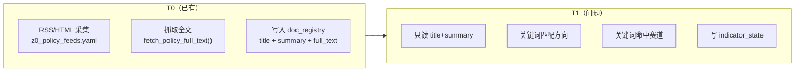
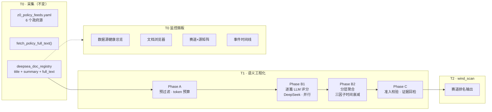
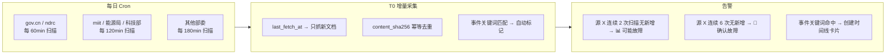

# 36 · Z0-M2 政策赛道 T1 语义工程化方案（L3 · 实施权威）

> **一句话**：将政策文档 T1 处理升级为 **Phase A 全文组装 → Phase B1 逐篇 LLM 评分 → Phase B2 分层聚合 → Phase C 准入校验** 四段流水线，用**逐篇独立推理 + 三因子时间衰减 + 成本预估前置**解决长上下文丢失、时效衰减和成本失控问题；T0 新增前端监控面板实现数据源可观测与文档审计。
>
> **本文档对应**：[34_ §3.2](./34_五区指标矩阵与T0-T2集成规约.md) `M.policy.sector_direction` 表中「LLM 抽取 enum（工程化见 36_…）」的工程化落地。

> [!NOTE] **[TRACEBACK] 战略追溯锚点**
> - **L1 哲学**：[06_投资哲学体系总纲](../../01_顶层概念/06_投资哲学体系总纲.md)（②多源验证 / ③认知深度 / ⑧归因闭环）
> - **L2 实践规划**：[06_标的深度分析与阶段判定实践规划](../../02_战略维度/06_跨维度协作/06_标的深度分析与阶段判定实践规划.md)
> - **五区总纲**：[32_ §2.4A/§3.2](../../03_原子目标与规约/_共享规约/32_五区漏斗工作流与数据工程标准化规约.md)（Z0 段 A 政策风向标）
> - **五区矩阵**：[34_ §3.2](./34_五区指标矩阵与T0-T2集成规约.md)（`M.policy.sector_direction` 指标定义）
> - **三底座架构**：[29_ §1.3/§5.1](./29_三大数据底座与任务调度架构契约.md)（DeepSea doc_registry + indicator_state）
> - **事实门控**：[22_ 事实交叉验证与防幻觉规约](./22_事实交叉验证与防幻觉规约.md)（evidence 回检强制）
> - **AI 调度**：[19_ 异构AI调度栈规约](./19_异构AI调度栈规约.md)（模型档位路由）
> - **前端区际联动**：[33_ §4/§5](./33_五区工作台_前端区际联动与数据携带契约.md)（HTMX 组件约定）
> - **DNA**：[`dna_stage_1_启动期.yaml`](../_System_DNA/00_co_pilot/dna_stage_1_启动期.yaml) · `shared/dna_fact_gate.yaml`
> - **L5 锚点**：`l5-z0-m2-policy-t1-llm-v1`
> - **代码落点**：`diting-src/apps/copilot/services/deepsea/policy_t1_dispatcher.py` · `policy_t1_llm_scorer.py` · `policy_t1_evidence_checker.py`
> - **配置落点**：`diting-src/data/config/metrics/z0_policy_keywords.yaml` · `z0_policy_t1_llm.yaml`

---

## 目录

- [§0 本文档管什么 / 不管什么](#design-36-scope)
- [§1 现状与问题](#design-36-as-is)
- [§2 四段流水线架构](#design-36-pipeline)
- [§3 Phase A - 预过滤与上下文组装](#design-36-phase-a)
- [§4 Phase B1 - 逐篇 LLM 语义评分](#design-36-phase-b1)
- [§5 Phase B2 - 分层聚合与时序衰减](#design-36-phase-b2)
  - [§5.0 三因子执行主体：谁来做这个判断](#design-36-factor-ownership)
- [§6 Phase C - 结果结构化与准入](#design-36-phase-c)
- [§7 成本预估算与处理模式](#design-36-cost)
- [§8 模型路由](#design-36-model-routing)
- [§9 T0 元数据采集监控面板设计](#design-36-dashboard)
- [§10 关键数据结构（Schema）](#design-36-schema)
- [§11 配置真相源](#design-36-config)
- [§12 与上下游的接口契约](#design-36-api)
- [§13 测试与验证](#design-36-testing)
- [§14 实施规划](#design-36-implementation)
- [§15 数据源全面梳理与增量监控](#design-36-all-sources)
- [一致性检查表](#design-36-consistency)

---

<a id="design-36-scope"></a>

## §0 本文档管什么 / 不管什么

| 管 | 不管 |
|---|------|
| Z0-M2 `M.policy.sector_direction` 的 T1 **语义工程化升级**（全文 → B1 逐篇 LLM → B2 聚合 → C 准入） | T0 政策采集的逻辑与 feed 配置（→ `policy_ingest.py` / `z0_policy_feeds.yaml`） |
| B1/B2 分层架构、三因子时间衰减、成本预估算 | T2 跨区聚合与 `wind_scan` 合成（→ [34_ §3.0a](./34_五区指标矩阵与T0-T2集成规约.md)） |
| LLM Prompt 设计、模型路由、处理模式（即时/增量/批量） | 底层 DeepSea 对象湖与 Dispatcher 架构（→ [29_](./29_三大数据底座与任务调度架构契约.md)） |
| 证据回检（防幻觉）、Schema 校验 | 其他 Z0 矩阵（M1/M5/M8 等）的实现 |
| **T0 监控面板前后端设计**（新增） | 前端整体 IA / Tab 布局（→ [33_](./33_五区工作台_前端区际联动与数据携带契约.md)） |

**永久红线**：
- **no-mock**：禁止使用模拟 LLM 输出代替真实推理
- **evidence 强制**：LLM 输出必须含原文引用，无引用视为无效
- **无降级策略**：LLM 不可用直接报 error，不得用关键词规则冒充语义结果
- **成本可审计**：每次处理前预估算成本，处理中记录实际消耗

<a id="design-36-as-is"></a>

## §1 现状与问题

### §1.1 当前 T1 处理流程（As-Is）



### §1.2 三个核心问题

| # | 问题 | 表现 | 影响 |
|---|------|------|------|
| **P1** | **全文未使用** | `_fetch_pending_docs` 只读 `title` + `summary`，`full_text` 在 DB 但从不读 | 丢失 95%+ 政策正文信息量 |
| **P2** | **关键词匹配非语义** | 数正/负关键词出现次数判断利好利空 | 标题中性但内容实质利好/利空时完全误判；无法区分力度差异 |
| **P3** | **信号粒度粗** | 只有 4 档 direction，无强度评分，无原文证据引用 | 下游只能做简单计数，无法加权排名 |

### §1.3 数据基础（已有，不需额外采集）

T0 阶段已经：
- 从 6 个政府源采集政策列表
- 对每条链接抓取 HTML 正文存入 `lineage_tags.full_text`（最多 48000 字符）

**T1 升级不需要改任何 T0 代码**，只需读取已存在的 `full_text` 字段。

<a id="design-36-pipeline"></a>

## §2 四段流水线架构（To-Be）



| 阶段 | 职责 | 输入 | 输出 | AI 参与 |
|------|------|------|------|---------|
| **Phase A** | 数据准备 + 成本预估算 | `deepsea_doc_registry` | 组装文本 + `CostEstimate` | 否 |
| **Phase B1** | 逐篇语义理解 | 单篇政策全文 | `PolicyLLMResponse`（结构化 JSON） | **是（DeepSeek-V3，可并行）** |
| **Phase B2** | 打分聚合 + 时序衰减 | 全部 B1 输出 | `AggregatedSector[]` | 否（纯计算） |
| **Phase C** | 准入 + 证据回检 | B2 聚合结果 | 校验后的 `PolicySignal` | 否 |

<a id="design-36-phase-a"></a>

## §3 Phase A - 预过滤与上下文组装

### §3.1 数据读取增强

```python
# 改造前：只读 title + summary
doc = {
    "title": str(tags.get("title") or ""),
    "summary": str(tags.get("summary") or ""),
}

# 改造后：新增 full_text 读取
doc = {
    "title": str(tags.get("title") or ""),
    "summary": str(tags.get("summary") or ""),
    "full_text": str(tags.get("full_text") or ""),  # 新增
    "feed_tier": str(tags.get("tier") or ""),        # 新增，影响衰减因子
}
```

### §3.2 单篇上下文组装

每篇政策**独立调用一次 LLM**（不在一次 Prompt 里塞多篇），所以上下文只包含本篇内容：

```
输入 = 系统Prompt(1500 token) + 赛道列表(500 token) + 标题(100) + 摘要(400) + 正文(6000)
总预算 ≈ 8500 token（DeepSeek-V3 64K context，绰绰有余）
```

**正文截断策略**（正文超 6000 token 时）：

| 段落位置 | 保留比例 | 理由 |
|---------|---------|------|
| 前 4000 token | 全文保留 | 包含政策背景、总体要求、主要目标——最重要的信号段 |
| 后 1500 token | 全文保留 | 组织实施、保障措施——判断"怎么落地" |
| 中间 500 token | 保留含赛道关键词的段落 | 通过关键词扫描定位 |
| 超出部分 | 截断 | 总输入不超过 8500 token |

<a id="design-36-phase-b1"></a>

## §4 Phase B1 - 逐篇 LLM 语义评分（核心改造）

### §4.1 设计原则：B1 + B2 分层

```
┌──────────────────────────────────────────────────────────┐
│ Phase B1 · 逐篇评分（可完全并行）                         │
│                                                          │
│  文档1 → [LLM] → {sectors[], direction, score, evidence}  │
│  文档2 → [LLM] → {sectors[], direction, score, evidence}  │
│  文档3 → [LLM] → {sectors[], direction, score, evidence}  │
│  ...                                                      │
│                                                          │
│  每篇独立调用，互不干扰                                    │
│  每篇输入 ~8500 token（≤ DeepSeek 64K 窗口，不存在丢失）   │
├──────────────────────────────────────────────────────────┤
│ Phase B2 · 分层聚合（纯计算，不需要 LLM）                  │
│                                                          │
│  输入：所有 B1 的结构化输出 JSON  +  三因子衰减权重        │
│  输出：按赛道的加权排名                                    │
│                                                          │
│  输入极小（~200 token/篇），不存在"丢失中间"问题            │
└──────────────────────────────────────────────────────────┘
```

**为什么不用一次召 20 篇的批量推理？**
- 如果一次塞 20 篇 × 8500 token = 170K token，中间 10 篇会被 LLM 严重忽略（"Lost in the Middle"）
- 每篇独立评分：上下文可控（~8500 token/篇），模型充分理解
- 可以完全并行（asyncio.gather），不互相等待
- B1 全部输出结构化 JSON，B2 聚合时读这些 JSON（~200 token/篇），不需要再读全文

### §4.2 Prompt 设计

#### 系统 Prompt

```
你是一位专业的投研政策分析助手。你的任务是阅读**单篇**政策全文，判断其对各个产业赛道的影响。

## 输出格式（严格 JSON）
{
  "sectors": [
    {
      "sector_name": "赛道名",
      "direction": "strong_tailwind|weak_tailwind|neutral|weak_headwind|strong_headwind",
      "impact_score": 0-100,
      "evidence_quotes": ["原文引用的句子"],
      "reasoning": "判断依据"
    }
  ],
  "overall_assessment": "一句话总体判断",
  "doc_metadata": {
    "impl_status": "已发布_待执行|已执行_进行中|已执行_完成|征求意见稿|废止_替代|状态未知",
    "impl_status_reasoning": "推断依据"
  }
}

## 文档实施状态定义
状态             | 含义
已发布_待执行     | 政策已正式发布，但尚未到执行起始日期或刚发布
已执行_进行中     | 政策正在执行中，可看到进度汇报
已执行_完成       | 政策目标已完成、总结、收官
征求意见稿       | 尚未正式实施，仍在公开征求意见阶段
废止_替代         | 已被新政策废止或替代，不再生效
状态未知         | 无法判断

## 影响方向定义
方向          | 含义
-------------|------
strong_tailwind | 强利好：明确扶持、补贴、财政支持、立法保障、国家规划
weak_tailwind   | 弱利好：提及鼓励发展、方向性认可、研究探索
neutral         | 中性：无直接关联或平衡表述
weak_headwind   | 弱利空：规范管理、提高准入门槛、窗口指导
strong_headwind | 强利空：限制、禁止、淘汰、惩罚性措施、征收

## 影响强度评分（0-100）
范围       | 含义
----------|------
81-100    | 重大影响：政策直接针对该赛道，有实质性措施
61-80     | 显著影响：政策明确涉及该赛道，有具体条款
41-60     | 中等影响：政策部分涉及
21-40     | 轻度影响：间接涉及或顺带提及
0-20      | 可忽略：几乎无关联

## 重要规则
1. 只从下方 allowed_sectors 列表中选择赛道名
2. 每条 evidence_quotes 必须是原文中完整的一句话（至少 1 条）
3. 如果没有赛道受影响，sectors 数组为空
4. 如果对同一赛道既有利好又有利空，方向选择影响更大的那个，在 reasoning 中说明
```

#### 赛道列表（动态注入，z0_policy_keywords.yaml 驱动）

```
allowed_sectors: AI算力, 低空经济, 半导体, 新能源, ...
```

#### LLM 调用流程

```python
async def score_policy_document(
    doc: PolicyDoc,
    *,
    model: str = "deepseek-chat",
    temperature: float = 0.1,
) -> PolicyLLMResponse | None:
    """单篇政策文档 LLM 语义评分。失败时抛出异常（无 fallback）。"""
    context = _assemble_context(doc.title, doc.summary, doc.full_text)
    prompt = _build_prompt(context)
    raw = await call_llm(
        messages=[{"role": "system", "content": SYSTEM_PROMPT},
                  {"role": "user", "content": prompt}],
        model=model,
        temperature=temperature,
        response_format={"type": "json_object"},
    )
    parsed = parse_llm_json(raw)
    return parsed  # 失败时抛出异常，不给 fallback
```

#### LLM 返回的 JSON 格式

```json
{
  "sectors": [
    {
      "sector_name": "环保节能",
      "direction": "strong_tailwind",
      "impact_score": 85,
      "evidence_quotes": [
        "以节能降碳为关键方向",
        "到2028年重点行业能效标杆水平以上产能占比提升至30%",
        "安排中央预算内投资支持节能降碳改造"
      ],
      "reasoning": "政策明确以节能降碳为目标，有具体数字目标和财政支持"
    },
    {
      "sector_name": "新能源",
      "direction": "weak_tailwind",
      "impact_score": 52,
      "evidence_quotes": [
        "鼓励新能源与传统能源优化组合"
      ],
      "reasoning": "仅顺带提及，非政策核心"
    }
  ],
  "overall_assessment": "政策重点利好节能降碳赛道，对新能源有间接利好",
  "doc_metadata": {
    "impl_status": "已发布_待执行",
    "impl_status_reasoning": "政策标题含'印发'，正文含具体时间表和执行分工，尚未进入执行阶段"
  }
}
```

### §4.3 B1 并行执行

```python
async def dispatch_b1(docs: list[PolicyDoc]) -> list[PolicyLLMResponse]:
    """所有待处理文档并行调用 LLM。"""
    tasks = [score_policy_document(doc) for doc in docs]
    results = await asyncio.gather(*tasks, return_exceptions=True)
    
    successes = []
    errors = []
    for doc, result in zip(docs, results):
        if isinstance(result, Exception):
            errors.append({"doc_id": doc.doc_id, "error": str(result)})
        else:
            successes.append(result)
    
    return successes, errors  # errors 中任意一个存在即标记 T1 部分失败
```

<a id="design-36-phase-b2"></a>

## §5 Phase B2 - 分层聚合与时序衰减

<a id="design-36-factor-ownership"></a>

### §5.0 三因子执行主体：谁来做这个判断

三个因子不应都用规则硬编码。**LLM 已经读了全文，让它顺便推断实施状态是零边际成本的最优方案。**

| 因子 | 执行主体 | 判断方式 | 说明 |
|------|---------|---------|------|
| **W_doc_type**（L0/L1/L2/L3） | **人类配置** | `z0_policy_feeds.yaml` 中的 `tier` 字段 | 静态，每个源定义一次就不再变 |
| **M_impl_status**（实施状态） | **B1 LLM 推理** | Prompt 要求输出 `doc_metadata.impl_status` | 模型读了全文，知道这是"印发通知"还是"征求意见"还是"废止旧政" |
| **D_time(t)**（时间衰减） | **代码计算** | `published_at` → `days_since_published` 代入衰减公式 | 纯数学，不需要推理 |

**为什么 impl_status 不用关键词规则？**

原来的设计是用关键词匹配（含"征求意见"→征求意见稿），但这和原始 T1 一样掉回了关键词误判的坑：
- "根据前期征求意见反馈，现正式印发..." → 关键词规则误判为征求意见稿，实际是已发布
- "在实施过程中要广泛征求社会意见" → 同样被误判
- 而 LLM 读完全文能准确区分这两种情况

**为什么 doc_type 不让 LLM 判断？**

因为 doc_type 的本质是数据源权威性，不是文档内容。同一份政策，刊登在 gov.cn 上就是 L0，刊登在地方网站上就是 L3。这不是 LLM 能判断的——它只能配置。

### §5.1 三因子影响力衰减模型

```
有效影响力(EffectiveScore) = impact_score × W_doc_type × M_impl_status × D_time
```

#### 因子 1：文档类型权重 `W_doc_type`

| 类型 | 权重 | 说明 | 举例 |
|------|------|------|------|
| **L0 国家级规划/立法** | 1.0 | 国务院、国发文件、五年规划 | 十五五规划、国发〔2026〕X号 |
| **L1 部委专项政策** | 0.7 | 部委专项通知、管理办法 | 工信部产业政策、发改委通知 |
| **L2 会议精神/讲话** | 0.4 | 领导人讲话、重要会议 | 陆家嘴论坛、中央经济工作会议 |
| **L3 地方/行业动态** | 0.2 | 地方补贴、行业公约、征求意见稿 | 地方版实施细则 |

#### 因子 2：实施状态乘数 `M_impl_status`

| 状态 | 乘数 | 说明 |
|------|------|------|
| `已发布_待执行` | 1.0 | 刚发布，市场预期最强 |
| `已执行_进行中` | 0.8 | 正在执行，影响力稳定 |
| `已执行_完成` | 0.3 | 已完成，影响力大幅萎缩 |
| `征求意见稿` | 0.5 | 还未正式实施，有变数 |
| `废止/替代` | 0.0 | 完全失效 |
| `状态未知` | 0.6 | 默认保守值 |

**状态推断规则**（从文档标题和正文内容自动判断）：

```
含"实施方案""通知""印发" → 已发布_待执行 或 已执行_进行中
含"意见征集""征求意见" → 征求意见稿
含"废止""同时废止""替代" → 废止/替代
含"工作总结""回顾" → 已执行_完成
其他 → 状态未知
```

#### 因子 3：时间衰减曲线 `D_time(t)`（按类型不同）

```
L0 国家级:
  D(t) = 1.0                  当 t ≤ 180 天
  D(t) = 1.0 - (t-180)/1645  当 180 < t ≤ 1825 天 (5年线性到0.0)
  D(t) = 0.0                  当 t > 1825 天

L1 部委:
  D(t) = 1.0                  当 t ≤ 90 天
  D(t) = 1.0 - (t-90)/1005   当 90 < t ≤ 1095 天 (3年)
  D(t) = 0.0                  当 t > 1095 天

L2 会议精神:
  D(t) = 1.0 - t/180          当 t ≤ 180 天 (线性到0)
  D(t) = 0.0                  当 t > 180 天

L3 地方动态:
  D(t) = 1.0 - t/90           当 t ≤ 90 天
  D(t) = 0.0                  当 t > 90 天
```

#### 聚合公式

```
Sector_Composite_Score = Σ (impact_score_i × W_type_i × M_status_i × D_time_i)
                          ──────────────────────────────────────────────
                          Σ (W_type_i × M_status_i × D_time_i)

（加权平均，权重越高代表该政策对最终分数的影响力越大）
```

### §5.2 计算示例

假设 AI 算力赛道有 3 篇匹配政策：

| 政策 | impact_score | W_type | M_status | 距今天数 | D_time | 分子贡献 | 分母贡献 |
|------|-------------|--------|----------|---------|--------|---------|---------|
| 国务院"促进 AI 产业发展" | 92 | 1.0 | 1.0 | 10 | 1.0 | 92.0 | 1.0 |
| 工信部"算力基础设施通知" | 78 | 0.7 | 1.0 | 60 | 1.0 | 54.6 | 0.7 |
| 发改委"数据中心节能要求" | 45 | 0.7 | 0.8 | 200 | 1.0 | 25.2 | 0.56 |

**Composite_Score = (92 + 54.6 + 25.2) / (1.0 + 0.7 + 0.56) = 171.8 / 2.26 = 76.0**

（相比简单平均 (92+78+45)/3=71.7，加权后更准确反映国家级重磅政策的主导作用）

### §5.3 方向共识融合

```
各文档方向投票 → 加权投票（投票权重 = W_type × M_status × D_time）
  strong_tailwind 总权重 > 50%      → consensus = "strong_tailwind"
  tailwind + strong_tailwind > 60%  → consensus = "tailwind"
  strong_headwind 总权重 > 50%     → consensus = "strong_headwind"
  headwind + strong_headwind > 60%  → consensus = "headwind"
  其他情况                          → consensus = "mixed"
```

### §5.4 趋势判定

| 指标 | 方法 |
|------|------|
| 政策密度趋势 | 近 30 天命中文档数 vs 前 30 天 → accelerating/stable/decelerating |
| 方向变化 | 近 30 天 tailwind 占比 vs 前 90 天 → 转暖/转冷/不变 |
| 新赛道出现 | 从未出现在此赛道上的来源首次发布政策 → new_entrant |

<a id="design-36-phase-c"></a>

## §6 Phase C - 结果结构化与准入

### §6.1 Schema 校验

LLM 原始输出 JSON 必须通过以下全部校验：

| 校验项 | 规则 | 失败处理 |
|--------|------|---------|
| `sectors` 存在且为数组 | 必须 | **整条丢弃，标记 error** |
| `sector_name` 在 `allowed_sectors` 中 | 每个元素 | 不在列表中的赛道丢弃 |
| `direction` 为 5 档枚举值 | 每个元素 | 非法值设为 neutral |
| `impact_score` 在 0-100 范围 | 每个元素 | 超出截断到边界 |
| `evidence_quotes` 非空列表 | 至少 1 条 | 标记 `missing_evidence` |
| `reasoning` 不为空 | 每个元素 | 补默认说明 |

### §6.2 证据回检（防幻觉）

遵循 [22_ 事实交叉验证与防幻觉规约](./22_事实交叉验证与防幻觉规约.md)：

```python
def check_evidence(quote: str, full_text: str) -> bool:
    """归一化子串匹配。"""
    norm_quote = normalize(quote)      # 全角→半角、去除多余空格
    norm_text = normalize(full_text)
    return norm_quote in norm_text
```

| 回检结果 | 处理 |
|---------|------|
| 通过（引用在原文中出现） | 正常写入 `evidence_quotes` |
| 不通过（引用在原文中未找到） | 丢弃该条，标记 `evidence_checked=false` |

### §6.3 数据落库结构

写入 `deepsea_indicator_state` 的 `snapshot`：

```json
{
  "doc_id": "550e8400-e29b-41d4-a716-446655440000",
  "title": "关于开展重点行业节能降碳改造的通知",
  "published_at": "2026-06-20",
  "doc_type": "L0",
  "impl_status": "已发布_待执行",
  "policy_sectors": [
    {
      "sector_name": "环保节能",
      "direction": "strong_tailwind",
      "impact_score": 85,
      "evidence_quotes": ["以节能降碳为关键方向", "到2028年..."],
      "evidence_checked": true,
      "reasoning": "政策明确..."
    }
  ],
  "overall_assessment": "政策利好环保节能",
  "t1_source": "llm:deepseek-chat",
  "llm_confidence": 0.92,
  "token_used": 7842,
  "evidence_check_passed": true
}
```

<a id="design-36-three-layer-naming"></a>

## §5.5 三层命名体系与文档多标签工程化设计（v4.0）

> **一句话**：政策文档经过「LLM 原文术语(L1) → 规范赛道名(L2) → A股概念板(L3)」三层映射，每份文档可同时标记多个赛道和概念标签。前端展示 L2 规范赛道名，详情展开 L3 概念板。

### §5.5.1 三层命名体系定义

| 层级 | 名称 | 来源 | 示例 | 用途 |
|------|------|------|------|------|
| **L1** | 政策官方术语 | 📄 LLM 从文档原文提取 | "算力基础设施"、"人工智能基础底座领域" | 不可直接用于排名（术语不统一） |
| **L2** | 规范赛道名 | 📋 `z0_policy_keywords.yaml` canonical_sectors keys | "AI算力"、"新能源" | **前端排名显示**：唯一稳定标识 |
| **L3** | A股概念板 | 📋 `child_concepts` + 同花顺同步 | "人工智能"、"东数西算(算力)" | 可投资边界映射，二次排名 |

### §5.5.2 文档多标签原则

**一条政策文档可同时归属多个赛道、多个概念板（重叠合法）**：

```
示例文档：《"十四五"数字经济发展规划》
  canonical_sectors: [AI算力, 数字经济, 新能源]
  concept_boards:    [东数西算(算力), 5G, 充电桩, 人工智能]
  policy_terms:      [算力基础设施, 5G网络, 新能源汽车充电桩]
```

**处理方式**：B2 聚合阶段对文档内每个 sector 独立处理，逐条匹配 canonical 和 concept，分桶累积分数。

### §5.5.3 映射收敛规则（防误归集）

三层映射须遵守三条收敛规则：

| 规则 | 说明 | 检查点 |
|------|------|--------|
| **L1→L2 反查** | `_reverse_lookup_canonical()` 用 llm_aliases 反查 | llm_aliases 必须是该赛道的**专属术语**，禁止包含泛化短语（如 "制造、教育…旅游等垂直应用领域"） |
| **L2→L3 精确匹配** | `_match_child_concepts()` 仅用精确匹配+同义词白名单 | 禁止子串匹配（杜绝 "区块链" ⊆ "AI算力" 类误判） |
| **L3 相关性校验闸** | `_verify_concept_relevance()` LLM 校验 | 对每个匹配到的 (canonical_sector, child_concept, policy_term) 三要素，LLM 判断 YES/NO |

### §5.5.4 child_concepts 收敛标准

每个规范赛道下 child_concepts 须满足：
1. 概念与赛道语义直接相关（非泛化、非边缘）
2. 每个赛道 ≤ 10 个核心概念
3. 与同花顺概念列表严格对齐（定期审计）
4. 概念名精确到可投资的 A股板块，不含「XX领域」「XX方向」等泛化词

<a id="design-36-z0-plus"></a>

### §5.5.5 修订记录（三层命名体系）

| 日期 | 版本 | 说明 |
|------|------|------|
| 2026-06-22 | v4.0 | 三层命名体系初版：L1(LLM术语)→L2(规范赛道)→L3(A股概念)；L2→L3 精确匹配+同义词白名单；禁止子串匹配 |
| 2026-06-22 | v5.0 | **LLM直出概念分类**：取消白名单手动维护，T1 Prompt 注入 child_concepts 为合法选项，LLM 直接从选项中多选出概念名；`_match_child_concepts` 降级为合法性验证闸；新增语义映射兜底用于历史数据对齐（见 §5.6） |

## §5.6 v5.0 LLM直出概念分类 · 零手动维护（v5.0 新增）

> **一句话**：把「映射」从硬编码白名单还给 LLM。`child_concepts` 是唯一标准参照物，LLM 在分析文档时直接从给定选项中选择相关概念名，无需白名单维护。

### §5.6.1 现状问题（v4.0）

```
v4.0 链路：
  10 child_concepts → 硬编码白名单(~40条) → 匹配
  LLM 自由输出 sector_name(22种) → 精确/白名单 → 3/22 命中(14%)

问题：
  ⚠️ 白名单需手动维护（每次 LLM 输出新术语都要手动加）
  ⚠️ 召回率极低（22 种有效术语只命中 3 种）
  ⚠️ 10 个概念中 7 个空置无文档
  ⚠️ 概念与文档关联被白名单阻断
```

### §5.6.2 v5.0 链路

```
v5.0 链路：
  10 child_concepts → 注入 T1 Prompt 作为合法选项
  LLM 读文档 → 从10个选项中多选 → 直接输出 child_concept name
  _match_child_concepts() → 合法性验证闸（非匹配器）

  优势：
  ✅ 零手动维护（YAML child_concepts 是唯一源）
  ✅ LLM 做语义判断（理解文档→选概念）
  ✅ 既要多也要不乱：LLM 语义判断 + 合法性验证闸双重保障
  ✅ 10 个概念全覆盖
```

### §5.6.3 T1 Prompt 改造

在 `policy_t1_llm_scorer.py` 的 T1 文档评分 Prompt 末尾注入概念选择任务：

```python
# 从 YAML 动态生成选项列表（零手动维护）
CONCEPT_OPTIONS = _build_concept_options(canonical_sector)
# "人工智能(302035), 东数西算·算力(308828), 数据中心AIDC(308642), ..."

T1_PROMPT_CONCEPT_SELECTION = f"""
## A股概念板选择（必答）

这份文档讨论的内容在A股层面与以下哪些概念板直接相关？从列表中选出所有相关的（0~N个），仅输出选中项的 name（在 YAML 中的原始写法），逗号分隔。如果都不相关，输出 NONE。

可选概念：[{CONCEPT_OPTIONS}]

选择（仅name,逗号分隔）：
"""
```

**要求**：
- 选项从 YAML `child_concepts` 动态生成
- LLM 输出的 `selected_concepts` 字段格式：`"人工智能,芯片概念,AI智能体"` 或 `"NONE"`
- 与 doc_metadata 同时输出，不增加调用次数

### §5.6.4 映射层改造

`_match_child_concepts()` 从匹配器降级为**验证闸**：

| 步骤 | v4.0 | v5.0 |
|------|------|------|
| **输入** | LLM 自由术语 | LLM 选中的概念名列表 |
| **主要逻辑** | 精确+白名单匹配 | 合法性验证（是否在 child_concepts 中） |
| **白名单** | **主导**逻辑（手动维护） | **废弃**（仅保留为缓存） |
| **兜底** | 无 | `_llm_semantic_map_to_concept()` 语义映射 |

**语义映射兜底**：对历史数据或未对齐术语，调用一次轻量 LLM（DeepSeek-chat）做语义映射：

```python
async def _llm_semantic_map_to_concept(
    term: str,
    concept_list: list[dict],
    canonical_sector: str,
) -> str | None:
    """v5.0 语义映射：将 LLM 自由术语映射到最近的 child_concept。
    仅作兜底用；新文档通过 T1 prompt 改造应不触发此路径。"""
    options = ", ".join(c["concept_name"] for c in concept_list)
    prompt = f"""赛道「{canonical_sector}」下有这些A股概念板：[{options}]。
政策原文术语「{term}」最贴近其中哪个概念板？仅输出一个名字。如果都不贴近，输出 NONE。"""
    # 使用 cheap model (deepseek-chat)
    ...
```

### §5.6.5 预期效果

| 指标 | v4.0（现状） | v5.0（方案） |
|------|-------------|-------------|
| **召回率** | 3/22 = 14% | LLM 语义判断，预期 >80% |
| **精确度** | 仅精确/白名单 | LLM 理解文档语义 + 合法性验证闸 |
| **维护成本** | 手动维护白名单 | **零** — YAML child_concepts 唯一源 |
| **概念覆盖率** | 3/10 有文档 | 预期全部 10 个都有覆盖 |
| **额外 LLM 调用** | 0 | 与 T1 同一调用（仅改输出格式） |
| **适配新赛道** | 需手动配白名单 | 只需在 YAML 加 child_concepts，Prompt 自动同步 |
| **多+不乱** | 不可兼得 | ✅ 语义理解保证多，验证闸保证不乱 |

### §5.6.6 B2 聚合适配

B2 聚合（`policy_t1_dispatcher.py`）适配：
- 从 B1 输出中读取 `selected_concepts` 字段（逗号分隔的概念名列表）
- 逐概念名做合法性验证
- 验证通过的概念归入对应 bucket["sub_concepts"]
- 验证失败的概念调用语义映射兜底

### §5.6.7 风险与应对

| 风险 | 应对 |
|------|------|
| LLM 输出的概念名格式不一致（如 `东数西算` vs `东数西算(算力)`） | Prompt 中给出带格式的完整名称并要求精确复制 |
| LLM 可能输出不在列表中的名字 | 验证闸过滤非法输出 → 触发语义映射兜底 |
| 一个文档同时匹配多个概念时难以区分程度 | 可选扩展：输出 `name:primary/secondary` 标记主次 |
| T1 文档评分与概念选择解耦 | 同一 LLM 调用完成，不增加次数

## §6.5 Z0+ 投资级评分（v3.0 新增）

> **一句话**：在 B2 聚合输出的纯政策信号基础上，叠加「商业轨迹」和「资本引力」两个投资维度，形成四轴投资级综合评分 Z0+。排名从「政府最操心」校正为「市场最可能给溢价」。

### §6.5.1 四轴框架

| 轴 | 权重 | 名称 | 数据源 | 回答的问题 |
|----|------|------|--------|-----------|
| 一 | 30% | 政策动量 | 📄 B2 聚合（composite_score × 加速度 × 拐点） | 政策信号本身有多强？ |
| 二 | 30% | 商业轨迹 | 📄 LLM提取(收入传导) + 📋 YAML(成长阶段/利润池) | 政策能否转化为公司真实收入？ |
| 三 | 25% | 资本引力 | 📄 LLM提取(叙事催化) + 📋 YAML(估值弹性/机构覆盖) | 市场资金会不会真的去买？ |
| 四 | 15% | 落地质量 | 📄 LLM提取(implementation_strength + toolkit) | 政策执行力度如何？ |

### §6.5.2 数据来源

- **📄 LLM 从文档提取**（B1 新增 4 个字段）：`revenue_transmission_type`、`narrative_catalyst_type`、`policy_phase`、`policy_regime_change_flag`
- **📋 YAML 预配置**（`z0_investment_profile.yaml`，人工研究+每月更新）：各赛道的成长阶段、利润池结构、估值弹性层级、机构覆盖情况

### §6.5.3 分数合成

```
Z0+ = policy_momentum × 0.30 + commercial_trajectory × 0.30
    + capital_gravity × 0.25 + implementation_quality × 0.15
```

完整映射表见 `diting-src/data/config/metrics/z0_investment_profile.yaml`。
前端支持「政策视角」与「投资视角」双视图切换。

<a id="design-36-cost"></a>

## §7 成本预估算与处理模式

### §7.1 每次处理前执行成本预估算

```python
class CostEstimate(TypedDict):
    total_docs: int
    est_input_tokens: int
    est_output_tokens: int
    est_cost_yuan: float
    est_cost_usd: float
    model: str
    within_daily_budget: bool

def estimate_cost(pending_docs: list, model: str) -> CostEstimate:
    """处理前预估成本。"""
    total_input = 0
    for doc in pending_docs:
        text_len = len(doc.title) + len(doc.summary) + len(doc.full_text or "")
        est_tokens = int(text_len * 0.28)  # 中文约 0.28 token/字符
        total_input += min(est_tokens, 8500)  # 按截断后
    
    est_output = len(pending_docs) * 400  # 每篇输出约 400 token
    
    pricing = {
        "deepseek-chat":    {"input_per_1M": 1.0, "output_per_1M": 2.0},   # ¥/1M tokens
        "claude-opus-4":    {"input_per_1M": 15.0, "output_per_1M": 75.0},
    }
    p = pricing.get(model, pricing["deepseek-chat"])
    cost = (total_input / 1_000_000 * p["input_per_1M"]
            + est_output / 1_000_000 * p["output_per_1M"])
    
    return {
        "total_docs": len(pending_docs),
        "est_input_tokens": total_input,
        "est_output_tokens": est_output,
        "est_cost_yuan": round(cost, 4),
        "est_cost_usd": round(cost * 0.14, 4),  # ¥→$ 近似
        "model": model,
        "within_daily_budget": cost <= daily_budget,
    }
```

### §7.2 三种处理模式

| 模式 | 触发条件 | 价格 | 行为 |
|------|---------|------|------|
| **即时模式** | 用户手动触发，或 API 调用 | 标准价 | 立即处理所有待处理文档，不等待 |
| **增量模式** | 每日 cron（默认 08:00） | 标准价 | 只处理上次处理后新增的文档（~20 篇/日） |
| **批量回填模式** | 用户手动开启 batch 开关 | **标准价 50%** | 使用 DeepSeek batch API，处理全部历史未处理文档 |

### §7.3 每日成本估算

| 模式 | 待处理 | 预估输入 token | 预估成本 |
|------|--------|---------------|---------|
| 增量（每天） | ~20 篇 | ~170K | **~¥0.34/日**（约 ¥10/月）|
| 首次回填（一次） | ~2000 篇 | ~17M | **~¥34**（一次性）|
| 批量回填 | ~2000 篇 | ~17M | **~¥17**（batch 价 50% off）|

**结论**：使用 DeepSeek-V3，月成本约 ¥10，即使加上每日 cron 也完全可以接受。

<a id="design-36-model-routing"></a>

## §8 模型路由

### §8.1 模型档位

| 档位 | 模型 | 适用 | 单篇成本 |
|------|------|------|---------|
| **日常** | DeepSeek-V3（`deepseek-chat`） | 日常增量 + 批量回填 | ~¥0.017/篇 |
| **升格** | Claude Opus 4 | L0 政策、低置信度复核 | ~¥0.70/篇 |

### §8.2 升格触发条件

```
L0 源（国务院/国发文件）→ 始终升格到 Opus
日常模型置信度 < 0.6 → 该篇用 Opus 重评分
```

### §8.3 成本控制

| 措施 | 实现 |
|------|------|
| 成本预估算 | 每次处理前输出 `CostEstimate`，用户确认或自动按预算执行 |
| 每日 token 上限 | `daily_token_budget: 500000`，超额报 error |
| batch 模式 | 开关启用后自动走 DeepSeek batch API |
| 缓存 | 同一天相同 `content_sha256` 跳过重复处理 |

<a id="design-36-dashboard"></a>

## §9 T0 元数据采集监控面板设计

### §9.1 设计目标

| 目标 | 说明 |
|------|------|
| **数据源可观测** | 每个源的最后采集时间、文档总量、今日增量、健康状态一目了然 |
| **事件主动发现** | 重大事件（如陆家嘴论坛）被系统检测到后自动提醒 |
| **文档可审计** | 任何政策文档的全景可见：原始链接 → 全文内容 → T1 评分详情 → LLM 证据引用高亮 |
| **赛道×源矩阵** | 知道每个行业赛道的政策来源覆盖情况 |

### §9.2 页面 1：数据源健康总览（Data Source Dashboard）

```
┌────────────────────────────────────────────────────────────┐
│  Z0 政策数据源监控                        [🔄 刷新全部]     │
├────────────────────────────────────────────────────────────┤
│                                                            │
│  源                级别  上次采集      文档数  今日新增  状态 │
│  ───────────────────────────────────────────────────────    │
│  中国政府网-政策库   L0   08:00:32 ✅   847      3      🟢  │
│  发改委-通知公告     L1   08:00:15 ✅   423      1      🟢  │
│  发改委-政策发布     L0   08:00:22 ✅   312      0      🟢  │
│  工信部-新闻发布     L1   08:00:05 ✅   187      0      🟢  │
│  工信部-政策文件     L0   07:59:48 ✅   256      2      🟢  │
│  ...                                                        │
│                                                            │
│  📊 今日采集统计：6/6 源成功 · 6 篇新增 · 0 篇错误          │
│  ⏱ 总耗时：34.2s · 平均每源 5.7s                           │
│  💰 今日 T1 成本：¥0.34 / ¥5.00 预算                       │
│                                                            │
└────────────────────────────────────────────────────────────┘
```

**API 接口**：`GET /api/z0/policy/sources`

**自动检测事件**：系统扫描标题中含以下关键词的政策，自动创建事件卡片：
- "陆家嘴论坛"、"两会"、"中央经济工作会议"、"中央金融工作会议"
- "国务院常务会议"、"国常会"
- "十五五"、"十四五"

### §9.3 页面 2：政策文档浏览器（Document Explorer）

```
┌──────────────────────────────────────────────────────────────┐
│  [筛选] 数据源: [全部 ▼]  赛道: [全部 ▼]   L0/L1: [全部 ▼]  │
│  [日期] 从 [2026-01-01] 到 [2026-06-21]   [🔍 搜索]          │
├──────────────────────────────────────────────────────────────┤
│                                                              │
│  📄 关于开展重点行业节能降碳改造攻坚三年行动的通知            │
│     📅 2026-06-20  |  📂 L0 · ndrc.gov.cn                   │
│     🏷️ 赛道: 环保节能(st:85) · 新能源(st:52)                │
│     🧠 T1: deepseek-chat · 7842 token · ¥0.016              │
│     [📖 查看全文] [🔗 原始链接] [📊 T1 评分详情]             │
│  ────────────────────────────────────────────────────────    │
│                                                              │
│  📄 关于加快算力基础设施建设的通知                            │
│     📅 2026-06-19  |  📂 L0 · gov.cn                        │
│     🏷️ 赛道: AI算力(st:92)                                  │
│     🧠 T1: claude-opus-4(升格) · 8201 token · ¥0.68          │
│     [📖 查看全文] [🔗 原始链接] [📊 T1 评分详情]             │
│                                                              │
│  ... (分页，每页 20 条)                                       │
│                                                              │
└──────────────────────────────────────────────────────────────┘
```

**API 接口**：`GET /api/z0/policy/documents?source=&sector=&tier=&date_from=&date_to=&page=`

#### 展开 T1 评分详情（点击后 inline 展开）

```
┌─ 🧠 T1 语义评分详情 ───────────────────────────────────────┐
│                                                            │
│  模型: deepseek-chat · 耗时 2.3s · 输入 7842 token · ¥0.016 │
│  置信度: 0.92 ✅  evidence 回检: 3/3 通过 ✅                │
│                                                            │
│  ├─ 赛道: 环保节能                                          │
│  │  ├─ direction: strong_tailwind                          │
│  │  ├─ impact_score: 85/100                                │
│  │  ├─ evidence_quotes:                                    │
│  │  │  ① "以节能降碳为关键方向"                             │
│  │  │  ② "到2028年重点行业能效标杆水平以上产能占比提升至30%"│
│  │  │  ③ "安排中央预算内投资支持节能降碳改造"               │
│  │  └─ reasoning: 政策明确以节能降碳为目标，有具体数...     │
│  │                                                          │
│  └─ 赛道: 新能源                                            │
│     ├─ direction: weak_tailwind                            │
│     ├─ impact_score: 52/100                                │
│     ├─ evidence_quotes:                                    │
│     │  ① "鼓励新能源与传统能源优化组合"                     │
│     └─ reasoning: 仅顺带提及，非政策核心                    │
│                                                              │
│  ┌─ 衰减权重计算 ──────────────────────────────────────────┐ │
│  │  doc_type: L0 → 1.0                                     │ │
│  │  impl_status: 已发布_待执行 → 1.0                        │ │
│  │  距今: 1天 → D_time = 1.0                               │ │
│  │  有效权重: 1.0 × 1.0 × 1.0 = 1.0                      │ │
│  └──────────────────────────────────────────────────────────┘ │
└──────────────────────────────────────────────────────────────┘
```

### §9.4 页面 3：赛道 × 数据源矩阵（Sector × Source Matrix）

```
                  gov.cn  ndrc   miit   MEE   总文档  综合评分  方向共识    趋势
AI算力             12      8      15      0     35     78.5     📈 利好    accelerating
低空经济            3       2       1      0      6     42.3     📈 利好    stable
半导体              1       0       8      0      9     31.2     📊 中性    stable
新能源              8      12       3      5     28     65.8     📈 利好    accelerating
环保节能            5      18       2     10     35     71.4     📈 利好    stable
消费内需            7       3       0      0     10     45.2     📊 中性    decelerating
...（共 16 赛道）
```

- 每个格子数字可点击 → 跳转到该源×该赛道的文档列表
- 综合评分 = 三因子加权后的 composite_score

**API 接口**：`GET /api/z0/policy/matrix`

### §9.5 页面 4：事件时间线（Event Timeline）

```
2026-06-19  🏛️ 陆家嘴论坛开幕
  ├─ 主题演讲: "金融支持科技创新"
  ├─ 📄 全文实录 · 12,847 字
  ├─ 🧠 LLM 评分: AI算力(st:78) · 新质生产力(st:65)
  └─ [📖 看全文] [🔗 原始链接] [📊 T1]

2026-06-15  🏛️ 国务院常务会议
  ├─ 审议通过《促进人工智能产业发展条例（草案）》
  ├─ 📄 国发〔2026〕28号 · 8,421 字
  ├─ 🧠 LLM 评分: AI算力(st:92) · 数字经济(st:71)
  └─ [📖 看全文] [🔗 原始链接] [📊 T1]

2026-06-10  📋 发改委发布《2026年新型储能示范项目名单》
  ├─ 📄 通知全文 · 3,210 字
  ├─ 🧠 LLM 评分: 新能源(st:81)
  └─ [📖 看全文] [🔗 原始链接] [📊 T1]
```

**事件自动发现规则**：系统在 T0 采集阶段扫描文档标题，匹配预定义的事件关键词列表（`z0_policy_feeds.yaml` 中新增 `event_keywords` 节），自动创建时间线事件卡片。

**手动创建事件**：用户可以直接添加自定义事件（如"陆家嘴论坛 2026"），系统后续自动关联匹配的政策文档。

### §9.6 前端实现

| 面板 | 前端路径（HTMX） | 后端 API | 刷新策略 |
|------|-----------------|---------|---------|
| 数据源总览 | `/z0/admin/sources` | `GET /api/z0/policy/sources` | 自动 30s 轮询 |
| 文档浏览器 | `/z0/admin/documents` | `GET /api/z0/policy/documents?...` | 手动/分页 |
| 赛道矩阵 | `/z0/admin/matrix` | `GET /api/z0/policy/matrix` | 手动刷新 |
| 事件时间线 | `/z0/admin/timeline` | `GET /api/z0/policy/timeline` | 手动刷新 |
| 单篇详情 | `/z0/admin/document/{doc_id}` | `GET /api/z0/policy/document/{doc_id}` | — |

**HTMX 组件约定**（与 [33_ 前端区际联动](./33_五区工作台_前端区际联动与数据携带契约.md) 兼容）：
- 数据源卡片：`hx-get="/api/z0/policy/sources" hx-trigger="every 30s"`
- 文档列表：`hx-get="/api/z0/policy/documents?page=1" hx-trigger="load"`
- 详情展开：`hx-get="/api/z0/policy/document/{doc_id}/detail" hx-target="#detail-{doc_id}"`

<a id="design-36-schema"></a>

## §10 关键数据结构（Schema）

### §10.1 B1 输入 PolicyDoc

```python
class PolicyDoc(TypedDict):
    doc_id: str
    title: str                                       # max 500 chars
    summary: str                                     # max 2000 chars
    full_text: str                                   # max 48000 chars → truncated
    source: str                                      # e.g. "gov.cn"
    feed_id: str                                     # e.g. "gov_cn_zhengce_index"
    feed_tier: str                                   # "L0" | "L1" | "L2" | "L3"
    published_at: datetime | None
```

### §10.2 B1 输出 PolicyLLMResponse

```python
class PolicySectorScore(TypedDict):
    sector_name: str                                 # allowed_sectors 中的赛道名
    direction: Literal["strong_tailwind", "weak_tailwind", "neutral", 
                       "weak_headwind", "strong_headwind"]
    impact_score: float                              # 0-100
    evidence_quotes: list[str]                       # 原文引用（至少 1 条）
    reasoning: str                                   # 简短推理

class PolicyLLMResponse(TypedDict):
    sectors: list[PolicySectorScore]
    overall_assessment: str                          # 一句总体判断
```

### §10.3 B2 输入 B1Result（含衰减信息）

```python
class B1Result(TypedDict):
    doc_id: str
    title: str
    published_at: str
    doc_type: str                                    # L0/L1/L2/L3
    impl_status: str                                 # 实施状态
    sectors: list[PolicySectorScore]
    overall_assessment: str
    t1_source: str                                   # "llm:deepseek-chat"
    llm_confidence: float
    token_used: int
    evidence_check_passed: bool
```

### §10.4 B2 输出 AggregatedSector

```python
class AggregatedSector(TypedDict):
    sector: str                                      # 赛道名
    composite_score: float                           # 三因子加权平均
    consensus_direction: str                         # 方向共识
    doc_count: int                                   # 命中文档数
    policy_density_trend: str                        # accelerating | stable | decelerating
    direction_trend: str                             # 转暖 | 转冷 | 不变
    top_evidence: list[dict]                         # [ {doc_id, quote, date, direction} ]
```

### §10.5 CostEstimate

```python
class CostEstimate(TypedDict):
    total_docs: int
    est_input_tokens: int
    est_output_tokens: int
    est_cost_yuan: float
    model: str
    within_daily_budget: bool
```

<a id="design-36-config"></a>

## §11 配置真相源

### §11.1 `z0_policy_t1_llm.yaml`

```yaml
# Z0-M2 政策赛道 T1 LLM 语义工程化配置
schema_version: "1.1"
probe_key: M.policy.sector_direction

# 模型配置
llm_config:
  default_model: "deepseek-chat"
  escalate_model: "claude-opus-4"
  temperature: 0.1
  max_retries: 2
  context_window_tokens: 8500
  full_text_budget_tokens: 6000

# 成本控制
cost_control:
  daily_token_budget: 500000
  daily_yuan_budget: 5.0
  batch_mode: false
  pricing:
    deepseek-chat:
      input_per_1M_yuan: 1.0
      output_per_1M_yuan: 2.0
    claude-opus-4:
      input_per_1M_yuan: 15.0
      output_per_1M_yuan: 75.0

# 文档类型权重
doc_type_weights:
  L0: 1.0
  L1: 0.7
  L2: 0.4
  L3: 0.2

# 实施状态乘数
impl_status_multipliers:
  已发布_待执行: 1.0
  已执行_进行中: 0.8
  已执行_完成: 0.3
  征求意见稿: 0.5
  废止_替代: 0.0
  状态未知: 0.6

# 时间衰减配置（天）
time_decay:
  L0:
    full_weight_days: 180
    decay_to_days: 1825
    min_weight: 0.0
  L1:
    full_weight_days: 90
    decay_to_days: 1095
    min_weight: 0.0
  L2:
    full_weight_days: 0
    decay_to_days: 180
    min_weight: 0.0
  L3:
    full_weight_days: 0
    decay_to_days: 90
    min_weight: 0.0

# 升格触发
escalation_rules:
  min_llm_confidence: 0.6
  tier_l0_always_escalate: true

# 影响评分阈值
impact_thresholds:
  high: 61
  medium: 41
  low: 21

# 证据回检
evidence_check:
  enabled: true
  norm_chinese: true
  strict_mode: false
```

### §11.2 增强 `z0_policy_keywords.yaml`

```yaml
# 原有 sector_aliases 保持不变
sector_aliases:
  AI算力: ["算力", "人工智能", ...]
  ...

# 新增：供 LLM Prompt 使用的赛道语义描述
sector_prompt_descriptions:
  AI算力: "人工智能、大模型、算力基础设施、智算中心、数据中心"
  低空经济: "无人机、eVTOL、通用航空、低空空域管理"
  ...

# 新增：实施状态推断关键词
impl_status_keywords:
  已发布_待执行: ["实施方案", "通知", "印发", "发布"]
  征求意见稿: ["意见征集", "征求意见"]
  废止_替代: ["废止", "同时废止", "替代"]
  已执行_完成: ["工作总结", "回顾", "完成情况"]

# 新增：事件自动发现关键词
event_keywords:
  陆家嘴论坛: "陆家嘴论坛"
  两会: ["两会", "全国人民代表大会", "政协"]
  国常会: ["国务院常务会议", "国常会"]
  十五五: ["十五五", "第十五个五年规划"]
  中央经济工作会议: ["中央经济工作会议"]
  ...
```

<a id="design-36-api"></a>

## §12 与上下游的接口契约

### §12.1 上游（T0 → T1）

| 传输字段 | 来源 | 用途 |
|---------|------|------|
| `doc_id` | deepsea_doc_registry | 主键 |
| `title` | lineage_tags.title | Prompt 输入 |
| `summary` | lineage_tags.summary | Prompt 输入 |
| `full_text` | lineage_tags.full_text | Prompt 正文（之前被忽略） |
| `source` | feed 配置 | 来源标识 |
| `feed_tier` | feed 配置 | 文档类型权重判定 |
| `published_at` | 注册时间 | 时间衰减计算 |
| `content_sha256` | 去重 hash | 缓存去重 |

### §12.2 下游（T1 → T2 / 前端）

| 输出字段 | 接收方 | 用途 |
|---------|--------|------|
| `top_sectors` | T2 wind_scan | 赛道排名输入 |
| `composite_score` | T2 wind_scan | 赛道综合评分 |
| `consensus_direction` | T2 wind_scan | 赛道方向共识 |
| `evidence[]` | 前端 | 展示评分详情 |
| `t1_source` | 审计 | 模型溯源 |
| `token_used` | 成本审计 | 费用记录 |

<a id="design-36-testing"></a>

## §13 测试与验证

### §13.1 单元测试

| 测试用例 | 覆盖 | 预期 |
|---------|------|------|
| `test_assemble_context_with_full_text` | Phase A 组装 | 上下文含标题+摘要+正文 |
| `test_assemble_context_truncation` | 正文超长截断 | 不超过 8500 token |
| `test_estimate_cost_before_processing` | 成本预估算 | 返回有效 CostEstimate |
| `test_estimate_cost_within_budget` | 预算内 | within_daily_budget=true |
| `test_estimate_cost_exceed_budget` | 超预算 | within_daily_budget=false |
| `test_parse_llm_json_success` | B1 JSON 正确解析 | 返回 PolicyLLMResponse |
| `test_parse_llm_json_malformed` | B1 JSON 格式错误 | **抛出异常（无 fallback）** |
| `test_b1_parallel_execution` | B1 并行执行 | 所有文档全部处理 |
| `test_b1_parallel_partial_failure` | B1 部分失败 | 返回 successes + errors 分离 |
| `test_compute_doc_type_weight_L0` | 文档类型权重 | L0=1.0 |
| `test_compute_impl_status` | 实施状态推断 | 含"通知"→已发布_待执行 |
| `test_compute_time_decay_L0_10days` | L0 时间衰减 | 10天=1.0 |
| `test_compute_time_decay_L0_2years` | L0 2年衰减 | <1.0 |
| `test_compute_composite_score` | B2 加权聚合 | 加权平均公式正确 |
| `test_trend_accelerating` | 趋势判定 | 近30天密度↑→accelerating |
| `test_schema_validation` | Phase C 准入 | 非法值被过滤 |
| `test_evidence_check_pass` | 证据回检通过 | True |
| `test_evidence_check_fail` | 证据回检不通过 | False |
| `test_budget_exceed_raise_error` | 超预算**不降级** | 直接报 error |
| `test_llm_unavailable_raise_error` | LLM 不可用**不降级** | 直接报 error |

### §13.2 集成测试

| 测试 | 方法 | 验收 |
|------|------|------|
| 端到端 T0→B1→B2→C | 注册文档，触发完整流水线 | indicator_state 含 LLM 路径 snapshot |
| 幂等性 | 相同 url 重复处理 | processed=0 |
| LLM 超时 | 模拟 API 超时 | **报 error，不写任何 indicator_state** |
| 成本审计 | 50 篇批量 | total_token_used 准确记录 |
| 预算超限 | 设置 ¥0 预算 | 预估算阶段直接 error |

<a id="design-36-implementation"></a>

## §14 实施规划

### §14.1 实现要点

| 实现要点 | 涉及代码位置 | 关键设计决策 | 验证标准 |
|---------|-------------|-------------|---------|
| `_fetch_pending_docs` 增强 | `policy_t1_dispatcher.py` | 新增读 `full_text`、`tier` | 与 DB 一致 |
| 成本预估算 | `policy_t1_dispatcher.py` 新增函数 | 处理前打印 CostEstimate | 精度 ±20% |
| B1 LLM Scorer | `policy_t1_llm_scorer.py`（新建） | 逐篇调用、并行 gather | 所有文档独立完成 |
| B2 三因子聚合 | `policy_t1_dispatcher.py` 改造 | W_type × M_status × D_time | 加权公式正确 |
| 证据回检 | `policy_t1_evidence_checker.py`（新建） | 归一化子串匹配 | 可审计 |
| 实施状态推断 | `policy_t1_dispatcher.py` 新增 | 关键词规则 | 准确率 > 80% |
| 无降级 | `policy_t1_dispatcher.py` 改造 | 取消所有 fallback 路径 | LLM 失败=error |
| 前端：数据源总览 | `templates/z0/admin/sources.html` | HTMX 30s 轮询 | 刷新实时 |
| 前端：文档浏览器 | `templates/z0/admin/documents.html` | 分页+筛选 | 可翻页 |
| 前端：赛道矩阵 | `templates/z0/admin/matrix.html` | 从聚合数据渲染 | 数字可点击 |
| 前端：事件时间线 | `templates/z0/admin/timeline.html` | 自动+手动事件 | 事件可添加 |
| 后端 API | `apps/copilot/api/z0_policy.py`（新建） | 5 个 GET 端点 | 返回 JSON 数据 |

### §14.2 给后续执行模型的指引

1. **Phase A**：`_fetch_pending_docs` 增加 `full_text` 和 `tier` 字段读取，注意 JSONB 反序列化。
2. **B1 Scorer**：通过 `AIDispatcher` 调用，不走直接 API。每篇独立 prompt，不合并。
3. **B2 聚合**：纯计算，不需要 LLM。在 `dispatch_policy_t1` 的 `_rollup_top_sectors` 中增加三因子加权。
4. **成本预估算**：在 `dispatch_policy_t1` 入口处调用 `estimate_cost()`，超预算直接 error。
5. **无降级**：删掉所有 `fallback` 相关代码。LLM/预算不可用就报 error。
6. **前端**：新建 `templates/z0/admin/` 目录，用 HTMX 组件。后端 API 在 `apps/copilot/api/z0_policy.py`。

### §14.3 Makefile 合约

| target | 用途 |
|--------|------|
| `copilot-policy-cost-estimate` | 干跑成本预估算（不执行 LLM） |
| `copilot-policy-t1-llm-test` | 跑 policy_t1 相关单元测试 |
| `copilot-policy-t1-llm-e2e` | 端到端集成测试 |
| `copilot-policy-t1-llm-dry-run` | 干跑（用 mock LLM 但不落库，验证流程） |

---

<a id="design-36-all-sources"></a>

## §15 数据源全面梳理与增量监控

### §15.1 设计目标

| 目标 | 说明 |
|------|------|
| **不遗漏重要数据源** | 所有对中国产业政策有实质影响力的官方源必须纳入体系 |
| **未更新及时发现** | 每个源独立定时扫描 + 增量采集 + 告警 |
| **论坛/事件主动发现** | 重大行业论坛的讲话和主题演讲自动标记为事件并关联文档 |

### §15.2 完整数据源清单（已纳入 + 待纳入）

#### 已有（6个·保留）

| 源 | 级别 | 说明 |
|----|------|------|
| 中国政府网-政策库 | L0 | 国务院政策文件，最权威 |
| 中国政府网-首页政策 | L1 | 时效信息 |
| 发改委-通知公告 | L1 | 产业政策核心 |
| 发改委-政策发布 | L0 | 重大专项规划 |
| 工信部-新闻发布 | L1 | 工业和信息化动态 |
| 工信部-政策文件 | L0 | 规范性文件 |

#### P0·立即纳入（对AI算力/新能源/半导体有直接影响）

| 源 | 级别 | 覆盖赛道 | 理由 |
|----|------|---------|------|
| **国家能源局**（nea.gov.cn/xxgk/zcjd/） | L1 | 新能源、环保节能 | 光伏/风电/储能/氢能的补贴、并网、规划全部从此出 |
| **科技部**（most.gov.cn/tztg/） | L1 | AI算力、半导体、新质生产力 | 重大科技专项、国家重点研发计划、"卡脖子"攻关 |

#### P1·近期纳入（覆盖财税/低空/消费）

| 源 | 级别 | 覆盖赛道 | 理由 |
|----|------|---------|------|
| **财政部**（mof.gov.cn/zhengce/） | L1 | 全赛道（财税影响） | 芯片企业所得税减免、新能源补贴、以旧换新补贴 |
| **交通运输部**（mot.gov.cn/zhengcejiedu/） | L1 | 低空经济、智能驾驶、基建 | 低空空域管理、自动驾驶测试、智慧交通 |
| **商务部**（mofcom.gov.cn/tongzhi/） | L1 | 半导体、消费电子、消费内需 | 出口管制/实体清单影响半导体；消费促进政策 |

#### P2·按需纳入

| 源 | 级别 | 覆盖赛道 |
|----|------|---------|
| 农业农村部（moa.gov.cn） | L1 | 农业粮食 |
| 证监会（csrc.gov.cn） | L1 | 金融国资 |
| 央行（pbc.gov.cn） | L1 | 全赛道（货币政策） |
| 国家数据局 | L1 | 数字经济 |
| 生态环境部（mee.gov.cn） | L1 | 环保节能 |
| 全国人大网（npc.gov.cn） | L0 | 全赛道（立法） |

**合计：当前 6 个 → 立即纳入 2 个（P0）→ 近期 3 个（P1）→ 后备 6 个（P2）→ 最终目标 17 个源。**

### §15.3 关键行业论坛/事件日历

论坛的核心价值在于**讲话和主题演讲往往预示后续政策方向**。以下为一年内的主要论坛时间线：

| 论坛/会议 | 大致时间 | 关联赛道 | 采集入口 | 当前状态 |
|----------|---------|---------|---------|---------|
| **全国两会**（人大+政协） | 每年 3 月上旬 | 全赛道 | gov.cn 政府工作报告全文 | gov.cn 已覆盖，待加事件标记 |
| **中国发展高层论坛** | 每年 3 月中下旬 | 外资/半导体/新能源 | 商务部/国新办官网 | 未覆盖 |
| **博鳌亚洲论坛** | 每年 3 月底-4 月 | 数字经济/新能源/AI | 论坛官网 | 未覆盖 |
| **陆家嘴论坛** | 每年 6 月 | 金融国资/资本市场 | 央行/证监会官网 | 未覆盖（仅比喻） |
| **世界人工智能大会**（WAIC） | 每年 7 月 | AI算力/数字经济 | 工信部/上海市政府官网 | 未覆盖 |
| **中国国际数字经济博览会** | 每年 9-10 月 | 数字经济/数据要素 | 工信部 | 未覆盖 |
| **中国5G+工业互联网大会** | 每年 11 月 | 数字经济/新质生产力 | 工信部 | 未覆盖 |
| **中国国际光伏与储能产业大会** | 每年 11-12 月 | 新能源 | 行业协会/能源局 | 未覆盖 |
| **中央经济工作会议** | 每年 12 月中下旬 | 全赛道（全年最重要） | gov.cn 全文通稿 | gov.cn 已覆盖，待加事件标记 |
| **国常会**（国务院常务会议） | 每周 | 全赛道 | gov.cn | gov.cn 已覆盖，待加事件标记 |

### §15.4 增量监控方案



| 组件 | 说明 |
|------|------|
| **定时扫描** | 每个源独立 CronJob，频率按源级别分级（L0 最高频） |
| **增量采集** | 维护每源 `last_fetch_at`，仅抓取新文档 |
| **幂等去重** | `content_sha256` 避免重复摄入（已有） |
| **故障告警** | 连续多次扫描无新增 → 可能网站改版或采集脚本失效 |
| **事件自动标记** | T0 标题匹配 `event_keywords` → 自动创建时间线卡片 |

### §15.5 `z0_policy_feeds.yaml` 扩展计划

```
当前 feeds：6 个
v2.1（立即）：+2 个 P0 → 8 个（能源局 + 科技部）
v2.2（1 周内）：+3 个 P1 → 11 个（财政部 + 交通部 + 商务部）
v2.3（扩展期）：+6 个 P2 → 17 个
```

## 一致性检查表

- [x] [TRACEBACK] 追溯锚点完整（L1→L2→L3→DNA→L5）
- [x] 与 34_ §3.2 `M.policy.sector_direction` 定义一致
- [x] B1/B2 分层 + 三因子衰减设计方案完备
- [x] 成本预估算逻辑完整，有预算管控
- [x] **无降级策略**：LLM 不可用直接报 error
- [x] **三因子执行主体明确**：W_doc_type=人类配置，M_impl_status=LLM推理，D_time=代码计算
- [x] 证据回检遵守 22_ 事实门控规约
- [x] T0 监控面板前后端设计完整（4 页面 + 5 API）
- [x] 信号 Schema 定义清晰（§10）
- [x] 配置真相源已规划（§11）
- [x] no-mock：禁止模拟 LLM 输出
- [x] **数据源全面梳理**（§15）：已纳入+待纳入 17 源 + 论坛日历 + 增量监控

## 修订记录

| 日期 | 版本 | 说明 |
|------|------|------|
| 2026-06-22 | v3.0 | **v5.0 LLM直出概念分类**（§5.6）：取消白名单手动维护；T1 Prompt 注入 child_concepts 动态选项；`_match_child_concepts` 降级为合法性验证闸；新增语义映射兜底 `_llm_semantic_map_to_concept()`；B2 聚合适配 `selected_concepts` 字段 |
| 2026-06-21 | v2.1 | **三因子执行主体明确化**：impl_status 改由 B1 LLM 推理（§5.0）；Prompt 新增 doc_metadata 输出（§4.2）；**数据源全面梳理**：新增 P0/P1/P2 分级（能源局/科技部/财政部/交通部/商务部等 11 个新源）+ 论坛日历（10 个）+ 增量监控方案（§15） |
| 2026-06-21 | v2.0 | 重大重写：取消 LLM 降级策略；B1 逐篇+B2 分层聚合；三因子时间衰减；成本预估算；T0 监控面板 |
| 2026-06-21 | v1.0 | 新建（原始版，含 fallback） |
