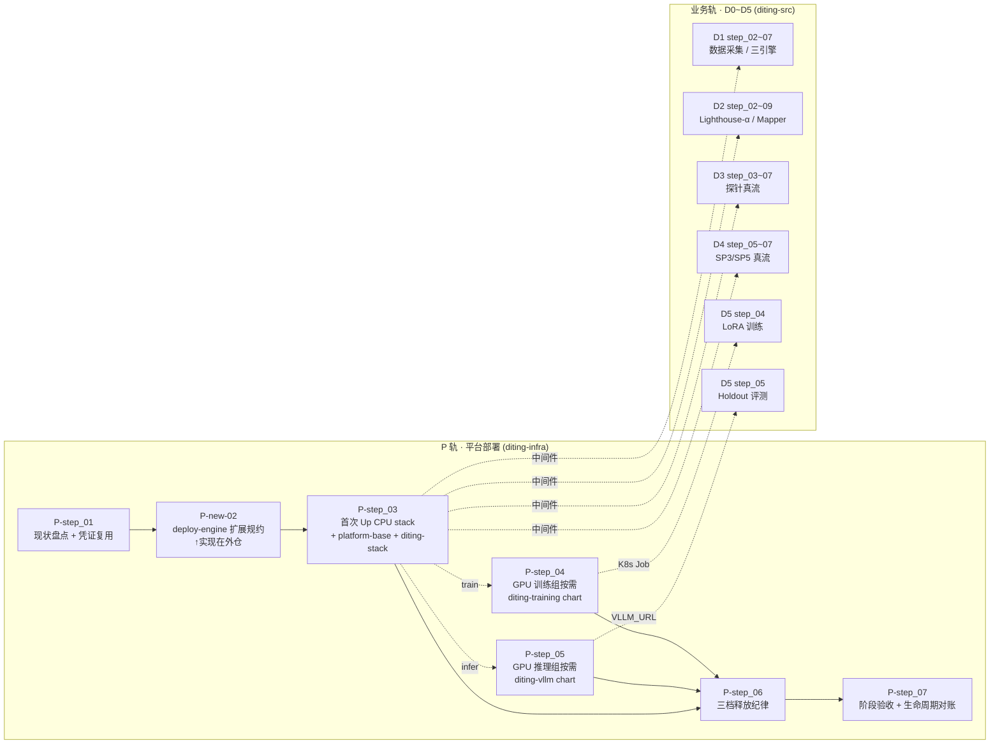

# L3 · 共享平台基础（平台部署轨 · P 轨）

> **本目录定位**：与六维度业务轨（D0~D5）平行的「平台部署轨（P 轨）」L3 设计。回答**业务 step 不该回答的问题**：Spot ECS 怎么 Up/Down、K3s **四层 Helm chart 架构**（platform-base / diting-stack / training / vllm）怎么起、数据怎么永驻、GPU 训练/推理节点怎么按需起停回收、三档资源释放（单 stack / platform-base / 完全销毁）怎么做。
>
> **v2 关键修订（2026-05-24）**：地域改回**香港**（现状一致）；存储 **NAS + 独立 ESSD 数据盘**（已有 · 不重做）；常态**0 节点 · 随用随起 · 数据永驻**；business chart 拆为 **4 个独立 chart**（符合 helm best practice · 解决 namespace 归属隐患）；新增 [02_deploy-engine 扩展规约](./stages/stage_1_启动期/02_deploy-engine扩展规约.md)（多 stack `for_each` + 三档 destroy）。

> [!NOTE] **[TRACEBACK]**
> - **协议**：`diting-doc/00_系统规则_通用项目协议.md` §十一「Diting 目标运行时」、§十一「云原生优先」、§十一「deploy-engine 子模块约定」
> - **拓扑规约**：[`_共享规约/16_阿里云ECS_K3s_ACR_Helm部署与deploy-engine链路`](../_共享规约/16_阿里云ECS_K3s_ACR_Helm部署与deploy-engine链路.md)
> - **基础设施规约**：[`节奏与交付/02_基础设施与部署规约`](../节奏与交付/02_基础设施与部署规约.md)
> - **关键 ADR**：[`06_/ADR/003-spot-ecs-compute-storage-separation`](../../06_追溯与审计/ADR/003-spot-ecs-compute-storage-separation.md)（Spot + 存算分离）
> - **L3 模板**：[`_共享规约/L3_启动期step_重构模板`](../_共享规约/L3_启动期step_重构模板.md)（本 P 轨 step 亦遵守 13 节模板，§3/§3.5 按平台资源裁剪）
> - **全局节奏**：[`_共享规约/14_六维度启动期统一节奏表`](../_共享规约/14_六维度启动期统一节奏表.md) §6.4（P 轨 × 周次）
> - **DNA**：[`_System_DNA/shared/dna_shared_platform_baseline.yaml`](../_System_DNA/shared/dna_shared_platform_baseline.yaml)（已扩 7 step + 4 chart + 3 stack 键）
> - **L4 实践记录**：[`04_/共享平台基础/stage_1_启动期/`](../../04_阶段规划与实践/共享平台基础/stage_1_启动期/README.md)
> - **L5 准出**：`l5-shared-platform-baseline`（P 轨七 step 合并准出锚点）

---

## §1 P 轨与业务轨（D0~D5）的关系



**核心原则**：
- **业务 step 只声明业务合约**（Makefile target、Job spec、ConfigMap 字段）；**P 轨 step 只提供平台合约**（chart / namespace / nodeSelector / PVC / Service / Secret / 释放纪律）；
- **接口面 = K8s API + Makefile**；P 轨**不写**业务命令，业务轨**不写**云资源；
- **deploy-engine 写操作仅在独立仓库**（与 diting-infra 平级），diting-infra 内仅 `make update-deploy-engine` 拉子模块（违反则属 `.cursorrules` §九 违规）；
- **数据资源永驻**（NAS / 独立 ESSD 数据盘 / OSS / ACR），仅 `FULL_DESTROY=1` 可销 · 需二次确认。

---

## §2 四层 Helm chart 架构（v2 · 核心架构）

按"**生命周期分层 + helm best practice**"拆 4 个独立 chart，每个 chart 一个 namespace + 一个 release + 一种节点 label：

| 层 | chart | release_name | namespace | 节点 label | 生命周期 | 资源类型 |
|----|-------|-------------|-----------|----------|---------|---------|
| **L0 集群级基础设施** | `diting-platform-base` | `diting-platform-base` | （cluster-scoped）| — | **一次装 · 长期不动** | 3 namespace / ACR pull secret（复制到 3 ns）/ nvidia-device-plugin / nvidia RuntimeClass / storageclass-nas |
| **L1 CPU 业务（常态滚动）** | `diting-stack`（沿用现有 · 轻改造） | `diting-stack` | `platform` | `stack.diting/node=base` | 业务迭代频繁 | module_a / ingest / schema-init / PV/PVC（NAS subPath 与独立数据盘）|
| **L2 GPU 训练（任务态 · 可并行）** | `diting-training` | `diting-train-<dim>` | `train` | `stack.diting/node=train` | 一次性 Job · 跑完即销 | LoRA Job / ConfigMap / Secret / PVC（NAS subPath /lora/）|
| **L3 GPU 推理（长服务态 · 多 dim 连跑）** | `diting-vllm` | `diting-infer` | `infer` | `stack.diting/node=infer` | 评测周期内常驻 | vLLM Deployment / Service / ConfigMap / PVC（NAS subPath /lora/ RO）|

**为何拆 4 个**（详见上轮决策推演）：
- ❌ **1 chart**（umbrella）：500+ 行 values · lifecycle 全耦合；
- ❌ **3 chart**（stack/train/vllm）：namespace 归属歧义 · uninstall 业务带掉 train/infer ns；
- ✅ **4 chart**：基础设施层独立 · 训练/推理完全解耦 · 业界主流（Kubeflow / NVIDIA GPU Operator / KServe）。

---

## §3 三档资源释放纪律（v2 校正 · 核心纪律）

> **v2 校正**：VPC / 安全组 / 路由 / 网关与数据类同级永驻（0 成本 · 重建贵）；命令统一用 chart 名（更直观）。

| 档 | 命令 | 释放对象 | 保留对象 | 触发频率 |
|----|------|---------|---------|---------|
| **L3/L2/L1 单 chart down**（**最常用**）| `make down-stack <chart-name>`<br>等价：`helm uninstall <release> -n <ns>` + 销该 stack ECS+EIP+系统盘 | 对应 stack ECS + EIP + 系统盘 + 该 chart 的 K8s 资源 | namespace + ACR secret + device-plugin + VPC + 安全组 + 路由 + 网关 + NAS + 独立数据盘 + OSS + ACR + **其他 stack** | 每日多次（按需起停）|
| **L0 platform-base down** | `make down-platform-base` | namespace + 集群级 K8s 资源（device-plugin / ACR secret / runtimeClass / storageclass）+ **所有残留 ECS + EIP** | 🟢 **VPC + 安全组 + 路由 + 网关 + NAS + 独立数据盘 + OSS + ACR**（基础设施 + 数据全部保留）| 月级（长暂离 · DR 演练前）|
| **完全销毁**（仅永久退出 · 极小心）| `make down-all FULL_DESTROY=1` + 二次确认输入 `DESTROY-DATA` | 上述全部 + **VPC + 安全组 + 路由 + 网关 + NAS + 独立数据盘 + OSS** | 仅 ACR 镜像仓库（在控制台手销）| 年级（业务永久终止）|

**chart 名 ↔ stack ↔ ECS 映射**：

| `<chart-name>` | helm release | namespace | ECS stack | 备注 |
|----------------|--------------|-----------|-----------|------|
| `diting-stack` | `diting-stack` | `platform` | `base`（CPU u1-c1m4）| 业务侧 |
| `diting-training` | `diting-train-<dim>`（可多 release 并行）| `train` | `train`（GPU gn6i T4）| 训练 Job |
| `diting-vllm` | `diting-infer` | `infer` | `infer`（GPU gn6i T4）| 推理 Service |
| `diting-platform-base` | `diting-platform-base` | （cluster-scoped）| —（DaemonSet 跟节点）| 集群级基础设施 |

**操作模式示例**：

```bash
# === 业务（CPU）===
make up-stack diting-stack          # 起 base ECS + helm install diting-stack -n platform
make down-stack diting-stack        # helm uninstall + 销 base ECS（保留独立数据盘 + NAS + VPC + 网络）

# === 训练（GPU · 可多 dim 并行 release）===
make up-stack diting-training       # 起 train ECS（开箱即用 GPU 镜像）
helm install diting-train-cryo charts/diting-training -n train --set training.dim=cryo --set training.maxSteps=500
helm install diting-train-thrust charts/diting-training -n train --set training.dim=thrust
kubectl wait --for=condition=complete job -l app=diting-train -n train --timeout=2h
make down-stack diting-training     # uninstall 所有 diting-train-* + 销 train ECS（保留 NAS LoRA + 网络）

# === 推理（GPU · 多 dim 连跑保留节点）===
make up-stack diting-vllm           # 起 infer ECS + helm install diting-infer -n infer
for dim in cryo thrust narrative; do make holdout DIM=$dim; done
make down-stack diting-vllm         # uninstall + 销 infer ECS（保留 NAS + 网络）

# === 集群级基础设施（一次装 · 长期不动 · 加 GPU 节点自动生效）===
make up-platform-base               # 装 namespace + ACR secret + device-plugin（base ECS 已起的前提下）
make down-platform-base             # 清集群级 K8s + 销所有残留 ECS（保留 VPC + 网络 + 数据）

# === 永久退出（仅极少用 · 危险）===
make down-all FULL_DESTROY=1        # 销 VPC + 数据 + 所有
# 系统会提示: 请输入 DESTROY-DATA 以确认（含 NAS / 独立数据盘 / OSS 数据将不可恢复）
```

**对应资源矩阵**详见 [step_06_Stack_Down与三档释放纪律.md](./stages/stage_1_启动期/steps/step_06_Stack_Down与三档释放纪律.md) §2。

---

## §4 P 轨 step 顺序与触发条件

| # | step | 触发条件 | 14 表周次 | 必经/可选 | DNA 键 |
|---|------|---------|-----------|----------|--------|
| **01** | [现状盘点与凭证复用](./stages/stage_1_启动期/steps/step_01_现状盘点与凭证复用.md) | 启动期前 | W1 | **必经**（5 min）| `dna_shared_platform_baseline.steps[p_step_01]` |
| **02** | [deploy-engine 扩展规约](./stages/stage_1_启动期/02_deploy-engine扩展规约.md)（设计规约文档）| step_01 完成 | W1 | **必经**（设计 · 实现在外仓 0.5 day）| `…steps[p_step_02]` |
| **03** | [CPU stack 按需 Up · platform-base + diting-stack](./stages/stage_1_启动期/steps/step_03_CPU_Stack_按需Up.md) | step_02 deploy-engine 扩展完成 | W2 | **必经**（首次 Up）| `…steps[p_step_03]` |
| **04** | [GPU 训练组按需 Up · diting-training](./stages/stage_1_启动期/steps/step_04_GPU训练组按需Up.md) | D5 verified ≥100 或冲 ★M2 | W4~W5 | **可选**（按需触发）| `…steps[p_step_04]` |
| **05** | [GPU 推理组按需 Up · diting-vllm](./stages/stage_1_启动期/steps/step_05_GPU推理组按需Up.md) | step_04 LoRA 训完 或 D1 step_07 上线 | W5+ | **可选**（按需触发）| `…steps[p_step_05]` |
| **06** | [Stack Down 与三档释放纪律](./stages/stage_1_启动期/steps/step_06_Stack_Down与三档释放纪律.md) | 任意 stack 跑完 / 暂离 / DR | 任意 | **必经**（每次释放触发）| `…steps[p_step_06]` |
| **07** | [阶段验收 · 平台快照与生命周期对账](./stages/stage_1_启动期/steps/step_07_阶段验收_平台快照.md) | 启动期收口前 | W11~W12 | **必经** | `…steps[p_step_07]` |

> **必经 vs 可选**：step_01/02/03/06/07 启动期必经；step_04/05 按需触发（仅 D5 tier-2 GPU 训练/推理时启动；W4 tier-1 不依赖）。

---

## §5 与业务轨的接口契约

| 业务 step | P 轨依赖 | 接口形态 |
|----------|---------|---------|
| D1/D2/D3/D4 step_02~03（数据采集） | P-step_03 | TimescaleDB / Postgres-L2 / Redis Service Endpoint（platform ns）|
| D2 step_02 The Sniffer | P-step_03 | Kafka Bootstrap Server `sniffer_raw_text`（platform ns）|
| D3 step_02~04 探针 | P-step_03 | TimescaleDB（`probe_results`）+ Redis Streams |
| **D5 step_04 LoRA 训练**（tier-2） | **P-step_04** | `diting-training` chart · nodeSelector `train` · NAS PVC RW |
| **D5 step_05 Holdout（vLLM 模式）**（tier-2） | **P-step_05** | `VLLM_URL=http://diting-infer.infer.svc:8000` · NAS PVC RO |
| D1 step_07 三引擎部署 | P-step_05 | vLLM multi-LoRA Service |
| D0 step_05 告警通道 | P-step_03 | Kafka / Redis |
| 全部 L4 实践记录 | P-step_07 | 平台快照 MD（ACR digest / helm release / Spot ID / 生命周期对账）|

---

## §6 启动期 tier-1 / tier-2 与 P 轨

| 启动期 tier | P 轨需达 | 业务对应 |
|------------|---------|---------|
| **tier-1（数据 + 合约绿）** | P-step_01/02/03（首次 Up CPU stack · 中间件可用）| D0~D5 step_01~04 |
| **tier-2（满血）** | + P-step_04/05（按需 GPU）| D5 step_04 真 LoRA + step_05 真 vLLM Holdout |
| **★M2 W4** | P-step_04 触发；step_05 W5 | D5 verified ≥100 + Holdout 不退化 |

**W4 启动期 BLOCKED 联动**（与 14 表 §9.1.1 一致）：
- `BLOCKED(platform_not_ready)`：P-step_03 未达 → 业务 step 标 `BLOCKED(platform_not_ready)`，先做 P 轨；
- `BLOCKED(deploy_engine_lifecycle_missing)`：P-step_02 deploy-engine 扩展未完成 → 无法按 stack 起停 → 退到 `make deploy diting prod` 整体 Up；
- `BLOCKED(gpu_unavailable)`：P-step_04/05 未触发或 Spot 库存为 0 → D5 step_04/05 退到 dry-run/mock。

---

## §7 关键决策记录（启动期 · v2）

| 决策项 | 启动期值 | 出处 |
|--------|---------|------|
| **运行时地域** | **阿里云香港 `cn-hongkong`**（v2 修订：与现状一致 · 复用现有 6 类资源） | 用户决策 2026-05-24 v2 |
| **CPU 节点规格** | `ecs.u1-c1m4.xlarge`（4c16g · Spot · ~¥0.3-0.6/h）| `diting-infra/config/terraform-diting-prod.tfvars` 现状 |
| **GPU 节点规格** | **`ecs.gn6i-c4g1.xlarge`（T4 16G · 4 vCPU · 15GB）** | 用户决策 2026-05-24 |
| **GPU 镜像** | **`ubuntu_22_04_x64_100G_with_gpu_driver_and_cuda_alibase_*`**（阿里云公共镜像 · NVIDIA Driver 580.126.09 + CUDA 12.8 + Container Toolkit + Docker · 开箱即用）| 阿里云官方 ECS 帮助 |
| **GPU 计费形态** | **Spot 按量**，价上限按市场动态（启动期 ~¥1-3/h）| 用户决策 + ADR-003 |
| **训练/推理是否同节点** | **分两 Spot 节点**（namespace + nodeSelector 隔离 · 训练完独立回收）| 用户决策 2026-05-24 |
| **Kubernetes** | **K3s** 单 master（CPU 节点）+ GPU 按需 join 为 agent | 16_ |
| **数据持久** | **NAS `12db2e48f90`**（跨节点共享 · LoRA / 训练数据）+ **独立 ESSD 数据盘 `d-j6cc6ew2bqkfdlwaavit`**（postgres 持久 · `delete_with_instance=false`）· **Down 永不删** | 现状 + ADR-003 |
| **chart 拆分** | **4 个独立 chart**（platform-base + diting-stack + diting-training + diting-vllm）| 用户决策 2026-05-24 v2 |
| **释放纪律** | **三档**（单 chart down / platform-base down / FULL_DESTROY）· 命令统一用 chart 名 `make down-stack <chart>` | 用户决策 2026-05-24 v2 |
| **永驻资源** | 🟢 **VPC + 安全组 + 路由 + 网关 + NAS + 独立数据盘 + OSS + ACR**（与数据同级永驻 · 仅 FULL_DESTROY 可销）| 用户校正 2026-05-24 v2 |
| **deploy-engine 扩展** | W1 在**外仓**新增多 stack `for_each` + 按 stack_id 三档 destroy + GPU 镜像 + label 注入 | 见 [02_deploy-engine扩展规约](./stages/stage_1_启动期/02_deploy-engine扩展规约.md)|
| **配置真相源** | `diting-infra/config/*.yaml` + 4 个 chart 各自 `values/`；Makefile 仅传参 | `.cursorrules` §十一 |

---

## §8 AI 实践最佳推荐模型

| 用途 | 推荐模型 | 一句理由 |
|------|---------|---------|
| Terraform / Helm YAML 生成与改写 | Claude Sonnet 4.6 | YAML 一次成型 + 长上下文 |
| Spot 实例市场价 / 库存查询 | Cursor 默认 + WebSearch | 实时价格变动 |
| GPU 调度 / nodeSelector / nvidia-device-plugin 排错 | Claude Opus 4.7 | 跨组件链路推理 |
| 重复性 `make` 一键合约填充 | Composer 2.5 Fast | 性价比 |

**维护责任**：架构师每季度复审。

---

## §9 修订记录

| 日期 | 变更摘要 |
|------|---------|
| 2026-05-24 v1 | **P 轨初版**（按 §4.5 关键重构）：建立平台部署 L3 step 体系，7 step 与业务轨解耦；地域=新加坡；GPU=gn6i-c4g1 T4 16G Spot；双 Stack 按需起停。与 `.cursorrules`、`00_系统规则`、14 表 §6.4 同步。|
| **2026-05-24 v2** | **P 轨重大修正**（按 §4.5 关键重构）：①地域改回**香港**（与现状一致 · 复用现有 VPC/NAS/数据盘/OSS/ACR）；②存储改 **NAS + 独立 ESSD 数据盘**（已有 · 不重做）；③常态改 **0 节点 · 随用随起 · 数据永驻**；④chart 拆 **4 个**（platform-base + stack + training + vllm · 符合 helm best practice · 解决 ns 归属隐患）；⑤新增 **02_deploy-engine 扩展规约**（多 stack `for_each` + 三档 destroy + GPU 镜像 + label 注入）；⑥**三档释放纪律**（单 chart down / platform-base down / FULL_DESTROY · 数据永驻）；⑦**命令统一用 chart 名**（`make down-stack <chart-name>` 更直观 · 而非 `STACK_ID=<id>`）；⑧**VPC/安全组/路由/网关与数据同级永驻**（0 成本 · 重建贵 · 仅 FULL_DESTROY 可销）；⑨同步 7 step 全部重写、DNA、14 表、`.cursorrules`、`00_系统规则`。用户决策：D1=香港、D2=W1 写 deploy-engine 扩展、D3=4 chart；用户校正：命令格式 + 网络永驻。|
