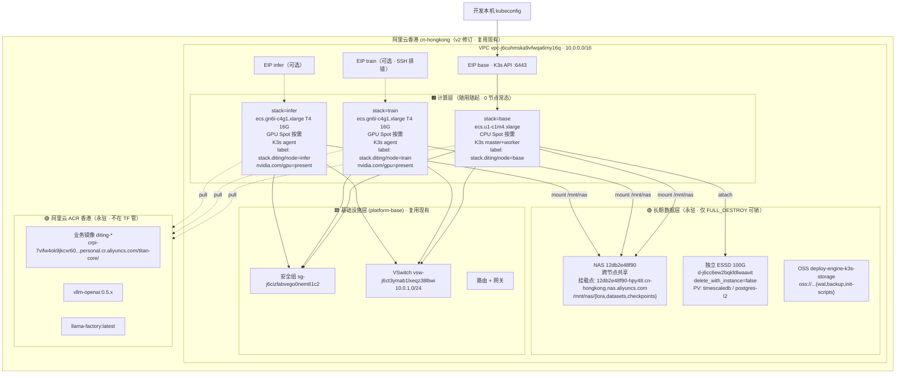

# 共享平台基础 · 启动期 · 平台拓扑设计（v2）

> **本文档定位**：把 [`_共享规约/16_阿里云ECS_K3s_ACR_Helm部署与deploy-engine链路`](../../../_共享规约/16_阿里云ECS_K3s_ACR_Helm部署与deploy-engine链路.md) 的「拓扑」具象化到**阿里云香港 · Spot ECS · 4 chart × 3 stack · 0 节点常态 · 随用随起**语境，给 7 个 P-step 提供共享上下文。**不**重复 16_ 的「为什么」，仅落「启动期是什么样子」。
>
> **v2 关键修订（2026-05-24）**：地域改回**香港**（与现状一致 · 复用现有 VPC/NAS/数据盘/OSS/ACR）；存储 **NAS（跨节点共享）+ 独立 ESSD 数据盘**（已有）；常态**0 节点 · 随用随起 · 数据永驻**；架构 **4 chart × 3 stack**（namespace + nodeSelector 隔离）；三档释放纪律。

> [!NOTE] **[TRACEBACK]**
> - **P 轨入口**：[共享平台基础/README](../../README.md)
> - **拓扑总图**：[`_共享规约/16_`](../../../_共享规约/16_阿里云ECS_K3s_ACR_Helm部署与deploy-engine链路.md)
> - **决策依据**：[ADR-003 Spot+存算分离](../../../../06_追溯与审计/ADR/003-spot-ecs-compute-storage-separation.md)
> - **deploy-engine 扩展规约**：[02_deploy-engine扩展规约](./02_deploy-engine扩展规约.md)
> - **基础设施规约**：[`节奏与交付/02_基础设施与部署规约`](../../../节奏与交付/02_基础设施与部署规约.md)
> - **DNA**：[`_System_DNA/shared/dna_shared_platform_baseline.yaml`](../../../_System_DNA/shared/dna_shared_platform_baseline.yaml)

---

## §1 启动期目标拓扑（一图胜千言）



**启动期边界**（v2）：
- **常态 0 节点 · 随用随起**：3 个 stack（base / train / infer）的 ECS 全部按需 Up/Down · 不用即关；
- **复用现有 6 类资源**：VPC `vpc-j6cuhmska9vfwqa6my16q`、VSwitch `vsw-j6ct3ymab1lxeqz38lbwi`、安全组 `sg-j6cizfabvego0nem81c2`、NAS `12db2e48f90`、独立 ESSD `d-j6cc6ew2bqkfdlwaavit`、OSS `deploy-engine-k3s-storage`（**不重做** · 仅适配 `for_each stacks`）；
- **数据永驻**：NAS / 独立数据盘 / OSS / ACR **任何 down 都不动**（仅 `FULL_DESTROY=1` 可销 · 二次确认）；
- **GPU 节点共享 NAS**：训练写 `/mnt/nas/lora/{dim}/{ts}/`，推理直接挂同路径读 RO · **零拷贝**；
- **GPU 镜像开箱即用**：`ubuntu_22_04_x64_100G_with_gpu_driver_and_cuda_alibase_*`（NVIDIA Driver 580.126.09 + CUDA 12.8 + Container Toolkit + Docker · 阿里云内网源 · 拉镜像快）。

---

## §2 4 Chart × 3 Stack 矩阵（v2 · 核心架构）

| chart | release | namespace | nodeSelector | 对应 stack ECS | 生命周期 |
|-------|---------|-----------|-------------|---------------|---------|
| **diting-platform-base** | `diting-platform-base` | （cluster-scoped）| — | 任意（资源 DaemonSet 跟节点）| 一次装 · 长期不动 |
| **diting-stack** | `diting-stack` | `platform` | `stack.diting/node=base` | **base**（CPU spot · 按需）| 业务迭代频繁 |
| **diting-training** | `diting-train-<dim>`（可多 release）| `train` | `stack.diting/node=train`<br>+`nvidia.com/gpu: 1` | **train**（GPU spot · 按需）| Job · 跑完即销 |
| **diting-vllm** | `diting-infer` | `infer` | `stack.diting/node=infer`<br>+`nvidia.com/gpu: 1` | **infer**（GPU spot · 按需）| 评测周期内常驻 |

**stack ↔ ECS ↔ namespace 三态硬绑定**：

```
stack=base    ECS_BASE   ←→  ns=platform  ←→  chart=diting-stack
stack=train   ECS_TRAIN  ←→  ns=train     ←→  chart=diting-training
stack=infer   ECS_INFER  ←→  ns=infer     ←→  chart=diting-vllm
```

**调度纪律**：
- 训练 Job：`nodeSelector: {stack.diting/node: train}` + `resources.limits.nvidia.com/gpu: 1`；
- 推理 Deploy：`nodeSelector: {stack.diting/node: infer}` + `resources.limits.nvidia.com/gpu: 1`；
- CPU 业务：`nodeSelector: {stack.diting/node: base}`；
- **禁止**业务 Pod 调度到 GPU 节点（资源浪费 + Spot 回收快 · CronJob 检测 violation 告警）。

---

## §3 PV / PVC / Secret 命名约定（v2 · NAS 优先）

| 资源 | 命名 | 类型 | 存储后端 | 生命周期 |
|------|------|------|---------|---------|
| **NAS** PVC | `pvc-nas-lora` | RWX | NAS subPath `/lora/` | 永驻 · cluster-shared |
| **NAS** PVC | `pvc-nas-datasets` | RWX | NAS subPath `/datasets/` | 永驻 · cluster-shared |
| **NAS** PVC | `pvc-nas-checkpoints` | RWX | NAS subPath `/checkpoints/` | 永驻 · cluster-shared |
| **独立数据盘** PV | `timescaledb-data-pv` | RWO | ESSD subPath `timescaledb` | 永驻（仅 base stack 挂）|
| **独立数据盘** PV | `postgresql-l2-data-pv` | RWO | ESSD subPath `postgresql-l2` | 永驻 |
| **独立数据盘** PVC | `data-timescaledb-postgresql-0` | RWO | → PV | 永驻 |
| **独立数据盘** PVC | `data-postgresql-l2-0` | RWO | → PV | 永驻 |
| Secret | `acr-titan`（复制到 platform/train/infer 三 ns）| docker-registry | — | 半永驻（platform-base 管 · rotate 季度）|
| Secret | `aliyun-oss-keys` | Opaque | — | 半永驻 |
| Secret | `wandb-api-key` | Opaque | — | 临时（train stack 起时 helm `--set`）|
| Secret | `hf-token` | Opaque | — | 临时（infer stack 起时）|
| ConfigMap | `vllm-runtime-config` | — | — | 临时（infer release 内）|

> **永驻**：Down 不删；
> **半永驻**：platform-base 创建 · 跨业务共享 · 季度轮换；
> **临时**：随业务 release 起灭，配置在 chart values 而非外部。

---

## §4 网络与 Service 暴露

| 组件 | namespace | Service 类型 | NodePort / 端口 | 暴露面 |
|------|----------|------------|----------------|--------|
| K3s API | kube-system | LoadBalancer（EIP）/ ClusterIP | 6443 | 公网（白名单开发本机 IP）|
| TimescaleDB | platform | NodePort | 30001 | 集群外可连（开发期）|
| Postgres-L2 | platform | NodePort | 30002 | 集群外可连 |
| Redis | platform | NodePort | 30003 | 集群外可连 |
| Kafka（启动期可选）| platform | NodePort | 30004 / 30094 | 集群外可连 |
| MinIO（启动期可选）| platform | NodePort | 30005 / 30006（console）| 集群外可连 |
| 业务 API（D0/D1/…） | platform | ClusterIP + Ingress | 80/443 | ingress-nginx |
| **vLLM** | infer | ClusterIP | 8000 | **仅集群内** Holdout 评测调用（不暴露公网）|
| 训练 Job | train | （无 Service）| — | 仅 K8s 内部 |

> **生产期收紧**：NodePort 改 LoadBalancer + WAF；启动期为开发便利保留 NodePort。
> **跨 ns 调用**：`infer` 调用 `platform` 数据库需带 FQDN（如 `timescaledb-postgresql.platform.svc:5432`）；NetworkPolicy 启动期默认放开 · 完善期再收紧。

---

## §5 资源画像与启动期成本（v2 · 随用随起）

| stack | 规格 | 启动期跑时 | 单价 | 月成本（实际跑时）|
|-------|------|-----------|------|------------------|
| **base**（CPU 业务）| `ecs.u1-c1m4.xlarge` 4c16g | W1~W12 · 每日采集/业务 ~4h · 总 ~200h | ~¥0.3-0.6/h Spot | **~¥60-120** |
| **train**（GPU 训练）| `ecs.gn6i-c4g1.xlarge` T4 4c15g | W4~W5 训练 · 实际 ~20h | ~¥1-3/h Spot | **~¥20-60** |
| **infer**（GPU 推理）| `ecs.gn6i-c4g1.xlarge` T4 4c15g | W5+ 评测 · 实际 ~10h | ~¥1-3/h Spot | **~¥10-30** |
| **永驻资源** | NAS 100G / 独立 ESSD 100G / OSS / EIP / 流量 | 24/7 | — | **~¥50-100** |
| **启动期总计** | — | — | — | **~¥140-310 / 月**（vs v1 24/7 ~¥400-600）|

> 相比 v1 「CPU 24/7」节省约 **¥260-290 / 月**（**~60%**）。
> 实际价格以 [阿里云 Spot 价格](https://help.aliyun.com/zh/ecs/user-guide/preemptible-instances) 实时为准。
> `DECISION_PENDING`：若 Spot 库存为 0，回退按量付费上限 ¥10/h 或换可用区。

---

## §6 与 16_ 拓扑总图的差异（启动期裁剪）

| 16_ 总图 | 启动期裁剪 v2 | 原因 |
|---------|--------------|------|
| 多 master HA K3s | 1 节点 K3s（base stack）| 启动期成本与复杂度 |
| ACK / EDAS | K3s | 已有共识；本期不动 |
| 多 namespace（dev/staging/prod）| **3 namespace（platform/train/infer）** | 业务隔离 · 不分环境 |
| 多区域 DR | 单区域（**香港**）| 启动期不做异地 DR；OSS 跨区复制即可 |
| 服务网格 mTLS | **延期到 W11+** | 启动期不强求 |
| WAF / CDN | **延期** | 启动期 NodePort + 白名单 |
| 24/7 CPU 节点 | **0 节点 · 随用随起** | v2 修订 · 用户决策 · 成本优化 60% |
| 单 chart umbrella | **4 chart（platform-base + stack + training + vllm）**| v2 修订 · helm best practice |

> **完善期承接**：上述「延期」项写入 `stage_2_扩展期` / `stage_3_完善期`，本启动期 step 不展开。

---

## §7 现状资源 ID 清单（v2 · 复用而非重做）

> 所有 ID 来自 `diting-infra/config/terraform-diting-prod.tfvars` 与 `config/diting-prod.yaml` 现状勘察（2026-05-24）。**P-step_02 deploy-engine 扩展时仅适配 `for_each stacks`，不创建新资源**。

| 资源 | 现状 ID | 用途 | 永驻 / 谁管 |
|------|--------|------|------------|
| 地域 | `cn-hongkong` | 阿里云香港 | — |
| 🟢 **VPC** | `vpc-j6cuhmska9vfwqa6my16q` | 私网 | **永驻**（0 成本 · 仅 FULL_DESTROY 可销）|
| 🟢 **VSwitch** | `vsw-j6ct3ymab1lxeqz38lbwi` | 子网 10.0.1.0/24 | **永驻** |
| 🟢 **安全组** | `sg-j6cizfabvego0nem81c2` | 通用安全组 | **永驻**（重建会失效所有白名单）|
| 🟢 **路由表 / 网关** | （随 VPC 自动）| 路由 + 出网 | **永驻**（0 成本）|
| 🟢 **NAS 文件系统** | `12db2e48f90` | 跨节点共享（LoRA/datasets/checkpoints）| **永驻**（数据 · 重建会丢全部 LoRA / 训练数据）|
| 🟢 NAS 挂载点域名 | `12db2e48f90-hpy48.cn-hongkong.nas.aliyuncs.com` | NFS 挂载 | 跟 NAS 永驻 |
| 🟢 NAS Access Group | `deploy-engine_nas_group_prod` | NAS 访问控制 | 跟 NAS 永驻 |
| 🟢 **独立数据盘** | `d-j6cc6ew2bqkfdlwaavit` | 100Gi ESSD · postgres 持久 · `delete_with_instance=false` | **永驻**（数据 · base ECS 重启重挂同盘）|
| 🟢 **OSS bucket** | `deploy-engine-k3s-storage` | wal / init-scripts / 备份 | **永驻**（数据）|
| 🟢 **ACR 仓库** | `crpi-7vifw4ok9jkcxr60.cn-hongkong.personal.cr.aliyuncs.com/titan-core/` | 业务镜像（diting-ingest / diting-module-a / 后续 diting-vllm / diting-train）| **永驻**（不在 TF 管 · 阿里云控制台手销）|
| ACR Pull Secret 命名 | `acr-titan` | docker-registry 类型 | platform-base chart（复制到 3 ns · `make down-platform-base` 时清）|
| ECS 实例密码 | `TF_VAR_instance_password` env 注入 | 不写入 tfvars | 用户本地 .env |

**🟢 = 永驻资源（仅 `make down-all FULL_DESTROY=1` 二次确认可销）**：网络层（VPC/SG/路由/网关）+ 数据层（NAS/独立盘/OSS）+ 仓库层（ACR）共 10 项。这些资源在任何 `down-stack <chart>` / `down-platform-base` 命令下都**绝对不动**。

**释放纪律见** [README §3 三档资源释放纪律](../../README.md#§3-三档资源释放纪律v2-校正-核心纪律) 与 [step_06_Stack_Down与三档释放纪律](./steps/step_06_Stack_Down与三档释放纪律.md)。

---

## §8 修订记录

| 日期 | 变更摘要 |
|------|---------|
| 2026-05-24 v1 | 启动期拓扑初版：新加坡 + Spot CPU 常驻 + GPU 双 Stack 按需 + 数据盘永驻 |
| **2026-05-24 v2** | **重大修正**（按 §4.5 关键重构）：①地域改回**香港 cn-hongkong**（与现状一致 · 现有 6 类资源全保留）；②存储改 **NAS + 独立 ESSD 数据盘**（已有 · 不重做）；③常态改 **0 节点 · 随用随起 · 数据永驻**；④架构改 **4 chart × 3 stack** matrix（namespace + nodeSelector 三态硬绑定）；⑤新增 §7 现状资源 ID 清单；⑥成本预估降为 ~¥140-310/月（vs v1 ~¥400-600，节省 60%）；⑦**用户校正**：**VPC/安全组/路由/网关与数据同级永驻**（0 成本 · 重建贵 · 仅 FULL_DESTROY 二次确认可销 · §7 全部标 🟢）+ 命令统一用 chart 名（`make down-stack <chart-name>`）。同步 P 轨 README、step_01~07、DNA、14 表、`.cursorrules`、`00_系统规则`。|
