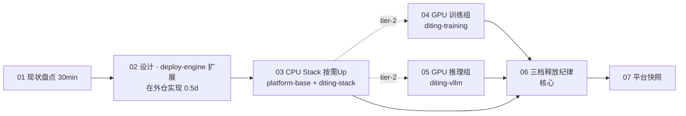

# 共享平台基础 · 启动期 · steps 索引（v2）

> **执行权威**：本目录即 P 轨启动期的**执行序**。按顺序读 + 执行；step_04/05 按需触发。
>
> **v2 重大修正（2026-05-24）**：①地域改香港 `cn-hongkong`（复用现有 VPC/NAS/独立盘）②**0 节点常态 · 随用随起**③**4 chart 架构**（diting-platform-base + diting-stack + diting-training + diting-vllm）④**三档释放纪律**（命令统一用 chart 名 `make down-stack <chart-name>`）⑤**永驻 10 项**（VPC+SG+路由+网关+NAS+独立盘+OSS+ACR 与数据同级 · 任何 down 都不动）

| # | step | 类型 | 触发 | 工作目录 | 关键 Makefile |
|---|------|------|------|---------|---------------|
| 01 | [现状盘点与凭证复用](./step_01_现状盘点与凭证复用.md) | 必经 · 30 min | 启动期前 | `diting-infra/` | `make platform-step01-check` |
| **02 (设计)** | [02_deploy-engine 扩展规约](../02_deploy-engine扩展规约.md) | **设计 · 在外仓实现** | W1 · 0.5 day | **`deploy-engine/`**（平级独立仓库）| 在 deploy-engine 内 `make test-stacks-for-each` |
| 03 | [CPU stack 按需 Up · platform-base + diting-stack](./step_03_CPU_Stack_按需Up.md) | 必经 | step_01 + 02 设计 ✅ | `diting-infra/` | `make up-stack diting-stack` + `helm install diting-platform-base / diting-stack` |
| 04 | [GPU 训练组按需 Up · diting-training chart](./step_04_GPU训练组按需Up.md) | **按需** | D5 verified ≥100 或冲 ★M2 | `diting-infra/` | `make up-stack diting-training` → helm install `diting-train-<dim>` → `make down-stack diting-training` |
| 05 | [GPU 推理组按需 Up · diting-vllm chart](./step_05_GPU推理组按需Up.md) | **按需** | step_04 训完 或 D1 step_07 | `diting-infra/` | `make up-stack diting-vllm` → helm install `diting-infer` → `make down-stack diting-vllm` |
| 06 | [Stack Down 与三档释放纪律](./step_06_Stack_Down与三档释放纪律.md) | **核心纪律** | 任意 stack 跑完 / 长暂离 / 永久退出 | `diting-infra/` | `make down-stack <chart>` / `make down-platform-base` / `make down-all FULL_DESTROY=1` |
| 07 | [阶段验收 · 平台快照](./step_07_阶段验收_平台快照.md) | 必经 | 启动期收口 | `diting-infra/` | `make platform-snapshot` |

> **必经 / 按需说明**：01/02 设计/03/06/07 是启动期必走路径；04/05 仅在 D5 tier-2 训练 / 推理需要 GPU 时按需触发，W4 tier-1 可不依赖。

## 执行序图（v2）

## 与业务轨的硬依赖

| 业务 step | 必须先做 P 轨 |
|----------|--------------|
| D1/D2/D3/D4 step_02~03（采集真数据）| P-step_03（CPU stack + platform-base + diting-stack 装好） |
| D5 step_04 真 LoRA 训练 | P-step_04（GPU 训练组）|
| D5 step_05 真 vLLM Holdout | P-step_05（GPU 推理组）|
| D1 step_07 三引擎 vLLM 部署 | P-step_05 |

详见 [P 轨 README §3](../../../README.md#§3-三档资源释放纪律v2-校正-核心纪律)。

## 三档释放纪律速查

| 档 | 命令 | 销什么 | 留什么 |
|----|------|--------|--------|
| **tier-1** | `make down-stack <chart-name>` | 该 stack ECS + EIP + 系统盘 | 永驻 10 项 + 其他 stack |
| **tier-2** | `make down-platform-base` | 所有 ECS + 集群级 K8s | **永驻 10 项**（VPC+网络+数据 全在）|
| **tier-3** | `make down-all FULL_DESTROY=1` + 二次确认 `DESTROY-DATA` | 含 VPC + 数据（**不可恢复**）| 仅 ACR |

**永驻 10 项**：🟢 VPC + VSwitch + 安全组 + 路由 + 网关 + NAS + NAS 挂载点 + 独立数据盘 + OSS + ACR。

详见 [step_06](./step_06_Stack_Down与三档释放纪律.md) §2 释放矩阵。
