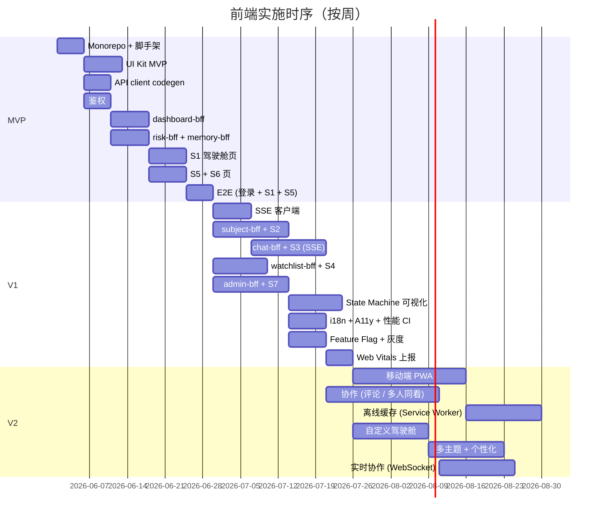

# L3 · 前端工程与服务 · 实施推演设计

> [!NOTE] **[TRACEBACK]**
> - **同模块**：[01](./01_用户场景与产品形态_设计.md)、[02](./02_组件分层与状态管理_设计.md)、[03](./03_API依赖_设计.md)、[04](./04_技术栈与构建_设计.md)
> - **L4 计划目录**：`04_阶段规划与实践/前端工程与服务/`（第 3 批）

## 一、演进路径总览

| 版本 | 关键能力 | 完成判定 |
|------|---------|---------|
| **MVP** | 基础脚手架 + UI Kit MVP + S1（驾驶舱） + S5（风险面板）+ S6（智能记忆栈基础） | 基础展示 + 核心后端模块 MVP 联调通 |
| **V1** | 全 7 大场景 + SSE 实时 + 灰度 + i18n + A11y CI 强约束 | 全场景上线；性能预算达标 |
| **V2** | 移动端 PWA + 协作（多人同看）+ 离线缓存 + 自定义驾驶舱布局 | 多端覆盖；高级用户自定义 |

## 二、MVP（最小可用产品）

### 范围
- Monorepo 脚手架 + UI Kit 基础组件
- BFF：`dashboard-bff` + `risk-bff` + `memory-bff` 最小子集
- App `console`：S1 驾驶舱 + S5 风险面板 + S6 智能记忆栈基础页
- 鉴权：登录 + 短期 Token；用户隔离 BFF 强制
- 性能：首屏 SSR；基础 Web Vitals 上报
- 不含 SSE（用轮询）

### 关键步骤

| # | 步骤 | 工作目录 | 准出 |
|---|------|---------|------|
| MVP-1 | Monorepo 初始化（pnpm + Turborepo + Next.js） | `diting-src/web/` | `pnpm install` 通过；`pnpm dev` 启动空 app |
| MVP-2 | UI Kit MVP（Button / Card / EmptyState / EvidenceTrail / ConfidenceBar） | `diting-src/web/packages/ui-kit/` | Storybook（可选）+ 单元测试通过 |
| MVP-3 | API client 自动生成（Proto / OpenAPI） | `diting-src/web/packages/api-client/` + `diting-src/web/tools/proto-codegen/` | 生成成功；类型可被 import |
| MVP-4 | 鉴权 package | `diting-src/web/packages/auth/` | 登录流程通；Token 持久化 |
| MVP-5 | dashboard-bff（聚合 4 个内部调用） | `diting-src/web/apps/console/app/api/dashboard/` 或独立 BFF | curl 测试通过 |
| MVP-6 | risk-bff + memory-bff 基础 | 同上 | curl 测试通过 |
| MVP-7 | App console：S1 驾驶舱页 | `diting-src/web/apps/console/app/(dashboard)/` | 浏览器看到聚合数据 |
| MVP-8 | App console：S5 风险面板页 | `diting-src/web/apps/console/app/(risk)/` | 浏览器看到风险事件流（轮询） |
| MVP-9 | App console：S6 智能记忆栈基础 | `diting-src/web/apps/console/app/(memory)/` | 浏览器看到知识列表 + 反馈按钮 |
| MVP-10 | E2E（Playwright）覆盖登录 + S1 + S5 关键路径 | `diting-src/web/apps/console/tests/e2e/` | CI 通过 |

### MVP 验收
- 用户登录后能看到 S1 / S5 / S6 三个场景
- BFF 聚合调用 4 个后端模块可用（即使部分模块仍是 MVP）
- Lighthouse 评分（LCP / INP / CLS）达标
- E2E 通过

## 三、V1（完整能力）

### 在 MVP 基础上新增

| 子能力 | 说明 |
|--------|------|
| 完整 7 大场景 | S2 / S3 / S4 / S7 全部上线 |
| SSE 实时 | 议会进度 / 状态迁移 / 风险流实时推送 |
| State Machine 可视化 | React Flow 渲染 |
| 投研对话台 | SSE 长连 + 证据展开 + Agent timeline |
| 灰度 / Feature Flag | 与超级个体进化 version_manager 联动 |
| i18n 双语完整 | 所有文案接入 |
| A11y CI 强约束 | axe 阻塞合并 |
| 性能预算 CI 强约束 | Lighthouse CI 阻塞 |
| 移动端响应式 | 关键场景适配（不含 PWA） |

### 关键步骤

| # | 步骤 | 工作目录 | 准出 |
|---|------|---------|------|
| V1-1 | SSE 客户端 package | `diting-src/web/packages/sse-client/` | 单元测试 + 自动重连 |
| V1-2 | subject-bff + S2 标的工作台 | `diting-src/web/.../subject-bff/` + `apps/console/app/(subject)/` | 端到端：从驾驶舱 → 标的工作台 → 状态机历史 |
| V1-3 | chat-bff + S3 投研对话台 | 同上 | SSE 长连工作；Agent timeline 可见 |
| V1-4 | watchlist-bff + S4 关注列表 | 同上 | 增删 / 分组 / 通知偏好 |
| V1-5 | admin-bff + S7 管理员驾驶舱 | 同上 | 模板 / 版本 / 评测 / 配置 全部可见 |
| V1-6 | State Machine 可视化（React Flow） | `diting-src/web/packages/ui-kit/state-machine/` | 模板 + 实例可视化 |
| V1-7 | i18n 完整接入 | `diting-src/web/packages/i18n/` | 所有文案外置 |
| V1-8 | A11y / 性能 CI 强约束 | `diting-src/web/.github/` 或 CI 配置 | CI 阻塞失败 |
| V1-9 | Feature Flag 接入 | `diting-src/web/packages/feature-flags/` | 灰度可控 |
| V1-10 | Web Vitals 上报到超级个体进化 | `diting-src/web/packages/analytics/` | 后端能看到指标 |

## 四、V2（生产稳态）

| 子能力 | 说明 |
|--------|------|
| 移动端 PWA（apps/mobile-pwa） | S1 / S4 / S5 子集；推送通知 |
| 协作（多人同看 / 评论） | 共享议题 / 评论卡片 |
| 离线缓存 | Service Worker；离线只读模式 |
| 自定义驾驶舱布局 | 用户拖拽组件；保存布局 |
| 多主题 + 个性化 | 主题市场 |
| 实时协作（高级模式） | WebSocket 双向 |

## 五、依赖时序

## 六、依赖关系

| 依赖 | 形态 | 时序 |
|------|------|------|
| 共享平台基础（鉴权 / API Gateway / 静态资源 CDN） | 必须先就绪 | MVP 前 |
| [极寒防御 MVP](../极寒防御/05_实施推演_设计.md) | 风险面板需要 | MVP 与 极寒防御 MVP 并行；S5 在 极寒防御 MVP 后启用 |
| [纵深进攻 MVP](../纵深进攻/05_实施推演_设计.md) | 驾驶舱议会候选 | MVP 阶段使用占位 → 纵深进攻 MVP 上线后联调 |
| [状态机监控 MVP](../状态机监控/05_实施推演_设计.md) | S2 / S4 | V1-2 / V1-4 启用 |
| [超级个体进化 MVP](../超级个体进化/05_实施推演_设计.md) | S6 / 反馈 / 灰度 | MVP 联调；V1 灰度 |

## 七、风险与回退

| 风险 | 影响 | 缓解 |
|------|------|------|
| 后端模块进度滞后 | 前端联调阻塞 | BFF 提供 mock fallback；前端可独立演进 |
| SSE 长连接稳定性 | 实时体验差 | 自动重连 + 心跳 + 降级到轮询 |
| 性能预算被破坏 | 用户体验下降 | CI 阻塞 + 性能巡检任务 |
| A11y 退化 | 合规风险 | CI axe 强制 + 关键路径 e2e |
| 灰度漏放（用户看到未发布功能） | 提前暴露 | Feature flag 双重校验（BFF + 前端） |

## 八、L4 实践目录预告（第 3 批）

`04_阶段规划与实践/前端工程与服务/` 下：
- `01_MVP_脚手架与UI_Kit_实践.md`
- `02_MVP_S1+S5+S6_实践.md`
- `03_V1_S2+S3_对话台与SSE_实践.md`
- `04_V1_S4+S7+灰度_实践.md`
- `05_V2_PWA与协作_实践.md`

## 九、L5 验收锚点预告

| 锚点 | 对应里程碑 |
|------|-----------|
| `l5-frontend-mvp` | MVP 准出 |
| `l5-frontend-v1-full` | V1 七大场景准出 |
| `l5-frontend-v1-perf-a11y` | V1 性能 / A11y 强约束达标 |
| `l5-frontend-v2-pwa` | V2 移动端 PWA |
