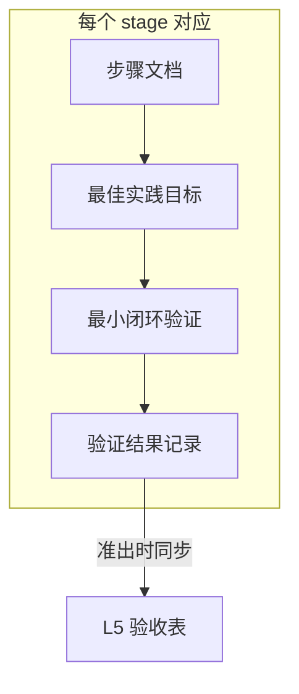
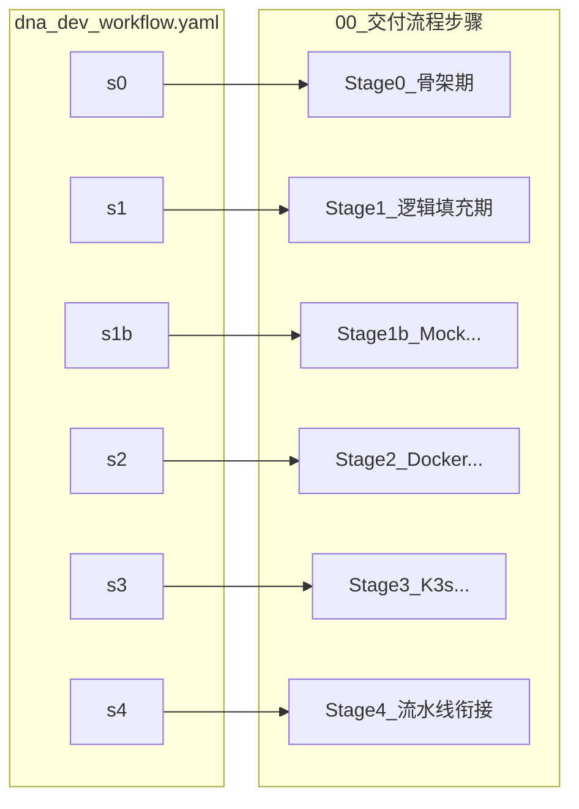

# L3 · 项目全功能开发、测试、实践工作流详细规划

> [!NOTE] **[TRACEBACK] 原子规约锚点**
> - **顶层概念**: [一句话定义与核心价值](../../01_顶层概念/01_一句话定义与核心价值.md)
> - **战略维度**: [01_开发与交付流程维度](../../02_战略维度/开发与交付/01_开发与交付流程维度.md)
> - **原子规约**: [01_开发生命周期与实践流程规约](01_开发生命周期与实践流程规约.md)、[02_基础设施与部署规约](02_基础设施与部署规约.md)
> - **对应 DNA**: [_System_DNA/dna_dev_workflow.yaml](../_System_DNA/dna_dev_workflow.yaml)
> - **本文档**: L3 层级，对 01/02 的可执行拆解与图示总览；细节以 01/02 为准

---

## 一、术语与 stage_id 速查

| stage_id | 阶段名称 | 对应 L4 阶段目录（规划） | 一句话目标 |
|----------|----------|--------------------------|------------|
| **s0_pre** | 仓库与 L3 就绪 | Stage0_pre_仓库与L3就绪 | 三仓目录与 Makefile 占位就绪 |
| **s0** | 本地骨架期 | Stage0_骨架期 | 目录、接口、占位可运行，本地单测可绿 |
| **s1** | 逻辑填充期 | Stage1_逻辑填充期 | 按 L3 与 5D 填充业务逻辑，单测+集成可绿 |
| **s1b** | Mock 数据验证准出 | Stage1b_Mock数据验证准出 | MockBroker/MockBrain 跑通核心路径，无真实券商/LLM |
| **s2** | Docker 统一环境期 | Stage2_Docker统一环境期 | 容器内完成开发与测试，make build/test-docker 通过 |
| **s3** | K3s 测试开发期 | Stage3_K3s测试开发期 | deploy-engine Up 成功，K3s 上跑通测试/开发 workload |
| **s4** | 与流水线衔接 | Stage4_与流水线衔接 | 满足 Level 1 入口，可进入 merge develop / tag 流程 |

---

## 二、阶段总览表

与 [01_开发生命周期与实践流程规约](01_开发生命周期与实践流程规约.md) 一致；本表为执行视角的汇总。

| 阶段 | stage_id | 名称 | 准入条件 | 准出条件 | 交付物 | 验证方式 |
|------|----------|------|----------|----------|--------|----------|
| 0a | s0_pre | 仓库与 L3 就绪 | L3 规约与 DNA 已定稿 | 三仓存在且目录与 global_const 一致；diting-core make test 占位通过 | diting-core、diting-infra 目录与占位 | 目录存在性、make test 占位 |
| 0 | s0 | 本地骨架期 | 项目具备 L3 规约与仓库结构 | 核心接口存在、本地单测通过、占位可运行 | 目录、接口、占位实现 | 单元测试（Table-Driven） |
| 1 | s1 | 逻辑填充期 | 阶段 0 准出 | 业务逻辑按 L3/5D 填充完毕，单测+集成通过 | Module A/B/D/E 等逻辑 | 单元测试 + 集成测试 |
| 1b | s1b | Mock 数据验证准出 | 阶段 1 核心链路可被 Mock 驱动 | Mock 路径跑通，无真实券商/LLM | 核心路径 Mock 验证通过 | 集成测试（Mock 驱动） |
| 2 | s2 | Docker 统一环境期 | 阶段 1 或 1b 准出 | make build、make test-docker 通过 | 镜像、容器内可测环境 | 容器内单测+集成 |
| 3 | s3 | K3s 测试开发期 | 阶段 2 准出 | deploy-engine Up 成功，Helm release 存在 | K3s 上测试/开发部署 | 集成 + E2E/仿真（可选） |
| 4 | s4 | 与流水线衔接 | 阶段 3 准出 | 满足 Level 1 入口，可进入 merge/tag | 满足流水线入口的代码/镜像 | 与 03 文档 Level 1 验收一致 |

---

## 三、每阶段建议步骤数与每步做什么

| 阶段 | 建议步骤数 | 每步概要（与 00_ 步骤或阶段目录内步骤对应） |
|------|------------|---------------------------------------------|
| s0_pre | 1 | 创建两仓目录与 Makefile/deploy.json 占位 |
| s0 | 1～2 | 步骤1：目录与接口骨架；步骤2：占位与单测（可合并为单步） |
| s1 | 1～N | 按模块或 Phase 拆：逻辑填充通用要求 + Phase1 功能步骤交错；可与 Phase 步骤合并表述 |
| s1b | 1 | Mock 环境与数据准备 + 核心路径跑通 + 验收 |
| s2 | 1～2 | 步骤1：Dockerfile 与 make build/test-docker；步骤2（可选）：docker-compose 多服务 |
| s3 | 1～2 | 步骤1：diting-infra 调用 deploy-engine Up；步骤2（可选）：Sealed-Secrets/网络策略验证 |
| s4 | 1 | 确认 Level 1 验收满足，文档化入口条件与流程 |

具体步骤文档位于 [04_阶段规划与实践/00_交付流程步骤/](../../04_阶段规划与实践/00_交付流程步骤/) 下各阶段目录内（见本文档第五节 DNA 与 L4 对应图）。

**DNA step_count 与 01_ 对应约定**：当 DNA `step_count > 1` 时，阶段目录内仍为单一 `01_本阶段实践与验证.md`，其中须用「步骤 1」「步骤 2」等子节（或有序列表）与 DNA 步骤数对应；不得因 step_count 拆成 02_、03_ 等多文件（除非未来协议明确允许）。

### 各阶段主要涉及的 5D 步骤（总览表）

逻辑密集步骤须在步骤文档中标明 5D 对应与测试锚定位置（见协议 §8.4a）。下表供阶段目录内步骤文档引用。

| 阶段 | stage_id | 主要涉及的 5D 步骤 | 说明 |
|------|----------|-------------------|------|
| s0 骨架期 | s0 | Design、Drive | 接口与占位设计；Table-Driven Tests 先红灯再绿 |
| s1 逻辑填充期 | s1 | Decompose、Drive、Defense | 原子函数实现；测试锚定；人工 Review 与单测/集成全绿 |
| s1b Mock 验证 | s1b | Drive、Defense | 集成测试（Mock）锚定；跑通后 Defense 确认 |
| s2 Docker 期 | s2 | Design、Decompose（可简化） | 环境与 make 目标设计；容器内测试执行 |
| s3 K3s 期 | s3 | Design、Decompose（可简化） | 编排与 Up 流程；可选 E2E 锚定 |
| s4 流水线衔接 | s4 | Defense | Level 1 验收表逐条确认 |

**Defense 与 L5 更新权责**：涉及 Defense 的阶段（s1、s1b、s4）须在对应 01_ 中标明：准出前须经**谁**（角色，如阶段负责人或架构师）Code Review 或勾选准出；**L5 更新由谁执行**（如阶段负责人或合并者）。准出检查清单末条「已更新 L5 02_验收标准 中本 stage 对应行」由该角色完成，未更新视为未准出。

### L4 阶段实践文档必备内容

L3 设计 L4 时，各阶段实践文档须包含以下四类要素（可合并为 1～2 个核心文档承载，见 00_系统规则 §8）：

1. **关键最佳实践目标**：本阶段应遵循的实践要点与约束。
2. **AI 实践最佳（性价比）推荐模型**：按用途（如设计/架构、代码生成、评审/Defense）给出推荐模型或档次及一句理由（成本/质量/性价比）；格式由协议 §8 统一。
3. **完整实践指令**：步骤目标、前置条件、实施内容、验收标准、工作目录、环境阶段。
4. **目标验证步骤及验证结果**：可执行的验证步骤与准出检查清单；验证结果以 L5 或阶段内最小独立文件记录，**不与指令同文件**（避免指令与可变状态混合）。

---

## 四、关键架构图

### 4.1 阶段与环境流转图

### 4.2 阶段–步骤–验证闭环图

每个 workflow_stage 对应 00_ 下的一个阶段目录；目录内包含：步骤 → 最佳实践目标 → 最小闭环验证 → 验证结果记录；准出时同步更新 L5。

### 4.3 DNA 与 L4 对应图

workflow_stages 各 stage 与 00_ 阶段目录一一对应；目录内为步骤、最佳实践目标、最小闭环验证、验证结果记录、准出检查清单。

---

## 五、工作目录总表

各阶段/步骤执行时的**工作目录**；步骤文档中可引用「见 [03_项目全功能开发测试实践工作流详细规划](03_项目全功能开发测试实践工作流详细规划.md) 工作目录总表」。

| 阶段 | stage_id | 主要工作目录 | 说明 |
|------|----------|--------------|------|
| 0a | s0_pre | 父路径（trinity_repos.parent_path_default） | 新建仓库的父路径；与 DNA workflow_stages[s0_pre].work_dir 一致 |
| s0 | 骨架期 | diting-core | 代码仓；设计产物见 02_三位一体仓库规约 |
| s1 | 逻辑填充期 | diting-core | 同上 |
| s1b | Mock 数据验证准出 | diting-core | 同上 |
| s2 | Docker 统一环境期 | diting-core；可选 diting-infra | 构建与测试在 diting-core；如需 compose 多服务可涉及 infra |
| s3 | K3s 测试开发期 | diting-infra、deploy-engine | 在 diting-infra 调用 deploy-engine 完成 Up |
| s4 | 与流水线衔接 | diting-core、diting-infra | 确认代码与镜像满足 Level 1；文档化入口 |

**deploy-engine 版本兼容性**：执行 K3s 阶段（s3）前，须确认 **deploy-engine 版本与 diting-infra 配置兼容**（见 [02_基础设施与部署规约](02_基础设施与部署规约.md)、DNA 或 diting-infra README）。

---

## 六、最小单位逻辑闭环的统一定义

**定义**：**最小单位逻辑闭环** = 具备完整「输入 → 处理 → 输出」、且可被**单次测试**或**单次运行**验证的最小功能单元。

- **用途**：与 5D、测试锚定对齐；各阶段在文档中显式列出本阶段的 1～N 个闭环点，便于验收与「最小闭环验证」文档一致。

**各阶段闭环点示例**（可与阶段目录内「最小闭环验证」对应）：

| 阶段 | 闭环点示例 |
|------|------------|
| s0 骨架期 | 接口导入 + 占位实现调用；单测用例通过 |
| s1 逻辑填充期 | A→B→D 一条最小路径；单测 + 集成用例通过 |
| s1b Mock 验证 | MockBroker/MockBrain 下核心路径端到端一次跑通 |
| s2 Docker 期 | 单次 make build + make test-docker 通过 |
| s3 K3s 期 | 单次 deploy-engine Up 成功，Helm release 存在 |
| s4 流水线衔接 | Level 1 验收表逐条满足 |

---

## 七、双轨执行顺序（00_ 阶段步骤 与 Phase 功能步骤）

执行时**推荐顺序**为线性交错，避免只做一条线导致环境未就绪或功能未对齐。

| 顺序 | 类型 | 步骤 / 动作 | 说明 |
|------|------|-------------|------|
| 1 | 00_ | Stage0 骨架期 步骤 | 先完成环境阶段 0 |
| 2 | 00_ | Stage1 逻辑填充期 步骤 | 环境阶段 1 |
| 3 | Phase | Phase1 功能步骤（按需） | 与 Stage1 交错：功能步骤依赖 Stage1 准入 |
| 4 | 00_ | Stage1b Mock 数据验证准出 | 环境阶段 1b |
| 5 | 00_ | Stage2 Docker 统一环境期 | 环境阶段 2 |
| 6 | 00_ | Stage3 K3s 测试开发期 | 环境阶段 3 |
| 7 | 00_ | Stage4 与流水线衔接 | 环境阶段 4 |

阶段目录与 Phase 步骤的**对应关系**：Stage0/1/1b 对应 Phase0-Infra、Phase1 功能；Stage2/3/4 对应 Phase1 后期与 Phase2。各阶段目录 README 中应列出「本阶段关联的 Phase 步骤」链接（见 [04_阶段规划与实践/README](../../04_阶段规划与实践/README.md)）。

---

## 八、失败与回退策略

- **单步失败**：可重试有限次（建议 N≤3）；仍失败则回退到本阶段第一步或上一阶段最后一步，修复后再推进。
- **阶段准出失败**：建议回退到**上一阶段最后一步**或**本阶段第一步**，满足准入后再执行。
- **K3s 测试开发期（s3）回滚**：按 [01_开发生命周期与实践流程规约](01_开发生命周期与实践流程规约.md) 约定，由开发者本地决定（如重新部署上一镜像、重新执行 deploy-engine）；不要求自动回滚或 2FA。
- **其他**：以 01 规约与 [03_架构设计共识与协作元规则](../03_架构设计共识与协作元规则.md) 为准。

**回退检查点定义**（各 01_「本步骤失败时」统一引用本定义）：
- **上一阶段最后一步** = 上一 stage 的**准出检查清单已全部勾选**且 **L5 [02_验收标准](../../05_成功标识与验证/02_验收标准.md) 中该 stage 对应行已更新为已通过**。
- **回退后**：须重新执行**上一 stage 的可执行验证清单**并再次准出，再进入当前 stage。

### 自动反馈修正分级

验证失败时的「自动反馈修正」按以下分级执行；各 01_「本步骤失败时」须引用本约定。

| 级别 | 含义 | 动作 |
|------|------|------|
| **Level 1**（当前默认） | 失败 → 输出失败项与建议动作 + 回退/重试 | 须输出**失败项**（未通过的命令/检查点）及**建议修正动作**（如 make test 失败 → 运行单测或等价命令定位失败用例）；执行者根据输出人工修复后重试或回退。 |
| **Level 2**（可选） | CI 失败时附带 01_ 步骤链接 | CI 或脚本执行验证失败时，失败报告须附带本阶段 01_ 对应步骤的文档链接，便于定位。 |
| **Level 3**（可选远期） | 自动生成补丁或 PR | 由工具/AI 根据失败项尝试生成修复补丁或 PR；需与项目 CI 与权限约定结合，非强制。 |

---

## 九、首次执行 vs 迭代执行

- **首次执行**：从零到可交付，按顺序执行 **Stage0 → Stage1 → Stage1b → Stage2 → Stage3 → Stage4**；每阶段准出后再进入下一阶段。
- **迭代 / 修复**：可**单独重跑某阶段**，须满足该阶段**准入条件**（如重跑 Stage2 须阶段 1 或 1b 已准出）。依赖上一阶段产物时，须确保已存在（如 Stage2 依赖 Stage1 的某分支/某提交；Stage3 依赖 Stage2 的镜像与 diting-infra 配置）。在 [03_项目全功能开发测试实践工作流详细规划](03_项目全功能开发测试实践工作流详细规划.md) 或阶段目录 README 中可注明「依赖上一阶段产物清单」。

---

## 十、引用与合规

- **引用**：[01_开发生命周期与实践流程规约](01_开发生命周期与实践流程规约.md)、[02_基础设施与部署规约](02_基础设施与部署规约.md)、[_System_DNA/dna_dev_workflow.yaml](../_System_DNA/dna_dev_workflow.yaml)、[04_阶段规划与实践/00_交付流程步骤/](../../04_阶段规划与实践/00_交付流程步骤/)。
- **合规**：本总览不替代 01/02，仅汇总与图示；L4 步骤与阶段目录须符合 01 规约并引用本文档或 01/02 对应小节。

---

## 下一步

→ 按 [04_阶段规划与实践/README](../../04_阶段规划与实践/README.md) 执行顺序与 [00_交付流程步骤](../../04_阶段规划与实践/00_交付流程步骤/) 执行；阶段目录重构后以各 StageX_xxx/ 目录内步骤与验证文档为准。
