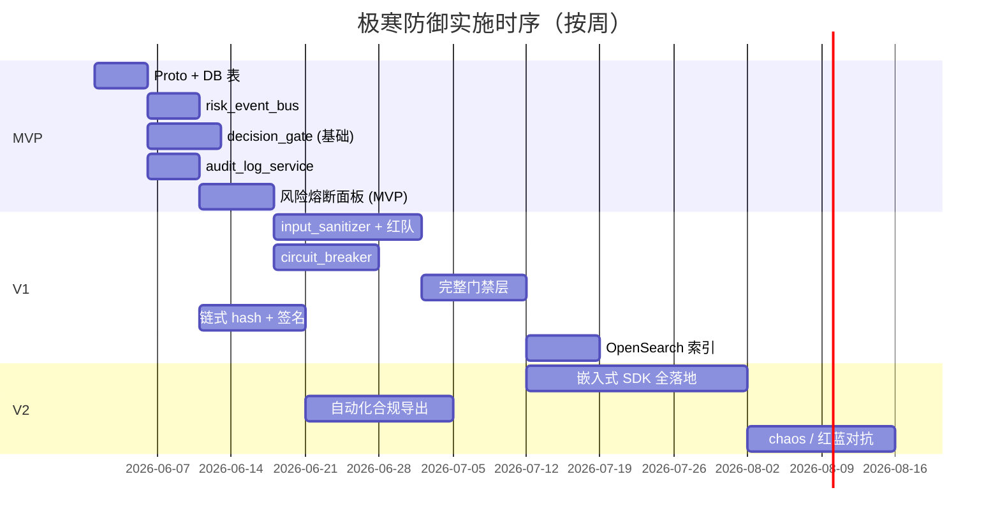

# L3 · 极寒防御 · 实施推演设计

> [!NOTE] **[TRACEBACK]**
> - **同模块**：[01](./01_目标与边界_设计.md)、[02](./02_后端服务子模块_设计.md)、[03](./03_接口契约_设计.md)、[04](./04_数据契约_设计.md)
> - **L4 计划目录**：`04_阶段规划与实践/极寒防御/`（第 3 批）

## 一、演进路径总览

| 版本 | 关键能力 | 完成判定 |
|------|---------|---------|
| **MVP** | 风险事件总线 + 决策门禁器最小可用 + 审计日志（无链式 hash） | 任意模块可写风险事件并被前端检索；门禁能拒绝缺证据的请求 |
| **V1** | 完整 5 子模块；动态配置中心接入；链式 hash + 签名快照 | 全 5 子模块对接 + 红队对抗 ≥ 50 用例通过 + 审计链可校验 |
| **V2** | 嵌入式 SDK 在所有微服务落地；自动化合规导出；多租户隔离 | 全部出站对象 100% 经决策门禁；合规导出周期 ≤ 1 周 |

## 二、MVP（最小可用产品）

### 范围
- `risk_event_bus`：HTTP 入口 + PG 持久化 + 简单 WebSocket 推送
- `decision_gate`：仅 schema + evidence 两层门禁；规则硬编码
- `audit_log_service`：写 PG，无链式 hash、无签名

### 关键步骤

| # | 步骤 | 工作目录 | 准出 |
|---|------|---------|------|
| MVP-1 | Proto 定义（v1 仅 RiskEvent + GateRequest/Decision + AuditEntry） | `diting-src/design/protocols/cryo_guard/` | proto compile 通过；生成 Python/Go 代码 |
| MVP-2 | 数据库表（risk_events / gate_decisions / audit_logs）+ 迁移脚本 | `diting-src/diting/cryo_guard/migrations/` | `make migrate` 通过；表存在 |
| MVP-3 | `risk_event_bus` HTTP 服务 | `diting-src/diting/cryo_guard/risk_event_bus/` | 单元测试通过；可写可读；WebSocket 推送可订阅 |
| MVP-4 | `decision_gate` 服务（仅 schema + evidence 层） | `diting-src/diting/cryo_guard/decision_gate/` | 单元测试通过；缺证据请求被拒绝 |
| MVP-5 | `audit_log_service` 服务 | `diting-src/diting/cryo_guard/audit_log/` | 单元测试通过；任何 GateDecision 都生成 AuditEntry |
| MVP-6 | 前端"风险熔断面板" MVP（只读，看事件流） | `diting-src/web/cryo_dashboard/` 或独立前端仓 | 浏览器可看到实时事件；可按 severity 过滤 |

### MVP 验收
- 一条任意 module 的 `RiskEvent` 可在前端 < 2s 内可见
- 一条 `GateRequest`（缺 evidence_ref）会被 reject 且生成审计记录
- 全部单元测试 + 集成测试通过；覆盖率 ≥ 70%

## 三、V1（完整能力）

### 在 MVP 基础上新增

| 子能力 | 说明 |
|--------|------|
| compliance / metric / sanitize / breaker / human 五层门禁 | 全部上线；规则迁移到动态配置中心 |
| `circuit_breaker` 完整实现 | 嵌入式 SDK + 中心协调；状态迁移规则可热配置 |
| `input_sanitizer` 完整检测器 | 7 类污染检测；红队用例集 ≥ 50 |
| 链式 hash + 签名快照 | 审计日志真正不可篡改；定期校验任务 |
| 动态配置中心接入 | 所有规则 / 阈值热更新；变更走 ADR |
| OpenSearch 索引 | 风险事件 / 门禁 / 审计的检索性能 < 1s |

### 关键步骤

| # | 步骤 | 工作目录 | 准出 |
|---|------|---------|------|
| V1-1 | 7 类输入污染检测器 + 红队用例集 | `diting-src/diting/cryo_guard/input_sanitizer/` | 全部用例通过；FPR ≤ 5% / FNR ≤ 1% |
| V1-2 | `circuit_breaker` 嵌入式 SDK + 中心协调 | `diting-src/diting/cryo_guard/breaker_sdk/` + `diting-src/diting/cryo_guard/breaker_coordinator/` | 错误注入测试：服务故障 → 60s 内熔断 |
| V1-3 | compliance / metric / human 三层门禁 | `diting-src/diting/cryo_guard/decision_gate/layers/` | 全部层规则上线；端到端测试覆盖 |
| V1-4 | 链式 hash + 签名快照 + 校验任务 | `diting-src/diting/cryo_guard/audit_log/integrity/` | 链完整性测试通过；签名快照定期生成 |
| V1-5 | OpenSearch 索引接入 | `diting-src/diting/cryo_guard/indexer/` | 风险事件 / 审计可按多字段检索；P99 < 1s |
| V1-6 | 动态配置中心接入 | `diting-src/diting/cryo_guard/config/` | 规则热更新 < 30s 生效 |

## 四、V2（生产稳态）

| 子能力 | 说明 |
|--------|------|
| 嵌入式 SDK 全微服务落地 | 100% 出站对象走 decision_gate；旁路监测 ≥ 99.9% |
| 自动化合规导出 | 按周 / 月 / 季 自动导出审计 + 风险事件，加密上传到合规存储 |
| 多租户隔离 | 不同业务线 / 不同环境的规则、审计独立 |
| 红蓝对抗 + chaos engineering | 定期注入故障；恢复 SLA 校验 |
| 高级审计可视化 | 决策链可视化；按 correlation_id 串联整条业务流 |

## 五、依赖时序

## 六、与其它模块的依赖关系

| 依赖模块 | 形态 | 时序 |
|---------|------|------|
| 共享平台基础（[06_动态配置中心](../_共享规约/06_动态配置中心规约.md)） | 必须先就绪 | V1 前必须可用 |
| 共享平台基础（[08_心跳协议](../_共享规约/08_心跳协议与健康检查规约.md)） | 必须先就绪 | V1 前必须可用 |
| [纵深进攻](../纵深进攻/README.md) | 双向：DS 调用门禁、门禁调用 sanitizer 检查 DS 上下文 | MVP 阶段 DS 可不接入；V1 必须接入 |
| [状态机监控](../状态机监控/README.md) | 通知派发须经门禁 | V1 时接入 |
| [超级个体进化](../超级个体进化/README.md) | 外部动作须经门禁；风险事件流入评测 | MVP 完成后即可联动 |
| [前端工程与服务](../前端工程与服务/README.md) | 风险熔断面板 + 监控驾驶舱 | MVP 已含前端 MVP |

## 七、风险与回退

| 风险 | 影响 | 缓解 |
|------|------|------|
| 门禁延迟成为瓶颈 | 业务链路 RT 增加 | 异步并行评估 + 短路（任一 reject 立即返回） |
| 规则误杀（FPR 高） | 业务被频繁阻塞 | 灰度上线 + 规则版本回滚 + 人审兜底 |
| 审计存储爆增 | 成本不可控 | 分级保留 + OSS 冷归档 + 关键字段索引 |
| 嵌入式 SDK 不一致 | 部分服务绕过门禁 | CI 强制依赖 SDK 版本；运行时上报 SDK 版本 |
| 红队对抗用例不足 | 真实污染漏检 | 持续从风险事件流采样、人工标注、回灌用例集 |

## 八、L4 实践目录预告（第 3 批）

`04_阶段规划与实践/极寒防御/` 下：
- `01_MVP_最小可用_实践.md`
- `02_V1_完整能力_实践.md`
- `03_V2_生产稳态_实践.md`
- `04_红蓝对抗与混沌工程_实践.md`

## 九、L5 验收锚点预告（第 3 批）

| 锚点 | 对应里程碑 |
|------|-----------|
| `l5-pillar-cryo-mvp` | MVP 准出 |
| `l5-pillar-cryo-v1` | V1 准出 |
| `l5-pillar-cryo-v2` | V2 准出 |
