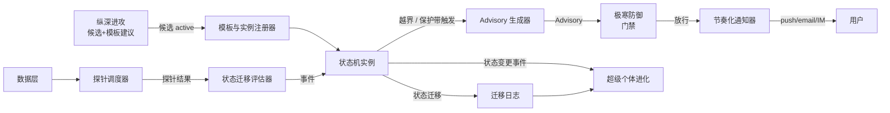

# L3 · 状态机监控 · 目标与边界设计

> [!NOTE] **[TRACEBACK]**
> - **顶层概念**：[项目定义与核心价值](../../01_顶层概念/01_项目定义与核心价值.md)
> - **战略主轴**：[L2 §状态机监控](../../02_战略维度/00_双目标与战略维度关系.md)
> - **同模块**：[状态机监控/README](./README.md)
> - **总纲**：[四大模块抽象总纲 §3.3](../00_四大模块抽象总纲.md#33-状态机监控state-machine-watch)
> - **DNA**：`_System_DNA/state_watch/`、`global_const.state_watch`

## 一、目标

承接 L1 §"复杂自适应系统视角"——把每个标的 / 主营 / 议题视为**有寿命的状态机实例**，做到：

1. **状态可见**：每个对象当前处于哪个状态、待越何门、下一动作是什么，全部显式
2. **变化可知**：状态迁移、关键阈值越界、保护带触发，必须秒级感知并通知
3. **节奏可控**：探针频率、采样代价、通知频率按用户与对象类型自适应
4. **建议可解释**：调仓 / 退出建议必须有触发条件、阈值、证据、回退路径

## 二、本模块的"做"与"不做"

### 做什么

| 能力 | 说明 |
|------|------|
| 状态机模板与实例 | 定义模板（节点、迁移条件、保护带）；实例化、生命周期管理 |
| 探针调度 | 多源探针（行情、文本、衍生）按节奏抓取；自适应频率 |
| 状态迁移评估 | 接收探针 → 评估迁移条件 → 触发迁移 → 写日志 |
| 保护带与阈值越界 | 多重保护（硬阈值 / 软阈值 / 趋势）；越界触发动作 |
| 调仓 / 退出建议 | 当状态进入"退出态"或"调仓态"时，产出 `Advisory` |
| 关注列表分组 | 按用户 / 主营 / 行业 / 节奏 / 风险 分组 |
| 节奏化通知 | 推送 / 邮件 / IM；按"通知预算"控频 |

### 不做什么

| 能力 | 归属 | 原因 |
|------|------|------|
| 产生研究结论 / 议会推理 | [纵深进攻](../纵深进攻/README.md) | 状态机不解释市场，只观察与执行规则 |
| 决策门禁 | [极寒防御](../极寒防御/README.md) | `Advisory` 必经门禁才能对外通知 |
| 知识沉淀 / 模型再训练 | [超级个体进化](../超级个体进化/README.md) | 状态机产出供进化模块吸收，不自己沉淀 |
| 直接执行外部动作（下单 / 交易） | [超级个体进化 § external_action_boundary](../超级个体进化/README.md) | 状态机仅产出建议；执行由进化模块做 |
| 数据采集 | 数据层（[11_数据采集](../_共享规约/11_数据采集与输入层规约.md)） | 探针只读取数据层，不直接抓取外部源 |

## 三、与其它模块的接口边界

### 输入契约

| 输入 | 数据类型 | 来源 |
|------|---------|------|
| 候选 active 通知 | `CandidateActivated` | [纵深进攻 § candidate_registry](../纵深进攻/02_后端服务子模块_设计.md) |
| 探针数据（行情 / 文本 / 衍生） | `ProbeResult` | 数据层 |
| 用户分组 / 关注列表操作 | `WatchListOp` | [前端 § 关注列表中心](../前端工程与服务/README.md) |
| 模板 / 阈值更新 | 通过 [06_动态配置中心](../_共享规约/06_动态配置中心规约.md) | 配置中心 |

### 输出契约

| 输出 | 数据类型 | 消费方 |
|------|---------|--------|
| 状态迁移事件 | `TransitionEvent` | 极寒防御（门禁）+ 超级个体进化（评测）+ 前端 |
| 调仓 / 退出建议 | `Advisory { kind, subject, action, conditions, evidence, fallback }` | 极寒防御 → 用户 |
| 越界事件 | `BoundaryBreach { subject, threshold, value, severity }` | 超级个体进化 + 前端（弹窗） |
| 探针调度日志 | `ProbeAuditLog` | 超级个体进化（成本 / 节奏分析） |

## 四、模块准出标准

| 验收项 | 验收方式 |
|--------|---------|
| 关键状态迁移到通知用户 < 5s | 端到端延迟监测 |
| 模板可热更新 | 通过动态配置中心更新模板 → 30s 内所有实例生效 |
| 通知频率不爆 | 单用户单日通知数 ≤ 配置上限；超出走"摘要式" |
| 自适应探针 | 高活跃对象探针频率自动提高，低活跃自动降低 |
| 状态迁移可回放 | 任意 `TransitionEvent.id` 可还原触发条件 + 探针结果 |
| Advisory 100% 含触发条件 + 回退 | 每条 Advisory 必填 `conditions / fallback` |

## 五、关键设计取舍

1. **模板与实例分离**：模板可热更新；实例继承模板版本但独立维护当前状态（避免模板变更时实例错乱）
2. **探针调度去中心化**：每实例可被多个探针订阅；探针只负责抓取，不参与迁移评估
3. **迁移评估单点权威**：状态机实例自身决定迁移；外部不能跨过实例直接改状态
4. **保护带分层**：硬阈值（数字）+ 软阈值（趋势）+ 复合保护带（多条件）
5. **Advisory 必带回退**：任何调仓建议都必须给出"如果用户不执行会怎样"
6. **通知预算**：每个用户有"日通知预算"；超出后通知合并为"摘要"

## 六、与共享规约的对齐

| 共享规约 | 对齐点 |
|---------|--------|
| [04_全链路通信协议](../_共享规约/04_全链路通信协议矩阵.md) | TransitionEvent / Advisory / BoundaryBreach 必带 `correlation_id` |
| [05_接口抽象层](../_共享规约/05_接口抽象层规约.md) | Data Source Port（探针读数据） |
| [06_动态配置中心](../_共享规约/06_动态配置中心规约.md) | 模板 / 阈值 / 探针节奏热更新 |
| [10_运营治理与灾备](../_共享规约/10_运营治理与灾备规约.md) | 通知频率治理 / DR |
| [11_数据采集与输入层](../_共享规约/11_数据采集与输入层规约.md) | 探针消费的数据源契约 |
