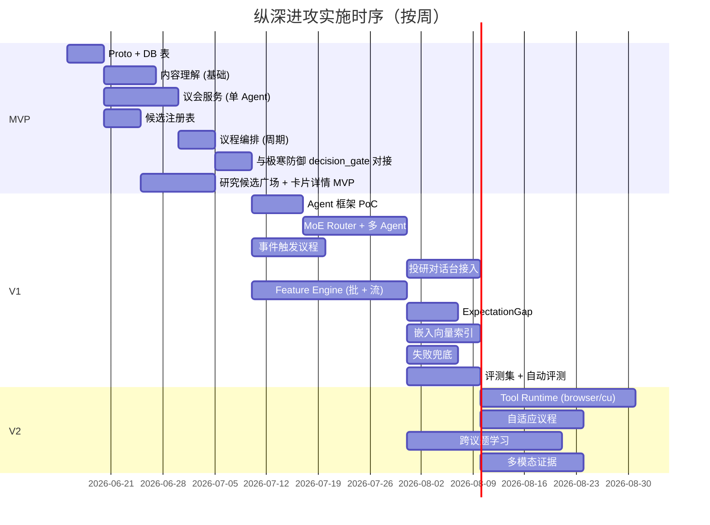

# L3 · 纵深进攻 · 实施推演设计

> [!NOTE] **[TRACEBACK]**
> - **同模块**：[01](./01_目标与边界_设计.md)、[02](./02_后端服务子模块_设计.md)、[03](./03_接口契约_设计.md)、[04](./04_数据契约_设计.md)
> - **L4 计划目录**：`04_阶段规划与实践/纵深进攻/`（第 3 批）

## 一、演进路径总览

| 版本 | 关键能力 | 完成判定 |
|------|---------|---------|
| **MVP** | 议会服务最小可用（单 Agent + 1~2 工具）；候选注册表；议程编排（仅周期性）；最小内容理解 | 周期议程可触发议会输出研究卡片；卡片可被极寒防御门禁通过 |
| **V1** | 多 Agent 协作 + MoE Router；事件触发 + 用户实时议题；完整内容理解 + 主营对齐；Feature Store；预期差量化 | 7×24 周期议程稳定；用户议题平均响应 < 30s；评测集结果可衡量 |
| **V2** | 工具调用 runtime（browser/computer-use）；自适应议程；跨议题学习；多模态证据 | 高级工具调用稳定；议程自动重排；证据链含表格 / 图像 |

## 二、MVP（最小可用产品）

### 范围
- `research_council_service`：单 Agent + 检索工具 + 推理网关
- `candidate_registry`：表 + 基础 CRUD API
- `agenda_orchestrator`：仅周期性议程（cron 触发）
- `content_comprehension_service`：基础实体抽取 + 主营对齐（规则 + 简单 LLM）
- 不含 `signal_feature_engine`（议会直接读 L2）
- 不含 `expectation_gap_quantifier`

### 关键步骤

| # | 步骤 | 工作目录 | 准出 |
|---|------|---------|------|
| MVP-1 | Proto v1（ResearchCard / Candidate / CouncilSession / AgendaTopic / ToolCall） | `diting-src/design/protocols/deep_strike/` | proto compile 通过 |
| MVP-2 | DB 表（research_cards / candidates / council_sessions / agenda_topics / tool_calls / 内容理解派生表） | `diting-src/diting/deep_strike/migrations/` | `make migrate` 通过 |
| MVP-3 | `content_comprehension_service` 基础版 | `diting-src/diting/deep_strike/comprehension/` | 单元测试通过；可处理 ≥ 100 篇公告样本 |
| MVP-4 | `research_council_service` 单 Agent + 检索 + 推理网关 | `diting-src/diting/deep_strike/council/` | 端到端：拉一条议题 → 输出 ResearchCard + Session |
| MVP-5 | `candidate_registry` | `diting-src/diting/deep_strike/candidate_registry/` | API 测试通过；候选 CRUD + 状态流转 |
| MVP-6 | `agenda_orchestrator` 周期性版 | `diting-src/diting/deep_strike/agenda/` | cron 定时触发议会 |
| MVP-7 | 与极寒防御 `decision_gate` 对接 | 联调 | 候选 / 卡片必经门禁；缺证据被拒 |
| MVP-8 | 前端"研究候选广场" + "研究卡片详情" MVP | `diting-src/web/research_dashboard/` | 浏览器可看到周期性产出的候选与卡片 |

### MVP 验收
- 周期议程稳定触发（每日 ≥ 1 议题）
- 议会输出的卡片 100% 含证据链且能被极寒防御放行
- Session transcript 可被回放
- 单元测试 + 集成测试覆盖率 ≥ 70%

## 三、V1（完整能力）

### 在 MVP 基础上新增

| 子能力 | 说明 |
|--------|------|
| 多 Agent 协作 + MoE Router | LangGraph / 自建编排；按议题路由专家；投票 + 共识聚合 |
| 事件触发议程 | 数据层关键事件 → 议程编排器 |
| 用户实时议题 | 投研对话台 → 议程 → 议会 |
| `signal_feature_engine` | 批 + 流双管道；接入 Feature Store |
| `expectation_gap_quantifier` | 与市场共识对比 + 动量折现 |
| 完整内容理解 | 事件分类 / 时间线 / 跨源关联 |
| 嵌入向量索引 | RAG 检索精度提升 |
| 失败兜底完整 | 推理网关熔断时规则路径覆盖率 ≥ 95% |
| 评测集自动跑 | 每周自动跑评测 → 报告超级个体进化 |

### 关键步骤

| # | 步骤 | 工作目录 | 准出 |
|---|------|---------|------|
| V1-1 | Agent 框架选型与 PoC | `diting-src/diting/deep_strike/council/agents/` | LangGraph PoC 跑通；性能基准建立 |
| V1-2 | MoE Router + 多 Agent 协作 | 同上 | 端到端：3 Agent 投票 → 共识 |
| V1-3 | 事件触发议程 | `diting-src/diting/deep_strike/agenda/triggers/` | 重大事件 → 议程 → 议会 流程通 |
| V1-4 | 投研对话台 → 议程 接入 | 同上 + `diting-src/web/research_chat/` | 用户提问 < 30s 出结论 |
| V1-5 | `signal_feature_engine` 批管道 | `diting-src/diting/deep_strike/feature_engine/batch/` | 每日批跑成功；Feature Store 写入 |
| V1-6 | `signal_feature_engine` 流管道 | `diting-src/diting/deep_strike/feature_engine/stream/` | 实时事件 → 流特征写入 |
| V1-7 | `expectation_gap_quantifier` | `diting-src/diting/deep_strike/expectation_gap/` | gap_score 可计算 |
| V1-8 | 嵌入向量索引（Milvus / pgvector） | `diting-src/diting/deep_strike/embedding/` | RAG 检索 P99 < 500ms |
| V1-9 | 失败兜底规则路径 | `diting-src/diting/deep_strike/fallback/` | 推理熔断时 ≥ 95% 议题仍能输出 |
| V1-10 | 评测集 + 自动评测任务 | `diting-src/diting/deep_strike/eval/` | 每周自动跑；报告写入超级个体进化 |

## 四、V2（生产稳态）

| 子能力 | 说明 |
|--------|------|
| Tool Runtime（browser / computer-use） | 通过 [05_接口抽象层 §Runtime Sandbox](../_共享规约/05_接口抽象层规约.md) 接入；安全隔离 + 资源限制 |
| 自适应议程 | 根据评测反馈自动调整议题优先级与频率 |
| 跨议题学习 | 议会能跨多议题"记住"与"对比"先前结论 |
| 多模态证据 | 表格 / 图像 / 视频片段嵌入证据链 |
| Session 长连接恢复 | 浏览器刷新 / 断网后可恢复进行中议会 |
| 议会输出可灰度 / 可 A/B | 不同 Agent 配置 / 模型版本 / 提示模板灰度 |

## 五、依赖时序

## 六、依赖关系

| 依赖模块 | 形态 | 时序 |
|---------|------|------|
| 共享平台基础（数据层 / 推理网关 / 配置中心） | 必须先就绪 | MVP 前 |
| [极寒防御](../极寒防御/README.md) `decision_gate` | 候选 / 卡片须经门禁 | MVP-7 时接入；V1 时 sanitize 接入 |
| [状态机监控](../状态机监控/README.md) | 候选附带状态机模板，候选 active 后 SW 拉起实例 | MVP 时即可联动（粗粒度） |
| [超级个体进化](../超级个体进化/README.md) | 知识库 RAG / 评测集 / 模型版本 | V1-9 评测、V1-8 RAG 时 |
| [前端工程与服务](../前端工程与服务/README.md) | 研究候选广场 / 卡片详情 / 投研对话台 | MVP-8 起，全程 |

## 七、风险与回退

| 风险 | 影响 | 缓解 |
|------|------|------|
| 议会成本失控（Token） | 成本爆炸 | 极寒防御 `metric` 层强制成本门禁；议会内 token budget |
| 议会输出质量不稳定 | 用户信任崩溃 | 评测集 + 灰度 + 人审兜底 |
| 工具调用不稳定 | 议会失败率高 | 失败兜底规则路径 + 工具熔断 |
| 嵌入模型变更导致索引重建慢 | 检索质量短期下降 | 双索引并行 + 渐进切换 |
| 内容理解漏检主营变更 | 决策依据过时 | 主营变更监控 + 强制人审 |

## 八、L4 实践目录预告（第 3 批）

`04_阶段规划与实践/纵深进攻/` 下：
- `01_MVP_单Agent议会_实践.md`
- `02_V1_多Agent协作_实践.md`
- `03_V1_FeatureEngine与ExpectationGap_实践.md`
- `04_V1_失败兜底与评测_实践.md`
- `05_V2_Tool_Runtime与自适应_实践.md`

## 九、L5 验收锚点预告（第 3 批）

| 锚点 | 对应里程碑 |
|------|-----------|
| `l5-pillar-deep-mvp` | MVP 准出 |
| `l5-pillar-deep-v1-council` | V1 多 Agent 准出 |
| `l5-pillar-deep-v1-feature` | V1 Feature Engine 准出 |
| `l5-pillar-deep-v1-eval` | V1 评测准出 |
| `l5-pillar-deep-v2-runtime` | V2 Tool Runtime 准出 |
