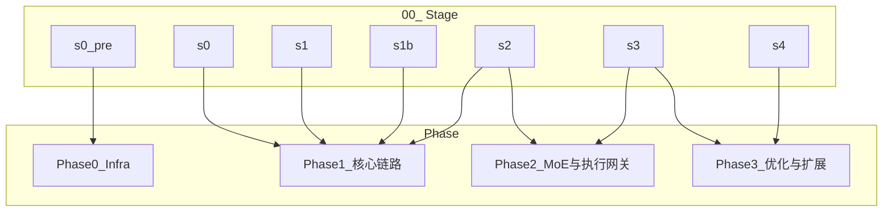

# 00_交付流程步骤 · 说明

> **从零到第一次准出**：见 [04_/00_从零到第一次准出.md](../00_从零到第一次准出.md)，按阅读顺序与 Stage 列表自检准出。

> [!NOTE] **[TRACEBACK] 阶段实践锚点**
> - **顶层概念**: [一句话定义与核心价值](../../01_顶层概念/01_一句话定义与核心价值.md)
> - **战略维度**: [01_开发与交付流程维度](../../02_战略维度/开发与交付/01_开发与交付流程维度.md)
> - **原子规约**: [01_开发生命周期与实践流程规约](../../03_原子目标与规约/开发与交付/01_开发生命周期与实践流程规约.md)
> - **本文档**: L4 交付流程线，与 01 规约阶段 0～4 一一对应

## 目录定位

本目录为 **开发与交付** 维度的 L4 落地：将 [01_开发生命周期与实践流程规约](../../03_原子目标与规约/开发与交付/01_开发生命周期与实践流程规约.md) 的六个环境阶段（含 1b）拆解为可执行步骤；**每阶段一个目录**，与 [dna_dev_workflow.yaml](../../03_原子目标与规约/_System_DNA/dna_dev_workflow.yaml) 中 `workflow_stages` 的 `l4_stage_dir` 一一对应。每阶段目录内为 **2 个核心文档**：`README.md`（含最佳实践目标与 AI 推荐模型）、`01_本阶段实践与验证.md`（含实践指令与验证与准出）；验证结果按上「验证结果与 L5 同步约定」直接更新 L5，不保留阶段内可填表。

- **Stage0_pre_仓库与L3就绪** ↔ 执行顺序 **第 0 步**（仓库与 L3 就绪；满足 Stage0 准入）
- **Stage0_骨架期** ↔ 01 规约 **阶段 0**（本地骨架期）
- **Stage1_逻辑填充期** ↔ 01 规约 **阶段 1**（逻辑填充期）
- **Stage1b_Mock数据验证准出** ↔ 01 规约 **阶段 1b**（Mock 数据验证准出）
- **Stage2_Docker统一环境期** ↔ 01 规约 **阶段 2**（Docker 统一环境期）
- **Stage3_K3s测试开发期** ↔ 01 规约 **阶段 3**（K3s 测试开发期）
- **Stage4_与流水线衔接** ↔ 01 规约 **阶段 4**（与发布流水线衔接）

本目录只写 **环境与流程**（如何建骨架、何时引入 Docker/K3s、如何满足流水线入口），**不写具体功能或模块**（做哪些 Module 归属 [01_需求与产品范围](../../03_原子目标与规约/产品设计/01_需求与产品范围.md) 与各 Phase 功能步骤）。

各 Phase（Phase1_xxx、Phase2_xxx 等）可将本目录中的阶段作为 **前置条件** 引用，例如「本 Phase 依赖 00_交付流程步骤/Stage0_骨架期 完成」。

### 全生命周期与 Stage 映射

| 生命周期阶段 | 对应 Stage / 文档 | 说明 |
|--------------|------------------|------|
| **意图定义** | s0_pre 准入 + L3/DNA 定稿 + [01_需求与产品范围](../../03_原子目标与规约/产品设计/01_需求与产品范围.md)（product_scope） | 战略与产品范围、规约与 DNA 已定稿 |
| **实现与验证** | s0～s2（骨架期、逻辑填充、Mock 验证、Docker 统一环境） | 代码骨架到容器内可测 |
| **部署与发布** | s3～s4（K3s 测试开发、与流水线衔接） | 编排、Secret、Level 1 入口 |
| **自治运维** | s4 准出后 | 由 [03_架构设计共识](../../03_原子目标与规约/03_架构设计共识与协作元规则.md) Level 2/3 流水线 + [10_运营治理与灾备规约](../../03_原子目标与规约/10_运营治理与灾备规约.md) 运营/可观测性 共同满足；准出后移交运维制品见 Stage4 01_「准出后移交运维」 |

## Phase–Stage 双向约定

- **Phase 文档**：须在开头或元数据中声明**依赖的 Stage**（stage_id + 链接，如「依赖 Stage0_骨架期」并链至本目录下对应阶段）。
- **Stage README**：须含「本阶段关联的 Phase 步骤」列表；Phase 创建后由**负责人或 AI 回填**该列表中的链接。
- **回填责任与时机**：Phase 合并或定稿时，须更新对应 Stage 的 README「本阶段关联的 Phase 步骤」，避免长期占位或断链。**Phase 合并或定稿后 5 个工作日内**须回填对应 Stage README 的「本阶段关联的 Phase 步骤」；**审计或发布前**须检查该列表无占位未替换（见 [06_追溯与审计/03_审计与一致性报告](../../06_追溯与审计/03_审计与一致性报告/README.md) 人工校验清单项 5）。

## 00_ 与 Phase 执行顺序约定

每个 stage 内：**先完成本 Stage 的 01_ 中「验证与准出」的可执行验证表与准出检查清单并准出**，再执行该 stage 关联的 Phase 步骤（若有）；若该 stage 关联多个 Phase 步骤，按 Phase 目录内 01_、02_… 顺序执行。执行顺序以本 README 推荐顺序表为准，Phase 为产品/需求视角别名。

## 按角色阅读与使用路径

| 角色 | 阅读与使用方式 |
|------|----------------|
| **人类执行者** | 先读阶段 **README**（目标、最佳实践、AI 推荐）→ 再按 **01_本阶段实践与验证.md** 清单执行。 |
| **AI 执行者** | 优先喂 **01_** + 本阶段 DNA 键 + 「验证与准出」表；README 作为策略与选型补充。 |
| **脚本** | 从 01_ 的「验证与准出」一节解析验证命令与工作目录。 |

## 第一次执行顺序（Stage + Phase 混合）

**第一次执行**时按下列混合顺序进行：先完成各 Stage 前置，再在该 Stage 内按对应 Phase 的 01_→02_→… 完成功能步骤，最后勾选本 Stage 准出。

| 顺序 | 步骤 | 说明 |
|------|------|------|
| 0 | **s0_pre** | 完成 [Stage0_pre](Stage0_pre_仓库与L3就绪/README.md) 与 [Phase0_Infra](../Phase0_Infra/) 01_（三位一体仓库初始化），满足 Stage0 准入 |
| 1 | **s0** | 完成 [Stage0_骨架期](Stage0_骨架期/README.md) 01_「验证与准出」与准出检查，勾选 s0 准出 |
| 2 | **s1** | 先按 [Phase1_核心链路](../Phase1_核心链路/) README 的 **01_→02_→03_→04_** 顺序完成四个步骤，再完成 [Stage1_逻辑填充期](Stage1_逻辑填充期/README.md) 01_「验证与准出」，**最后勾选 Stage1 准出** |
| 3 | **s1b** | 完成 [Stage1b_Mock数据验证准出](Stage1b_Mock数据验证准出/README.md) 01_，勾选 s1b 准出 |
| 4 | **s2** | 完成 [Stage2_Docker统一环境期](Stage2_Docker统一环境期/README.md) 及本阶段关联 Phase（若有），勾选 s2 准出 |
| 5 | **s3** | 完成 [Stage3_K3s测试开发期](Stage3_K3s测试开发期/README.md) 及 [Phase2_MoE与执行网关](../Phase2_MoE与执行网关/) 01_→02_→03_（按 Phase2 README 顺序），勾选 s3 准出 |
| 6 | **s4** | 完成 [Stage4_与流水线衔接](Stage4_与流水线衔接/README.md) 及 [Phase3_优化与扩展](../Phase3_优化与扩展/) 01_～04_（按 Phase3 README 顺序），勾选 s4 准出 |

> **执行 s1 时**：按 [Phase1_核心链路](../Phase1_核心链路/) README 的 01_→02_→03_→04_ 顺序完成后再勾选 Stage1 准出。

## 推荐执行顺序

**唯一推荐执行顺序以本表为准**；第一步为 Stage0_pre（仓库与 L3 就绪），其后按 stage_id 顺序执行。

| 顺序 | stage_id | 阶段目录 | 说明 |
|------|----------|----------|------|
| 0 | s0_pre | [Stage0_pre_仓库与L3就绪](./Stage0_pre_仓库与L3就绪/README.md) | 三位一体仓库初始化；满足 Stage0 准入 |
| 1 | s0 | [Stage0_骨架期](./Stage0_骨架期/README.md) | 本地骨架期 |
| 2 | s1 | [Stage1_逻辑填充期](./Stage1_逻辑填充期/README.md) | 逻辑填充期 |
| 3 | s1b | [Stage1b_Mock数据验证准出](./Stage1b_Mock数据验证准出/README.md) | Mock 数据验证准出 |
| 4 | s2 | [Stage2_Docker统一环境期](./Stage2_Docker统一环境期/README.md) | Docker 统一环境期 |
| 5 | s3 | [Stage3_K3s测试开发期](./Stage3_K3s测试开发期/README.md) | K3s 测试开发期 |
| 6 | s4 | [Stage4_与流水线衔接](./Stage4_与流水线衔接/README.md) | 与流水线衔接 |

**Phase–Stage 对应**：执行顺序以 **00_ 本表 + [dna_dev_workflow.yaml](../../03_原子目标与规约/_System_DNA/dna_dev_workflow.yaml)** 为准；Phase 为产品/需求视角别名。

| Phase | Stage（stage_id） | 说明 |
|-------|-------------------|------|
| [Phase0_Infra](../Phase0_Infra/) | s0_pre（Stage0_pre） | 仓库与 L3 就绪 |
| Phase1_xxx 等 | s0、s1、s1b、s2 | 骨架期～逻辑填充～Mock～Docker |
| Phase2_xxx 等 | s3、s4 | K3s 测试开发～流水线衔接 |

**Stage–Phase 依赖图**（示意）：

## 项目级 AI 实践推荐模型

各 Stage README 的「AI 实践最佳（性价比）推荐模型」表可**引用本表**并补充本阶段特有说明；模型选型以本表为单一决策点，避免多处「待项目选定」分散。

| 用途 | 推荐模型或档次 | 理由 | 决策状态/责任人 |
|------|----------------|------|-----------------|
| 架构/设计、与 L3 规约对齐 | Claude 3.5 Sonnet 或 DeepSeek-R1 | 与 L3 规约对齐，目录与契约一致 | 待项目选定；架构师 Phase0 前 |
| 代码生成、占位与脚本 | DeepSeek-Coder 或 Cursor 默认模型 | 占位与目录创建为主，优先性价比 | 待项目选定 |
| 评审/Defense、准出前确认 | 人工为主；辅助可用 Claude 3.5 | 准出前确认与 DNA 一致 | 待项目选定 |

各阶段 01_ 或 README 可补充**本步骤推荐模型与参数**（如 Temperature、Top-p、Max_tokens），便于调用时统一；格式可与上表一致或单独列出「本步骤推荐模型与参数」表。

### 多环境与产物版本约定

- **默认环境**：本流程默认针对环境为 **dev**（env_stage: local / docker / k3s_dev）。多环境扩展（test、staging、prod）**复用同一步骤文档**，仅替换 `config/environments/{env}` 与 deploy_action 等参数；分支与环境映射见 [02_三位一体仓库规约](../../03_原子目标与规约/02_三位一体仓库规约.md) 或 L3 发布规约。
- **产物版本**：镜像 tag 策略（如 git-sha、stage 名）、部署版本号见 [02_基础设施与部署规约](../../03_原子目标与规约/开发与交付/02_基础设施与部署规约.md) 或 DNA 约定；L5 验收表更新时建议注明验证时间戳或 commit/tag。涉及镜像/部署的阶段（s2/s3/s4）「版本/可复现信息」为必填（协议 §8.8）。

### 闭环验证机器可读格式（可选）

每个阶段的「验证与准出」内验证表除 01_ 内表格外，可导出为**机器可读清单**（YAML 或 JSON），便于 CI 逐项执行并标记通过/失败。约定格式（可与 01_ 表格一一对应）：

- **项 id**：如 `s0_pre.1`、`s1.1`
- **描述**：与 01_ 中该行描述一致
- **执行命令**：与 01_ 中「命令」列一致
- **工作目录**：与 01_ 中「工作目录」列一致
- **期望结果**：退出码或 stdout 模式
- **失败时动作**：`retry` / `rollback_to_stage` / `notify`

文件可放在各 Stage 目录下，如 `validation_checklist.yaml`，或由脚本从 01_ 解析生成；位置与命名由项目约定。

## 验证结果与 L5 同步约定

每个阶段**准出时须同步更新 L5**。本目录采用**选项 A（推荐）**：阶段目录内**不保留**可填写的验证结果表；准出时直接在 L5 [02_验收标准.md](../../05_成功标识与验证/02_验收标准.md) 中更新对应 stage 行；01_本阶段实践与验证 仅写「准出时须更新 L5 02_验收标准 workflow_stages 映射表 sX 行」。具体约定见 [05_成功标识与验证/02_验收标准.md](../../05_成功标识与验证/02_验收标准.md) 中「验证结果与 L5 同步约定」小节。

## 下一步

→ 按顺序执行 **[Stage0_pre_仓库与L3就绪](./Stage0_pre_仓库与L3就绪/README.md)**（第 0 步），再执行 [Stage0_骨架期](./Stage0_骨架期/README.md) 至 [Stage4_与流水线衔接](./Stage4_与流水线衔接/README.md)；各 Phase 步骤中须标明依赖本目录的哪一阶段及 01 规约的哪一阶段。
