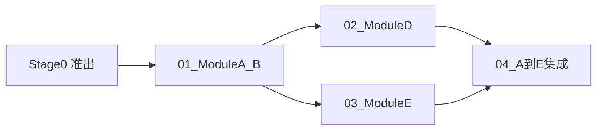

# Phase1_核心链路 · 核心链路最小可跑通

> [!NOTE] **[TRACEBACK] Phase 锚点**
> - **战略维度**: [01_产品设计维度](../../02_战略维度/产品设计/01_产品设计维度.md)
> - **原子规约**: [01_需求与产品范围](../../03_原子目标与规约/产品设计/01_需求与产品范围.md)、[09_核心模块架构规约](../../03_原子目标与规约/09_核心模块架构规约.md)
> - **对应 DNA**: `product_scope.phases` Phase1-xxx
> - **本文档**: L4 Phase1，核心链路最小可跑通（A→B→D + E 占位）

## Phase 目标（一句话）

核心链路最小可跑通：量化信号（A/B）→ 判官（D）→ 风控占位（E），本地或 Docker 可跑通 A→B→D→E 最小路径。

## 本 Phase 关键产出物

1. Module A/B 目录、接口与最小实现（量化信号可产出）
2. Module D 判官输入输出与 Kelly/Alpha 单测通过
3. Module E 接口与占位实现（硬编码规则或白名单）
4. A→B→D→E 集成路径串起，Table-Driven 或 Mock 可跑通（为 s1b 做准备）
5. 与 Stage1 准出条件对齐的验收结果与 L5 更新

## 本 Phase 对应开发生命周期阶段

- **阶段 1**（逻辑填充期）+ **可选 1b**（Mock 数据验证）+ **阶段 2**（Docker 统一环境期，可选）。与 [01_开发生命周期与实践流程规约](../../03_原子目标与规约/开发与交付/01_开发生命周期与实践流程规约.md) 阶段 1、1b、2 对应。

## 依赖的 00_ 交付步骤

- [Stage0_骨架期](../00_交付流程步骤/Stage0_骨架期/README.md)（stage_id: s0）准出
- 与 [Stage1_逻辑填充期](../00_交付流程步骤/Stage1_逻辑填充期/README.md)（stage_id: s1）**交错执行**；本 Phase 步骤细化 Stage1 的「具体任务拆分」
- 可选：[Stage1b_Mock数据验证准出](../00_交付流程步骤/Stage1b_Mock数据验证准出/README.md)、[Stage2_Docker统一环境期](../00_交付流程步骤/Stage2_Docker统一环境期/README.md)

## 本 Phase 对应的 L3 阶段目标与 L1 价值映射

- **阶段目标**（[01_需求与产品范围 第二节](../../03_原子目标与规约/产品设计/01_需求与产品范围.md)）：核心链路最小可跑通：量化信号 → 判官 → 风控占位；Module A/B 骨架 + Module D 判官最小闭环 + Module E 占位；验收时部署形态：本地 → Docker。
- **L1 价值映射**（同上 第四节）：认知边界（可解释性、Table-Driven Tests）、复利增长（回测/实盘一致）、生存底线（Module E 拦截率）、核心公式（Alpha = (Quant ∩ Router) × Kelly 链路可运行或可测）。
- **验收价值标准**（同上 第五节）：回测或单链路可跑通 A→B→D 最小路径；本地单测与必要集成测试通过；满足 01 规约阶段 1 准出条件。

## 本 Phase 步骤清单与依赖图

| 序号 | 步骤文档 | 说明 |
|------|----------|------|
| 01 | [01_ModuleA_B骨架与接口](01_ModuleA_B骨架与接口.md) | Module A/B 目录、接口与最小实现，满足「量化信号可产出」 |
| 02 | [02_ModuleD判官最小闭环](02_ModuleD判官最小闭环.md) | Module D 判官输入输出与 Kelly/Alpha，单测 |
| 03 | [03_ModuleE风控占位](03_ModuleE风控占位.md) | Module E 接口与占位实现（硬编码规则或白名单） |
| 04 | [04_A到E集成与Mock准备](04_A到E集成与Mock准备.md) | A→B→D→E 最小路径串起，Table-Driven 或 Mock 可跑通（为 s1b 做准备） |

## 占位与真实实现衔接

| 占位项 | 所在步骤 | 替换为真实实现的步骤或规约 |
|--------|----------|----------------------------|
| Module E 硬编码规则/白名单 | 03_ModuleE风控占位 | 后续 Phase 或 03_ 风控规约中的真实规则引擎/策略 |
| A/B 最小实现（若仅 Stub） | 01_ModuleA_B | 09_ 规约中 Scanner/Classifier 真实逻辑；可于本 Phase 或 Phase2 前替换 |
| 04_ 中 Mock/Table-Driven 数据 | 04_A到E集成 | Stage1b 或真实数据源接入时替换为真实数据路径 |

## 本 Phase 步骤–5D 强度

| 步骤 | 是否全 5D | 说明 |
|------|-----------|------|
| 01_ModuleA_B | 否，可简化 | 骨架与接口为主，非公式密集；若实现真实分类/扫描逻辑则建议 5D |
| 02_ModuleD | **是，须全 5D** | 公式、边界与投票规则；Design 锁逻辑 → Drive 锚 Table-Driven → Decompose 拆原子 → Defense 人把关 |
| 03_ModuleE | 建议 5D（规则判定处） | 规则判定（盈亏比、止损比例）为逻辑密集；纯接口占位可简化 |
| 04_A到E集成 | 否，可简化 | 集成与数据流为主；关键分支可做 Table-Driven |

## 行动入口

按上表顺序执行 01_ → 02_ → 03_ → 04_；每步完成后满足该步验收标准，本 Phase 准出与 [Stage1 准出](../00_交付流程步骤/Stage1_逻辑填充期/01_本阶段实践与验证.md) 对齐。
