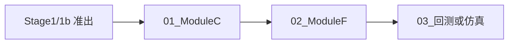

# Phase2_MoE与执行网关 · MoE 议会与执行网关接入

> [!NOTE] **[TRACEBACK] Phase 锚点**
> - **战略维度**: [01_产品设计维度](../../02_战略维度/产品设计/01_产品设计维度.md)
> - **原子规约**: [01_需求与产品范围](../../03_原子目标与规约/产品设计/01_需求与产品范围.md)、[09_核心模块架构规约](../../03_原子目标与规约/09_核心模块架构规约.md)、[05_接口抽象层规约](../../03_原子目标与规约/05_接口抽象层规约.md)
> - **对应 DNA**: `product_scope.phases` Phase2-xxx
> - **本文档**: L4 Phase2，MoE 议会与执行网关接入，回测/仿真可验证

## Phase 目标（一句话）

MoE 议会（Module C）与执行网关（Module F）接入，回测或仿真环境可验证，研产同构可跑通。

## 本 Phase 关键产出物

1. Module C 议会：Router、专家调用与投票/聚合，与 D 的 Alpha 链路对接
2. Module F 执行层抽象与 Broker 驱动占位或仿真
3. Docker/K3s 下回测或仿真路径跑通，研产同构可验证
4. 与 Stage2/Stage3 准出条件对齐的验收结果与 L5 更新

## 本 Phase 对应开发生命周期阶段

- **阶段 3**（K3s 测试开发期）+ **阶段 4**（与流水线衔接）。与 [01_开发生命周期与实践流程规约](../../03_原子目标与规约/开发与交付/01_开发生命周期与实践流程规约.md) 阶段 2、3 对应。

## 依赖的 00_ 交付步骤

- [Stage1_逻辑填充期](../00_交付流程步骤/Stage1_逻辑填充期/README.md) 或 [Stage1b_Mock数据验证准出](../00_交付流程步骤/Stage1b_Mock数据验证准出/README.md) 准出
- 与 [Stage2_Docker统一环境期](../00_交付流程步骤/Stage2_Docker统一环境期/README.md)、[Stage3_K3s测试开发期](../00_交付流程步骤/Stage3_K3s测试开发期/README.md) **交错执行**

## 本 Phase 对应的 L3 阶段目标与 L1 价值映射

- **阶段目标**（[01_需求与产品范围 第二节](../../03_原子目标与规约/产品设计/01_需求与产品范围.md)）：MoE 议会与执行网关接入，回测/仿真可验证；Module C 议会、Module F 执行网关；回测与实盘一致验证；验收时部署形态：K3s dev。
- **L1 价值映射**（同上 第四节）：认知边界、复利增长（研产同构验证、CAGR 可算）、核心公式（Router、执行层可运行或可测）。
- **验收价值标准**（同上 第五节）：MoE 议会与执行网关接入；回测与仿真环境行为与 01 规约阶段 2/3 一致；满足「研产同构」可验证。

## 本 Phase 步骤清单与依赖图

| 序号 | 步骤文档 | 说明 |
|------|----------|------|
| 01 | [01_ModuleC_MoE议会接入](01_ModuleC_MoE议会接入.md) | Router、专家调用与投票/聚合，与 D 的 Alpha 链路对接 |
| 02 | [02_ModuleF执行网关接入](02_ModuleF执行网关接入.md) | 执行层抽象、Broker 驱动占位或仿真 |
| 03 | [03_回测或仿真验证](03_回测或仿真验证.md) | Docker/K3s 下回测或仿真路径跑通，研产同构可验证 |

## 占位与真实实现衔接

| 占位项 | 所在步骤 | 替换为真实实现的步骤或规约 |
|--------|----------|----------------------------|
| Module F Broker 驱动占位/仿真 | 02_ModuleF执行网关接入 | 真实 Broker 适配与订单状态机；见 05_接口抽象层规约、实盘环境接入 |
| Module C 专家占位或单一专家 | 01_ModuleC_MoE议会接入 | 多专家与投票/聚合真实逻辑；见 09_ 议会与 Router 规约 |
| 回测/仿真环境 | 03_回测或仿真验证 | 与实盘一致的数据源与执行路径；见 01_需求与产品范围 研产同构 |

## 本 Phase 步骤–5D 强度

| 步骤 | 是否全 5D | 说明 |
|------|-----------|------|
| 01_ModuleC | 建议 5D（路由/聚合逻辑） | 路由分支、专家聚合为逻辑密集时可走 5D；CRUD/透传占位可简化 |
| 02_ModuleF | 否，可简化 | 接口与驱动占位为主；订单状态机/重试逻辑可对关键分支单测 |
| 03_回测或仿真 | 否，可简化 | 集成与环境验证为主；回测引擎复杂规则可做 Table-Driven 或快照测试 |

## 行动入口

按上表顺序执行 01_ → 02_ → 03_；每步依赖前序步骤或对应 Stage 准出。
