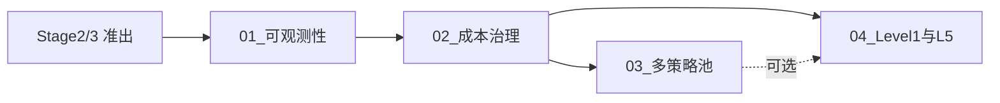

# Phase3_优化与扩展 · 多策略池、可观测性、成本治理

> [!NOTE] **[TRACEBACK] Phase 锚点**
> - **战略维度**: [01_产品设计维度](../../02_战略维度/产品设计/01_产品设计维度.md)、[04_生产保障与可观测性维度](../../02_战略维度/产品设计/04_生产保障与可观测性维度.md)、[07_成本治理维度](../../02_战略维度/产品设计/07_成本治理维度.md)
> - **原子规约**: [01_需求与产品范围](../../03_原子目标与规约/产品设计/01_需求与产品范围.md)、[08_心跳协议与健康检查规约](../../03_原子目标与规约/08_心跳协议与健康检查规约.md)、[10_运营治理与灾备规约](../../03_原子目标与规约/10_运营治理与灾备规约.md)
> - **对应 DNA**: `product_scope.phases` Phase3-xxx、`production_requirements.observability`、`cost_governance`
> - **本文档**: L4 Phase3，按 09 与 L1 查漏补缺，可观测性、成本治理、流水线入口

## Phase 目标（一句话）

按 09 规约与 L1 价值查漏补缺：可观测性、成本治理、多策略池与 Level1 流水线入口，满足三级流水线入口要求。

## 本 Phase 关键产出物

1. 日志/指标/健康检查满足 L3 production_requirements.observability
2. cost_governance 配置或 Token 熔断逻辑可落地
3. 多策略池或配置扩展（按 09 与 L1 查漏补缺，可选）
4. Level1 入口与 L5 功能/不可能三角表可追溯（可选）
5. 与 Stage3/Stage4 准出及 L5 验收表对齐

## 本 Phase 对应开发生命周期阶段

- **阶段 3、4**（K3s 测试开发期、与流水线衔接）。与 [01_开发生命周期与实践流程规约](../../03_原子目标与规约/开发与交付/01_开发生命周期与实践流程规约.md) 阶段 3、4 对应。

## 依赖的 00_ 交付步骤

- [Stage2_Docker统一环境期](../00_交付流程步骤/Stage2_Docker统一环境期/README.md)、[Stage3_K3s测试开发期](../00_交付流程步骤/Stage3_K3s测试开发期/README.md) 准出或进行中
- 与 [Stage3_K3s测试开发期](../00_交付流程步骤/Stage3_K3s测试开发期/README.md)、[Stage4_与流水线衔接](../00_交付流程步骤/Stage4_与流水线衔接/README.md) **衔接**

## 本 Phase 对应的 L3 阶段目标与 L1 价值映射

- **阶段目标**（[01_需求与产品范围 第二节](../../03_原子目标与规约/产品设计/01_需求与产品范围.md)）：优化与扩展（多策略池、可观测性、成本治理等）；按 09 规约与 L1 价值查漏补缺；验收时部署形态：K3s dev / 流水线入口。
- **L1 价值映射**（同上 第四节）：认知边界、复利增长、生存底线、核心公式的查漏补缺；满足三级流水线入口要求（[03_架构设计共识](../../03_原子目标与规约/03_架构设计共识与协作元规则.md)）。
- **验收价值标准**（同上 第五节）：按 L1 与战略维度查漏补缺；满足三级流水线入口要求；价值验收与 L5 对齐。

## 本 Phase 步骤清单与依赖图

| 序号 | 步骤文档 | 说明 |
|------|----------|------|
| 01 | [01_可观测性与日志指标](01_可观测性与日志指标.md) | 日志/指标/健康检查满足 L3 production_requirements.observability |
| 02 | [02_成本治理与Token熔断](02_成本治理与Token熔断.md) | cost_governance 配置或熔断逻辑可落地 |
| 03 | [03_多策略池或配置扩展](03_多策略池或配置扩展.md) | 多策略池或配置扩展（按 09 与 L1 查漏补缺，可选） |
| 04 | [04_Level1与L5验收对齐](04_Level1与L5验收对齐.md) | 满足 Level 1 入口、与 L5 功能/不可能三角表可追溯（可选） |

## 本 Phase 步骤–5D 强度

| 步骤 | 是否全 5D | 说明 |
|------|-----------|------|
| 01_可观测性 | 否，可简化 | 配置与埋点为主 |
| 02_成本治理 | 建议 5D（阈值/熔断判定） | 阈值与熔断判定为逻辑密集时可做 5D；仅配置透传可简化 |
| 03_多策略池 | 按需 5D | 配置化为主可简化 |
| 04_Level1与L5 | 否 | 文档与追溯对齐，不涉及代码 5D |

## 行动入口

按上表顺序执行 01_ → 02_，03_、04_ 按需；与 Stage3、Stage4 准出及 L5 验收表对齐。
