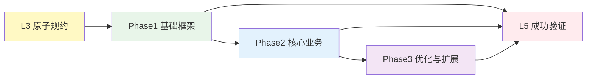

# L4 · 阶段规划与实践

> [!NOTE] **[TRACEBACK] 阶段实践锚点**
> - **顶层概念**: [一句话定义与核心价值](../01_顶层概念/01_一句话定义与核心价值.md)
> - **战略维度**: [战略维度目录](../02_战略维度/)
> - **原子规约**: [原子规约目录](../03_原子目标与规约/)
> - **本文档**: L4 层级，定义阶段规划与实施步骤

## 阶段说明

L4 层级负责将 L3 的原子规约转化为**可执行的阶段规划与实践步骤**。

> **新人入口**：[从零到第一次准出](00_从零到第一次准出.md) — 按阅读顺序与 Stage 列表从零执行到第一次阶段准出。

## 执行顺序来源与推荐顺序

- **顺序来源**：L4 步骤的**执行顺序来源于** [03_原子目标与规约/_System_DNA/dna_dev_workflow.yaml](../03_原子目标与规约/_System_DNA/dna_dev_workflow.yaml) 中的 **workflow_stages**。每步的交付范围、环境、测试与部署动作以 DNA 为准；执行时按该顺序进行。
- **单轨 Stage1～5**：**第一步为 Stage1-01 三位一体仓库初始化**，其后按 stage_id 顺序执行。

| 阶段 | DNA stage_id 范围 | 对应目录 | 说明 |
|------|-------------------|----------|------|
| Stage1 | stage1_01～03 | [Stage1_仓库与骨架](Stage1_仓库与骨架/README.md) | 仓库、接口、Proto、密钥与配置模板 |
| Stage2 | stage2_01～05 | [Stage2_数据采集与存储](Stage2_数据采集与存储/README.md) | 基础设施、采集逻辑、连调、镜像、部署验收 |
| Stage3 | stage3_01～07 | [Stage3_模块实践](Stage3_模块实践/README.md) | Module A～F + 全链路验证 |
| Stage4 | stage4_01～03 | [Stage4_MoE与执行网关](Stage4_MoE与执行网关/README.md) | MoE 议会、执行网关、回测/仿真 |
| Stage5 | stage5_01～04 | [Stage5_优化与扩展](Stage5_优化与扩展/README.md) | 可观测性、成本治理、多策略、Level1 入口 |

新建步骤时，须标明对应的 DNA `stage_id`，并插入 dna_dev_workflow 与上表保持一致。

## 单轨 Stage 说明

L4 采用**单轨 Stage1～5**，每 Stage 对应若干步骤文档，执行时按 dna_dev_workflow 的 execution_order 线性进行。

- **Stage1 仓库与骨架**：三位一体仓库初始化、核心接口与 Proto 占位、密钥与配置模板就绪（Sealed-Secrets）。
- **Stage2 数据采集与存储**：基础设施先行（TimescaleDB/Redis/PostgreSQL + Schema init Job），再采集逻辑与 Dockerfile、本地测试与 K3s 连调、镜像打包与 ACR 推送、采集模块部署与验收。
- **Stage3 模块实践**：Module A～F 逐模块实现，含四项 100% 验证；07_全链路验证。
- **Stage4 MoE 与执行网关**：MoE 议会、执行网关、回测或仿真验证。
- **Stage5 优化与扩展**：可观测性、成本治理、多策略、Level1 入口与 L5 验收对齐。

## 可部署单元与开发期连调

实盘多服务部署时，**可部署单元**为：数据采集与存储（Stage2）、Module A/B/C、热路径 D+E+F（见 [09_ 可部署单元清单](../03_原子目标与规约/_共享规约/09_核心模块架构规约.md#可部署单元清单)）。每单元对应设计-DNA-步骤 1:1:1 见各 Stage README 与 `global_const.deployable_units`。**开发期连调**：本地运行部分服务 + 远程 K3s 基础组件与数据，入口与验证见 [Stage2 README](Stage2_数据采集与存储/README.md#开发期连调)、[Stage3 README](Stage3_模块实践/README.md#开发期连调) 与 [03_ 工作流详细规划](../03_原子目标与规约/开发与交付/03_项目全功能开发测试实践工作流详细规划.md)。

## 实践文档统一必备结构

**04_ 下所有实践文档**（含 Stage1～5 各步骤文档 01_～0N_）均须包含以下三项，执行与审计时一视同仁：

| 必备项 | 说明 |
|--------|------|
| **核心指令（The Prompt）** | 可复制整段或明确引用完整版（如 00_5D）；供 AI 或执行者直接使用 |
| **验证步骤** | 明确列出执行顺序与可复制命令（可与「可执行验证清单」整合为「验证步骤」节） |
| **验证结果预期** | 每条验证步骤对应的预期结果（成功/失败判据）；可与表格「期望结果」列对应但须显式成节或成表 |

执行时以各 Stage 下 01_、02_… 步骤文档为准；均须具备上述三块。

**核心指令 DNA 驱动约定**：核心指令须包含「读取本阶段 DNA 的 `delivery_scope`、`exit_criteria`、`artifacts`、`verification_commands` → 据此生成任务列表与验收项」；实施与验收不得偏离 DNA，冲突以 DNA 为准。**示例**：[Stage1-01 三位一体仓库初始化](Stage1_仓库与骨架/01_三位一体仓库初始化.md)、[Stage2-02 采集逻辑与Dockerfile](Stage2_数据采集与存储/02_采集逻辑与Dockerfile.md) 为核心指令由 DNA 键展开的参考写法。

**实践文档统一必备项表**（所有类型同一标准）

| 必备项/要素 | 所有 04_ 实践文档（Stage 01_、Phase0 01_、Phase 步骤 01_～04_） |
|-------------|------------------------------------------------------------------|
| 核心指令（The Prompt） | 须有可复制整段或引用完整版 |
| 验证步骤 | 须有（执行顺序 + 可复制命令） |
| 验证结果预期 | 须有（每条验证的预期结果） |
| 可执行验证清单 / 验收与测试 | 须含至少一条可执行项或可复制命令块 |
| 本步骤准出（DoD）/ 准出检查清单 | 须有 |
| 本步骤失败时 | 须有 |
| 本步骤涉及的 DNA 键（Stage/Phase0）或 L5 精确行（Phase 步骤） | Stage/Phase0 须有 DNA 键；Phase 步骤建议有 |

## 阶段结构

每个阶段目录应包含：

```
Phase1_xxx/
├── README.md          # 阶段总览
├── 01_步骤A.md       # 具体实施步骤
├── 02_步骤B.md       # 具体实施步骤
└── ...
```

## 阶段流转逻辑



## 阶段列表与权威性约定

**阶段目录的权威列表**以当前 04_ 下实际存在的 Stage 目录及 dna_dev_workflow execution_order 为准。

| 阶段 | 目录 | 说明 |
|------|------|------|
| Stage1 | [Stage1_仓库与骨架](Stage1_仓库与骨架/README.md) | 仓库、接口、Proto、密钥与配置 |
| Stage2 | [Stage2_数据采集与存储](Stage2_数据采集与存储/README.md) | 基础设施、采集、连调、镜像、部署 |
| Stage3 | [Stage3_模块实践](Stage3_模块实践/README.md) | Module A～F、全链路验证 |
| Stage4 | [Stage4_MoE与执行网关](Stage4_MoE与执行网关/README.md) | MoE、执行网关、回测 |
| Stage5 | [Stage5_优化与扩展](Stage5_优化与扩展/README.md) | 可观测性、成本治理、Level1 入口 |

## 工作目录与多仓路径约定

- **工作目录**：指代码仓根目录（与文档仓同级的 `diting-core`，或 [02_三位一体仓库规约](../03_原子目标与规约/_共享规约/02_三位一体仓库规约.md) 约定路径）；部署相关步骤为 `diting-infra` 或约定路径。
- **多仓场景**：文档仓、代码仓、部署仓并列时，步骤内测试命令统一使用上述约定；可写「将 `diting-core` 替换为你的代码仓路径」。
- **CI**：流水线中工作目录为 CI 配置的绝对路径或仓库检出路径；与各 Stage README 及步骤文档中「工作目录」一致。

## 步骤文档要求

实施步骤须同时符合 [01_开发生命周期与实践流程规约](../03_原子目标与规约/开发与交付/01_开发生命周期与实践流程规约.md) 与 [01_需求与产品范围](../03_原子目标与规约/产品设计/01_需求与产品范围.md)。新建或拆分 Phase 时，须标明该 Phase 对应开发生命周期的哪一环境阶段（骨架期 / 逻辑填充期 / Docker 统一环境期 / K3s 测试开发期）。

- **Phase 步骤**须标明：**环境阶段**（01 规约的阶段 0～4）、**依赖的交付步骤**（如「依赖 [Stage1_仓库与骨架](Stage1_仓库与骨架/README.md) 完成」）、**对应 01 规约的哪条阶段目标**。

**实践记录模板**：步骤执行后可选用实践记录模板记录执行时间、模型、决策、问题与验证结果；模板权威位置与用法见 [06_追溯与审计/03_审计与一致性报告/00_实践记录模板](../06_追溯与审计/03_审计与一致性报告/00_实践记录模板.md)，不强制每步填写。

每个步骤文档应包含：

1. **步骤目标**：该步骤要达成什么
2. **前置条件**：需要哪些前置步骤或资源
3. **实施内容**：具体要做什么
4. **验收标准**：如何判断完成
5. **追溯锚点**：引用 L3 规约与 L2 维度
6. **环境阶段**（建议）：本步骤对应开发生命周期的哪一阶段（见 01 规约）

### Phase 步骤文档模板（必备结构）

Phase 下各步骤文档（如 `01_步骤A.md`）须具备以下结构，与协议 §8.4 工作目录、§8.8 L4 实践文档一致性检查表一致：

| 必备项 | 说明 |
|--------|------|
| **步骤目标** | 含对应 L3 阶段目标（可引用 01_需求与产品范围或 09_ 等） |
| **关键产出物** | 步骤目标下须有 3～5 条编号的「关键产出物」列表（与后文产出物表一致），便于一眼看出本步完成后的可交付物 |
| **本步骤可开始条件（Definition of Ready）** | 2～4 条，如「前置步骤 DoD 全勾」「工作目录可编译」「本步所依 L3 章节已定稿」；避免在依赖未就绪时开工 |
| **推荐模型（可选）** | 推荐模型 + 一句话理由 + 备选；不指定时可写「由执行方自选，建议具备规约与代码理解能力」 |
| **核心指令（The Prompt）** | 一节包含**可复制粘贴的整段 Prompt**（Markdown 代码块）；Prompt 内须含：角色设定、必读文档（含 09_/01_ 等及章节）、项目上下文（项目名、技术栈、工作目录、本步涉及模块）、你的任务（编号 1～5，与实施内容对齐）、重要约束、请输出（如 1. 变更/文件列表 2. 关键类型或接口 3. 单测命令与结果摘要）。逻辑密集步可将「完整版」放 00_5D 或附录，步骤内保留「简短版」并引用完整版 |
| **Prompt 使用说明** | 2～3 句：如何复制整段 Prompt、替换路径（如工作目录）、如何用「验收与测试」中的命令自检。**可复制性**：若在 IDE 外复制本 Prompt，请将必读文档路径替换为文档仓绝对路径或可访问 URL（见下「核心指令可复制性约定」） |
| **依赖的 Stage** | stage_id + 链接，如「依赖 [Stage1_仓库与骨架](Stage1_仓库与骨架/README.md)（stage1）准出」 |
| **前置条件** | 需要的前序 Phase 步骤或 00_ Stage 准出 |
| **实施内容** | 具体任务；**工作目录**须明确：`diting-core`（业务/接口）或 `diting-infra`（部署/IaC）；不重复 00_ 的环境与流程描述 |
| **验收标准** | 可执行、可判定（如单测通过、接口返回符合契约） |
| **[TRACEBACK] 追溯锚点** | 战略维度、主责 L3 文档、本 Phase；Callout 格式 |
| **本步骤涉及的 DNA 键**（建议） | 如 `product_scope.phases`、`core_modules.module_*` 等，便于 L3/DNA 变更时按 [01_L3_DNA_变更对L4影响表](../06_追溯与审计/01_L3_DNA_变更对L4影响表.md) 复核 |
| **逻辑密集步** | 须标 **5D**（Design-Drive-Decompose-Dispatch-Defense）与测试锚定；CRUD/绑定类可简化 |
| **本步骤准出（DoD）** | 代码已提交至约定分支/目录；单测全绿（注明命令，如 `make test` 或 `go test ./...`）；Code Review 通过（或标注豁免）；若适用则 L5 对应验收行已更新 |
| **产出物** | 期望的文件或包列表（如 `gavel/voting.go`、`gavel/kelly.go`、`gavel/verdict_test.go`），便于自检与 Review 逐项打勾 |
| **占位边界**（若本步允许占位） | 占位满足条件：接口与 09_ 一致、至少 1 条 Table-Driven 通过、不要求真实外部调用（如 Expert/券商）；超出则视为需真实实现 |
| **技术约束** | **必须做(DO)** 3～5 条、**禁止做(DON'T)** 3～5 条、**边界限制**（如单文件行数、本步仅占位/仅接口）；可与「占位边界」合并表述 |
| **验收与测试** | **验收检查项**（checkbox，与功能/产物条件对应）、**测试命令**（可复制的 bash/code 块）、**成功标准**（3～5 条）、**失败处理**（本步特有 2～3 条 +「其余见 [03_ 八、失败与回退策略](../03_原子目标与规约/开发与交付/03_项目全功能开发测试实践工作流详细规划.md)」）。与 **本步骤准出（DoD）** 分工：验收 = 功能/产物条件；DoD = 提交 + 单测 + Review + L5 某表某行更新 |
| **下一步** | 明确「完成本步且通过验收后，进入 [下一步步骤](链接)」+ 一句重要提示（如骨架/接口未就绪勿进入下一步） |
| **输出格式/期望交付形态** | 可与核心指令的「请输出」合并：如「1. 变更/新增文件列表 2. 关键类型或接口定义 3. 单测命令及通过结果摘要」，便于 Review 与交接 |
| **实践记录（可选）** | 步骤执行后可选用 [06_追溯与审计/03_审计与一致性报告/00_实践记录模板](../06_追溯与审计/03_审计与一致性报告/00_实践记录模板.md) 记录执行时间、模型、决策、问题与验证结果；不强制每步填写。**弱绑定**：关键步骤（如逻辑密集的 Phase1 02_、Phase2 01_、Phase3 02_）准出时**建议**填写实践记录并在本步骤或对应 Stage 01_ 中注明链接或摘要；约定每个 Phase 至少有一个步骤在准出时附实践记录链接，便于审计与复盘 |

**核心指令可复制性约定**：核心指令块内**必读文档路径**建议使用「文档仓根相对路径」（如 `diting-doc/03_原子目标与规约/_共享规约/09_核心模块架构规约.md`）或占位符 `{{DOC_ROOT}}`，便于在任意工作目录下替换。若在 IDE 外复制本 Prompt，请将路径替换为文档仓绝对路径或可访问 URL。

### Phase 步骤文档可选增强项

逻辑密集或占位步骤可按需补全以下**可选项**（与上表必备项配合使用）：

| 可选项 | 说明 |
|--------|------|
| **人的动作（本步）** / **AI 的动作（本步）** | 本步 Design/Drive/Decompose/Defense 中人做啥、AI 做啥 |
| **推荐工具/模型（可选）** | 如 Design 用 Claude、Drive 用 DeepSeek 生成测试 |
| **禁止/不推荐** | 如勿由 AI 修改公式、勿跳过 Drive 直接写实现 |
| **5D 执行顺序** | 对须走 5D 的步骤：5D-1 Design → 5D-2 Drive → 5D-3 Decompose → 5D-4 Defense，每步输出物写清 |
| **本步骤最小上下文** | 逻辑密集步摘录公式、结构体、3～5 条 Table-Driven 用例（数值），不打开 09_/01_ 即可执行 |
| **本步骤失败时** | 至少 3 条：单测不通过→回 Drive 核对用例；Review 不符→列差异先改设计；依赖未就绪→明确前置步骤；可引用 [03_ 失败与回退策略](../03_原子目标与规约/开发与交付/03_项目全功能开发测试实践工作流详细规划.md)。**失败处理分级**（逻辑密集或关键步骤可区分）：**阻塞**（单测不通过、与 L3 不符→必须修完再准出）与**建议修正**（Review 风格/命名→可记技术债后准出）；步骤内保留「其余见 03_ 八、失败与回退策略」一处引用。**冗余收敛**：验收与 DoD 分工明确后，「本步骤失败时」仅列本步 2～3 条，不重复 03_ 全文 |
| **路径与命名** | 本步代码路径（如 `diting-core/diting/gavel/`）+ 业务词→英文命名表（如 判官→Gavel, 凯利→Kelly） |
| **L3/DNA 快照** | 本步骤依据的 09_/01_ 或 DNA 版本/日期/commit |
| **Phase–Stage 接口** | 本步产出被哪一 Stage 的 01_ 哪条验证使用；本步依赖的 Stage 准出具体指哪几条 |

实施内容或验收标准中可注明：**代码注释须标注 [Ref: 步骤文档名] 或 [Ref: 03_XX]**，与协议追溯要求一致。

**代码 [Ref] 粒度约定**：至少在本步骤**新增的对外接口/核心类型定义**处标注 `[Ref: 步骤文档名]` 或 `[Ref: 03_XX]`；实现文件可选标注；整包为本步新增时可在包文档或 main 处标注一次。

**L5 更新精确度**：步骤 DoD 须写明「更新 L5 [02_验收标准](../05_成功标识与验证/02_验收标准.md) 中**功能验收表**的「09_ Module X」一行（状态 ⏳→✅，并填写验证方式）」，避免泛指「对应行」。

### Phase README 建议内容

各 Phase 目录下的 README 建议包含：

- **本 Phase 对应开发生命周期阶段**：如「阶段 1（逻辑填充）+ 阶段 2（Docker）」
- **本 Phase 依赖的交付步骤**：如「[Stage1_仓库与骨架](Stage1_仓库与骨架/README.md)、[Stage2_数据采集与存储](Stage2_数据采集与存储/README.md)」
- **本 Phase 对应的 01 规约阶段目标与 L1 价值点**：引用 [01_需求与产品范围](../03_原子目标与规约/产品设计/01_需求与产品范围.md) 中该 Phase 的目标与验收价值、以及 L1 不可能三角/核心价值映射

## L4 文档生成可复现性

若 L4 阶段文档（04_ 各 Stage 下步骤文档/README 或 Phase 步骤）由**脚本或 AI** 从 L3+DNA 生成，建议在 04_ 或 [06_追溯与审计/03_审计与一致性报告](../06_追溯与审计/03_审计与一致性报告/README.md) 中记录：

- **生成脚本/命令或 Prompt 版本**（若有）
- **使用的 DNA 与 L3 文档的版本/快照**（如 git commit、文档日期）

便于同输入再跑得同输出，以及审计时对应「某次发布对应的 L4 版本」。

## 下一步

→ 参见 [05_成功标识与验证/](../05_成功标识与验证/) 目录下的验证文档
