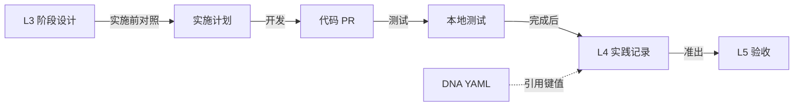

# L4 · 阶段实践记录（实践运行的进展、成果、测试日志）

> [!NOTE] **[TRACEBACK]**
> - **L3 设计**: [03_原子目标与规约](../03_原子目标与规约/)（六维度 × 三阶段实践设计）
> - **DNA 真相源**: [_System_DNA](../03_原子目标与规约/_System_DNA/)
> - **L5 验收**: [05_成功标识与验证](../05_成功标识与验证/)

---

## 一、L4 新定位（2026-05-16 重构）

L4 **不再**是"实施步骤设计"（已迁移到 L3 `stages/`），而是**实践运行的进展记录**：

| 维度 | L3 stages（设计） | L4（记录） |
|---|---|---|
| **承载** | "**应该怎么做**" | "**实际做了什么 + 结果**" |
| **频率** | 一次设计，跨阶段不变 | 每次实践运行一次记录 |
| **内容** | 目标、技术、数据、训练、验收标准 | 进展、代码 PR、测试输出、偏离决策 |
| **谁写** | 架构师 + AI（计划）| AI + 开发者（执行后记录）|

---

## 二、目录结构

```
04_阶段规划与实践/
├── README.md                              # 本文件
├── 00_四阶段提问体系_完整规约.md
├── 00_维度零_AI投资副驾驶/
│   ├── README.md                          # 维度概览
│   └── stage_1_启动期/                    # 每阶段一个目录
│       ├── README.md                      # 本阶段实践看板
│       ├── 实践记录_step_01_xxx.md        # 与 L3 step_NN 1:1（维度零约定）
│       ├── 实践记录_step_02_xxx.md
│       ├── ...
│       ├── 实践记录_M_持仓体检.md          # 或按模块记录（功能交付期）
│       ├── 实践记录_M_推荐池.md
│       └── 测试运行_端到端.md             # 端到端测试结果
├── 01_维度一_极寒防御/
├── 02_维度二_纵深进攻/
├── 03_维度三_持仓监控/
├── 04_维度四_卖出决策/
├── 05_维度五_演进飞轮/
├── 共享平台基础/                          # 跨维度的部署、平台实践
└── _legacy/                               # ★ 旧 MVP/V1/V2 步骤式文档归档
```

---

## 三、L4 实践记录粒度（两种均支持）

### 3.1 按周记录（推荐用于密集开发期）

适用场景：每周交付明确目标的迭代期。

```markdown
# 实践记录 · 维度一·启动期 · Week 4 · 数据采集流水线搭建

## 计划（来自 L3）
- 引用：03_原子目标与规约/01_维度一_极寒防御/stages/stage_1_启动期/03_数据采集与预处理.md
- 引用 DNA：_System_DNA/01_cryo_guard/dna_stage_1_启动期.yaml#training_data_scale
- 本周目标：完成财报采集脚本 + 50 案例 Holdout 整理

## 实际进展
- ✅ akshare 财务报表采集脚本就绪，已采集 2019-2024 全 A 股年报
- ✅ 50 案例 Holdout 框架就绪，30 财务测谎案例已标注完成
- ⚠️ PDF OCR 在部分老旧扫描件上 confidence < 0.7（已加人工 review 流程）
- ❌ 企查查 API 限额超出，需联系商务

## 测试运行
\`\`\`bash
$ python -m cryo_guard.data.scripts.crawl_financial_reports --year 2023
✅ 5132 家公司财务数据已入库 SQLite

$ pytest tests/cryo_guard/test_holdout_loader.py -v
30 passed in 2.5s
\`\`\`

## 偏离与决策
- **偏离 1**：原计划完成 50 案例全部标注，实际只完成 30 个
- **原因**：企查查 API 限额导致股权穿透数据缺失，关联交易 10 案例延后
- **决策**：架构师同意延期 1 周，下周继续

## 下一步
- Week 5：开始引擎 1（财务测谎）训练数据 Teacher 蒸馏

## 引用
- [L3 设计](../../../../03_原子目标与规约/01_维度一_极寒防御/stages/stage_1_启动期/03_数据采集与预处理.md)
- [代码 PR](https://github.com/.../pull/123)
- [DNA](../../../../03_原子目标与规约/_System_DNA/01_cryo_guard/dna_stage_1_启动期.yaml)
```

### 3.2 按模块记录（推荐用于功能交付期）

适用场景：每个功能模块完整交付后做一次总结记录。

```markdown
# 实践记录 · 维度零·启动期 · 子模块 1 · 持仓体检报告

## 模块定位
- 引用：03_原子目标与规约/00_维度零_AI投资副驾驶/stages/stage_1_启动期/01_实践目标与策略.md#子模块-1
- DNA：_System_DNA/00_co_pilot/dna_stage_1_启动期.yaml#deliverables.modules[0]

## 实际交付物
- ✅ Web 首屏 4 色卡片（红/橙/黄/绿）
- ✅ 单持仓详情页（节点 4 态 + 30 天健康度曲线）
- ✅ Redis Stream `events:monitor:health_change` 订阅器

## 性能验证
| 指标 | 目标 | 实测 | 状态 |
|---|---|---|---|
| 首屏加载 | < 1s | 0.6s | ✅ |
| 4 色与 push_level 一致率 | 100% | 100% | ✅ |
| 健康度曲线渲染时间 | < 500ms | 220ms | ✅ |

## 集成测试
（粘贴测试命令和输出）

## 已知问题
- 在 iOS Safari 上 HTMX 加载偶发延迟（约 5%）
- 工单：DITING-123

## 引用
- [L3 设计](路径)
- [代码 PR](链接)
- [验收 checklist](路径)
```

### 3.3 部署快照（推荐每份记录具备）

对齐目标运行时：**阿里云 ECS + K3s**、**Helm**、镜像 **阿里云 ACR**、`diting-infra` → **deploy-engine**（Chart 与子模块链路见 [_共享规约/16](../03_原子目标与规约/_共享规约/16_阿里云ECS_K3s_ACR_Helm部署与deploy-engine链路.md)）。

在每份实践中增加 **部署**（或并入「偏离与决策」）小节时，至少写清下列之一：**本周无上架**（并说明工作仅在 `diting-src`/`diting-infra` 何种程度），或已上架时的可追溯一行表：

| 项 | 填写 |
|---|---|
| **ACR 镜像 digest/tag**（各服务） | 无则 `—` |
| **helm release / namespace / values 覆盖文件名** | 无则 `—` |
| **验证命令与结果摘要**（如 curl / kubectl / helm status） | 必填一句 |

**约定**：不得在 **`diting-infra/deploy-engine/`** 子模块拷贝内做写操作或提交；须在 **deploy-engine 独立仓库** 修改、`push`，再在 **`diting-infra` 执行 `make update-deploy-engine`**（与仓库规则一致）。

---

## 四、各维度实践记录入口

| 维度 | L4 实践目录 | L3 设计入口 | DNA |
|---|---|---|---|
| 0·AI 投资副驾驶 | [00_维度零/](./00_维度零_AI投资副驾驶/) | [stages/](../03_原子目标与规约/00_维度零_AI投资副驾驶/stages/) | [00_co_pilot/](../03_原子目标与规约/_System_DNA/00_co_pilot/) |
| 1·极寒防御 | [01_维度一/](./01_维度一_极寒防御/) | [stages/](../03_原子目标与规约/01_维度一_极寒防御/stages/) | [01_cryo_guard/](../03_原子目标与规约/_System_DNA/01_cryo_guard/) |
| 2·纵深进攻 | [02_维度二/](./02_维度二_纵深进攻/) | [stages/](../03_原子目标与规约/02_维度二_纵深进攻/stages/) | [02_deep_strike/](../03_原子目标与规约/_System_DNA/02_deep_strike/) |
| 3·持仓监控 | [03_维度三/](./03_维度三_持仓监控/) | [stages/](../03_原子目标与规约/03_维度三_持仓监控/stages/) | [03_holding_watch/](../03_原子目标与规约/_System_DNA/03_holding_watch/) |
| 4·卖出决策 | [04_维度四/](./04_维度四_卖出决策/) | [stages/](../03_原子目标与规约/04_维度四_卖出决策/stages/) | [04_exit_engine/](../03_原子目标与规约/_System_DNA/04_exit_engine/) |
| 5·演进飞轮 | [05_维度五/](./05_维度五_演进飞轮/) | [stages/](../03_原子目标与规约/05_维度五_演进飞轮/stages/) | [05_super_evo/](../03_原子目标与规约/_System_DNA/05_super_evo/) |

---

## 五、实践记录命名约定

| 类型 | 命名格式 | 示例 |
|---|---|---|
| **按 step（启动期 · D0～D5，权威）** | `实践记录_step_{NN}_{主题}.md` | `实践记录_step_04_数据采集.md` |
| 按模块记录 | `实践记录_M_{模块名}.md` | `实践记录_M_持仓体检.md` |
| 测试运行 | `测试运行_{范围}.md` | `测试运行_端到端.md` |
| 阶段总结 | `阶段总结_{stage_id}.md` | `阶段总结_stage_1_启动期.md` |

---

## 六、写作流程


```mermaid
flowchart LR
  L3[L3 阶段设计] -->|实施前对照| PLAN[实施计划]
  PLAN -->|开发| CODE[代码 PR]
  CODE -->|测试| TEST[本地测试]
  TEST -->|完成后| L4[L4 实践记录]
  L4 -->|准出| L5[L5 验收]
  
  DNA[DNA YAML] -.->|引用键值| L4
```

**每份实践记录必须包含**：
- [ ] 计划部分：链接到 L3 stage 设计文档 + DNA 键
- [ ] 实际进展：✅/⚠️/❌ 状态
- [ ] 测试运行：实际命令 + 输出片段
- [ ] **部署**：按 §3.3 写明 **上架/无上架** 与快照字段（或无则占位句）
- [ ] 偏离与决策（如有）
- [ ] 引用：L3 设计、代码 PR、相关工单

---

## 七、_legacy 说明

`_legacy/` 目录保留了 2026-05-16 重构前的旧实践文档（按 MVP/V1/V2 切分）：

- 旧文件按"步骤"组织，与 L3 stage 设计重叠
- 重构后 L3 stages 承载"应该怎么做"，L4 承载"实际做了什么"
- 旧文件作为历史参考，不再维护

---

## 修订记录

| 日期 | 内容 |
|---|---|
| 2026-05-16 | L4 重构：维度目录改名 00_~05_、定位调整为"实践运行进展记录"、旧 MVP/V1/V2 归档 _legacy/ |
| 2026-05-17 | 增 §3.3 部署快照（ECS/K3s/Helm/ACR、deploy-engine 子模块约束）；§六清单增「部署」项 |
