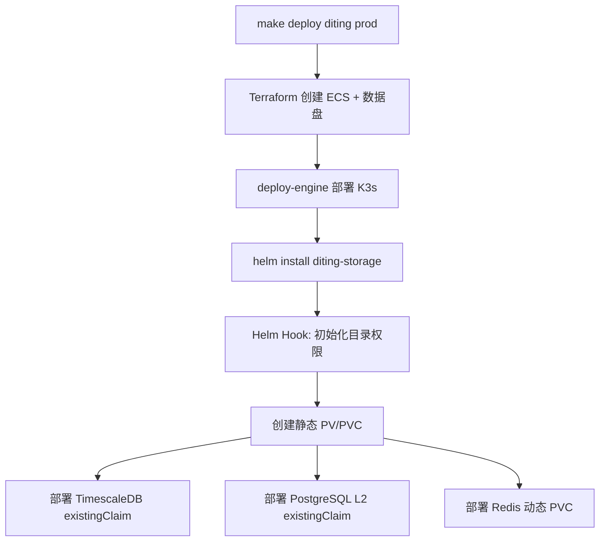

# Helm Chart 静态存储方案 - 最终实施

## 一、方案概述

使用 **Helm Chart** 管理静态 PV/PVC，替代脚本方案，实现：
- ✅ 声明式资源管理
- ✅ 自动化部署顺序（先存储，后数据库）
- ✅ 权限自动初始化（Helm Hooks）
- ✅ 版本化、可追溯
- ✅ 符合 Kubernetes 最佳实践

## 二、架构设计

### 2.1 目录结构

```
diting-infra/
├── charts/
│   └── diting-storage/          # 静态存储 Helm Chart
│       ├── Chart.yaml
│       ├── values.yaml
│       ├── templates/
│       │   ├── timescaledb-pv.yaml
│       │   ├── timescaledb-pvc.yaml
│       │   ├── postgresql-l2-pv.yaml
│       │   ├── postgresql-l2-pvc.yaml
│       │   └── init-job.yaml   # Helm Hook：权限初始化
│       └── README.md
│
├── config/
│   └── diting-prod.yaml         # 部署控制配置
│
└── Makefile                      # 集成部署流程
```

### 2.2 部署流程



## 三、核心配置

### 3.1 Helm Chart Values

文件：`charts/diting-storage/values.yaml`

```yaml
dataPath: /mnt/titan-data/postgres

timescaledb:
  enabled: true
  pv:
    name: timescaledb-data-pv
    capacity: 50Gi
    subPath: timescaledb
    reclaimPolicy: Retain
  pvc:
    name: data-timescaledb-postgresql-0
    namespace: default

postgresL2:
  enabled: true
  pv:
    name: postgresql-l2-data-pv
    capacity: 20Gi
    subPath: postgresql-l2
    reclaimPolicy: Retain
  pvc:
    name: data-postgresql-l2-0
    namespace: default
```

### 3.2 部署控制配置

文件：`config/diting-prod.yaml`

```yaml
deploy_control:
  diting_storage_chart:
    enabled: true
    chart_path: "charts/diting-storage"
    release_name: "diting-storage"
    namespace: "default"
  
  timescaledb_storage:
    size: "50Gi"
    storage_class: ""
    existing_claim: "data-timescaledb-postgresql-0"
  
  postgres_l2_storage:
    size: "20Gi"
    storage_class: ""
    existing_claim: "data-postgresql-l2-0"
  
  redis_storage:
    size: "10Gi"
    storage_class: "local-path"  # 动态 PVC
```

### 3.3 Makefile 集成

```makefile
deploy-diting-prod: update-deploy-engine
	# ... Terraform 部署 ...
	@CONFIG_ROOT="$(CONFIG_ROOT)" $(MAKE) -C $(DEPLOY_ENGINE_DIR) deploy $(PROD_DATA_ENV_PROJECT) $(PROD_DATA_ENV_ENV)
	
	# 部署 diting-storage chart
	@export KUBECONFIG="$$HOME/.kube/config-$(PROD_DATA_ENV_PROJECT)-$(PROD_DATA_ENV_ENV)"; \
	if helm list -n default | grep -q diting-storage; then \
		helm upgrade diting-storage $(CURDIR)/charts/diting-storage -n default --wait; \
	else \
		helm install diting-storage $(CURDIR)/charts/diting-storage -n default --wait; \
	fi
	
	# ... 后续步骤 ...
```

## 四、关键特性

### 4.1 Helm Hooks 自动初始化

文件：`charts/diting-storage/templates/init-job.yaml`

```yaml
apiVersion: batch/v1
kind: Job
metadata:
  name: diting-storage-init
  annotations:
    "helm.sh/hook": post-install,post-upgrade
    "helm.sh/hook-weight": "-5"
    "helm.sh/hook-delete-policy": before-hook-creation
spec:
  template:
    spec:
      containers:
      - name: init-permissions
        image: busybox:1.36.1
        command:
        - /bin/sh
        - -c
        - |
          mkdir -p /mnt/titan-data/postgres/timescaledb
          chmod 777 /mnt/titan-data/postgres/timescaledb
          mkdir -p /mnt/titan-data/postgres/postgresql-l2
          chmod 777 /mnt/titan-data/postgres/postgresql-l2
```

**优势**：
- ✅ 自动执行，无需手动干预
- ✅ 在 PV/PVC 创建后立即执行
- ✅ 失败时阻止后续部署

### 4.2 数据库使用 existingClaim

```bash
# TimescaleDB
helm install timescaledb bitnami/postgresql \
  --set primary.persistence.existingClaim=data-timescaledb-postgresql-0

# PostgreSQL L2
helm install postgresql-l2 bitnami/postgresql \
  --set primary.persistence.existingClaim=data-postgresql-l2-0
```

**优势**：
- ✅ 不创建新的 PVC
- ✅ 直接使用静态 PVC
- ✅ 数据路径固定，实现继承

## 五、验证结果

### 5.1 安装验证

```bash
$ helm install diting-storage ./charts/diting-storage -n default --wait
NAME: diting-storage
LAST DEPLOYED: Mon Mar  2 01:29:56 2026
NAMESPACE: default
STATUS: deployed
REVISION: 1
```

### 5.2 资源验证

```bash
$ kubectl get pv -l app=diting
NAME                    CAPACITY   RECLAIM POLICY   STATUS   CLAIM
postgresql-l2-data-pv   20Gi       Retain           Bound    default/data-postgresql-l2-0
timescaledb-data-pv     50Gi       Retain           Bound    default/data-timescaledb-postgresql-0

$ kubectl get pvc -n default -l app=diting
NAME                            STATUS   VOLUME                  CAPACITY
data-postgresql-l2-0            Bound    postgresql-l2-data-pv   20Gi
data-timescaledb-postgresql-0   Bound    timescaledb-data-pv     50Gi
```

### 5.3 初始化验证

```bash
$ kubectl logs job/diting-storage-init -n default
初始化存储目录权限...
✓ TimescaleDB 存储目录已初始化
✓ PostgreSQL L2 存储目录已初始化
✓ 所有存储目录初始化完成
```

## 六、对比：Chart vs 脚本

| 维度 | Helm Chart 方案 | 脚本方案 |
|------|----------------|----------|
| **管理方式** | 声明式（YAML） | 命令式（Shell） |
| **版本控制** | ✅ Helm 版本化 | ❌ 脚本版本难追踪 |
| **依赖顺序** | ✅ Helm 自动管理 | ❌ 手动控制 |
| **权限初始化** | ✅ Helm Hooks 自动 | ❌ 需要单独脚本 |
| **幂等性** | ✅ Helm 保证 | ⚠️ 脚本需手动实现 |
| **可维护性** | ✅ 模板化、易扩展 | ❌ 脚本复杂、易出错 |
| **标准化** | ✅ K8s 生态标准 | ❌ 项目特定 |
| **文件数量** | 6 个（Chart） | 3 个脚本 + 1 个配置 |

## 七、diting-infra 目录职责（强化）

### 7.1 charts/ - Helm Charts

**用途**：存放 Diting 项目的基础设施 Helm Charts

**规则**：
- ✅ **可以**：创建和修改 Diting 自有的 Charts（如 `diting-storage`）
- ✅ **可以**：添加项目特定的 Kubernetes 资源模板
- ❌ **不要**：在这里存放第三方 Charts（使用 Helm repo）
- ❌ **不要**：在这里存放应用代码或业务逻辑
- ❌ **不要**：在这里存放配置文件（应放在 `config/`）

### 7.2 config/ - 配置文件

**用途**：存放环境配置和部署控制文件

**规则**：
- ✅ **可以**：修改环境配置（如 `diting-prod.yaml`）
- ✅ **可以**：添加新环境的配置文件
- ✅ **可以**：修改 Terraform 变量（如 `terraform-diting-prod.tfvars`）
- ❌ **不要**：在这里存放 Kubernetes 资源定义（应放在 `charts/`）
- ❌ **不要**：在这里存放脚本（应放在 `scripts/`）

**为什么不把 PV/PVC 配置放在 config/ 下？**
- `config/` 用于**配置**（变量、参数）
- `charts/` 用于**资源定义**（Kubernetes 对象）
- PV/PVC 是 Kubernetes 资源，应该用 Helm Chart 管理

### 7.3 scripts/ - 脚本

**用途**：存放辅助脚本和工具

**规则**：
- ✅ **可以**：添加辅助脚本（如连接信息生成、数据迁移）
- ✅ **可以**：添加本地开发工具脚本
- ❌ **不要**：在这里存放核心部署逻辑（应在 Makefile 或 Charts）
- ❌ **不要**：在这里存放配置文件（应放在 `config/`）
- ❌ **不要**：用脚本替代 Helm Chart 管理 K8s 资源

### 7.4 deploy-engine/ - Git 子模块（只读）

**严格规则**：
- ❌ **禁止**：在 `diting-infra/deploy-engine/` 下修改任何文件
- ❌ **禁止**：在 `diting-infra/deploy-engine/` 下执行 `git add/commit/push/stash`
- ✅ **正确做法**：到 **deploy-engine 独立仓库** 修改，再 `make update-deploy-engine`

## 八、使用指南

### 8.1 部署

```bash
# 完整部署（包含 diting-storage）
make deploy diting prod

# 单独部署 diting-storage
helm install diting-storage ./charts/diting-storage -n default
```

### 8.2 升级

```bash
# 修改 values.yaml 后升级
helm upgrade diting-storage ./charts/diting-storage -n default
```

### 8.3 卸载

```bash
# 保留数据（推荐）
kubectl delete pvc data-timescaledb-postgresql-0 data-postgresql-l2-0 -n default
helm uninstall diting-storage -n default

# 完全清理（危险）
helm uninstall diting-storage -n default
kubectl delete pv timescaledb-data-pv postgresql-l2-data-pv
```

### 8.4 故障排查

#### PV 状态 Released

```bash
kubectl patch pv timescaledb-data-pv -p '{"spec":{"claimRef":null}}'
kubectl patch pv postgresql-l2-data-pv -p '{"spec":{"claimRef":null}}'
```

#### 权限问题

```bash
kubectl delete job diting-storage-init -n default
helm upgrade diting-storage ./charts/diting-storage -n default
```

## 九、优势总结

1. **标准化**：使用 Helm Chart 是 Kubernetes 生态的标准做法
2. **自动化**：Helm Hooks 自动初始化权限，无需手动干预
3. **声明式**：YAML 定义资源，版本化、可追溯
4. **依赖管理**：Helm 确保部署顺序（先存储，后数据库）
5. **简化维护**：不需要维护多个脚本
6. **易于扩展**：添加新存储只需修改 values.yaml 和模板

## 十、参考文档

- [diting-infra/charts/diting-storage/README.md](../../diting-infra/charts/diting-storage/README.md)
- [diting-infra/README.md](../../diting-infra/README.md)
- [Helm Chart 开发指南](https://helm.sh/docs/chart_template_guide/)
- [Kubernetes PV/PVC 文档](https://kubernetes.io/docs/concepts/storage/persistent-volumes/)
- [06_生产级数据要求_设计](../../03_原子目标与规约/Stage2_数据采集与存储/06_生产级数据要求_设计.md)
