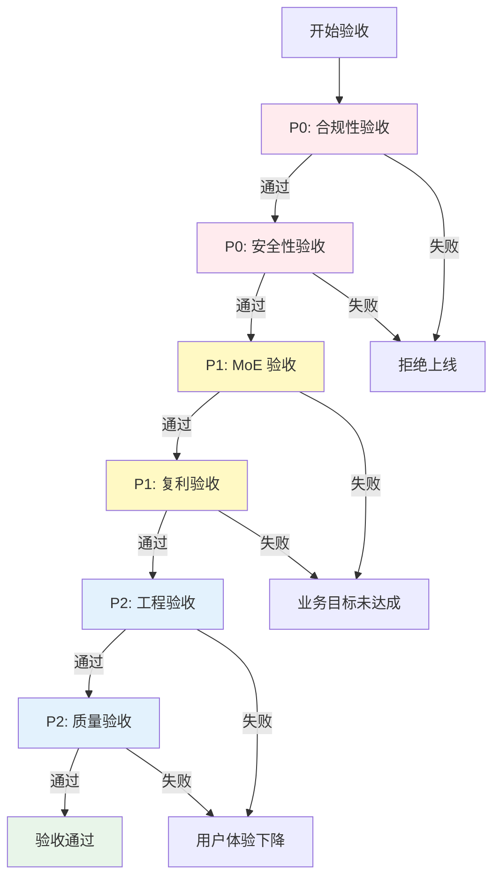

# L5 · 成功标识详细规约 (Success Markers - DoD)

> [!NOTE] **[TRACEBACK] 成功验证锚点**
> - **顶层概念**: [一句话定义与核心价值](../01_顶层概念/01_一句话定义与核心价值.md)
> - **顶层概念**: [战略目标与ROI](../01_顶层概念/02_战略目标与ROI.md)
> - **原子规约**: [核心模块架构规约](../03_原子目标与规约/_共享规约/09_核心模块架构规约.md)
> - **原子规约**: [运营治理与灾备规约](../03_原子目标与规约/_共享规约/10_运营治理与灾备规约.md)
> - **本文档**: L5 层级，定义详细的成功标识与验收标准（Definition of Done）

## 核心理念

**成功标识必须可测量、可追溯、可验证**。每个标识都应：
1. **有明确的量化指标**：数字阈值，非主观判断
2. **有明确的测量方法**：如何收集数据、如何计算
3. **有明确的验收标准**：何时算通过、何时算失败
4. **可追溯到核心价值**：与"不可能三角"和核心公式对应

---

## A. MoE 验收 (MoE Acceptance)

### 1. 垂类专家胜率验证

#### 1.1 验收标准

**核心要求**：垂类 Agent 在其特定领域的胜率，必须比通用 LLM 高出 **15% 以上**。

| 专家类型 | 领域 | 最低胜率要求 | 通用 LLM 基准 | 提升幅度要求 |
|---------|------|------------|-------------|------------|
| **Agri-Agent** | 农业（猪周期、气候） | ≥ 80% | ≤ 65% | ≥ 15% |
| **Tech-Agent** | 硬科技（半导体、AI） | ≥ 80% | ≤ 65% | ≥ 15% |
| **Geo-Agent** | 宏观（大宗商品、汇率） | ≥ 80% | ≤ 65% | ≥ 15% |

#### 1.2 测量方法

```python
# diting-core/diting/validation/moe_win_rate.py
class MoEWinRateValidator:
    """MoE 胜率验证器"""
    
    def validate_expert_win_rate(
        self,
        expert_name: str,
        test_period_days: int = 90
    ) -> ValidationResult:
        """
        验证专家胜率
        :param expert_name: 专家名称（agri_agent, tech_agent, geo_agent）
        :param test_period_days: 测试周期（天）
        :return: 验证结果
        """
        # 1. 获取专家交易记录
        expert_trades = self._get_expert_trades(expert_name, test_period_days)
        
        # 2. 计算专家胜率
        expert_win_rate = self._calculate_win_rate(expert_trades)
        
        # 3. 获取通用 LLM 基准胜率
        baseline_win_rate = self._get_baseline_win_rate(expert_name, test_period_days)
        
        # 4. 计算提升幅度
        improvement = expert_win_rate - baseline_win_rate
        
        # 5. 验证是否达标
        passed = improvement >= 0.15 and expert_win_rate >= 0.80
        
        return ValidationResult(
            expert_name=expert_name,
            expert_win_rate=expert_win_rate,
            baseline_win_rate=baseline_win_rate,
            improvement=improvement,
            passed=passed,
            test_period_days=test_period_days
        )
    
    def _calculate_win_rate(self, trades: List[Trade]) -> float:
        """计算胜率"""
        if len(trades) == 0:
            return 0.0
        
        winning_trades = [t for t in trades if t.pnl > 0]
        return len(winning_trades) / len(trades)
```

#### 1.3 验收阈值

| 指标 | 阈值 | 说明 |
|------|------|------|
| **专家胜率** | ≥ 80% | 绝对要求 |
| **提升幅度** | ≥ 15% | 相对通用 LLM 的提升 |
| **最小样本量** | ≥ 50 笔交易 | 确保统计显著性 |
| **置信区间** | 95% | 统计置信度 |

#### 1.4 80% 正确率验证（核心要求）

**核心原则**：系统整体胜率必须 ≥ 80%，这是"不可能三角"中"认知边界"的核心指标。

**验证方法**：

```python
# diting-core/diting/validation/overall_win_rate.py
class OverallWinRateValidator:
    """整体胜率验证器（80% 正确率验证）"""
    
    def validate_overall_win_rate(
        self,
        test_period_days: int = 180  # 6个月
    ) -> ValidationResult:
        """
        验证系统整体胜率是否 ≥ 80%
        """
        # 1. 获取所有交易记录（通过双重验证的交易）
        all_trades = self._get_all_verified_trades(test_period_days)
        
        # 2. 过滤：只统计通过 Quant + Expert 双重验证的交易
        verified_trades = [
            t for t in all_trades
            if t.quant_passed and t.expert_passed
        ]
        
        # 3. 计算整体胜率
        overall_win_rate = self._calculate_win_rate(verified_trades)
        
        # 4. 统计可解释标的占比
        explainable_ratio = self._calculate_explainable_ratio(verified_trades)
        
        # 5. 验证是否达标
        passed = (
            overall_win_rate >= 0.80 and
            explainable_ratio >= 0.10 and
            len(verified_trades) >= 100  # 最小样本量
        )
        
        return ValidationResult(
            overall_win_rate=overall_win_rate,
            explainable_ratio=explainable_ratio,
            total_trades=len(verified_trades),
            passed=passed,
            test_period_days=test_period_days
        )
    
    def _calculate_explainable_ratio(self, trades: List[Trade]) -> float:
        """计算可解释标的占比"""
        explainable_trades = [
            t for t in trades
            if t.reasoning_summary and len(t.reasoning_summary) > 0
        ]
        return len(explainable_trades) / len(trades) if len(trades) > 0 else 0.0
```

**验收标准**：

| 指标 | 阈值 | 测量周期 | 验收标准 |
|------|------|---------|---------|
| **整体胜率** | ≥ 80% | 连续 6 个月 | 每月统计，连续 6 个月达标 |
| **可解释标的占比** | ≥ 10% | 连续 6 个月 | 每月统计，连续 6 个月达标 |
| **最小样本量** | ≥ 100 笔/月 | 每月 | 确保统计显著性 |
| **双重验证通过率** | ≥ 90% | 每月 | Quant + Expert 双重验证通过率 |

### 2. 市场混沌期弃单率验证

#### 2.1 验收标准

**核心要求**：市场混沌期的弃单率 > 95%（空仓即风控）。

**市场混沌期定义**：
- VIX > 30（高波动）
- 市场无明确趋势（MA5、MA10、MA20 纠缠）
- 重大事件发生（如：政策突变、黑天鹅事件）

#### 2.2 测量方法

```python
# diting-core/diting/validation/chaos_rejection_rate.py
class ChaosRejectionRateValidator:
    """市场混沌期弃单率验证器"""
    
    def validate_chaos_rejection_rate(
        self,
        test_period_days: int = 180
    ) -> ValidationResult:
        """
        验证市场混沌期的弃单率
        """
        # 1. 识别市场混沌期
        chaos_periods = self._identify_chaos_periods(test_period_days)
        
        # 2. 统计混沌期的信号生成和弃单情况
        total_signals = 0
        rejected_signals = 0
        
        for period in chaos_periods:
            signals = self._get_signals_in_period(period)
            total_signals += len(signals)
            
            rejected = [
                s for s in signals
                if s.verdict.action == Action.ACTION_PASS
            ]
            rejected_signals += len(rejected)
        
        # 3. 计算弃单率
        rejection_rate = rejected_signals / total_signals if total_signals > 0 else 0.0
        
        # 4. 验证是否达标
        passed = rejection_rate > 0.95
        
        return ValidationResult(
            rejection_rate=rejection_rate,
            total_signals=total_signals,
            rejected_signals=rejected_signals,
            chaos_periods_count=len(chaos_periods),
            passed=passed
        )
    
    def _identify_chaos_periods(self, days: int) -> List[Period]:
        """识别市场混沌期"""
        chaos_periods = []
        
        # 获取市场数据
        market_data = self._get_market_data(days)
        
        for i in range(len(market_data) - 20):
            period_data = market_data[i:i+20]
            
            # 检查是否满足混沌期条件
            vix = period_data['vix'].mean()
            ma_trend = self._check_ma_trend(period_data)
            major_events = self._check_major_events(period_data)
            
            if vix > 30 and not ma_trend and major_events:
                chaos_periods.append(Period(
                    start=period_data.index[0],
                    end=period_data.index[-1]
                ))
        
        return chaos_periods
```

#### 2.3 验收阈值

| 指标 | 阈值 | 说明 |
|------|------|------|
| **弃单率** | > 95% | 市场混沌期必须高弃单率 |
| **最小混沌期样本** | ≥ 5 个周期 | 确保统计显著性 |
| **每个周期最小信号数** | ≥ 10 个 | 确保统计有效性 |

---

## B. 工程验收 (Engineering Acceptance)

### 1. 性能验收

#### 1.1 全市场扫描 + MoE 推理耗时

**验收标准**：全市场扫描 + MoE 推理总耗时 < 30 分钟。

**测量方法**：

```python
# diting-core/diting/validation/performance_validator.py
class PerformanceValidator:
    """性能验证器"""
    
    def validate_scan_and_reasoning_time(self) -> ValidationResult:
        """验证全市场扫描 + MoE 推理耗时"""
        import time
        
        # 1. 开始计时
        start_time = time.time()
        
        # 2. 执行全市场扫描
        scanner = QuantScanner()
        candidates = scanner.scan_market(universe_5000)
        
        scan_time = time.time() - start_time
        
        # 3. 执行 MoE 推理
        moe_start_time = time.time()
        
        for candidate in candidates:
            tags = classifier.classify(candidate.symbol)
            opinions = moe_router.route(candidate.symbol, tags, candidate)
        
        moe_time = time.time() - moe_start_time
        
        # 4. 总耗时
        total_time = time.time() - start_time
        
        # 5. 验证是否达标
        passed = total_time < 1800  # 30分钟 = 1800秒
        
        return ValidationResult(
            scan_time_seconds=scan_time,
            moe_time_seconds=moe_time,
            total_time_seconds=total_time,
            passed=passed,
            threshold_seconds=1800
        )
```

**验收阈值**：

| 指标 | 阈值 | 测量频率 | 验收标准 |
|------|------|---------|---------|
| **总耗时** | < 30 分钟 | 每日 | 连续 7 天达标 |
| **扫描耗时** | < 25 分钟 | 每日 | 占总耗时的主要部分 |
| **MoE 推理耗时** | < 5 分钟 | 每日 | 单信号推理 < 10秒 |

#### 1.2 止损指令执行耗时

**验收标准**：止损指令从触发到 MiniQMT 成交耗时 < 500ms。

**测量方法**：

```python
def validate_stop_loss_execution_time(self) -> ValidationResult:
    """验证止损指令执行耗时"""
    import time
    
    # 1. 模拟止损触发
    stop_loss_triggered_time = time.time()
    
    # 2. 创建止损订单
    stop_loss_order = TradeOrder(
        symbol="000998.SZ",
        type=OrderType.MARKET,
        quantity=1000,
        audit_status=AuditStatus.AUTO_EXECUTED
    )
    
    # 3. 执行订单
    order_id = execution_gateway.execute_order(stop_loss_order)
    
    # 4. 等待成交
    while True:
        status = broker.get_order_status(order_id)
        if status == OrderStatus.FILLED:
            filled_time = time.time()
            break
        time.sleep(0.01)  # 10ms 轮询
    
    # 5. 计算耗时
    execution_time_ms = (filled_time - stop_loss_triggered_time) * 1000
    
    # 6. 验证是否达标
    passed = execution_time_ms < 500
    
    return ValidationResult(
        execution_time_ms=execution_time_ms,
        passed=passed,
        threshold_ms=500
    )
```

**验收阈值**：

| 指标 | 阈值 | 测量频率 | 验收标准 |
|------|------|---------|---------|
| **P50 耗时** | < 300ms | 每次止损 | 中位数耗时 |
| **P95 耗时** | < 500ms | 每次止损 | 95分位耗时 |
| **P99 耗时** | < 1000ms | 每次止损 | 99分位耗时 |
| **成功率** | ≥ 99.9% | 每次止损 | 止损执行成功率 |

### 2. 可靠性验收

#### 2.1 系统可用性

**验收标准**：系统可用性 ≥ 99.9%（月度）。

**测量方法**：

```python
def validate_system_availability(self, month: str) -> ValidationResult:
    """验证系统可用性"""
    # 1. 获取月度监控数据
    downtime_seconds = monitoring.get_downtime_seconds(month)
    total_seconds = monitoring.get_total_seconds(month)
    
    # 2. 计算可用性
    availability = 1 - (downtime_seconds / total_seconds)
    
    # 3. 验证是否达标
    passed = availability >= 0.999
    
    return ValidationResult(
        availability=availability,
        downtime_seconds=downtime_seconds,
        total_seconds=total_seconds,
        passed=passed,
        threshold=0.999
    )
```

**验收阈值**：

| 指标 | 阈值 | 测量周期 | 验收标准 |
|------|------|---------|---------|
| **月度可用性** | ≥ 99.9% | 每月 | 连续 3 个月达标 |
| **年度可用性** | ≥ 99.9% | 每年 | 年度目标 |
| **计划内维护时间** | < 4 小时/月 | 每月 | 维护窗口时间 |

#### 2.2 故障恢复时间 (RTO)

**验收标准**：RTO < 5 分钟（L1/L2 故障）。

**测量方法**：

```python
def validate_rto(self, fault_level: str) -> ValidationResult:
    """验证故障恢复时间"""
    # 1. 模拟故障
    fault_simulator.trigger_fault(fault_level)
    fault_time = time.time()
    
    # 2. 等待恢复
    while not system.is_healthy():
        time.sleep(1)
    
    recovery_time = time.time()
    rto_seconds = recovery_time - fault_time
    
    # 3. 验证是否达标
    rto_threshold = {
        "L1": 60,      # 1分钟
        "L2": 300,     # 5分钟
        "L3": 1800     # 30分钟
    }
    
    passed = rto_seconds < rto_threshold.get(fault_level, 300)
    
    return ValidationResult(
        rto_seconds=rto_seconds,
        fault_level=fault_level,
        passed=passed,
        threshold_seconds=rto_threshold.get(fault_level, 300)
    )
```

---

## C. 复利验收 (Compound Growth Acceptance)

### 1. 回测验收

#### 1.1 CAGR 验收

**验收标准**：回测 CAGR ≥ 30%。

**测量方法**：

```python
def validate_backtest_cagr(self, backtest_period_years: float = 3.0) -> ValidationResult:
    """验证回测 CAGR"""
    # 1. 执行回测
    backtest_result = backtester.run(
        start_date="2020-01-01",
        end_date="2023-01-01",
        initial_capital=1000000
    )
    
    # 2. 计算 CAGR
    final_value = backtest_result.final_equity
    initial_value = backtest_result.initial_capital
    years = backtest_period_years
    
    cagr = (final_value / initial_value) ** (1 / years) - 1
    
    # 3. 验证是否达标
    passed = cagr >= 0.30
    
    return ValidationResult(
        cagr=cagr,
        final_value=final_value,
        initial_value=initial_value,
        years=years,
        passed=passed,
        threshold=0.30
    )
```

#### 1.2 MaxDD 验收

**验收标准**：回测 MaxDD ≤ 12%。

**测量方法**：

```python
def validate_backtest_maxdd(self) -> ValidationResult:
    """验证回测最大回撤"""
    # 1. 获取回测净值曲线
    equity_curve = backtest_result.equity_curve
    
    # 2. 计算最大回撤
    peak = equity_curve.expanding().max()
    drawdown = (equity_curve - peak) / peak
    maxdd = abs(drawdown.min())
    
    # 3. 验证是否达标
    passed = maxdd <= 0.12
    
    return ValidationResult(
        maxdd=maxdd,
        passed=passed,
        threshold=0.12
    )
```

**验收阈值**：

| 指标 | 阈值 | 回测周期 | 验收标准 |
|------|------|---------|---------|
| **CAGR** | ≥ 30% | 3 年 | 连续 3 年达标 |
| **MaxDD** | ≤ 12% | 3 年 | 最大回撤不超过 12% |
| **Sharpe Ratio** | ≥ 2.0 | 3 年 | 风险调整后收益 |
| **Calmar Ratio** | ≥ 2.5 | 3 年 | CAGR / MaxDD |

### 2. 实盘验收

#### 2.1 利润锁定线验收

**验收标准**：实盘连续 6 个月未触及"利润锁定线"。

**利润锁定线定义**：
- 当年化收益达到 30% 时触发
- 触发后，胜率阈值从 80% 提至 90%，仓位减半
- 锁定 25% 利润垫

**测量方法**：

```python
def validate_profit_lock_line(self, months: int = 6) -> ValidationResult:
    """验证利润锁定线"""
    # 1. 获取最近 N 个月的交易记录
    recent_trades = self._get_recent_trades(months)
    
    # 2. 检查是否触发利润锁定线
    profit_lock_triggered = False
    
    for trade in recent_trades:
        annual_return = self._calculate_annual_return(trade.date)
        
        if annual_return >= 0.30:
            # 检查是否应用了防御性复利模式
            if not trade.is_defensive_mode:
                profit_lock_triggered = True
                break
    
    # 3. 验证是否达标（未触发 = 通过）
    passed = not profit_lock_triggered
    
    return ValidationResult(
        profit_lock_triggered=profit_lock_triggered,
        months_checked=months,
        passed=passed
    )
```

**验收阈值**：

| 指标 | 阈值 | 测量周期 | 验收标准 |
|------|------|---------|---------|
| **连续未触及利润锁定线** | 6 个月 | 每月 | 连续 6 个月达标 |
| **年化收益率** | ≥ 30% | 每月 | 持续达标 |
| **防御性复利模式触发次数** | 0 次 | 6 个月 | 未触发防御模式 |

---

## D. 合规性验收 (Compliance Acceptance)

### 1. 交易通道合规性验证

#### 1.1 验收标准

**核心要求**：100% 的交易必须通过合规通道（MiniQMT/PTrade）。

**测量方法**：

```python
# diting-core/diting/validation/compliance_validator.py
class ComplianceValidator:
    """合规性验证器"""
    
    def validate_trading_channels(self, period_days: int = 30) -> ValidationResult:
        """验证交易通道合规性"""
        # 1. 获取所有交易记录
        all_trades = self._get_all_trades(period_days)
        
        # 2. 检查交易通道
        compliant_trades = []
        non_compliant_trades = []
        
        for trade in all_trades:
            if trade.channel in ["MiniQMT", "PTrade"]:
                compliant_trades.append(trade)
            else:
                non_compliant_trades.append(trade)
        
        # 3. 计算合规率
        compliance_rate = len(compliant_trades) / len(all_trades) if len(all_trades) > 0 else 0.0
        
        # 4. 验证是否达标（必须 100%）
        passed = compliance_rate == 1.0 and len(non_compliant_trades) == 0
        
        return ValidationResult(
            compliance_rate=compliance_rate,
            total_trades=len(all_trades),
            compliant_trades=len(compliant_trades),
            non_compliant_trades=len(non_compliant_trades),
            passed=passed,
            threshold=1.0
        )
```

**验收阈值**：

| 指标 | 阈值 | 测量周期 | 验收标准 |
|------|------|---------|---------|
| **通道合规率** | 100% | 每日 | 必须 100%，0 容忍 |
| **非合规交易数** | 0 笔 | 每日 | 严禁非合规交易 |
| **通道授权状态** | 已授权 | 实时 | 通道必须已授权 |

### 2. 程序化交易报备验证

#### 2.1 验收标准

**核心要求**：必须主动向券商提交《程序化交易报告》，并获得授权。

**测量方法**：

```python
def validate_programmatic_trading_report(self) -> ValidationResult:
    """验证程序化交易报备"""
    # 1. 检查报备文档是否存在
    report_exists = self._check_report_exists()
    
    # 2. 检查报备内容完整性
    report_complete = self._check_report_completeness()
    
    # 3. 检查授权状态
    authorization_status = self._check_authorization_status()
    
    # 4. 验证是否达标
    passed = (
        report_exists and
        report_complete and
        authorization_status == "approved"
    )
    
    return ValidationResult(
        report_exists=report_exists,
        report_complete=report_complete,
        authorization_status=authorization_status,
        passed=passed
    )
```

**验收阈值**：

| 指标 | 阈值 | 测量频率 | 验收标准 |
|------|------|---------|---------|
| **报备文档存在** | 是 | 部署前 | 必须存在 |
| **报备内容完整** | 100% | 部署前 | 所有必需字段 |
| **授权状态** | 已批准 | 实时 | 必须已批准 |

### 3. 交易行为合规性验证

#### 3.1 高频撤单监控

**验收标准**：每秒撤单数 ≤ 5 笔。

**测量方法**：

```python
def validate_cancellation_frequency(self, period_days: int = 30) -> ValidationResult:
    """验证撤单频率合规性"""
    # 1. 获取所有撤单记录
    cancellations = self._get_cancellations(period_days)
    
    # 2. 按秒统计撤单频率
    max_cancellations_per_second = 0
    
    for second in self._group_by_second(cancellations):
        count = len(second)
        max_cancellations_per_second = max(max_cancellations_per_second, count)
    
    # 3. 验证是否达标
    passed = max_cancellations_per_second <= 5
    
    return ValidationResult(
        max_cancellations_per_second=max_cancellations_per_second,
        total_cancellations=len(cancellations),
        passed=passed,
        threshold=5
    )
```

**验收阈值**：

| 指标 | 阈值 | 测量周期 | 验收标准 |
|------|------|---------|---------|
| **每秒最大撤单数** | ≤ 5 笔 | 实时 | 必须 ≤ 5 |
| **撤单率** | < 5% | 每日 | 撤单/总订单 < 5% |
| **违规次数** | 0 次 | 每日 | 严禁违规 |

#### 3.2 模拟点击检测

**验收标准**：严禁模拟点击，检测到即失败。

**测量方法**：

```python
def validate_no_simulated_clicking(self) -> ValidationResult:
    """验证无模拟点击"""
    # 1. 代码审计：检查代码中是否有模拟点击相关代码
    code_audit_result = self._audit_code_for_simulated_clicking()
    
    # 2. 运行时检测：监控运行时行为
    runtime_detection_result = self._detect_runtime_simulated_clicking()
    
    # 3. 验证是否达标（必须无模拟点击）
    passed = (
        not code_audit_result.found and
        not runtime_detection_result.found
    )
    
    return ValidationResult(
        code_audit_passed=not code_audit_result.found,
        runtime_detection_passed=not runtime_detection_result.found,
        passed=passed
    )
```

---

## E. 安全性验收 (Security Acceptance)

### 1. 数据安全验证

#### 1.1 数据加密验证

**验收标准**：所有敏感数据（订单信息、密钥）必须加密存储。

**测量方法**：

```python
def validate_data_encryption(self) -> ValidationResult:
    """验证数据加密"""
    # 1. 检查订单数据是否加密
    orders_encrypted = self._check_orders_encryption()
    
    # 2. 检查密钥存储是否加密
    keys_encrypted = self._check_keys_encryption()
    
    # 3. 检查传输加密（TLS）
    transport_encrypted = self._check_transport_encryption()
    
    # 4. 验证是否达标
    passed = (
        orders_encrypted and
        keys_encrypted and
        transport_encrypted
    )
    
    return ValidationResult(
        orders_encrypted=orders_encrypted,
        keys_encrypted=keys_encrypted,
        transport_encrypted=transport_encrypted,
        passed=passed
    )
```

**验收阈值**：

| 指标 | 阈值 | 测量频率 | 验收标准 |
|------|------|---------|---------|
| **订单数据加密率** | 100% | 每次存储 | 必须 100% 加密 |
| **密钥加密率** | 100% | 每次存储 | 必须 100% 加密 |
| **传输加密** | TLS 1.2+ | 每次传输 | 必须使用 TLS |

### 2. 访问控制验证

#### 2.1 权限验证

**验收标准**：所有关键操作必须经过权限验证。

**测量方法**：

```python
def validate_access_control(self) -> ValidationResult:
    """验证访问控制"""
    # 1. 检查关键操作是否有权限验证
    critical_operations = [
        "execute_order",
        "modify_risk_thresholds",
        "change_configuration"
    ]
    
    all_protected = True
    unprotected_operations = []
    
    for operation in critical_operations:
        if not self._check_permission_protection(operation):
            all_protected = False
            unprotected_operations.append(operation)
    
    # 2. 验证是否达标
    passed = all_protected
    
    return ValidationResult(
        all_protected=all_protected,
        unprotected_operations=unprotected_operations,
        passed=passed
    )
```

**验收阈值**：

| 指标 | 阈值 | 测量频率 | 验收标准 |
|------|------|---------|---------|
| **关键操作保护率** | 100% | 代码审查 | 必须 100% 保护 |
| **未授权访问次数** | 0 次 | 实时 | 严禁未授权访问 |
| **权限审计日志** | 100% | 每次操作 | 必须记录审计日志 |

### 3. 审计日志验证

#### 3.1 审计日志完整性

**验收标准**：所有关键操作必须记录审计日志，且日志不可修改。

**测量方法**：

```python
def validate_audit_logging(self, period_days: int = 30) -> ValidationResult:
    """验证审计日志完整性"""
    # 1. 获取所有关键操作
    critical_operations = self._get_critical_operations(period_days)
    
    # 2. 检查是否有对应的审计日志
    logged_operations = []
    unlogged_operations = []
    
    for operation in critical_operations:
        if self._check_audit_log_exists(operation):
            logged_operations.append(operation)
        else:
            unlogged_operations.append(operation)
    
    # 3. 计算日志覆盖率
    log_coverage = len(logged_operations) / len(critical_operations) if len(critical_operations) > 0 else 0.0
    
    # 4. 检查日志不可修改性
    logs_immutable = self._check_logs_immutability()
    
    # 5. 验证是否达标
    passed = (
        log_coverage == 1.0 and
        len(unlogged_operations) == 0 and
        logs_immutable
    )
    
    return ValidationResult(
        log_coverage=log_coverage,
        total_operations=len(critical_operations),
        logged_operations=len(logged_operations),
        unlogged_operations=len(unlogged_operations),
        logs_immutable=logs_immutable,
        passed=passed
    )
```

**验收阈值**：

| 指标 | 阈值 | 测量周期 | 验收标准 |
|------|------|---------|---------|
| **审计日志覆盖率** | 100% | 每日 | 必须 100% 覆盖 |
| **日志不可修改性** | 是 | 实时 | 日志必须不可修改 |
| **日志保留期限** | ≥ 1 年 | 每年 | 符合合规要求 |

---

## F. 质量验收 (Quality Acceptance)

### 1. 代码质量验证

#### 1.1 代码覆盖率

**验收标准**：代码覆盖率 ≥ 80%，核心模块（Module E 风控盾）≥ 100%。

**测量方法**：

```python
def validate_code_coverage(self) -> ValidationResult:
    """验证代码覆盖率"""
    # 1. 运行测试覆盖率工具
    coverage_report = pytest_cov.run()
    
    # 2. 检查整体覆盖率
    overall_coverage = coverage_report.overall_coverage
    
    # 3. 检查核心模块覆盖率
    risk_module_coverage = coverage_report.module_coverage("diting/risk")
    
    # 4. 验证是否达标
    passed = (
        overall_coverage >= 0.80 and
        risk_module_coverage >= 1.0
    )
    
    return ValidationResult(
        overall_coverage=overall_coverage,
        risk_module_coverage=risk_module_coverage,
        passed=passed,
        threshold_overall=0.80,
        threshold_risk=1.0
    )
```

**验收阈值**：涉及「CI/CD」「每次提交」的验收，**当前实施方式**见 [03_架构设计共识与协作元规则](../../03_原子目标与规约/_共享规约/03_架构设计共识与协作元规则.md) 中的「当前实施状态」。

| 指标 | 阈值 | 测量频率 | 验收标准 |
|------|------|---------|---------|
| **整体代码覆盖率** | ≥ 80% | CI/CD | 每次提交 |
| **Module E 覆盖率** | 100% | CI/CD | 每次提交 |
| **关键路径覆盖率** | 100% | CI/CD | 每次提交 |

#### 1.2 静态分析

**验收标准**：静态分析 0 高危漏洞。

**测量方法**：

```python
def validate_static_analysis(self) -> ValidationResult:
    """验证静态分析"""
    # 1. 运行 SonarQube 分析
    sonar_report = sonarqube.analyze()
    
    # 2. 检查高危漏洞
    critical_vulnerabilities = sonar_report.get_vulnerabilities(severity="CRITICAL")
    high_vulnerabilities = sonar_report.get_vulnerabilities(severity="HIGH")
    
    # 3. 验证是否达标
    passed = (
        len(critical_vulnerabilities) == 0 and
        len(high_vulnerabilities) == 0
    )
    
    return ValidationResult(
        critical_vulnerabilities=len(critical_vulnerabilities),
        high_vulnerabilities=len(high_vulnerabilities),
        passed=passed
    )
```

**验收阈值**：同上，涉及 CI/CD/每次提交 的当前实施方式见 [03_架构设计共识与协作元规则](../../03_原子目标与规约/_共享规约/03_架构设计共识与协作元规则.md) 中的「当前实施状态」。

| 指标 | 阈值 | 测量频率 | 验收标准 |
|------|------|---------|---------|
| **高危漏洞数** | 0 个 | CI/CD | 每次提交 |
| **中危漏洞数** | ≤ 5 个 | CI/CD | 每次提交 |
| **代码异味** | ≤ 10 个 | CI/CD | 每次提交 |

---

## G. 可观测性验收 (Observability Acceptance)

### 1. 监控覆盖率

**验收标准**：所有关键指标必须被监控。

**测量方法**：

```python
def validate_monitoring_coverage(self) -> ValidationResult:
    """验证监控覆盖率"""
    # 1. 定义关键指标列表
    critical_metrics = [
        "diting_classifier_latency_seconds",
        "diting_scanner_duration_seconds",
        "diting_llm_api_latency_seconds",
        "diting_verdict_win_rate",
        "diting_execution_success_rate",
        "diting_heartbeat_timeout_total",
        "diting_compliance_channel_rate"
    ]
    
    # 2. 检查每个指标是否被监控
    monitored_metrics = []
    unmonitored_metrics = []
    
    for metric in critical_metrics:
        if prometheus.has_metric(metric):
            monitored_metrics.append(metric)
        else:
            unmonitored_metrics.append(metric)
    
    # 3. 计算监控覆盖率
    coverage = len(monitored_metrics) / len(critical_metrics)
    
    # 4. 验证是否达标
    passed = coverage == 1.0
    
    return ValidationResult(
        coverage=coverage,
        total_metrics=len(critical_metrics),
        monitored_metrics=len(monitored_metrics),
        unmonitored_metrics=unmonitored_metrics,
        passed=passed
    )
```

**验收阈值**：

| 指标 | 阈值 | 测量频率 | 验收标准 |
|------|------|---------|---------|
| **监控覆盖率** | 100% | 部署前 | 必须 100% 覆盖 |
| **告警规则覆盖率** | 100% | 部署前 | 关键指标必须有告警 |
| **仪表盘完整性** | 100% | 部署前 | 所有模块必须有仪表盘 |

---

## H. 综合验收矩阵

### 验收优先级

| 优先级 | 验收类别 | 关键指标 | 失败后果 |
|--------|---------|---------|---------|
| **P0** | 合规性验收 | 通道合规率 100% | 系统无法上线 |
| **P0** | 安全性验收 | 数据加密 100% | 系统无法上线 |
| **P1** | MoE 验收 | 胜率 ≥ 80% | 业务目标未达成 |
| **P1** | 复利验收 | CAGR ≥ 30% | 业务目标未达成 |
| **P2** | 工程验收 | 性能指标 | 用户体验下降 |
| **P2** | 质量验收 | 代码覆盖率 | 维护成本增加 |

### 验收流程



---

## 下一步

→ 参见：
- [02_验收标准.md](./02_验收标准.md)（简化版验收标准）
- [01_完成情况.md](./01_完成情况.md)（完成情况跟踪）
