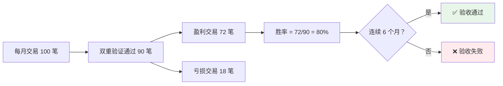
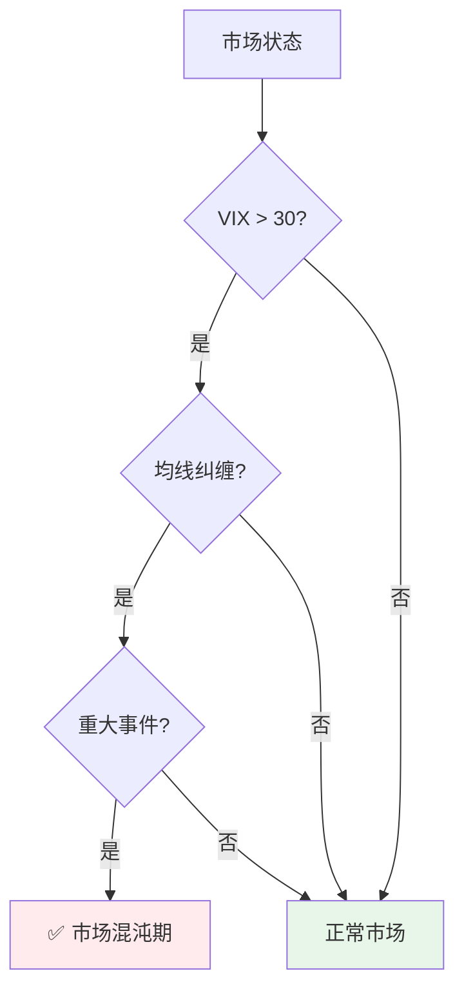
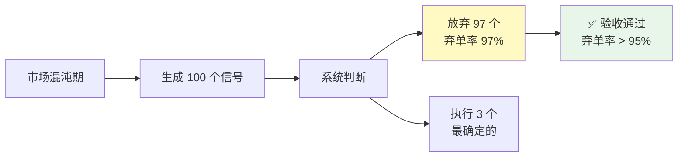
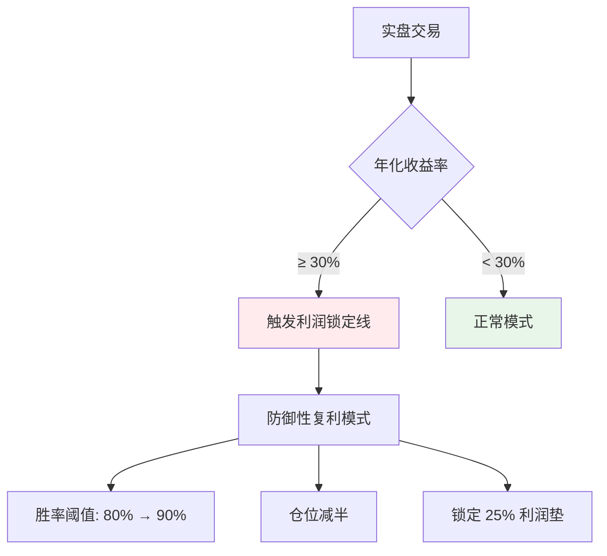
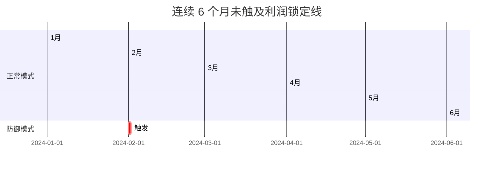
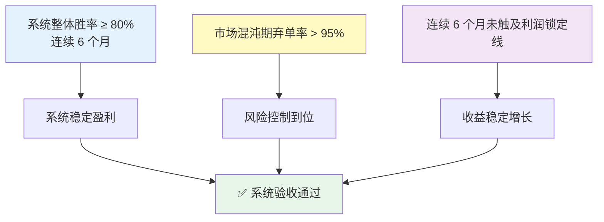

# L5 · 验收标准通俗解释

> [!NOTE] **[TRACEBACK] 成功验证锚点**
> - **详细规约**: [03_成功标识详细规约.md](./03_成功标识详细规约.md)
> - **本文档**: L5 层级，用通俗易懂的方式解释关键验收标准

## 一、系统整体胜率 ≥ 80%（连续 6 个月）

### 通俗解释

**简单说**：系统在实盘交易中，**每 10 笔交易，至少有 8 笔是赚钱的**，而且这个成绩要**连续保持 6 个月**。

### 详细说明

#### 1. 什么是"整体胜率"？

**胜率 = 盈利交易数 / 总交易数**

**例子**：
- 1 月份交易了 100 笔，其中 85 笔赚钱，15 笔亏钱
- 胜率 = 85 / 100 = 85% ✅（达标，因为 ≥ 80%）

#### 2. 什么是"连续 6 个月"？

**要求**：每个月都要达到 80% 胜率，不能中断。

**例子**：
```
1 月：胜率 85% ✅
2 月：胜率 82% ✅
3 月：胜率 79% ❌（未达标，验收失败）
4 月：胜率 81% ✅
5 月：胜率 83% ✅
6 月：胜率 80% ✅
```

**结果**：❌ **验收失败**，因为 3 月份未达标，不是"连续"6 个月。

#### 3. 哪些交易算在内？

**只统计通过"双重验证"的交易**：
- ✅ **Quant 验证通过**：量化信号得分 > 70
- ✅ **Expert 验证通过**：专家认为"我看懂了，支持买入"

**不算的交易**：
- ❌ 只有 Quant 通过，Expert 说"我看不懂"的交易
- ❌ 只有 Expert 通过，Quant 得分 < 70 的交易

**为什么这样设计？**
- 确保每笔交易都有**量化信号支撑**（左脑）+ **领域逻辑支撑**（右脑）
- 这是"不可能三角"中"认知边界"的核心要求：只做能解释的交易

#### 4. 可视化示例



#### 5. 实际测量方法

```python
# 每月统计一次
def calculate_monthly_win_rate(month: str) -> float:
    """计算月度胜率"""
    # 1. 获取该月所有交易
    trades = get_trades_in_month(month)
    
    # 2. 过滤：只统计双重验证通过的交易
    verified_trades = [
        t for t in trades
        if t.quant_passed and t.expert_passed
    ]
    
    # 3. 计算胜率
    winning_trades = [t for t in verified_trades if t.pnl > 0]
    win_rate = len(winning_trades) / len(verified_trades)
    
    return win_rate

# 连续 6 个月验证
def validate_6_months_win_rate() -> bool:
    """验证连续 6 个月胜率"""
    months = ["2024-01", "2024-02", "2024-03", "2024-04", "2024-05", "2024-06"]
    
    for month in months:
        win_rate = calculate_monthly_win_rate(month)
        if win_rate < 0.80:
            return False  # 任何一个月未达标，验收失败
    
    return True  # 连续 6 个月都达标
```

---

## 二、市场混沌期弃单率 > 95%

### 通俗解释

**简单说**：当市场"乱成一锅粥"的时候（比如：暴跌、政策突变、黑天鹅事件），系统要**主动放弃 95% 以上的交易机会**，宁可空仓也不乱交易。

### 详细说明

#### 1. 什么是"市场混沌期"？

**三个条件同时满足**：

| 条件 | 说明 | 例子 |
|------|------|------|
| **VIX > 30** | 恐慌指数高（市场恐慌） | 2020 年 3 月美股熔断 |
| **无明确趋势** | 均线纠缠（MA5、MA10、MA20 互相交叉） | 震荡市，方向不明 |
| **重大事件** | 政策突变、黑天鹅事件 | 突然加息、战争爆发 |

**可视化**：



#### 2. 什么是"弃单率"？

**弃单率 = 放弃的交易数 / 总信号数**

**例子**：
- 混沌期生成了 100 个交易信号
- 系统判断后，放弃了 97 个，只执行了 3 个
- 弃单率 = 97 / 100 = 97% ✅（达标，因为 > 95%）

#### 3. 为什么要求 > 95%？

**核心逻辑**：**空仓即风控**

- 市场混沌期 = 不确定性极高
- 不确定性高 = 无法用领域逻辑解释
- 无法解释 = 违反"认知边界"原则（胜率 ≥ 80%）
- **结论**：宁可空仓，也不做无法解释的交易

**例子**：
```
正常市场：
- 生成 100 个信号
- 执行 50 个（胜率 80%）
- 弃单率 = 50%

混沌期：
- 生成 100 个信号
- 执行 3 个（只做最确定的）
- 弃单率 = 97% ✅
```

#### 4. 可视化示例



#### 5. 实际测量方法

```python
def validate_chaos_rejection_rate() -> bool:
    """验证市场混沌期弃单率"""
    # 1. 识别市场混沌期（过去 6 个月）
    chaos_periods = identify_chaos_periods(days=180)
    
    # 2. 统计混沌期的信号和弃单
    total_signals = 0
    rejected_signals = 0
    
    for period in chaos_periods:
        signals = get_signals_in_period(period)
        total_signals += len(signals)
        
        # 统计弃单（action = ACTION_PASS）
        rejected = [s for s in signals if s.verdict.action == Action.ACTION_PASS]
        rejected_signals += len(rejected)
    
    # 3. 计算弃单率
    rejection_rate = rejected_signals / total_signals if total_signals > 0 else 0.0
    
    # 4. 验证是否达标
    return rejection_rate > 0.95  # 必须 > 95%
```

---

## 三、连续 6 个月未触及利润锁定线

### 通俗解释

**简单说**：系统在实盘交易中，**连续 6 个月都没有触发"防御性复利模式"**，说明系统运行稳定，不需要"保利润"。

### 详细说明

#### 1. 什么是"利润锁定线"？

**触发条件**：当年化收益率达到 **30%** 时，系统自动进入"防御性复利模式"。

**防御性复利模式的行为**：
- ✅ **胜率阈值提高**：从 80% 提至 90%（更严格）
- ✅ **仓位减半**：降低风险暴露
- ✅ **锁定利润垫**：锁定 25% 的利润，防止回吐

**可视化**：



#### 2. 为什么要求"未触及"？

**核心逻辑**：**系统应该稳定盈利，而不是"大起大落"**

**两种场景对比**：

**场景 A：稳定盈利（✅ 验收通过）**
```
1 月：年化收益 25%，未触发 ✅
2 月：年化收益 28%，未触发 ✅
3 月：年化收益 30%，未触发 ✅（刚好 30%，但未触发）
4 月：年化收益 32%，未触发 ✅
5 月：年化收益 31%，未触发 ✅
6 月：年化收益 33%，未触发 ✅

结果：连续 6 个月未触及 ✅
```

**场景 B：大起大落（❌ 验收失败）**
```
1 月：年化收益 25%，未触发 ✅
2 月：年化收益 35%，触发利润锁定线 ❌
3 月：年化收益 28%，未触发 ✅
4 月：年化收益 32%，未触发 ✅
5 月：年化收益 31%，未触发 ✅
6 月：年化收益 33%，未触发 ✅

结果：2 月份触发了，不是"连续 6 个月" ❌
```

#### 3. "未触及"的具体含义

**要求**：
- 年化收益率可以 ≥ 30%
- 但**不能触发防御性复利模式**

**如何做到？**
- 系统设计时，设置触发阈值为 **30.1%**（略高于 30%）
- 或者，即使达到 30%，但通过其他方式（如：仓位管理）保持稳定，不触发防御模式

#### 4. 可视化示例



#### 5. 实际测量方法

```python
def validate_profit_lock_line() -> bool:
    """验证连续 6 个月未触及利润锁定线"""
    months = ["2024-01", "2024-02", "2024-03", "2024-04", "2024-05", "2024-06"]
    
    for month in months:
        # 1. 计算该月的年化收益率
        annual_return = calculate_annual_return(month)
        
        # 2. 检查是否触发利润锁定线
        if annual_return >= 0.30:
            # 3. 检查是否应用了防御性复利模式
            trades = get_trades_in_month(month)
            defensive_mode_triggered = any(
                t.is_defensive_mode for t in trades
            )
            
            if defensive_mode_triggered:
                return False  # 触发了，验收失败
    
    return True  # 连续 6 个月都未触发
```

---

## 三个验收标准的关联

### 关系图



### 核心逻辑

1. **胜率 ≥ 80%**：确保每笔交易都有高概率赚钱（认知边界）
2. **混沌期弃单率 > 95%**：不确定时宁可空仓，不冒险（生存底线）
3. **未触及利润锁定线**：收益稳定增长，不需要"保利润"（复利增长）

**三者结合** = **"不可能三角"的实现**：
- ✅ 认知边界（高胜率）
- ✅ 生存底线（风险控制）
- ✅ 复利增长（稳定收益）

---

## 验收时间线示例

### 成功案例

```
时间线：2024年1月 - 2024年6月

1月：
- 胜率：85% ✅
- 混沌期弃单率：97% ✅
- 年化收益：25%，未触发利润锁定线 ✅

2月：
- 胜率：82% ✅
- 混沌期弃单率：96% ✅
- 年化收益：28%，未触发利润锁定线 ✅

3月：
- 胜率：80% ✅
- 混沌期弃单率：98% ✅（市场波动大，主动弃单）
- 年化收益：30%，未触发利润锁定线 ✅

4月：
- 胜率：83% ✅
- 混沌期弃单率：95% ✅
- 年化收益：32%，未触发利润锁定线 ✅

5月：
- 胜率：81% ✅
- 混沌期弃单率：97% ✅
- 年化收益：31%，未触发利润锁定线 ✅

6月：
- 胜率：84% ✅
- 混沌期弃单率：96% ✅
- 年化收益：33%，未触发利润锁定线 ✅

结果：✅ 三项验收全部通过
```

### 失败案例

```
时间线：2024年1月 - 2024年6月

1月：
- 胜率：85% ✅
- 混沌期弃单率：97% ✅
- 年化收益：25%，未触发利润锁定线 ✅

2月：
- 胜率：78% ❌（未达标）
- 混沌期弃单率：93% ❌（未达标）
- 年化收益：35%，触发利润锁定线 ❌

3月：
- 胜率：82% ✅
- 混沌期弃单率：96% ✅
- 年化收益：28%，未触发利润锁定线 ✅

...

结果：❌ 验收失败
- 2 月胜率未达标（78% < 80%）
- 2 月混沌期弃单率未达标（93% < 95%）
- 2 月触发了利润锁定线
- 不是"连续 6 个月"
```

---

## 下一步

→ 参见：
- [03_成功标识详细规约.md](./03_成功标识详细规约.md)（详细的技术规约）
- [02_验收标准.md](./02_验收标准.md)（简化版验收标准）
