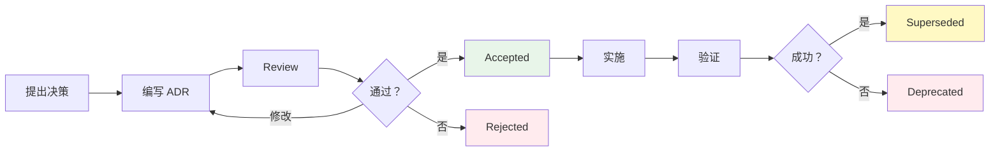
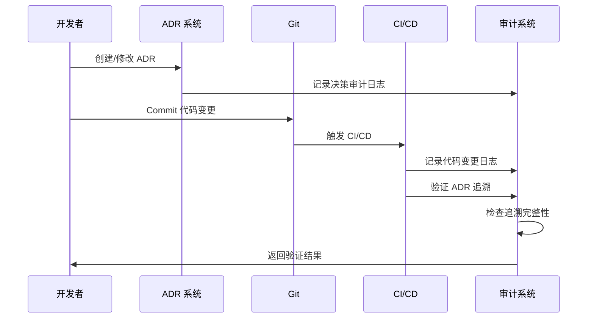

# L6 · 追溯与审计详细规约

> [!NOTE] **[TRACEBACK] 追溯审计锚点**
> - **顶层概念**: [一句话定义与核心价值](../01_顶层概念/01_一句话定义与核心价值.md)
> - **原子规约**: [架构设计共识与协作元规则](../03_原子目标与规约/_共享规约/03_架构设计共识与协作元规则.md)
> - **原子规约**: [运营治理与灾备规约](../03_原子目标与规约/_共享规约/10_运营治理与灾备规约.md)
> - **本文档**: L6 层级，定义追溯与审计的详细规约（生产工业级）

## 核心理念

**追溯即责任，审计即合规**。所有决策、变更、操作都必须可追溯、可审计、可问责。

---

## A. ADR 管理流程 (Architecture Decision Records)

### 1. ADR 生命周期



### 2. ADR 标准模板

```markdown
# ADR-XXX: [标题]

## 状态
[Proposed / Accepted / Rejected / Superseded / Deprecated]

## Context (背景)
[描述当前情况、问题、约束条件]

## Decision (决策)
[明确说明做出的决策]

## Consequences (后果)
[+] 正面影响
[-] 负面影响
[!] 风险与注意事项

## Alternatives Considered (考虑的替代方案)
[列出并说明为什么没有选择其他方案]

## Compliance Check (合规检查)
[检查是否符合合规性要求]

## Traceability (追溯性)
- **L1 价值点**: [链接到 L1 文档]
- **L2 维度**: [链接到 L2 文档]
- **L3 规约**: [链接到 L3 文档]
- **相关 ADR**：[相关 ADR 列表]

## Implementation Notes (实施说明)
[实施时的注意事项、依赖关系]

## Review History (审查历史)
- YYYY-MM-DD: 初始创建
- YYYY-MM-DD: 状态变更（Accepted）
```

### 3. ADR 目录结构

```
diting-doc/06_追溯与审计/ADR/
├── README.md                    # ADR 索引
├── 001-project-naming.md        # ADR-01: 动态命名
├── 002-moe-architecture.md      # ADR-02: MoE 架构
├── 003-spot-ecs-compute-storage-separation.md  # ADR-03: Spot ECS + 存算分离
├── 004-human-in-the-loop.md     # ADR-04: Human-in-the-Loop
├── 005-defensive-compound-mode.md  # ADR-05: 防御性复利模式
└── templates/
    └── adr_template.md           # ADR 模板
```

### 4. ADR-01: 采用 ${PROJECT_KEY} 动态命名

```markdown
# ADR-001: 采用 ${PROJECT_KEY} 动态命名

## 状态
Accepted

## Context (背景)
项目需要在多个环境（dev/staging/prod）和多个实例中运行，需要统一的命名规范来避免资源冲突和管理混乱。

## Decision (决策)
采用 `${PROJECT_KEY}` 动态命名策略：
- 项目代号：`diting`
- 命名格式：`${PROJECT_KEY}-${component}-${environment}`
- 示例：`diting-scanner-prod`, `diting-moe-staging`

## Consequences (后果)
[+] 统一命名规范，避免资源冲突
[+] 支持多环境部署
[+] 便于资源管理和成本追踪
[-] 需要维护命名规范文档

## Alternatives Considered (考虑的替代方案)
1. 固定命名：简单但无法支持多环境
2. UUID 命名：唯一但不可读
3. **选择方案 3**：动态命名（可读 + 唯一）

## Compliance Check (合规检查)
✅ 符合云资源命名规范
✅ 支持资源标签管理

## Traceability (追溯性)
- **L1 价值点**: [核心价值：可追溯性](../01_顶层概念/01_一句话定义与核心价值.md)
- **L2 维度**: [技术栈与架构维度](../02_战略维度/产品设计/02_技术栈与架构维度.md)
- **L3 规约**: [三位一体仓库规约](../03_原子目标与规约/_共享规约/02_三位一体仓库规约.md)

## Implementation Notes (实施说明)
- Terraform 变量：`var.project_key = "diting"`
- K8s 命名空间：`diting-${environment}`
- 资源标签：`project: diting`, `environment: ${env}`
```

### 5. ADR-02: 采用 MoE (混合专家) 架构

```markdown
# ADR-002: 采用 MoE (混合专家) 架构

## 状态
Accepted

## Context (背景)
需要同时满足"认知边界"（胜率 ≥ 85%）和"复利增长"（年化 ≥ 45%）的要求。单一模型无法同时满足这两个目标。

## Decision (决策)
采用 Neuro-Symbolic MoE（神经符号混合专家）架构：
- Router 根据 Domain Tag 动态选择专家
- 垂类专家（Agri/Tech/Geo）在其领域内胜率 ≥ 85%
- 专家意见与量化信号强制交集

## Consequences (后果)
[+] 垂类专家胜率比通用 LLM 高 15% 以上
[+] 支持"认知边界"要求（只做能解释的交易）
[+] 支持"复利增长"要求（多策略池并发）
[-] 架构复杂度增加
[-] 需要维护多个专家模型

## Alternatives Considered (考虑的替代方案)
1. 单一通用 LLM：简单但胜率不足
2. 纯量化策略：胜率不稳定
3. **选择方案 3**：MoE 架构（平衡胜率和收益）

## Compliance Check (合规检查)
✅ 符合"认知边界"要求（可解释性）
✅ 符合"复利增长"要求（多策略池）

## Traceability (追溯性)
- **L1 价值点**: [核心价值：不可能三角](../01_顶层概念/01_一句话定义与核心价值.md)
- **L2 维度**: [技术栈与架构维度](../02_战略维度/产品设计/02_技术栈与架构维度.md)
- **L3 规约**: [核心公式与MoE架构规约](../03_原子目标与规约/_共享规约/01_核心公式与MoE架构规约.md)
- **相关 ADR**：ADR-001

## Implementation Notes (实施说明)
- Router 实现：LangGraph
- 专家实现：DeepSeek-R1 + 领域知识库
- 路由逻辑：基于 Domain Tag 和 Market Regime
```

### 6. ADR-03: 采用 Spot ECS + 存算分离

```markdown
# ADR-003: 采用 Spot ECS + 存算分离

## 状态
Accepted

## Context (背景)
需要降低基础设施成本，同时保证数据安全和高可用性。

## Decision (决策)
采用 Spot ECS（竞价实例）+ 存算分离架构：
- 计算层：Spot ECS（成本降低 70%）
- 存储层：ESSD PL1（高性能）+ OSS（冷存储）
- 数据分离：L1 Hot（TimescaleDB）、L2 Warm（PostgreSQL）、L3 Cold（OSS）

## Consequences (后果)
[+] 成本降低 70%（Spot 实例）
[+] 数据安全（存算分离，数据不丢失）
[+] 支持竞价实例回收恢复（L2 故障恢复）
[-] Spot 实例可能被回收（需要优雅关闭流程）
[-] 架构复杂度增加

## Alternatives Considered (考虑的替代方案)
1. 包年包月 ECS：稳定但成本高
2. Spot ECS + 本地存储：成本低但数据不安全
3. **选择方案 3**：Spot ECS + 存算分离（平衡成本和安全性）

## Compliance Check (合规检查)
✅ 符合成本治理要求
✅ 符合数据安全要求（存算分离）

## Traceability (追溯性)
- **L1 价值点**: [核心价值：成本控制](../01_顶层概念/02_战略目标与ROI.md)
- **L2 维度**: [成本治理维度](../02_战略维度/产品设计/07_成本治理维度.md)
- **L2 维度**: [数据架构与分层存储维度](../02_战略维度/产品设计/03_数据架构与分层存储维度.md)
- **L3 规约**: [运营治理与灾备规约](../03_原子目标与规约/_共享规约/10_运营治理与灾备规约.md)

## Implementation Notes (实施说明)
- Terraform 模块：`modules/ecs_spot/`
- 数据备份：WAL-G + OSS
- 优雅关闭：Metadata Service 监听 + kubectl drain
```

### 7. ADR-04: 采用 Human-in-the-Loop (买入确认/止损自动) 模式

```markdown
# ADR-004: 采用 Human-in-the-Loop (买入确认/止损自动) 模式

## 状态
Accepted

## Context (背景)
金融交易系统需要合规性保障，同时需要快速响应止损信号。

## Decision (决策)
采用 Human-in-the-Loop 模式：
- **买入**：推送至手机 → 人工确认 → 机器拆单执行
- **止盈**：推送至手机 → 人工确认 → 机器执行
- **止损**：机器自动执行（最高权限，无需审批）

## Consequences (后果)
[+] 符合合规性要求（人工审批）
[+] 止损快速响应（< 500ms）
[+] 降低误操作风险
[-] 买入/止盈需要人工确认（可能延迟）

## Alternatives Considered (考虑的替代方案)
1. 全自动交易：快速但合规风险高
2. 全人工交易：合规但效率低
3. **选择方案 3**：Human-in-the-Loop（平衡合规和效率）

## Compliance Check (合规检查)
✅ 符合程序化交易报备要求
✅ 符合交易行为合规性要求

## Traceability (追溯性)
- **L1 价值点**: [核心价值：合规性](../01_顶层概念/01_一句话定义与核心价值.md)
- **L2 维度**: [安全与机密治理维度](../02_战略维度/产品设计/05_安全与机密治理维度.md)
- **L3 规约**: [核心模块架构规约](../03_原子目标与规约/_共享规约/09_核心模块架构规约.md)
- **L3 规约**: [运营治理与灾备规约](../03_原子目标与规约/_共享规约/10_运营治理与灾备规约.md)

## Implementation Notes (实施说明)
- 执行网关：Redis Streams → OMS Lite → MiniQMT
- 通知渠道：手机推送（超时 5 分钟）
- 止损优先级：AUTO_EXECUTED（无需审批）
```

### 8. ADR-05: 引入防御性复利模式

```markdown
# ADR-005: 引入防御性复利模式

## 状态
Accepted

## Context (背景)
当年化收益达到 30% 时，需要保护利润，防止回吐。（与 L1 不可能三角 45% 目标区分，见 ADR-005）

## Decision (决策)
引入防御性复利模式：
- **触发条件**：年化收益 ≥ 30%
- **动作**：
  - 胜率阈值从 85% 提至 90%
  - 仓位减半
  - 锁定 25% 利润垫

## Consequences (后果)
[+] 保护利润，防止回吐
[+] 降低风险暴露
[-] 可能降低收益增长速度
[-] 需要更严格的信号筛选

## Alternatives Considered (考虑的替代方案)
1. 继续激进策略：收益高但风险大
2. 完全停止交易：安全但无法增长
3. **选择方案 3**：防御性复利模式（平衡收益和风险）

## Compliance Check (合规检查)
✅ 符合"生存底线"要求（回撤 < 12%）
✅ 符合"复利增长"要求（稳定收益）

## Traceability (追溯性)
- **L1 价值点**: [核心价值：不可能三角](../01_顶层概念/01_一句话定义与核心价值.md)
- **L2 维度**: [技术栈与架构维度](../02_战略维度/产品设计/02_技术栈与架构维度.md)
- **L3 规约**: [核心模块架构规约](../03_原子目标与规约/_共享规约/09_核心模块架构规约.md)

## Implementation Notes (实施说明)
- 判官模块：Module D (The Gavel)
- 配置项：`defensive_mode.enabled = true`
- 验收标准：连续 6 个月未触及利润锁定线
```

---

## B. 追溯矩阵 (Traceability Matrix)

### 1. 全链路追溯矩阵

| L1 价值点 | L2 维度 | L3 规约 | L4 阶段 | L5 验收 | L6 ADR | 状态 |
|----------|--------|--------|--------|--------|--------|------|
| **认知边界**：胜率 ≥ 85% | 技术栈与架构 | 核心公式与MoE架构规约 | Phase1-ModuleC | 整体胜率 ≥ 85% | ADR-002 | ✅ |
| **认知边界**：胜率 ≥ 85% | 数据架构 | 数据版本控制规约 | Phase1-ModuleA | 可解释标的占比 ≥ 10% | ADR-002 | ✅ |
| **复利增长**：年化 ≥ 45% | 技术栈与架构 | 核心公式与MoE架构规约 | Phase1-ModuleB | CAGR ≥ 45% | ADR-002 | ✅ |
| **复利增长**：年化 ≥ 45% | 成本治理 | 动态配置中心规约 | Phase2-CashDrag | 现金拖累监控 | ADR-003 | ✅ |
| **生存底线**：回撤 < 12% | 技术栈与架构 | 核心模块架构规约 | Phase1-ModuleE | MaxDD < 12% | ADR-002 | ✅ |
| **生存底线**：回撤 < 12% | 安全治理 | 运营治理与灾备规约 | Phase2-DR | RTO < 5 分钟 | ADR-003 | ✅ |
| **合规性** | 安全治理 | 运营治理与灾备规约 | Phase1-ModuleF | 通道合规率 100% | ADR-004 | ✅ |
| **成本控制** | 成本治理 | 动态配置中心规约 | Phase2-CostGov | Token 成本 ROI | ADR-003 | ✅ |

### 2. ADR 追溯矩阵

| ADR | 决策内容 | L1 价值点 | L2 维度 | L3 规约 | L4 阶段 | L5 验收 | 状态 |
|-----|---------|----------|--------|--------|--------|--------|------|
| **ADR-001** | 动态命名 | 可追溯性 | 技术栈与架构 | 三位一体仓库规约 | Phase0-Infra | 资源命名规范 | ✅ |
| **ADR-002** | MoE 架构 | 不可能三角 | 技术栈与架构 | 核心公式与MoE架构规约 | Phase1-ModuleC | 专家胜率 ≥ 85% | ✅ |
| **ADR-003** | Spot ECS + 存算分离 | 成本控制 | 成本治理、数据架构 | 运营治理与灾备规约 | Phase0-Infra | RTO < 5 分钟 | ✅ |
| **ADR-004** | Human-in-the-Loop | 合规性 | 安全治理 | 核心模块架构规约 | Phase1-ModuleF | 通道合规率 100% | ✅ |
| **ADR-005** | 防御性复利模式 | 不可能三角 | 技术栈与架构 | 核心模块架构规约 | Phase2-Defensive | 未触及利润锁定线 | ✅ |

---

## C. 审计日志体系 (Audit Logging)

### 1. 审计日志分类

| 日志类型 | 记录内容 | 保留期限 | 存储位置 | 不可修改性 |
|---------|---------|---------|---------|-----------|
| **决策审计日志** | ADR 创建、修改、状态变更 | 永久 | PostgreSQL + Git | ✅ 是 |
| **交易审计日志** | 所有交易订单（买入/卖出/止损） | 7 年 | PostgreSQL + OSS | ✅ 是 |
| **合规审计日志** | 合规性违规、通道验证失败 | 7 年 | PostgreSQL + OSS | ✅ 是 |
| **配置变更日志** | 配置中心变更、版本回滚 | 永久 | Git + etcd | ✅ 是 |
| **操作审计日志** | 关键操作（权限变更、密钥轮换） | 7 年 | PostgreSQL + OSS | ✅ 是 |
| **数据变更日志** | 数据版本变更、快照创建 | 永久 | DVC + OSS | ✅ 是 |

### 2. 决策审计日志 Schema

```sql
-- PostgreSQL 表：决策审计日志
CREATE TABLE adr_audit_logs (
    id SERIAL PRIMARY KEY,
    adr_id VARCHAR(50) NOT NULL,
    action VARCHAR(50) NOT NULL,  -- CREATE, UPDATE, STATUS_CHANGE, SUPERSEDE, DEPRECATE
    old_status VARCHAR(50),
    new_status VARCHAR(50),
    changed_by VARCHAR(100),
    change_reason TEXT,
    timestamp TIMESTAMP DEFAULT NOW(),
    metadata JSONB,
    UNIQUE(adr_id, timestamp)
);

CREATE INDEX idx_adr_audit_logs_adr_id ON adr_audit_logs(adr_id);
CREATE INDEX idx_adr_audit_logs_timestamp ON adr_audit_logs(timestamp);
```

### 3. 交易审计日志 Schema

```sql
-- PostgreSQL 表：交易审计日志（不可修改）
CREATE TABLE trade_audit_logs (
    id SERIAL PRIMARY KEY,
    order_id VARCHAR(100) NOT NULL,
    decision_id VARCHAR(100),
    symbol VARCHAR(20) NOT NULL,
    action VARCHAR(20) NOT NULL,  -- BUY, SELL, STOP_LOSS
    quantity INTEGER NOT NULL,
    price DECIMAL(10, 2),
    audit_status VARCHAR(50),  -- PENDING_APPROVAL, APPROVED, AUTO_EXECUTED
    approved_by VARCHAR(100),
    execution_time TIMESTAMP,
    reasoning_summary TEXT,
    quant_score DECIMAL(5, 2),
    expert_confidence DECIMAL(3, 2),
    win_rate_prediction DECIMAL(3, 2),
    timestamp TIMESTAMP DEFAULT NOW(),
    log_data JSONB NOT NULL,  -- 完整日志数据（JSON）
    checksum VARCHAR(64) NOT NULL,  -- SHA256 校验和
    UNIQUE(order_id)
);

-- 触发器：防止修改
CREATE TRIGGER prevent_trade_audit_log_update
    BEFORE UPDATE ON trade_audit_logs
    FOR EACH ROW
    EXECUTE FUNCTION raise_exception();

CREATE INDEX idx_trade_audit_logs_symbol ON trade_audit_logs(symbol);
CREATE INDEX idx_trade_audit_logs_timestamp ON trade_audit_logs(timestamp);
CREATE INDEX idx_trade_audit_logs_decision_id ON trade_audit_logs(decision_id);
```

### 4. 合规审计日志 Schema

```sql
-- PostgreSQL 表：合规审计日志
CREATE TABLE compliance_audit_logs (
    id SERIAL PRIMARY KEY,
    violation_type VARCHAR(50) NOT NULL,  -- HIGH_FREQ_CANCELLATION, INVALID_CHANNEL, etc.
    violation_details JSONB NOT NULL,
    detected_at TIMESTAMP DEFAULT NOW(),
    resolved_at TIMESTAMP,
    resolution_action TEXT,
    severity VARCHAR(20),  -- CRITICAL, HIGH, MEDIUM, LOW
    log_data JSONB NOT NULL,
    checksum VARCHAR(64) NOT NULL,
    UNIQUE(id)
);

CREATE INDEX idx_compliance_audit_logs_type ON compliance_audit_logs(violation_type);
CREATE INDEX idx_compliance_audit_logs_detected_at ON compliance_audit_logs(detected_at);
```

---

## D. 变更追踪 (Change Tracking)

### 1. 变更分类

| 变更类型 | 影响范围 | 追溯要求 | 审批要求 |
|---------|---------|---------|---------|
| **架构变更** | 系统架构 | ADR 必须 | 必须审批 |
| **配置变更** | 运行时配置 | 配置版本控制 | 人工审批（风控阈值） |
| **代码变更** | 业务逻辑 | Git Commit + PR | Code Review |
| **数据变更** | 数据模型 | Schema 版本控制 | ADR（如需要） |
| **协议变更** | 通信协议 | Protocol 版本控制 | ADR 必须 |

### 2. 变更追溯流程



### 3. 变更影响分析

```python
# diting-core/diting/audit/change_impact_analyzer.py
class ChangeImpactAnalyzer:
    """变更影响分析器"""
    
    def analyze_impact(self, change: Change) -> ImpactAnalysis:
        """分析变更影响"""
        # 1. 识别受影响的范围
        affected_components = self._identify_affected_components(change)
        
        # 2. 识别受影响的 ADR
        affected_adrs = self._identify_affected_adrs(change)
        
        # 3. 识别受影响的验收标准
        affected_acceptance_criteria = self._identify_affected_acceptance_criteria(change)
        
        # 4. 评估风险等级
        risk_level = self._assess_risk_level(change, affected_components)
        
        return ImpactAnalysis(
            change=change,
            affected_components=affected_components,
            affected_adrs=affected_adrs,
            affected_acceptance_criteria=affected_acceptance_criteria,
            risk_level=risk_level
        )
```

---

## E. 版本追溯 (Version Traceability)

### 1. 版本追溯矩阵

| 组件 | 版本标识 | Git Commit | ADR | 配置版本 | 数据版本 | 部署版本 |
|------|---------|-----------|-----|---------|---------|---------|
| **diting-core** | v1.2.0 | abc123 | ADR-002 | config-v3 | data-v5 | deploy-v2 |
| **diting-infra** | v1.1.0 | def456 | ADR-003 | - | - | deploy-v2 |
| **diting-doc（ADR）** | v1.0.0 | ghi789 | ADR-001 | - | - | - |

### 2. 版本追溯查询

```python
# diting-core/diting/audit/version_tracer.py
class VersionTracer:
    """版本追溯器"""
    
    def trace_decision(self, decision_id: str) -> DecisionTrace:
        """追溯决策的完整版本信息"""
        # 1. 获取决策快照
        snapshot = decision_snapshot_manager.get_snapshot(decision_id)
        
        # 2. 追溯代码版本
        code_version = git.get_version_at_time(snapshot.timestamp)
        
        # 3. 追溯配置版本
        config_version = config_manager.get_version_at_time(snapshot.timestamp)
        
        # 4. 追溯数据版本
        data_version = data_version_manager.get_version_at_time(snapshot.timestamp)
        
        # 5. 追溯 ADR
        adrs = adr_manager.get_adrs_at_time(snapshot.timestamp)
        
        return DecisionTrace(
            decision_id=decision_id,
            code_version=code_version,
            config_version=config_version,
            data_version=data_version,
            adrs=adrs,
            snapshot=snapshot
        )
```

---

## F. 操作追溯 (Operation Traceability)

### 1. 操作审计日志

```python
# diting-core/diting/audit/operation_auditor.py
class OperationAuditor:
    """操作审计器"""
    
    def audit_operation(
        self,
        operation: str,
        user_id: str,
        parameters: dict,
        result: dict
    ):
        """记录操作审计日志"""
        audit_log = {
            "operation": operation,
            "user_id": user_id,
            "ip_address": get_client_ip(),
            "timestamp": datetime.now().isoformat(),
            "parameters": parameters,
            "result": result,
            "checksum": self._calculate_checksum(operation, parameters, result)
        }
        
        # 写入不可修改的审计日志表
        db.execute("""
            INSERT INTO operation_audit_logs (log_data, checksum)
            VALUES (%s, %s)
        """, json.dumps(audit_log), audit_log["checksum"])
```

### 2. 关键操作列表

| 操作类型 | 审计要求 | 审批要求 | 追溯要求 |
|---------|---------|---------|---------|
| **执行订单** | ✅ 必须 | ✅ 买入/止盈需审批 | ✅ 追溯到决策 ID |
| **修改风控阈值** | ✅ 必须 | ✅ 必须审批 | ✅ 追溯到 ADR |
| **修改配置** | ✅ 必须 | ⚠️ 风控阈值需审批 | ✅ 追溯到配置版本 |
| **密钥轮换** | ✅ 必须 | ✅ 必须审批 | ✅ 追溯到操作日志 |
| **数据恢复** | ✅ 必须 | ✅ 必须审批 | ✅ 追溯到备份版本 |

---

## G. 数据追溯 (Data Traceability)

### 1. 数据版本追溯

```python
# diting-core/diting/audit/data_tracer.py
class DataTracer:
    """数据追溯器"""
    
    def trace_data_lineage(self, decision_id: str) -> DataLineage:
        """追溯数据的完整血缘"""
        # 1. 获取决策快照
        snapshot = decision_snapshot_manager.get_snapshot(decision_id)
        
        # 2. 追溯 OHLCV 数据版本
        ohlcv_version = snapshot.data_versions.ohlcv_version
        ohlcv_lineage = self._trace_ohlcv_lineage(ohlcv_version)
        
        # 3. 追溯新闻数据版本
        news_version = snapshot.data_versions.news_version
        news_lineage = self._trace_news_lineage(news_version)
        
        # 4. 追溯知识图谱版本
        kg_version = snapshot.data_versions.knowledge_graph_version
        kg_lineage = self._trace_kg_lineage(kg_version)
        
        return DataLineage(
            decision_id=decision_id,
            ohlcv_lineage=ohlcv_lineage,
            news_lineage=news_lineage,
            kg_lineage=kg_lineage
        )
```

### 2. 数据完整性验证

```python
def verify_data_integrity(self, version_id: str) -> bool:
    """验证数据完整性"""
    # 1. 从元数据获取文件路径和校验和
    metadata = data_version_metadata.get_version_by_id(version_id)
    
    # 2. 从 OSS 下载文件
    file_content = oss_client.get_object(metadata['file_path'])
    
    # 3. 计算校验和
    calculated_checksum = hashlib.sha256(file_content).hexdigest()
    
    # 4. 对比校验和
    return calculated_checksum == metadata['checksum']
```

---

## H. 合规性审计 (Compliance Audit)

### 1. 合规性审计清单

| 审计项 | 检查内容 | 频率 | 验收标准 |
|--------|---------|------|---------|
| **交易通道合规** | 100% 交易通过合规通道 | 每日 | 合规率 = 100% |
| **程序化交易报备** | 报备文档完整、已授权 | 部署前 | 授权状态 = Approved |
| **高频撤单监控** | 每秒撤单数 ≤ 5 笔 | 实时 | 违规次数 = 0 |
| **模拟点击检测** | 代码审计 + 运行时检测 | 每次部署 | 检测结果 = 无 |
| **数据加密** | 敏感数据加密率 = 100% | 每次存储 | 加密率 = 100% |
| **访问控制** | 关键操作权限验证 = 100% | 每次操作 | 保护率 = 100% |
| **审计日志完整性** | 审计日志覆盖率 = 100% | 每日 | 覆盖率 = 100% |

### 2. 合规性审计报告

```python
# diting-core/diting/audit/compliance_auditor.py
class ComplianceAuditor:
    """合规性审计器"""
    
    def generate_compliance_report(self, period_days: int = 30) -> ComplianceReport:
        """生成合规性审计报告"""
        # 1. 交易通道合规性
        channel_compliance = self._audit_trading_channels(period_days)
        
        # 2. 程序化交易报备
        reporting_compliance = self._audit_programmatic_trading_report()
        
        # 3. 交易行为合规性
        behavior_compliance = self._audit_trading_behavior(period_days)
        
        # 4. 数据安全合规性
        security_compliance = self._audit_data_security()
        
        # 5. 访问控制合规性
        access_control_compliance = self._audit_access_control()
        
        # 6. 审计日志合规性
        audit_log_compliance = self._audit_audit_logging()
        
        # 7. 综合评分
        overall_score = self._calculate_overall_score([
            channel_compliance,
            reporting_compliance,
            behavior_compliance,
            security_compliance,
            access_control_compliance,
            audit_log_compliance
        ])
        
        return ComplianceReport(
            period_days=period_days,
            channel_compliance=channel_compliance,
            reporting_compliance=reporting_compliance,
            behavior_compliance=behavior_compliance,
            security_compliance=security_compliance,
            access_control_compliance=access_control_compliance,
            audit_log_compliance=audit_log_compliance,
            overall_score=overall_score,
            passed=overall_score >= 1.0  # 必须 100% 合规
        )
```

---

## I. 一致性检查 (Consistency Check)

### 1. 层级一致性检查

```python
# diting-core/diting/audit/consistency_checker.py
class ConsistencyChecker:
    """一致性检查器"""
    
    def check_hierarchy_consistency(self) -> ConsistencyReport:
        """检查层级一致性"""
        issues = []
        
        # 1. 检查 L1 → L2 一致性
        l1_l2_issues = self._check_l1_l2_consistency()
        issues.extend(l1_l2_issues)
        
        # 2. 检查 L2 → L3 一致性
        l2_l3_issues = self._check_l2_l3_consistency()
        issues.extend(l2_l3_issues)
        
        # 3. 检查 L3 → L4 一致性
        l3_l4_issues = self._check_l3_l4_consistency()
        issues.extend(l3_l4_issues)
        
        # 4. 检查 L4 → L5 一致性
        l4_l5_issues = self._check_l4_l5_consistency()
        issues.extend(l4_l5_issues)
        
        # 5. 检查追溯锚点格式
        anchor_issues = self._check_traceback_anchors()
        issues.extend(anchor_issues)
        
        return ConsistencyReport(
            issues=issues,
            total_issues=len(issues),
            passed=len(issues) == 0
        )
```

### 2. 术语一致性检查

```python
def check_terminology_consistency(self) -> ConsistencyReport:
    """检查术语一致性"""
    # 1. 提取所有术语定义
    terminology_definitions = self._extract_terminology_definitions()
    
    # 2. 检查冲突
    conflicts = []
    for term, definitions in terminology_definitions.items():
        if len(set(definitions)) > 1:
            conflicts.append({
                "term": term,
                "definitions": definitions,
                "locations": self._get_term_locations(term)
            })
    
    return ConsistencyReport(
        conflicts=conflicts,
        passed=len(conflicts) == 0
    )
```

---

## J. 审计报告生成

### 1. 审计报告模板

```markdown
# 审计报告：YYYY-MM-DD

## 1. 执行摘要
- **审计周期**：YYYY-MM-DD 至 YYYY-MM-DD
- **总体合规率**：XX%
- **关键问题**：X 个
- **建议措施**：X 项

## 2. ADR 审计
- **ADR 总数**：X
- **Accepted**：X
- **Proposed**：X
- **Deprecated**：X
- **追溯完整性**：XX%

## 3. 合规性审计
- **交易通道合规率**：XX%
- **程序化交易报备**：✅/❌
- **交易行为合规**：✅/❌
- **数据安全合规**：✅/❌

## 4. 追溯矩阵审计
- **L1 → L2 追溯完整性**：XX%
- **L2 → L3 追溯完整性**：XX%
- **L3 → L4 追溯完整性**：XX%
- **L4 → L5 追溯完整性**：XX%

## 5. 一致性检查
- **层级一致性**：✅/❌
- **术语一致性**：✅/❌
- **配置一致性**：✅/❌

## 6. 问题清单
1. [问题描述]
   - 影响范围：[L1/L2/L3/L4/L5/L6]
   - 优先级：[P0/P1/P2]
   - 建议措施：[措施描述]

## 7. 改进建议（常驻）

以下为文档体系持续改进的常驻条目，每项注明对应协议小节/脚本及优先级，便于迭代落地与审计对照。

| 序号 | 建议项 | 对应协议/脚本 | 优先级 | 预期收益 | 实施难度 |
|------|--------|----------------|--------|----------|----------|
| 1 | **DNA 为核心实践目标与核心指令引用 AI 可读** | [00_系统规则_通用项目协议](../00_系统规则_通用项目协议.md) §8.4d、§12；规则生效要点表 | 高 | 实践与验收以 DNA 为唯一权威；AI/脚本可无歧义解析引用 | 已落地（协议与检查表已增） |
| 2 | **结构化引用块统一** | §8.4d「本步逻辑引用（AI 可读）」格式与示例表 | 高 | 脚本统一解析、校验核心指令内引用 | 已落地（协议已规定格式） |
| 3 | **DNA 变更触发 L4 复核** | §4.1 强制约定；[list_l4_for_dna_stage.sh](03_审计与一致性报告/list_l4_for_dna_stage.sh) 按 stage_id 列出 04_ 文件 | 中 | 减少 DNA 与 04_ 长期偏离 | 已落地（协议已约定，脚本可选使用） |
| 4 | **核心指令与 DNA 一致性校验** | [check_l4_verification_commands_vs_dna.sh](03_审计与一致性报告/check_l4_verification_commands_vs_dna.sh)（可选） | 中 | 可执行验证清单与 DNA verification_commands 对应可检查 | 已落地（可选脚本） |
| 5 | **工作目录与 DNA work_dir 对齐** | §8.4、§8.4a 工作目录与 DNA 对齐书写规范 | 中 | 减少在错误目录执行导致的验证失效 | 已落地（协议已规定） |

维护约定：L3/DNA/L4 或协议变更后，由当次执行方或审计时复核上表，必要时更新「已落地」状态或补充新建议项。

### 2. 自动化审计报告生成

```python
# diting-core/diting/audit/report_generator.py
class AuditReportGenerator:
    """审计报告生成器"""
    
    def generate_monthly_report(self, month: str) -> AuditReport:
        """生成月度审计报告"""
        # 1. ADR 审计
        adr_audit = adr_auditor.audit_adrs(month)
        
        # 2. 合规性审计
        compliance_audit = compliance_auditor.generate_compliance_report(30)
        
        # 3. 追溯矩阵审计
        traceability_audit = traceability_auditor.audit_traceability_matrix()
        
        # 4. 一致性检查
        consistency_check = consistency_checker.check_all_consistency()
        
        # 5. 生成报告
        report = AuditReport(
            month=month,
            adr_audit=adr_audit,
            compliance_audit=compliance_audit,
            traceability_audit=traceability_audit,
            consistency_check=consistency_check
        )
        
        # 6. 保存报告
        self._save_report(report)
        
        return report
```

---

## K. 追溯查询接口

### 1. 决策追溯查询

```python
# diting-core/diting/audit/traceability_api.py
from fastapi import APIRouter

router = APIRouter()

@router.get("/trace/decision/{decision_id}")
async def trace_decision(decision_id: str):
    """追溯决策的完整信息"""
    tracer = DecisionTracer()
    trace = tracer.trace_decision(decision_id)
    return trace

@router.get("/trace/adr/{adr_id}")
async def trace_adr(adr_id: str):
    """追溯 ADR 的完整信息"""
    tracer = ADRTracer()
    trace = tracer.trace_adr(adr_id)
    return trace

@router.get("/trace/data/{version_id}")
async def trace_data(version_id: str):
    """追溯数据版本的完整信息"""
    tracer = DataTracer()
    trace = tracer.trace_data_lineage(version_id)
    return trace
```

---

## 下一步

→ 参见：
- [01_顶层概念实现完成情况.md](./01_顶层概念实现完成情况.md)
- [02_战略追溯矩阵.md](./02_战略追溯矩阵.md)
- [03_审计与一致性报告/](./03_审计与一致性报告/)
