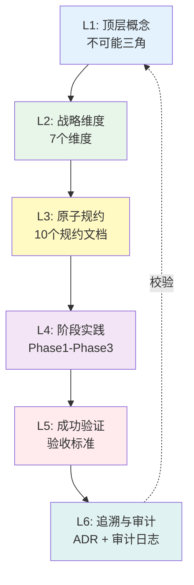

# L6 · 追溯与审计

> [!NOTE] **[TRACEBACK] 追溯审计锚点**
> - **顶层概念**: [一句话定义与核心价值](../01_顶层概念/01_一句话定义与核心价值.md)
> - **本文档**: L6 层级，追溯与审计目录索引

## 目录结构

```
06_追溯与审计/
├── README.md                          # 本索引文档
├── 01_顶层概念实现完成情况.md          # 顶层概念实现完成情况追踪
├── 02_战略追溯矩阵.md                  # 战略追溯矩阵（L1 → L5）
├── 05_L2_L3_映射表.md                  # L2 维度 ↔ L3 规约 映射（§4.1 向下传播按表检查）
├── 04_追溯与审计详细规约.md            # 详细的追溯与审计规约（生产工业级）
├── ADR/                                # 架构决策记录
│   ├── README.md                       # ADR 索引
│   ├── 001-project-naming.md           # ADR-001: 动态命名
│   ├── 002-moe-architecture.md         # ADR-002: MoE 架构
│   ├── 003-spot-ecs-compute-storage-separation.md  # ADR-003: Spot ECS + 存算分离
│   ├── 004-human-in-the-loop.md        # ADR-004: Human-in-the-Loop
│   └── 005-defensive-compound-mode.md  # ADR-005: 防御性复利模式
└── 03_审计与一致性报告/
    └── README.md                       # 审计报告与增量便利贴
```

**冲突与裁决**：同层级或跨层级（含 L3 与代码）冲突时，参见协议 §4.3 / §4.4 冲突与裁决；裁决结果记入本目录下 ADR，并同步到受影响文档。

## 文档索引

### 1. 顶层概念实现完成情况
- **文件**: [01_顶层概念实现完成情况.md](./01_顶层概念实现完成情况.md)
- **内容**: 追踪 L1 顶层概念的实现完成情况，从 L1 → L5 的完整链路

### 2. 战略追溯矩阵
- **文件**: [02_战略追溯矩阵.md](./02_战略追溯矩阵.md)
- **内容**: 战略追溯矩阵（L1 → L5），ADR 追溯矩阵

### 3. 追溯与审计详细规约
- **文件**: [04_追溯与审计详细规约.md](./04_追溯与审计详细规约.md)
- **内容**: 生产工业级的追溯与审计规约，包括：
  - ADR 管理流程
  - 追溯矩阵
  - 审计日志体系
  - 变更追踪
  - 版本追溯
  - 操作追溯
  - 数据追溯
  - 合规性审计
  - 一致性检查
  - 审计报告生成

### 4. ADR（架构决策记录）
- **目录**: [ADR/](./ADR/)
- **内容**: 所有架构决策记录（ADR-001 至 ADR-005）

### 5. 审计与一致性报告
- **目录**: [03_审计与一致性报告/](./03_审计与一致性报告/)
- **内容**: 审计报告与增量便利贴

## ADR 快速索引

| ADR ID | 标题 | 状态 | 关键决策 |
|--------|------|------|---------|
| [ADR-001](./ADR/001-project-naming.md) | 动态命名 | Accepted | 采用 `${PROJECT_KEY}` 动态命名策略 |
| [ADR-002](./ADR/002-moe-architecture.md) | MoE 架构 | Accepted | 采用 Neuro-Symbolic MoE 架构 |
| [ADR-003](./ADR/003-spot-ecs-compute-storage-separation.md) | Spot ECS + 存算分离 | Accepted | 采用 Spot ECS + 存算分离架构 |
| [ADR-004](./ADR/004-human-in-the-loop.md) | Human-in-the-Loop | Accepted | 买入/止盈需人工确认，止损自动执行 |
| [ADR-005](./ADR/005-defensive-compound-mode.md) | 防御性复利模式 | Accepted | 年化收益 ≥ 30% 时触发防御模式（与 L1 不可能三角 45% 目标区分，见 ADR-005 内说明） |

## 追溯矩阵总览

### L1 → L5 追溯链路



## 审计日志分类

| 日志类型 | 保留期限 | 存储位置 | 不可修改性 |
|---------|---------|---------|-----------|
| **决策审计日志** | 永久 | PostgreSQL + Git | ✅ |
| **交易审计日志** | 7 年 | PostgreSQL + OSS | ✅ |
| **合规审计日志** | 7 年 | PostgreSQL + OSS | ✅ |
| **配置变更日志** | 永久 | Git + etcd | ✅ |
| **操作审计日志** | 7 年 | PostgreSQL + OSS | ✅ |
| **数据变更日志** | 永久 | DVC + OSS | ✅ |

## 下一步

→ 参见：
- [04_追溯与审计详细规约.md](./04_追溯与审计详细规约.md)（详细的追溯与审计规约）
- [ADR/](./ADR/)（架构决策记录）
