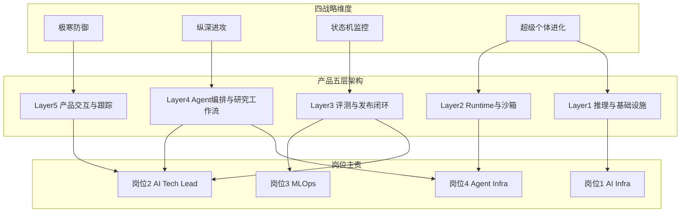

# 四大岗位横向对比总览（对齐产品架构版）

> 基于「岗位-技术提升」目录的岗位分析，并对齐 `diting` 的产品结构图（四战略维度 + 五层架构），用于“岗位能力训练路线”统一导航。

## 一、目录结构

```
岗位-技术提升/
├── 01-AI基础设施研发工程师/
│   ├── 招聘信息.md
│   └── 岗位分析.md
├── 02-AI技术负责人/
│   ├── 招聘信息.md
│   └── 岗位分析.md
├── 03-模型部署工程师-MLOps/
│   ├── 招聘信息.md
│   └── 岗位分析.md
├── 04-智能体基础设施工程师/
│   ├── 招聘信息.md
│   └── 岗位分析.md
└── README-岗位总览与横向对比.md   ← 本文件
```

## 二、四岗位基础信息对比

| 维度 | 01. AI 基础设施研发 | 02. AI 技术负责人 | 03. 模型部署（MLOps） | 04. 智能体基础设施 |
| --- | --- | --- | --- | --- |
| 薪资 | **7-10 万 × 15 薪** | 未明示（对标 120-250 万） | **6-9 万 × 16 薪** | 未明示（对标 80-200 万） |
| 地点 | 上海 · 杨浦 五角场 | **全国任意（Remote）** | 上海 · 浦东 上南 | 未明示 |
| 经验 | 5-10 年 | 3 年+ | 经验不限（实际 5 年+） | 3 年+ |
| 公司 | 大型互联网上市公司 | Web3 / 金融 AI 独角兽 | 中型医疗服务公司 | Agent SaaS / Coding Agent 公司 |
| 行业 | 互联网 · 泛娱乐 | Web3 · 量化金融 | 医疗 AI | AI Agent 平台 |
| 级别 | 高级专家 / P7 | 技术负责人 / 创始工程师 | 资深工程师 / 平台 Lead | 资深 / Principal |

## 三、与产品结构图的对齐关系（重点）

### 1) 四战略维度 × 五层架构 × 岗位主责



### 2) 层级主责简表

| 架构层 | 主责岗位 | 辅助岗位 | 关键产物 |
|---|---|---|---|
| Layer5 产品交互与跟踪 | 岗位 2 | 岗位 3 | 指标体系、优先级、上线门禁 |
| Layer4 Agent 编排与研究工作流 | 岗位 4 | 岗位 2 | 工作流稳定性、结构化输出 |
| Layer3 评测与发布闭环 | 岗位 3 | 岗位 2 | 评测报告、灰度回滚、版本追踪 |
| Layer2 Runtime 与沙箱 | 岗位 4 | 岗位 1 | 会话恢复、隔离策略、审计回收 |
| Layer1 推理与基础设施 | 岗位 1 | 岗位 3 | 推理网关、资源治理、性能报告 |

## 四、四岗位关键技术覆盖清单（按你当前目标）

### 岗位 1（重点）

- GPU 调度与性能治理（利用率、吞吐、P95/P99）
- `vLLM` 与 `Triton/TGI` 推理网关能力
- 分布式训练、checkpoint、恢复演练
- K8s/K3s/ACK 的资源编排与扩缩容
- 可观测与成本治理（FinOps）
- RTC/低延迟链路基础能力

### 岗位 4（重点）

- WebSocket 大规模长连接
- 会话恢复与长任务状态机
- browser/computer-use runtime
- `seccomp` / `nsjail` / `gVisor` / `Firecracker`
- `namespace` / `cgroup` / `eBPF`
- 多租户隔离与资源回收

### 岗位 3

- `MLflow`
- `Kubeflow` / `Airflow`
- `KServe` / `BentoML`
- feature store
- drift detection
- 灰度、回滚、CT、评测门禁

### 岗位 2

- 产品指标体系（效果/效率/成本/风险）
- 需求优先级框架（P0/P1/P2）
- go/no-go 上线决策
- 组织协作边界与流程
- AI 功能商业化判断（ROI）

## 五、技术栈差异（岗位画像）

| 技术领域 | 01 | 02 | 03 | 04 |
| --- | --- | --- | --- | --- |
| **K8s / 云原生** | ★★★★★ | ★★ | ★★★★ | ★★★★★ |
| **GPU 调度 / 性能** | ★★★★★ | ★ | ★★★ | ★★★ |
| **大模型推理（vLLM/Triton）** | ★★★★★ | ★★ | ★★★ | ★★★★ |
| **分布式训练** | ★★★★ | ★ | ★★★ | ★ |
| **LLM 应用（RAG/Agent）** | ★★ | ★★★★★ | ★ | ★★★ |
| **Prompt / Workflow** | ★ | ★★★★★ | ★ | ★★ |
| **MLOps（CI/CD/CT）** | ★★★★ | ★★ | ★★★★★ | ★★★ |
| **沙箱 / 虚拟化（gVisor/Firecracker）** | ★ | ★ | ★ | ★★★★★ |
| **Linux namespace/cgroup** | ★★★ | ★ | ★★ | ★★★★★ |
| **WebSocket / 长连接** | ★★★★（RTC） | ★★ | ★ | ★★★★★ |
| **可观测性（Prom/Grafana）** | ★★★★★ | ★★★ | ★★★★ | ★★★★★ |
| **系统编程（Go/Rust）** | ★★★★ | ★★ | ★★★ | ★★★★★ |
| **产品 sense / 业务抽象** | ★★ | ★★★★★ | ★★ | ★★ |
| **管理 / Leadership** | ★★ | ★★★★★ | ★★★ | ★★ |

## 六、未来成长与 AI 技术锻炼综合评分

| 评分维度 | 01 AI Infra | 02 AI 负责人 | 03 MLOps | 04 Agent Infra |
| --- | --- | --- | --- | --- |
| 技术深度 | ★★★★★ | ★★★ | ★★★★ | ★★★★★ |
| 技术宽度 | ★★★★★ | ★★★★★ | ★★★★ | ★★★★ |
| 技术前沿度 | ★★★★★ | ★★★★★ | ★★★ | ★★★★★ |
| 稀缺性 | ★★★★ | ★★★★★ | ★★★★ | ★★★★★ |
| 红利期长度 | ★★★★★（10 年+） | ★★★★（3-5 年爆发） | ★★★★（长期稳定） | ★★★★★（5 年爆发） |
| 可迁移性 | ★★★★★ | ★★★★ | ★★★★ | ★★★★★ |
| 薪资天花板 | 300-500 万 | 300-600 万 + 股权 | 200-300 万 | 500+ 万 + 股权 |
| 创业可能性 | ★★★ | ★★★★★ | ★★★ | ★★★★★ |
| **综合推荐度** | **⭐⭐⭐⭐⭐** | **⭐⭐⭐⭐⭐** | **⭐⭐⭐⭐** | **⭐⭐⭐⭐⭐** |

## 七、选岗决策矩阵

### 如果你是【深耕系统 / OS / 云原生派】→ 首选 **04 智能体基础设施** 或 **01 AI Infra**

- 喜欢啃 Linux 内核、折腾 K8s、追求工程极致
- 看重技术深度、不喜欢做管理
- **04 的天花板目前高于 01**（Agent 爆发期 + 稀缺度）

### 如果你是【想转 AI 产品 / 想创业】→ 首选 **02 AI 技术负责人**

- 有 3-5 年工程基础，想更多接触业务
- 希望成为 Player-Coach、未来做技术合伙人
- 能接受创业公司的节奏和波动
- 英文好、有 Web3 兴趣尤佳

### 如果你是【求稳 + 高 MLOps 经验】→ 首选 **03 MLOps**

- 已有 5 年+ 后端 / MLOps 经验
- 不想太卷，追求行业稳定（医疗抗周期）
- 可以接受上海浦东上班（传统行业稍慢节奏）

### 如果你是【想进大厂 AI 平台】→ 首选 **01 AI Infra**

- 目标上海大厂、明确想进 AI 基础设施团队
- 技术栈最全面，锻炼机会最均衡
- 薪资水平符合大厂 P7 标准，可查、可比、可稳步晋升

## 八、AI / IT 核心工程技术判定

| 岗位 | 是否核心 AI 工程技术岗 | 硬核程度 | 核心技术特征 |
| --- | --- | --- | --- |
| 01 AI 基础设施研发 | ✅ **是** | ★★★★★ | K8s + GPU + 推理 + RTC 五维合一 |
| 02 AI 技术负责人 | ⚠️ 应用 + 管理复合岗 | ★★★ | LLM / RAG / Agent 应用层全栈 |
| 03 模型部署（MLOps） | ✅ **是** | ★★★★ | MLOps 平台 + CI/CD/CT + K8s |
| 04 智能体基础设施 | ✅✅ **强是** | ★★★★★ | 沙箱 + 虚拟化 + 操作系统级 |

**结论**：
- **01、03、04 是典型的「核心 AI IT 工程师技术岗」**，三者锻炼的都是 AI 时代硬核底座工程能力
- **02 更偏应用 + 产品 + 管理**，技术深度次之但业务价值与创业可能性最高
- 如果必须选"最纯粹的硬核 AI 工程师路线"，**04 > 01 > 03 > 02**
- 如果看重"收入上限 + 长期复利 + 多通道"，**04 ≈ 02 > 01 > 03**

## 九、分阶段训练路线（可执行）

| 阶段 | 产品目标 | 岗位训练重点 |
|---|---|---|
| Month 1-2 | 跑通研究输入与跟踪闭环 | 岗位 2（指标/门禁）+ 岗位 3（基础评测） |
| Month 3-5 | 打通推理底座与性能治理 | 岗位 1（推理/GPU/checkpoint） |
| Month 6-7 | 引入 Runtime 与隔离执行 | 岗位 4（长连接/恢复/沙箱） |
| Month 8 | 补齐评测发布与稳定性 | 岗位 3（发布闭环）+ 岗位 2（go/no-go） |

## 十、简报式一句话点评

- **01 AI Infra**：大厂 AI 平台"水电煤"——稳、宽、长红利。
- **02 AI Lead**：Web3 时代的 AI 产品发动机——创业感，高回报。
- **03 MLOps**：医疗 AI 的"总装车间"——稳健专业长坡厚雪。
- **04 Agent Infra**：AI 时代的新 OS 工程师——最硬核、最稀缺、最有未来。

---

📌 **使用建议**：  
先看“第三部分结构图对齐”确认全局，再看“第四部分覆盖清单”确认缺口，最后按“第九部分分阶段路线”推进落地。
